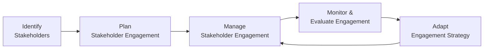

## 7.4 Monitoring and Adapting Stakeholder Approaches

Monitoring and adapting stakeholder approaches is an ongoing effort to ensure that stakeholder needs, preferences, and expectations remain aligned with the realities of your project environment. As projects evolve, new stakeholders may enter the picture, existing stakeholders may gain or lose influence, and project priorities may shift. Active, consistent monitoring and rapid adaptation are key to preserving positive relationships and securing stakeholder support throughout the life cycle. This section delves into the strategies, tools, and best practices required to continually assess stakeholder engagement levels—and take corrective or preventive actions to maintain alignment with project goals.

This section spans the entire spectrum of project management approaches—predictive, hybrid, and agile—and links closely to the Stakeholder, Team, and Business Environment domains. By understanding the principles, techniques, and frameworks outlined here, you can anticipate stakeholder shifts, tailor communication strategies, and preserve stakeholder confidence in alignment with PMI’s project management standards and principles.

  
### Why Continuous Monitoring Matters

Stakeholder engagement is not a one-time planning exercise. Factors such as organizational changes, market dynamics, regulatory environments, and team composition shifts can dramatically alter stakeholder priorities. Failure to adapt can lead to:

- Misaligned expectations and unmet requirements  
- Delayed or ineffective decision-making  
- Increased project risks due to stakeholder dissatisfaction  
- Erosion of trust in project leadership  

By establishing clear feedback mechanisms and regularly revisiting stakeholder interactions, you not only mitigate these risks but also create an environment conducive to stakeholder loyalty, faster consensus, and more efficient resource allocation.

  
### Key Principles Underlying Stakeholder Monitoring

While there is no “one-size-fits-all” method, the following principles consistently help project managers proactively adjust stakeholder engagement:

• Stewardship and Ethical Conduct: Treat all stakeholders with respect, confidentiality, and integrity when gathering feedback and making adjustments. This fosters trust and ethical consistency.

• Collaboration and Involvement: Encourage open dialogues, active listening, and mutually beneficial communication channels that make stakeholders comfortable sharing emerging concerns.

• Systems Thinking and Complexity: Recognize that stakeholder attitudes do not evolve in isolation. Broader interdependencies—involving technology, market forces, and organizational factors—can also shift stakeholder interests.

• Adaptability and Resilience: Embrace flexible frameworks and quick feedback loops, particularly in agile and hybrid environments, to respond effectively to new stakeholder inputs.

• Continuous Improvement: Regularly refine engagement strategies based on lessons learned. Document outcomes and triggers that mandate adjustments, ensuring lessons are captured for future endeavors.

  
### Inputs for Monitoring Stakeholder Engagement

Monitoring stakeholder engagement relies on multiple inputs, including:

• Stakeholder Register: Documents each stakeholder’s classification, influence, expectations, and risk tolerance. Updating the register as new stakeholders emerge or roles shift is a critical first step.

• Stakeholder Engagement Plan: Defines methods and frequency of communications, conflict resolution processes, escalation pathways, and the metrics used to gauge stakeholder satisfaction over time.

• Communications Management Plan: Outlines the modalities, intervals, and responsibilities for sharing project-related information, ensuring that messages reach the right people at the right time.

• Project Metrics and Feedback: Quantitative metrics—such as attendance at key meetings or acceptance of deliverables—and qualitative feedback—via surveys, interviews, or informal chats—provide insights into stakeholder buy-in.

• Organizational Process Assets (OPAs): Historical stakeholder communication logs, previous project archives, and standard templates may hint at repeating stakeholder behaviors.

• Enterprise Environmental Factors (EEFs): Internal and external regulations, corporate structures, or global influences (e.g., remote work, cross-border teams) may shape stakeholder needs.

  
### Methods and Techniques for Measuring Engagement

Below are common techniques used to measure how well stakeholders are engaged over the course of a project:

**1. Stakeholder Engagement Assessment Matrix**  
This classic tool tracks and compares a stakeholder’s current vs. desired engagement level. Categories typically range from “Unaware” to “Leading.” Changes in these states over time indicate whether your engagement strategies are working or need modification.

| Stakeholder      | Current Engagement  | Desired Engagement | Possible Strategies                                         |
|------------------|---------------------|--------------------|-------------------------------------------------------------|
| Executive Sponsor| Supportive          | Leading            | Regular strategy meetings, sponsor roadshows, vision align. |
| End User Group   | Resistant          | Neutral            | Feedback sessions, user advocacy, pilot testing.             |
| Regulatory Body  | Neutral            | Supportive         | Frequent compliance updates, official audits, Q&A sessions.  |
| IT Department    | Supportive          | Supportive         | Bi-weekly technical reviews, maintain status quo.            |

**2. Surveys and Interviews**  
Structured surveys capture stakeholder satisfaction levels, pain points, and suggestions. One-on-one interviews allow deeper exploration of stakeholder concerns and motivations. In agile environments, you might conduct frequent feedback loops after each iteration for direct, real-time input.

**3. Observations and Issue Logs**  
Monitoring how actively or passively stakeholders participate in meetings, respond to emails, or contribute resources can yield valuable insight. If you notice repeated absences or ignored emails, it might signal stakeholder disengagement. Issue logs that track complaints, requests, or repeated misunderstandings offer clues to deeper stakeholder concerns.

**4. Engagement Analytics**  
For geographically dispersed or virtually connected teams, analytics can measure communication channel usage, such as read receipts, click-through rate on shared project portals, or collaborative board interactions (e.g., how often a stakeholder visits or updates the Kanban board). This data can help gauge the real level of involvement across multiple digital platforms.

**5. Workshops and Reviews**  
Planning and review workshops are particularly effective in hybrid and agile projects. Frequent release or sprint reviews invite constructive feedback, leading to timely refinements in stakeholder engagement activities.

  
### Adapting Stakeholder Approaches

Once you’ve gathered data on stakeholder engagement, the next step is to refine your strategies. Adaptation spans communication channels, content messaging, negotiating styles, meeting cadence, and even the cultural sensitivities you address.  

**1. Tailoring Communication**  
- Revise the frequency and format of status updates. Some stakeholders may respond better to quick, visual dashboards rather than lengthy reports.  
- Adapt the communication tone. Highly analytical stakeholders may require data-heavy updates, while others may prefer high-level summaries.  

**2. Updating Roles & Responsibilities**  
- Introduce new roles if the project has grown in complexity. For instance, a “Stakeholder Liaison Officer” can be assigned for large, enterprise-level projects.  
- Realign existing roles if you notice certain team members are more effective at building consensus with specific stakeholder groups.  

**3. Realigning the Stakeholder Engagement Matrix**  
- If a stakeholder’s support is waning, design targeted strategies (i.e., deeper involvement in solution validation) to move them from “Neutral” back to “Supportive.”  
- If new stakeholders with significant power or influence are introduced, swiftly adapt your approach to integrate their feedback, address any concerns, and harness their advocacy if possible.

**4. Conflict Resolution and Negotiation**  
- Facilitate prompt and constructive conflict resolution sessions. Use negotiation strategies to find common ground or escalate promptly when needed.  
- Apply advanced methods like principled negotiation, focusing on interests over positions to arrive at mutually satisfactory solutions.

**5. Continuous Risk Assessment**  
- Recognize that stakeholder attitudes often generate or mitigate risks. If a key stakeholder is growing resistant, risk probabilities and impacts may escalate.  
- Integrate stakeholder data into your risk management processes. For example, a risk register may output recommended communications risk responses.

  
### Adaptive Strategies in Different Delivery Approaches

**Predictive (Waterfall) Context**  
In more traditional lifecycles, stakeholder engagement adjustments occur at phase gates or milestone reviews. The project manager’s role is to ensure that each phase’s deliverables align with expectations established by the stakeholders at the initiation or planning stage. Kick-off meetings and scheduled reviews are prime points for monitoring changes in stakeholder sentiment.

**Agile Context**  
Agile teams rely on frequent, iterative feedback to sense shifts in stakeholder priorities quickly. Ceremonies like sprint reviews or retrospective sessions provide stakeholders a forum to influence immediate adjustments. Agile fosters ongoing, transparent communication, enabling dynamic and seamless adaptation.

**Hybrid Environments**  
A hybrid approach merges predictive milestones with agile iterations. Stakeholder monitoring can blend agile-like sprints (for quickly adapting engagement approaches) with traditional phase gates (for broader directional decisions). These cross-approaches drastically reduce the lag in stakeholder communication and ensure continuous alignment with business objectives.

  
### Common Pitfalls and Challenges

- **Overlooking Silent Stakeholders**: Some influential stakeholders may linger in the background. Failing to seek input from these passive decision-makers can blindside your project when they suddenly intervene.  
- **Infrequent Review of Engagement Data**: Gathering feedback without analyzing trends or implementing corrective actions is a wasted opportunity.  
- **Treating All Stakeholders the Same**: Different stakeholders have different motivations, communication preferences, and risk thresholds. A uniform approach misses important nuances.  
- **Misinterpreting Cultural Cues**: Global or multicultural teams may interpret communication style and engagement signals differently. Ignoring cultural dimensions can lead to misunderstanding and disengagement.  
- **Poor Documentation and Knowledge Transfer**: If stakeholder feedback is not systematically documented and disseminated, valuable insights may be lost—especially if a key team member leaves or changes roles.

  
### Practical Tactics for Stakeholder Monitoring and Adaptation

• **Frequent Touchpoints**: Schedule recurring check-ins for key stakeholders. This does not necessarily translate to more meetings but rather purposeful engagement at the right intervals.  

• **Use “Daily Deltas”**: In agile, teams may briefly note daily changes or concerns relevant to stakeholder feedback. This keeps stakeholder stories from being lost amid sprint backlogs.  

• **Anonymous Feedback Channels**: Set up channels encouraging honest, unfiltered feedback. For instance, an online survey or suggestion box might reveal crucial issues that certain stakeholders hesitate to address directly.  

• **Focused One-on-Ones**: Periodically dedicate time to sit with major stakeholders individually. This fosters trust and allows you to probe deeper into the motivations behind any shift in engagement levels.  

• **Leverage Data Visualization**: Provide easy-to-interpret charts or dashboards that track stakeholder engagement metrics (e.g., feedback response rates, sentiment analyses from surveys) over time.  

• **Gradual Introduction of Adaptations**: Sudden, sweeping changes to engagement strategies can unsettle stakeholders. Incremental fine-tuning often yields more stable, lasting improvements.

  
### Visualizing the Stakeholder Monitoring Cycle

Below is a simple Mermaid.js diagram illustrating a common cycle for monitoring and adapting stakeholder engagement:

1. Identify Stakeholders: You begin by listing and classifying potential stakeholders.  
2. Plan Stakeholder Engagement: Develop strategies that match the needs, attitudes, and influence levels of each stakeholder.  
3. Manage Stakeholder Engagement: Implement the plan via communications, negotiations, and collaborative sessions.  
4. Monitor & Evaluate Engagement: Gather feedback and data to assess whether stakeholder concerns are satisfied.  
5. Adapt Engagement Strategy: Based on monitoring insights, refine or overhaul your approach to maintain alignment.  

  
### Real-World Example

Consider a technology startup deploying a new data analytics platform for multiple departments in a large corporation. Initially, the IT department appears enthusiastic, but as data security concerns emerge, their engagement moves from “Leading” to “Neutral.” The project manager notices a dropout in IT’s presence at sprint reviews. Through a combination of one-on-one calls and anonymous surveys, they discover that the stakeholder’s primary concern is data privacy. After adjusting the project plan to prioritize encryption and data compliance standards—and communicating these enhancements to the IT department—stakeholder engagement rises back to “Supportive” and eventually “Leading.”  

In this scenario, active monitoring exposed a shift in stakeholder sentiment, guiding the manager to proactively solve the root cause before it escalated into major project risks or delays.

  
### Conclusion and Next Steps

Monitoring and adapting stakeholder approaches is a continuous, iterative responsibility for project managers. By systematically gathering and analyzing feedback, tailoring communication methods, and taking decisive actions, you ensure that every stakeholder remains aligned with the project’s outcomes and strategic objectives. Whether your environment is predictive, agile, or hybrid, the ability to sense stakeholder “pulse” and respond appropriately will enhance trust, reduce conflicts, and drive sustained engagement. Ultimately, robust monitoring and adaptation strengthen project resilience and enable consistent delivery of value.

  
### References for Further Exploration

- Project Management Institute. “A Guide to the Project Management Body of Knowledge (PMBOK® Guide) – Seventh Edition.” PMI, 2021.  
- PMI. “Agile Practice Guide.” PMI, 2017.  
- PMI. “PMP® Exam Content Outline.”  
- Bridges, William. “Managing Transitions.” Da Capo Press, 2017.  
- Kotter, John. “Leading Change.” Harvard Business Review Press, 2012.  

---

## Master Your Skills: Stakeholder Monitoring & Adaptation Quiz



### Which of the following statements best describes continuous monitoring of stakeholder engagement?

- [ ] It is performed only during the initial project phase.  
- [x] It is an ongoing process to regularly evaluate and respond to changes in stakeholder needs.  
- [ ] It must be concluded before any deliverables can be accepted.  
- [ ] It is only necessary in agile projects, not predictive ones.  

> **Explanation:** Continuous monitoring is essential throughout the project life cycle, irrespective of approach, to detect changes in stakeholder needs or expectations and adapt strategies accordingly.

### Which technique is commonly used to categorize stakeholder engagement as Unaware, Resistant, Neutral, Supportive, or Leading?

- [ ] Responsibility Assignment Matrix (RAM)  
- [ ] Risk Assessment Matrix  
- [x] Stakeholder Engagement Assessment Matrix  
- [ ] Pareto Chart  

> **Explanation:** The Stakeholder Engagement Assessment Matrix is specifically designed to gauge and categorize stakeholders’ current and desired engagement levels in a structured way.

### In agile approaches, which ceremony is considered most effective for monitoring stakeholder engagement and gathering quick feedback?

- [x] Sprint Review  
- [ ] Iteration Retrospective  
- [ ] Grooming Session  
- [ ] Daily Standup  

> **Explanation:** Although retrospectives and grooming sessions are excellent for team reflection and backlog refinement, the Sprint Review is specifically intended to gather stakeholder feedback on the product increment, making it pivotal for monitoring engagement.

### What is a sign that a stakeholder may be disengaged?

- [ ] Frequent attendance and active participation in all meetings  
- [x] Absence from key meetings and lack of prompt responses to communication  
- [ ] Providing timely approvals and suggestions  
- [ ] Requesting more frequent project status updates  

> **Explanation:** Disengaged stakeholders often show minimal involvement, such as missing crucial meetings or taking excessive time to respond to simple communication requests.

### What is the appropriate first step if stakeholder feedback reveals a major new concern that impacts the project’s success criteria?

- [x] Document the issue, assess impact, and adapt the engagement approach as necessary  
- [ ] Immediately change the project’s scope without further analysis  
- [x] Escalate to upper management or sponsor if the concern is significant  
- [ ] Dismiss the concern unless it has direct budgetary impact  

> **Explanation:** Properly documenting concerns, analyzing their impact, and adapting your approach ensures that you address valid stakeholder issues. If the concern is critical, escalate promptly to keep the project on track.

### Which of the following is a common pitfall when trying to adapt stakeholder management strategies?

- [x] Treating all stakeholders uniformly, without considering their unique interests or power  
- [ ] Holding periodic workshops for feedback  
- [ ] Using real-time collaboration tools to gather stakeholder sentiment  
- [ ] Maintaining a flexible communication plan  

> **Explanation:** One-size-fits-all stakeholder strategies overlook the nuances of each stakeholder’s influence, motivation, cultural background, or engagement preferences.

### Which of the following methods helps identify patterns of stakeholder participation over time?

- [x] Trend analysis of attendance and response logs  
- [ ] Cost-Benefit Analysis  
- [x] Sentiment analysis of stakeholder communications  
- [ ] Parametric Estimating  

> **Explanation:** Logging attendance in meetings or analyzing communication frequency and tone over time can reveal whether the stakeholder is becoming more neutral, resistant, or supportive of the project. Sentiment analysis can further quantify changes in tone or attitude.

### When working with a newly identified stakeholder who has high power and interest, but has been brought in late, the best approach is to:

- [x] Quickly establish communication channels and adapt engagement strategies to bring them up to speed  
- [ ] Avoid their involvement to prevent scope creep  
- [ ] Assign them low-priority tasks until they fully understand the project  
- [ ] Provide no formal updates as they arrived late in the project  

> **Explanation:** High-power, high-interest stakeholders can influence project success significantly. Quickly onboarding them, clarifying roles, and adapting communication ensures they are properly integrated and can contribute value.

### How can cultural nuances affect stakeholder monitoring?

- [x] Cultural differences can impact communication preferences, interpretation of statuses, and willingness to provide candid feedback  
- [ ] Cultural differences only matter in large-scale international projects  
- [ ] Culture has no bearing on stakeholder engagement or monitoring  
- [ ] Cultural differences should only be considered at project closing  

> **Explanation:** Cultural backgrounds can shape how stakeholders perceive communication methods, interpret feedback requests, and provide input. Recognizing and accommodating these nuances helps maintain respectful and effective engagement.

### True or False: In predictive projects, the stakeholder engagement approach does not need modifications once the plan is established.

- [x] False  
- [ ] True  

> **Explanation:** Even in predictive (traditional) projects, stakeholders’ needs and interests can evolve, necessitating updates to communication and engagement strategies throughout the project life cycle.



---

## PMP Mastery: 1500+ Hard Mock Exams with Full Explanations 

Looking to crush the PMP exam with confidence? Dive deep into 6 rigorous mock exams totaling 1500+ advanced-level questions, each accompanied by clear, step-by-step explanations. Hone your test-taking strategies, master complex topics, and build the resilience you need on exam day. Perfect for serious PMs aiming beyond fundamentals.

Enroll now:  
[PMP Mastery: 1500+ Hard Mock Exams with Exceptional Clarity & Full Explanations](https://www.udemy.com/course/pmp-2025/?referralCode=CF83A54BC86BE27F9AFE)

_Disclaimer: This course is not endorsed by or affiliated with the PMI examination authority. All content is provided purely for educational and preparatory purposes._
