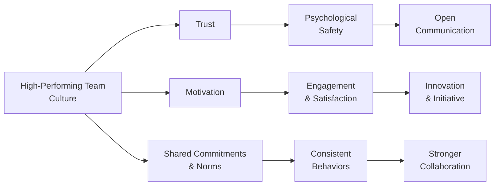

## 8.1 Building a High-Performing Team Culture

A high-performing team culture is the bedrock of successful projects, enabling managers to steer complex, dynamic initiatives by harnessing the collective energy and expertise of their teams. This culture is neither an accident nor solely the result of charismatic leadership; it arises from a deliberate effort to foster trust, support motivation, and establish a compelling set of shared commitments and norms. Within the Team Performance Domain (as highlighted in Chapter 8 of this book), building a strong team culture is pivotal to ensuring sustainable performance throughout the project life cycle.

In this section, you will learn how to create a team environment that inspires personal accountability, collaborative problem-solving, and a sense of shared ownership over goals and results. We will explore:

- Why trust is a cornerstone of effective collaboration.  
- How to sustain motivation and commitment within diverse teams.  
- Techniques for establishing shared norms and articulating team values.  
- Practical examples and case studies illustrating team culture in action.  
- Strategies to build resilience in rapidly changing project environments.  
- Common challenges, pitfalls, and best practices for overcoming them.  

Refer back to [Chapter 7: Stakeholder Performance Domain](../07-stakeholder-performance-domain), [Chapter 8.2: Leadership Styles, Conflict Resolution, and Motivation](../08-team-performance-domain), and [Chapter 33: Advanced Leadership and Team Development](../../07-advanced-topics-emerging-trends/33-advanced-leadership-and-team-development) for more discussion on leadership and team dynamics.

---

### Understanding a High-Performing Team Culture

A “high-performing team culture” is an environment where individuals align on shared objectives, trust each other’s competence and integrity, and willingly collaborate to resolve challenges. Beyond achieving project deliverables, this culture encourages continuous learning, adaptability to change, and a strong sense of accountability.

#### Key Characteristics

• Open Communication: Members feel safe to freely exchange ideas, share feedback, and challenge one another constructively.  
• Mutual Respect: Each member values different expertise areas, backgrounds, and perspectives.  
• Autonomy and Empowerment: Team members have the necessary authority to take initiative.  
• Resilience and Flexibility: The team can pivot in response to changes without losing focus.  
• Commitment to Excellence: Everyone is invested in delivering not just acceptable work, but outstanding results.

In practice, building such a culture hinges on three pivotal factors: trust, motivation, and shared commitments. Each factor interacts with the others to create a cohesive and dynamic environment where high performance becomes sustainable.

---

### The Role of Trust

Trust is the belief that the people around you will act in the interest of the team, remain competent, and uphold shared values. Without trust, communication falters, motivation wanes, and shared norms remain superficial. In high-trust environments, people are more willing to take risks, seek help, and share candid information.

#### Dimensions of Trust

1. Competence: Confidence that team members possess the skills and expertise to execute their responsibilities.  
2. Reliability: Belief that each individual consistently follows through on commitments and deadlines.  
3. Integrity: Assurance that team members act ethically and honorably.  
4. Empathy: Genuine understanding of colleagues as people, not merely project resources.

#### Building Trust in Practice

• Role Clarity: Make sure responsibilities and deliverables are crystal clear to avoid confusion that can erode trust.  
• Transparency: Share relevant information openly, including decisions, rationale, and potential impacts.  
• Consistent Actions: Align words with deeds—if a project manager commits to a specific action, follow through.  
• Psychological Safety: Encourage experimentation and treat mistakes as learning opportunities rather than reasons for reprimand.

---

### Sustaining Motivation

Motivation in a project context extends beyond basic incentives. Project managers can apply insights from various motivation theories (e.g., Maslow’s Hierarchy of Needs, Herzberg’s Two-Factor Theory, McClelland’s Needs Theory) to nurture an environment that sustains interest, energy, and engagement.

#### Intrinsic vs. Extrinsic Motivation

• Intrinsic Motivation: Driven by internal rewards such as personal growth, curiosity, and a sense of achievement. This often leads to higher engagement and creative solutions.  
• Extrinsic Motivation: Fueled by external rewards such as pay, promotions, or recognition. These can be powerful but sometimes temporary drivers.

#### Practical Strategies to Motivate Team Members

• Recognize and Celebrate Wins: Publicly acknowledge individual and team achievements, however small.  
• Offer Autonomy and Growth: Provide challenging tasks that stretch capabilities of individuals while supporting them through mentoring and training.  
• Clarify Purpose: Connect tasks to the broader organizational mission to highlight each member’s contribution.  
• Tailor Approaches: Understand personal drivers—some may crave recognition, others value schedule flexibility or professional growth opportunities.

---

### Establishing Shared Commitments and Norms

Shared commitments and norms entail collective agreements about how the team will communicate, make decisions, and handle conflict. These agreements act as a social contract, guiding both day-to-day interactions and critical decisions.

#### Examples of Shared Norms

• Communication Norms: “We will respond to project-related emails within 24 hours.”  
• Conflict Resolution Agreement: “We will address conflicts directly, propose solutions, and avoid personal attacks.”  
• Decision-Making Procedures: “Major milestones require consensus; smaller tasks can be delegated to subteams or individuals.”  

#### Elements of Shared Commitments

• Aligned Goals: Ensuring every individual understands and supports the project’s objectives.  
• Common Language: Defining terms to avoid misunderstandings, especially in cross-cultural teams.  
• Values in Action: Translating stated values—like respect or continuous improvement—into tangible behaviors.

Below is a simple Mermaid diagram that illustrates how trust, motivation, and shared norms intersect to form a high-performing team culture:

In this visualization, trust leads to a deeper sense of psychological safety, motivation fuels engagement, and shared norms guide consistent behaviors. The interplay of these elements ultimately leads to an environment conducive to innovation, collaboration, and sustainable project success.

---

### Fostering a High-Performing Team Culture: A Practical Framework

Team culture thrives when you integrate clear processes with supportive leadership. In project management, you can follow a structured approach to culture-building:

#### 1. Define the Vision and Values

Begin by clarifying the project vision: “What are we trying to achieve, and why does it matter?” Align this vision with the organization’s overarching mission. Identify core values—like respect, learning, or innovation—in a workshop that involves the entire team.

#### 2. Establish Norms and Expectations

Once the vision is set, translate values into working agreements. For instance, “Respect” could become “We will listen actively and avoid interrupting.” Document these norms in a Team Charter, ensuring everyone actively participates in drafting and refining it.

#### 3. Set Clear Roles and Responsibilities

Eliminate ambiguity about who owns which tasks. Transparent responsibilities reduce overlaps, equip people with decision-making authority, and prevent inefficiencies. This clarity fortifies trust because everyone knows they can rely on each other to fulfill their commitments.

#### 4. Promote Open Communication

Adopt collaboration tools and communication platforms that suit the project’s needs:  
- For co-located teams, use face-to-face stand-ups or daily huddles.  
- For distributed teams, leverage video conferencing and project management software.  

Emphasize candor: encourage people to express concerns early, even if it means sharing unwelcome news.

#### 5. Provide Constructive Feedback

High-performing teams thrive on timely, actionable feedback. Foster an environment in which feedback is perceived as an opportunity to grow rather than criticism. Use a constructive framework—e.g., keep it specific, focus on behaviors rather than personalities, and pair suggestions for improvement with affirmative support.

#### 6. Celebrate Milestones and Show Appreciation

Small wins, such as reaching a sprint goal or meeting a milestone under budget, can re-energize the team. Recognitions need not be monetary; personalized acknowledgments and simple ceremonies (like a short celebration at the end of a successful sprint) build positivity, increase motivation, and promote unity.

---

### Case Study: Revitalizing a Troubled IT Project

A large financial institution embarked on a mission-critical IT project to modernize its loan processing system. Six months in, the project ran behind schedule, morale was low, and turnover was high. The new project manager, Felicia, applied the following steps:

1. She conducted a no-blame retrospective, inviting candid feedback from team members and stakeholders.  
2. Felicia worked with the team to create a set of guiding principles, including “We solve problems, not assign blame.”  
3. She initiated brief daily stand-up calls using a video conferencing platform, increasing visibility of progress and challenges.  
4. The team reviewed tasks and responsibilities, making sure everyone understood their role and how it contributed to project goals.  
5. Senior management was encouraged to recognize milestones, reinforcing positive behavior and acknowledging improvement in the project culture.  

Within three months, the team’s morale rallied. Turnover stabilized, and the project was back on track to meet critical deliverables. Felicia’s trust-building exercises, transparent communications, and clear expectations re-invigorated the team culture.

---

### Pitfalls and Common Challenges

Even well-managed teams face hurdles in building and sustaining high-performance cultures. Preventing or overcoming these pitfalls can save substantial resources and morale:

• Micromanagement: Erodes trust and stifles initiative. Let people solve problems, only intervening when absolutely necessary.  
• Inconsistent Leadership: Team members become confused if leaders or sponsors frequently change their minds or contradict previously stated values.  
• Lack of Follow-Up on Norms: If shared commitments are ignored or violated without consequences, norms lose their power.  
• Unresolved Conflicts: Minor disagreements can escalate if not promptly and respectfully addressed.  
• Cultural and Language Barriers: In global or cross-functional teams, remember to adjust communication style to avoid misunderstandings.

---

### Best Practices for Cultivating a Lasting Team Culture

• Engage in Continuous Check-Ins: Regularly revisit team norms to assess relevance in the project’s evolving context.  
• Integrate Learning Loops: Use retrospectives, lessons learned, or after-action reviews to capture insights and adapt norms.  
• Encourage Peer Coaching and Mentoring: Foster reciprocal learning where experienced members guide newer or less experienced colleagues.  
• Maintain Visibility: Display team values, norms, and progress metrics on digital dashboards or physical charts if applicable.  
• Combine Formal and Informal Gatherings: Schedule team-building exercises, social events, or knowledge-sharing sessions to nurture camaraderie.

---

### Real-World Tools and Techniques

Below are some recommended tools and approaches to reinforce a high-performing team culture in practice:

• RACI Matrix (Responsible, Accountable, Consulted, Informed): Helps clarify responsibilities and avoids confusion.  
• Team Charter: Outlines mission, values, communication protocols, and conflict-resolution methods.  
• Collaboration Tools: Platforms like Slack, Microsoft Teams, or Trello facilitate transparent and frequent communication.  
• Daily Stand-Ups: Short, focused meetings that keep tasks aligned and surface issues early.  
• Retrospectives: Sessions that enable continuous improvement by reflecting on what is working and what needs changing.

---

### Looking Ahead

In the subsequent sections of the Team Performance Domain, you will further explore:  
- [8.2 Leadership Styles, Conflict Resolution, and Motivation](./8.2-leadership-styles-conflict-resolution-motivation) – Dive further into various leadership approaches and conflict resolution tactics.  
- [8.3 Servant Leadership and Self-Organizing Teams](./8.3-servant-leadership-self-organizing-teams) – Learn how to empower teams to assume greater ownership over deliverables.  
- [8.4 Virtual Teams and Cross-Cultural Collaboration](./8.4-virtual-teams-cross-cultural-collaboration) – Explore best practices for engaging globally dispersed teams.

Building a high-performing team culture is not a one-time event. It is an ongoing, evolutionary effort requiring deliberate leadership and continuous reinforcement. The payoff, however, can be extraordinary: a cohesive, engaged, and agile team that quickly adjusts to changes, consistently delivers value, and drives the project to a successful outcome.

---

### References and Further Exploration

• PMI. A Guide to the Project Management Body of Knowledge (PMBOK® Guide) – Seventh Edition.  
• PMI. Agile Practice Guide.  
• Lencioni, Patrick. The Five Dysfunctions of a Team: A Leadership Fable.  
• Katzenbach, Jon R. and Smith, Douglas K. The Wisdom of Teams: Creating the High-Performance Organization.  
• Harvard Business Review. Articles on Team Culture and Leadership.  
• [Chapter 33: Advanced Leadership and Team Development](../../07-advanced-topics-emerging-trends/33-advanced-leadership-and-team-development) for insights on emotional intelligence and coaching.

---

## Test Your Knowledge of Building a High-Performing Team Culture



### Which of the following is a key component of trust in a high-performing project team?

- [ ] Having identical personalities within the team
- [ ] Strict hierarchical roles
- [x] Demonstrating reliability and integrity
- [ ] Encouraging competition over collaboration

> **Explanation:** Trust is built when team members demonstrate consistent reliability and integrity toward one another. Hierarchical or competitive environments often undermine authentic trust within a project team.

### What is an important benefit of ensuring strong psychological safety within a team?

- [x] Members feel comfortable sharing ideas and concerns without undue fear.
- [ ] Conflicts are avoided entirely.
- [ ] Communication is strictly regulated by the project manager.
- [ ] No mistakes or failures occur on the project.

> **Explanation:** Psychological safety empowers team members to speak openly, which fosters collaboration, innovation, and early problem identification. Total avoidance of conflict or mistakes is neither realistic nor beneficial for growth.

### Which of the following strategies can effectively boost intrinsic motivation among team members?

- [x] Assigning challenging tasks that expand personal development
- [ ] Imposing longer work hours to drive higher output
- [ ] Mandating public recognition for every minor action
- [ ] Limiting team communication to prevent distractions

> **Explanation:** Offering tasks that stretch individuals’ abilities fosters a sense of accomplishment and growth, thereby fueling intrinsic motivation.

### What is the primary purpose of establishing shared norms within a project team?

- [x] To create a set of agreed-upon behaviors and expectations
- [ ] To give the project manager total control
- [ ] To discourage creativity and feedback
- [ ] To replace formal project documentation

> **Explanation:** Shared norms define how team members will collaborate, communicate, and handle conflict. They support a respectful workspace and keep everyone aligned on expected behaviors, complementing (not replacing) formal documentation.

### A project manager who micromanages the team is likely to cause which of the following outcomes?

- [x] Diminished trust and stifled creativity
- [ ] Faster project delivery
- [x] Increased resentment and potential turnover
- [ ] Clearer distribution of tasks

> **Explanation:** Micromanagement can erode trust, cause stress, reduce motivation, and potentially drive talented individuals away. Although it might provide short bursts of control, it rarely leads to sustainable, positive project outcomes.

### Why is clarifying roles and responsibilities crucial for building a high-performing team culture?

- [x] It minimizes confusion and overlaps in tasks.
- [ ] It ensures every team member does exactly the same job.
- [ ] It enables the project manager to avoid feedback sessions.
- [ ] It removes the need for stakeholder communication.

> **Explanation:** When everyone knows who is responsible for each task, accountability and efficiency improve. This clarity helps build trust and prevents unproductive duplication of efforts.

### How can a project manager encourage open communication in a virtual or distributed team setting?

- [x] Leveraging reliable collaboration tools and regular video conferencing
- [ ] Restricting meeting invites to senior management only
- [x] Scheduling brief daily or weekly check-ins
- [ ] Refraining from sharing difficult updates to avoid team anxiety

> **Explanation:** Consistent use of collaboration tools, combined with short, focused meetings, fosters transparency and connection, even when teams are geographically dispersed.

### Which scenario best illustrates a healthy approach to giving feedback?

- [x] Providing specific, actionable input focusing on the team member’s behavior
- [ ] Offering only vague praise like “good job” to avoid confrontation
- [ ] Pointing out personal flaws in a team meeting to ensure accountability
- [ ] Delivering feedback only after project completion to minimize conflicts

> **Explanation:** Effective feedback is timely, specific, and constructive, focusing on behaviors rather than personal traits. Public shaming or waiting until the end of the project prevents meaningful real-time improvements.

### How can team celebrations and small recognition events contribute to cultural development?

- [x] They reinforce positive behaviors and boost morale.
- [ ] They promote competition among team members.
- [ ] They should be avoided due to time constraints.
- [ ] They solely serve as formalities for upper management.

> **Explanation:** Celebrating milestones and achievements can galvanize the team, reaffirm shared values, and energize members to continue performing at a high level.

### True or False: Shared commitments in a team are only useful for large, enterprise-level projects.

- [x] True
- [ ] False

> **Explanation:** Shared commitments are effective across all types and sizes of projects. While especially critical in larger or more complex projects, the principles also scale well to smaller teams, forming a strong basis for collaboration and accountability.



---

## PMP Mastery: 1500+ Hard Mock Exams with Full Explanations 

Looking to crush the PMP exam with confidence? Dive deep into 6 rigorous mock exams totaling 1500+ advanced-level questions, each accompanied by clear, step-by-step explanations. Hone your test-taking strategies, master complex topics, and build the resilience you need on exam day. Perfect for serious PMs aiming beyond fundamentals.

Enroll now:  
[PMP Mastery: 1500+ Hard Mock Exams with Exceptional Clarity & Full Explanations](https://www.udemy.com/course/pmp-2025/?referralCode=CF83A54BC86BE27F9AFE)

_Disclaimer: This course is not endorsed by or affiliated with the PMI examination authority. All content is provided purely for educational and preparatory purposes._
