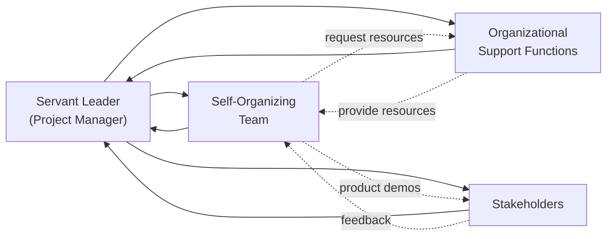

## 8.3 Servant Leadership and Self-Organizing Teams

Servant leadership has emerged as a transformative approach that enables project managers to lead with empathy, empower individuals, and create a culture of ownership. In tandem, self-organizing teams thrive when individuals have the autonomy and confidence to coordinate their own work. This synergy between servant leadership and self-organization lies at the very core of many modern frameworks, including agile and hybrid methodologies. In the context of the Team Performance Domain (see Chapter 8 of this guide), understanding how to cultivate these leadership traits and team characteristics is crucial for delivering successful projects.

By reading this section, you will learn how to:
- Define the essential principles of servant leadership.  
- Foster self-organizing teams that thrive on trust, autonomy, and shared accountability.  
- Elevate team performance through empathy, facilitation, and supportive leadership.  
- Identify common barriers to self-organization and effective strategies to address them.  

This knowledge will help you answer PMP® exam questions that relate directly to the People Domain, especially scenarios testing your ability to empower, motivate, and guide teams toward exceptional performance. It also equips you to lead effectively in real-world projects, whether you operate in a predictive, agile, or hybrid environment.

### Understanding Servant Leadership

Servant leadership is a philosophy coined by Robert K. Greenleaf in his 1970 essay, “The Servant as Leader.” This leadership style inverts the traditional power hierarchy by prioritizing the needs of team members and stakeholders first, enabling them to grow and perform optimally. In project management, a servant leader sets a vision, then devotes energy to removing barriers and fostering an environment where the team is both comfortable and motivated to accomplish objectives.

Traditional leadership, especially in hierarchical contexts, often relies on command-and-control. In contrast, a servant leader:  
- Facilitates decision-making rather than dictating decisions.  
- Encourages collaboration and shared ownership.  
- Acts as a steward and champion for the team’s well-being and success.  
- Serves as a coach and mentor, developing the skills and capabilities of the team.  

#### Key Attributes of a Servant Leader

1. Empathy:  
   A servant leader seeks to understand the perspectives and feelings of team members, creating an environment where people feel valued and respected.

2. Listening:  
   Active listening helps unearth hidden impediments or challenges. By allowing each team member to speak openly, a servant leader gains deeper insight and can take more informed actions.

3. Awareness:  
   Being aware of oneself and others is critical. This includes emotional intelligence, cultural sensitivity (discussed further in Chapter 33 on Advanced Leadership and Team Development), and a keen understanding of organizational dynamics.

4. Conceptualization:  
   Servant leaders can articulate both the short-term tasks and the long-term vision. By balancing these perspectives, they keep the team aligned without micromanaging.

5. Stewards of Trust:  
   Trust is often the “fuel” of high-performing teams. Servant leaders encourage an environment where individuals feel psychologically safe (see example references in Chapter 33), able to voice concerns and propose innovative ideas.

6. Commitment to Growth:  
   Developing team members is a central tenet of servant leadership. A servant leader invests in training, mentoring, and coaching. This growth mindset pays dividends in resilience, adaptability, and team satisfaction.

### Self-Organizing Teams: A Pillar of Modern Project Management

Self-organizing teams are collections of individuals who assume responsibility for planning and managing their own tasks, often derived from a shared backlog of work. The roles of project manager or scrum master in an agile context involve setting boundaries and goals, but day-to-day task management and decision-making are largely left to the team. This structure, while seemingly hands-off, requires intentional leadership.

#### Benefits of Self-Organization

- Enhanced Ownership:  
  When the team decides how work is done, each member “owns” the process and results. This fosters accountability and higher-quality deliverables.

- Speed of Execution:  
  Decision-making is decentralized, allowing the team to rapidly respond to obstacles and changes.

- Greater Innovation:  
  By allowing teams to determine their own approach, creativity flourishes. Team members experiment with various solutions independent of top-down directives.

- Improved Morale and Engagement:  
  Feeling autonomous can boost team satisfaction, reduce turnover, and nurture an environment where everyone is willing to go the extra mile.

#### When Self-Organization Works Best

Self-organizing approaches typically flourish in agile, iterative, or hybrid settings where requirements may shift, and rapid feedback loops are crucial. However, they are also applicable in more predictive or plan-driven projects where parts of the work can be delegated to sub-teams or specialized groups empowered to organize themselves. Critical success factors include:  
- Clear Vision and Shared Goals: Everyone understands what success looks like.  
- Psychological Safety: Team members feel safe expressing concerns, admitting mistakes, and proposing creative solutions.  
- Supportive Organizational Culture: Managers, sponsors, and executives endorse the team’s autonomy rather than seeking to control every detail.

### The Servant Leader’s Role in Self-Organizing Teams

Contrary to misconception, servant leadership is not passive. Servant leaders take a definite and active stance to shape the environment where self-organization thrives. Key responsibilities include:

- Removing Impediments:  
  Similar to a Scrum Master role, a servant leader scans for issues that block progress and actively clears them. This could be anything from office politics to resource constraints.

- Creating Psychological Safety:  
  By demonstrating respect, empathy, and emotional intelligence (see Chapter 33), the leader ensures people feel free to speak up, suggest improvements, and learn from failures.

- Facilitating Effective Communication:  
  Servant leaders maintain open channels of communication, mediate conflicts, and clarify misunderstandings before they escalate.

- Encouraging Continuous Improvement:  
  In agile frameworks like Scrum, continuous improvement happens through retrospectives. A servant leader encourages transparent feedback, ensuring that lessons learned become part of the team’s operational DNA.

### Practical Implementation Strategies

Bridging the gap between theory and practice involves adopting new habits, processes, and mindsets. Below are a few strategies to help you encourage self-organization through servant leadership:

#### Define Clear Objectives

Teams need clarity to operate autonomously. Provide a well-defined and achievable objective—whether it is a sprint goal in Scrum or a milestone in a predictive plan. Avoid micromanagement, but be certain everyone knows what they are working toward.

#### Distribute Authority Intentionally

It is not enough just to say “you are empowered.” Demonstrate it by delegating decision-making authority wherever practical. If you trust your technical leads to estimate tasks, let them do so without second-guessing each assumption.

#### Foster Shared Team Norms

Work with the team to establish norms and standards. For example, set expectations around daily check-ins, code reviews, or quality checks. These norms guide behavior without top-down enforcement, reinforcing the self-organizing dynamic.

#### Provide Mentoring and Coaching

Self-organization does not mean isolation. Regular coaching sessions help teams sharpen their collaboration and interpersonal skills. Offer gentle advice, constructive feedback, and relevant training opportunities when the team needs guidance.

#### Lead by Example

Project managers who adopt a servant leader posture set the tone for collaboration, trust, and reliability. Model the behavior you want to see—whether that is showing humility, acknowledging your own mistakes, or listening intently to a junior team member’s idea.

### Common Pitfalls and How to Overcome Them

Shifting to a servant leadership style and self-organizing culture can surface several challenges:

- Over-delegation or Under-delegation:  
  • Pitfall: A manager delegates too much too soon or holds on to too much decision-making out of fear of losing control.  
  • Solution: Find the right balance by gradually granting autonomy. Start with smaller decisions and progressively hand over bigger ones as the team builds confidence and competence.

- Lack of Accountability:  
  • Pitfall: Autonomy without accountability may lead to confusion or blame-shifting.  
  • Solution: Implement transparent success metrics, such as clearly defined Key Performance Indicators (KPIs) aligned with project goals (see Chapter 13 on Measurement Performance Domain). Encourage regular reviews and sprint retrospectives to highlight accountability.

- Resistance from Team Members:  
  • Pitfall: Some individuals may be accustomed to directive leadership. Shifting to self-organization can create uncertainty for those hesitant to make decisions.  
  • Solution: Conduct early training sessions to introduce the concept of self-organization. Provide ongoing mentorship, and emphasize the benefits for career development and job satisfaction.

- Organizational Misalignment:  
  • Pitfall: Even if the project manager is committed to servant leadership, upper management might still expect command-and-control.  
  • Solution: Educate stakeholders about the benefits of self-organization and the improved outcomes it can generate. Present data, such as faster deliveries or higher team morale, to win support.

- Unskilled or Unformed Teams:  
  • Pitfall: A self-organizing structure without sufficient skill diversity or cross-training can develop skill bottlenecks and lead to frustration.  
  • Solution: Invest in people. Encourage cross-functional learning, pair-programming (in software contexts), or shadowing opportunities so that skill sets become more evenly distributed.

### Case Study: Software Development Team Embraces Servant Leadership

Imagine a small software company launching an innovative application for supply chain logistics. The project manager, aware that market demands are fluid, decides that a self-organizing structure is the best path toward innovation and speed.

1. Setting the Environment:  
   - The project manager clarifies the product vision: a highly scalable mobile app for optimizing warehouse operations.  
   - The team sets a “Definition of Done” for each feature and aligns on coding standards.

2. Delegating Authority:  
   - Technical leads take on architecture decisions. The project manager does not impose solutions but asks guiding questions about scalability and risk.

3. Removing Impediments:  
   - Legacy systems were causing data migration issues. The project manager liaises with the IT department to accelerate provisioning of development environments.

4. Team Autonomy in Action:  
   - The developers hold daily stand-ups to discuss progress and blockers, reassigning tasks among themselves as needed.  
   - Designers and QA staff frequently collaborate on prototypes without waiting for formal approvals.

5. Outcome:  
   - The team develops a series of minimal viable products (MVPs) quickly. Frequent demos to internal stakeholders yield rapid feedback, significantly improving time-to-market.

6. Reflection:  
   - During retrospectives, team members highlight that having the freedom to solve problems spurred greater creativity.  
   - The project manager fosters a positive, safe culture by celebrating successes and framing mistakes as learning opportunities.

### Visualizing Servant Leadership in Action

Below is a simple Mermaid diagram illustrating how a servant leader stands at the center of communication, ensuring alignment, and facilitating support for a self-organizing team while also keeping stakeholders informed.

Explanation of the Diagram:
1. A["Servant Leader  (Project Manager)"] consistently interacts with both the team (B) and stakeholders (C). The servant leader facilitates communication, escalates issues, and removes impediments.  
2. B["Self-Organizing  Team"] has autonomy in daily tasks and direction, but regularly checks in with the servant leader for strategic guidance and obstacle removal.  
3. C["Stakeholders"]—executives, customers, and end-users—provide feedback to ensure that deliverables meet expectations.  
4. D["Organizational  Support Functions"], such as finance or HR, provide resources or specialized expertise. The self-organizing team may directly request these resources, with the servant leader intervening as needed.

### Integrating Servant Leadership in Different Delivery Approaches

Although servant leadership is often associated with agile environments, its principles apply across predictive and hybrid methodologies:

- Predictive Environments:  
  In more traditional settings, a project manager can still demonstrate servant leadership by actively engaging with team members, listening to their concerns, and granting autonomy in certain areas (e.g., resource allocation for tasks). While the Gantt chart may define project phases, daily decisions on how tasks are performed can belong to the specialists.

- Hybrid Approaches:  
  Hybrid models combine the structure of predictive methods with the flexibility of agile sprints. A servant leader ensures the team has a stable plan for major milestones while empowering sub-teams or specialized squads to self-organize their task breakdown.

- Fully Agile Teams:  
  Scrum Masters or agile coaches embody servant leadership as they focus on removing impediments and fostering collaboration. Daily stand-ups, sprint reviews, and retrospectives are opportunities to practice and refine a servant leader approach.

### Best Practices for Servant Leaders and Self-Organizing Teams

- Clearly Align Project Goals with Organizational Strategy (Refer to Chapter 28):  
  Servant leadership is most effective when the entire organization recognizes and supports the project’s strategic value.

- Emphasize Continuous Learning and Feedback Loops:  
  Self-organizing teams excel when they frequently reflect on their process (as in a retrospective) and quickly adapt to changes. Set aside time for knowledge-sharing sessions or “lunch and learn” events.

- Maintain a Balance between Authority and Autonomy:  
  While pushing decision-making down, ensure critical decisions do not stall or remain unresolved. A servant leader must sometimes step in to facilitate or mediate to keep progress on track.

- Invest in Emotional Intelligence (see Chapter 33):  
  For the team to trust your leadership, develop empathy and master conflict resolution skills. This is central to building relationships that support self-organization.

- Measure Outcomes, Not Activities:  
  By focusing on results rather than micromanaging each task, the project manager fosters an environment that respects each contributor’s expertise and encourages personal accountability (see Chapters 13 and 37 for more on performance metrics and key formulas).

### Conclusion

Servant leadership, coupled with self-organizing teams, stands at the forefront of contemporary project management. By prioritizing the growth, well-being, and autonomy of individuals, project managers can create conditions where innovation flourishes and accountability is shared. In this dynamic, the role of the leader shifts from one of command-and-control to facilitation, mentorship, and support. Teams, in turn, become more engaged, resilient, and capable of navigating the uncertainties that frequently arise in complex projects.

Embracing this leadership style and encouraging self-organization can be challenging in organizations steeped in hierarchical culture, but the payoff—increased agility, faster time-to-market, and higher team morale—is well worth the effort. Incorporating servant leadership practice into your day-to-day project environment prepares you not only for exam success but also for meeting the evolving demands of real-world project delivery.

### References

- Greenleaf, R.K. (1970). “The Servant as Leader.”  
- Project Management Institute. (2021). A Guide to the Project Management Body of Knowledge (PMBOK® Guide) – Seventh Edition.  
- Project Management Institute. (2017). Agile Practice Guide.  
- S. Sutherland & K. Schwaber. (2020). The Scrum Guide.  
- Chapter 8 & Chapter 33 of this guide for team performance, leadership styles, and emotional intelligence.  

## Test Your Knowledge: Servant Leadership & Self-Organizing Teams



### Servant leadership in project management focuses primarily on:
- [x] Boosting team capability by removing impediments and providing support.  
- [ ] Establishing strict hierarchical structures.  
- [ ] Quickly assigning tasks to the most cost-effective resource.  
- [ ] Eliminating collaboration to increase efficiency.  

> **Explanation:** Servant leaders prioritize the team’s needs, focusing on removing hurdles and creating an environment of support that elevates overall performance.

### Which attribute is most essential for a servant leader?
- [ ] Strict control and authority.  
- [x] Empathy and concern for individual team members.  
- [ ] Delegating tasks without context.  
- [ ] Maximizing personal visibility.  

> **Explanation:** Empathy is central to servant leadership, allowing the leader to understand and address the needs of the team meaningfully.

### Self-organizing teams are characterized by:
- [x] Autonomy in decision-making and task management.  
- [ ] Rigid vertical reporting structures.  
- [ ] Minimal collaboration and an fixed chain of command.  
- [ ] Direct orders from senior management at each project milestone.  

> **Explanation:** Self-organizing teams plan, manage, and decide on their work collectively, whereas rigid structures are counter to self-organization principles.

### In a hybrid delivery approach, servant leadership can:
- [x] Balance structured milestones with autonomous sub-teams.  
- [ ] Restrict all decision-making to the Project Management Office.  
- [ ] Eliminate the need for performance reporting.  
- [ ] Prevent cross-functional collaboration.  

> **Explanation:** Hybrid environments can integrate predictive milestones with agile sub-teams that self-organize. A servant leader enables these sub-teams to function effectively.

### What is a major benefit of self-organizing teams?
- [x] Increased motivation and ownership among team members.  
- [ ] Reduced transparency and communication.  
- [x] Faster decision-making due to decentralized authority.  
- [ ] Reliance solely on top-down instructions.  

> **Explanation:** Self-organizing teams experience greater ownership and often make decisions quickly because they do not need to wait for hierarchical approval.

### Which of the following is NOT a common pitfall in adopting a servant leadership style?
- [ ] Over-delegation of authority to a team that’s not ready.  
- [ ] Persistent organizational misalignment.  
- [x] Enhancing trust and empathy among team members.  
- [ ] Lack of accountability and clarity.  

> **Explanation:** Enhancing trust and empathy is a positive characteristic, not a pitfall. The other options list challenges that can arise during adoption of servant leadership.

### When transitioning from a command-and-control style to a servant leadership style, the best approach is:
- [x] Gradually give teams more decision-making responsibilities and guide them.  
- [ ] Abruptly withdraw all oversight at once.  
- [x] Provide training and mentorship to ease the transition.  
- [ ] Keep all decisions strictly centralized to avoid confusion.  

> **Explanation:** A phased approach with training and mentorship is effective. Suddenly removing oversight is risky, while overly centralizing decisions undermines the move toward servant leadership.

### Which action best reflects a servant leader’s approach to conflict resolution?
- [ ] Issuing directives and punishing the parties involved.  
- [x] Facilitating dialogue and understanding between conflicting parties.  
- [ ] Ignoring conflict until it subsides naturally.  
- [ ] Conducting annual performance reviews to address conflict.  

> **Explanation:** Servant leaders play the role of facilitators, encouraging open communication to resolve conflicts constructively, rather than resorting to top-down commands.

### A software development team effectively practicing self-organization most likely:
- [x] Conducts regular stand-up meetings to plan and adapt tasks.  
- [ ] Waits for upper management to assign every task.  
- [ ] Enforces a strict rule that only senior developers can make decisions.  
- [ ] Prohibits the exchange of ideas among team members.  

> **Explanation:** Self-organizing teams benefit from regular, open communication (such as stand-ups) and collective decision-making.

### Serving the team includes:
- [x] True  
- [ ] False  

> **Explanation:** Servant leadership revolves around supporting each individual and removing obstacles, which means prioritizing the team’s welfare first.



## PMP Mastery: 1500+ Hard Mock Exams with Full Explanations 

Looking to crush the PMP exam with confidence? Dive deep into 6 rigorous mock exams totaling 1500+ advanced-level questions, each accompanied by clear, step-by-step explanations. Hone your test-taking strategies, master complex topics, and build the resilience you need on exam day. Perfect for serious PMs aiming beyond fundamentals.

Enroll now:  
[PMP Mastery: 1500+ Hard Mock Exams with Exceptional Clarity & Full Explanations](https://www.udemy.com/course/pmp-2025/?referralCode=CF83A54BC86BE27F9AFE)

_Disclaimer: This course is not endorsed by or affiliated with the PMI examination authority. All content is provided purely for educational and preparatory purposes._
