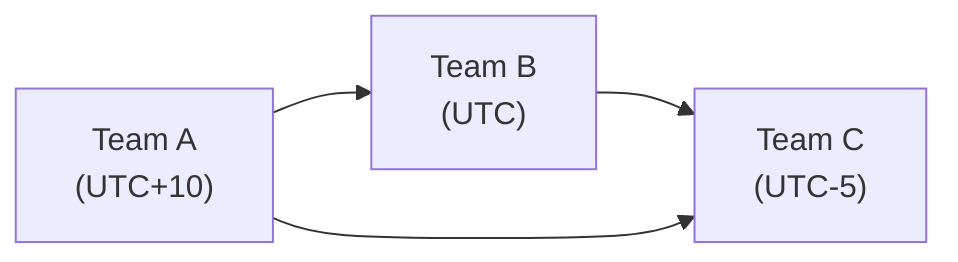

## 8.4 Virtual Teams and Cross-Cultural Collaboration

As business landscapes expand into global markets and organizations embrace remote work, project teams are increasingly spread across diverse geographies, cultures, and time zones. Virtual teams offer unique opportunities—access to broader talent pools, continuous project progress across different working hours, and enriched perspectives from cross-cultural collaboration. However, they also present significant challenges such as communication gaps, cultural misunderstandings, and technology complexities. In this section, we will examine the essentials of leading and participating in virtual teams, focusing on strategies for effective remote collaboration, bridging time zone differences, and fostering a harmonious cross-cultural environment.

### Importance of Virtual Teams in Today’s Project Environment

Virtual teams have become a cornerstone of modern project management, particularly in the context of agile work environments and distributed global projects. The People Domain (see Chapter 6: The PMP® Exam Domains, Tasks, and Enablers) now includes considerations for leading diverse, remote teams, reflecting the latest shifts in workplace dynamics. Additionally, the PMBOK® Guide Seventh Edition references the increasing need to tailor project management approaches for distributed teams—an approach that ensures projects remain relevant and competitive in the global economy.

Several factors drive the rise of virtual teams:
• Globalization and international partnerships.  
• Accelerated digital transformation.  
• Desire for flexible work-life balance.  
• Access to specialized skills around the world.  

While virtual teams can help organizations pursue strategic advantages (see Chapter 28: Aligning Projects with Organizational Strategy), leaders must address the complexities of managing culturally and geographically dispersed groups.

### Key Challenges of Virtual Collaboration

Leading and working in virtual teams involves specific challenges that may not always arise in co-located teams. Understanding these challenges is the first step to mitigating or preventing them. Common issues include:

• Communication and coordination. Virtual teams rely heavily on digital channels—email, instant messaging, video conferencing—which can impede quick clarifications or spontaneous brainstorming.  
• Trust building. In-person teams build trust through daily interactions, informal lunches, and spontaneous encounters. Virtual environments can slow that trust-building process if not carefully facilitated.  
• Cultural differences. Team members from different regions may have diverse communication styles, cultural norms, and expectations (see also Chapter 33: Advanced Leadership and Team Development).  
• Time zone gaps. Coordinating schedules among widely disbursed team members can challenge live collaboration, requiring asynchronous strategies.  
• Technology dependence. Technical hurdles may arise due to inconsistent internet access, software incompatibilities, or hardware limitations.  
• Social isolation. Remote workers can experience isolation or detachment from the project’s purpose without efforts to cultivate social interaction and team cohesion.  

Addressing these challenges requires a balanced approach that combines robust processes, relevant technology, and strong leadership practices.

### Foundations for Effective Remote Collaboration

Remote collaboration thrives when project managers, sponsors, and team members collectively establish supportive conditions. Key foundations include:

#### Clear Communication Protocols
• Select appropriate communication channels for different tasks, such as direct messaging for quick exchanges, video conferencing for brainstorming, and email for detailed documentation.  
• Set “communication norms,” such as response time expectations, meeting etiquette, and language conventions if multiple languages are involved.  
• Implement a “single source of truth” by using centralized document repositories, project management software, or knowledge-sharing platforms (see Chapter 16: Stakeholder and Communications Management).  

#### Robust Technology and Infrastructure
• Ensure that all team members have reliable internet connectivity, suitable hardware, and consistent software tools.  
• Provide training or guidelines on how to use collaborative applications (virtual whiteboards, file-sharing tools, etc.).  
• Maintain data security and confidentiality—using secured channels, encryption, and controlled document access.  

#### Defined Roles and Responsibilities
• Use virtual team charters or roles matrices to clarify who is responsible for specific deliverables or tasks (see Chapter 15: Integration Management).  
• Encourage team members to document clear ownership boundaries, ensuring each person understands how their work interrelates with others.  
• Revisit roles regularly and adapt as the project evolves or team members rotate.  

#### Cultivating Team Engagement
• Facilitate social introductions, either via text or short video sessions, to humanize each participant, their interests, and their backgrounds.  
• Encourage open conversation and recognition of milestones, birthdays, or other events that stimulate bonding.  
• Acknowledge and reward good performance publicly, further strengthening remote relationships.  

### Time Zone Coordination and Asynchronous Work

One of the most apparent hurdles in virtual teams is bridging time zone differences. Large gaps can create communication delays and reduce productivity if not proactively managed. Below are several proven strategies to address these challenges effectively:

• “Follow the Sun” approach. In global projects, utilize time zone offsets to enable work to progress nearly 24 hours a day, handing over tasks as each region’s workday ends.  
• Core overlap hours. Identify at least a small window when most or all team members are concurrently available for real-time collaboration. This helps with synchronous discussions and critical decisions.  
• Rotational meeting times. Rotate meeting times across regions so that the burden of inconvenient calls is shared equitably—no one region consistently holds late-night or early-morning meetings.  
• Asynchronous deliverables. Encourage the use of collaboration tools (such as shared documents, discussion boards, or project management platforms) where contributors can review and comment at their convenience.  
• Self-service reporting. Provide dashboards, trackers, or continuous integration pipelines so team members can check on progress without requiring direct communication.  

#### Diagram: Illustrative Time Zone Coordination

Below is an example of a simple flow illustrating how a “Follow the Sun” workflow might look between three distributed teams:

In this diagram, Team A based in a UTC+10 zone can hand off tasks at the end of their workday. Team B, working in the UTC zone, continues progress. Finally, Team C, located in a UTC-5 zone, picks up the next handoff. This approach can keep critical activities moving but demands precise coordination and thorough documentation.

### Cross-Cultural Communication and Collaboration

Cultural differences can enrich a project through diverse ways of thinking, unique problem-solving approaches, and heightened creativity. Yet, these differences can also create misunderstandings if not managed sensitively. Cultural norms can vary drastically in terms of hierarchy, communication style, time orientation (monochronic vs. polychronic), and attitudes toward authority and risk.

#### Fostering Cultural Awareness

• Provide cultural awareness training. Offer short sessions or interactive workshops that introduce team members to customs, etiquette, and communication norms of different cultures in the team.  
• Encourage curiosity and respect. Promote an environment where people feel comfortable asking questions about one another’s culture and clarifying potential misunderstandings.  
• Recognize holidays, religious events, and local observances—this fosters respect for local cultures while also helping to plan project schedules realistically.  

#### Communication Styles and Language Barriers
• Use plain language. Avoid jargon, idioms, or overly complex sentence structures that may not translate well.  
• Speak slowly and articulate clearly in meetings where participants may not be native speakers of the dominant language.  
• Summarize key points in writing. After important discussions, capture a quick written summary of decisions and action items.  

#### Building Trust and Psychological Safety

Trust is vital when you cannot see your colleagues in-person. Without trust, team members may withhold feedback, question decisions, or hesitate to share their true perspectives. Project leaders can nurture trust in virtual teams by:

• Encouraging open dialogue. Ask for opinions, emphasize that all contributions are valued, and moderate discussions to ensure everyone’s voice is heard.  
• Demonstrating consistency. Consistently meet commitments (e.g., sending materials on time, being punctual for virtual meetings).  
• Showing empathy. Recognize and accommodate the pressures of working with cultural or linguistic differences.  
• Facilitating relationship-building sessions. Arrange “virtual coffee breaks” or “fun breakouts” where team members can talk about non-work topics to bond on a personal level.  

### Practical Tools and Techniques for Virtual Teams

Project managers have an ever-growing suite of tools at their disposal. The choice of the right tool can significantly enhance the efficiency and quality of virtual collaboration.

| Tool/Technique                | Purpose                                            | Example Platforms                  |
|-------------------------------|----------------------------------------------------|------------------------------------|
| Video Conferencing            | Real-time discussions, visual cues, presentations | Zoom, Microsoft Teams, Google Meet |
| Collaborative Document Editing| Shared creation and review of project artifacts   | Google Docs, Office 365, Confluence|
| Project Management Software   | Task assignment, scheduling, progress tracking    | Jira, Trello, Asana, MS Project    |
| Virtual Whiteboards           | Brainstorming, storyboarding, creative ideation   | Miro, Mural                        |
| Learning Management Systems   | Cultural/skills training, compliance, e-learning  | Moodle, TalentLMS                  |
| Instant Messaging Apps        | Quick clarifications, group chat, file sharing    | Slack, Microsoft Teams Chats       |

#### Key Considerations for Tool Selection
1. Project Complexity. Agile software development projects might leverage specialized platforms (e.g., Jira) for backlogs and sprints, while smaller projects could suffice with simpler collaboration tools.  
2. Team Size and Structure. Large virtual teams may require more robust communication infrastructure, with dedicated channels for sub-groups.  
3. Integration with Existing Systems. Ensure new tools integrate seamlessly with existing platforms (e.g., single sign-on, version control, or data repositories).  
4. Data Security and Compliance. For heavily regulated industries or government projects, check compliance with data privacy and security regulations, as outlined in Chapter 31: Advanced Compliance and Regulatory Considerations.  

### Motivation and Engagement in Virtual Teams

Maintaining morale and engagement in a virtual setting requires deliberate effort. Without the informal social interactions of a shared office, project managers need to design opportunities for recognition, feedback, and social interaction:

• Gamification of tasks. Award badges or points for completing tasks on time or exceeding goals.  
• Daily or weekly “virtual stand-ups.” Even in non-agile environments, short daily or weekly catch-ups help maintain momentum and alignment (see Chapter 26: Key Agile Events and Artifacts).  
• Peer recognition boards. Encourage team members to publicly thank or highlight a colleague’s contribution.  
• Celebrate cultural diversity. Incorporate a “culture of the month” or host short group sessions where team members share traditions, local recipes, or interesting facts about their country.  

### Conflict Resolution in Distributed and Cross-Cultural Teams

Conflict can arise for many reasons: communication missteps, cultural misunderstandings, or misaligned objectives. In a virtual setting, it becomes especially important to address issues proactively:

• Early detection. Keep channels of communication open. Encourage team members to voice concerns before they escalate.  
• Direct discussions. Where possible, arrange real-time meetings rather than trading emails back and forth. Non-verbal cues (facial expressions, tone of voice) can help defuse conflict.  
• Cultural mediation. If conflict arises due to cultural differences, involve a neutral party with cross-cultural expertise or professional mediators.  
• Focus on common goals. Remind the team of higher-level objectives and the mutual benefits of successful collaboration.  

### Leadership in Virtual and Cross-Cultural Contexts

Leading a remote, cross-cultural team requires a blend of servant leadership, situational awareness, and adaptability. The best virtual leaders often exhibit:

• Empathy and Emotional Intelligence. Ability to sense underlying frustrations or unspoken concerns from remote team members.  
• Strong Digital Literacy. Familiarity with major collaboration tools and willingness to support team members’ learning curves.  
• Communication Mastery. Ability to convey complex ideas clearly and concisely, mindful of cultural backgrounds.  
• Flexibility and Diplomacy. Awareness that certain cultures value hierarchical communication while others prefer egalitarian structures; leaders adjust their management style accordingly.  
• Results-Oriented Approach. Effective virtual leaders measure performance based on outputs and outcomes, rather than physical presence or hours logged.  

Many of these principles echo the broader tenets of effective leadership covered in Chapter 8: Team Performance Domain and Chapter 33: Advanced Leadership and Team Development. Adapting them to the virtual environment is crucial for project success.

### Best Practices and Recommendations

1. Create a Team Charter Emphasizing Virtual Collaboration. Document rules for meeting schedules, communication protocols, decision-making processes, and conflict resolution.  
2. Use Transparent Virtual Kanban Boards (or equivalent). Provide real-time updates on task status, ensuring everyone remains aligned across time zones.  
3. Foster Inclusive Meetings. Rotate leading roles in meetings and use facilitation techniques (e.g., round-robin speaking) to ensure inclusive participation.  
4. Document Everything. Summaries, meeting minutes, decisions, and action items need consistent documentation. This is especially vital where real-time catch-ups are limited.  
5. Schedule Regular Retrospectives. Virtual teams benefit from frequent check-ins to evaluate how well the collaboration model is working, similar to sprint retrospectives in Agile.  
6. Encourage Cultural Mentorships. Pair team members from different regions to act as “cultural ambassadors” and build deeper mutual understanding.  

### Potential Pitfalls

• Over-reliance on Written Communication. Complex discussions can be prolonged or misunderstood if not taken offline to a synchronous channel.  
• Imbalanced Effort. Some team members may find themselves consistently making time-zone accommodations, leading to burnout.  
• Cultural Misinterpretations of Silence or Delays. In some cultures, silence might mean reflection; in others, it might be seen as disagreement. Clarify these nuances.  
• Technology Gaps. Assuming everyone has equal access to technology can create inequities—rural or less technologically oriented team members may lag.  

### Real-World Case Study: Global Product Launch Team

A multinational technology company formed a project team to coordinate a global product launch. The team included marketing specialists in the U.S. (UTC–5), a design group in the U.K. (UTC), and manufacturing liaisons in China (UTC+8). Communication bottlenecks threatened to delay the launch.

• The project managers established a rotating schedule of weekly “triads” where team representatives from each region would overlap by at least one hour. This rotation prevented the same region from always meeting at inconvenient times.  
• To overcome language barriers, the team adopted a standardized glossary for product specifications. They also integrated real-time translation tools.  
• The company championed “cultural days” where each region took turns sharing a local custom, food, or holiday tradition during virtual coffee breaks. This lighthearted exercise bonded the group.  

These efforts paid off in smoother collaboration, fewer misunderstandings about requirements, and a cohesive team spirit despite never meeting in person. The product launched on schedule across all target markets, achieving above-expected sales in the first quarter.

### References for Further Exploration

• PMI. (2021). “A Guide to the Project Management Body of Knowledge (PMBOK® Guide) – Seventh Edition.”  
• PMI Agile Practice Guide (2017). Project Management Institute.  
• Thomas, D. C., & Peterson, M. F. (2017). “Cross-Cultural Management: Essential Concepts.” SAGE Publications.  
• Harvard Business Review articles on remote teams and cross-cultural leadership (hbr.org).  
• Hofstede Insights for cultural dimension studies (hofstede-insights.com).  

By understanding and proactively managing the unique dynamics of virtual teams, project leaders can tap into global talent, maintain efficient workflows around the clock, and generate innovative solutions from culturally rich perspectives. As the trend toward distributed work arrangements grows, the ability to foster productive, cohesive virtual teams becomes a core competency for any aspiring project management professional.

---

## Test Your Knowledge: Virtual Collaboration and Cultural Dynamics Quiz



### Which of the following is a common challenge faced by virtual teams?

- [x] Building trust among team members in the absence of physical interaction
- [ ] Access to global talent pools
- [ ] Increased autonomy for all stakeholders
- [ ] Utilizing standardized project management software

> **Explanation:** While global talent pools are an advantage, a common stumbling block remains trust-building due to the lack of face-to-face interaction in virtual teams.

### Which strategy best addresses time zone differences?

- [x] Establishing core overlap hours and using asynchronous updates
- [ ] Limiting meetings entirely to text-based chats
- [x] Rotating meeting times across different regions
- [ ] Relying solely on email correspondence

> **Explanation:** Core overlap hours enable synchronous communication, while rotating meeting times distributes inconvenience equitably. Email alone often leads to delays, and text-based chats (without audio/video) may lose critical non-verbal cues.

### In a cross-cultural team, what is an effective method for fostering cultural awareness?

- [x] Conducting short training sessions on important cultural norms
- [ ] Assigning high-level decisions exclusively to managers from one culture
- [ ] Requiring everyone to speak English or the official language exclusively
- [ ] Avoiding discussions about cultural differences to prevent conflict

> **Explanation:** Providing education on cultural norms reduces misunderstandings. Encouraging cultural exchanges and respecting diversity fosters better team cohesion.

### How can a project manager effectively monitor ongoing progress in a virtual team?

- [x] Implement real-time dashboards and frequent, concise communications
- [ ] Only schedule a status meeting once per month
- [ ] Send lengthy email updates instead of concise summaries
- [ ] Assume all tasks are on track unless a team member complains

> **Explanation:** Real-time dashboards and regular short communications let the project manager detect issues earlier and maintain visibility over task progress in dispersed teams.

### What is the primary benefit of a “Follow the Sun” working model?

- [x] Maximizing near-continuous project progress by handing tasks across different time zones
- [ ] Ensuring at least one team member is always awake
- [x] Taking advantage of cultural differences for creativity
- [ ] Eliminating the need for synchronous meetings altogether

> **Explanation:** The "Follow the Sun" model hands off work tasks from one time zone to another, achieving near-continuous progress. It can also leverage diverse cultural perspectives, but it does not necessarily eliminate all synchronous meetings.

### Which of the following tools is particularly useful for real-time brainstorming among remote team members?

- [x] Virtual whiteboards
- [ ] Email filters
- [ ] Offline documents stored in local drives
- [ ] Desktop calculator apps

> **Explanation:** Virtual whiteboards like Miro or Mural allow teams to brainstorm visually and collaboratively in real time, offering shared boards and sticky notes.

### In cross-cultural virtual teams, how can conflicts stemming from misunderstandings be resolved most effectively?

- [x] Encouraging early detection, direct discussions, and neutral mediation
- [ ] Immediately sending emails to senior management
- [x] Ignoring the conflict until it escalates
- [ ] Reassigning tasks away from the involved parties

> **Explanation:** Addressing conflict early and openly is crucial. Neutral mediation and direct, open communication can uncover cultural misunderstandings and resolve them before they harm project outcomes.

### When communicating asynchronously in different time zones, what practice helps ensure consistent alignment?

- [x] Posting updates in shared channels with clear action items
- [ ] Requesting immediate responses to every emailed question
- [ ] Assuming team members will “catch up” on their own
- [ ] Reporting project updates only weekly

> **Explanation:** Publicly posted updates with clear steps or decisions help maintain alignment. Relying on immediate responses is impractical in different time zones, and sporadic reporting can cause delays.

### How can a project leader best ensure engagement and inclusivity during virtual meetings?

- [x] Rotating facilitation roles and using round-robin contributions
- [ ] Inviting only senior leadership to video calls
- [ ] Conducting all meetings via email threads
- [ ] Mandating that one individual speaks on behalf of every region

> **Explanation:** Rotating facilitators and systematically asking for input ensures everyone’s perspective is heard, fostering an inclusive environment.

### Team members who do not share the same primary language benefit most from:

- [x] True
- [ ] False

> **Explanation:** Clear summaries, avoiding excessive jargon, and speaking slowly can help non-native speakers remain fully engaged. This practice is vital for ensuring everyone has an equal voice.



---

## PMP Mastery: 1500+ Hard Mock Exams with Full Explanations 

Looking to crush the PMP exam with confidence? Dive deep into 6 rigorous mock exams totaling 1500+ advanced-level questions, each accompanied by clear, step-by-step explanations. Hone your test-taking strategies, master complex topics, and build the resilience you need on exam day. Perfect for serious PMs aiming beyond fundamentals.  

Enroll now:  
[PMP Mastery: 1500+ Hard Mock Exams with Exceptional Clarity & Full Explanations](https://www.udemy.com/course/pmp-2025/?referralCode=CF83A54BC86BE27F9AFE)

_Disclaimer: This course is not endorsed by or affiliated with the PMI examination authority. All content is provided purely for educational and preparatory purposes._
