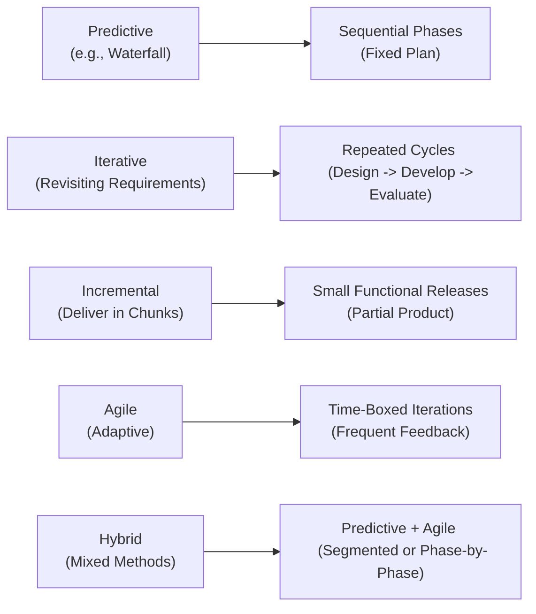
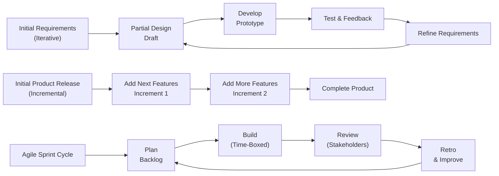

## 9.1 Predictive, Iterative, Incremental, Agile, and Hybrid

Selecting the appropriate development approach and life cycle can significantly influence a project’s success. Whether you’re balancing cost, schedule, and scope (see Chapters 18: Schedule Management and 19: Cost Management), or dealing with complex stakeholder environments (see Chapter 7: Stakeholder Performance Domain), the choice of approach determines how your team plans, executes, and adapts. This section explores five primary life cycle models—Predictive, Iterative, Incremental, Agile, and Hybrid—along with their unique advantages, trade-offs, and real-world applications.

Organizations often tailor these approaches to fit specific objectives, constraints, or stakeholder preferences. Understanding not just their definitions but also their subtle and practical differences will help you align your project approach with strategic goals and deliver valuable outcomes.

---

### Introduction to Life Cycle Models

A project’s life cycle outlines how work moves from initiation to closure (see Chapter 4: Project Management Fundamentals). Traditional project management historically focused on a linear, plan-driven method. However, over time, industry needs have diversified, and new methodologies have emerged to handle uncertainty, frequent changes, and faster delivery cycles.

Each approach can be visualized as a continuum on which the degree of upfront planning, stakeholder feedback, and flexibility varies. Here is a high-level overview before we dive deeper into each:

- **Predictive (Waterfall)**: Rigid, well-defined stages; heavy planning upfront.
- **Iterative**: Repetitive work cycles aimed at exploring and refining requirements.
- **Incremental**: Delivering functioning components in small increments until the final product emerges.
- **Agile**: Adaptive, flexible approach that values customer feedback and welcomes changing requirements.
- **Hybrid**: A combination of predictive and Agile practices to balance stability and flexibility.

---

### Key Considerations When Choosing a Life Cycle

- **Degree of Requirements Stability**  
  Do stakeholders have clear, fixed requirements from the onset, or do requirements evolve as the project progresses?
  
- **Risk Tolerance and Uncertainty**  
  Is the project high-risk, subject to frequent external changes—regulatory, market, or technological?  
  (See Chapter 14: Uncertainty Performance Domain for in-depth risk strategies.)

- **Stakeholder Engagement**  
  How often do stakeholders want or need to be involved in decision-making and review? (See Chapter 7: Stakeholder Performance Domain on effective engagement strategies.)

- **Team Composition and Culture**  
  Is the team large, distributed, accustomed to strict processes, or more comfortable with autonomy and collaborative rapid feedback?

- **Time-to-Market Pressures**  
  Is delivering partial value quickly more beneficial, or is a single delivery of the fully realized end product required?

---

### Predictive (Waterfall) Approach

In a **Predictive**-style project (often referred to as Waterfall), the entire product life cycle is planned upfront. Requirements gathering and detailed design activities precede any development or production work. Once the design is approved, the project transitions through well-defined phases—such as requirements, design, construction, testing, and closure.

**Characteristics**  
- Comprehensive **planning** early in the project.  
- Limited **stakeholder feedback** after requirements are signed off.  
- **Linear** progression from one phase to another with formal phase exits.  
- **Scope, schedule, and cost** baselines are established early and strictly controlled (see Chapter 10: Planning Performance Domain).

**Advantages**  
- Clear project goals, scope, and deliverables from the start.  
- Easy for teams familiar with structured or regulated environments (e.g., construction, defense).  
- Straightforward documentation and governance (see Chapters 15: Integration Management and 23: Procurement Management for organizing structured outputs).

**Trade-Offs**  
- Limited flexibility to accommodate changes mid-cycle, risking scope creep or costly rework.  
- Delayed feedback cycles may result in delivering a product that meets initial requirements but does not reflect evolving stakeholder needs or market conditions.

**Success Factors**  
- Accurately capturing requirements and ensuring stakeholder buy-in early.  
- Robust change control processes to manage variations effectively (see Chapter 15: Integration Management for integrated change control).  
- Strong planning and adherence to established organizational procedures (Enterprise Environmental Factors, Organizational Process Assets).

---

### Iterative Approach

The **Iterative** approach acknowledges that complex projects may need repeated cycles of planning and execution to refine understanding and elaborate requirements. Rather than waiting until an entire product is built, teams repeatedly plan, design, and partially develop the solution, integrating feedback to shape the next cycle.

**Characteristics**  
- Emphasis on **learning** and **discovery**: designs evolve with each iteration.  
- **Repeated** revision of scope and design throughout multiple cycles.  
- Often used in complex or emerging-technology projects where high-level concepts are known, but details need experimentation.

**Advantages**  
- Earlier **validation** of directional decisions reduces risk of going down the wrong path entirely.  
- Improved quality and user satisfaction because of frequent stakeholder engagement.

**Trade-Offs**  
- Potential for **scope volatility** as teams refine understanding.  
- Requires continuous involvement from stakeholders to give timely feedback.  
- Project management complexity can be higher than in a straightforward linear model, as iteration planning must be carefully orchestrated.

**Success Factors**  
- Commitment to an **open feedback** loop and frequent acceptance that a “finished” part of the product may be reworked in later cycles.  
- Leadership that promotes continuous learning and adaptability (see Chapter 8: Team Performance Domain for building a supportive culture).

---

### Incremental Approach

With an **Incremental** approach, the product is delivered in functional segments. Each increment adds stakeholder-visible functionality, culminating in a complete product at the end of successive increments.

**Characteristics**  
- Delivery of **fully functional** portions of the product in small increments.  
- Each increment builds on the previous one, tested and integrated into the running product.
- Typically shorter cycles than a predictive approach, focusing on a subset of features.

**Advantages**  
- Stakeholders receive **value early** and can start using (or testing) partial functionality.  
- Reduces large-scale integration risks because new increments are added to an existing baseline.  
- Enhanced ability to obtain user feedback on tangible outputs, guiding subsequent increments.

**Trade-Offs**  
- If the architecture or foundational design is weak, later increments can become complicated to integrate.  
- Requires thorough planning on how features and components will integrate across increments.  
- Potential misalignment if each increment lacks a unifying vision.

**Success Factors**  
- Proper **architectural planning** so new increments don’t break existing features.  
- Slicing features in a way that each delivered piece provides genuine stakeholder value.  
- Clear progression timeline with robust version control and integration processes.

---

### Agile Approach

An **Agile** approach aims to maximize customer value by embracing change and prioritizing frequent deliverables. Grounded in the principles of the Agile Manifesto (see Chapter 24: Agile Foundations and the Agile Practice Guide for details), Agile frameworks—like Scrum or Kanban—use time-boxed iterations (Sprints) or continuous flow to deliver functionality incrementally and incorporate iterative, stakeholder-driven refinements.

**Characteristics**  
- **Collaborative** and **self-organizing** teams leverage daily feedback loops.  
- Work is performed in **time-boxed** iterations (often 1-4 weeks).  
- **Frequent demos** or reviews with stakeholders.  
- Continual backlog refinement to account for emergent requirements.

**Advantages**  
- Rapid adaptation to changing market conditions, stakeholder feedback, or personnel changes.  
- High transparency through visualization tools (e.g., Kanban boards, burn charts—see Chapter 13: Measurement Performance Domain).  
- High motivation and accountability in empowered teams (see Chapter 8: Team Performance Domain for insights into team empowerment).

**Trade-Offs**  
- **Uncertain scope** and final product definition if the project context or sponsors demand a strict baseline.  
- Requires experienced, **collaborative** teams comfortable with autonomy and close stakeholder interaction.  
- May involve reorganizing governance, contracts, or reporting structures, especially in traditional organizations (see Chapter 23: Procurement Management for vendor relationships).

**Success Factors**  
- A supportive organizational culture that values **continuous improvement**.  
- Stakeholders who commit to ongoing engagement and iterative decision-making.  
- Strong Product Ownership to consistently prioritize the backlog and define acceptance criteria.

---

### Hybrid Approach

A **Hybrid** approach merges Predictive and Agile (or Iterative/Incremental) methods to balance upfront planning with flexibility. Some components of the project may follow a predictive approach—especially those subject to strict regulations or well-defined requirements—while other components may adopt short iterative cycles to refine evolving needs.

**Characteristics**  
- Core, stable elements or regulated deliverables are handled predictively.  
- More dynamic or innovative components use agile or iterative practices.  
- Often includes a **“stage gate”** or formal checkpoint for major milestones (Predictive) while ongoing phases use incremental or Agile sprints.

**Advantages**  
- Leverages **strengths** of each approach—stability where necessary, flexibility where beneficial.  
- May simplify stakeholder acceptance within organizations transitioning from traditional methods to Agile.  
- Reduces project risk by tailoring approach to each deliverable or work stream’s needs.

**Trade-Offs**  
- Complexity in managing different **cadences**, **tools**, and **reporting** structures.  
- Potential for confusion among teams if roles and responsibilities are not clearly defined.  
- Requires strong leadership alignment to ensure coherence across the project (see Chapter 6: The PMP® Exam Domains, Tasks, and Enablers for leadership considerations).

**Success Factors**  
- Clear delineation of which parts of the project or which phases are predictive vs. Agile.  
- Coordinated communication protocols to unify all sub-teams.  
- Ongoing governance and risk management that accommodate multiple methods (see Chapter 31: Advanced Compliance and Regulatory Considerations).

---

### Comparing Lifecycle Models

Below is a high-level conceptual diagram illustrating how scope, schedule, and stakeholder feedback can flow differently among Predictive, Iterative, Incremental, Agile, and Hybrid approaches:

**Explanation of the Diagram**:  
- **Predictive** flows in a linear, rigid manner.  
- **Iterative** rethinks design each cycle, refining as more is learned.  
- **Incremental** adds functioning product pieces one after another.  
- **Agile** organizes work into short cycles that adapt quickly to change.  
- **Hybrid** merges aspects of Predictive and Agile.

---

### Selecting the Right Approach

**Step 1: Evaluate Requirements and Constraints**  
- Stability of requirements, complexity of expected changes, and stakeholder tolerance for change.  

**Step 2: Assess Team Capabilities**  
- Comfort level with iterative or agile methods. Experience with predictive (e.g., Waterfall) processes.  

**Step 3: Focus on Risk and Compliance**  
- If compliance or regulatory constraints require formal documentation and phased reviews, a more predictive or hybrid approach may be warranted.  

**Step 4: Consider Desired Time-to-Market**  
- If you need to get partial products to customers quickly, incremental or agile methods may be more suitable.

**Step 5: Align with Organizational Culture**  
- Ensure you have leadership buy-in, resource management (see Chapter 21: Resource Management), and an environment that supports your approach.

---

### Real-World Examples and Case Studies

1. **Predictive in Construction**  
   A new office building project typically has thoroughly defined blueprints and regulatory guidelines. Changes to architectural plans midway can be expensive. Predictive methods help ensure formal sign-offs at each phase and robust change control.

2. **Iterative in R&D**  
   A pharmaceutical company developing a new drug might iterate through trial phases, refining processes and formulations based on test outcomes. While highly regulated, the learning-based approach is iterative in nature, discovering optimum protocols over multiple cycles.

3. **Incremental Software Rollout**  
   A financial institution might release new online banking features incrementally: first releasing basic account management, next bill payments, then investment portfolios. Each increment is fully functional, providing immediate value to customers.

4. **Agile for Marketing Campaigns**  
   A marketing team uses Scrum to roll out campaigns over short sprints, measuring engagement and pivoting quickly based on performance data.

5. **Hybrid in Healthcare IT**  
   A hospital upgrading its patient management system may adopt a predictive approach for compliance-heavy backend systems and an Agile approach for developing modern user interfaces that require continuous user feedback.

---

### Common Pitfalls

- **Overusing Predictive Methods in High-Change Environments**  
  Leads to extensive rework or stakeholder dissatisfaction.

- **Mislabeling Iterative or Incremental as Agile**  
  Not all short cycles are agile if they lack customer collaboration or adaptive planning.

- **Neglecting Architecture in Incremental Approaches**  
  Can result in technical debt and integration nightmares.

- **Attempting Agile Without Training**  
  Teams may misunderstand Agile principles, leading to “mini-Waterfalls” or chaotic sprints.

- **Hybrid Without Clear Boundaries**  
  Lack of clarity on which pieces are agile vs. predictive can produce confusion and conflict.

---

### Best Practices and Strategies

- **Adapt and Tailor**  
  Combine elements of multiple approaches to fit the project’s unique needs.  

- **Set Clear Goals**  
  Align approach selection with overall objectives such as time-to-market, compliance, or innovation.  

- **Educate Stakeholders**  
  Make sure everyone understands how the life cycle approach affects communication, timelines, and deliverables.  

- **Invest in Tools and Techniques**  
  For Agile or Hybrid, ensure you have the right collaboration tools (e.g., Kanban boards, backlog management) and are practiced in facilitating ceremonies (e.g., retrospectives, daily stand-ups).

- **Continuously Review and Improve**  
  Even in a predictive setting, there are always lessons to learn and knowledge to carry into future projects (see Chapter 11: Project Work Performance Domain for effective lessons learned processes).

---

### Additional Visual: Iterative vs. Incremental vs. Agile

**Explanation of the Diagram**:  
- **Iterative** approach shows a feedback loop of refine → develop → test until the solution stabilizes.  
- **Incremental** approach gradually adds functional chunks until completeness.  
- **Agile** is iterative and incremental but emphasizes continuous stakeholder feedback, short sprints, and reflection (retrospectives).

---

### References for Further Exploration

- Project Management Institute. **A Guide to the Project Management Body of Knowledge (PMBOK® Guide) – Seventh Edition.**  
- Project Management Institute. **Agile Practice Guide.**  
- Highsmith, J. **Agile Project Management: Creating Innovative Products.**  
- Boehm, B. **Spiral Model for Software Development** (an early iterative approach).  
- PMIstandards+ for case-specific tailoring examples and advanced guidelines.

---

## Test Your Understanding: Project Life Cycle Approaches



### Which of the following best describes the Predictive (Waterfall) approach?

- [x] A linear progression with well-defined stages and heavy upfront planning.  
- [ ] A repetitive series of short cycles that produce a working increment.  
- [ ] A combination of iterative sprints and predictive governance.  
- [ ] Delivering smaller, functional portions of the product over time.  

> **Explanation:** The Predictive (Waterfall) approach is characterized by a strict sequence of phases (requirements → design → development → testing → closure) with comprehensive upfront planning.

### What is a key risk of using an Iterative approach?

- [ ] Limited stakeholder engagement.  
- [x] Scope can be reworked several times, potentially causing volatility.  
- [ ] The product is delivered only at the end of the project.  
- [ ] It requires minimal planning.  

> **Explanation:** Because Iterative approaches allow repeated refinement of scope and requirements, scope volatility is higher if stakeholders frequently redefine elements.

### In which life cycle approach are multiple functional slices of the product released to stakeholders over time?

- [ ] Agile  
- [x] Incremental  
- [ ] Predictive  
- [ ] Iterative  

> **Explanation:** The Incremental approach delivers complete, usable sections of the final product incrementally. Each release offers added functionality.

### Which of the following is essential for a team to succeed with an Agile approach?

- [x] Regular stakeholder feedback and the ability to adapt to changes.  
- [ ] A fully defined project scope and schedule.  
- [ ] Strict documentation at each stage gate.  
- [ ] A single final product delivery date.  

> **Explanation:** Agile methods value continuous feedback and embrace changing requirements, making adaptation crucial to success.

### Which approach best suits a project with well-known and unchanging requirements?

- [x] Predictive (Waterfall)  
- [ ] Iterative  
- [ ] Agile  
- [x] Hybrid  

> **Explanation:** Predictive is ideal when requirements are stable. Additionally, a Hybrid approach can be used if certain segments are stable while others need iterative refinement—thus both Predictive and Hybrid might be correct in certain contexts.

### What is the main driver behind Iterative approaches?

- [x] The need to refine ideas based on continuous learning.  
- [ ] Delivering separate parts of the product in increments.  
- [ ] Ensuring all requirements are fully understood at the start.  
- [ ] A single delivery of the final product.  

> **Explanation:** Iterative approaches repeatedly refine the product design and requirements, fueling continuous learning.

### A Hybrid approach is often chosen when:

- [ ] Requirements are fully known in advance.  
- [x] Parts of the project require strict control, while other parts benefit from iteration or experimentation.  
- [x] Stakeholders have differing expectations about speed and formality of delivery.  
- [ ] The team is fully distributed.  

> **Explanation:** Hybrid leverages a mix of predictive and adaptive methods to accommodate different project elements or stakeholder needs.

### One challenge of Hybrid approaches is:

- [x] Managing different cadences and reporting structures within one project.  
- [ ] Having no formal checkpoints or milestones.  
- [ ] Delivering too little value early on.  
- [ ] Focusing on daily sprints only.  

> **Explanation:** A Hybrid’s biggest challenge often lies in coordinating agile iterations with predictive phases, each requiring distinct tools, governance, and mindsets.

### Each team increment in an Incremental approach must:

- [x] Deliver a functional piece of the product that can be tested or potentially used.  
- [ ] Utilize pair programming.  
- [ ] Rely on daily stand-up meetings.  
- [ ] Require final acceptance at the very end.  

> **Explanation:** Incremental approaches produce working, testable features in each increments, ensuring stakeholders can see a portion of the final product.

### The Agile Manifesto emphasizes customer collaboration over:

- [x] Contract negotiation  
- [ ] Working software  
- [ ] Thorough planning  
- [ ] Speed to market  

> **Explanation:** One of the four values in the Agile Manifesto is “customer collaboration over contract negotiation.”



---

## PMP Mastery: 1500+ Hard Mock Exams with Full Explanations 

Looking to crush the PMP exam with confidence? Dive deep into 6 rigorous mock exams totaling 1500+ advanced-level questions, each accompanied by clear, step-by-step explanations. Hone your test-taking strategies, master complex topics, and build the resilience you need on exam day. Perfect for serious PMs aiming beyond fundamentals.

Enroll now:  
[PMP Mastery: 1500+ Hard Mock Exams with Exceptional Clarity & Full Explanations](https://www.udemy.com/course/pmp-2025/?referralCode=CF83A54BC86BE27F9AFE)

_Disclaimer: This course is not endorsed by or affiliated with the PMI examination authority. All content is provided purely for educational and preparatory purposes._
