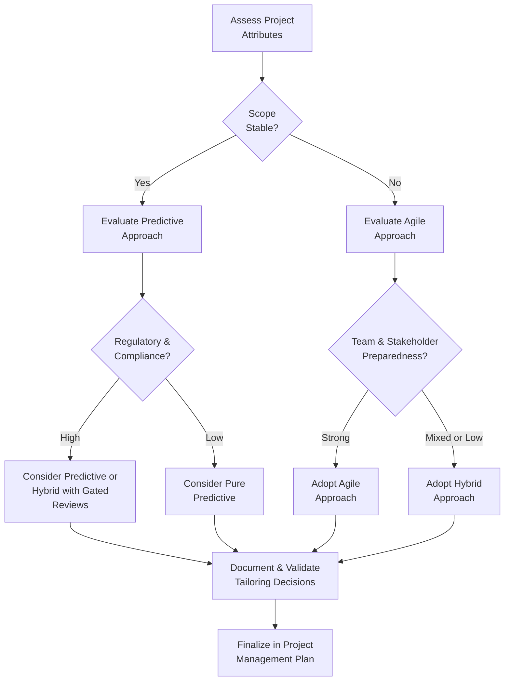

## 9.2 Tailoring the Life Cycle to Project Needs

Selecting and adapting the most suitable life cycle approach for your project is a crucial step in ensuring success. Every project has distinct factors—such as stakeholder expectations, scope stability, risk levels, and time constraints—that will influence the type of approach you use. Whether you opt for a purely predictive (waterfall-style) life cycle, a fully agile model, or a hybrid of both, tailoring the life cycle to your project’s particular conditions will help achieve optimal outcomes. This section delves into the rationale and methodology for tailoring, highlighting best practices, real-life examples, and strategies to avoid common pitfalls.

## Understanding Tailoring in Project Management

Tailoring refers to the deliberate customization of project management processes, techniques, and approaches to fit the specific constraints, opportunities, and complexities of a project. In the context of the life cycle, tailoring means determining which elements from predictive, iterative, incremental, agile, or hybrid frameworks are most relevant to a project’s needs—then blending them seamlessly. 

By tailoring, you benefit from:
- Optimized resource allocation matching the nature of your project.  
- Enhanced ability to accommodate uncertainties and risks.  
- Better synergy between stakeholder expectations and deliverables.  
- Increased flexibility in scheduling, budgeting, and change management.  

In alignment with PMI’s principles (see Chapter 5), tailoring is also about stewardship, value focus, and continuous improvement. As you plan, you keep stakeholder interests, business value, and potential risks in mind while adapting processes to remain efficient and effective.

## Core Considerations for Life Cycle Tailoring

Before selecting the specific life cycle approach, you need a thorough understanding of the project context. Below are some of the key considerations:

Scope Stability  
:   Are the requirements clearly defined and unlikely to change (predictive)? Or are they evolving and expected to emerge throughout the project (agile or hybrid)?

Risk Profile and Uncertainty  
:   High-risk projects with unclear paths may benefit from incremental feedback loops (agile). Low-risk projects with well-understood requirements may favor more traditional, linear approaches (predictive).

Time Constraints  
:   Is there a rigid deadline that allows minimal change after the project starts (suggesting predictive)? Or is time flexible to accommodate iterative discovery and incremental delivery?

Stakeholder Engagement  
:   Are stakeholders available for continuous collaboration and iterative reviews (agile)? Or do they prefer less frequent but more formal checkpoints (predictive)?

Team Expertise and Culture  
:   Does your team possess strong expertise in agile methods? Is it more accustomed to a traditional waterfall model? Adopting a new approach often requires training and organizational support.

Regulatory and Compliance Requirements  
:   Highly regulated industries (e.g., healthcare, defense, financial services) might require strict documentation and gated reviews typical of predictive life cycles. Agile can still be applied, but typically demands a hybrid approach with added oversight.

Business Value Delivery  
:   Some projects aim for early value delivery, making incremental models (agile/hybrid) advantageous. Others deliver final value only upon completion, aligning more naturally with predictive approaches.

## Steps to Tailor Your Life Cycle

The process of tailoring a life cycle model involves several iterative steps, each integrating the perspectives of stakeholders, leadership teams, and the project environment.

Identify Project Attributes  
:   Begin by listing out all relevant aspects: scope clarity, stakeholder engagement expectations, regulatory needs, budget constraints, time sensitivity, risk appetite, resource availability (discussed in more detail in Chapter 6 on PMP® Exam Domains).

Map to Common Approaches  
:   Evaluate which standard life cycle type—predictive, iterative, incremental, agile, or hybrid—seems most aligned with the project attributes. For instance, a highly innovative software project with evolving requirements might map to an agile or hybrid approach. A construction project with fixed deliverables may align more with predictive.

Assess Organizational and Team Readiness  
:   Even if agile is ideal theoretically, consider whether your organization’s culture and your team’s skill set support agile frameworks. You may need to adapt or provide training (see Chapter 8 on Team Performance Domain for more on preparing teams).

Refine the Approach  
:   Use iterative improvements to refine your approach. If you chose a hybrid model, decide which phases or deliverables will follow predictive well-structured processes and which parts will use agile sprints or iterations. 

Document Tailoring Decisions  
:   In the project management plan (or a dedicated tailoring section), capture your rationale for each adaptation. This documentation aids transparency, stakeholder alignment, and sponsor buy-in, and provides a reference for lessons learned (see also Chapter 15 on Integration Management).

Validate with Stakeholders  
:   Throughout the tailoring journey, continually gather feedback from key stakeholders to confirm whether the chosen life cycle approach meets evolving needs. Adjust if new information reveals misalignment.

## Example Flow for Selecting a Tailored Life Cycle

Below is a simplified diagram illustrating a decision flow for choosing and refining a life cycle model. Keep in mind that real projects often have more nuances; this diagram is meant to guide your initial thinking.

### Explanation of the Diagram

1. Assess Project Attributes: Explore all relevant project details—scope, risk, time, cost, stakeholder availability.  
2. Determine Scope Stability: If stable, consider a predictive model; if not, weigh agile or hybrid.  
3. Regulatory & Compliance: High compliance demands more formal gating—leading often to a predictive or hybrid model with formal sign-offs.  
4. Team & Stakeholder Preparedness: Agile requires frequent involvement, open collaboration, and iterative development. If your team or stakeholders are less prepared, hybrid might be a balanced option.  
5. Document & Validate: Once you select an approach, document your tailoring and validate with stakeholders.  
6. Finalize in Project Management Plan: Incorporate your tailoring decisions in official project documentation, detailing the rationale and expected benefits.

## Practical Tailoring in Action

Imagine you are managing three different projects within the same organization:

• Automotive Manufacturing Project (Predictive Tailoring)  
  Requirements for manufacturing are typically well-defined, with stringent quality and safety regulations. You might select a predictive model with formal stage gates for design approval, compliance checks, and testing phases. However, you can still tailor some agile concepts: short daily standups to quickly address production issues, or iterative pilot lines to test new production methods.  

• Research and Development Innovation Project (Agile Tailoring)  
  R&D efforts often feature ambiguous scope, unpredictable timelines, and an emphasis on rapid prototyping. The initial R&D might use a Kanban system or Scrum sprints to iterate on prototypes until stable designs emerge. Yet, once the product design solidifies, you might shift to a more predictive phase for large-scale manufacturing.  

• Software Implementation for an Enterprise Customer (Hybrid Tailoring)  
  The overarching scope might be contractually defined (predictive), but with changing user feedback. You could fix the major milestones—planning, integration testing, final release—while dividing functionality into sprints. Show your customer incremental demos to refine deliverables. Meanwhile, major contractual obligations remain governed by a predictive schedule to safeguard scope, budget, and timeline.

In each scenario, tailoring is not an all-or-nothing approach. Rather, it’s a fluid application of the best techniques from each methodology to deliver the highest value under the project’s constraints.

## Best Practices for Tailoring

Encourage Collaborative Tailoring  
:   Involve cross-functional teams and stakeholders in the tailoring process. Engaging others early fosters shared ownership and alignment on the chosen life cycle approach.

Adopt a Continuous Improvement Mindset  
:   Regularly review your approach and refine it if circumstances change. Conduct lessons learned or retrospectives (see Chapters 11 and 26) to see what’s working and what needs adjustment.

Monitor Risk Proactively  
:   As you tailor, ensure your risk management framework is robust (Chapters 14 and 22). Projects that must pivot from predictive to agile or vice versa often do so because of evolving risk or changes in stakeholder priorities.

Keep Documentation Balanced  
:   Even if you adopt agile practices, certain industries or organizations require thorough documentation. Tailoring means deciding which documentation is absolutely necessary (regulatory or otherwise), and which can be pared down.

Clarify Roles and Responsibilities  
:   Hybrid models especially need clarity on who does what, when. Clear role definitions reduce confusion and ensure accountability.

Use Feedback Loops  
:   Both agile and hybrid models rely on quick feedback to steer product evolution. Predictive approaches benefit from well-timed stage gates and validations.

## Common Pitfalls and How to Avoid Them

• Overly Complex Tailoring  
  Adding too many layers can paralyze decision-making. Focus on simplicity: adopt only the processes and frameworks that bring tangible benefits.  

• Resistance to Change  
  Team members or stakeholders may not fully support a shift from a familiar predictive model to an agile or hybrid approach. Overcome this by providing sufficient training, executive buy-in, and consistent communication.  

• Misalignment with Organizational Culture  
  If the broader organization adheres strictly to waterfall methods, injecting agile techniques might create friction unless carefully managed. Pilot smaller hybrid initiatives to demonstrate success.  

• Underestimating the Need for Governance  
  Especially in highly regulated environments, omitting key sign-offs or compliance documents can have serious consequences. Even if you adopt an agile or hybrid model, ensure compliance at each stage.

• Failing to Revisit the Tailoring Approach  
  Tailoring is not a one-time exercise. If you define a customized approach at the beginning but never revisit it, you may find yourself stuck with inappropriate methods that no longer reflect the project realities.

## Encouraging Flexibility and Continuous Learning

Tailoring the life cycle demands an adaptive mindset where learning and feedback drive improvements. By testing small changes and scaling what works, you keep delivery aligned with business value. Encourage project teams to learn from each iteration or phase and adjust the life cycle accordingly to handle evolving constraints or stakeholder needs.

## References and Further Exploration

• PMI. A Guide to the Project Management Body of Knowledge (PMBOK® Guide) – Seventh Edition.  
• PMI. Agile Practice Guide.  
• PMIstandards+. Online resource providing tailored project management practices and real-world examples.  
• Kerzner, Harold. Project Management: A Systems Approach to Planning, Scheduling, and Controlling.  
• Highsmith, Jim. Agile Project Management: Creating Innovative Products.  

Consider reading case studies from similar industries to glean insights into how other organizations have successfully combined different approaches.

---

## Test Your Knowledge: Tailoring Project Life Cycles



### Which statement best describes “tailoring” from a project management perspective?

- [x] The customization of processes and life cycle steps to meet the specific needs of a project.
- [ ] The selection of a strictly agile framework whenever requirements are uncertain.
- [ ] The application of traditional project management exclusively for regulated industries.
- [ ] The mandatory use of predetermined methodologies without modification.

> **Explanation:** Tailoring involves adapting project management processes, tools, and life cycle models to best fit each project’s unique requirements. It is not restricted to agile or traditional approaches only.

### In a project with high regulatory requirements but also fluctuating requirements, which life cycle approach is most likely to be effective?

- [x] A hybrid approach combining predictive oversight with iterative deliveries.
- [ ] A purely predictive approach with tightly controlled gates.
- [ ] A purely agile approach with no formal documentation.
- [ ] Postponing choice of life cycle approach until the project is near completion.

> **Explanation:** Combining the formality required by high regulation with incremental or iterative cycles for handling changing requirements often results in a hybrid approach. Full predictive might limit the ability to respond to changes, while full agile might not address compliance needs adequately.

### Which factor is most important to consider when evaluating scope stability?

- [x] The degree to which requirements are defined and expected to remain unchanged.
- [ ] The location of the project stakeholders.
- [ ] The project team’s familiarity with agile frameworks.
- [ ] The identity of the project sponsor.

> **Explanation:** Scope stability is determined by how complete and static the requirements are. This drastically influences whether a project will benefit from a predictive or adaptive life cycle.

### What is a primary advantage of using a hybrid life cycle?

- [x] It retains the benefits of predictive processes while allowing segments of the project to iterate and adapt.
- [ ] It guarantees no changes to scope or schedule after the initial planning.
- [ ] It fully eliminates the need for compliance documentation.
- [ ] It ensures that daily standup meetings are not required.

> **Explanation:** Hybrid life cycles combine disciplined planning and oversight (predictive) with flexibility and collaboration (adaptive), enabling teams to manage both stable and evolving requirements effectively.

### Which trait typically supports an organization’s successful transition to agile or hybrid models?

- [x] High stakeholder involvement, open communication channels, and strong leadership backing.
- [ ] A rigid hierarchical structure that limits team decision-making.
- [x] Willingness to experiment and learn from small-scale pilots.
- [ ] Total elimination of predictive phases and documentation.

> **Explanation:** Organizations that thrive in agile or hybrid environments generally encourage collaboration, allow teams to make decisions, and promote learning. Rigid, top-down structures can stifle agility.

### If a project pivoted from predictive to agile approaches midway, what is critical for success?

- [x] Clear documentation of revised processes and obtaining stakeholder agreement on the new approach.
- [ ] Discarding all existing project artifacts and starting from scratch.
- [ ] Continuing to follow predictive gate reviews without stakeholder involvement.
- [ ] Avoiding any change to the project plan.

> **Explanation:** A mid-project pivot demands transparent communication, updates to the project management plan, and stakeholder alignment to ensure the new approach is understood and accepted.

### How can you best balance regulatory compliance with agile iterations?

- [x] Incorporate necessary checkpoints and documentation within agile sprints or increments.
- [ ] Replace regulatory requirements with daily standup meetings.
- [x] Mark compliance as “not applicable” in agile projects.
- [ ] Defer compliance reviews until after the project is complete.

> **Explanation:** Even in an agile setup, compliance must be integrated into each iteration. This can involve building in specific checks, sign-offs, or documentation tasks aligned with the iterative cadence.

### Which is a common pitfall when tailoring?

- [x] Adding layers of processes without dialogue or justification, resulting in unneeded complexity.
- [ ] Consulting with stakeholders at every stage of decision-making.
- [ ] Conducting a risk assessment before finalizing the approach.
- [ ] Documenting the reasons for each tailoring decision for transparency.

> **Explanation:** Overly complex processes inflate costs and time without corresponding benefits. Proper tailoring requires careful consideration and justification for changes.

### When tailoring is successful, what is a likely outcome?

- [x] Smooth alignment between stakeholder expectations, project scope, risk handling, and scheduling.
- [ ] Complete elimination of change control processes.
- [ ] Reduced collaboration among team members.
- [ ] Project delays and confusion.

> **Explanation:** Effective tailoring matches stakeholder expectations with practical procedures, leading to higher efficiency, better risk management, and more successful outcomes.

### The project scope was defined, but new features were requested after sign-off. Which statement is true?

- [x] Reassessment of the chosen life cycle or creation of a hybrid approach may be required to accommodate changes efficiently.
- [ ] Additional features are never allowed once scope is locked in a predictive model.
- [ ] Changing the scope is inherently negative and ruins the project.
- [ ] There is no need to revisit the project management plan.

> **Explanation:** Even in predictive projects, scope changes can occur. A shift to a more iterative or hybrid approach can help accommodate new features in a structured, transparent manner.



---

## PMP Mastery: 1500+ Hard Mock Exams with Full Explanations 

Looking to crush the PMP exam with confidence? Dive deep into 6 rigorous mock exams totaling 1500+ advanced-level questions, each accompanied by clear, step-by-step explanations. Hone your test-taking strategies, master complex topics, and build the resilience you need on exam day. Perfect for serious PMs aiming beyond fundamentals.  

Enroll now:  
[PMP Mastery: 1500+ Hard Mock Exams with Exceptional Clarity & Full Explanations](https://www.udemy.com/course/pmp-2025/?referralCode=CF83A54BC86BE27F9AFE)

_Disclaimer: This course is not endorsed by or affiliated with the PMI examination authority. All content is provided purely for educational and preparatory purposes._
