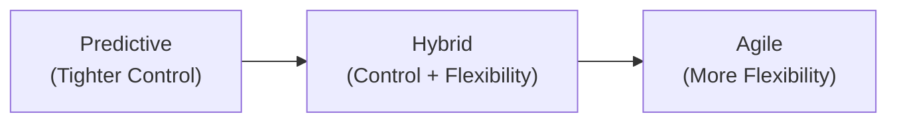
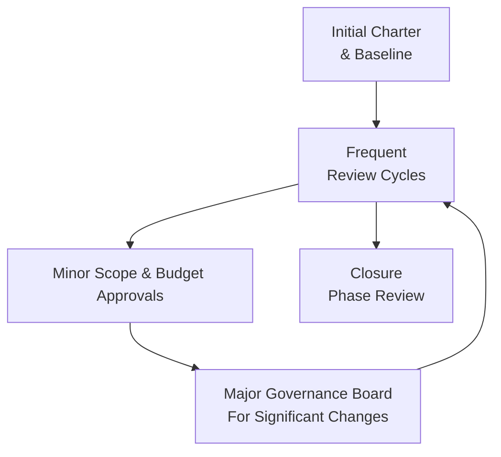

## 9.3 Balancing Flexibility and Control

In today’s dynamic project environments, practitioners often find themselves facing a seemingly contradictory requirement: the need for rigorous oversight and governance alongside the ability to adapt to frequent changes. This balancing act is not just about fulfilling administrative or reporting obligations—it is vital to ensuring project objectives are met while keeping the team responsive to stakeholder expectations and emerging challenges. As covered in earlier sections of this guide, project practitioners leverage various life cycle types (predictive, iterative, incremental, agile, and hybrid) to accommodate different degrees of flexibility and control. Yet, the real test lies in determining how to blend these approaches on a day-to-day basis.

This section delves deeper into practical mechanisms that enable project managers to maintain robust oversight without stifling innovation or adaptability. We will explore strategies that integrate agile practices with traditional frameworks, discuss the significance of governance structures, and highlight methods to ensure that your team remains both compliant and empowered.

---

### The Importance of Oversight and Adaptation

In Chapter 4 (Project Management Fundamentals), we examined how projects typically progress through various stages of initiation, planning, execution, monitoring, and closing. Each phase carries specific control needs, but simultaneously, projects rarely proceed in a perfectly linear fashion. Changing customer requirements, technological shifts, budget constraints, and organizational realignments can all necessitate quick pivots.

Balancing flexibility and control is especially relevant in the context of the PMBOK® Guide Seventh Edition’s concept of performance domains. Although each domain—such as Stakeholder, Team, Development Approach, Planning, Delivery, Measurement, and Uncertainty—requires disciplined management, it also emphasizes the project manager’s responsibility to adapt processes, roles, and deliverables to meet evolving needs. As explained in Chapter 5 (PMI’s 12 Project Management Principles), stewardship must be coupled with an adaptive and value-focused mindset. 

Maintaining oversight is essential for:

- Ensuring alignment with strategic objectives.  
- Meeting compliance, regulatory, or contractual obligations.  
- Tracking performance through measurable indicators (see Chapter 13 for detail on Measurement Performance Domain).  
- Providing accurate forecasting to guide risk mitigation and resource allocation.  

At the same time, adaptation is necessary for:

- Responding to unexpected changes or emerging risks (see Chapter 14, Uncertainty Performance Domain).  
- Preserving team morale and customer satisfaction by embracing shifting requirements.  
- Capitalizing on opportunities or technological advancements.  
- Maintaining quality and stakeholder engagement in dynamic environments.  

Without sufficient control, projects can devolve into chaos and scope creep, but without sufficient flexibility, teams cannot leverage feedback loops or handle emergent complexities.

---

### Dimensions of Flexibility and Control

When discussing how to balance flexibility and control, it is useful to conceptualize your available “toolset” along multiple dimensions. Each dimension represents an axis on which you can adjust your approach based on the project’s nature, complexity, and organizational constraints.

- **Scope Management**: Predictive approaches rely heavily on detailed scope baselines, whereas agile methods adapt scope incrementally. Balancing means establishing a baseline but leaving room for change if justified by strategic or emergent value.  
- **Schedule and Time-Boxing**: Traditional scheduling might use Critical Path Method planning and rigorous baseline tracking (see Chapter 18: Schedule Management), whereas iterative frameworks rely on time-boxed sprints. A balanced approach might include a high-level predictive master schedule to ensure alignment with major milestones, while incorporating short iterative cycles for portions of the work.  
- **Risk and Uncertainty Management**: High control can appear in the form of a comprehensive risk management plan (see Chapter 22: Risk and Uncertainty Management Revisited). Conversely, agile teams often expect uncertainty to be uncovered iteratively and prefer to respond to issues as they arise. A balanced approach sets up initial risk structures but modifies them dynamically, perhaps reevaluating risk at regular intervals or iteration boundaries.  
- **Resource Allocation**: Predictive projects may rely on stable roles and resource assignments, while agile settings encourage cross-functional, dynamic teams. In a balanced approach, some key functional resources might remain dedicated to sustaining certain standards, while other resources can shift roles or tasks as the project iterates.  
- **Governance and Reporting**: In highly controlled environments, documentation, sign-offs, and phase gates dominate. In agile settings, information radiators, daily stand-ups, and demos provide real-time data with minimal bureaucracy. A hybrid system might incorporate lightweight documentation and frequent stakeholder reviews but still maintain official sign-offs at critical junctures.

---

### When to Emphasize Flexibility

There are several scenarios in which maximizing flexibility yields exceptional benefits:

1. **Complex or Innovative Projects**  
   Projects involving cutting-edge technology or R&D often start with unclear requirements. Allowing for flexibility, experimentation, and iterative prototypes can accelerate learning. Instead of locking down scope from the outset, teams can refine deliverables as they gain insights.

2. **Fast-Changing Business Environments**  
   Industries like software, marketing, or consumer electronics face rapidly shifting landscapes—competitors release new features, customers demand real-time personalization, regulations change quickly, etc. Introducing iterative releases and continuous feedback loops helps you remain relevant and competitive.

3. **High Uncertainty and Risk**  
   If the project environment is fraught with unknowns—which is often the case for major transformation projects—strict upfront controls can impede the ability to pivot. Instead, short cycles of planning, action, inspection, and adaptation can mitigate risk and drive value.

4. **Customer-Centric Approaches**  
   In many sectors, end-user satisfaction is paramount. Systemic customer feedback fosters a solution that better meets actual user needs. This approach encourages minimal viable products (MVPs) and ongoing refinement, rather than waiting to gather feedback until after a full solution is built.

---

### When to Emphasize Control

While flexibility is crucial in many environments, there are important reasons why you might tilt toward control mechanisms:

1. **Regulated or Safety-Critical Industries**  
   Projects in healthcare, aviation, finance, or other highly regulated sectors typically require robust documentation, audits, and compliance checks. In these contexts, you cannot cut corners on validation, testing, or official sign-offs.

2. **Complex Supply Chain or Multiple Vendors**  
   A large construction project or multi-vendor initiative can fall into chaos without centralized planning and oversight. Tightly controlled schedules, integrated planning sessions, and detailed procurement processes (see Chapter 23: Procurement Management) help ensure accountability.

3. **Fixed-Bid Projects with Clear Contracts**  
   When a contract sets a defined scope, timeline, and cost, the flexibility to pivot midstream may be limited. While not impossible to re-negotiate or incorporate changes, it often requires formal integrated change control (see Chapter 15: Integration Management).

4. **High Stakeholder Sensitivity**  
   If your sponsor demands meticulously tracked metrics and scheduled gate reviews, you might adopt a more controlled approach. You may still incorporate pockets of agility, but your overarching framework should guarantee consistent, reliable communication and sign-offs.

---

### Finding the Sweet Spot: A Hybrid Model

Many modern projects blend predictive and agile elements tailored to their specific context. The concept of a “sweet spot” acknowledges that each project is unique, requiring different degrees of flexibility and control at various stages of the life cycle. For instance, a software development project might begin with a comprehensive business case justifying the investment (predictive approach), move into design sprints (agile approach), and then return to more structured acceptance testing once major functionality is complete.

Below is a simple Mermaid diagram illustrating the continuum from a purely predictive (high control) approach to a purely agile (high flexibility) approach, with hybrid in the middle:

In practice, your project might shift its position along this curve as it progresses through different stages. Early-phase activities—like feasibility studies or initial planning—may benefit from controlled processes. Later phases might adopt an iterative mindset to incorporate lessons learned and feedback from early increments.

---

### Governance Structures that Enable Adaptation

Governance need not be synonymous with bureaucracy. Rather, governance should provide guardrails that offer clarity and accountability while still enabling teams to adapt swiftly. A few proven techniques include:

- **Lightweight Checkpoints**  
  Instead of rigid phase gates, consider shorter, frequent, and more interactive reviews. These can be sprint demos, stakeholder stand-ups, or monthly check-ins. The goal is to ensure continuous visibility without imposing heavy documentation burdens.
  
- **Tiered Authority Levels**  
  Define authority thresholds for different types of decisions. Low-risk changes can be approved by the project manager or product owner, while higher-risk decisions move up to a steering committee or sponsor. This structure fosters autonomy for smaller pivots while preserving oversight for major scope or budget variations.

- **Iterative Charters or Contracts**  
  While an initial project charter or contract sets the overarching goals and constraints, you can define incremental or conditional charters for major phases or functionalities. Each “mini-charter” clarifies the immediate goals and success criteria, giving teams clarity without constraining them for the entire project duration.

- **Agile PMOs and Communities of Practice**  
  A Project Management Office (PMO) can evolve from a compliance-focused body to a facilitative partner. Agile PMOs coach teams on iterative methods, disseminate best practices, and maintain standards. Similarly, communities of practice allow the organization to share lessons learned across multiple projects, which helps refine governance continuously.

---

### Strategies to Maintain Control While Allowing for Flexibility

Achieving harmony between governance and adaptability entails adopting specific practices at both the team and organizational levels. Consider the following strategies:

**1. Establish Clear Accountability and Roles**  
Teams can adapt more confidently if they know who is accountable for final decisions. In agile frameworks, the Product Owner or key sponsor often makes calls on scope changes, while the Scrum Master or team lead focuses on optimizing the process. In more traditional settings, the project manager maintains the overarching accountability but delegates certain decisions to technical leads or functional managers.

**2. Use Incremental Planning with Defined Milestones**  
Rolling Wave Planning (discussed in Chapter 10: Planning Performance Domain) provides a means to detail out near-term activities while leaving future tasks at higher-level estimates. You get rigorous control over what is imminent, combined with flexibility to adapt long-term planning based on emerging information.

**3. Standardize Reporting in a Lean Manner**  
A project dashboard, Kanban board, or Earned Value Management (EVM) chart (see Chapter 13: Measurement Performance Domain) can provide an at-a-glance view of project performance. These artifacts offer enough standardized information for leadership oversight without burying the team in administrative tasks. 

**4. Leverage Time-Boxed Iterations**  
Even if your project is predominantly predictive, short time-boxes for certain high-risk or uncertain tasks can serve as “adaptive cycles.” During these windows, the team explores solutions, obtains feedback, and refines requirements. At the end of each time-box, results are presented for stakeholder review, ensuring transparency and control.

**5. Manage Risks Dynamically**  
Risk reviews should not be a one-off event. Continuous risk identification sessions, combined with a fresh perspective on threat and opportunity responses, keep the project relevant to its current environment. For instance, new regulations might emerge, requiring additional compliance checks—an agile approach to risk ensures you integrate these swiftly without jeopardizing broader project controls.

**6. Emphasize Quality and Continuous Improvement**  
Balancing flexibility with control extends beyond scope or schedule; it also involves the quality of final outputs. By leveraging feedback loops—such as frequent code reviews, prototype inspections, or design critiques—teams can contain defects early. At each iteration, you refine processes, address impediments, and elevate the overall quality.

---

### Case Study: Hybrid Methods in Pharmaceutical R&D

Consider a pharmaceutical R&D project aimed at formulating a new medication. Strict regulatory standards from agencies like the FDA or EMA mandate detailed documentation and validation across each stage of research. However, the scientific nature of discovery often necessitates iterative experimentation.

1. **Phase 1: Planning & Early Research**
   - Regulatory guidelines necessitate certain protocols, but scientists employ an iterative testing method on potential compounds. Here, the project manager enforces robust reporting to ensure compliance with safety and ethical considerations.

2. **Phase 2: Clinical Trials**
   - Stringent protocols for patient safety demand tight controls: controlled environments, data integrity, and detailed documentation. However, the team also reviews intermediate results frequently, deciding whether to pivot the trial design based on patient responses (introducing an element of flexibility).

3. **Phase 3: Final Reporting & Approval**
   - The project team must compile extensive data for regulatory submission. This step calls for thorough cross-functional collaboration—statistics, medical writing, and stakeholder communication. Pre-defined templates and workflows keep the team on track, aligning with regulatory deadlines. At the same time, slight adjustments in documentation structure or deeper analyses of unexpected results may be introduced. 

The outcome is an environment where oversight ensures patient safety and compliance, while iterative experimentation and adaptable trial designs help refine the final product.

---

### Overcoming Common Challenges

Balancing flexibility and control also means addressing potential pitfalls that arise when combining different methodologies or working with diverse stakeholder expectations:

- **Change Resistance**: Team members or senior managers rooted in a traditional mindset may fear the perceived “chaos” of agile methods. Education, pilot initiatives, and transparent dialogues help illustrate the benefits of an adaptive approach.
- **Excessive Oversight**: Overly frequent or intrusive reviews can undermine the creative process. Ensure that governance checkpoints add value, rather than simply ticking a bureaucratic box.
- **Scope Creep**: If your environment is too flexible, scope changes may slip in unannounced. Mitigate this with a clear change control process. Encourage stakeholder collaboration while clarifying what changes require formal evaluation or re-prioritization.
- **Metrics Overload**: In hybrid environments, teams sometimes try to track every possible metric—traditional ones (like Earned Value) plus agile velocity, sprint burn-down charts, etc. Overloading the team with metrics can create confusion. Identify the key performance indicators (KPIs) and tailor them to your project’s objectives.
- **Cultural Mismatch**: The organization’s culture strongly influences how smoothly a hybrid approach can be implemented. A top-down culture might struggle with agile empowerment, while an organization lacking structured processes may resist formal controls.

---

### Visualizing a Balanced Governance Model

The following Mermaid diagram outlines a conceptual governance flow that balances structured oversight with room for iteration. Each node represents a typical governance checkpoint, while the arrows indicate iterative cycles of planning, execution, and feedback.

- “Initial Charter & Baseline” sets the overall vision, constraints, and deliverables.
- “Frequent Review Cycles” are iterative checkpoints (e.g., sprint reviews, monthly executive summaries).  
- “Minor Scope & Budget Approvals” can be handled by the project manager or product owner.  
- “Major Governance Board For Significant Changes” is convened only for high-impact decisions, preserving flexibility for smaller adjustments.  
- “Closure Phase Review” provides a final overarching assessment before official project closure.

This model empowers the team to respond to emerging insights quickly while aligning major, high-risk decisions with executive-level oversight.

---

### Best Practices for Practitioners

Below are some key takeaways to guide project managers and PMO leads toward a balanced environment:

- **Know Your Context**: Analyze your project’s domain, regulatory requirements, stakeholder needs, and organizational culture early on. Determine how much flexibility vs. control is viable.  
- **Tailor, Tailor, Tailor**: As emphasized throughout the PMBOK® Guide Seventh Edition, tailoring is crucial. This includes customizing life cycle models, governance frameworks, and reporting cadences.  
- **Communicate the “Why”**: When introducing agile ceremonies or rigorous documentation requirements, explain the rationale to your team. Clarity on objectives fosters buy-in.  
- **Pilot and Scale**: If your organization is unfamiliar with agile or hybrid approaches, start with a pilot project before rolling out new methods organization-wide. Gather feedback, refine, and then scale.  
- **Foster Trust**: Create an environment where teams feel safe to experiment within agreed-upon boundaries. Encouraging open communication and shared accountability builds trust.  
- **Embed Continuous Improvement**: Use retrospectives, lessons-learned sessions, or after-action reviews to evolve your project management approach. Over time, your ratio of flexibility and control should adapt to the lessons discovered along the way.

---

### Additional References for Further Exploration

1. **Agile Practice Guide** (by PMI and Agile Alliance) – Offers foundational and advanced insights into applying agile methods, and how to adapt them to different organizational cultures.  
2. **Managing Change in Organizations: A Practice Guide** (PMI) – Provides strategies for guiding and embedding changes in unified or distributed environments.  
3. **Disciplined Agile® Tool Kit** (PMI) – Explores how to tailor agile solutions to enterprise settings with layered governance.  
4. **“Leading Change” by John P. Kotter** – Though focused on organizational change, many principles can be directly applied to balancing emergent pivoting and structured oversight.  

These materials can help expand your understanding and offer further practical examples of how to strike the right balance between adaptation and control in any project.

---

## Test Your Knowledge: Balancing Flexibility and Control Quiz



### In which type of project environment is flexibility generally most critical?  
- [ ] Highly regulated and safety-critical.  
- [ ] Fixed-bid construction projects.  
- [x] Complex or innovative initiatives with rapid changes.  
- [ ] Projects with highly static requirements.  

> **Explanation:** Flexibility is paramount in environments characterized by complexity and change, such as R&D or emerging technology projects. These scenarios mandate frequent adaptation and iterative learning to ensure project success.

### Which of the following is a key risk of having too much flexibility in project management?  
- [ ] Enhanced creativity and innovation.  
- [x] Increased scope creep.  
- [ ] Faster time-to-market for deliverables.  
- [ ] Greater stakeholder engagement sessions.  

> **Explanation:** Flexibility that is excessive or unmanaged can lead to uncontrolled scope changes, causing cost overruns and timeline extensions without adding real value.

### What is the main benefit of using rolling wave planning?  
- [x] Detailed planning for near-term tasks while keeping distant tasks at a higher level.  
- [ ] Finalizing all work packages before project initiation.  
- [ ] Preventing any changes once the baseline is established.  
- [ ] Enforcing rigid oversight with no room for iteration.  

> **Explanation:** Rolling wave planning allows teams to refine details as the project proceeds, striking a balance between immediate clarity and overall adaptability.

### How can governance structures encourage adaptability in a project?  
- [ ] By requiring longer, more comprehensive stage-gate protocols.  
- [x] By enabling quick, tiered decisions and lightweight reviews.  
- [ ] By centralizing authority without delegation.  
- [ ] By minimizing all forms of stakeholder engagement.  

> **Explanation:** Governance can actually promote agility if it provides quick and clear mechanisms for decision-making at lower levels, ensuring that only high-impact changes are escalated.

### Which is true about hybrid project management?  
- [x] It combines predictive and agile elements to fit the project context.  
- [ ] It strictly follows agile ceremonies but uses waterfall gating.  
- [x] It tailors governance models for different project life cycle phases.  
- [ ] It always eliminates any form of documentation requirement.  

> **Explanation:** Hybrid project management merges the best of predictive and agile processes, tailoring each to the project’s requirements. Teams may use predictive artifacts in some areas and adopt agile ceremonies and reviews in others.

### Which governance strategy helps keep project oversight from becoming too burdensome?  
- [x] Lightweight, frequent checkpoints that add clear value.  
- [ ] Comprehensive documentation in every single sprint.  
- [ ] Requiring multiple sign-offs for any project decision.  
- [ ] Eliminating all stakeholder reviews to avoid confusion.  

> **Explanation:** Short, frequent checkpoint meetings and deliverable reviews can provide just the needed level of visibility without bogging the team down in unnecessary documentation.

### A key characteristic of a balanced risk management approach in hybrid methodologies is:  
- [x] Periodic reevaluation and updates to the risk register.  
- [ ] Risk planning only in the initiation phase.  
- [x] Treating threats and opportunities throughout the project life cycle.  
- [ ] Avoiding any formal risk registers in agile environments.  

> **Explanation:** Balanced risk management is not a one-off event. It requires ongoing evaluation and responses to both threats and opportunities, favoring continuous alignment with the project's evolving context.

### What is a common challenge in combining predictive and agile frameworks in one project?  
- [x] Cultural resistance and conflicting stakeholder expectations.  
- [ ] An abundance of synergy with no trade-offs.  
- [ ] Lack of any compliance or regulatory constraints.  
- [ ] Less potential for innovation or iterative learning.  

> **Explanation:** Merging predictive and agile approaches often highlights cultural differences and misaligned expectations around team autonomy, documentation, or pacing. Integrating them requires a careful change management approach.

### Which factor often drives a need for greater control protocols in a project?  
- [x] Strict regulatory requirements.  
- [ ] Desire for minimal documentation.  
- [ ] Rapidly evolving customer demands.  
- [ ] Low stakeholder sensitivity.  

> **Explanation:** Highly regulated industries (e.g., finance, pharma, aviation) mandate robust control structures, as noncompliance can have significant consequences.

### Balancing flexibility and control effectively is:  
- [x] Essential for addressing evolving requirements while maintaining oversight.  
- [ ] Only beneficial in small, low-budget projects.  
- [ ] A concept unique to agile software teams.  
- [ ] Irrelevant unless you have a certified Project Management Office.  

> **Explanation:** The ability to strike the right balance between oversight and adaptation transcends any single industry or team size. It ensures that projects can remain both compliant and responsive, regardless of their context.



---

## PMP Mastery: 1500+ Hard Mock Exams with Full Explanations 

Looking to crush the PMP exam with confidence? Dive deep into 6 rigorous mock exams totaling 1500+ advanced-level questions, each accompanied by clear, step-by-step explanations. Hone your test-taking strategies, master complex topics, and build the resilience you need on exam day. Perfect for serious PMs aiming beyond fundamentals.

Enroll now:  
[PMP Mastery: 1500+ Hard Mock Exams with Exceptional Clarity & Full Explanations](https://www.udemy.com/course/pmp-2025/?referralCode=CF83A54BC86BE27F9AFE)

_Disclaimer: This course is not endorsed by or affiliated with the PMI examination authority. All content is provided purely for educational and preparatory purposes._
