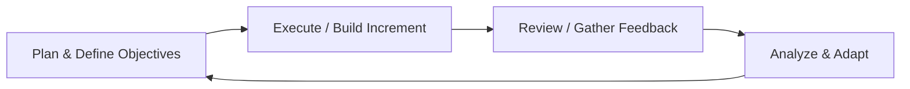

## 9.4 Incorporating Feedback Loops and Iterations

Project teams today face an ever-increasing pace of change, both technologically and in market demands. To effectively navigate these shifts, project managers must embrace iterative and adaptive strategies. Incorporating frequent feedback loops allows teams to refine their outputs continuously, pivot early when risks materialize, and sustain elevated stakeholder engagement. This section examines the core principles behind feedback loops and iterations, discussing how to implement them effectively in various development life cycles—predictive, agile, or hybrid. We will also highlight real-world examples, practical tips, diagrams, and common pitfalls.

## The Importance of Feedback Loops

Feedback loops, in the context of project management, are systematic mechanisms that capture information about the project’s progress and outcomes, then feed that information back into the next phase (or iteration) of work. By continually adjusting plans based on new insights, teams can refine objectives, enhance product quality, improve processes, and delight stakeholders.

Some key benefits of incorporating well-designed feedback loops include:  
• Early detection of defects or challenges before they grow into major problems.  
• Increased flexibility to respond to market or stakeholder changes.  
• Enhanced team morale and alignment through collaborative reviews.  
• Better risk management via continuous assessment and reassessment.  
• Greater stakeholder satisfaction by refining project direction early and often.  

## Understanding Iterations and Incremental Delivery

An iteration is a defined period—often short, ranging from a week to a month—in which the team plans, executes, reviews, and adjusts. Each iteration produces a tangible or demonstrable outcome (often called an increment in many agile frameworks), which stakeholders can evaluate. Feedback from stakeholders, project sponsors, or end-users then drives adjustments in subsequent iterations. Even in predictive or hybrid contexts, mini-iterations can be embedded within phases to enhance learning and adaptability.

### Iterations vs. Single-Pass Planning
Traditional predictive approaches often plan most of the project scope up front and execute in a linear sequence (requirements → development → testing → deployment). While there is still value in predictive methods—especially for projects with stable requirements—modern competitive and technological landscapes demand flexibility. Single-pass planning lacks built-in mechanisms for continuous adaptation, which increases the risk of late defects, unaddressed market changes, or underwhelming stakeholder feedback surfacing near project end.

Conversely, iterative workflows incorporate feedback loops at each stage, enabling incremental updates to requirements, designs, and even risk responses. This structure reduces rework, guards against scope creep by validating incremental deliverables, and fosters a partnership with stakeholders.

## Key Elements of Effective Feedback Loops

### Timely and Actionable Input
Feedback is most useful if it is gathered and shared quickly, in a way that can be acted upon before the next iteration. Delays in evaluation or a backlog of unresolved findings can reduce the benefits of iterative refinement.

### Collaborative Evaluation
Engage a broad set of perspectives, including end-users, stakeholders, domain experts, and cross-functional team members. Collaboration enhances the richness of feedback and reveals hidden assumptions or risks.

### Structured Review Mechanisms
Institutionalizing methods like retrospectives, iteration reviews, product demos, and peer reviews streamlines feedback collection. Ensuring these reviews are scheduled and documented helps maintain consistency and track trends over time.

### Continuous Refinement
Feedback loops only translate into project improvements if the insights lead to proactive changes. These changes might manifest as updated user stories, revised scope or contract terms, enhancements to risk strategies, or even changes to the project schedule or budget.

## Tools and Techniques for Feedback Loops and Iterations

Below are common tools, ceremonies, and techniques used to integrate feedback loops and iterative development into a project:

### Iteration Planning
Often used in agile or hybrid environments, iteration (or sprint) planning sessions define the goals and tasks for the next cycle. Team members estimate effort, identify dependencies, and plan for risk mitigation measures within the iteration’s time-box.

### Daily Standups
Brief, focused team meetings (often 15 minutes or less) to discuss progress, impediments, and upcoming tasks. Although these standups are short, they serve as mini-feedback opportunities, allowing the team to re-assess commitments daily and realign if necessary.

### Demonstrations and Reviews
At the end of an iteration, the team usually presents completed outputs to stakeholders. This might mean showing a working software feature, completed design deliverables for a construction project, or partial results in a marketing campaign. Stakeholders provide feedback, which the team incorporates in the next cycle.

### Retrospectives (Lessons Learned)
Retrospectives provide a structured format for the team to reflect on what went well, what could be improved, and how the process, collaboration, or tools can be modified in the next iteration. A retrospective is an important feedback mechanism that focuses on the process rather than deliverables.

### Backlog Refinement
In agile projects, product owners and development teams frequently review and refine the product backlog—adjusting priorities, rewriting user stories, and removing or adding requirements based on the latest feedback and insights. In a more predictive setting, mini-backlogs or requirement logs can be similarly reviewed on a regular cadence.

### Incremental Prototyping and Proof of Concept
Rather than attempting to build the entire solution up front, project teams create prototypes or proofs of concept to gather feedback from users early. This approach clarifies vague requirements and identifies hidden constraints and integration issues before substantial resources are committed.

### Kanban Boards and Visual Management
Used either in conjunction with agile frameworks like Scrum or as a standalone method, Kanban boards visually track how work flows through different stages. Teams can incorporate WIP (Work in Progress) limits and monitor cycle times to identify bottlenecks. Routine reviews of the board metrics serve as a feedback mechanism to optimize flow.

## Feedback Loops in a Predictive vs. Agile Context

Although agile methods emphasize feedback loops, they can exist in predictive environments as well. Predictive teams often rely on “phase gates” or milestone reviews for feedback, but each phase gate can also embed smaller iterative cycles. For example, in a construction context, a design phase may include multiple design iterations or peer reviews, capturing feedback from architects, structural engineers, and local authorities before finalizing drawings.

In agile and hybrid environments, feedback loops are designed as core routines—daily standups, sprint reviews, and retrospectives gather input at every turn. Because agile frameworks encourage short cycles and frequent stakeholder interactions, feedback is continuous and immediate. This immediate nature significantly reduces the risk of delivering an outcome misaligned with stakeholder needs or market realities.

## Real-World Example

Imagine a software development project for an e-commerce platform that aims to introduce a personalized product recommendation feature. Initially, the project sponsor, marketing department, and development team share an overall vision, but user preferences change quickly due to seasonal trends and competitor offerings.

Rather than develop the entire recommendation engine in one large, multi-month chunk with no external input, the project manager chooses to break the work into two-week sprints. After the first sprint, a basic recommendation algorithm is demonstrated to a focus group of actual customers. Their feedback reveals that they also want to see “recently viewed items” within the recommendation carousel. The development team incorporates this new requirement in subsequent sprints. By the fourth sprint, usage metrics from early testers confirm that the aggregated “recently viewed + recommendation” feature yields a 20% increase in sales. This tangible evidence assures stakeholders that they are on the right track, and the marketing team adjusts their promotional campaign accordingly. Without frequent feedback loops, these insights might have arrived too late.

## Case Study: Construction Project with Iterative Design Reviews

Consider a high-end residential construction project. While the overall scope and design approach are largely predictive (solid foundations, structural calculations, municipal regulations), the project manager builds smaller iterative loops into the design phase. At 25%, 50%, and 75% design completion, the team holds formal design review sessions with the client. These reviews feature 3D renderings, material samples, and outline the design details in a near-finished state. Each iteration of the design reflects feedback from the client’s evolving aesthetic preferences, identified compliance issues, or cost constraints.

Because the project manager plans these design reviews early, the cost and schedule impact of adjustments remain minimal. Potentially costly modifications—such as adding a larger balcony or replacing certain finishes—are caught during these iterative check-ins. Not only is client satisfaction higher, but risk is mitigated by pinpointing possible rework early.

## The Iterative Loop in Diagram Form

To visualize how an iterative cycle with feedback loops might function, consider the flowchart below:

Explanation:  
• Plan & Define Objectives: The team identifies the goals and deliverables for the iteration, aligning them with stakeholder priorities.  
• Execute / Build Increment: The team develops or implements the planned tasks within the iteration’s time-box.  
• Review / Gather Feedback: Stakeholders test, review, or inspect outputs, providing feedback on quality, alignment with requirements, and potential improvements.  
• Analyze & Adapt: The team processes feedback, updates the backlog or plan, and prepares for the next cycle.

This loop is repeated as many times as necessary, refining the product, service, or result. Each loop aims to deliver incremental value and learnings.

## Managing Risks Through Iterative Feedback Loops

Short, frequent iterations reduce overall project risk by allowing teams to detect variances early and take corrective measures. When risk triggers are identified, the project team can modify subsequent iteration goals or incorporate new tasks to mitigate or exploit these risks. A few examples:

• If user feedback reveals a crucial missing feature, rather than waiting months to add it, the team can pivot the upcoming iteration’s backlog to address this priority.  
• If cost is trending higher than anticipated, an iteration can focus on cost avoidance measures, including reducing unnecessary scope items or re-evaluating vendor contracts.  
• If regulatory changes occur mid-project, the team can quickly incorporate compliance tasks in the next iteration.

## Best Practices for Effective Iterations

• Keep Iteration Length Appropriate: Determine an iteration length that is long enough to produce something meaningful, yet short enough to capture timely feedback. Many agile practitioners recommend 1- to 4-week sprints or cycles, but other industries may have different optimal lengths.  
• Establish Clear Criteria for Acceptance: Use Definition of Done (DoD) or acceptance criteria for each deliverable to ensure consistent quality. This helps stakeholders evaluate outputs effectively and provide more focused feedback.  
• Encourage Open Communication: Foster a culture where team members and stakeholders feel safe providing honest feedback, even if it involves pointing out mistakes or misalignments.  
• Document Feedback: Maintain a transparent record of feedback, how it was addressed, and subsequent action items. This log becomes a living history of project evolution and helps track trends.  
• Align with Organizational Culture: Not all organizations are accustomed to iterative approaches. Provide training, explanations, and success stories to break down reluctance.  

## Common Pitfalls and Challenges

• Overly Long Iterations: Extremely long cycles reduce the benefits of early detection and may cause stakeholder disengagement or confusion.  
• Infrequent Reviews or Demos: If the team rarely presents intermediate deliverables, they risk discovering significant misalignments late in the project.  
• Non-Actionable Feedback: Gathering feedback is only valuable if it is converted into tangible improvements. Merely documenting stakeholder comments without follow-up reduces trust and momentum.  
• Lack of Stakeholder Engagement: If key stakeholders are not available or responsive during iteration reviews, the team may obtain incomplete or delayed input.  
• Poorly Defined Objectives: Attempting to incorporate feedback on unclear goals can lead to directionless changes that balloon scope and cost. Clarity in each iteration’s objectives is paramount.  

## Integrating Feedback Loops with Other PMBOK® Performance Domains

This section, “9.4 Incorporating Feedback Loops and Iterations,” directly interacts with multiple other Performance Domains and Knowledge Areas featured in the PMBOK® Guide Seventh Edition, including:  

• Stakeholder Performance Domain (Chapter 7): Continuous feedback ensures that stakeholder needs are captured more frequently, improving engagement.  
• Planning Performance Domain (Chapter 10): Iterations redefine and refine plans on a regular basis, influencing schedule, scope, and resources.  
• Project Work Performance Domain (Chapter 11): The execution of tasks is closely tied to iterative cycles, fostering incremental value delivery.  
• Measurement Performance Domain (Chapter 13): Feedback loops contribute to data-driven decisions by providing fresh performance metrics at each iteration.  
• Uncertainty Performance Domain (Chapter 14): Frequent feedback loops are a key risk management strategy, allowing teams to detect and adapt to uncertainties early.  

## Leveraging Feedback Loops for Stakeholder Satisfaction

High stakeholder satisfaction stems from active involvement, transparent communication, and tangible evidence of progress. By delivering small increments frequently, project managers and teams receive early stakeholder input on whether the product or service is meeting expectations. Experiencing the product first-hand can prevent misunderstandings that often arise when relying solely on lengthy documentation or static reports.

In some agile environments, “user acceptance tests” or “stakeholder demos” are integral to each iteration. The sponsor, end-users, and other involved stakeholders experience the evolving solution, articulate preferences, and propose improvements. Because they see their recommendations incorporated quickly, trust and satisfaction rise.

## Strategies for Scaling Iterative Approaches

Larger organizations with multiple teams or multi-project portfolios may question how feedback loops function at scale. Coordinating numerous teams requires additional processes to balance autonomy with overall organizational strategy. Consider:  

• Synchronizing Iterations: Align iteration calendars so that multiple teams hold review sessions around the same time, facilitating cross-team feedback.  
• Scaling Frameworks: Many agile scaling frameworks like SAFe®, LeSS, or Disciplined Agile® provide guidance on how to coordinate multiple teams, define transversal backlog refinement, and manage interdependencies.  
• Portfolio-Level Feedback Loops: At the portfolio or program level, consider establishing regular governance reviews where major units of work are demonstrated. Senior leadership can respond with strategic adjustments.  

## Further References for Mastery

• PMI’s Agile Practice Guide – for foundational agile principles and feedback loop methodologies.  
• Disciplined Agile® Toolkit – for more advanced guidance on tailoring feedback loops across the enterprise.  
• Hybrid Project Management: Combining Agile, Waterfall, and Beyond by Cynthia Snyder Dionisio – offers case studies and examples on embedding iterative techniques in traditional environments.  
• The Lean Startup by Eric Ries – though focused on startups, it provides an excellent blueprint for continuous feedback and iterative improvement.  

----------------------------------

## Quiz: Master Adaptive Feedback Loops and Iterations



### Which of the following is a key benefit of incorporating frequent feedback loops in project management?

- [ ] Reduced stakeholder engagement  
- [ ] Less visibility into project issues  
- [x] Early detection of defects  
- [ ] Longer iteration cycles  

> **Explanation:** Early and frequent feedback enables the team to catch and correct mistakes before they escalate, which often reduces cost, time, and scope risks.

### Which activity focuses on reflecting on the team’s processes to identify improvements for future iterations?

- [ ] Daily standup  
- [x] Retrospective  
- [ ] Sprint demo  
- [ ] Critical path analysis  

> **Explanation:** Retrospectives focus on how a team collaborates, communicates, and completes tasks, helping them optimize their approach throughout the project.

### What is the primary outcome of iteration reviews or demos at the end of each cycle?

- [ ] Finalizing the project charter  
- [ ] Eliminating scope creep entirely  
- [x] Receiving stakeholder feedback on the current increment  
- [ ] Freezing requirements for the next two iterations  

> **Explanation:** An iteration review or demo gives stakeholders and the team an opportunity to see tangible progress, validate features, and suggest improvements.

### How can feedback loops help manage risks effectively?

- [ ] By extending the project schedule to accommodate continuous change  
- [x] By identifying problems early so the team can adjust quickly  
- [ ] By eliminating the need for a risk register  
- [ ] By preventing stakeholder collaboration altogether  

> **Explanation:** Frequent feedback loops surface concerns and issues early, reducing the likelihood of significant negative impacts.

### Which element is crucial to maintaining effective feedback loops during iterative cycles?

- [x] Timely and actionable input  
- [ ] Long intervals between sprints or iterations  
- [x] Collaborative evaluation with relevant stakeholders  
- [ ] Ignoring all negative feedback  

> **Explanation:** Timely, actionable feedback and collaboration are core to successful iterative refinement.

### What is the potential downside of having overly long iteration cycles?

- [x] Delayed detection of issues and reduced stakeholder engagement  
- [ ] More frequent opportunities for feedback  
- [ ] Rapid risk mitigation  
- [ ] Simplified scope management  

> **Explanation:** The longer the cycle, the bigger the risk of missing important issues early and losing stakeholder focus.

### In a hybrid project environment, how is feedback typically gathered?

- [x] Through both agile rituals and traditional phase gate reviews  
- [ ] Only during a formal project closure  
- [x] By employing short sprints within larger predictive phases  
- [ ] By waiting until all deliverables are finished  

> **Explanation:** A hybrid approach often combines short, agile-style reviews with more formal milestone checkpoints from predictive methodologies, giving the best of both worlds.

### What is a common pitfall for teams that collect stakeholder feedback?

- [x] Failing to act on feedback collected  
- [ ] Conducting too many retrospectives  
- [ ] Completing all sprints ahead of schedule  
- [ ] Facilitating open communication channels  

> **Explanation:** Gathering stakeholder feedback but not implementing changes undermines trust and stalls improvement.

### Which statement best describes how feedback loops intersect with stakeholder performance management?

- [ ] Stakeholder engagement is unnecessary if feedback loops exist  
- [x] Feedback loops provide ongoing clarity about stakeholder needs and preferences  
- [ ] Feedback loops and stakeholder engagement exist independently  
- [ ] Feedback loops reduce the need for stakeholder communication plans  

> **Explanation:** Integrating regular feedback loops ensures stakeholder interests and high-value needs remain central throughout the project.

### Agile projects typically incorporate feedback loops:

- [x] Throughout the entire project with frequent short iterations  
- [ ] Only at project initiation  
- [ ] Only within a predictive phase  
- [ ] Exclusively in the final testing phase  

> **Explanation:** Agile frameworks rely on continuous feedback provided in short cycles, enabling rapid adaptation and higher stakeholder satisfaction.



----------------------------------

## PMP Mastery: 1500+ Hard Mock Exams with Full Explanations 

Looking to crush the PMP exam with confidence? Dive deep into 6 rigorous mock exams totaling 1500+ advanced-level questions, each accompanied by clear, step-by-step explanations. Hone your test-taking strategies, master complex topics, and build the resilience you need on exam day. Perfect for serious PMs aiming beyond fundamentals.

Enroll now:  
[PMP Mastery: 1500+ Hard Mock Exams with Exceptional Clarity & Full Explanations](https://www.udemy.com/course/pmp-2025/?referralCode=CF83A54BC86BE27F9AFE)

_Disclaimer: This course is not endorsed by or affiliated with the PMI examination authority. All content is provided purely for educational and preparatory purposes._
