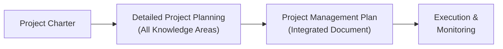

## 15.1 Project Charter and Project Management Plan

In any project environment—be it predictive, agile, or hybrid—the project charter and the project management plan stand out as two of the most critical artifacts. They act as the cornerstones of successful project integration and ensure alignment with organizational objectives. The project charter formally authorizes the project, granting the project manager the authority to apply resources. The project management plan, in turn, provides a cohesive framework for delivering project outcomes. Together, they create the backbone of effective coordination, guiding teams and stakeholders toward a unified vision and strategic direction.

This section delves into the essence of the charter and project management plan, demonstrating how they integrate key knowledge areas, enable seamless decision-making, and unify diverse viewpoints.

  
### Importance of the Project Charter

The project charter is often the first formal document in a project’s lifecycle. It captures, at a high level, what the project is intended to achieve, who is involved, and under what authority it will proceed. Although different organizations can have unique templates or naming conventions, the project charter consistently fulfills these objectives:

• Authorizes the project by a sponsor or high-level official.  
• Assigns the project manager with clear authority.  
• Clarifies the project’s purpose, aligning it with organizational strategy.  
• Provides foundational information on scope, timeline, budget, and major constraints.  
• Establishes key stakeholders’ involvement and sets initial expectations.  

Without a charter, project efforts can feel ad hoc, lacking the necessary mandate to secure resources and stakeholder commitment. The project charter also acts as a reference that the team can revisit to prevent scope creep. If a proposal arises that does not align with the original project intent stated in the charter, the project manager can swiftly identify the mismatch and seek necessary clarifications.

  
### Key Elements of the Project Charter

Although the specifics can differ across industries, project charters typically address the following:

Purpose or Justification  
: Explains why the project is being undertaken (e.g., fulfilling a strategic goal, complying with a regulation, driving innovation, or addressing a specific market gap).

High-Level Scope  
: Outlines the boundaries of what the project will address. For example, if you’re developing a new mobile application for enterprise use, the scope might entail interface design, integration with existing systems, and security configurations.

High-Level Schedule  
: Provides key milestones or target completion dates. While details reside in the project management plan, the charter might highlight major milestones or product releases.

High-Level Budget  
: Summarizes the overall budget or cost constraints. Some organizations simply include a budget range, while others highlight the entire project cost if it is known at the time of charter authorization.

Roles and Responsibilities  
: Names the project manager, sponsor, and possibly other high-level stakeholders (e.g., steering committee). Documenting responsibilities and authority early fosters clarity in decision-making.

Risks and Assumptions  
: Flags any major risks or constraints identified at this early stage to set realistic expectations. This might include external dependencies, regulatory requirements, or reliance on vendor capabilities.

Success Criteria  
: Describes how project success will be measured or validated. Often, success correlates with how closely the project outcomes align with organizational objectives and stakeholder satisfaction.

Authorization and Approval  
: Offers the official sign-off from the sponsor or senior management, signifying the project has the green light to initiate subsequent phases of planning and execution.

### The Charter’s Alignment with Organizational Strategy

The project charter is not merely a ceremonial document—it is a critical link to organizational goals. A well-crafted charter clarifies how the project connects to the bigger strategic picture, be it launching a new revenue stream, improving internal processes, or developing a novel product.

Revisiting Chapter 28 on “Aligning Projects with Organizational Strategy,” the charter can be seen as the handshake between executive governance (programs, portfolios) and the project team. This synergy helps secure organizational support and ensures that the project invests efforts in solutions that produce tangible business value.

### Transitioning from Charter to Project Management Plan

Once the project charter is approved, the project manager begins the detailed planning process. The project management plan is the next step in Integration Management and elaborates on every aspect of how the project will be executed, monitored, controlled, and closed.

The transition can include a series of facilitated workshops, stakeholder interviews, and iterative drafts of the plan. During these activities, the team and stakeholders build upon the framework established by the charter, refining the scope, schedule, cost, risk approach, procurement strategies, stakeholder engagement tactics, communication protocols, and more.

Below is a visual representation of how the charter feeds into the overall planning process:

In this flowchart:  
• The project charter lays the foundation, enabling project initiation.  
• Detailed planning spans every knowledge area (scope, schedule, cost, quality, resource, risk, communications, stakeholders, procurement, etc.).  
• The resulting project management plan provides a structured set of guidelines for execution and control.  
• The plan is used continuously throughout project execution and monitoring.

  
### Overview of the Project Management Plan

Unlike the project charter, which is typically concise and high-level, the project management plan is a comprehensive, integrated document that details every facet of how the project will be carried out. This plan is not static; it evolves through progressive elaboration as more information becomes available or project dynamics change.

Core components generally include:  

Scope Management Plan  
: Details how scope will be defined, validated, and controlled. Specifies how changes will be handled to prevent scope creep.

Schedule Management Plan  
: Explains methods for scheduling tasks, identifying dependencies, and controlling the schedule. Often references diagrams (like network diagrams or Gantt charts) and includes methods such as rolling-wave planning.

Cost Management Plan  
: Outlines how project costs will be estimated, budgeted, and controlled. This includes details on earned value metrics and budget reporting.

Quality Management Plan  
: Defines quality standards, metrics, and levels of acceptance. Explains the approach for quality assurance (QA) and quality control (QC).

Resource Management Plan  
: Addresses resource-specific processes, from identifying needed skill sets to resource allocation and conflict resolution. References collaborative techniques for building cohesive teams.

Communications Management Plan  
: Specifies what data will be communicated, to whom, when, and in which format. Particularly critical in virtual setups and cross-functional environments.

Risk Management Plan  
: Emphasizes the risk identification process, qualitative and quantitative analysis methods, risk response, and ongoing monitoring. Encourages a mindset of finding opportunities in addition to threats.

Procurement Management Plan  
: Outlines how external procurements (if any) will be handled, from vendor selection to contract administration and closure.

Stakeholder Engagement Plan  
: Builds upon the stakeholder analysis in the charter, providing detailed strategies for engagement, participation, and conflict management.

Alongside these subsidiary plans, the comprehensive project management plan can also include or reference:  
• Change management procedures  
• Configuration management requirements  
• Performance measurement baselines and reporting methods  
• Lessons learned repositories from previous phases or similar projects  

When teams use agile or hybrid approaches, the project management plan might include adaptive elements, such as iteration cadence, backlog grooming processes, or product increment reviews. Chapter 27 on “Hybrid Approaches” provides additional insight into merging predictive planning with agile frameworks.

  
### Integration of Subsidiary Plans

Project Management Integration ensures that each component plan aligns with the others rather than operating in isolation. For instance, adjusting the project schedule has budget, resource, risk, and communication implications. Transparent integration—coordinated by the project manager—keeps details consistent and fosters cohesive decision-making.

A simple example is changing the project scope to include an additional feature requested by stakeholders. The resource plan must incorporate new skill sets or more staffing, the cost plan must reflect the associated increase in budget, and the timeline may require extension or reallocation of tasks. If done in a silo, these changes can cause confusion, misalignment, and budget overshoot.

  
### Tools and Techniques for Crafting the Plan

Several tools and techniques support the detailed development of the project management plan:

Project Management Information Systems (PMIS)  
: Software tools like Microsoft Project, Primavera, or agile and DevOps platforms (e.g., Jira or Azure DevOps). These tools facilitate schedule tracking, cost baselines, resource allocation, and communications.

Expert Judgment  
: Experienced team members, subject matter experts, and consultants can offer valuable insights into realistic estimates or risk scenarios.

Data Gathering and Analysis  
: Techniques like brainstorming, Delphi method, or root cause analysis can help define risk responses, scope elements, or schedule constraints.

Facilitation Techniques  
: Workshops, focus groups, or co-creation sessions bring together cross-functional experts to reach consensus on planning details.

Meetings and Reviews  
: Regular stakeholder meetings, steering committee sessions, or sponsor check-ins provide feedback loops. Especially important in agile contexts, these might manifest as sprint planning or backlog refinement meetings.

  
### Ensuring Cohesive Project Direction

Project success hinges on integrating the project charter with the project management plan into a single cohesive direction. Here are a few strategies:

Maintain a Line of Sight to Organizational Goals  
: The project charter explains the “why,” and the project management plan outlines the “how.” Always evaluate decisions against these broad objectives.

Engage Stakeholders Continuously  
: Avoid surprises by maintaining an active stakeholder communication strategy. Early and frequent engagement leads to better risk mitigation and alignment with evolving needs.

Review and Update Plan Regularly  
: The project environment, technology, and stakeholder expectations may shift over time. Revisiting the plan ensures any new information or direction is incorporated effectively.

Establish Clear Escalation Paths  
: Define how conflicts or major issues are escalated—first to the project manager, then if necessary to the sponsor or governance body. This clarity can prevent confusion and delays.

Incorporate Agile Methods Where Feasible  
: Even if the project mostly follows a predictive approach, agile techniques (like iteration planning or daily standups) can enhance flexibility, speed, and collaboration.

  
### Common Pitfalls and Ways to Overcome Them

Lack of Executive Sponsorship  
: When the charter is signed off by someone detached from the organization’s strategic goals, the project manager may struggle to secure the necessary resources. To mitigate, ensure buy-in from the right executive(s) during charter creation.

Overly General Charter  
: If the charter fails to establish baseline requirements or constraints, the planning process can drift aimlessly. Projects benefit from a balanced level of detail—enough to guide, but not so rigid as to stifle creative solutions.

Inconsistent Communication  
: A fleeting mention of stakeholder management in the charter must be expanded in the project management plan. Gaps in communication planning lead to misunderstandings and missed deadlines.

Poor Change Management  
: Scope creep occurs when no integrated change control process is in place. Even well-defined charters and plans can unravel if the change process is not consistently enforced. Chapter 15.3 addresses integrated change control in greater detail.

Ignoring Early Risks  
: If the project charter identifies potential threats but these are not carried into the project management plan’s risk management strategies, the team may be unprepared for predictable challenges.

  
### Example: IT System Upgrade

Imagine a financial services firm embarked on an IT system upgrade to meet new compliance rules. The project sponsor created a concise project charter outlining the business need (regulatory compliance), estimated cost ($1.8 million), and an eight-month timeline. Upon approval, the project manager initiated detailed planning:

• Scope Management Plan: Clarified the requirement to integrate risk modeling software and digital identity verification.  
• Schedule Management Plan: Identified key phases (planning, pilot testing, deployment) and posted them in the project’s timeline with critical milestones.  
• Risk Management Plan: Listed vendor availability, data security, and untested interface connections as top risks, with contingency measures.  
• Stakeholder Engagement Plan: Ensured frequent updates to compliance officers, finance managers, and IT staff.  

This example demonstrates how the initial broad statements in the charter evolved into a rigorously detailed project management plan, ensuring consistent alignment and a path to success.

  
### Realizing an Effective Plan

A robust, living project management plan is central to effective Integration Management. At any stage of the project, the plan guides and aligns everyone’s efforts with the project’s purpose. Effective project managers treat the plan as a baseline and organizational learning tool: With each major milestone, they update or refine the plan to reflect new data, lessons learned, or changes in business needs.

Project managers should also keep in mind that too much detail can paralyze teams. Balance is key. Provide enough detail to clarify direction and accountability, but avoid micromanaging tasks that stifle creativity or hamper the team’s ability to adapt to issues as they arise.

  
### References for Further Exploration

• Project Management Institute (PMI). A Guide to the Project Management Body of Knowledge (PMBOK® Guide), Seventh Edition.  
• PMI. Agile Practice Guide: Exploring Hybrid Approaches to Project Delivery.  
• Kerzner, H. (2017). Project Management: A Systems Approach to Planning, Scheduling, and Controlling.  
• Sliger, M. & Broderick, S. (2008). The Software Project Manager’s Bridge to Agility.  
• Various PMIstandards+™ resources illustrating integration across knowledge areas.  

  
## Test Your Knowledge: Project Charter and Project Management Plan



### Which key information is most essential in a project charter?

- [x] High-level project scope, purpose, and sponsor authorization
- [ ] Detailed cost estimates and resource assignments
- [ ] Complete list of quality metrics and acceptance criteria
- [ ] Comprehensive communications matrix

> **Explanation:** A project charter authorizes the project, identifies the main purpose or justification, and states high-level scope and sponsor endorsement. Detailed cost estimates, acceptance criteria, and communication matrices typically reside in the project management plan.

### What is one primary reason to create a formal project charter?

- [x] It ensures the project manager has the authority to apply organizational resources.
- [ ] It guarantees the project will stay on schedule.
- [x] It defines job descriptions for every team member in detail.
- [ ] It establishes the final deliverable acceptance criteria.

> **Explanation:** The project charter formally authorizes and empowers the project manager, ensuring organizational buy-in. It does not guarantee schedule adherence or provide detailed role definitions or acceptance criteria, which come later in the project management plan.

### Which statement best describes the dynamic nature of the project management plan?

- [x] It is a living document, subject to regular updates as project needs evolve.
- [ ] It never changes once it has been officially approved.
- [ ] It only changes if the project budget changes.
- [ ] It is entirely replaced whenever stakeholders request new features.

> **Explanation:** A project management plan is iterative and should be updated as new information is discovered or changes occur, ensuring adaptability and consistency throughout the project lifecycle.

### Which aspect is typically covered in a stakeholder engagement plan?

- [x] Strategies to manage diverse stakeholder interests and communications
- [ ] A budget allocation for resource acquisition
- [ ] The method to define the project’s critical path
- [ ] The official signature and approval of project funding

> **Explanation:** Stakeholder engagement focuses on how to effectively involve, communicate with, and manage the expectations of stakeholders. Budget allocation and critical path identification appear in other sections of the project management plan, and the official signature usually appears in the project charter.

### What is the fundamental distinction between the project charter and the project management plan?

- [x] The charter authorizes the project, while the plan details how the project will be executed.
- [ ] The charter contains resource assignment, while the plan defines business justification.
- [x] The charter is highly detailed, whereas the plan is a brief summary.
- [ ] The plan replaces the charter once approved.

> **Explanation:** The project charter formally authorizes the project and references high-level objectives and boundaries; the project management plan is a comprehensive blueprint detailing execution strategies, processes, and controls.

### Which item is likely to be found in both the project charter and project management plan?

- [x] High-level risks or constraints that later evolve into detailed risk responses
- [ ] A fully developed schedule baseline with resource loading
- [ ] Detailed quality checklists
- [ ] Comprehensive procurement documentation

> **Explanation:** While the charter mentions risks and constraints at a high level, these are fleshed out with detailed responses in the project management plan. Baselines, checklists, and procurement details are typically exclusive to the plan.

### Why is establishing clear escalation paths critical for cohesive project direction?

- [x] It prevents confusion by specifying who to contact and when for key decisions or conflicts.
- [ ] It allows the project manager to bypass the sponsor’s input.
- [x] It eliminates the need for change control.
- [ ] It guarantees automatic budget increases for major problems.

> **Explanation:** Clear escalation paths let the team know the protocol for surfacing issues or making high-level decisions. They do not replace change control and do not guarantee budget increases.

### Which is an example of an agile or hybrid approach incorporated within a largely predictive project management plan?

- [x] Inserting short iterative cycles for portions of the scope that require frequent feedback
- [ ] Adopting no plan at all to embrace agility
- [ ] Eliminating quality testing to speed up delivery
- [ ] Having a sponsor write all user stories without consulting the team

> **Explanation:** Incorporating iterative cycles that gather rapid feedback on specific deliverables is a common way to blend agile practices into a predictive environment. Eliminating planning or quality is ineffective for project success.

### What is a major challenge if a project charter is extremely general?

- [x] The team lacks a strong baseline for scope, timeline, or resource needs.
- [ ] It allows for more flexible control and fosters innovation.
- [ ] It ensures quick sponsor approval.
- [ ] There is less need for stakeholder engagement.

> **Explanation:** An overly vague charter diminishes clarity for the project’s foundation. Without clarity, the team can struggle to define scope, schedule, or resource requirements, leading to confusion and potential misalignment.

### True or False: The project charter and business case are identical documents and serve the same purpose.

- [x] False
- [ ] True

> **Explanation:** The business case justifies the project from a financial or strategic viewpoint, while the charter formally launches the project, naming the project manager and establishing high-level parameters.



## PMP Mastery: 1500+ Hard Mock Exams with Full Explanations 

Looking to crush the PMP exam with confidence? Dive deep into 6 rigorous mock exams totaling 1500+ advanced-level questions, each accompanied by clear, step-by-step explanations. Hone your test-taking strategies, master complex topics, and build the resilience you need on exam day. Perfect for serious PMs aiming beyond fundamentals.  

Enroll now:  
[PMP Mastery: 1500+ Hard Mock Exams with Exceptional Clarity & Full Explanations](https://www.udemy.com/course/pmp-2025/?referralCode=CF83A54BC86BE27F9AFE)

_Disclaimer: This course is not endorsed by or affiliated with the PMI examination authority. All content is provided purely for educational and preparatory purposes._
