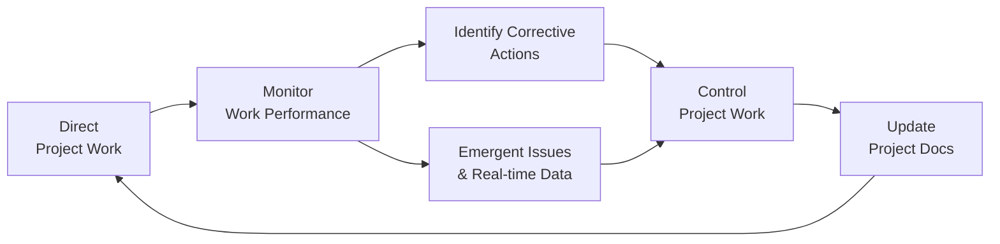

## 15.2 Direct, Manage, Monitor, and Control Project Work

This section focuses on one of the most critical functions of project integration management: ensuring your project is performing according to plan, while also handling unexpected changes and real-time information. Whether you are dealing with a fully predictive project or applying agile and hybrid techniques, the holistic coordination of people, processes, and communications is fundamental to achieving desired outcomes. This chapter explores best practices for directing and managing project work, and seamlessly monitoring and controlling progress. You will discover how to optimize communication flows, address emergent issues, and maintain alignment with strategic goals across the organization.

By the end of this section, you should be able to:  
• Understand the key components of effectively directing and managing project activities.  
• Establish mechanisms for real-time data updates and reporting.  
• Monitor project performance, identify necessary corrective actions, and control changes.  
• Coordinate across all project processes and knowledge areas to maintain an integrated approach.

---

### The Essence of Integration in Day-to-Day Project Management

Project Integration Management is the unifying knowledge area that ensures all other project elements—scope, schedule, cost, quality, resource, communication, risk, procurement, and stakeholder engagement—work together smoothly. Directing, managing, monitoring, and controlling project work are core sub-processes within this knowledge area. While other knowledge areas handle specific domains (for instance, Cost Management focuses on budgeting and expenditures), the Project Integration Management knowledge area ensures each domain’s insights are harmonized into one overarching strategy.

In practical terms, directing and managing project work revolves around executing the plan. However, no matter how meticulously you plan, reality often presents various surprises. Market conditions shift, scope changes arise, budgets face constraints, and your resource pool might evolve mid-project. Thus, constant monitoring and controlling are also required to sense new developments, address risks as they surface, and implement updates in real time.

---

### Direct and Manage Project Work

Directing and managing project work deals with the day-to-day operational aspects of running a project. The aim is to carry out your project management plan efficiently by performing the required tasks, coordinating teams, and ensuring the deliverables meet quality standards. This involves:

• Communicating effectively with stakeholders and project teams.  
• Allocating project resources appropriately (e.g., people, budget, materials).  
• Addressing emergent issues and constraints.  
• Engaging in real-time decision-making based on ongoing feedback loops.

In many agile or hybrid contexts, “directing and managing project work” includes frequent collaboration with cross-functional teams and rapid feedback cycles. It might also encompass daily stand-up meetings, sprint reviews, backlog refinement sessions, and other events that drive continuous improvement. For predictive or waterfall environments, you may rely more heavily on scheduled check-ins, milestone reviews, and formal stage gates.

#### Key Inputs to Direct and Manage Project Work

From a PMBOK® Guide perspective, the direct-and-manage process typically starts with a range of inputs, such as:

• Project Management Plan: The key reference document that outlines all planned baselines (scope, schedule, cost, etc.).  
• Approved Change Requests: Any authorized alterations from the change control board, detailing adjustments to scope, schedule, or budget.  
• Enterprise Environmental Factors (EEFs) and Organizational Process Assets (OPAs): Internal standards, industry regulations, organizational policies, and knowledge repositories.

#### Tools and Techniques

While the Seventh Edition of the PMBOK® Guide encourages tailoring processes to meet project needs, several proven techniques are commonly used:

• Expert Judgment: Consulting subject matter experts for advice on complex or uncertain matters.  
• Project Management Information Systems (PMIS): Digital platforms such as enterprise resource planning (ERP) systems, agile project management apps, or scheduling software that organize and track project activities.  
• Meetings and Workshops: Facilitated sessions for decision-making, planning, and resolving issues.

#### Outputs

Directing and managing the project work generates “Work Performance Data”—the raw metrics on how tasks are proceeding against the plan. This includes completion status, resource usage, costs incurred, and more. It also leads to updated deliverables, new change requests, and a refined project management plan.

---

### Dealing with Emergent Issues

Emergent issues can derail a project if not properly managed. They can range from technical challenges—such as an unexpected defect in a software application—to human resource constraints—like team members being reassigned mid-project. Common strategies to address emergent issues include:

• Establishing Clear Escalation Paths: Everyone on the team should know who to contact when a certain threshold of risk or impact is reached.  
• Maintaining a Contingency Reserve: Both cost and time buffers can help you absorb unexpected setbacks.  
• Facilitating Continuous Feedback: Agile events (e.g., daily standups, retrospectives) or frequent checkpoint meetings in predictive approaches enable issues to surface early.

Issues often come with potential scope changes. The integrated nature of this sub-process ensures that any emergent change is evaluated for impacts on schedule, quality, risk, and overall project viability. (See Chapter 17: Scope and Requirements Management for details on evaluating and incorporating changes in scope.)

---

### Monitor Project Work

Monitoring project work is about assessing whether the project is on track to meet the objectives. Monitoring focuses on:

• Continuously evaluating performance metrics (work performance data, status reports, etc.).  
• Checking alignment with the project management plan and organizational strategy.  
• Identifying variances, risks, or opportunities that might require response or official change requests.  
• Collecting and managing lessons learned.

When you monitor a project, you translate raw work performance data into greater insights known as “Work Performance Information.” As you add context, interpret metrics, and correlate data across multiple knowledge areas, you produce relevant information to understand the health of your project. Aggregating cost and schedule data, for example, can help you spot warning signs early—such as a looming budget overrun or schedule slippage—allowing you to address these proactively (see Chapter 13: Measurement Performance Domain).

---

### Control Project Work

Controlling project work takes the insights gained from monitoring and transforms them into corrective actions. This step ensures that the project remains on course to meet its objectives or that it is re-aligned when variances are detected. Control activities commonly involve:

• Performing variance analysis, trend analysis, and Earned Value Management (EVM).  
• Approving corrective and preventive actions.  
• Managing change requests following a defined integrated change control process.  
• Adapting schedules, budgets, resource allocations, or even project goals if warranted.

This cyclical interaction of monitoring and controlling ensures that any necessary modifications—whether to the team’s approach, the scope, or the schedule—are implemented in a timely, controlled manner. Maintaining close ties to the risk management processes is also crucial (see Chapter 22: Risk and Uncertainty Management (Revisited)).

---

### Real-Time Data Updates and Reporting

With the rise of digital transformation and distributed project teams, real-time data is increasingly paramount. Effective project management software or collaborative tools can import critical information daily, hourly, or even by the minute, allowing immediate visibility into the status of tasks and deliverables. This enables faster decision-making, a quicker reaction to risks, and more effective stakeholder engagement.

However, relying on real-time data requires clearly defined data governance standards and robust cybersecurity practices. In large organizations or government projects, confidentiality and data integrity are as important as project speed. Balancing transparency with data privacy is critical (see Chapter 31: Advanced Compliance and Regulatory Considerations).

---

### Coordinating Across Processes and Knowledge Areas

Direct, manage, monitor, and control project work does not exist in isolation. It is closely interwoven with planning, execution, measurement, and risk management. Here are some key interactions:

- Scope Management: Adjusting the scope baseline when emergent issues or changes arise.  
- Schedule Management: Tracking planned vs. actual progress and identifying areas for schedule compression if necessary (see Chapter 18: Schedule Management).  
- Cost Management: Employing EVM metrics like Cost Performance Index (CPI) and Schedule Performance Index (SPI) to monitor financial health (see Chapter 19: Cost Management).  
- Quality Management: Incorporating testing, quality checks, and acceptance criteria into your monitoring regimen (see Chapter 20: Quality Management).  
- Resource and Communication Management: Adjusting team assignments or communication strategies to align with new project challenges (see Chapter 21: Resource Management and Chapter 16: Stakeholder and Communications Management).  
- Risk Management: Revisiting risk response plans and triggers when new data indicates heightened or diminished probabilities (see Chapter 22: Risk and Uncertainty Management).  
- Scope, Stakeholder, and Procurement: Ensuring that changes to contracts or deliverables do not compromise relationships or cause legal complications (see Chapter 23: Procurement Management and Chapter 7: Stakeholder Performance Domain).

Each knowledge area feeds or draws information from these integration processes, ensuring the project remains cohesive.

---

### Practical Example: Electric Vehicle Charging Platform Project

Imagine you are leading a project to develop and install electric vehicle (EV) charging stations in a new region. During execution, you notice that local zoning regulations are more stringent than anticipated (emergent issue). You gather real-time data from permitting offices, construction teams, and the local utility company to assess the impact on schedule and costs. 

Below is a simplified diagram showing how you manage and control project work, integrating emergent issues and real-time data:

• Direct Project Work (A): Oversee construction crews, ensure procurement of EV station materials, and collaborate with utility providers.  
• Monitor Work Performance (B): Track daily progress, cost usage, and schedule. Identify any deviations (e.g., storage fees for materials if the project is delayed by permits).  
• Identify Corrective Actions (C): Propose solutions (perhaps negotiating a special permit or adjusting the design to meet new zoning regulations).  
• Control Project Work (D): Use integrated change control to approve new site engineering plans or additional cost outlays for compliance.  
• Update Project Documentation (E): Record changes in the project management plan, risk register, and cost baseline to reflect new realities.  
• Emergent Issues & Real-time Data (F): Provide immediate feedback loops to your control processes, ensuring minimal response lag.

---

### Common Pitfalls and How to Avoid Them

• Ignoring Early Warning Signs: Delaying corrective action can exacerbate schedule or budget overruns, leaving little room to recover.  
• Unclear Roles and Responsibilities: When accountability is unclear, important updates and decisions fall through the cracks.  
• Overcomplicating the Reports: Drowning stakeholders in excessive data or overly detailed metrics can lead to confusion. Strive for concise, meaningful dashboards.  
• Poor Change Management: Failing to follow a structured change control process can knock the project off course and undermine stakeholder trust.

---

### Best Practices for Effective Project Work Management

• Establish a Rhythm of Communication: Daily standups or weekly progress reviews facilitate quick identification of variances and emergent issues.  
• Encourage Transparency: Empower team members to raise red flags without fear of reprisal. Issues caught early are often easier and cheaper to fix.  
• Embrace Iterative Updates: Continuous refinement of your plan as you learn new information can yield better alignment with reality.  
• Align with Organizational Strategy: Periodically verify that the project’s direction supports broader corporate objectives, which may evolve over time (see Chapter 28: Aligning Projects with Organizational Strategy).

---

### Agile, Hybrid, and Predictive Perspectives

Agile teams often incorporate direct, manage, monitor, and control processes into sprint cycles. By maintaining a potentially shippable product increment and frequent retrospectives, they can “manage” and “control” project progress incrementally. On the other hand, in a predictive (waterfall) environment, these processes usually manifest as formal oversight, typically governed by the project manager and a centralized Project Management Office (PMO). Hybrid approaches combine the best of both: using agile techniques for fast-paced development work, while employing traditional gating or milestone reviews for key decision points and compliance checks.

---

### Building a Culture of Continuous Learning

To consistently excel in directing and managing project work, cultivate a learning culture. Encourage team members to reflect on their experiences, whether successes or failures, and integrate these lessons into the existing project management plan. A robust lessons learned repository and a culture of openness can drastically improve your ability to monitor and control future projects. (See Chapter 11: Project Work Performance Domain for more insights on lessons learned and knowledge transfer.)

---

### References for Further Exploration

• Project Management Institute (2021). A Guide to the Project Management Body of Knowledge (PMBOK® Guide) – Seventh Edition.  
• Agile Practice Guide (by PMI and Agile Alliance) for blending agile practices with traditional project management.  
• Kerzner, H. (2017). Project Management: A Systems Approach to Planning, Scheduling, and Controlling.  
• Chapter 10: Planning Performance Domain and Chapter 13: Measurement Performance Domain in this book for deeper dives into planning and metrics.  
• Chapter 22: Risk and Uncertainty Management (Revisited) for a thorough discussion on risk response integration.

---

## Test Your Knowledge: Direct, Manage, Monitor, and Control Project Work



### Which of the following best describes the “direct” aspect of Direct, Manage, Monitor, and Control Project Work?

- [ ] Performing variance analysis to identify schedule overruns  
- [x] Leading the day-to-day operational execution of tasks, deliverables, and team coordination  
- [ ] Reviewing lessons learned from past projects for future planning  
- [ ] Approving changes to project scope after analyzing impacts  

> **Explanation:** “Direct” project work focuses on overseeing and coordinating the tasks at hand, ensuring resources and teams fulfill the project’s objectives on a daily basis.

### In a project leveraging agile methodologies, how is the concept of “monitoring and controlling” typically applied?

- [x] Through shorter feedback loops, daily standups, and iteration-based reviews  
- [ ] By pushing all transparency responsibilities solely to the PMO  
- [ ] By solely relying on formal monthly status reports  
- [ ] By handling scope changes only at the end of the delivery cycle  

> **Explanation:** Agile methodologies apply continuous monitoring and controlling through daily meetings, frequent demos, and retrospectives to quickly adapt to changing requirements.

### What is a primary benefit of maintaining real-time project data?

- [x] Faster detection of variances, leading to quicker corrective actions  
- [ ] Reduced need for stakeholder communication  
- [ ] Elimination of all project risks  
- [ ] Automatic compliance with local regulations  

> **Explanation:** Real-time project data allows immediate visibility into performance, enabling the project manager and team to address variances and emergent issues more effectively.

### An emergent regulation change unexpectedly impacts your project’s schedule. Which process will you rely on to evaluate the potential impact on budget, resources, and scope?

- [ ] Stakeholder Engagement Plan  
- [x] Integrated Change Control Process  
- [ ] Risk Register Audit  
- [ ] Product Backlog Prioritization  

> **Explanation:** The integrated change control process ensures that any emergent change (such as a new regulation) is evaluated for impacts on all project elements to maintain overall alignment.

### Which of the following is an example of a tool or technique used in Direct, Manage, Monitor, and Control Project Work?

- [x] Project Management Information Systems (PMIS)  
- [ ] Project Charter  
- [x] Expert Judgment  
- [ ] Closing Checklists  

> **Explanation:** PMIS and expert judgment are common tools and techniques for directing, managing, monitoring, and controlling project work.

### Why is a clearly defined escalation path important in a project?

- [x] It ensures that critical issues are brought to the right decision-makers promptly  
- [ ] It allows team members to bypass the project manager  
- [ ] It guarantees that no changes will be made to the project scope  
- [ ] It eliminates the risk of schedule slippage  

> **Explanation:** A well-defined escalation path streamlines communication when problem severity crosses a certain threshold, ensuring timely and appropriate responsiveness.

### What is one key output from the “Direct and Manage Project Work” process?

- [x] Work Performance Data  
- [ ] Detailed durations for future projects  
- [x] Updates to Project Documents  
- [ ] Project Charter  

> **Explanation:** Work performance data (raw metrics) and updates to project documents are outputs of the Direct and Manage Project Work process, capturing information on how tasks are executed against the plan.

### In a hybrid environment, how might control activities be structured?

- [x] Use agile ceremonies for continuous feedback and a formal change review board for scope modifications  
- [ ] Rely entirely on automated scripts to manage changes  
- [ ] Implement no control measures to encourage adaptability  
- [ ] Enforce only waterfall stage gates with no agile feedback loops  

> **Explanation:** A hybrid approach often merges agile's continuous feedback loops with more formal review and approval boards from traditional project management.

### Which of the following is a common pitfall related to project monitoring and controlling?

- [x] Waiting too long to take corrective action on apparent budget overruns  
- [ ] Using variance analysis to identify project trends early  
- [ ] Maintaining a frequent communication cycle  
- [ ] Conducting integrated change control for major scope amendments  

> **Explanation:** Delaying action on early warning signs is a common pitfall that can lead to escalating problems, whereas proactive approaches can help avert major disruptions.

### Managing emergent issues and real-time data effectively can:

- [x] Improve the speed of decision-making and reduce costly delays  
- [ ] Guarantee that no stakeholder will ever request a scope change  
- [ ] Remove the need for formal documentation  
- [ ] Eliminate the need for daily standups in agile environments  

> **Explanation:** Leveraging real-time data and promptly addressing emergent issues fosters a proactive environment, leading to faster, more informed decisions and fewer unexpected setbacks.



---

## PMP Mastery: 1500+ Hard Mock Exams with Full Explanations 

Looking to crush the PMP exam with confidence? Dive deep into 6 rigorous mock exams totaling 1500+ advanced-level questions, each accompanied by clear, step-by-step explanations. Hone your test-taking strategies, master complex topics, and build the resilience you need on exam day. Perfect for serious PMs aiming beyond fundamentals.

Enroll now:  
[PMP Mastery: 1500+ Hard Mock Exams with Exceptional Clarity & Full Explanations](https://www.udemy.com/course/pmp-2025/?referralCode=CF83A54BC86BE27F9AFE)

_Disclaimer: This course is not endorsed by or affiliated with the PMI examination authority. All content is provided purely for educational and preparatory purposes._
