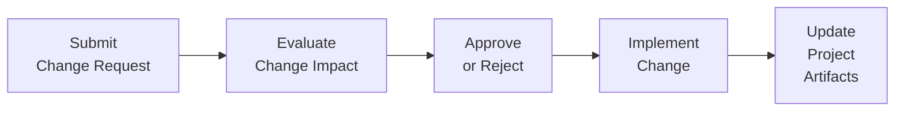

## 15.3 Integrated Change Control and Closing Projects

Integrated Change Control is the systematic method by which project changes are formally evaluated, approved or rejected, implemented, and documented. In tandem with a well-structured closure process, Integrated Change Control ensures that the project or phase ends with all deliverables completed and confirmed, lessons captured, and organizational assets updated. This section will guide you through the intricacies of processing change requests, balancing flexibility with governance, and successfully wrapping up projects or project phases. While these practices have been staples in traditional project management, they also hold immense value in hybrid and agile environments.

By understanding the formal steps—identifying, assessing, deciding, implementing, and documenting changes—you ensure that modifications align with project objectives. Additionally, applying common closure guidelines helps establish a smooth transition of deliverables or benefits to operations, closes out contracts, and reinforces continuous improvement in your organization.

---

### Understanding the Importance of Integrated Change Control

No project proceeds entirely as planned, regardless of how comprehensive the initial baseline might be. Requirements can shift, market conditions evolve, or stakeholder needs change. Integrated Change Control provides a unified framework for:

• Evaluating the overall impact of any requested change.  
• Ensuring that the proposed alteration aligns with project objectives and business goals.  
• Addressing and balancing the overlapping resources and constraints across scope, schedule, cost, quality, and risk.  
• Preserving transparency and accountability by documenting approvals or rejections.  
• Maintaining an audit trail for lessons learned.

In the context of the PMBOK® Guide Seventh Edition, Integrated Change Control is part of the critical function that ties decisions and governance together across the project performance domains. Whether you follow an agile, predictive, or hybrid approach, you still need a method to manage what can and cannot be changed, along with who has decision-making authority.

---

### The Integrated Change Control Process

Integrated Change Control is best summarized by a cyclical system of ongoing review and approval. Although terminologies differ across organizations, the following steps are commonly used:

1. **Request the Change:** A request may come from any stakeholder, sponsor, or the project team for reasons including enhancements, cost adjustments, or regulatory changes.  
2. **Record the Request:** Log the request in a change management system, ensuring transparency when capturing details such as origin, date, and reason.  
3. **Evaluate Impact:** Determine how the change affects the project’s constraints (scope, schedule, budget, risk, and quality).  
4. **Review and Decide:** A designated authority—often a Change Control Board (CCB)—reviews the request and impact analysis to either approve, reject, or postpone the decision.  
5. **Implement the Decision:** Upon approval, update relevant documents and systems to reflect the new baseline. Communicate the decision to all impacted parties.  
6. **Track and Control:** Track the change through implementation, ensuring it accomplishes the intended benefit without introducing new risks.  
7. **Update Organizational Process Assets (OPAs):** Store the final records of the approved or rejected changes in accordance with organizational policies, providing a knowledge base for future projects.

Below is a simplified flowchart illustrating a basic Integrated Change Control process:

This diagram shows a feedback loop from the initial submission, to evaluation, review, and then execution (or rejection) of the request, culminating in updated documentation.

---

### Tools and Techniques in Integrated Change Control

Depending on your organization’s maturity level and the complexity of your project, you may employ various tools and techniques to enhance the change control process:

- **Change Control Board (CCB)**: A formal committee (or designated person, in smaller organizations) responsible for making decisions on requested changes.  
- **Decision-Making Techniques**: Methods such as unanimity, majority, consensus, or weighted scoring to arrive at approval or rejection.  
- **Configuration Management System**: Ensures that only approved changes are implemented and that consistent definitions of deliverables exist.  
- **Impact Analysis**: Evaluation of how each change may affect scope, time, cost, quality, and risk. Analytical software can model multiple scenarios.  
- **Change Logs**: Centralized repositories that track the change request’s status, date of submission, decision, and final outcomes.

In agile or hybrid settings, integrated change control often becomes more iterative. For instance, changes might be incorporated into a backlog, reviewed during sprint planning, or introduced during dedicated change review sessions. However, the essence remains the same: documenting requests, analyzing impact, obtaining formal approval, and ensuring the team clearly understands changes before implementation.

---

### Balancing Adaptability with Control

One of the greatest challenges in managing integrated change is balancing the need to adapt quickly against the governance necessary to avoid scope creep. Key strategies include:

• **Use Time-Boxed Review Windows:** Set regular intervals (e.g., the end of a sprint, or monthly) to formally assess and incorporate changes.  
• **Categorize Changes:** Distinguish between minor, moderate, and major/strategic changes. Streamline approval processes accordingly.  
• **Delegate Authority Where Appropriate:** Allow teams to self-manage minor changes that do not significantly impact constraints, while escalating major changes to higher-level governance.  
• **Strict Baselines & Traceability:** Especially in regulated or highly technical projects, maintain version control and traceability to prove compliance and rationale behind all changes.

By employing a well-defined process, teams can refine or pivot the project scope without succumbing to chaos.

---

### Common Pitfalls and Mitigation Strategies

Despite best efforts, organizations can still stumble over the complexities of integrated change control. Below are some frequent pitfalls and ways to address them:

• **Ambiguous Change Authority:** If it’s unclear who approves changes, decisions get stalled. → Clearly establish roles, responsibilities, and the final authority for each change category.  
• **Insufficient Impact Analysis:** Rushing to implement changes without evaluating the effect on time, cost, and quality. → Standardize an impact assessment checklist to ensure no dimension is overlooked.  
• **Excessive Bureaucracy:** When the approval process becomes too tedious, smaller but necessary changes might be delayed. → Implement a tiered process that allows for expedited review of low-risk alterations.  
• **Poor Communication:** Changes can abruptly catch stakeholders off guard if they’re not informed. → Keep a regularly updated change log, and develop close collaboration with the communications management plan.  
• **Scope Creep vs. Scope Improvement:** Not all scope enhancements are scope creep. → Distinguish changes that truly add value from those that constitute an unplanned expansion of scope.

---

###Formal Project or Phase Closure

Closing a project or phase might seem straightforward: the team finishes deliverables and the project manager conducts final checks. However, effective closure consists of more than just sending a “completion email.” Properly implemented closure:

• Ensures all deliverables have been accepted or transitioned to operations.  
• Finalizes all relevant documentation, including lessons learned, final contracts, and archiving.  
• Offers an opportunity for formal knowledge transfer, closure of financial accounts, and release of resources.  
• Provides a moment for reflection and celebration, boosting morale and reinforcing best practices.

Administration becomes progressively more essential in regulated or high-stakes environments, where final reports, legal documents, and compliance statements must be precisely catalogued. Closing projects smoothly also maintains professional relationships with stakeholders, sponsors, and vendors.

---

### Steps in a Structured Project Closure

1. **Obtain Formal Acceptance of Deliverables:** Ensure the sponsor or customer signs off on completed work, verifying it meets stated requirements and success criteria.  
2. **Complete Contractual Obligations:** If vendors are involved, confirm that all procurement deliverables are settled and that contract closure documents are archived.  
3. **Transition Deliverables to Operations:** Work with the operational team to ensure knowledge transfer, support guidelines, and any ongoing maintenance are in place.  
4. **Archive Records:** Consolidate final project documents, lessons learned, and performance metrics. Update internal databases in compliance with organizational standards.  
5. **Release Project Resources:** Free up personnel, equipment, and any budget allocations previously reserved. Document resource usage for future reference and capacity planning.  
6. **Hold a Retrospective or Post-Project Review:** Identify lessons learned, gather feedback from stakeholders, and incorporate continuous improvement suggestions into organizational process assets.  
7. **Celebrate Success:** Acknowledge the team’s effort and achievements, reinforcing positive behaviors for future projects.

---

### Case Study: Closing a Hybrid Project

Imagine an international software development initiative that has employed a hybrid approach. A portion of the project is agile (front-end prototypes and user interface design) and the back-end system integration follows a more traditional model with fixed milestones. As you near project completion, partial deliverables from the agile sprints must seamlessly merge with the final integrated system during the closing phase.

• **Formal Acceptance:** The final integrated product undergoes user acceptance testing. The client signs off on the user interface (developed in sprints) and the integrated system modules (created via predictive milestones).  
• **Contractual Settlement:** Several external subcontractors contributed specialized code. Procurement checks if all deliverables have been met and final payments are approved.  
• **Handover:** The IT operations department receives release notes, user guides, and a mini knowledge transfer session.  
• **Updating Organizational Assets:** The project manager archives the outcomes of each sprint retrospective and the milestone deliverables for future reference.  
• **Celebration and Lessons Learned:** A final “demo day” showcases how the front-end prototypes evolved and integrated with the back-end modules, allowing the team to identify successes and improvement areas. The sponsor addresses the entire team to congratulate them on a successful completion.

---

### Agile Approaches to Closure

While agile methods do not always use the term “project closure” as rigidly as predictive approaches, they still incorporate important activities at the end of each iteration and release cycle:

• **Sprint Review & Retrospective:** Evaluate the product increment and team processes.  
• **Continuous Feedback Loop:** Obtain stakeholder buy-in and acceptance on a continual basis, reducing the volume of “big-bang” closure tasks.  
• **Rolling Wave Approach:** Frequent feedback naturally reduces the risk of accumulated unapproved changes, streamlining the final project closure.

Even in agile frameworks, a formal close-out for major releases or transitions is recommended to finalize budgets, cutover to production, and reassign resources.

---

### Linking Integrated Change Control and Closure

An essential concept in modern project execution is that integrated change control is ongoing throughout the project, keeping the baseline relevant. Near the project’s end, you want to confirm no pending change requests remain unaddressed:

• Approved changes should have been fully implemented and validated.  
• Rejected requests should be documented with rationales.  
• Potential improvements for future phases or organizational uptake should be flagged for lessons learned.  
• The final project or phase closure sign-off becomes smoother when there are no unresolved changes hanging in the system.

Properly closing a project is as crucial as initiating it because it contributes to organizational agility, learning, and strategic alignment.

---

### Best Practices and Continuous Improvement

Below are additional guidelines to perfect the Integrated Change Control and Closure processes:

• **Create Templates:** Use standardized forms for change requests, impact assessments, and closure checklists to expedite your workflow.  
• **Engage Stakeholders:** Communication and buy-in remain crucial. Involve the right people at the right time, particularly during closure.  
• **Integrate Lessons Learned:** Review your change log for patterns—frequently requested changes can signal a deeper process or requirement issue.  
• **Revisit Governance Structures:** Periodically evaluate the effectiveness of your change control process. Make improvements based on feedback or new organizational policies.  
• **Celebrate Milestones:** Even small successes build momentum for continuous improvement. Recognizing the project team fosters positivity.

---

### References for Further Exploration

1. Project Management Institute. A Guide to the Project Management Body of Knowledge (PMBOK® Guide) – Seventh Edition.  
2. PMI. Agile Practice Guide.  
3. Harold Kerzner. Project Management: A Systems Approach to Planning, Scheduling, and Controlling.  
4. PMIstandards+ Platform for adaptive approaches to change control.  
5. “Managing Change in Organizations” by PMI for in-depth strategies on organizational transformation.

---

## Test Your Knowledge: Integrated Change Control and Project Closure



### Which action should occur first in the integrated change control process?

- [x] Submit and document the change request
- [ ] Evaluate the impact on project constraints
- [ ] Implement the approved change
- [ ] Update project baselines immediately

> **Explanation:** The initial step is to formally submit and record the potential change before any impact analysis or approval occurs.

### Which technique helps a project manager quickly analyze the impact of multiple requested changes on scope, schedule, and cost?

- [x] Modeling and scenario analysis
- [ ] Brainstorming session
- [ ] Daily standup
- [ ] Manual time analysis

> **Explanation:** Modeling and scenario analysis allow for rapid comparisons of various outcomes, helping teams understand the constraints and downstream effects of requested changes.

### When is an organization most likely to experience excessive bureaucracy in the change control process?

- [x] When every request, no matter how minor, must pass through a large Change Control Board
- [ ] When the organization uses a tiered approval process
- [ ] When internal subject matter experts handle minor changes autonomously
- [ ] When the team clearly documents the impact of changes

> **Explanation:** Requiring the highest authority to approve every small change can create bottlenecks and unnecessary red tape, leading to excessive bureaucracy.

### How should integrated change control be approached in a hybrid agile-predictive project?

- [x] Establish clear baselines for predictive components while managing changes iteratively for agile components
- [ ] Abandon all formal change processes because agile projects rarely need them
- [ ] Perform only high-level change evaluation since agile sprints are fixed
- [ ] Accept changes without evaluating their impact to maintain agility

> **Explanation:** Hybrid projects should balance structured predictive elements with flexible agile methods, ensuring changes are evaluated more dynamically for agile components while still respecting baseline constraints for predictive parts.

### What is one major objective of a formal project closure process?

- [x] Transitioning lessons learned and deliverables to relevant operational teams
- [ ] Identifying major scope changes missed throughout the project
- [x] Conducting risk identification for future projects
- [ ] Avoiding any documentation to keep the closure informal

> **Explanation:** Proper closure involves transitioning deliverables, finalizing documentation, and passing on lessons learned, ensuring alignment with future operational or organizational needs.

### Which statement accurately describes contract closure?

- [x] It includes settling any open claims and ensuring all financial obligations are fulfilled
- [ ] It requires ignoring any incomplete tasks related to procurement
- [ ] It is optional for fixed-price contracts
- [ ] It focuses solely on collecting feedback from the vendor’s perspective

> **Explanation:** Contract closure involves confirming that all obligations—technical, financial, and legal—are met and that all contractual activities are concluded.

### Why is it vital to update organizational process assets (OPAs) during integrated change control?

- [x] To provide a historical record of decisions and rationales for future projects
- [ ] To hide approved changes from some stakeholders
- [x] To remain compliant with budget constraints
- [ ] To reduce the number of updates to the project schedule

> **Explanation:** Documenting changes, decisions, and rationale in OPAs helps future project teams learn from past experiences and maintain consistent methodologies.

### In agile frameworks, how is closure typically addressed at the end of each sprint?

- [x] Through a Sprint Review and Retrospective that evaluate deliverables and processes
- [ ] By immediately shutting down the entire project
- [ ] By ignoring any unfinished work
- [ ] By finalizing all procurement contracts before moving to the next sprint

> **Explanation:** Agile frameworks leverage sprint reviews and retrospectives to assess the increment of work delivered, gather feedback, and refine processes, functioning as a mini-closure for each iteration.

### Which statement is true regarding changes that occur late in a project?

- [x] They require thorough impact analysis, especially if baselines and budget are nearly exhausted
- [ ] They should be automatically rejected to keep the project on schedule
- [ ] They never happen in agile projects
- [ ] They are always considered scope creep

> **Explanation:** Late changes must be carefully examined since resource flexibility is lower, and the project may not have enough time or funds to adapt effectively.

### When is project closure considered complete?

- [x] True
- [ ] False

> **Explanation:** Project closure is considered complete once all deliverables are formally accepted, final documentation is archived, lessons learned are collected, and all contractual obligations are closed out.



---

## PMP Mastery: 1500+ Hard Mock Exams with Full Explanations 

Looking to crush the PMP exam with confidence? Dive deep into 6 rigorous mock exams totaling 1500+ advanced-level questions, each accompanied by clear, step-by-step explanations. Hone your test-taking strategies, master complex topics, and build the resilience you need on exam day. Perfect for serious PMs aiming beyond fundamentals.

Enroll now:  
[PMP Mastery: 1500+ Hard Mock Exams with Exceptional Clarity & Full Explanations](https://www.udemy.com/course/pmp-2025/?referralCode=CF83A54BC86BE27F9AFE)

_Disclaimer: This course is not endorsed by or affiliated with the PMI examination authority. All content is provided purely for educational and preparatory purposes._
