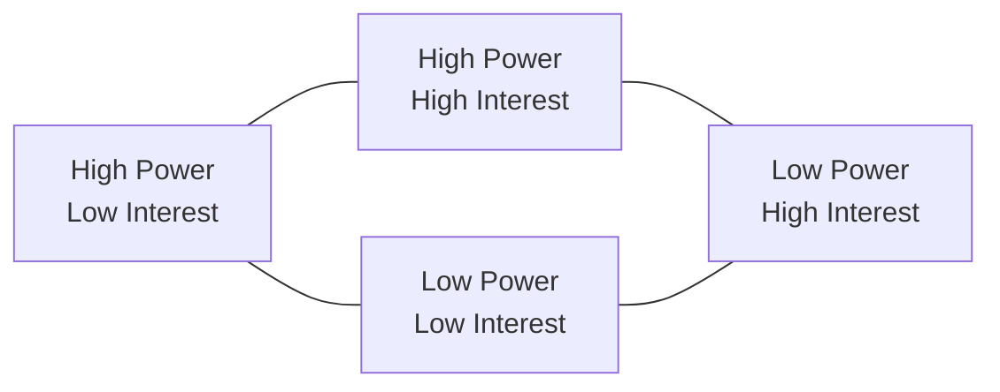
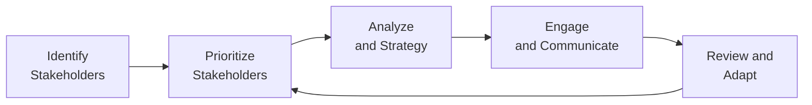

## 16.1 Stakeholder Identification and Strategy

Stakeholder engagement represents one of the most critical success factors in project management. Irrespective of how comprehensive your project plan is, neglecting to identify, understand, and manage the people and organizations that affect—or are affected by—your project can derail even the most meticulously planned endeavor. In earlier chapters, particularly Chapter 7 (Stakeholder Performance Domain) and Chapter 5 (PMI’s 12 Project Management Principles), we introduced the concept of project stakeholders and the ethics of stewardship. Here, we will explore structured, actionable methods that enable project managers to systematically identify stakeholders early, map their levels of influence and interest, build strategies to sustain their support, and limit any negative impacts. 

This section goes into considerable depth on stakeholder identification and strategy formulation, aligning with the Stakeholder and Communications Management knowledge area from a traditional context while also weaving in agile and hybrid considerations for dynamic environments. 

---

## The Importance of Thorough Stakeholder Identification

Comprehensive stakeholder identification is not merely a bureaucratic step: it is a pillar of proper governance, social responsibility, and strategic alignment. By knowing who your stakeholders are—whether internal executives, frontline team members, third-party contractors, regulators, or the community—you can:

- Anticipate needs, issues, and constraints before they escalate.  
- Establish direct communication lines and feedback loops.  
- Ensure alignment of project objectives with broader business goals.  
- Build trust and cooperation early in the project life cycle.  

Lack of thorough stakeholder identification can lead to surprises such as undiscovered constraints, unanticipated funding withdrawals, or negative public relations. This is especially critical in regulated industries (as covered in Chapter 31: Advanced Compliance and Regulatory Considerations) where missing even a minor stakeholder group—like an environmental protection agency—can result in project suspension or substantial fines.

---

## Guiding Principles

Several of PMI’s (Project Management Institute) 12 project management principles reinforce the importance of effective stakeholder identification and strategy:

- Stewardship and Ethical Conduct: Proper identification ensures transparency and ethics, preventing undisclosed agendas.  
- Collaboration and Stakeholder Engagement: Early detection of stakeholders fosters open dialogue, synergy, and teamwork.  
- Systems Thinking and Complexity: Recognizing how each stakeholder or group interacts within the larger system reduces ambiguity and risk.  
- Effective Communication and Stakeholder Alignment: The foundation for alignment begins with knowing whom you need to align.  

These principles, highlighted in Chapter 5, form an ethical and practical framework for the best practices discussed in this section.

---

## Methods and Tools for Identifying Stakeholders

Project managers rely on various techniques to discover and document both primary and secondary stakeholders. Below are some of the most common methods:

### Brainstorming and Expert Judgment

Organizing brainstorming sessions with team members, domain experts, and departmental leaders is a straightforward yet effective approach. Document every potential stakeholder, from executives who sponsor the project to operational staff, regulators, vendors, and even local communities and end-users.

### Stakeholder Register

A stakeholder register is a structured document that records key information about each stakeholder. It typically includes:

- Name and organizational role  
- Contact information  
- Influence level (financial, political, etc.)  
- Interests and expected benefits  
- Preferred communication channels and frequency  
- Potential areas of risk or conflict  

The stakeholder register is a living document and should be updated throughout the project life cycle. As new stakeholders emerge or existing stakeholders’ roles evolve, you revise and refine the register to ensure continuous relevance.

### Interviews, Surveys, and Questionnaires

One-on-one interviews allow for in-depth exploration of a stakeholder’s motivations, interests, constraints, and desired outcomes. Questionnaires and surveys help collect quantitative data, especially useful when dealing with large or geographically distributed groups. 

### Past Project Archives and Organizational Process Assets

Historic documents, governance records, and logs from similar past projects can reveal additional stakeholders who might otherwise be overlooked. Organizational process assets (such as stakeholder registers, lessons learned, and communications plans from prior initiatives) often point to recurring stakeholder types, especially in industries or organizations with stable processes.

---

## Mapping Stakeholder Influence and Interest

Once stakeholders are identified, the next step is to classify their level of interest, power, urgency, legitimacy, or other relevant attributes. This helps you determine engagement strategies and prioritize efforts. Several models assist with mapping stakeholder influence and interest:

### Power/Interest Grid

The power/interest grid is a classic, widely used model. Stakeholders are plotted on a matrix with two axes: Power (the ability to influence project outcomes) and Interest (the level of concern or involvement with project objectives).

- High Power | High Interest: Manage closely (key players).  
- High Power | Low Interest: Keep satisfied.  
- Low Power | High Interest: Keep informed.  
- Low Power | Low Interest: Monitor with minimal effort.  

In a practical sense, focusing on the “High Power–High Interest” group is indispensable because they can significantly impact your project and also care deeply about its deliverables. Conversely, not every “Low Power–Low Interest” stakeholder requires intense engagement, though you may occasionally need to conduct refresher checks or messaging to mitigate any neglected concerns.

### Stakeholder Cube

A Stakeholder Cube is a three-dimensional adaptation of the power/interest grid. It adds a third dimension (often “attitude” or “urgency”), offering a richer visualization of stakeholder relationships. This technique can be especially useful in complex or multi-layered organizations.

### Salience Model

The salience model considers three parameters: Power, Legitimacy, and Urgency. Each stakeholder can be mapped to subsets of these attributes:

- **Definitive Stakeholders:** Possess Power, Legitimacy, and Urgency—these require immediate attention.  
- **Dominant Stakeholders:** Have both Power and Legitimacy but lack immediate Urgency.  
- **Dependent Stakeholders:** Have Legitimacy or Urgency but not enough Power; they rely on alliances.  

Such distinctions refine understanding of stakeholder dynamics and indicate which stakeholders must be swiftly addressed.

---

## Prioritization Criteria

Projects generally have limited time, budgeting, or staffing resources to manage stakeholder interactions. Thus, ranking and prioritizing stakeholders can make your engagement strategies more manageable. Some projects use a simple high/medium/low classification; others utilize weighted scoring. 

Below is an example formula using KaTeX for Weighted Stakeholder Priority (WSP):


\text{WSP} = \sum_{i=1}^{n} (W_i \times S_i)


Where:  
- \\(W_i\\) = Weight of criterion \\(i\\) (e.g., 0.3 for power, 0.4 for strategic alignment).  
- \\(S_i\\) = Score assigned to stakeholder for criterion \\(i\\) (e.g., 1=low, 5=high).  

A higher WSP indicates the stakeholder is more critical for project success or risk mitigation.

---

## Formulating Stakeholder Strategies

Following identification and prioritization, the next step is crafting a stakeholder engagement strategy. These strategies vary significantly depending on project size, domain, environmental considerations, and the organizational culture. Common elements include:

### Communication Plan Alignment

As introduced in Chapter 16.2 (Communication Models, Planning, and Feedback), your stakeholder engagement strategy must integrate seamlessly with the broader communication plan. High-power, high-interest stakeholders typically demand more frequent and tailored communication, such as weekly face-to-face meetings or real-time dashboards. Less critical stakeholder groups may need status reports only once per month.

### Tailored Engagement Tactics

Different stakeholders have unique motivations, risk tolerances, and definitions of value. Adapting your approach is critical:

- **Supportive Stakeholders:** These require nurturing tactics to maintain positive momentum.  
- **Neutral Stakeholders:** Aim to convert them into supporters by providing clarity or addressing misconceptions.  
- **Resistant Stakeholders:** Utilize conflict resolution techniques (see Chapter 21: Resource Management and Chapter 8: Team Performance Domain) and demonstrate the project’s value to overcome barriers.  

### Influence and Advocacy

Influential stakeholders can serve as champions, helping you secure resources or remove roadblocks. Having an executive sponsor who believes in your project can open doors for cross-department collaboration or expedite risk mitigation. Conversely, ignoring or poorly managing a powerful detractor can result in sabotage or critical delays.

### Feedback Loops and Iteration

In agile or hybrid environments, stakeholder engagement is inherently iterative. Quick feedback cycles, such as agile ceremonies (e.g., sprint reviews, daily standups), allow you to adapt to stakeholder feedback continuously. This can enhance user satisfaction, reduce rework, and align deliverables with evolving market or business conditions.

The above diagram shows how identifying stakeholders flows into prioritization, strategy development, and engagement. Instead of viewing these activities as a single pass, the system loops back to address changes and newly discovered stakeholders, ensuring a continuously improving stakeholder management approach.

---

## Real-World Case Examples

### Case Study 1: New Manufacturing Facility

A medium-sized company initiated a project to construct a new manufacturing facility in a semi-rural location. The project manager initially focused on internal stakeholders—executive sponsors, finance, and engineering teams. However, after construction began, protests from the local community disrupted progress due to concerns about environmental impact and traffic congestion. 

• **Lesson Learned:** Early identification of local community groups, city councils, and environmental agencies would have allowed the project team to implement a robust community engagement plan, avoiding costly delays.

### Case Study 2: Enterprise Software Implementation

An international bank upgraded its core IT systems. The project manager used an iterative discovery approach across five continents, mapping internal teams (branch managers, IT, compliance) and external vendors (SaaS providers and regulatory bodies). This thorough stakeholder analysis enabled the project manager to categorize them by both geographic location and functional role. When a new data-privacy law was introduced mid-project, the manager quickly identified the impacted stakeholders (legal, compliance, IT security) and adapted the project scope to handle the new regulations.

• **Lesson Learned:** Continual review of stakeholder needs and external drivers ensures agility in responding to legislative changes or market shifts.

---

## Potential Pitfalls and Common Challenges

- **Incomplete Documentation:** Overlooking minor stakeholder groups can lead to major pushback later in the project.  
- **Excessive Analysis:** Over-analysis might stall the project; it is essential to find the right balance.  
- **Misjudging Influence:** Some stakeholders may quietly possess high influence (e.g., senior advisors or hidden sponsors).  
- **Under-resourcing Engagement:** Underestimating the communication needs of stakeholders can cause dissatisfaction or resentment.  
- **Neglecting Changing Dynamics:** Stakeholder interests, availability, or influence can evolve dramatically, especially in long-duration or high-complexity projects.  

---

## Best Practices for Effective Stakeholder Strategies

- **Initiate Early:** Start stakeholder identification as soon as the project is conceived. Delaying identification often leads to unaddressed requirements and rework.  
- **Leverage Cross-Functional Perspectives:** Include diverse roles (finance, HR, operations, legal) during brainstorming to ensure a full range of stakeholder angles.  
- **Maintain a Living Register:** Update the stakeholder register whenever a new stakeholder emerges or an existing stakeholder’s situation changes.  
- **Personalize Communication:** Tailor messages—both content and format—to the stakeholder’s preferences.  
- **Monitor and Adjust Continuously:** Use performance metrics and feedback loops to measure stakeholder satisfaction and engagement levels.  

---

## Integrating Agile and Hybrid Contexts

In agile environments, the idea of ongoing stakeholder collaboration is deeply embedded in frameworks like Scrum and Kanban. Rather than a one-time identification, agile teams emphasize constant discovery: product owners or Scrum Masters maintain open channels for stakeholder feedback and incorporate insights directly into the product backlog.

In hybrid models, more formal stakeholder documentation often merges with agile collaboration tools. For instance, a stakeholder register might still exist, but it is kept streamlined and updated as part of the iterative release cycles. Governance gates, typical in predictive approaches, ensure stakeholder alignment and sign-offs at key milestones, while agile events supplement continuous feedback.

---

## References for Further Reading

• PMI. (2021). A Guide to the Project Management Body of Knowledge (PMBOK® Guide) – Seventh Edition.  
• PMI. (2021). The Standard for Project Management.  
• Agile Practice Guide (by Project Management Institute and Agile Alliance).  
• Bourne, L. (2009). Stakeholder Relationship Management: A Maturity Model for Organisational Implementation. Gower Publishing.  
• Freeman, R. E. (1984). Strategic Management: A Stakeholder Approach.  

Explore these works for more detailed perspectives on stakeholder theory, practical frameworks, and advanced case studies that illustrate the concepts discussed here.

---

## Quiz: Master Stakeholder Identification & Engagement



### Stakeholders who have high influence and high interest typically fall into which category on a power/interest grid?

- [ ] Keep informed
- [ ] Monitor with minimal effort
- [x] Manage closely
- [ ] Keep satisfied

> **Explanation:** Stakeholders with high power and a high level of interest (or concern) in the project should be managed closely, as they can significantly affect the project's success and also require attentive engagement.

### Which model relies on the dimensions of power, legitimacy, and urgency to evaluate stakeholders?

- [ ] Power/Interest Grid
- [ ] Stakeholder Cube
- [x] Salience Model
- [ ] SWOT Analysis

> **Explanation:** The Salience Model assesses stakeholders based on power, legitimacy, and urgency. This helps a project manager determine whose interests should command immediate attention.

### What is a primary benefit of using a Stakeholder Register?

- [x] Centralizes important stakeholder details (e.g., power, interest, communication needs)
- [ ] Reduces the need for direct stakeholder communication
- [ ] Ensures deadlines and costs are never exceeded
- [ ] Eliminates the need for executive buy-in

> **Explanation:** A Stakeholder Register consolidates critical information—roles, communication preferences, expected benefits, potential risks—into a single storage point, making analysis and engagement strategy more straightforward.

### Why is stakeholder identification considered an iterative process?

- [ ] Because project charters are never finalized
- [x] Stakeholders’ roles, interests, and influence can change over time
- [ ] Only highly regulated projects require continuous identification
- [ ] It is optional in agile projects

> **Explanation:** Both project conditions and stakeholder positions evolve. New stakeholders might emerge, while existing ones may change roles or shift priorities, necessitating ongoing review and updates.

### What technique best helps a project manager gather in-depth qualitative insights from key stakeholders?

- [ ] Document analysis
- [ ] Surveys
- [ ] Stakeholder register
- [x] One-on-one interviews

> **Explanation:** Interviews provide a more detailed, nuanced understanding of stakeholders’ motivations, interests, constraints, and preferred communication styles when compared to more quantitative methods.

### Which of the following is NOT a typical characteristic recorded in the stakeholder register?

- [ ] Power or influence level
- [ ] Communication preferences
- [ ] Email or contact information
- [x] Financials, including personal net worth

> **Explanation:** A stakeholder register usually contains relevant project details like communication preferences, contact information, and their project influence level. Personal financial data may be unethical or unrelated unless directly pertinent to the project scope.

### When a stakeholder appears to have low power but high interest, the project manager should:

- [ ] Disregard them entirely
- [ ] Assign them to a “manage closely” category
- [x] Keep them informed about project progress
- [ ] Handle everything via the project sponsor

> **Explanation:** Stakeholders with high interest but low power fall within the “Keep informed” category of a power/interest grid, ensuring they receive consistent updates to maintain their support and involvement.

### In agile frameworks, which event typically provides the highest frequency of feedback from stakeholders?

- [ ] Project Charter Workshops
- [ ] Executive Gate Reviews
- [ ] Planning Performances
- [x] Iteration (Sprint) Reviews

> **Explanation:** Agile’s sprint or iteration reviews are specifically designed to showcase current progress and gather rapid, frequent feedback from stakeholders, enabling swift adaptations.

### What is the main purpose of a feedback loop within stakeholder management?

- [x] To continuously refine strategies and align with evolving stakeholder needs
- [ ] To finalize stakeholder lists once and for all
- [ ] To reduce communication frequency
- [ ] To gather purely financial metrics

> **Explanation:** Feedback loops enable ongoing dialogue and iteration. This ensures the project team remains adaptable to any shifts in stakeholder conditions, requirements, or expectations.

### A stakeholder with power and legitimacy but lacking urgency aligns with which classification in the Salience Model?

- [x] Dominant
- [ ] Definitive
- [ ] Dangerous
- [ ] Dependent

> **Explanation:** Dominant stakeholders have both power and legitimacy but lack an immediate sense of urgency regarding the project. They are still quite significant, though less pressing than definitive stakeholders.



---

## PMP Mastery: 1500+ Hard Mock Exams with Full Explanations 

Looking to crush the PMP exam with confidence? Dive deep into 6 rigorous mock exams totaling 1500+ advanced-level questions, each accompanied by clear, step-by-step explanations. Hone your test-taking strategies, master complex topics, and build the resilience you need on exam day. Perfect for serious PMs aiming beyond fundamentals.  

Enroll now:  
[PMP Mastery: 1500+ Hard Mock Exams with Exceptional Clarity & Full Explanations](https://www.udemy.com/course/pmp-2025/?referralCode=CF83A54BC86BE27F9AFE)

_Disclaimer: This course is not endorsed by or affiliated with the PMI examination authority. All content is provided purely for educational and preparatory purposes._
