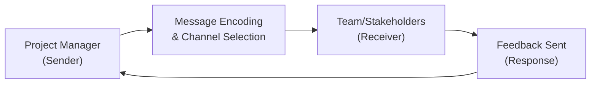

## 16.2 Communication Models, Planning, and Feedback

Effective communication is the glue that holds projects together. Regardless of industry or organizational size, strategic and well-planned communication ensures that stakeholders understand objectives, responsibilities, and expectations. By leveraging established communication models, carefully planning message flow, and fostering a culture of constructive feedback, Project Managers can boost team morale, enhance collaboration, and ultimately deliver successful project outcomes.

This section provides a deep dive into core communication principles, planning techniques, and feedback loops. We will explore how to design communication structures that support delegated responsibilities, handle conflicts, and keep stakeholders fully engaged throughout the project life cycle.

---

### Importance of Communication in Project Management

Communication is consistently cited by the Project Management Institute (PMI) and practicing professionals as a critical factor influencing project success or failure. In the context of PMP® (Project Management Professional) exam preparation, a solid grasp of communication processes and planning can directly impact your ability to answer scenario-based questions effectively, especially those in the People and Process domains.

When communication is unstructured or poorly planned, stakeholders lack clarity and alignment. This can lead to confusion, scope creep, and even project derailment. Conversely, strong communication strategies help you:

- Align project goals with business objectives.  
- Ensure delegated responsibilities are understood and accepted.  
- Build trust, morale, and teamwork.  
- Preemptively address conflicts and facilitate resolution.  

---

### Core Communication Models

Communication models serve as frameworks for understanding how information flows between individuals or groups. By studying these models, Project Managers gain insight into potential barriers and can tailor their approach to minimize misunderstandings.

#### Shannon-Weaver Model

The Shannon-Weaver Model is one of the earliest and most widely recognized communication frameworks. It breaks down communication into the following core components:

1. Sender (Source): Person or entity initiating the message.  
2. Encoder: Format or encoding technique used to convert ideas into transmittable signals (e.g., spoken words, written text).  
3. Channel: Medium through which the message travels (e.g., email, phone, face-to-face).  
4. Decoder: Process of interpreting the signal back into meaningful information.  
5. Receiver: Target audience who gets the message.  
6. Noise: Any interference or obstacle that distorts or interrupts the message (e.g., language barriers, technical glitches).  
7. Feedback: Response from the receiver, confirming communication success or highlighting misunderstanding.  

#### Berlo’s SMCR Model

Another foundational model is Berlo’s SMCR (Source, Message, Channel, Receiver) framework. Berlo’s model highlights that the content of the message, the channel selected, and the context in which information is exchanged all significantly shape the outcome of communication efforts. It emphasizes four main variables:

- Source: The credibility, knowledge, and attitude of the sender.  
- Message: The content, structure, and style of what is being conveyed.  
- Channel: The sensory medium—visual, auditory, tactile, etc.—used to deliver the message.  
- Receiver: The knowledge, culture, attitude, and listening ability of the audience.  

This model directs Project Managers to focus on the attributes and environments of both sender and receiver to ensure clarity and relevance.

#### Interactive Communication Model

The Interactive Communication Model expands on simpler sender-receiver concepts by highlighting the two-way nature of communication. It points out the cyclical flow of messages, feedback, and continuous adaptation. This is especially useful in agile or hybrid project environments where iterative feedback loops are essential for success.

---

### Communication Planning Essentials

Communication planning is the process of designing, documenting, and organizing the flow of information to stakeholders throughout the project life cycle. According to the PMBOK® Guide, a well-defined Communication Management Plan is crucial to ensure that communication requirements are met efficiently and effectively.

Common elements of a Communications Management Plan include:

- Purpose and Goals: Rationale for each communication, clarifying desired outcomes or actions.  
- Stakeholder Analysis: Identification of recipients, their information needs, and preferred communication methods (written, verbal, synchronous, asynchronous, etc.).  
- Communication Channels: Mechanisms used, such as email, face-to-face meetings, online collaboration platforms, instant messaging apps, bulletins, or project websites.  
- Frequency: Schedules for communication events (weekly status calls, monthly progress reports, daily standups).  
- Responsible Parties: People tasked with delivering messages and ensuring the quality and timeliness of communications.  
- Escalation Paths: Process for raising issues or risks to higher-level management.  
- Feedback Loops: Planned methods for gathering responses and verifying message understanding (surveys, quick polls, two-way discussions).  

Strong communication planning also recognizes cultural considerations, time zones, and the need for inclusivity. A robust communication plan factors in these nuances so that everyone, regardless of background or location, feels heard and informed.

---

### Visualizing Communication Flow

Below is a Mermaid.js diagram illustrating a simplified communication process in a project context. The figure spotlights how different roles and processes interrelate, emphasizing channel selection and feedback loops.

**Explanation:**  
- The Project Manager (A) formulates the message and selects the channel (B).  
- The message travels to the Team or Stakeholders (C).  
- Stakeholders respond with feedback (D).  
- Feedback is looped back to the Project Manager for clarification or next steps.  

---

### Selecting Communication Channels and Frequency

A critical aspect of effective communication is choosing the right channel. Factors to consider include the formality of the message, complexity of the topic, urgency, and stakeholder preference. Common channels are:

- **Face-to-Face Meetings**: Deliberations, negotiations, conflict resolution, personal performance reviews.  
- **Virtual Meetings (Video/Audio)**: Remote teams, global stakeholders, interactive workshops.  
- **Email and Memos**: Formal documentation, approvals, updates on non-urgent matters.  
- **Chat/Messaging Apps**: Quick clarifications, informal announcements, real-time collaboration.  
- **Project Management Tools**: Task assignments, status tracking, document sharing.  

#### Meeting Frequency and Format

Time spent in meetings can be extensive, so carefully plan frequency to balance the need for updates with efficiency. Common meeting cadences:

- **Daily Standups (Scrum, Agile)**: Quick 15-minute sync for progress and blockers.  
- **Weekly Status Meetings**: Review deliverables, highlight risks, ask for support.  
- **Monthly Steering Committees**: Strategic oversight, high-level decisions, budget alignment.  
- **Quarterly Board Updates**: Summaries of progress, achievements, and upcoming initiatives.  

---

### Techniques for Delegating Responsibilities

When delegating responsibilities, clarity in communication is paramount. As described in other chapters—particularly [Chapter 21: Resource Management](/21-resource-management/)—ensuring that each team member knows their roles, accountabilities, and lines of reporting can make or break efficiency.

A popular responsibility assignment tool is the RACI matrix:

- **R** (Responsible): The person(s) carrying out the task.  
- **A** (Accountable): The individual ultimately answerable for successful completion.  
- **C** (Consulted): Those subject-matter experts whose input or opinions are required.  
- **I** (Informed): Stakeholders who must stay updated on progress.  

Linking RACI assignments back to communication frequency and channels ensures each project stakeholder knows when and how to deliver updates or request assistance.

---

### Feedback Mechanisms and Continuous Improvement

Feedback fosters growth, learning, and continual adaptation. Effective feedback loops help managers catch misunderstandings early, reinforce good practices, and boost collaboration. Key feedback approaches:

1. **Active Listening and Restatement**: Ensuring the speaker feels heard and understood by rephrasing their points.  
2. **Constructive Critique Technique**: Focus on behavior, outcomes, or processes rather than personal attributes.  
3. **Timeliness**: Provide feedback as close as possible to the event or observed behavior.  
4. **Regular Check-Ins**: One-on-one or group sessions to discuss improvements or concerns.  
5. **Retrospectives**: Common in agile frameworks, retrospectives facilitate reflective discussions where teams identify successes and improvements for future iterations.  

---

### Case Study: Effective Communication for a Virtual Team

Consider a mid-sized IT project with a geographically distributed team spanning different time zones. The Project Manager observed that developers in one region were consistently missing deliverable deadlines and that the backlog in the Kanban board was filled with misunderstandings.

To address these issues:

1. **Communication Plan Revision**: Added daily 15-minute cross-functional standups, ensuring that all team members could align quickly on blockers, time zone overlap permitting.  
2. **Preferred Channels**: Moved from email threads to an instant messaging platform with project channels, improving real-time collaboration.  
3. **Feedback Loops**: Implemented a weekly retrospective session, enabling the team to share concerns, shift tasks where necessary, and highlight best practices.  
4. **Cultural Sensitivity**: Recognized differences in communication styles, adjusting language and tone to avoid confusion.  
5. **Accountability**: Created a RACI chart and integrated it into a shared online project management tool, clarifying who was ultimately accountable for each major deliverable.  

Within a month, these modifications led to a decrease in rework requests, streamlined task handoffs, and a stronger sense of team unity despite the geographical distance.

---

### Common Pitfalls and Best Practices

**Pitfalls**  
- **Over-Communicating**: Scheduling too many meetings or sending excessive emails can dilute critical messages and lead to project fatigue.  
- **Under-Communicating**: Providing too little information or clarifications leads to confusion, duplication of effort, and project overruns.  
- **Ignoring Cultural Differences**: Lack of awareness about language and cultural nuances may upset or alienate stakeholders across borders.  
- **No Formal Feedback Structure**: Without planned feedback loops, issues may escalate undetected until it’s too late.  

**Best Practices**  
- **Tailor the Channel**: Pick the right medium—high-stakes or complex topics often merit face-to-face or virtual meeting discussions, while minor updates may be fine via email or chat.  
- **Keep It Timely**: Share updates before issues escalate, and regularly revisit communication plans for continuous alignment.  
- **Encourage Transparency**: Promote open communication and safe spaces to discuss problems without blame.  
- **Document and Archive**: Ensure that all large decisions, changes, and agreements are documented and archived for reference.  

---

### Practical Tips and Reminders

- **Use Visual Aids**: Graphical elements like infographics, flowcharts, or project dashboards make complex information more digestible.  
- **Time Zone Considerations**: If you operate with distributed teams, alternate meeting times to respect different working hours and remove friction.  
- **Ask for Verification**: Encourage recipients to paraphrase or restate key points. This helps confirm accurate understanding.  
- **Leverage Technology**: Tools such as Slack, Microsoft Teams, Jira, or Trello can centralize communication for improved traceability and collaboration.  

---

### Further Exploration

• PMI’s “PMBOK® Guide Seventh Edition” – Including the Principles of Communication and Value Delivery.  
• “The Communications Toolkit” by Deborah A. Barrett – Deep insights on strategic messaging for organizations.  
• “Crucial Conversations: Tools for Talking When Stakes Are High” by Patterson, Grenny, McMillan, and Switzler.  
• Online Courses (LinkedIn Learning, Coursera, or edX) focusing on business and project communication.  

---

## Strengthen Your Communication Skills in Project Management



### Which of the following is a key advantage of the Interactive Communication Model?

- [ ] It focuses on a one-way flow of information.  
- [x] It highlights the cyclical process of feedback and adaptation.  
- [ ] It eliminates the need for encoding and decoding messages.  
- [ ] It prevents miscommunication by removing noise completely.  

> **Explanation:** The Interactive Communication Model emphasizes two-way interaction and feedback loops between sender and receiver, enabling continuous adaptation.

### What is a primary factor to consider when determining how frequently to communicate project updates?

- [ ] The personal preference of the Project Manager.  
- [x] The information needs of stakeholders and the complexity of the project.  
- [ ] The daily availability of meeting rooms.  
- [ ] The time it takes to fill out time sheets.  

> **Explanation:** Communication frequency should be customized to stakeholder requirements, project complexity, and risk level.

### Which communication model best illustrates how environmental factors such as culture and attitudes impact message reception?

- [ ] Shannon-Weaver Model  
- [x] Berlo’s SMCR Model  
- [ ] Waterfall Model  
- [ ] Gantt Model  

> **Explanation:** Berlo’s SMCR Model focuses on the source, message, channel, and receiver attributes, including cultural and attitudinal factors.

### Which of the following is NOT a typical component of a Communications Management Plan?

- [x] Product Backlog grooming schedule  
- [ ] Stakeholder analysis and information needs  
- [ ] Communication purpose and goals  
- [ ] Frequency and format of communication  

> **Explanation:** Product Backlog grooming is an agile-specific activity and not a general requirement in a Communications Management Plan.

### When delegating responsibilities, which tool helps clarify “who is accountable,” “who is responsible,” “who must be consulted,” and “who should be informed”?

- [ ] SWOT analysis  
- [x] RACI matrix  
- [ ] Gantt chart  
- [x] RACI matrix  

> **Explanation:** A RACI matrix is explicitly designed to map responsibilities and accountabilities.

### What is a potential consequence of poor feedback mechanisms in a project?

- [x] Issues remain undetected until late stages.  
- [ ] The project is automatically deemed successful.  
- [ ] Stakeholders are more engaged by default.  
- [ ] Conflicts disappear without formal resolution.  

> **Explanation:** Without planned feedback mechanisms, teams may fail to identify and address issues in a timely way.

### Which of the following best defines “noise” in the Shannon-Weaver Model?

- [x] Any interference that disrupts message transmission.  
- [ ] Another term for the message channel.  
- [x] Any interference that disrupts message transmission.  
- [ ] The sender’s original intent.  

> **Explanation:** Noise represents external or internal factors that distort the message as it travels to the receiver.

### In agile frameworks, which feedback practice involves team members reflecting on what went well and what could be improved?

- [ ] Sprint Planning  
- [x] Retrospectives  
- [ ] Daily Standup  
- [ ] Product Demo  

> **Explanation:** Retrospectives are facilitated sessions where the agile team examines successes, identifies improvement areas, and collaboratively plans adjustments.

### What is a recommended best practice to ensure successful virtual team meetings?

- [x] Have a clear agenda and rotate meeting times for different time zones.  
- [ ] Constantly message everyone during the meeting for immediate feedback.  
- [ ] Avoid using any screen-sharing tools to save time.  
- [ ] Restrict meeting participation to only the Project Manager.  

> **Explanation:** Virtual teams benefit from well-planned agendas and a rotating schedule that accommodates participants in multiple time zones.

### Effective communication often requires verification. Which statement is TRUE?

- [x] Asking recipients to paraphrase confirms mutual understanding.  
- [ ] Verification happens automatically without prompting.  
- [ ] Communication is only effective if it is solely one-way.  
- [ ] Paraphrasing is irrelevant for complex topics.  

> **Explanation:** Encouraging receivers to restate or paraphrase messages is a critical step in confirming understanding and minimizing misunderstandings.



---

## PMP Mastery: 1500+ Hard Mock Exams with Full Explanations

Looking to crush the PMP exam with confidence? Dive deep into 6 rigorous mock exams totaling 1500+ advanced-level questions, each accompanied by clear, step-by-step explanations. Hone your test-taking strategies, master complex topics, and build the resilience you need on exam day. Perfect for serious PMs aiming beyond fundamentals.

Enroll now:  
[PMP Mastery: 1500+ Hard Mock Exams with Exceptional Clarity & Full Explanations](https://www.udemy.com/course/pmp-2025/?referralCode=CF83A54BC86BE27F9AFE)

_Disclaimer: This course is not endorsed by or affiliated with the PMI examination authority. All content is provided purely for educational and preparatory purposes._
