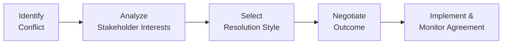

## 16.3 Engagement Techniques for Difficult Stakeholders

Engaging effectively with stakeholders is one of the most critical responsibilities of a project manager. When stakeholders are cooperative, supportive, and aligned with project goals, the path to success is far more straightforward. However, in many real-world scenarios—especially on complex, fast-paced, or high-budget projects—project managers must navigate challenging or “difficult” stakeholders. These individuals might hold conflicting interests, exert power in unconstructive ways, or simply resist changes that threaten their comfort zones. This section focuses on how to develop strategic engagement and communication tactics to turn difficult stakeholders into valued contributors.

Building on the foundations outlined in Chapter 7: Stakeholder Performance Domain and the communication principles presented in Chapter 16: Stakeholder and Communications Management, this segment dives deeper into advanced approaches to resolve conflict, sustain relationships, and achieve alignment—even under strained circumstances. We will explore negotiation methods, conflict resolution techniques, communication strategies, and real-world examples that demonstrate how skilled project managers can effectively guide challenging interactions toward productive outcomes.

## Why Difficult Stakeholders Matter

Difficult stakeholders can be among the most influential and powerful participants in a project. Neglecting or alienating them can:
• Jeopardize critical deliverables.  
• Create roadblocks in securing necessary resources.  
• Erode team morale and performance.  
• Delay project schedules or escalate costs.  

In contrast, effectively managing and engaging challenging stakeholders can:
• Turn detractors into promoters of change.  
• Uncover hidden challenges long before they become crises.  
• Strengthen relationships that may prove valuable in future initiatives.  
• Improve overall project quality and success rates.  

Project managers who master the art of difficult stakeholder engagement can often transform barriers into breakthroughs, thereby safeguarding project outcomes and fostering a collaborative environment.

---

## Common Traits of “Difficult” Stakeholders

Different stakeholders can demonstrate diverse kinds of challenging behavior. Some common traits include:

• Resistance to Change: Fearful of losing status, control, or comfort in setting new policies or adopting new technologies.  
• Micromanagement: Overly involved in daily details, creating communication overhead and frustration among the project team.  
• Hidden Agendas: Lobbying for personal gains—like promotions, budgets, or other priorities—that conflict with overall project objectives.  
• Lack of Availability: Non-responsive to communications, forcing project teams to make decisions without crucial inputs.  
• Frequent Escalations: Escalating issues or raising unwarranted concerns that disrupt team progress.  

Although such behaviors can be frustrating, the first step to addressing them is understanding the root causes. Do they feel ignored? Underappreciated? Threatened by the project’s purpose?

---

## Key Principles for Managing Difficult Stakeholders

### Demonstrate Empathy and Active Listening

Empathy is not mere sympathy but understanding the stakeholder’s viewpoint and emotional drivers. Active listening entails fully focusing on the speaker, clarifying ambiguities, and paraphrasing key points to ensure comprehension. It disarms defensiveness, creates a safe space for open dialogue, and welcomes creative compromises.

### Remain Solution-Focused

When stakeholders oppose or criticize decisions, resist the temptation to react emotionally. Instead, shift to solution mode: “How can we work together to achieve X?” This approach affirms their viewpoint while channeling negative energy into productive problem-solving.

### Use Reflective Communication

Reflective communication involves reiterating the stakeholder’s concern in slightly different words to ensure you accurately capture the core issue and offer them a chance to clarify. This technique can prevent misunderstandings and foster trust.

### Build Personal Credibility

Difficult stakeholders often test a project manager’s knowledge or authority. Strengthen your credibility by:
• Demonstrating proficiency in relevant technical or business topics.  
• Being consistent in fulfilling your promises (e.g., delivering progress reports, updates).  
• Showing respect for the stakeholder’s expertise, position, and constraints.  

### Align with Project and Organizational Objectives

If you run into a stakeholder who questions the project direction or decisions, often they need to see how the project aligns with higher-level priorities. Cascading organizational strategy (see Chapter 28: Aligning Projects with Organizational Strategy) and demonstrating cost-benefit analysis can help confirm the merit of the project and encourage buy-in.

---

## Conflict Resolution Frameworks

For a thorough overview of project conflict resolution styles, see Chapter 8.2: “Leadership Styles, Conflict Resolution, and Motivation.” However, let us revisit the widely recognized approaches briefly:

1. **Withdrawing (Avoiding):** Stepping away from conflict when it is not worth the time or risk. Overuse, however, signals passivity.  
2. **Smoothing (Accommodating):** Emphasizing commonalities to maintain harmony. Can sacrifice genuine resolution if overused.  
3. **Compromising:** Both parties give up something to arrive at a mutually acceptable solution. Often used when time is of the essence.  
4. **Forcing (Directing):** Imposing a solution based on individual authority. Risks damaging relationships if used frequently.  
5. **Collaborating (Problem-Solving):** Searching for a win-win solution that addresses both parties’ underlying needs. Typically the most sustainable approach but may require more time and psychological safety.  

Difficult stakeholders may require more frequent use of collaborative or compromise approaches. If, for instance, a high-ranking executive demands changes that hinder project success, you may need to negotiate carefully and highlight mutual benefits of a different course.

---

## Negotiating with Difficult Stakeholders

Negotiation techniques can resolve stakeholder disagreements over scope, timelines, or resources. Consider:

- **Interest-based Negotiation (Principled Negotiation):** Focus attention on the underlying interests (e.g., business performance, personal positioning) rather than on rigid positions (e.g., “I want X or nothing”). This approach encourages transparent dialogue and discovering shared values.  
- **BATNA (Best Alternative to a Negotiated Agreement):** Identify your fallback plan if negotiations fail. This knowledge allows you to negotiate from a position of strength and clarity, increasing your confidence and potentially lowering the other party’s influence.  
- **Objective Criteria:** Use data points and standards (e.g., industry benchmarks, organizational policies) to counter subjective arguments. Presenting credible facts reduces emotional friction and can help stakeholders see the rationale behind decisions.  
- **Contingency Agreements:** If certain stakeholder concerns only arise under specific conditions (e.g., market downturn, quality issues), building contingency clauses into the project plan can address them upfront without derailing the entire project.  

---

## Strategies for Ongoing Relationship Management

### Establish Reciprocal Trust

Early trust-building can pay off when a stakeholder becomes difficult later. This entails:

• Consistent Communication: Use established channels, frequency, and style (see Section 16.2 on Communication Models, Planning, and Feedback).  
• Reliability: Meeting deadlines and openly reporting on progress or roadblocks.  
• Constructive Feedback Loop: Encourage two-way dialogue where the stakeholder feels heard and recognized for their input.  

### Engage Stakeholders in Decision-Making

Whenever possible, invite participation, aligned with the collaborative model from Chapter 6: The PMP® Exam Domains, Tasks, and Enablers (particularly under “People Domain: Leading and Empowering Teams”). For instance, if a stakeholder is skeptical about adopting agile practices, let them experience a pilot by participating in sprint reviews or backlog refinement sessions.

### Monitor Engagement Levels

As highlighted in Chapter 7.4: Monitoring and Adapting Stakeholder Approaches, engagements are fluid. Someone who was once supportive can become difficult due to organizational changes or shifting personal agendas. Continuously assessing stakeholder sentiment—via surveys, one-on-one check-ins, or team feedback—helps detect early warning signs.

### Protect the Team’s Morale

Difficult stakeholders may cause anxiety and frustration within the project team. Remind your team of the project’s overarching purpose, highlight achievements, and shield them from unwarranted pressure. Regularly celebrate small milestones to keep spirits high.

---

## Practical Techniques and Tools

### Stakeholder Analysis and Engagement Matrix

This tool (discussed in Chapter 7.1: Identifying, Analyzing, and Prioritizing Stakeholders) positions stakeholders based on two key factors: power and interest. The matrix typically classifies them as:
• High Power–High Interest  
• High Power–Low Interest  
• Low Power–High Interest  
• Low Power–Low Interest  

Mapping out difficult stakeholders helps you tailor an engagement strategy that recognizes both their ability to influence the project and their concern for its outcomes.

### Risk Management Integration

Many “difficult” stakeholders can affect project risk exposure substantially. Integrate stakeholder concerns and potential objections into your risk register and risk response plan (see Chapter 22: Risk and Uncertainty Management (Revisited)). By treating challenging stakeholders as sources of risk, you can develop proactive strategies to mitigate their negative impact.

### Conflict Escalation Protocol

Predefine escalation paths for conflicts that cannot be resolved at the project level. For instance, if a project sponsor and a senior functional manager are in deadlock, your escalation protocol should identify who intervenes (e.g., the Project Management Office or an executive steering committee). Clear escalation guidelines can help keep personal tensions from boiling over.

### Example of a Conflict Resolution Flow

Below is a simplified Mermaid diagram illustrating a conflict resolution approach that incorporates stakeholder engagement throughout the process:

In this diagram:  
• A identifies the conflict—possibly a disagreement on scope or timeline.  
• B explores underlying interests and potential motivations of the difficult stakeholder.  
• C decides on the conflict resolution style (collaborating, compromising, etc.).  
• D implements negotiation strategies to arrive at a feasible solution.  
• E executes the resolution and monitors stakeholder satisfaction to prevent recurrent conflict.

---

## Real-World Scenarios

### Scenario 1: The Overbearing Sponsor

A project sponsor repeatedly micromanages the project team. They demand granular details daily and override decisions on minor issues. The project manager schedules a private session to understand underlying concerns. It emerges the sponsor is under pressure from the Board of Directors to reduce project risk. The project manager responds by providing a robust risk management plan, daily bullet-point updates, and periodic check-ins. Gradually, the sponsor’s anxiety decreases, and they pull back from micromanagement as trust builds.

### Scenario 2: The Resistant Operations Manager

A new software is slated to revolutionize an organization’s operations. The operations manager publicly criticizes the project, claiming the deployment will disrupt daily workflows. Rather than confronting him in large group settings, the project manager arranges a small meeting to demonstrate the software’s user interface and highlight the reduction in manual tasks. The project manager offers the manager a key voice in shaping the internal rollout strategy. Feeling recognized and equipped with new knowledge, the operations manager becomes supportive of the project.

### Scenario 3: The Busy Executive Who Never Responds

A high-level executive has power and influence over resource allocation but seldom reads emails or attends meetings. Their absence slows down staffing decisions. The project manager starts providing succinct, bullet-point updates that highlight immediate resource requirements, including quantifiable impacts on strategic objectives if left unmet. The manager also schedules a short 15-minute “urgent” briefing aligned with the executive’s availability. This more structured approach makes it easier for the executive to engage, removing barriers that previously prevented prompt decisions.

---

## Common Pitfalls and How to Avoid Them

• **Ignoring the Problem:** Hoping difficult stakeholders “come around” on their own rarely works.  
• **Being Confrontational:** Aggressive communication can escalate tension, damage relationships, and jeopardize the project.  
• **Over-Promising:** Offering unrealistic concessions or timelines to placate challenging stakeholders can cause more significant conflicts later.  
• **Failure to Document:** Without formal documentation of agreements or meeting minutes, ambiguities can reemerge in heated disputes.  
• **Neglecting Follow-Up:** Engagement plans require continual updates. Monitor evolving circumstances and adapt your approach accordingly.

---

## Best Practices for Fostering Positive Outcomes

• **Prepare Thoroughly:** Research each stakeholder’s background, goals, organizational role, and communication preferences.  
• **Involve Neutral Parties:** Sometimes an unbiased third party—another manager or a mediator—can facilitate more constructive dialogues.  
• **Celebrate Small Wins:** If a stakeholder changes their stance from outright opposition to tentative support, acknowledge that progress both privately and publicly.  
• **Stay Resilient:** Emotional intelligence (see Chapter 33: Advanced Leadership and Team Development) is crucial. Keep calm, demonstrate patience, and preserve professionalism even in high-pressure interactions.  
• **Leverage Peer Influence:** If the difficult stakeholder’s opinions are influenced by peers or other departments, building alliances in those areas can indirectly shape their perspective.

---

## Integrating Stakeholder Engagement across Domains

Engagement with difficult stakeholders must be aligned with other project management domains:

• **Team Performance Domain (Chapter 8):** Conflict resolution skills, team motivation tactics, and leadership styles can be adapted to stakeholder situations.  
• **Delivery Performance Domain (Chapter 12):** Maintaining stakeholder alignment on requirements validation and acceptance criteria navigates common disputes around scope and quality.  
• **Uncertainty Performance Domain (Chapter 14):** Difficult stakeholders add uncertainty to the project environment. Proactively issue logs, risk registers, and contingency plans can reduce the unpredictability of stakeholder interventions.  

Aligning your approach across these domains shows stakeholders that their concerns are part of a comprehensive, well-structured project management strategy—enhancing credibility and collaboration.

---

## References for Further Exploration

• Fisher, R., Ury, W., & Patton, B.: “Getting to Yes: Negotiating Agreement Without Giving In.”  
• Heen, S., & Stone, D.: “Difficult Conversations: How to Discuss What Matters Most.”  
• Patterson, K., Grenny, J., Maxfield, D., McMillan, R., & Switzler, A.: “Crucial Conversations: Tools for Talking When Stakes Are High.”  
• PMI’s “Agile Practice Guide” (focus on collaboration)  
• Chapter 7 of the PMBOK® Guide (Seventh Edition) on Stakeholder Engagement Principles

---

## Quiz: Stakeholder Engagement Challenges



### When dealing with a stakeholder who is opposed to project objectives, what is the most effective first step?

- [x] Understand their motivations and underlying fears.
- [ ] Immediately escalate to the project sponsor.
- [ ] Remove them from the stakeholder list.
- [ ] Send them weekly status reports without scheduling further meetings.

> **Explanation:** Exploring the stakeholder’s underlying motivations allows you to address the root cause of their resistance, making it easier to tailor an effective engagement approach.

### Which negotiation strategy focuses on reconciling broader interests rather than rigid, fixed positions?

- [ ] Forcing negotiation
- [ ] Positional bargaining
- [ ] Tactical compromise
- [x] Interest-based negotiation (principled negotiation)

> **Explanation:** Interest-based negotiation centers on underlying concerns and shared gains rather than positions, leading to more sustainable agreements.

### Which conflict resolution style is the most time-intensive but usually yields a mutually beneficial solution?

- [ ] Avoiding
- [ ] Compromising
- [x] Collaborating
- [ ] Forcing

> **Explanation:** Collaborating seeks a win-win outcome, but it can require more effort and time to ensure both parties’ needs are met.

### What is a best practice if an executive rarely responds to project communications?

- [x] Provide succinct updates targeted to their interests and schedule brief, high-priority meetings.
- [ ] Demand daily status meetings to compel availability.
- [ ] Send detailed project documents and expect thorough feedback.
- [ ] Remove them from the sponsor group and redistribute responsibilities.

> **Explanation:** Busy executives often respond best to concise and clear communication. Tailor your approach—short summaries, bullet points, and specific meeting requests.

### What key factor should you include in a risk register concerning difficult stakeholders?

- [x] Potential impact on scope, schedule, or budget if a conflict arises.
- [ ] Whether they are invited to project social events.
- [x] Distance from the project site.
- [ ] None of the above.

> **Explanation:** Stakeholder issues can affect cost, timelines, and deliverables, so risks related to stakeholder engagement must be documented and managed.

### Why is reflective communication useful when handlings disputes?

- [x] It ensures both sides clarify their viewpoints.
- [ ] It shifts the focus away from listening.
- [ ] It emphasizes top-down directives.
- [ ] It automatically resolves conflict.

> **Explanation:** Reflective communication involves rephrasing or summarizing the stakeholder’s statements. This helps avoid misunderstandings and promotes empathy.

### Which leadership trait is most beneficial for managing difficult stakeholder relationships?

- [x] Emotional intelligence
- [ ] Aggressiveness
- [x] Strict authority
- [ ] Micromanagement

> **Explanation:** Emotional intelligence fosters empathy, self-awareness, and strong communication—vital for de-escalating friction and nurturing collaboration.

### What is a common pitfall when dealing with difficult stakeholders?

- [x] Hoping they will “come around” without active engagement.
- [ ] Keeping an issue log and revisiting it frequently.
- [ ] Offering short, concise project updates.
- [ ] Scheduling private one-on-one sessions.

> **Explanation:** Simply waiting for a stakeholder to self-correct rarely works. Proactive engagement is crucial for timely resolution.

### What is the first step in the Conflict Resolution Flow according to the provided Mermaid diagram?

- [x] Identify the conflict.
- [ ] Negotiate the outcome.
- [ ] Analyze stakeholder interests.
- [ ] Implement the agreement.

> **Explanation:** The diagram clearly shows “Identify Conflict” as the initial action before analyzing interests or deciding on conflict resolution style.

### True or False: Over-promising to a difficult stakeholder can resolve tensions in the long run.

- [x] True
- [ ] False

> **Explanation:** While over-promising may temporarily appease a stakeholder, it inevitably creates unrealistic expectations and can lead to bigger conflicts down the road.



---

## PMP Mastery: 1500+ Hard Mock Exams with Full Explanations 

Looking to crush the PMP exam with confidence? Dive deep into 6 rigorous mock exams totaling 1500+ advanced-level questions, each accompanied by clear, step-by-step explanations. Hone your test-taking strategies, master complex topics, and build the resilience you need on exam day. Perfect for serious PMs aiming beyond fundamentals.  

Enroll now:  
[PMP Mastery: 1500+ Hard Mock Exams with Exceptional Clarity & Full Explanations](https://www.udemy.com/course/pmp-2025/?referralCode=CF83A54BC86BE27F9AFE)

_Disclaimer: This course is not endorsed by or affiliated with the PMI examination authority. All content is provided purely for educational and preparatory purposes._
