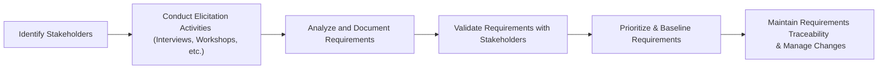

## 17.1 Collecting and Documenting Requirements

Collecting and documenting requirements is a foundational process that sets the trajectory for project success. By capturing stakeholders’ needs in a clear, structured manner, project managers and business analysts can minimize misunderstandings, scope creep, and rework. This section provides both a conceptual and practical approach to gathering these requirements—from diverse elicitation techniques to best-practice documentation strategies. We also explore the importance of distinguishing between functional and nonfunctional requirements and discuss how user stories foster clarity and collaboration.

Collectively, these steps form the backbone of Scope and Requirements Management (see also Chapter 17 introductions). Effective requirements collection not only charts a solid project path but also shapes deliverables to meet or exceed stakeholder expectations.

---

### Why Requirements Matter

Requirements document the tangible and intangible goals that a solution (product, service, or result) must fulfill. Inaccurate or incomplete requirements endanger the project’s ability to align with its strategic objectives and stakeholder needs. On the other hand, well-defined requirements clearly map stakeholder expectations and form a stable baseline for scope, schedule, and budget decisions.

When requirements are captured correctly, teams can:

• Develop relevant, high-quality deliverables.  
• Avoid unnecessary scope expansions.  
• Improve stakeholder satisfaction.  
• Mitigate risks early in the project lifecycle.

---

### Elicitation Methods

Elicitation is the process of gathering information from all relevant sources to understand the project’s true needs. While methods vary in complexity and application, they all share a goal: bring clarity to what the final product should do or achieve. Often, a combination of several methods yields the most complete set of requirements.

#### Interviews

Interviews are one-on-one or small-group meetings aimed at exploring individual stakeholder perspectives in depth.  
• Advantages: Provide nuanced, context-rich insights; build stakeholder relationships.  
• Challenges: Time-consuming; may inadvertently capture biased or incomplete views.  

Tips:  
• Prepare a structured set of questions but remain open to exploring unplanned threads.  
• Record responses using audio (if permissible) or take comprehensive notes.  
• Follow up to clarify ambiguities.

#### Focus Groups

A focus group is a facilitated session with multiple stakeholders sharing similar interests or expertise.  
• Advantages: Stimulates interaction; captures a broad range of opinions simultaneously.  
• Challenges: Dominant personalities may overshadow introverted participants; requires skilled facilitation.  

Tips:  
• Clearly define the topic scope.  
• Encourage balanced participation.  
• Use flip charts or whiteboards to visualize inputs.

#### Workshops

Workshops are interactive sessions where stakeholders come together to collaborate on requirements.  
• Advantages: Encourages consensus-building and allows for real-time problem-solving.  
• Challenges: Requires significant coordination and can be costly if participants are geographically dispersed.  

Typical Steps in a Requirements Workshop:  
1. Define the workshop’s objective (e.g., mapping current processes, brainstorming future states).  
2. Present background information, such as project deliverables or strategic goals.  
3. Facilitate collaborative activities (process mapping, user story writing, etc.).  
4. Summarize and validate outcomes, ensuring alignment among participants.  

#### Observations

Observation techniques involve watching end-users or stakeholders as they perform tasks in their natural environment.  
• Advantages: Identifies real-world practices that might be overlooked in interviews.  
• Challenges: Observed users may alter their behavior when monitored (Hawthorne effect).  

Tip:  
• Document all observed workflows and anomalies.  
• Compare actual observed behavior with stated processes to detect mismatches.

#### Questionnaires and Surveys

Surveys enable gathering requirements from a large audience efficiently.  
• Advantages: Quick and scalable; useful for geographically dispersed stakeholders.  
• Challenges: Limited or ambiguous responses if questions are poorly designed.

Tip:  
• Test your survey with a pilot group.  
• Use both open-ended and close-ended questions for qualitative and quantitative insights.

#### Brainstorming

Brainstorming is a group creativity technique where participants freely generate ideas on a defined topic.  
• Advantages: Encourages innovative solutions; can quickly produce extensive idea lists.  
• Challenges: Lacks structure; may require follow-up sessions for thorough analysis.

Tip:  
• Set ground rules (e.g., no criticism of ideas).  
• Organize and categorize results (e.g., affinity diagramming).

#### Document Analysis

In many projects, significant requirements are already buried in existing documentation, such as contracts, regulations, or historical project files.  
• Advantages: Provides objective data; clarifies standardized rules and compliance issues.  
• Challenges: Documents may be outdated or incomplete.

Tip:  
• Confirm that documents are valid for the project context.  
• Cross-reference findings with stakeholder interviews.

#### Prototyping

Prototyping involves creating low-fidelity or high-fidelity models (e.g., mock screens, wireframes, or partial functional demos) to gather user feedback.  
• Advantages: Helps stakeholders visualize solutions; reduces misinterpretation.  
• Challenges: Can be time-intensive; participants might focus too much on the prototype’s UI rather than overall functionality.

Tip:  
• Emphasize that the prototype is an evolving model subject to changes.  
• Solicit iterative feedback to refine the concept.

---

### Documenting Functional vs. Nonfunctional Requirements

Generally, requirements can be categorized into two main types:

• Functional Requirements: Specify the behaviors or functions a solution must perform. For instance, “The system shall generate a monthly inventory report.”  
• Nonfunctional Requirements: Specify quality attributes, performance parameters, or constraints on how a solution performs. For instance, “The system must process up to 10,000 transactions per second.”

Both sets of requirements are essential. Functional requirements define the essential tasks a project delivers, while nonfunctional requirements outline how efficiently or to what standard these tasks must be performed. Failing to address nonfunctional requirements can lead to user dissatisfaction, performance issues, and compliance risks.

Below is an example comparison:

| Requirement Type  | Example                                   |
|-------------------|-------------------------------------------|
| Functional        | “System must allow users to upload files.” |
| Nonfunctional     | “Uploaded files must be scanned for viruses within 5 seconds.” |

---

### The Role of User Stories

User stories are a popular format in agile and hybrid environments. They serve as concise, user-centric statements capturing “who” needs “what” and “why.” A typical template is:

“As a [role], I want [capability] so that [benefit].”

• Role: Who is using the product or feature (e.g., customer, employee, admin)?  
• Capability: What functionality or feature is needed?  
• Benefit: Why the functionality is valuable (the underlying driver)?

#### Examples of Effective User Stories

1. “As a project manager, I want to search archived project reports so that I can quickly reference outcomes of similar past initiatives.”  
2. “As an online shopper, I want to save my credit card details so that I can checkout faster in the future.”

Each user story typically has associated acceptance criteria that detail conditions under which the story is considered complete. These criteria help refine and verify the requirement.

---

### Requirements Traceability Matrix (RTM)

The Requirements Traceability Matrix is a powerful tool for linking requirements to their origins and ensuring complete coverage throughout the project life cycle. The RTM tracks requirements from elicitation through design, implementation, testing, and final verification. By referencing unique identifiers for each requirement, the RTM minimizes confusion, prevents scope creep, and allows the project team to quickly identify impacts when changes occur.

Below is a simple RTM example:

| Req ID | Requirement Statement                                     | Source       | Priority | Test Case ID | Status  |
|--------|-----------------------------------------------------------|--------------|----------|--------------|---------|
| FR-01  | “System shall generate monthly inventory reports.”       | Stakeholder A, Contract 3.2 | High      | TC-101       | In Design |
| NFR-05 | “System must process 10,000 transactions per second.”    | Architect, Regulatory Doc X | Medium    | TC-205       | Pending  |

---

### Tips for Effective Requirements Collection

• Involve the Right Stakeholders Early: Engage all relevant parties—end-users, sponsors, subject matter experts—early in the process. This ensures a holistic perspective, reduces missed requirements, and fosters buy-in.  
• Use Multiple Elicitation Methods: Combining interviews, workshops, and document analysis leads to more accurate and comprehensive requirements.  
• Validate and Prioritize: Confirm that requirements meet stakeholder needs, and prioritize them based on value, cost, and risk. High-value requirements should be tackled first or protected against schedule or budget cuts.  
• Avoid Ambiguity: Ensure that each requirement is clear, measurable, and testable. For instance, rather than saying “The interface should be fast,” specify “The interface must load the main dashboard within two seconds under average traffic conditions.”  
• Manage Traceability: Set up your traceability mechanism (such as RTM) early, so every requirement can be traced back to a strategic goal or stakeholder need and forward to the deliverable or test used to confirm it.  

---

### Common Pitfalls and How to Avoid Them

1. **Scope Creep**: Requirements that are not clearly agreed upon or documented can change arbitrarily, expanding scope.  
   - **Mitigation**: Continuously refer back to the requirements baseline. Implement formal change control procedures.  

2. **Lack of Stakeholder Engagement**: Key stakeholders who are not involved or informed may challenge requirements later.  
   - **Mitigation**: Schedule regular feedback loops, workshops, or demos to keep stakeholders aligned.  

3. **Overlooking Nonfunctional Requirements**: Projects often focus on features (functional) but neglect constraints related to performance, security, scalability, etc.  
   - **Mitigation**: Consider compliance, performance, and user experience from the outset. Integrate them into your acceptance criteria and test cases.  

4. **Poorly Prioritized Requirements**: Treating all requirements as equally critical leads to inefficiencies and potential resource waste.  
   - **Mitigation**: Use prioritization techniques (e.g., MoSCoW: Must have, Should have, Could have, Won’t have) to handle trade-offs effectively.  

5. **Vague Requirements**: Requirements that are open to interpretation cause confusion and rework.  
   - **Mitigation**: Encourage precise language (“shall,” “must”) and create actionable acceptance criteria.

---

### Practical Example and Case Study

#### Scenario: Accounting Software Upgrade

A mid-sized financial services company seeks to upgrade its accounting system to comply with new IFRS regulations, improve user experience, and ensure robust data security. The project manager begins requirement collection as follows:

1. **Stakeholder Identification**: Key stakeholders include the CFO, finance department employees, IT security specialists, regulators, and the software vendor.  
2. **Interviews and Document Analysis**: The project manager interviews the CFO and finance leads to understand IFRS compliance needs and references official IFRS guidelines.  
3. **Workshops**: A cross-functional workshop is held:  
   - Finance team clarifies reporting frequency and data structures.  
   - IT specialists outline security protocols like multifactor authentication and encryption.  
   - Regulators provide input on mandatory compliance checks and auditing standards.  
4. **Collaboration with Software Vendor**: The vendor shares existing features and gap analyses. Together, they co-create user stories:  
   - “As a finance manager, I want real-time IFRS compliance checks so that we minimize end-of-period adjustments.”  
   - “As an auditor, I want detailed access logs so that I can verify user activity and detect unauthorized access.”  
5. **Finalization**: Documentation is refined into functional and nonfunctional requirements, captured in an RTM, and validated by all stakeholders before formal sign-off.

This real-world example shows how combining interviews, workshops, and document analysis addresses both functional (report generation, compliance checks) and nonfunctional (security, performance, regulatory compliance) requirements. The result is a comprehensive, mutually agreed-upon requirements set that drives the project forward.

---

### Visualizing the Requirements Collection Flow

Below is a simplified mermaid diagram illustrating the general flow of collecting and documenting requirements:

#### Diagram Explanation

• Identify Stakeholders: Before collecting requirements, you must know who your stakeholders are.  
• Conduct Elicitation Activities: Use multiple techniques to gather data (e.g., interviews, focus groups).  
• Analyze and Document Requirements: Organize them into categories (functional vs nonfunctional), define acceptance criteria, and use consistent templates.  
• Validate Requirements with Stakeholders: Ensure shared understanding.  
• Prioritize & Baseline Requirements: Confirm their priority, finalize them, and maintain a controlled baseline.  
• Maintain Traceability & Manage Changes: Track requirements to deliverables and adapt to scope changes carefully.

---

### Best Practices Summary

• Incorporate a variety of elicitation methods to gain a 360-degree view of stakeholder needs.  
• Separate functional and nonfunctional requirements and give equal weight to each group.  
• Use user stories to keep requirements succinct, user-focused, and easily testable.  
• Employ traceability tools, such as RTMs, to maintain alignment from requirements to final deliverables.  
• Close the loop via validation sessions or walk-throughs with stakeholders, ensuring all parties share a common vision.  

---

### Further References

• Project Management Institute (PMI). “A Guide to the Project Management Body of Knowledge (PMBOK® Guide) – Seventh Edition.”  
• International Institute of Business Analysis (IIBA). “A Guide to the Business Analysis Body of Knowledge (BABOK® Guide).”  
• PMI. “Business Analysis for Practitioners: A Practice Guide.”  
• Carkenord, B. “Seven Steps to Mastering Business Analysis.”  

These references provide further detail on gathering requirements, stakeholder engagement, and ensuring comprehensive requirements coverage.

---

## Assess Your Requirements Collection Expertise



### Which of the following is a key advantage of conducting interviews for requirements elicitation?

- [x] They provide in-depth, context-rich information directly from stakeholders.
- [ ] They eliminate bias by capturing perspectives from large user groups at once.
- [ ] They are always the most cost-effective method for large teams.
- [ ] They do not require any preparation or structured questions.

> **Explanation:** Interviews offer unique, detailed insights because they allow project managers or business analysts to query stakeholders individually. However, they can be time-consuming and require proper planning.

### Which best describes the difference between functional and nonfunctional requirements?

- [x] Functional requirements describe “what” the system or product must do, whereas nonfunctional requirements describe “how well” it does it.
- [ ] Functional requirements focus on UI design only, while nonfunctional requirements are about system logic.
- [ ] Nonfunctional requirements are not mandatory for project success.
- [ ] Nonfunctional requirements only apply to hardware specifications.

> **Explanation:** Functional requirements define the tasks and processes the solution must accomplish, while nonfunctional requirements define quality aspects like performance, security, and usability.

### What is the primary purpose of a Requirements Traceability Matrix (RTM)?

- [ ] To prioritize cost-related requirements only.
- [x] To ensure each requirement is tracked from origin to final deliverable.
- [ ] To maintain the project schedule and risk register in a single document.
- [ ] To categorize requirements into agile and predictive approaches.

> **Explanation:** The RTM links requirements to their respective sources and deliverables, enabling teams to maintain control and alignment throughout the project life cycle.

### What is a potential disadvantage of focus groups as a requirements elicitation technique?

- [ ] They are always more cost-effective than interviews.
- [x] Dominant personalities might overshadow other participants, distorting the group’s input.
- [ ] They rely only on questionnaires and surveys.
- [ ] They are ineffective for gathering consensus.

> **Explanation:** In focus groups, strong or vocal participants can unintentionally dominate the discussion if not carefully moderated, potentially skewing the outcomes.

### Which statement about user stories is correct?

- [x] They typically follow the format “As a [role], I want [capability] so that [benefit].”
- [ ] They are only applicable to fully predictive (waterfall) projects.
- [x] They include acceptance criteria that define conditions of satisfaction.
- [ ] They cannot capture nonfunctional requirements.

> **Explanation:** User stories encapsulate requirements from an end-user’s perspective and often feature acceptance criteria to clarify what “done” looks like. They can capture both functional and nonfunctional requirements with the right approach.

### What is the best way to address scope creep regarding new requirements emerging mid-project?

- [x] Validate alignment against the existing requirements baseline and scope, then follow a formal change control process.
- [ ] Automatically include all new requirements as they appear.
- [ ] Defer every new requirement to the project’s last phase.
- [ ] Reject all additions to maintain the current budget and schedule.

> **Explanation:** Addressing scope creep effectively requires alignment checks with the scope baseline and, if considered valuable, a formal change request with stakeholder approval.

### When using prototyping to gather requirements, which approach is most effective?

- [x] Build a preliminary model to visualize functionality and solicit iterative feedback.
- [ ] Implement the full production version immediately to gather user opinions.
- [x] Highlight that the prototype is not the final version and is subject to continuous refinement.
- [ ] Never solicit feedback during prototyping since it is incomplete.

> **Explanation:** Prototyping helps stakeholders better understand and refine requirements. Emphasizing its preliminary nature and gathering feedback in multiple iterations improves the clarity and completeness of requirements.

### Which example best fits a nonfunctional requirement?

- [x] “The system shall support up to 5,000 concurrent users without performance degradation.”
- [ ] “The system shall allow users to create reports.”
- [ ] “The system shall display inventory levels.”
- [ ] “The product backlog must contain at least 50 items.”

> **Explanation:** Nonfunctional requirements address constraints or performance characteristics rather than specific functionalities that the system must carry out.

### Which definition best describes brainstorming in requirements gathering?

- [x] A group activity designed to generate a variety of ideas without initial criticism.
- [ ] A one-to-one interview technique focusing on detailed, personal insights.
- [ ] A method that provides real-time observation of tasks.
- [ ] A directive from leadership to align all stakeholders around a single idea.

> **Explanation:** Brainstorming encourages participants to propose as many ideas as possible, deferring judgment and categorization until after the session.

### True or False: Regular stakeholder validation of documented requirements helps reduce misunderstandings and rework.

- [x] True
- [ ] False

> **Explanation:** Periodic reviews and validations with stakeholders confirm that the requirements accurately reflect their needs and provide an opportunity to make timely adjustments. This reduces the risk of misinterpretation.



---

## PMP Mastery: 1500+ Hard Mock Exams with Full Explanations 

Looking to crush the PMP exam with confidence? Dive deep into 6 rigorous mock exams totaling 1500+ advanced-level questions, each accompanied by clear, step-by-step explanations. Hone your test-taking strategies, master complex topics, and build the resilience you need on exam day. Perfect for serious PMs aiming beyond fundamentals.

Enroll now:  
[PMP Mastery: 1500+ Hard Mock Exams with Exceptional Clarity & Full Explanations](https://www.udemy.com/course/pmp-2025/?referralCode=CF83A54BC86BE27F9AFE)

_Disclaimer: This course is not endorsed by or affiliated with the PMI examination authority. All content is provided purely for educational and preparatory purposes._
