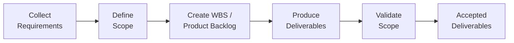

## 17.2 Defining and Validating Scope

Effective scope management is crucial to the success of any project—whether in IT system implementation, construction, marketing, or beyond. By defining and validating scope thoroughly, project managers collaboratively set the parameters for measurable progress and ultimate success. This section explores how to ensure the project scope is accurately defined, refined, and formally accepted, guaranteeing alignment with stakeholder expectations and the product’s overarching vision. We will discuss essential tools, techniques, real-world examples, as well as best practices and pitfalls to watch for as you move from broad requirements to tangible outcomes.

Defining and validating scope sits at the heart of project management, bridging the gap between stakeholders’ needs (see “17.1 Collecting and Documenting Requirements”) and the deliverables you produce. Navigating this phase effectively keeps your project on track, reduces costly scope creep, and strengthens stakeholder satisfaction.

  
### Why Defining and Validating Scope Matters

Without precise definition and systematic validation of scope, teams risk ambiguity, missed deliverables, and stakeholder dissatisfaction. Here is why these activities are vital:

• Preventing Scope Creep: Clearly documented scope boundaries deter stakeholders from continuously adding new features and requirements without proper evaluation.  
• Realistic Estimates: A well-defined scope enables more accurate forecasts of costs, time, and resources.  
• Stakeholder Alignment: Consensus on scope ensures everyone agrees freely on what will be (and will not be) delivered, minimizing conflicts.  
• Quality Assurance: Establishing measurable acceptance criteria allows the project team to align deliverables with rigorous quality standards—an integral component supported by validated scope processes.  

  
### Scope Definition: Bridging Requirements and Deliverables

Scope definition transforms high-level requirements into a detailed list of deliverables and acceptance criteria. While “Collect Requirements” focuses on gathering needs and expectations, “Define Scope” precisely states how those needs translate into tangible outcomes.

Below are common outputs and processes involved in defining scope:

• Project Scope Statement (or Product Scope Statement in agile): Formally documents the project’s purpose, deliverables, objectives, and acceptance criteria.  
• Work Breakdown Structure (WBS): Decomposes the total scope into manageable work packages. In agile projects, this may be akin to creating and refining the product backlog.  
• WBS Dictionary, if used in a predictive approach: Provides details related to each component, including responsible teams, budget, time estimates, and quality requirements.  
• Constraints and Assumptions: Clarifies external or internal limitations that could influence how scope is delivered (e.g., tool availability, regulatory compliance).  
• Exclusions and Boundaries: Identifies what is specifically out of scope, preventing confusion and potential conflict later on.  

For agile and hybrid scenarios, the concept of scope might be more dynamic. Teams focus on creating minimum viable products (MVPs) and continuously refining the product backlog. Regardless of methodology, the essence remains the same: articulate the “what” and “why” of the project, ensuring alignment with stakeholder priorities and the broader product vision.

  
### Key Elements of a Good Project Scope Statement

A thorough project scope statement increases the likelihood of project success and smooth validation processes. Although formats vary, the following components often appear:

• Project Objectives: Clearly state the goals in measurable, time-bound terms.  
• Deliverables: Outline all major products, services, or results that the project will create.  
• Acceptance Criteria: Define conditions or performance requirements for deliverables to be considered satisfactory.  
• Exclusions: Mention any items explicitly not part of the project.  
• Constraints: Specify time, resource, and technology constraints.  
• Assumptions: Document assumptions made during planning, such as market stability or technology availability.  

  
### Aligning Scope with Product Vision and Stakeholder Expectations

Projects succeed when they solve the right problems for the right people. Ensuring the defined scope aligns with both the product vision and stakeholder expectations is a strategic undertaking that requires ongoing engagement.

• Regular Review Meetings: Bring stakeholders together to walk through the scope baseline. Encourage clarifying questions, changes, or approval.  
• Prioritization Workshops: If you are in an agile or hybrid environment, hold regular backlog refinement sessions or user story reviews. This keeps the scope dynamic yet structured around the product vision.  
• Feedback Loops: Incorporate techniques like user acceptance testing or focus groups early. Validate your assumptions so you do not waste efforts on building irrelevant features.  

  
### Practical Tools and Techniques for Defining Scope

No single approach works for every project, but several techniques enjoy widespread use:

• Requirements Workshops: Bring cross-functional teams and key stakeholders together for interactive sessions that clarify deliverables, acceptance criteria, and potential constraints.  
• Storyboarding and Mockups: Especially relevant in software, design, or marketing campaigns, storyboards help visualize potential outputs and refine ideas early.  
• Use Cases and User Stories: Agile or not, these methodologies assist in capturing functional requirements in a clear, user-centric format that is directly tied to business value.  
• Prototyping: Allows stakeholders to interact with an initial draft of the deliverable (e.g., a software interface), exposing misunderstandings and ambiguous requirements early on.  
• Decision Matrix or MOSCOW Prioritization (Must, Should, Could, Won’t): Ensures deliverables are in sync with the product vision, especially under resource constraints.  

  
### Validating Scope: Ensuring Deliverables Meet Requirements

Once you have defined scope and created deliverables, you must verify that the work performed aligns with the documented requirements. Validation is typically a formal process, often occurring at major project milestones or at the end of key iterations.

Validation vs. Control:  
• Validate Scope: Involves formal acceptance of completed deliverables by the customer or sponsor. It ensures the final outcome meets the specified acceptance criteria. This step can involve demonstration, inspections, or test results.  
• Control Scope: Focuses on preventing unauthorized scope changes throughout the project’s life cycle.  

#### Key Inputs for Scope Validation

• Verified Deliverables: Completed work which must meet initial requirements and quality standards (often confirmed through a quality control process).  
• Requirements Documentation and Traceability Matrix: Provides a clear line of sight from initial stakeholder requirements through the final deliverable.  
• Project Management Plan: Outlines the processes and procedures for how formal acceptance of deliverables will occur.  

  
#### Activities for Validating Scope

• Physical Inspection and Demonstration of Deliverables: Stakeholders view, test, or review the output to confirm compliance with requirements.  
• Review Sessions and Workshops: Encourages direct feedback in a structured context; relevant for agile Sprint Reviews or something as formal as a predictive project gate.  
• Formal Sign-offs and Acceptance Documentation: The acceptance or sign-off is often recorded in a deliverable acceptance form or analogous documentation.  

In agile contexts, scope validation happens continuously during iteration reviews. Stakeholders may integrate new insights or changing business priorities into the backlog for future iterations.

  
### Real-World Scenario: Launching a New Marketing Analytics Platform

Imagine a tech startup developing a marketing analytics platform for small businesses. The stakeholders include the product owner, potential customers, and the internal development team. During scope definition:

1. The product owner clarifies the vision: “An affordable analytics solution providing real-time social media insights tailored to SMEs.”  
2. Stakeholders list requirements: integration with major social networks, an intuitive dashboard, and automated reports.  
3. The team develops a product backlog (or WBS in a predictive approach) with user stories or tasks.  

Validation occurs during sprint reviews. The stakeholders (e.g., early adopters, potential customers) test the features. They confirm or reject individual user stories that meet or fail acceptance criteria. If a story passess all acceptance tests, it is validated and considered complete. The cycle repeats, ensuring incremental feedback refines the solution until the final product meets the broader vision.

  
### Best Practices for Effective Scope Definition and Validation

• Involve Stakeholders Early and Often: Proactively solicit feedback instead of waiting for formal gate reviews.  
• Use Clear Acceptance Criteria: Vague statements open the door for misinterpretation. Make acceptance criteria measurable.  
• Leverage Visual Tools: Diagrams, mockups, or prototypes can reduce complexities common in purely text-based documents.  
• Maintain a Traceability Matrix: Linking each scoped item to a requirement and each requirement to specific tasks provides transparency and accountability.  
• Conduct Regular “Checkpoints”: Validate increments of work throughout the project rather than piling it all up at the end.

  
### Common Pitfalls and How to Avoid Them

• Ambiguous Requirements: If requirements are not well-defined, the scope statement and subsequent deliverables are likely to be flawed. Avoid this by using user stories, prototypes, and collaborative workshops to clarify details.  
• Changing Stakeholder Needs: Entirely halting all changes can hamper the project’s relevance. Instead, manage changes systematically through a change control process or agile backlog refinement.  
• Underestimating Validation Effort: Validation can be time-consuming. Plan for sufficient time so each deliverable can be thoroughly inspected and tested.  
• Overlooking Soft Deliverables: Services, research, or intangible project outputs (e.g., training) can be missed or poorly defined. Incorporate these in your scope statement, WBS, or backlog with associated acceptance criteria.  

  
### Diagram: The Flow from Defining to Validating Scope

Below is a simple process flow illustrating how scope definition and validation fit within a broader project context.

• Collect Requirements: Conduct interviews, focus groups, or surveys to uncover stakeholder needs.  
• Define Scope: Draft the project scope statement, acceptance criteria, and boundaries.  
• Create WBS / Product Backlog: Organize the work into manageable components.  
• Produce Deliverables: Work packages are implemented in a predictive approach, or user stories are developed in iterative sprints for agile.  
• Validate Scope: Stakeholders formally accept (or reject) the deliverables. Confirm alignment with project objectives and requirements.  

  
### Strategies for Handling Scope Changes

Because few plans survive without modifications, consider these strategies:

• Formal Change Requests: In predictive environments, each request typically goes through a change control process, ensuring impacts on budget and schedule are evaluated.  
• Backlog Refinement Sessions: In agile environments, changes are integrated into subsequent iterations based on priority and capacity.  
• Stakeholder Communication: As recommended in Chapter 16 (Stakeholder and Communications Management), keeping lines of communication open fosters transparency when changes arise.  

  
### Conclusion

Defining and validating scope sets the foundation for delivering the right outcomes. Whether you operate in a purely predictive environment with a detailed WBS or an agile setting reliant on iterative increments, the core principle is identical: clarity and stakeholder engagement. From establishing acceptance criteria to orchestrating formal review sessions, scope management processes unite the project with strategic objectives, bridging stakeholder needs and measurable results. By embracing tried-and-tested tools, consistent collaboration, and robust validation techniques, you position your team to confidently deliver solutions that truly satisfy—and even exceed—stakeholder expectations.

## Test Your Knowledge on Defining and Validating Scope



### Which of the following best describes the purpose of defining project scope?
- [ ] To determine the project’s feasibility and decide if it should continue or not
- [ ] To gain formal sign-off from the sponsor that the project plan is acceptable
- [x] To clarify the boundaries, deliverables, and acceptance criteria of the project
- [ ] To record only the assumptions but not the exclusions or constraints

> **Explanation:** Defining scope focuses on delimitating what the project will and will not include, detailing specific deliverables, constraints, and acceptance criteria.

### During the scope validation process, what is the primary objective?
- [ ] To reduce project costs by evaluating deliverable quality
- [ ] To increase the number of features in the final product
- [x] To obtain formal acceptance of completed deliverables
- [ ] To create a new baseline version of the schedule

> **Explanation:** Validate Scope revolves around the formal confirmation that deliverables meet requirements and acceptance criteria.

### Which document typically details the acceptance criteria, boundaries, and deliverables for a predictive approach?
- [ ] The Sprint Backlog
- [x] The Project Scope Statement
- [ ] The Product Roadmap
- [ ] The Stakeholder Register

> **Explanation:** In a predictive environment, the Project Scope Statement (including acceptance criteria) provides a consolidated reference for what is in and out of scope.

### In an agile context, how is scope validation commonly handled?
- [ ] Through a single formal review at the end of the project timeline
- [x] Through incremental reviews every iteration or sprint
- [ ] Through an operational handover meeting after project completion
- [ ] Through a series of contractual negotiations with the vendor

> **Explanation:** Agile emphasizes frequent validation and feedback through each iteration, ensuring that deliverables continuously align with stakeholder needs and acceptance criteria.

### Which of the following best mitigates ambiguous requirements during scope definition?
- [x] Workshops, prototypes, and user stories to clarify requirements
- [ ] Relying entirely on the project sponsor’s input
- [ ] Omitting unclear requirements from the scope
- [x] Conducting thorough peer and stakeholder reviews

> **Explanation:** Collaborative methods such as requirements workshops and prototypes help uncover hidden details or conflicting assumptions. Peer reviews refine the accuracy of articulated requirements.

### What is a primary risk of failing to maintain a solid scope baseline?
- [ ] The project budget remains unaffected
- [x] Scope creep leading to unplanned deliverables
- [ ] Stakeholders have fewer opportunities to provide feedback
- [ ] The quality management plan needs minor revisions

> **Explanation:** Without a well-managed baseline, new requirements slip in with minimal oversight, creating chaos in cost, schedule, and resource management.

### What key difference distinguishes Validate Scope from Control Scope?
- [x] Validate Scope focuses on acceptance of deliverables; Control Scope focuses on scope changes
- [ ] Validate Scope occurs continuously; Control Scope occurs only once
- [x] Control Scope deals with responding to changes; Validate Scope deals with periodic sign-offs
- [ ] Control Scope is optional, whereas Validate Scope is mandatory

> **Explanation:** Validate Scope deals with inspecting and formally accepting deliverables. Control Scope deals with scope baseline changes, ensuring unauthorized modifications are prevented or regulated.

### In a WBS Dictionary, which information is typically included?
- [x] Detailed work package descriptions, responsible teams, and acceptance criteria
- [ ] Only budgetary allocations for each deliverable
- [ ] A high-level list of functional requirements
- [ ] Best practices learned from previous projects

> **Explanation:** The WBS Dictionary supports the WBS and typically contains work descriptions, roles, cost estimates, acceptance requirements, and schedule details for each work package.

### Which technique helps prioritize scope items under restrictive timelines and resources?
- [ ] Pareto analysis
- [x] MOSCOW (Must, Should, Could, Won’t)
- [ ] Subnet planning
- [ ] Quality audits

> **Explanation:** The MOSCOW technique assigns priorities to requirements or scope items, ensuring clarity around which items are critical (Must) and which may be deferred (Could or Won’t).

### Is validate scope typically performed before or after quality control activities have verified deliverable compliance?
- [x] After
- [ ] Before

> **Explanation:** Usually, quality control ensures deliverables meet specified quality standards. Only then does scope validation take place to confirm final acceptance, which is often the formal “sign-off.”



## PMP Mastery: 1500+ Hard Mock Exams with Full Explanations 

Looking to crush the PMP exam with confidence? Dive deep into 6 rigorous mock exams totaling 1500+ advanced-level questions, each accompanied by clear, step-by-step explanations. Hone your test-taking strategies, master complex topics, and build the resilience you need on exam day. Perfect for serious PMs aiming beyond fundamentals.

Enroll now:  
[PMP Mastery: 1500+ Hard Mock Exams with Exceptional Clarity & Full Explanations](https://www.udemy.com/course/pmp-2025/?referralCode=CF83A54BC86BE27F9AFE)

_Disclaimer: This course is not endorsed by or affiliated with the PMI examination authority. All content is provided purely for educational and preparatory purposes._
