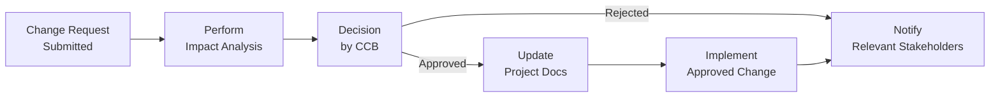

## 17.3 Controlling Scope, Managing Changes, and Preventing Scope Creep

Controlling project scope is both an art and a science. It involves ensuring that the project’s defined scope is delivered as planned and that all modifications—both approved and unapproved—are handled through a structured process. In essence, it is a disciplined approach to measuring performance against the project’s Scope Baseline, while also providing a framework to address any requested changes in a transparent and well-managed manner.

Scope control becomes especially significant when team members, stakeholders, or other external influences propose alterations. If not monitored, these additions—often made with the best of intentions—can balloon into unmanageable expansions called scope creep, threatening budgets, timelines, and the project’s overall success. This section explores how to establish a robust scope change control system, manage unexpected or evolving requirements, and prevent scope creep in both predictive and adaptive environments.

### Foundation of Scope Control
Understanding why and how scope changes occur is the starting point for controlling scope. When the project environment is dynamic, new insights often surface. Organizations may pivot strategies, users might refine their needs, or regulatory requirements could shift. A strong scope control process helps ensure each potential change is recognized, documented, analyzed, and integrated without losing sight of the project’s objectives.

Key objectives of scope control include:
- Evaluating requested changes to determine their necessity and potential value.  
- Approving or rejecting changes based on defined criteria.  
- Minimizing unauthorized modifications and gold plating.  
- Updating project documents, plans, and baselines systematically.  
- Communicating decisions clearly to all stakeholders.  

A well-structured change management strategy, especially one that aligns with a broader organizational governance framework, is essential for successful scope control.

### Scope Creep vs. Scope Change
Even with rigorous planning, scope evolution is natural. The issue arises when changes occur without proper authorization, risk assessment, or documentation. Two common conditions—scope creep and gold plating—are often conflated:

- **Scope Creep**: An unapproved expansion or modification to the agreed-upon scope that evolves gradually without deliberate decisions. For instance, a web development project where new functionalities emerge “just because someone requested them in passing” without a formal approval process.
  
- **Gold Plating**: This occurs when team members (or sometimes even the sponsor) add extra features or enhancements beyond the required specifications. It typically stems from a desire to “overdeliver” or demonstrate technical prowess, which can inadvertently increase costs and complexity.

A well-defined scope, coupled with clear acceptance criteria and a formal change control process, helps distinguish necessary changes from unplanned expansions.

### Formal Change Control Process
A classic best practice for scope control is the formal change control process. This process may vary in detail across predictive (waterfall), agile, and hybrid approaches, but the essential steps remain consistent:

1. **Change Request Submission**  
   - Stakeholders, team members, or other relevant parties document their proposed change using a Change Request Form. This should capture the nature of the change and its rationale.

2. **Impact Analysis**  
   - The potential impacts on cost, schedule, quality, and risks are examined. Tools like cost-benefit analysis, resource availability checks, and risk assessments are used to determine viability.

3. **Review and Approval**  
   - A Change Control Board (CCB) or relevant authority evaluates the requested change’s alignment with project objectives and resource constraints. If the change is justified, it’s approved; otherwise, it’s rejected or deferred.

4. **Implementation**  
   - If approved, the team integrates the change into the project’s roadmap or backlog. This might involve updating the Scope Baseline, Project Management Plan, or Product Backlog (in agile contexts).

5. **Documentation**  
   - All related project documentation, including baselines and logs, is updated. This ensures traceability and clarifies any additional requirements or updated deliverables.

6. **Communication**  
   - All stakeholders—especially those affected by the change—are informed of relevant details, such as new timelines, resource allocations, or acceptance criteria.

In agile frameworks where change is expected, the concept of a formal “change control board” may seem inconsistent. However, agile projects often incorporate similar policies through iteration planning meetings or sprint reviews, ensuring changes remain managed and purposeful.

### Tools and Techniques for Scope Control
Projects rely on several tools, techniques, and methodologies to keep scope in check:

1. **Variance Analysis**  
   - Comparing actual deliverables, tasks, or user stories against the original scope baseline helps identify deviations that need correction or formal change requests.

2. **Trend Analysis**  
   - Analyzing how changes accumulate over time can reveal if the project is drifting excessively from original objectives. Trend charts illustrate whether the volume of changes is stable, decreasing, or escalating.

3. **Integrated Change Control**  
   - Within the broader project environment, changes to scope often influence other areas (schedule, cost, quality, risk). Integrated change control ensures consistency across the entire project.

4. **Configuration Management**  
   - This process manages changes to project artifacts, such as requirements documents and design specifications. It clarifies which version of a document is valid and what changes have been made to it.

5. **Backlog Refinement (Agile)**  
   - In agile setups, frequent backlog refinements allow teams to reprioritize requirements and remove outdated or low-value user stories, thus preventing overshadowed tasks from creeping into sprints.

6. **Prototyping & Mock-ups**  
   - Using prototypes or mock-ups helps stakeholders visualize deliverables early on. Early feedback can eliminate the need for disruptive changes later, a key strategy in preventing scope creep.

7. **Progressive Elaboration**  
   - For large or complex endeavors, scope is refined iteratively. Each refinement stage must still follow formal procedures for scope modification, ensuring alignment with the project’s strategic goals.

### Preventing Scope Creep
Preventing scope creep entails a combination of planning, communication, and vigilance:

- **Define Clear Requirements**: Begin with comprehensive, validated requirements. Use structured requirement-gathering processes and maintain a Requirements Traceability Matrix to link each requirement to business objectives and acceptance criteria.
  
- **Set Baselines Early**: Establish the Scope Baseline (including the Work Breakdown Structure (WBS), WBS dictionary, and Scope Statement) at an early stage, following careful review and sign-off. A well-documented baseline serves as a critical point of reference for evaluating subsequent changes.

- **Educate Stakeholders**: Many stakeholders request changes out of misunderstanding or because the scope was not fully clear. Regular communication sessions, demos, and stakeholder workshops improve shared understanding and reduce unnecessary requests.

- **Thorough Impact Analysis**: Evaluate the potential implications of each suggested change on cost, timeline, and risks. Even “small” revisions can have ripple effects if they reshuffle critical activities or require specialized resources.

- **Empower the Team**: A strong governance structure combined with team empowerment fosters accountability. The team should feel confident in identifying out-of-scope work and raising the alert. Meanwhile, the project manager, sponsor, or CCB retains the authority to approve or deny changes.

- **Regular Status Reporting**: Transparent status reports showing progress relative to the scope help catch unplanned expansions early. Tools like Earned Value Management (EVM) can measure variance in deliverables and keep focus intact.

- **Avoid Gold Plating**: Team members might add extras in the belief that “the customer will love these additions.” However, they can divert resources, create confusion, and expand scope unintentionally. Regularly remind the team about the project’s specific deliverables, acceptance criteria, and constraints.

#### Real-World Example: IT System Upgrade
Imagine a company upgrading its legacy Customer Relationship Management (CRM) system. Initially, the scope includes migrating existing customer data, integrating with the ERP (Enterprise Resource Planning) platform, and training staff on the new system. Partway through, a sponsor suggests adding new marketing automation features. Having a robust change control process means the request gets evaluated. If approved, the sponsor might reallocate extra funds and shift deadlines, or decide that the new features are out of the project’s scope. Without such a process, the development team might attempt to add this functionality, causing schedule overruns and additional costs—classic scope creep.

#### Real-World Example: Construction Project
In a commercial construction project, scope creep is often driven by design changes. For instance, an interior designer proposes upgrading the building’s lobby space with more expensive finishes. If the architect or project team starts making these modifications without formal acceptance from the sponsor, the project’s cost and timeline can spiral. A well-documented scope baseline ensures that such requests go through an approval loop and entire project plans are updated accordingly.

### Using Visual Tools to Manage Changes

Below is a high-level mermaid diagram showing a simplified formal change control process. The top nodes display the origin of a change request, and each subsequent node outlines the decision and documentation steps.

Explanations:  
• A initiates the change, capturing details like reason, benefits, and potential risks.  
• B assesses the request's implications on schedule, budget, quality, and resource allocation.  
• C is the final decision gate, ensuring alignment with strategic or sponsor priorities.  
• D documents updated baselines, including revised scope statements, WBS sections, or relevant logs.  
• E ensures everyone impacted is aware of how the scope changed or remained constant.  
• F is where the approved change is integrated into the tasks or increments currently in progress.

### Managing Changes in Agile and Hybrid Projects
Agile and hybrid frameworks often anticipate change, focusing on value delivery over baseline adherence. That said, scope remains “controlled,” albeit more flexibly:

- **Rolling Wave Planning**: Detailed planning occurs in short segments. This keeps the backlog dynamic but ensures that each new story or requirement goes through a prioritization process where value is weighed against project constraints.
  
- **Iterative Feedback**: Frequent inspection and adaptation cycles (e.g., sprint reviews) ensure any emerging needs are formally captured in the backlog. This continuous feedback loop can help reduce “stealthy changes.”
  
- **Timeboxing**: By confining work within fixed sprints or iterations, agile teams minimize the risk of scope expanding mid-cycle without notice. Items that are not in the current sprint backlog should not be worked on.

- **Definition of Done**: A pre-set “Definition of Done” clarifies acceptance criteria for each user story or product increment. This definition helps the team confirm that tasks are fully completed as specified, resisting the temptation to add “a little extra.”

### Addressing Unauthorized Requests
Not every requested change is legitimate. Sometimes, well-intentioned individuals attempt to bypass the process. Here’s how to handle unauthorized requests:

- **Re-Route**: Friendly but firm communication directs the requester to the formal procedure. For example, “Thanks for suggesting this. Let’s file a Change Request to see how it impacts our overall objectives.”
  
- **Document Even if Rejected**: Logging all incoming suggestions or changes—especially those that are rejected—creates a forensic trail. This helps in auditing, learning, and future planning.
  
- **Reinforce Policy**: Provide regular refreshers to the team and stakeholders on the importance of following a structured approach. The project manager and sponsor must lead by example, demonstrating that changes are either endorsed or disapproved through a transparent method.

### Balancing Flexibility and Control
One of the most challenging tasks for project managers is maintaining enough control to prevent chaos while still allowing beneficial changes. The project manager’s relationship skills, stakeholder influence, and subject-matter expertise matter greatly in making balanced decisions. If the environment requires pivoting, the manager must collaborate with the sponsor or steering committee to adjust scope responsibly.

Some tips for striking this balance:
- Maintain a flexible contingency budget for change.  
- Prioritize changes by business value and strategic alignment.  
- Leverage rolling wave planning in uncertain environments.  
- Run experiments or pilots for high-impact changes before full-scale implementation.  

### Common Pitfalls and How to Avoid Them
Below is a simple table that highlights frequent pitfalls associated with scope control, along with practical strategies to prevent them.

| Pitfall                              | How to Avoid                                                          |
|--------------------------------------|----------------------------------------------------------------------|
| Vague Scope Statement                | Develop a clear, quantified Scope Statement and get formal sign-off. |
| Lack of Change Control Board         | Establish a defined authority (CCB) or equivalent decision group.     |
| Unclear Decision Criteria            | Formalize acceptance thresholds and evaluation criteria.              |
| Communication Breakdowns             | Communicate changes, decisions, and next steps regularly.            |
| Ignoring External Dependencies       | Evaluate how changes affect vendors, third parties, and compliance.   |
| Over-Engineering (Gold Plating)      | Follow the requirements strictly and discourage unnecessary extras.   |
| Weak Stakeholder Engagement          | Keep stakeholders informed and part of decisions to gain acceptance.  |
| Delayed Impact Analysis              | Address impacts promptly to prevent rework or cumulative slippage.    |

In each instance, a well-structured and consistently applied change process guides the project team to handle requests responsibly and openly.

### Case Study: Marketing Campaign Revamp
A small marketing firm was hired to revamp a client’s entire online campaign. The initial scope included a home-page redesign, social media content creation, and a short video ad for YouTube. Gradually, the client suggested adding more social media platforms, a mini-documentary, and advanced search engine optimization. Because the marketing firm had a robust scope control process, each new request triggered an impact analysis. The client ultimately decided which changes were most critical, re-baselined the scope, and paid for expanded services accordingly. The project completed on budget because the firm’s approach ensured that changes were either formally adopted (with clear funding) or rejected.

### Summary and Best Practices
Controlling scope, managing changes, and preventing scope creep are intertwined responsibilities of the project manager, sponsor, and entire project team. By relying on formal processes, thorough documentation, and transparent decision-making, projects can adapt to legitimate changes while safeguarding their strategic objectives. Consistent communication, stakeholder education, and integrated change control remain the timeless cornerstones for keeping a project on track.

Remember:
- A well-governed scope management process can rescue a project from expensive pitfalls.  
- Each suggested change, regardless of size, warrants proper analysis and documentation.  
- Prevent gold plating by reminding teams of the approved acceptance criteria.  
- The ultimate measure of success is delivering the agreed-upon scope within constraints, while also ensuring actual business value is optimized whenever feasible.

### References and Further Reading
- Project Management Institute (PMI). A Guide to the Project Management Body of Knowledge (PMBOK® Guide) – Seventh Edition.  
- Project Management Institute (PMI). PMIstandards+™ Digital Content Portal.  
- Kerzner, H. (2017). Project Management: A Systems Approach to Planning, Scheduling, and Controlling.  
- “Agile Practice Guide.” Project Management Institute (PMI) and Agile Alliance.  
- Cohn, M. (2005). Agile Estimating and Planning.

## Mastering Scope Control: Your Comprehensive Quiz



### Which of the following best defines scope creep? 
- [ ] The process of obtaining formal acceptance of deliverables.
- [x] An unapproved increase in project scope without corresponding changes to time, cost, or resources.
- [ ] A risk management strategy where contingencies are put into play.
- [ ] The formal selection of new vendors based on cost-benefit analysis.

> **Explanation:** Scope creep occurs when additional tasks, features, or requirements are inserted into the project outside of official approval and integration mechanisms, often jeopardizing budget, schedule, or quality.

### What is a primary difference between scope creep and gold plating?
- [ ] Scope creep involves budget reductions, while gold plating is about schedule extensions.
- [ ] Gold plating happens only in agile projects, while scope creep is restricted to predictive projects.
- [x] Scope creep arises from unapproved scope additions, while gold plating is adding extra features intentionally beyond requirements.
- [ ] There is no difference; both terms are interchangeable.

> **Explanation:** Scope creep refers to any unapproved expansion of scope, whereas gold plating is an intentional enhancement beyond specified requirements, often undertaken by the team in an attempt to “over-deliver.”

### Which process ensures that all changes to the project management plan are coordinated across all knowledge areas?
- [ ] Rolling Wave Planning
- [x] Integrated Change Control
- [ ] Bottom-Up Estimation
- [ ] Quality Assurance

> **Explanation:** Integrated Change Control handles development of changes, review, approval, and updates across all parts of the project management plan, ensuring consistency.

### In an agile environment, which activity commonly helps maintain scope control by revisiting and pruning user stories periodically?
- [ ] Critical Path Analysis
- [ ] Pareto Charts
- [ ] Fishbone Diagrams
- [x] Backlog Refinement

> **Explanation:** Backlog Refinement allows teams to regularly review, re-prioritize, and remove user stories that are no longer valuable or relevant, preventing unmanageable expansions of scope.

### A stakeholder continuously suggests new enhancements. Which approach most effectively prevents scope creep?
- [x] Direct the stakeholder to submit a formal change request for each proposal.
- [ ] Quietly incorporate changes to maintain stakeholder satisfaction.
- [ ] Immediately deny all change requests and proceed with initial scope.
- [x] Analyze each suggestion’s impact, and approve only high-value changes.

> **Explanation:** Ensuring that every new request is subject to analysis and approval ensures transparency and alignment with strategic priorities. Some changes can be legitimate and beneficial if carefully considered; others may be rejected to safeguard project constraints.

### Which term best refers to adding extra features not specified in the scope as a means of “overdelivering”?
- [x] Gold Plating
- [ ] Mandatory Changes
- [ ] Scope Creep
- [ ] Operating Expense

> **Explanation:** Gold plating involves offering more functionality or deliverables than required in an attempt to impress stakeholders, which can increase risk and consume additional resources without formal approval.

### During a high-profile software project, how can a project manager systematically identify if unauthorized requirements have snuck into development?
- [x] Conduct regular variance analysis of the WBS against completed tasks.
- [ ] Wait until the final deliverable is complete for final inspection.
- [x] Establish a change control board that reviews increments monthly.
- [ ] Track only cost performance, as unapproved changes always impact cost first.

> **Explanation:** Variance analysis is a critical step in comparing completed or ongoing work with the agreed-upon scope. Regular CCB reviews add another layer of defense by ensuring changes are well-documented, measured, and approved.

### What is the primary purpose of a Requirements Traceability Matrix (RTM) in scope control?
- [x] It connects each requirement to its origin and acceptance criteria, helping ensure no unauthorized changes sneak in.
- [ ] It documents the project's budget and scheduling baselines.
- [ ] It tracks team performance in agile sprints.
- [ ] It catalogs stakeholder contact details for communication purposes.

> **Explanation:** RTMs link each requirement to its business objectives, acceptance criteria, and relevant project artifacts, ensuring traceability of scope changes and preventing unapproved expansions.

### In a hybrid project, new marketing automation features were proposed post-planning. Which is the best first step to integrate them?
- [x] Perform impact analysis to determine budget, schedule, and resource implications.
- [ ] Incorporate them immediately to keep the client continually satisfied.
- [ ] Move them to a future iteration automatically.
- [ ] Reject them because scope changes are never allowed in hybrid projects.

> **Explanation:** All potential changes must undergo an impact analysis to evaluate viability. This approach ensures that any adjustments are financially justified, strategically aligned, and properly scheduled.

### Scope control processes are designed to ensure all approved changes are documented, but also:
- [x] Rejected or deferred changes are also recorded for future reference.
- [ ] Only the sponsor is aware of decisions.
- [ ] Non-essential changes bypass approval.
- [ ] Changes that reduce project cost are ignored.

> **Explanation:** Proper documentation of all changes—even if rejected—helps maintain transparency, provides an audit trail, and supports future lessons learned.



## PMP Mastery: 1500+ Hard Mock Exams with Full Explanations 

Looking to crush the PMP exam with confidence? Dive deep into 6 rigorous mock exams totaling 1500+ advanced-level questions, each accompanied by clear, step-by-step explanations. Hone your test-taking strategies, master complex topics, and build the resilience you need on exam day. Perfect for serious PMs aiming beyond fundamentals.

Enroll now:  
[PMP Mastery: 1500+ Hard Mock Exams with Exceptional Clarity & Full Explanations](https://www.udemy.com/course/pmp-2025/?referralCode=CF83A54BC86BE27F9AFE)

_Disclaimer: This course is not endorsed by or affiliated with the PMI examination authority. All content is provided purely for educational and preparatory purposes._
