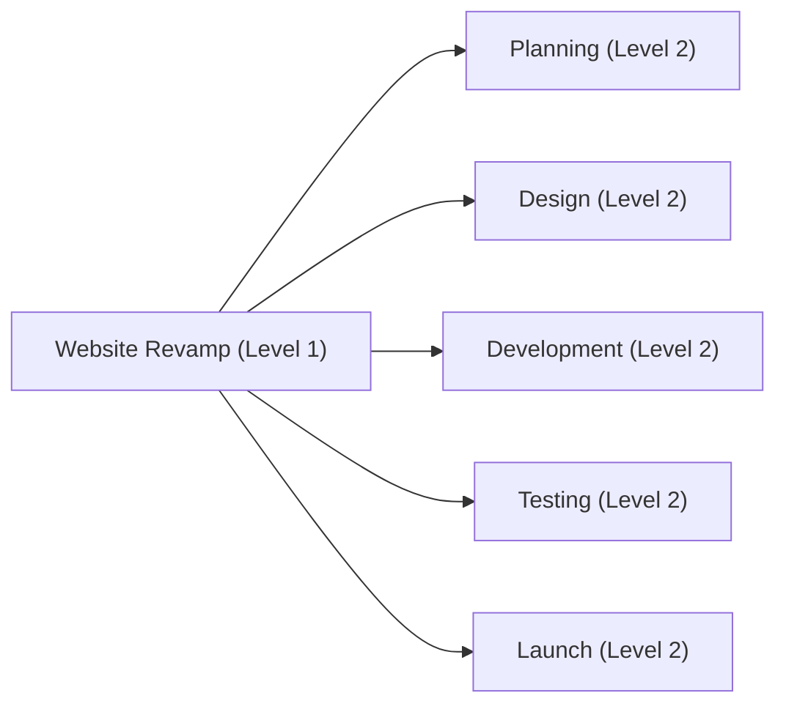

## 18.1 Work Breakdown Structure and Activity Sequencing

Creating a Work Breakdown Structure (WBS) is an integral step toward delivering projects on time and within scope. Once the WBS is defined, the project team faces the critical task of logically sequencing activities to form a robust schedule. This section explores key concepts, methodologies, and real-world strategies for success in developing a WBS and then organizing WBS-derived tasks into a cohesive, workable schedule.

By examining best practices in decomposition, stakeholder alignment, and scheduling logic, you will gain insight into how each work package translates into specific activities, how dependencies are established, and how to optimize sequences for project efficiency. We will also include examples, diagrams, and tables to illustrate how WBS creation and activity sequencing function in various organizational settings.

### The Strategic Value of a Well-Structured WBS

A Work Breakdown Structure is a hierarchical decomposition of a project’s total scope. The primary reason to develop a WBS is to capture and organize project deliverables, tasks, and sub-tasks in a structured manner. For example, in Chapter 17 (Scope and Requirements Management), the focus lies on defining exactly what the project must deliver. The WBS extends that definition by breaking down those deliverables into smaller, manageable pieces called work packages. These work packages are the foundation for:

• Estimating costs and durations  
• Assigning responsibilities and resources  
• Identifying high-level risks and constraints  
• Facilitating communication among teams and stakeholders  

Ultimately, a well-structured WBS ensures nothing is overlooked. By dividing the scope into hierarchical work packages, you can more confidently transition into the next phase: detailed activity definition and sequencing.

### Defining the Levels of the WBS

The WBS typically has multiple levels, each becoming progressively more detailed. Although the number of levels can vary based on project size and complexity, many teams adopt a simple three-level (or four-level) structure:

• Level 1: Major project deliverables or phases.  
• Level 2: Sub-deliverables grouped under the major deliverables.  
• Level 3: Work packages that can be assigned to individuals or teams.  
• (Optional) Level 4: Further sub-packages or tasks when additional detail is needed.

Below is an example WBS for a website revamp project, shown in Mermaid notation:

In this example, “Planning,” “Design,” “Development,” “Testing,” and “Launch” form the second-level deliverables (or phases). Each of these can be further decomposed into work packages—small, actionable units that the project team can take up and execute.

### Decomposition and the WBS Dictionary

While the WBS visually represents the hierarchy of deliverables, the WBS Dictionary provides textual detail about each component. For instance, if “Design” is decomposed into multiple sub-level packages such as “UI Concept,” “Graphic Assets,” and “User Flow Diagrams,” the WBS Dictionary clarifies:

• The scope of each work package  
• The responsible team or individual  
• Acceptance criteria  
• Estimated duration or effort  

The WBS Dictionary removes ambiguity by ensuring everyone knows precisely what each work package entails before planners move on to activity-level scheduling.

### From Work Packages to Activities

After the WBS is finalized, each work package is analyzed to identify sequential activities. Activities represent the elemental tasks you need to perform. Here is how you differentiate them:

• Work Packages: Deliverable-focused collection of tasks.  
• Activities (or Tasks): Individual tasks needed to create the deliverable defined in the work package.

For instance, if a Level 3 work package is “Build Homepage Prototype,” the activities might include:

• Gather functional requirements  
• Create wireframes  
• Draft site layout  
• Develop front-end code for homepage  
• Conduct initial usability tests  

Every activity you identify should be actionable, measurable, and clearly define its start and end conditions.

### Introducing Activity Sequencing

Activity sequencing arranges project activities in the most logical and efficient order. This step often uses tools like network diagrams, Gantt charts, and scheduling software. By defining dependencies, you visualize which tasks must happen sequentially, which can happen in parallel, and where potential bottlenecks might arise.

Four common dependencies define how tasks interact:

• Finish-to-Start (FS): The successor activity cannot begin until the predecessor finishes.  
• Start-to-Start (SS): The successor can only start after the predecessor has started.  
• Finish-to-Finish (FF): The successor can only finish after the predecessor has finished.  
• Start-to-Finish (SF): The successor can only finish after the predecessor has started (less common).  

These dependencies might be mandatory (driven by the nature of work) or discretionary (based on best practices or team preference). They can also be external, requiring a milestone or deliverable from outside the project’s immediate control.

### Mandatory vs. Discretionary Dependencies

Mandatory dependencies arise from the logical or physical constraints of the work. For instance, you cannot start pouring concrete until you have completed excavation on a construction site. Discretionary dependencies, however, may be project- or team-defined. For example, your team may decide to review draft documentation before beginning final editing, even though both tasks could theoretically occur in parallel.

Being aware of these dependency types is crucial for accurate scheduling. A schedule that fails to consider mandatory technical constraints or has too many discretionary hold points often leads to delays and inefficiencies.

### Leads and Lags

Leads and lags further fine-tune your schedule:

• Lead: An acceleration of the successor activity. You allow an activity to start sooner, overlapping partially with the predecessor’s completion.  
• Lag: A delay between the predecessor’s finish and the successor’s start. You intentionally pause or defer when an activity can begin.

Leading and lagging are especially handy in complex projects with tasks that can partially overlap (e.g., software testing can begin on certain modules before all modules are developed). Conversely, you might introduce a lag to account for a mandated waiting period, such as drying time in construction or data collection intervals in research.

### The Precedence Diagram Method (PDM)

The Precedence Diagram Method (PDM) is often used in modern project scheduling tools. In a PDM network diagram, activities are represented by nodes, and dependencies by arrows. Below is a simplistic example showing the FS relationships of building a homepage:

1. “Design Homepage” is a predecessor to “Develop Homepage.”  
2. “Develop Homepage” is a predecessor to “Test Homepage.”  
3. “Test Homepage” is a predecessor to “Finalize Homepage.”  

Between these activities, you might introduce a lead if part of development can start while design is still in progress. You could introduce a lag if there’s a waiting period required after coding (e.g., waiting for user acceptance approvals) before you can begin testing.

### Arrow Diagram Method (ADM)

Though less commonly used today, the Arrow Diagram Method depicts activities on the arrows rather than nodes. The process logic remains similar, capturing how tasks flow from one to the next. For the PMP® exam, you should understand both PDM and ADM. However, most organizations now favor PDM due to its straightforward representation and easy integration into scheduling tools.

### Identifying and Integrating External Dependencies

External dependencies often pose greater schedule risk because they lie outside your direct control. Examples include:

• A vendor’s lead time for delivering materials  
• Regulatory approval from government agencies  
• Input or data from contractors or other departments  

These dependencies can be crucial in determining the critical path—a sequence of activities that directly impacts the project’s finish date if delayed. You will see a deeper look at risk management and how external dependencies affect it in Chapter 22 (Risk and Uncertainty Management).

### Sequencing in Agile, Hybrid, and Predictive Environments

While a WBS is traditionally associated with predictive (waterfall) project management, Agile and Hybrid methods also benefit from structured outlines of deliverables. In Agile, the Product Backlog often mirrors the concept of a WBS at a high level, although it is less rigid. Iterative or incremental approaches still require the activity sequences for sprints or iterations, even if they are shorter in cycle duration.

In Hybrid contexts, you might create standard waterfall-like WBS elements for certain deliverables while reserving iterative or Agile scheduling for others. Some items on the WBS may be fully broken down at the start, while others remain at a high level, to be preplanned or “sprint-planned” at a later time (rolling wave planning).

### Critical Path: Why Sequencing Really Matters

Once your activities are listed and dependencies set, you can identify the critical path—one or more sequences of tasks that determine the project’s minimum duration. Any delay along the critical path automatically delays the overall project timeline unless corrective or mitigating actions are taken. Sequencing activities with an eye on the critical path is essential for schedule compression techniques such as crashing or fast tracking, both of which can be used strategically if you need to expedite the project (as discussed in Chapter 18.3, “Schedule Compression and Agile Time-Boxing”).

### Practical Example: Launching a Product Marketing Campaign

Consider a product marketing campaign with the following deliverables:

• Research & Strategy  
• Content Creation  
• Design & Creative Assets  
• Digital Advertising Setup  
• Launch and Monitoring  

After creating a WBS that decomposes these deliverables into relevant work packages, plan the following activities:

1. **Research & Strategy**  
   - Conduct market interviews  
   - Draft marketing strategy  
   - Approve final plan  

2. **Content Creation**  
   - Develop key messages  
   - Produce video ads  
   - Create blog articles  

3. **Design & Creative Assets**  
   - Design campaign logos  
   - Create social media graphics  

4. **Digital Advertising Setup**  
   - Configure ad platforms (Google, Facebook, LinkedIn)  
   - Set up analytics  

5. **Launch and Monitoring**  
   - Deploy ads  
   - Monitor performance  
   - Optimize/Adjust ads  

Sequencing might look like this:

• “Conduct market interviews” → “Draft marketing strategy” (FS)  
• “Draft marketing strategy” → “Approve final plan” (FS)  
• “Approve final plan” → “Develop key messages” (FS)  
• “Produce video ads” and “Create blog articles” may start only after “Develop key messages” is 50% complete (SS with a lead).  
• “Set up analytics” has a discretionary dependency to start only after “Design campaign logos” is complete (SS or FS).  

At each step, confirm whether dependencies are mandatory (e.g., you must finalize the marketing strategy before you can produce content) or discretionary (e.g., you prefer having final logos ready before configuring ads, but it’s not strictly required).

### Best Practices

- **Engage Stakeholders Early:** Involve team members and project sponsors when creating the WBS to ensure no deliverables are overlooked.  
- **Use Consistent Naming Conventions:** This helps the entire team understand various work packages across multiple projects or programs.  
- **Decompose to a Manageable Level:** If a work package is too large or complex to estimate effectively, break it down further.  
- **Identify All Dependencies:** Missing an external dependency or a cross-team requirement can derail your schedule and lead to conflicts.  
- **Review and Validate the WBS:** Consistently update your WBS and dictionary. Revisit them after major changes or as the project evolves.  
- **Consider Risk Early:** Before fully defining the final schedule, consult your risk register. Some tasks may require additional lead time or buffers.  

### Common Pitfalls

- **Excessive Granularity:** Over-decomposing tasks can burden the team with micromanagement and unnecessary detail.  
- **Missing Dependencies:** Neglecting to capture external dependencies or incorrectly sequencing tasks can lead to schedule slippage.  
- **Inflexible Sequencing:** Strictly enforcing discretionary dependencies can limit opportunities to accelerate the schedule when needed.  
- **Ignoring Stakeholders’ Input:** Failing to incorporate stakeholder views in the WBS or scheduling process can cause rework later.  
- **Lack of Updates:** An outdated WBS and schedule quickly become irrelevant. Keep them current and integrated with the project’s change control process.  

### References for Further Exploration

- PMI’s “A Guide to the Project Management Body of Knowledge (PMBOK® Guide) – Seventh Edition”  
- Chapter 17 of this text, “Scope and Requirements Management”  
- Chapter 18.3 of this text, “Schedule Compression and Agile Time-Boxing”  
- “Practice Standard for Work Breakdown Structures” by PMI  
- “The Handbook of Program Management” by James T. Brown (for advanced multi-project WBS techniques)  

---

## Master Your Work Breakdown Structure and Activity Sequencing Knowledge



### Which of the following best describes a Work Breakdown Structure (WBS)?

- [ ] A scheduling chart that depicts the critical path.  
- [x] A hierarchical decomposition of total project scope.  
- [ ] A method to estimate cost and budget.  
- [ ] A single document describing product requirements.  

> **Explanation:** The WBS is a structural decomposition of the project's scope into manageable deliverables or work packages.  

### What is the primary purpose of a WBS Dictionary?

- [ ] To rank risks associated with each WBS element.  
- [ ] To outline only project boundaries and constraints.  
- [x] To detail deliverable descriptions, responsibilities, and acceptance criteria.  
- [ ] To create a budget and resource spreadsheet.  

> **Explanation:** The WBS Dictionary provides comprehensive details for each work package, including scope, ownership, and acceptance parameters.  

### In the Precedence Diagram Method (PDM), which dependency type is most common?

- [x] Finish-to-Start (FS)  
- [ ] Start-to-Start (SS)  
- [ ] Finish-to-Finish (FF)  
- [ ] Start-to-Finish (SF)  

> **Explanation:** Finish-to-Start is the most frequently used dependency, where a successor activity cannot start until a predecessor activity finishes.  

### Which statement about leads and lags is correct?

- [ ] A lead requires the successor activity to begin late.  
- [ ] A lag always shortens overall project duration.  
- [x] A lead can introduce a partial overlap; a lag can introduce a delay.  
- [ ] Leads are mandatory, and lags are discretionary.  

> **Explanation:** Leads speed up the start of a successor activity (allowing overlap), while lags delay the start.  

### Which of the following is an example of a discretionary dependency?

- [x] Reviewing a draft document before final editing to maintain quality.  
- [ ] Waiting for concrete to dry before constructing walls.  
- [ ] Receiving legal approval before launching a product.  
- [ ] Awaiting external supplier delivery for critical components.  

> **Explanation:** The review of the draft is based on best practices (discretionary), rather than a mandatory or external constraint.  

### Why is identifying external dependencies critical in scheduling?

- [ ] External dependencies never impact critical path calculations.  
- [ ] They are typically optional and can be deferred.  
- [ ] They only affect cost, not timelines.  
- [x] They lie outside the project’s direct control and can create potential delays.  

> **Explanation:** External dependencies pose increased risk because they depend on factors beyond the project team’s direct influence.  

### A mandatory dependency is often described as:

- [ ] Entirely at the project manager’s discretion.  
- [x] Inherently or technically required for sequence logic.  
- [ ] An optional best-practice step to ensure quality.  
- [ ] Something that can be eliminated through stakeholder negotiation.  

> **Explanation:** Mandatory dependencies stem from the nature of work or technical constraints and cannot be bypassed easily.  

### Which scheduling method places activities on nodes rather than arrows?

- [ ] Arrow Diagram Method (ADM)  
- [x] Precedence Diagram Method (PDM)  
- [ ] Parametric Estimation Method  
- [ ] Gantt Charting Method  

> **Explanation:** In PDM, activities appear as nodes, connected by arrows that depict dependencies.  

### Which statement accurately defines a work package?

- [ ] A summary of all project deliverables.  
- [x] The lowest-level deliverable in a WBS, assigned to an individual or team.  
- [ ] A mandatory external dependency.  
- [ ] A dedicated sub-project requiring separate governance.  

> **Explanation:** Work packages reside at the lowest manageable level of the WBS, often assigned to specific team members or functional areas.  

### The critical path is best described as:

- [x] The sequence of tasks that determines the project’s earliest completion date.  
- [ ] A set of tasks that always have discretionary dependencies.  
- [ ] A method used only for small, short-term projects.  
- [ ] Statistical modeling used to identify resource constraints.  

> **Explanation:** The critical path is the chain of activities that directly determines the project’s final completion date, as any delay in these activities delays the entire project.  



---

## PMP Mastery: 1500+ Hard Mock Exams with Full Explanations 

Looking to crush the PMP exam with confidence? Dive deep into 6 rigorous mock exams totaling 1500+ advanced-level questions, each accompanied by clear, step-by-step explanations. Hone your test-taking strategies, master complex topics, and build the resilience you need on exam day. Perfect for serious PMs aiming beyond fundamentals.

Enroll now:  
[PMP Mastery: 1500+ Hard Mock Exams with Exceptional Clarity & Full Explanations](https://www.udemy.com/course/pmp-2025/?referralCode=CF83A54BC86BE27F9AFE)

_Disclaimer: This course is not endorsed by or affiliated with the PMI examination authority. All content is provided purely for educational and preparatory purposes._
