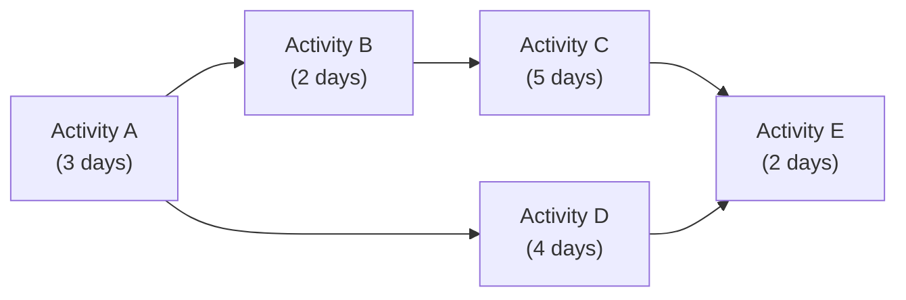
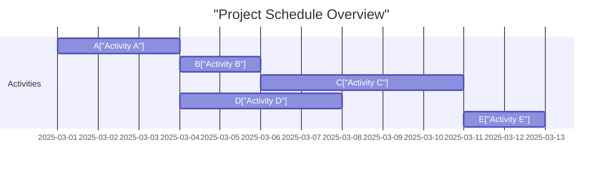

## 18.2 Duration Estimation and Critical Path Method

Managing project schedules effectively is crucial for successful project delivery, cost control, and stakeholder satisfaction. In this section, we explore two essential and interrelated concepts central to professional schedule management practices:  
• Duration Estimation – selecting and applying the best approach to predict the time required to complete project tasks.  
• Critical Path Method (CPM) – analyzing the network of tasks to identify the sequence that determines the total project duration.

This chapter focuses on the use of top-down versus bottom-up estimation, practical insights for applying the Critical Path Method, and incorporating variance analysis to address schedule uncertainty.

---

### Understanding Duration Estimation

Duration estimation is the process of forecasting the number of work periods required to complete individual tasks or activities in a project. When done accurately, duration estimates provide the foundation for realistic schedules that guide resource allocations, sequencing, budgeting, and risk management.

Common inputs to duration estimation include:  
• Work Breakdown Structure (WBS) and activity lists.  
• Resource availability (people, equipment, facilities).  
• Historical information from comparable projects (lessons learned, organizational process assets).  
• Expert judgments from team members or subject matter experts (SMEs).  
• Tools such as analogous estimating, parametric estimating, three-point estimating (PERT), and bottom-up estimating.

Since all projects are a balance between cost, schedule, and scope, you should always cross-check your duration estimates against these constraints to ensure feasibility and alignment with the organization’s strategic objectives. For a deeper exploration of how schedule planning integrates with broader project management processes, refer to Chapters 10 (Planning Performance Domain) and 18.1 (Work Breakdown Structure and Activity Sequencing).

---

### Top-Down vs. Bottom-Up Estimation

#### Top-Down (Analogous) Estimation
Top-down estimation, often referred to as analogous or comparative estimation, involves using high-level information—often from historically similar projects—to derive an approximate schedule target. Project managers compare the scope, complexity, and deliverables of the current project to past endeavors. By leveraging established benchmarks and expert judgment, top-down estimates can be obtained quickly with relatively low effort.

Key benefits of top-down estimation:
- Speed and simplicity: Minimal time is required to produce rough or initial estimates.  
- Early-stage insights: Useful when project details are scant and high-level budgets or schedules are needed.  
- Resource-driven comparisons: Allows referencing actual outcomes from past projects and adjusting for known differences.

Common pitfalls:
- Overgeneralization: No two projects are exactly alike. Adjustments for variations (e.g., team skill sets, technology differences, and compliance requirements) are easily overlooked.  
- Potential bias: Reliance on subjective expert opinions or inaccurate historical data can skew results.  
- Lack of detail: These estimates may not hold up well against deeper scrutiny or complex project demands.

#### Bottom-Up Estimation
Bottom-up estimation is a more detailed approach that involves breaking down the project scope into specific work packages (from a WBS) and then estimating each activity’s duration at the lowest practical level. These granular estimates are aggregated to determine the total project duration.

Key benefits of bottom-up estimation:
- Higher accuracy: By examining each activity’s requirements, resource availability, and potential risks closely, you gain more reliable estimates.  
- In-depth risk assessment: When each task is explicitly outlined, it is easier to identify potential pitfalls, resource constraints, and schedule threats.  
- Greater buy-in: Engaging team members in bottom-up estimation fosters ownership and accountability.

Common pitfalls:
- Time-consuming: Building the WBS, enumerating all activities, and collecting estimates from SMEs requires considerable effort.  
- Risk of micro-detailing: Over-decomposition can lead to diminishing returns, confusion, and difficulty in integrating tasks into a cohesive schedule.  
- Potential rework: If the scope or requirements are unstable, bottom-up estimates may need frequent updates.

Many project managers use a hybrid: start with a top-down approach for initial feasibility and high-level scheduling, then refine with bottom-up estimates to confirm or adjust the plan as detailed information emerges. Maintaining flexibility and ongoing revision is essential, especially in agile or hybrid environments.

---

### Critical Path Method Fundamentals

The Critical Path Method (CPM) is a powerful technique used to determine the sequence of activities that dictates the earliest project completion date. By mapping the network of tasks and measuring their dependencies, CPM helps project managers identify the activities that cannot be delayed without affecting the overall schedule.

The core elements of CPM include:
- Activities: The smallest units of work with defined durations.  
- Dependencies: Logical relationships between tasks (Finish-to-Start, Start-to-Start, etc.).  
- Forward Pass: Calculating earliest start (ES) and earliest finish (EF) times, beginning from the first activity in the schedule.  
- Backward Pass: Calculating latest start (LS) and latest finish (LF) times, working backward from the project conclusion.  
- Total Float: The amount of time a task can be delayed without affecting the overall project completion date. Float (or slack) is often computed as:  
  (1) LS – ES  
  (2) LF – EF  
- Critical Path: The longest path through the network—activities with zero float. Any delay in a critical path activity directly impacts the project completion date.

#### Simplified Steps in CPM
1. Identify all activities.  
2. Sequence the activities logically.  
3. Assign durations to each activity.  
4. Calculate ES and EF using forward pass.  
5. Calculate LS and LF using backward pass.  
6. Determine the total float for each activity.  
7. Identify the critical path(s) with zero float.

For an expanded discussion of schedule creation and logic-driven sequencing, see Chapter 18.1 (Work Breakdown Structure and Activity Sequencing) and Chapter 10 (Planning Performance Domain).

---

### Practical Example: Identifying the Critical Path

Consider a simplified software development project with these activities:

- Activity A: User requirements gathering (3 days)  
- Activity B: System design (2 days)  
- Activity C: Database schema creation (5 days)  
- Activity D: Frontend design (4 days)  
- Activity E: User acceptance testing (2 days)  

Dependencies:  
- Activity A must finish before B and D can start.  
- Activity B must finish before C can start.  
- Activities C and D must both finish before E can start.

Below is a simple network diagram illustrating these relationships:

1. **Forward Pass**  
   - Activity A starts at Day 0 (ES=0).  
   - A (3 days) finishes at EF=3.  
   - B can start at Day 3, will take 2 days, finishing at EF=5.  
   - C can start at Day 5, will take 5 days, finishing at EF=10.  
   - D can start at Day 3 (right after A finishes), will take 4 days, finishing at EF=7.  
   - E can only start once both C (finishes at Day 10) and D (finishes at Day 7) are complete, so E’s earliest start is Day 10, finishing at Day 12 (EF=12).

2. **Backward Pass**  
   - E must finish by Day 12 (LF=12).  
   - C must finish by Day 10 (since E starts Day 10), so LF for C is 10, LS=5.  
   - D must finish by Day 10 (since E starts Day 10), so LF=10, LS=6.  
   - B must finish by Day 5 (to allow C to start at Day 5), so LF=5, LS=3.  
   - A is needed to start B and D. For B, A must finish by Day 3 (LS=1 if we look at D, but for B it’s Day 3). We take the more stringent. Day 3 is the finish for B’s chain. So LF=3, LS=0.  

3. **Identifying Float and the Critical Path**  
   - For the path A → B → C → E:  
     - A’s float = 0 (since LS=0 and ES=0).  
     - B’s float = 0 (LS=3 – ES=3 = 0).  
     - C’s float = 0 (LS=5 – ES=5 = 0).  
     - E’s float = 0 (LS=10 – ES=10 = 0).  
   - For the path A → D → E:  
     - D’s float = (LS=6) – (ES=3) = 3.  
   - Therefore, the critical path is A–B–C–E. Its total duration is 12 days.

Using CPM, you quickly see that a delay in user requirements, system design, or database schema creation will cascade into a later project finish date.

---

### Variance Analysis in Critical Path Scheduling

No matter how methodical the estimation and scheduling process, all projects carry uncertainty. Variance analysis is the approach of quantifying that uncertainty and its potential impact on the project schedule. One common technique is to use three-point (PERT) estimates for activities and then conduct schedule risk analysis.

#### Three-Point (PERT) Estimation
In PERT, each task’s duration is estimated as:  
• Optimistic (O): Best-case scenario.  
• Most Likely (M): The most realistic prediction, given typical conditions.  
• Pessimistic (P): Worst-case scenario.

The expected duration (TE) is calculated using the Beta distribution approach commonly referenced in PMBOK® Guide:  
(1)  
TE = (O + 4M + P) / 6  

To measure variability, PERT also often includes an approximate formula for variance (σ²) of the activity:  
(2)  
Variance (σ²) = ((P – O) / 6)²  

#### Applying Variance Analysis to the Critical Path
1. Identify your critical path activities.  
2. Determine each critical activity’s three-point estimates (O, M, P) and compute the expected duration.  
3. Calculate each activity’s variance and standard deviation.  
4. Sum the variances along the critical path to approximate total schedule variability.

If the aggregated variance is high, you may consider adding schedule reserves or risk response strategies (e.g., re-sequencing activities, employing additional resources, or adopting agile iteration buffers). This technique helps proactively manage the schedule under uncertain conditions.

---

### Common Pitfalls and Best Practices

**Pitfalls**  
- Overlooking Dependencies: Incorrect or incomplete relationships between tasks lead to flawed critical path analysis.  
- Underestimating Resource Constraints: Focusing only on durations without confirming resource availability introduces schedule risk.  
- Ignoring Non-Critical Path Risks: Tasks off the critical path can become critical when resource, risk, or scope changes occur.  
- Neglecting Ongoing Updates: Failing to periodically update the schedule and recalculate the critical path under dynamic project conditions leads to inaccurate schedules.

**Best Practices**  
- Use Historical Data: Whenever possible, incorporate lessons learned from previous projects, adjusting for unique factors of the current project.  
- Involve Your Team: Engaging SMEs, stakeholders, and even key suppliers enhances the accuracy and realism of estimations.  
- Model Different Scenarios: Evaluate best-, worst-, and most-likely outcomes on major deliverables or uncertain tasks.  
- Build Reserves: Use contingency and management reserves for uncertain or high-risk portions of the schedule.  
- Review and Adapt Frequently: Update your schedule with actual progress and new risks, re-identifying the critical path.  

---

### Practical Case Study: Blended Top-Down and Bottom-Up Approach

A manufacturing company is launching a new product line within six months. Top management used top-down estimates for an initial feasibility study, referencing a similar project from the previous year. However, the development workshop revealed new complexities in the supply chain, making the original schedule too optimistic.  

A bottom-up approach was then conducted with each department (design, procurement, assembly, and quality assurance) detailing their tasks and durations. The combined schedule became longer than the initial high-level plan. By applying the Critical Path Method, the project manager identified a tight chain of critical tasks in procurement—where any delay in raw materials would cascade. Adjusting lead times and introducing buffer tasks mitigated the schedule risk.  

This blended top-down/bottom-up method provided an actionable schedule that aligned both with overarching business goals and the operational reality on the ground.

---

### Diagrams for Clarity

Below is an example Gantt chart showing how tasks map to a timeline, including concurrency and dependencies. The critical path is implicitly revealed by the chain with no float:

By analyzing these durations and their relationships, project managers pinpoint potential early or late start scenarios, adjust resource allocations, and manage risk more effectively.

---

### References for Further Reading

- Project Management Institute. A Guide to the Project Management Body of Knowledge (PMBOK® Guide) – Seventh Edition.  
- PMIstandards+. “Schedule Management” and “Risk Management” content repositories.  
- “Agile Practice Guide” by Project Management Institute.  
- Kerzner, Harold. Project Management: A Systems Approach to Planning, Scheduling, and Controlling.  
- “Practice Standard for Scheduling” by PMI.  
- For deeper study on PERT and Monte Carlo simulations, see specialized articles from professional bodies like PMI, AACE International, and academic journals.

---

## Evaluate Your Skills in Duration Estimation and Critical Path Method



### Which statement best describes top-down (analogous) estimation for project durations?

- [ ] It involves breaking down the project scope into activities and summing individual duration estimates.  
- [ ] It requires using three-point estimates (optimistic, most likely, pessimistic) for each activity.  
- [x] It leverages historical data or comparisons from similar projects for a quick approximation.  
- [ ] It provides the most accurate estimates through detailed analysis of all tasks.

> **Explanation:** Top-down, or analogous, estimation relies on experience from previous projects to quickly derive approximate durations when little detailed information is available.

### How does bottom-up estimation typically contribute to schedule accuracy?

- [ ] By providing only a high-level approximation of project duration.  
- [x] By aggregating precise estimates for individual tasks, leading to a more detailed and reliable schedule.  
- [ ] By using only the shortest possible durations in the plan.  
- [ ] By eliminating the need for a Work Breakdown Structure (WBS).

> **Explanation:** Bottom-up estimation yields more granular insights by estimating at the task or work-package level and then rolling these up to form a comprehensive project duration.

### Which scheduling process helps project managers identify the sequence of activities that cannot be delayed without affecting the overall project end date?

- [ ] Resource Allocation Matrix  
- [ ] Rolling Wave Planning  
- [x] Critical Path Method (CPM)  
- [ ] Parametric Estimation Process

> **Explanation:** CPM identifies the chain of tasks with zero float—any delay on these tasks directly impacts the project finish date.

### In the Critical Path Method, “float” or “slack” refers to:

- [ ] The extra resources assigned to non-critical tasks.  
- [ ] Tasks that are optional and can be ignored.  
- [x] The time an activity can be delayed without affecting the overall project completion.  
- [ ] Monetary reserves used for cost overruns.

> **Explanation:** Float (or slack) measures how long a task can be postponed before it causes a delay in downstream tasks or project completion.

### Which key step is part of the forward pass in CPM calculations?

- [x] Determining each activity’s earliest start (ES) and earliest finish (EF).  
- [ ] Computing total float by subtracting EF from LF.  
- [x] Establishing successor dependencies for the earliest sequence of activities.  
- [ ] Calculating each activity’s latest start (LS) time.

> **Explanation:** The forward pass calculates earliest start and earliest finish. You also check the sequencing logic to find ES and EF for each successor activity.

### When employing the PERT three-point estimating technique, which of the following is NOT required?

- [ ] Most Likely Duration (M)  
- [ ] Optimistic Duration (O)  
- [ x ] Earned Value (EV)  
- [ ] Pessimistic Duration (P)

> **Explanation:** PERT requires three durations—optimistic, most likely, and pessimistic. Earned Value is a separate concept used for performance measurement, not for initial schedule duration estimates.

### Why might you combine top-down and bottom-up estimating techniques?

- [ ] To reduce project scope in half.  
- [x] To quickly develop a high-level estimate and then refine it with more detailed activity-based calculations.  
- [x] To provide both management and the project team with phased perspectives of the schedule.  
- [ ] To eliminate the need for schedule risk analysis.

> **Explanation:** A blended approach meets executive needs for quick early estimates while ensuring deeper accuracy through a bottom-up breakdown of activities over time.

### Which of the following factors can cause a non-critical path to become critical during project execution?

- [ ] Overestimation of original durations.  
- [x] Delays or resource shifts that reduce available float on certain tasks.  
- [ ] Early task completion on another path.  
- [ ] Minor reassignments within the project team.

> **Explanation:** If tasks on a non-critical path are delayed enough or resources are diverted, the float can become zero, potentially turning that path into the new critical path.

### Regarding variance analysis in scheduling, which statement is correct?

- [x] Variance analysis helps quantify the potential deviation of actual durations from what was planned.  
- [ ] Variance analysis can only be used in a predictive project lifecycle.  
- [ ] Variance analysis is a technique to reduce project scope.  
- [ ] Variance analysis is used exclusively for cost management.

> **Explanation:** Variance analysis is central to understanding deviation in schedule estimates and informs whether additional reserves or risk strategies might be needed.

### The Critical Path Method (CPM) assumes deterministic durations for activities.

- [x] True  
- [ ] False

> **Explanation:** Traditional CPM typically works with fixed (deterministic) durations for each activity. Probabilistic variations can be incorporated with additional methods such as Monte Carlo simulations or PERT, but classic CPM itself employs set values.



---

## PMP Mastery: 1500+ Hard Mock Exams with Full Explanations 

Looking to crush the PMP exam with confidence? Dive deep into 6 rigorous mock exams totaling 1500+ advanced-level questions, each accompanied by clear, step-by-step explanations. Hone your test-taking strategies, master complex topics, and build the resilience you need on exam day. Perfect for serious PMs aiming beyond fundamentals.

Enroll now:  
[PMP Mastery: 1500+ Hard Mock Exams with Exceptional Clarity & Full Explanations](https://www.udemy.com/course/pmp-2025/?referralCode=CF83A54BC86BE27F9AFE)

_Disclaimer: This course is not endorsed by or affiliated with the PMI examination authority. All content is provided purely for educational and preparatory purposes._
