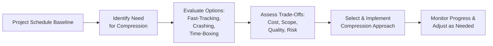

## 18.3 Schedule Compression and Agile Time-Boxing

Schedule compression and agile time-boxing are two complementary strategies used to accelerate project timelines or maintain strict iterations while balancing overall project constraints. As introduced in earlier sections of Chapter 18, a strong schedule management plan connects your defined scope (Chapter 17) and cost management (Chapter 19) with practical techniques to ensure timely delivery of project outcomes. In this section, we delve deeper into schedule compression methods—such as crashing and fast-tracking—and explore how agile time-boxing complements these techniques. You will learn when, why, and how to deploy these tools to finish projects faster, respond to late-breaking changes, or crisply structure iterative sprints.

### The Rationale for Schedule Compression and Time-Boxing

Regardless of industry or project type, most project managers have encountered a situation where stakeholders suddenly request (or demand) an accelerated finish date. Sometimes a competitor’s product launch date is moved up, or a critical marketing event is rescheduled, or budgetary cycles impose stricter deadlines. While many project managers may default to working longer hours or “just pushing” the team, these typical approaches can lead to burnout, lower morale, and reduced quality. Proper schedule compression techniques help you systematically evaluate the possibilities and associated risks of accelerating the project schedule without jeopardizing other success factors (e.g., scope, quality, cost).

Agile time-boxing adds another dimension to scheduling: Instead of continuing work until “it’s done,” agile teams constrain tasks (or “user stories”) to fixed intervals called sprints or iterations. For instance, a two-week sprint sets a rigid boundary: the work must be completed within that timeframe, or it is carried over (or re-planned) to the next sprint. This structure focuses teams on value delivery, encourages continuous feedback, and can be combined with traditional scheduling for hybrid project approaches (see Chapter 27 on Hybrid Approaches).

### Common Techniques for Schedule Compression

Below are two primary methods for accelerating project schedules in traditional, predictive project management.

#### Fast-Tracking
Fast-tracking is the technique of performing activities in parallel that would normally be done in sequence. For example, rather than waiting for design documentation to be fully signed off before starting development, you might overlap part of the design phase with initial development tasks if they have partial dependencies. The potential benefits of fast-tracking include:

- Reduced overall timeline by overlapping tasks.
- Earlier feedback loops for downstream tasks (e.g., developers identifying design issues sooner).
- Faster initial delivery of partial functionality for demonstration or test.

Downsides and risks to consider:
- Increased risk of rework if certain tasks must be redone because of incomplete or changing upstream deliverables.
- Potential confusion or resource conflict if teams do not have sufficient guidelines on concurrency and hand-offs.
- Higher coordination overhead and complexity in change management (see Chapter 15 on Integration Management and Chapter 16 on Stakeholder and Communications Management for maintaining clarity).

Fast-tracking is sometimes the first choice for schedule compression because it typically involves fewer direct cost implications than crashing. However, it can significantly raise the probability of issues arising from partial or incomplete task inputs.

#### Crashing
Crashing shortens the schedule by allocating additional resources to duration-critical tasks, thereby reducing the total time required to complete them. For instance, if developing a new software feature usually requires four developers over four weeks, you might add two more developers to attempt to finish in three weeks or less. Crashing is usually achieved by:

- Increasing resource levels (e.g., hiring more staff or scheduling overtime).
- Paying for experts or specialized tools to speed up certain tasks.
- Allocating additional budget for training or technology solutions that shorten task duration.

Downsides and risks to consider:
- Increased costs due to the added resources, overtime, or specialized experts.
- Diminishing returns if the tasks cannot be sped up beyond certain thresholds (e.g., “Brook’s Law” in software projects: adding more developers does not linearly reduce coding time because of additional onboarding and coordination needs).
- Lower morale if overused or if it results in ongoing overtime demands on the team.

In practice, many project managers first evaluate whether fast-tracking is feasible (less direct impact on cost) before opting to crash the schedule. Often, an effective compression strategy uses both in tandem, supported by thorough risk analysis (see Chapter 22 on Risk and Uncertainty Management).

### Agile Time-Boxing Fundamentals

Agile time-boxing is a scheduling mechanism used in iterative, incremental, or hybrid methodologies. By strictly limiting the duration within which a set of tasks must be completed, teams can focus on delivering value in short cycles. Common examples of time-boxing include:

• Sprints in Scrum: Typically 1–4 weeks. The team commits to meet a Sprint Goal by the end of each increment.  
• Iterations in Kanban or another agile framework: The focus is on limiting work in progress (WIP), though some teams enforce time-boxed cycles for planning or review.  
• Time-boxed experiments in Lean approaches: Teams set a fixed time limit to test an idea or prototype, gather data, and pivot as needed.

Many teams find that time-boxing fosters discipline, predictability, and more manageable increments of work. By placing boundaries on tasks, agile or hybrid teams avoid indefinite scope creep because they are forced to re-prioritize features that cannot be completed within a sprint. In essence, time-boxing helps reduce “task bloat” and encourages frequent feedback loops, accelerating learning.

#### Benefits of Time-Boxing
- Increased team focus and motivation due to clear short-term goals.  
- Predictable cadence for stakeholders to see prototypes or incremental deliverables.  
- Enhanced risk management because each sprint/iteration can absorb feedback and pivot quickly.  
- Faster detection and resolution of issues since tasks are explicitly sized for short cycles.

#### Challenges of Time-Boxing
- Underestimating or overestimating user stories or tasks can cause scope imbalance within a sprint.  
- Teams may feel pressured to cut corners if sprints are tightly packed with tasks that exceed capacity.  
- Requires rigorous backlog prioritization (see Chapter 26 on Key Agile Events and Artifacts).

### Evaluating Trade-Offs for Schedule Compression

Before committing to any compression method, carefully examine how acceleration impacts your project’s “iron triangle”: scope, schedule, and cost. The triple constraint indicates that changes in one dimension often force trade-offs in others. Consider these questions:

• Will features or deliverables need to be removed (scope reduction) to meet the new schedule?  
• Do we have a sufficient contingency budget to support added labor or specialized tools (crashing)?  
• What are the impacts on project risk exposure or quality?  
• Are we prepared for increased stakeholder communication overhead if we fast-track tasks?

In agile settings, time-boxing is less about “one-off” compression and more about consistent iteration-based delivery. Nonetheless, you still need to confirm that the required features fit within each sprint or iteration. If your backlog has major dependencies, re-sequencing or partial fast-tracking might be necessary to keep the iteration schedule on track.

### Integrating Agile Time-Boxes with Traditional Compression Techniques

Hybrid environments often use agile time-boxed sprints for key deliverables while employing schedule compression on segments that remain predictive. For instance, a construction project could adopt a highly structured, predictive schedule for engineering design and physical building tasks, while using agile time-boxing for interior design mock-ups or specialized vendor sub-projects that can be iterated in short cycles.

In addition to overlapping tasks (fast-tracking) or adding resources (crashing), a hybrid approach might iterate design or feedback loops for specific parts of the project. This strategy can reduce rework on areas prone to changing stakeholder preferences—common in creative or tech-centric work—while still adhering to a compressed overall schedule. Many organizations find this combination valuable because it integrates rigorous up-front planning where needed and flexible short-cycle feedback loops for elements destined to evolve.

### Tools, Techniques, and Visual Aids

Maintaining clarity around compressed schedules or time-boxed features is significantly enhanced by robust visualization. Below is an example Mermaid.js diagram illustrating a high-level decision flow for schedule compression and agile time-boxing:

In practical day-to-day project management, you can use:
- Gantt charts with overlapping bars to illustrate fast-tracking.  
- Resource histogram or a resource usage view to highlight extra resources allocated for crashing.  
- Burndown or burnup charts for time-boxed sprints (Chapter 26 and Chapter 13 discuss these metrics).  
- Kanban boards to track sprint tasks and visualize WIP.  

Combining these visual elements in a project management information system (PMIS) or a simple spreadsheet ensures that you stay on top of your compressed schedule or agile iteration timeline.

### Real-World Example: Network Infrastructure Upgrade

Consider a mid-size technology firm upgrading its corporate network to improve remote collaboration. The migration is scheduled for six months, aligned with a new product launch. Two months into the project, a competitor announces a similar service set to launch in four months. Executive leadership requests the network upgrade be completed at least a month earlier so that marketing can coordinate demonstrations ahead of the competitor’s event.

1. The project manager identifies the critical path (Chapter 18.2) and finds several tasks arranged sequentially (site surveys, vendor negotiations, equipment installation, final testing).  
2. She decides to fast-track the vendor negotiation and equipment installation tasks: the team sends multiple engineers to the vendor’s site to speed up joint planning. Some configuration tasks start in parallel with vendor contract drafting. This approach, however, carries a risk that if the vendor changes certain contract terms, rework or scheduling conflicts may occur.  
3. To further compress the schedule, the project manager crashes the final testing phase by adding two extra test engineers to run parallel tests on different systems, significantly reducing the total test duration.  
4. Meanwhile, the project’s software development sub-team works in two-week sprints, employing backlogs to prioritize user-facing features needed for the new network environment. This ensures that configuration modules are ready for demonstration to stakeholders at the end of each sprint.  

In this scenario, strategic schedule compression (fast-tracking and crashing) on the predictive tasks has shortened the overall timeline by approximately three weeks. The agile time-boxing used by the software sub-team also ensures rapid iteration on features, providing early proof-of-concept demos to reassure stakeholders and leadership that the schedule acceleration is viable.

### Common Pitfalls and Ways to Avoid Them

• Over-Committing Resources: While crashing can reduce timelines, it easily leads to staff burnout or inflated project budgets. Mitigate this by carefully monitoring resource utilization through tools like resource histograms.  
• Neglecting Risk Assessment: Both crashing and fast-tracking alter risk profiles. For example, fast-tracking can raise integration problems, while crashing may introduce higher costs if integrated resources are not fully qualified. Use risk registers (see Chapter 22) to capture and manage these uncertainties.  
• Blurring Dependencies: Overlapping tasks prematurely without ensuring stable upstream deliverables can lead to rework and cost overruns. Always track critical dependencies clearly—in Gantt charts, Kanban boards, or integrated PMIS solutions.  
• Lack of Stakeholder Buy-In: Attempting schedule compression without aligning stakeholder expectations can create friction and confusion. Communicate these changes early and often (Chapter 16 on Stakeholder and Communications Management).  
• Rushing Agile Ceremonies: When time-boxing is misapplied (e.g., over-stuffing sprints to “speed things up”), teams lose the benefit of iterative value delivery and may produce poor-quality increments. Combining time-boxing with robust backlog grooming ensures sprints remain feasible.  

### Best Practices for Successful Schedule Compression

1. **Frequent Checkpoints**: Whether you are fast-tracking, crashing, or using agile sprints, schedule frequent reviews to ensure the new approach remains viable.  
2. **Tailored Approach**: Choose a method that fits your project’s nature. For example, a stable but lengthy set of tasks might benefit from crashing, whereas a project with volatile requirements might see more benefit in time-boxed iterations.  
3. **Leverage Cross-Functional Teams**: Compressing schedules often requires subject-matter experts (SMEs) or specialized skill sets. Agile time-boxing thrives when teams are cross-functional, reducing hand-off delays.  
4. **Clear Documentation and Communication**: Outline changes in the schedule baseline, resource needs, revised costs, and associated risks. This helps keep sponsors, team members, and stakeholders aligned.  
5. **Balance Quality**: Keep in mind that acceleration must not erode quality. Obtain frequent feedback from key users or testers—especially if you are combining time-boxed agile sprints with a compressed waterfall timeline.

### Concluding Thoughts

Schedule compression and agile time-boxing are indispensable techniques in modern project management, allowing teams to accelerate delivery and respond quickly to new challenges. When skillfully executed, these methods can help you meet or beat pressing deadlines without sacrificing essential quality. However, both require disciplined planning, risk management, and stakeholder communication to avoid the pitfalls. By integrating the power of compression (fast-tracking and crashing) with the iterative discipline of agile time-boxing, you can deliver projects faster, maintain alignment with evolving business goals, and sustain team morale in high-pressure environments.

Framing the entire approach within your project’s context—considering risk (Chapter 22), cost trade-offs (Chapter 19), communication needs (Chapter 16), and potential innovations in your delivery approach (Chapter 24 and Chapter 25 on Agile Foundations and Frameworks)—is key to successful schedule management.

---

## Accelerate Your Project Timeline: Schedule Compression & Time-Boxing Quiz



### Which statement best describes fast-tracking as a schedule compression technique?

- [ ] It involves adding extra resources to shorten certain activities.
- [x] It involves performing activities in parallel that would normally be done in sequence.
- [ ] It requires pre-determining user stories for each iteration.
- [ ] It has no effect on project risk or rework.

> **Explanation:** Fast-tracking compresses the overall schedule by overlapping tasks that were originally planned sequentially. This can increase the risk of rework if upstream deliverables change.

### What is a primary disadvantage of crashing a schedule?

- [ ] Delayed start times for all tasks.
- [ ] Zero impact on resource utilization.
- [x] Increased project costs due to additional resources or overtime.
- [ ] Simplified resource management.

> **Explanation:** Crashing can often require more personnel, overtime, or specialized equipment, which increases costs and requires careful resource coordination.

### In agile projects, what is the main purpose of a time-box?

- [ ] To expand the duration of tasks when requirements are unclear.
- [x] To set a fixed period within which tasks must be completed, thereby encouraging focus and iterative delivery.
- [ ] To replace the risk register with a backlog of user stories.
- [ ] To eliminate all constraints on team activities.

> **Explanation:** Agile teams use time-boxed iterations (sprints) to deliver a set of prioritized tasks within a strict, short timeframe. This fosters discipline, iterative progress, and continuous feedback.

### Which of the following is a key pitfall when overlapping tasks (fast-tracking)?

- [ ] Reduced probability of detecting errors early.
- [x] Higher potential for rework if the earlier task changes or is incomplete.
- [ ] Lower coordination overhead among teams.
- [ ] Inability to adjust resources during execution.

> **Explanation:** Fast-tracking inherently runs the risk of rework because later tasks depend on partially finished or evolving deliverables when tasks overlap in the schedule.

### When might a project benefit more from time-boxing rather than from crashing?

- [x] When the project scope is evolving, and incremental feedback is crucial.
- [ ] When an overhead budget for additional resources is readily available.
- [x] When short, frequent deliveries offer better stakeholder visibility.
- [ ] When no dependencies exist between tasks in the Gantt chart.

> **Explanation:** Agile time-boxing is especially valuable when frequent feedback and iterative value delivery are paramount, or requirements may shift. It promotes adaptability and stakeholder engagement.

### What should a project manager do first upon learning a major deadline has been moved up?

- [x] Conduct an impact assessment to formally analyze the schedule, cost, and scope implications.
- [ ] Immediately assign overtime to all team members.
- [ ] Cancel all non-critical path tasks outright.
- [ ] Assume that agile time-boxing alone will fix schedule issues.

> **Explanation:** The very first step should be evaluating the schedule and resource impacts of the new deadline, clarifying potential trade-offs before deciding on compression methods.

### Which factor commonly limits the effectiveness of crashing?

- [x] Diminishing returns when adding more people to a task that cannot be subdivided effectively.
- [ ] The complete absence of concurrency in tasks.
- [x] Risks related to unqualified or untrained added resources.
- [ ] Guaranteed improvement in team morale.

> **Explanation:** Crashing tasks by increasing resources does not always yield proportional time savings, often reaching a point of diminishing returns. Also, newly added people can slow progress if they lack training.

### How do agile time-boxed sprints help address scope creep?

- [x] Sprints fix a short-duration boundary, forcing re-prioritization of tasks.
- [ ] Sprints remove the need for a formally written change control process.
- [ ] Teams ignore user feedback until the final sprint.
- [ ] Sprints remove any requirements for documentation or gating processes.

> **Explanation:** Because sprints have a strict time boundary, new or evolving requirements often get moved to subsequent sprints or re-prioritized. This prevents uncontrolled expansion of scope within a single iteration.

### Why is stakeholder buy-in particularly critical when implementing schedule compression?

- [x] Stakeholders may need to approve changes in scope, cost, or quality linked to the accelerated schedule.
- [ ] Stakeholder alignment is less important for schedule compression.
- [ ] Stakeholders rarely affect resource availability.
- [ ] It ensures guaranteed cost savings without analysis.

> **Explanation:** Schedule compression often demands reallocation of resources, trade-offs in features, or acceptance of higher costs. Stakeholder buy-in ensures alignment on these critical decisions.

### True or False: Fast-tracking should always be attempted before crashing to avoid increasing costs.

- [x] True
- [ ] False

> **Explanation:** Fast-tracking, where feasible, tends to be the first approach because it overlaps existing tasks rather than adding resources (which can raise costs). If fast-tracking is not enough, then crashing becomes a logical next step.



---

## PMP Mastery: 1500+ Hard Mock Exams with Full Explanations

Looking to crush the PMP exam with confidence? Dive deep into 6 rigorous mock exams totaling 1500+ advanced-level questions, each accompanied by clear, step-by-step explanations. Hone your test-taking strategies, master complex topics, and build the resilience you need on exam day. Perfect for serious PMs aiming beyond fundamentals.

Enroll now:  
[PMP Mastery: 1500+ Hard Mock Exams with Exceptional Clarity & Full Explanations](https://www.udemy.com/course/pmp-2025/?referralCode=CF83A54BC86BE27F9AFE)

_Disclaimer: This course is not endorsed by or affiliated with the PMI examination authority. All content is provided purely for educational and preparatory purposes._
