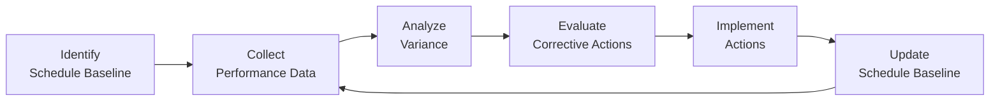

## 18.4 Controlling the Schedule

Controlling the schedule is a cornerstone of effective project management, ensuring that actual progress aligns with the baseline plan. It involves continuous monitoring of project activities, forecasting potential delays, and implementing corrective or preventive actions. Effective schedule control helps avoid missed deadlines, budget overruns, and stakeholder dissatisfaction. It involves a balance of technical skills (like Earned Value Management and schedule compression techniques) and soft skills (like communication and negotiation). This section covers fundamental and advanced approaches to measure schedule performance, detect variances early, and guide the project team back on track when needed.

Controlling the schedule is closely tied to many chapters in this guide. Refer to Chapter 10 (Planning Performance Domain) to see how planning sets the foundation for control, and Chapter 13 (Measurement Performance Domain) for deeper insight on metrics and reporting. Both chapters inform the techniques and methods you’ll discover below.

---

Monitoring the project’s progress is akin to navigating a ship across the ocean. Charts (plans), navigational instruments (tools), and constant vigilance (monitoring and controlling) are crucial. If steering goes off by just a few degrees, you might find yourself hundreds of miles off course by journey’s end. Schedule control ensures these “course corrections” happen frequently enough to hit your target on time.

## Purpose and Core Elements of Schedule Control

The purpose of schedule control is to compare actual project performance against the planned baseline and make timely changes. Its core elements include:

• Measuring Actual Progress: Gathering data on how much work has been completed, by whom, and in what timeframe.  
• Forecasting Future Performance: Modeling how schedule trends might continue and estimating completion dates if no corrective measures are taken.  
• Responding to Variances: Adjusting resources, scope, or activities to correct deviations.  
• Communicating Status and Changes: Keeping stakeholders informed through timely updates.

Schedule control also ties back into risk management (see Chapter 22: Risk and Uncertainty Management (Revisited)). When issues arise (e.g., critical resource shortages), controlling the schedule involves risk responses, such as deploying additional resources or re-sequencing activities.

## Inputs to Schedule Control

Before you can control your schedule, take stock of inputs that will guide decision-making. Common inputs include:

• Project Management Plan and Schedule Baseline: Often established during planning processes, they capture intended start and finish dates, milestones, and critical path details.  
• Work Performance Data and Reports: Real-time or periodic updates on how tasks are progressing, hours charged, deliverables completed, and potential issues.  
• Time-Tracking Tools and Systems: Tools like timesheets or automated software logs help provide accurate data on resource usage and activity durations.  
• Risk Register and Issue Log: Potential risks or issues might cause schedule slippage; controlling the schedule means you proactively track and respond to them.  
• Resource Calendars: Availability of staff, equipment, or stakeholders can significantly impact schedule changes. Ensure your schedule control takes into account updated resource calendars.

## Techniques and Methods to Control the Schedule

Controlling the schedule requires both quantitative and qualitative methods. You will find that combining multiple techniques provides a well-rounded picture of where your project stands.

### Trend Analysis

Trend analysis looks at performance data over time—like velocity in agile or actual versus planned schedules in predictive environments—to detect emerging patterns. It answers questions like: “Are we consistently completing fewer tasks than planned in each iteration?” or “Are activities taking 15% longer than originally estimated?”

If the trend reveals that tasks routinely exceed estimates, the schedule baseline may need adjustment, or you might need a more rigorous approach to estimation, such as rolling wave planning.

### Earned Value Management (EVM)

EVM is a staple in many project environments for measuring and controlling cost and schedule performance together. Key metrics include:

• Planned Value (PV): The authorized budget for scheduled work.  
• Earned Value (EV): The measure of work performed expressed in terms of the budget authorized.  
• Actual Cost (AC): The realized cost incurred for the work performed.

Derived formulae (see Chapter 37: Mastering Key Formulas and Calculations for deeper coverage) are instrumental in schedule control:

• Schedule Variance (SV) = EV − PV  
    – SV < 0 indicates you’re behind schedule.  
    – SV > 0 indicates you’re ahead of schedule.  

• Schedule Performance Index (SPI) = EV ÷ PV  
    – SPI < 1.0 indicates a potential schedule slippage.  
    – SPI > 1.0 indicates you’re performing better than planned.

These indicators help you detect schedule erosion early. By taking frequent measurements, you can re-plan or “crash” activities before a minor delay escalates.

### Critical Path Method (CPM) Review

The Critical Path Method is especially helpful in predictive project environments. Maintaining regular reviews of the critical path ensures that tasks with no float (or negative float) receive the necessary attention:

• Identify activities on the critical path (these have zero float in the baseline).  
• Re-check durations and dependencies.  
• Evaluate potential re-sequencing to reduce overall timeline if early warning signs appear.

If you notice the critical path lengthening due to a single delayed activity, expedite that task or parse it out into smaller tasks that are easier to manage.

### Schedule Compression Techniques

Two common compression techniques are often leveraged for short-term recovery within controlling processes:

• Fast Tracking: Performing activities in parallel that were originally scheduled sequentially. Although it can save time, it may introduce added risk, such as overlaps causing rework.  
• Crashing: Adding resources or overtime to accelerate activities. While effective, it can dramatically increase costs and should be scrutinized carefully for economic viability.

### Rolling Wave Planning and Progressive Elaboration

In dynamic environments, controlling the schedule might be more about adjusting near-term tasks based on real-time feedback. Rolling wave planning allows you to define work in greater detail as the project evolves and more information becomes available.

### Resource Optimization

Resource availability and productivity are pivotal to maintaining the schedule. Techniques like resource leveling (adjusting start and finish dates based on resource constraints) or resource smoothing (adjusting activities so resource limits aren’t exceeded) are vital to ensuring you don’t overshoot your capacity. However, leveling can lengthen the overall schedule if resources are scarce. Monitor the schedule carefully once leveling or smoothing is implemented.

### Time-Boxing and Velocity Tracking for Agile Teams

In agile frameworks, controlling the schedule is often about meeting time-boxed sprints or iterations. Key metrics include:

• Velocity: The average story points (or similar measure) completed per sprint.  
• Burn-Down and Burn-Up Charts: Visual representations showing work completed versus total planned work.

If velocity is lower than anticipated, or burn-down charts reveal a slower-than-required pace, the team might need to reduce scope, re-prioritize the backlog, or identify impediments.

### Schedule Forecasting

Forecasting is about predicting end dates if current performance remains unchanged. Methods range from simple linear regressions to more advanced analysis that accounts for complexity and risk:

• Estimate at Completion (EAC) for Schedule: In many EVM environments, you can forecast completion dates by extrapolating performance indices.  
• Scenario Planning: Considering best-case, worst-case, and most-likely scenarios.  
• Monte Carlo Simulations: Using probability distributions to gauge the likelihood of completing project tasks by certain dates.

By identifying the earliest sign of a slippage, these forecasts enable timely decisions, from reassigning resources to negotiating scope reductions.

---

## Common Pitfalls and Challenges

While controlling the schedule is a fundamental project responsibility, it comes with its share of obstacles:

• Overemphasis on Single Metrics: Focusing solely on SPI might ignore potential cost overruns or quality issues. Balance schedule metrics with cost, risk, and quality indicators.  
• Resistance to Transparency: Team members may be reluctant to report delays promptly, fearing blame. Foster an environment of trust to encourage early detection.  
• Unrealistic Accelerations: In attempts to correct minor slippages, teams may commit to further unrealistic deadlines. This can create a vicious cycle of schedule compression.  
• Mismanaged Dependencies: In multi-team or multi-vendor projects, dependencies can cause chain reactions. Overlooking them when making changes can exacerbate delays.

Being aware of these pitfalls helps you design processes to mitigate or avoid them altogether.

## Best Practices for Effective Schedule Control

• Regular Communication: Frequent stakeholder updates ensure that everyone understands the current status, ramifications of any slippage, and the rationale behind schedule adjustments.  
• Integrated Change Control: Coordinate schedule changes with scope, cost, and risk updates to maintain an integrated plan (see Chapter 15: Integration Management).  
• Tailored Control Intervals: Set control intervals that match the pace of your project. A two-week review cycle might be appropriate for a fast-moving IT project, while a monthly review may suffice for a multi-year construction project.  
• Historical Data Usage: Leverage lessons learned and historical data from previous projects or phases within the same project. These insights can refine estimates and inform more effective adjustments.  
• Empowered Decision-Making: Facilitate quick decision-making for re-allocating resources or re-sequencing tasks. Avoid bureaucratic bottle-necks that limit responsiveness.

---

## Real-World Illustrations

Below are two case studies showcasing how organizations apply schedule control in practice.

### Case Study: Construction Project

A construction firm was building a multi-story office complex. Halfway through, the project manager discovered that local permitting processes would take longer than planned. By forecasting the impact and recalculating the critical path, the project manager saw that a four-week delay on obtaining permits could translate to a two-month overall project extension if left unchecked. Fast tracking was implemented for some interior works that were previously scheduled linearly. Although this introduced additional coordination challenges among teams, it helped offset the delay from the permit. The project finished just two days behind the original finish date—an acceptable variance, given the circumstances.

### Case Study: Software Development Project

An agile software team discovered they consistently overcommitted user stories per sprint, completing only about 70% of planned work. After analyzing velocity trends, they adopted more realistic sprint commitments. Additionally, they utilized a burn-down chart daily to communicate the sprint’s progress. Mid-sprint adjustments (reallocating tasks to underutilized developers and removing lower-priority features) helped the team deliver all critical user stories on time.

---

## Diagram: Schedule Control Flow

Below is a Mermaid diagram outlining a simplified flow of schedule control, from monitoring to taking corrective actions:

Explanation of flow:
- Identify Schedule Baseline: Start with the approved plan for project activities.  
- Collect Performance Data: Gather actual start/finish dates, resource usage, and progress reports.  
- Analyze Variance: Compare actual results to the baseline to see if you’re ahead or behind schedule.  
- Evaluate Corrective Actions: Decide on methods like fast tracking, re-sequencing, or resource optimization.  
- Implement Actions: Make changes to tasks, resources, and timelines.  
- Update Schedule Baseline: Reflect these changes in official project documents, re-start the cycle.

---

## Practical Implementation Tips

1. Employ Automated Tools: Tools like Microsoft Project, Oracle Primavera, JIRA (for agile), or others can generate real-time variance reports.  
2. Establish Thresholds: Define tolerance limits for variance. For instance, if a task is >10% late, alert the schedule control board immediately.  
3. Involve the Team: Encourage the project team to surface issues early, maintaining transparency related to tasks they own.  
4. Keep Stakeholders in the Loop: Provide concise dashboards or summary reports so decision-makers can quickly respond to schedule risks or issues.

---

## Further References for In-Depth Study

• PMI’s PMBOK® Guide, Seventh Edition – Focus on Measurement and Predictive/Adaptive approaches.  
• PMI’s Practice Standard for Scheduling – Expanded scheduling practices and specialized tools.  
• The Agile Practice Guide – Guidance for controlling schedule in agile and hybrid environments.  
• Kerzner, H. (2019). Project Management: A Systems Approach to Planning, Scheduling, and Controlling.  
• Chapter 13 (Measurement Performance Domain) – Additional metrics and measurement strategies.  

Controlling the schedule is a dynamic, continuous process. By rigorously measuring performance, analyzing data, and making informed adjustments, you keep your project in line with business objectives and stakeholder expectations.

---

## Schedule Control Knowledge Check

Below is a quiz to test your understanding of the tools, strategies, and pitfalls of controlling the schedule.

## Ensure On-Time Delivery: Schedule Control Mastery



### Which of the following best describes the purpose of controlling the schedule in a project?

- [ ] To finalize the project’s critical path without any changes.  
- [x] To compare actual performance against the schedule baseline and execute corrective actions.  
- [ ] To prevent stakeholders from seeing potential schedule slippage until project closing.  
- [ ] To ignore minor slippages and focus only on cost control.  

> **Explanation:** Controlling the schedule means regularly monitoring performance against the baseline and making adjustments to ensure on-time completion. It does not mean ignoring slippages or withholding information from stakeholders.

### Which metric compares earned value (EV) to planned value (PV) when assessing schedule performance?

- [ ] Cost Performance Index (CPI)  
- [x] Schedule Performance Index (SPI)  
- [ ] Estimate at Completion (EAC)  
- [ ] Actual Cost (AC)  

> **Explanation:** SPI = EV ÷ PV. It is used to gauge whether you are ahead or behind schedule.

### In agile projects, which artifact is most commonly used to visualize and track ongoing progress toward completion?

- [ ] Requirements Traceability Matrix  
- [ ] Charter Document  
- [x] Burn-Down Chart  
- [ ] RACIQ Model  

> **Explanation:** Burn-down charts show remaining work over time and are a staple tool to track progress in agile iterations or sprints.

### Which of the following schedule compression techniques is likely to increase overall project risk by overlapping tasks that were initially planned sequentially?

- [ ] Crashing  
- [x] Fast Tracking  
- [ ] Rolling Wave Planning  
- [ ] Concurrent Engineering  

> **Explanation:** Fast tracking means running activities in parallel, which introduces potential rework and higher risk.

### Which of the following helps a project manager predict end-date scenarios using probability distributions?

- [x] Monte Carlo Simulation  
- [ ] Earned Value Management  
- [x] Scenario Planning  
- [ ] Benchmarking  

> **Explanation:** Monte Carlo Simulation uses statistical techniques to run multiple “what if” scenarios, while scenario planning can consider different best, likely, and worst cases.

### When performing resource leveling, what is one potential downside?

- [x] The total project duration may increase.  
- [ ] Costs always become lower due to shared resources.  
- [ ] Stakeholder communication requirements decrease.  
- [ ] Scope must be redefined.  

> **Explanation:** Resource leveling may push the schedule out if you need to respect resource limits, potentially extending total duration.

### What is a major pitfall of focusing solely on a single metric, such as SPI, in schedule control?

- [x] Potential neglect of other project constraints like cost and quality  
- [ ] Real-time updates are easier to manage  
- [x] Stronger stakeholder relationships  
- [ ] Guaranteed schedule improvements  

> **Explanation:** Over-reliance on SPI can mask other issues, like cost overruns or quality problems.

### Which of the following is an example of a leading indicator for schedule performance?

- [x] Tracking daily completion rates for tasks scheduled to finish in the current week  
- [ ] Calculating Actual Cost (AC)  
- [ ] Collecting final deliverables after project closure  
- [ ] Preparing final lessons learned report  

> **Explanation:** Leading indicators measure actions or progress that affect future outcomes. Tracking daily task completion is a proactive way to see if you are on track to meet immediate targets.

### Which approach is best when the project manager repeatedly sees tasks taking 20% longer than initially estimated?

- [x] Update future estimates with new data from performance information  
- [ ] Continue with the same estimates but work additional overtime  
- [ ] Ignore the variance if the SPI is still above 1.0  
- [ ] Immediately crash every future activity  

> **Explanation:** Updating estimates with actual performance data allows more accurate forecasting and prevents unrealistic plans.

### A project had a planned schedule duration of 12 months. Six months into the project, the SPI is 0.6. What does this most likely indicate?

- [x] The project is significantly behind schedule.  
- [ ] The project is ahead of schedule but behind on cost.  
- [ ] The project is exactly on schedule.  
- [ ] The project needs no corrections until the 10th month.  

> **Explanation:** An SPI of 0.6 means only 60% of planned work has been completed relative to the approved baseline at this point, indicating a notable delay.



---

## PMP Mastery: 1500+ Hard Mock Exams with Full Explanations 

Looking to crush the PMP exam with confidence? Dive deep into 6 rigorous mock exams totaling 1500+ advanced-level questions, each accompanied by clear, step-by-step explanations. Hone your test-taking strategies, master complex topics, and build the resilience you need on exam day. Perfect for serious PMs aiming beyond fundamentals.  

Enroll now:  
[PMP Mastery: 1500+ Hard Mock Exams with Exceptional Clarity & Full Explanations](https://www.udemy.com/course/pmp-2025/?referralCode=CF83A54BC86BE27F9AFE)

_Disclaimer: This course is not endorsed by or affiliated with the PMI examination authority. All content is provided purely for educational and preparatory purposes._
