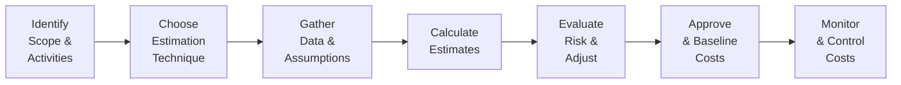

## 19.1 Cost Estimation Techniques and Budgeting

Cost estimation is the cornerstone of effective project financial management. Whether you are developing a small in-house application or orchestrating a multi-year infrastructure project, the accuracy and reliability of your cost estimates directly influence decision-making, stakeholder trust, and project success. This section explores key estimation techniques—ratio (analogous), parametric, and three-point estimating—and then unpacks the critical process of budget allocation. You will gain an understanding of theoretical approaches, real-world considerations, and the best practices that bridge the gap between planning and execution.

Cost estimation is also tightly interwoven with risk management, scheduling, and scope management. A robust estimate must account for uncertainties and support flexible adaptation as the project evolves. By mastering these techniques, you will be better equipped to develop realistic project budgets, align project financials with organizational strategy, and secure stakeholder confidence.

---

### Importance of Accurate Cost Estimates

A well-founded cost estimate is more than a guess—it's a structured forecast grounded in data and informed assumptions. Key benefits include:

- Enhanced Stakeholder Confidence: Accurate estimates foster trust and transparency.  
- Better Decision-Making: Leadership teams rely on cost data to weigh project viability and prioritization.  
- Risk Mitigation: Realistic estimates minimize the chance of budget overruns and can alert the team to cost-related threats.  
- Resource Optimization: Proper estimation helps in allocating resources efficiently, ensuring neither shortages nor excessive idle capacity.

In the Seventh Edition of PMI’s PMBOK® Guide, cost management is viewed within the broader context of organizational value delivery. The approach focuses on principles, performance domains, and tailoring, further emphasizing the importance of practicality and adaptability in estimating processes.

---

### Foundational Concepts

Before diving into specific estimation methods, it is useful to clarify a few foundational concepts that shape cost management:

• Direct vs. Indirect Costs  
  – Direct costs are directly attributable to project deliverables (e.g., labor, materials for building a product).  
  – Indirect costs represent overhead or shared expenses that are not strictly linked to one project (e.g., office rent, insurance).  

• Contingency vs. Management Reserves  
  – Contingency Reserve: Funds set aside for identified risks (known unknowns).  
  – Management Reserve: Funds set aside to address unforeseen risks (unknown unknowns) and allocated at higher organizational levels.  

• Cost Baseline vs. Budget  
  – Cost Baseline: Authorized, time-phased funding requirement that includes contingency reserves.  
  – Total Budget: Cost baseline plus management reserves.  

• Rolling Wave Planning  
  – An iterative approach that refines cost estimates as more information becomes available. This method is especially common in agile or hybrid environments.

Understanding these commonly used terms lays the groundwork for applying the estimation techniques in alignment with organizational practices and PMI standards.

---

### Key Cost Estimation Techniques

Although numerous cost estimation methods exist, ratio (analogous), parametric, and three-point estimating are among the most common. Each approach carries distinct advantages, limitations, and contexts in which it is most effective.

#### Ratio (Analogous) Estimating

Ratio estimating—often called analogous estimating—relies on historical data from similar projects or deliverables. If the organization has previously executed a comparable initiative, you can use lessons learned and data from that earlier project to estimate costs for a new one.

**Key Features**  
- Draws on expertise and historical data.  
- Provides a quick, high-level approximation.  
- Works best when the projects share strong similarities in requirements, scope, and complexity.  

**Advantages**  
- Speed: It is one of the fastest ways to produce a cost estimate, making it particularly useful in early stages.  
- Minimal Data Requirements: You only need accurate information from a similar project to form a baseline.  

**Limitations**  
- Potential Inaccuracies: If the chosen historical project differs significantly from the new one, the estimate can be unreliable.  
- Oversimplification: May overlook unique, context-specific complexities.

**Example**  
Imagine your organization is developing a series of marketing videos. The last video project cost $50,000 for 5 minutes of final footage. A new project is designing a 10-minute video with similar complexity. You might estimate the new production to cost roughly $100,000 based on a direct extension of historical data.  

---

#### Parametric Estimating

Parametric estimating incorporates statistical models and mathematical relationships to predict project costs. It uses parameters (e.g., cost per unit, cost per line of code, cost per square foot) to build a cost forecast. The accuracy of this approach depends on the relevance and validity of the data used in creating the cost relationship.

**Key Features**  
- Mathematical and data-driven.  
- Continuous refinement as new data emerges.  
- Utilizes cost driver variables (e.g., lines of code, weight, length, volume).

**Advantages**  
- Very Reliable for Repetitive Tasks: Accuracy improves when you have well-established parametric models for work that is performed frequently.  
- Scalable: You can adjust parameters easily for different project sizes and complexities.

**Limitations**  
- Requires Quality Historical Data: Inaccurate or outdated input metrics lead to flawed estimates.  
- Complex to Develop: Building a robust parametric model can be time-consuming and requires specialized expertise.

**Example**  
A construction company uses a cost estimation model of $500 per square meter for building a simple storage facility. If the new facility is 1,000 square meters, the initial estimate is $500,000. As the design evolves, factors like special materials or advanced HVAC systems might adjust the parameter from $500 to $550 per square meter, revising the estimated cost to $550,000.

---

#### Three-Point Estimating

Three-point estimating addresses uncertainty by accounting for optimistic, pessimistic, and most likely scenarios. Rather than relying on a single data point, you establish a range and then calculate a weighted average.

Usually formulated as:
  
E = (O + 4M + P) / 6  

Where:  
• E is the estimate  
• O is the optimistic estimate  
• M is the most likely estimate  
• P is the pessimistic estimate  

This formula is a simplified version of the PERT (Program Evaluation and Review Technique) approach, which aims to reduce the skewing effect of single-point assumptions.

**Key Features**  
- Incorporates risk and variability directly into the estimate.  
- Generates a range (and optionally a standard deviation) for sensitivity analysis.  

**Advantages**  
- Balances Optimism and Caution: By examining best- and worst-case outcomes, you get a more nuanced perspective of potential costs.  
- Reduces Cognitive Bias: Over-optimism or over-pessimism alone does not dominate the process.

**Limitations**  
- More Time-Consuming: Requires you to derive three estimates for each activity.  
- Data Dependency: The quality of each scenario depends on subject matter expertise and accurate assumptions.  

---

### The Cost Estimation Process Flow

While each technique caters to different project conditions, there is an overarching process you can follow to maintain consistency and rigor. This process is typically aligned with the Cost Management Plan, part of your larger Project Management Plan.

- A["Identify   Scope &   Activities"]: Ensure you have a comprehensive Work Breakdown Structure (WBS) and clarity on the deliverables.  
- B["Choose   Estimation   Technique"]: Select the most suitable estimation method (ratio, parametric, or three-point) based on data availability, project nature, and time constraints.  
- C["Gather   Data &   Assumptions"]: Tap into historical data, expert judgment, and market rates to validate assumptions.  
- D["Calculate   Estimates"]: Perform the necessary calculations and generate initial cost estimates for each component or activity.  
- E["Evaluate   Risk &   Adjust"]: Incorporate risk responses and contingency reserves.  
- F["Approve   & Baseline   Costs"]: Seek project sponsor or management approval for the finalized estimate and cost baseline.  
- G["Monitor   & Control   Costs"]: Review actual spending, track variances, and manage changes during project execution.

---

### Budget Allocation and Cost Baseline

After determining individual estimates, you must aggregate them into a budget that accurately represents the project’s total cost. This involves allocating costs across WBS elements, phases, or performance periods, then establishing a time-phased Cost Baseline. The project budget typically includes:

• Sum of Estimated Costs for All Tasks  
• Contingency Reserves  
• Management Reserves (if applicable)

The time-phased cost baseline is a critical tool for performance measurement. It shows when costs are expected to be incurred, allowing for techniques like Earned Value Management (EVM) to track how the project is performing relative to the plan.

---

### Integrating Risk and Uncertainty

Every estimate bears some level of uncertainty. Incorporating risk management from the start helps ensure that potential overruns are recognized and planned for. For example, you might keep a 10% contingency if your estimates show a moderate level of uncertainty, or as indicated by quantitative risk analysis tools. 

Risk responses—both threats and opportunities—should be reflected in your budget decisions. Overlooking them can lead to significant cost surprises later in the project life cycle, especially when dealing with volatile supply markets or uncertain regulatory environments.

---

### Common Pitfalls and How to Avoid Them

While cost estimation techniques are powerful, several pitfalls can undermine their effectiveness:

• Oversimplification: Relying too much on ratio or analogous data without validating differences in scope.  
• Outdated Data: Using historical information that no longer reflects current labor, currency exchange rates, or technology trends.  
• Ignoring Indirect Costs: Neglecting overhead, taxes, and legal fees can severely underestimate total expenses.  
• Underestimating Risks: Failing to build appropriate contingencies can lead to budget shortfalls.  
• Lack of Stakeholder Input: Missing inputs from key stakeholders fosters incomplete assumptions.

**Best Practices**  
- Adopt a structured review process involving experts from relevant disciplines.  
- Update estimates regularly (rolling wave) to reflect the latest project and environmental data.  
- Use multiple estimation techniques (e.g., parametric and three-point) to cross-check each approach’s results.  
- Remain flexible with budgeting, especially for long-duration or high-uncertainty projects.

---

### Real-World Scenario

Consider an IT organization implementing a new hybrid cloud solution. The project scope includes purchasing new hardware, setting up a virtualization platform, and training the operations team:

1. The project manager starts with a ratio (analogous) estimate based on a similar cloud migration completed last year. This yields a quick snapshot to secure initial project approval.  
2. Once the solution architecture is finalized, parametric models are generated using vendor-based pricing tools (e.g., per virtual machine licensing, cost per terabyte of data storage). The parametric estimate refines the earlier figures and highlights certain tasks (like data migration) that are cost drivers.  
3. Since there is uncertainty about downtime and possible data transfer complications, the team applies a three-point estimate to the training, systems integration, and data migration components. This approach balances optimistic and pessimistic scenarios.  
4. The final step aggregates these estimates into a time-phased budget that includes a 15% contingency for unanticipated complexity. The project sponsor and finance department approve this cost baseline, which then becomes the reference point for all cost monitoring activities.

---

### Templates and Tools

To manage cost estimation and budgeting effectively, many project managers rely on:  

• Cost Estimation Worksheet: A spreadsheet that lists tasks, associated resources, estimation methods used, and final figures.  
• Risk Register Integration: Ties identified risks to potential cost impacts, linking them to contingency reserve calculations.  
• Software Solutions: Tools like Microsoft Project, Primavera P6, or specialized parametric software (e.g., SEER, Costimator) automate cost calculation and scenario analysis.  
• Earned Value Management (EVM) Dashboards: Integrate cost and schedule metrics, offering real-time visibility into cost performance.

---

### References for Further Exploration

• Project Management Institute (PMI). (2021). A Guide to the Project Management Body of Knowledge (PMBOK® Guide) – Seventh Edition.  
• PMI. (2019). Practice Standard for Project Estimating – Second Edition.  
• Government Accountability Office (GAO). (2020). GAO Cost Estimating and Assessment Guide.  
• Humphreys, K.K. (Ed.). (2005). Project and Cost Engineers' Handbook.  
• Carroll, R., & Ostrom, L. (2010). Cost Engineering Analysis.  

By immersing yourself in these references and applying the lessons learned from real-world examples, you can refine your cost estimation approach and become a more adept project manager.

---

## Assess Your Mastery of Cost Estimation and Budgeting



### Which of the following best describes ratio (analogous) estimating?  
- [ ] Using statistical relationships between historical data and variables.  
- [x] Leveraging actual costs from a similar project to estimate a current project.  
- [ ] Calculating risk reserves using multi-point estimates.  
- [ ] Consolidating cost estimates into a time-phased baseline.

> **Explanation:** Ratio (analogous) estimating draws directly on previous project data to inform the new cost estimate, thereby providing a quick and high-level approximation.

### When should you consider using three-point estimating?  
- [x] When you have varying degrees of uncertainty around optimistic, pessimistic, and most likely scenarios.  
- [ ] When you expect no volatility in market conditions.  
- [ ] When no detailed data exists for any previous projects.  
- [ ] When you only want a precise single point estimate.  

> **Explanation:** Three-point estimating is ideal for situations involving uncertainty; collecting optimistic, pessimistic, and most likely inputs helps accommodate variability.

### Parametric estimating is most effective under which of the following conditions?  
- [ ] When no historical data is available.  
- [x] When there is high-quality, quantifiable data and proven cost relationships.  
- [ ] When project complexity makes it impossible to develop formulas.  
- [ ] When only a single cost driver is known.  

> **Explanation:** Parametric estimating relies on established mathematical relationships and trustworthy historical data to predict costs accurately.

### In cost estimation, which statement best describes the difference between contingency and management reserves?  
- [x] Contingency reserves are for identified risks, while management reserves handle unforeseeable risks.  
- [ ] Both funds serve the same purpose and can be used interchangeably.  
- [ ] Contingency reserves require CEO approval, whereas management reserves do not.  
- [ ] Management reserves only apply to direct costs, not indirect costs.  

> **Explanation:** Contingency reserves are allocated for known risks, whereas management reserves buffer against unknown, unpredictable risks.

### Which of the following describes a key limitation of ratio (analogous) estimating?  
- [x] It can oversimplify costs if current and past projects differ significantly.  
- [ ] It requires extensive statistical models to refine estimates.  
- [x] It automatically accounts for new risks that were not present in historical projects.  
- [ ] It cannot be used for early-stage cost approximations.  

> **Explanation:** Analogous estimating has a tendency to oversimplify because it assumes a strong similarity between past and current projects; differences in scope, scale, or technology may lead to inaccuracies.

### What is the main purpose of establishing a time-phased cost baseline?  
- [ ] To ensure that actual costs always exceed planned costs.  
- [x] To identify when and how funds will be expended for monitoring and controlling.  
- [ ] To lock project costs flat across all time periods.  
- [ ] To ensure that contingencies are never used.  

> **Explanation:** A time-phased cost baseline breaks the budget down by specific periods or milestones, enabling effective monitoring and earned value tracking.

### Which of the following statements is TRUE regarding three-point estimates?  
- [x] They help address uncertainty by incorporating optimistic, pessimistic, and most likely outcomes.  
- [ ] They rely exclusively on historical data.  
- [x] They provide only a single figure, making them easy to track.  
- [ ] They omit risk considerations during the estimation process.  

> **Explanation:** Three-point estimating explicitly includes an optimistic and a pessimistic view, which helps the team better understand cost variability.

### Why is risk analysis integral to cost estimation?  
- [ ] Because risk analysis only affects scope decisions, not cost.  
- [x] To account for potential cost overruns and set aside appropriate reserves.  
- [ ] It is unrelated to cost, but good for schedule planning.  
- [ ] To avoid having to use historical data.  

> **Explanation:** Factoring risk into cost estimates ensures that the project can mitigate overruns through contingency or management reserves, thus reducing the likelihood of budget shortfalls.

### Which statement accurately describes the project cost baseline?  
- [ ] It includes the cost baseline plus the management reserves.  
- [x] It represents authorized, time-phased project spending, including contingency but excluding management reserves.  
- [ ] It is identical to the project schedule.  
- [ ] It refers only to the direct costs of a project.  

> **Explanation:** The cost baseline is the approved version of the time-phased project budget, which includes contingency reserves but excludes management reserves.

### A project manager adds a 10% contingency to the budget after analyzing known risks. This best represents:  
- [x] Establishing a contingency reserve.  
- [ ] Including management reserves for unknown factors.  
- [ ] A parametric estimator step.  
- [ ] Executing cost control.  

> **Explanation:** A 10% increase in budget for addressing known risks indicates the use of a contingency reserve, not a management reserve.



---

## PMP Mastery: 1500+ Hard Mock Exams with Full Explanations 

Looking to crush the PMP exam with confidence? Dive deep into 6 rigorous mock exams totaling 1500+ advanced-level questions, each accompanied by clear, step-by-step explanations. Hone your test-taking strategies, master complex topics, and build the resilience you need on exam day. Perfect for serious PMs aiming beyond fundamentals.

Enroll now:  
[PMP Mastery: 1500+ Hard Mock Exams with Exceptional Clarity & Full Explanations](https://www.udemy.com/course/pmp-2025/?referralCode=CF83A54BC86BE27F9AFE)

_Disclaimer: This course is not endorsed by or affiliated with the PMI examination authority. All content is provided purely for educational and preparatory purposes._
