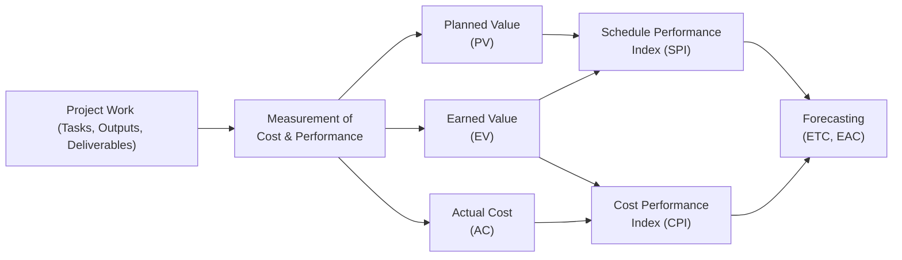

## 19.2 Earned Value Analysis and Forecasting

Earned Value Analysis (EVA)—often referred to as Earned Value Management (EVM)—is a cornerstone technique in project management, especially when you need to monitor and control costs, schedule, and performance simultaneously. By integrating scope, schedule, and cost data, EVM provides a quantitative view of project progress, helping project managers identify variances early and forecast future performance. In this section, we explore the foundational concepts behind EVA, break down essential formulas such as Cost Performance Index (CPI), Schedule Performance Index (SPI), Estimate to Complete (ETC), and Estimate at Completion (EAC), and offer best practices and real-world examples to enhance your project’s financial health.

EVA is central to both predictive (waterfall) and hybrid approaches, and can be adapted for agile contexts that track value delivery. Whether your project is large and complex or relatively straightforward, EVM principles can illuminate precisely how you’re performing. This integration of data transforms raw figures into powerful insights for decision-making.

  
### Overview of Key Concepts

Before diving into formulas, it’s essential to grasp the fundamental metrics and abbreviations used in Earned Value Analysis:

- Planned Value (PV): The authorized budget allocated to the scheduled work at a certain point in time. PV quantifies the amount of budget that should have been spent based on the project plan.  
- Earned Value (EV): The quantified worth of the work actually performed up to a particular date, measured in terms of the approved budget. EV shows the real amount of value the project has produced.  
- Actual Cost (AC): The total cost incurred for the work completed during a given time period. This number comes from real-world expenses—labor, materials, overhead, etc.  
- Budget at Completion (BAC): The total planned budget for the project or a component of the project.

  
By comparing these measurements, project managers can swiftly identify if the project is ahead of schedule, behind schedule, under budget, or over budget.

  
### Foundations of Earned Value

The core principle of Earned Value Management revolves around measuring performance quantitatively. Traditional cost monitoring simply compares planned budget with actual spend, ignoring how much work was actually accomplished in that spend. EVM addresses this gap by pairing financial data with the physical progress of work.

In a predictive project environment, you might track EV by the amount of work packages completed vs. the baseline schedule. In more adaptive or hybrid contexts, you may apply EV metrics using story points or value increments, ensuring cost is tied to actual feature completion. Whatever the methodology, the same fundamental EVM logic applies.

  
### Interpreting the Basic Variances

Two primary variances help identify deviation in cost and schedule:

- Cost Variance (CV) = EV – AC  
  - CV > 0 means you are under budget (favorable).  
  - CV < 0 means you are over budget (unfavorable).

- Schedule Variance (SV) = EV – PV  
  - SV > 0 means you are ahead of schedule (favorable).  
  - SV < 0 means you are behind schedule (unfavorable).

Cost Variance and Schedule Variance give raw insights into immediate performance gaps but don’t inherently indicate efficiency trends or longer-term outcomes. For forward-looking intelligence, the performance indices and forecasting formulas are vital.

  
### Performance Indices

Cost and schedule variances can be expressed proportionally through two indexes, making it easier to see the relative efficiency:

Cost Performance Index (CPI):
  
KaTeX:  
CPI = EV ÷ AC  

Schedule Performance Index (SPI):
  
KaTeX:  
SPI = EV ÷ PV  

- A CPI or SPI value of 1.0 indicates you’re performing exactly as planned.  
- A CPI or SPI greater than 1.0 is a favorable condition (cost savings or ahead of schedule).  
- A CPI or SPI less than 1.0 indicates unfavorable performance (over budget or behind schedule).

These indices clarify the efficiency of your spending (CPI) and the efficiency of your time usage (SPI).

  
### Introduction to Forecasting

While CV, SV, CPI, and SPI assess current performance, forecasting formulas allow you to project future performance. Earned Value Management techniques offer a variety of ways to predict the final cost of the project (EAC) and the resources needed to complete it (ETC). Forecasting is crucial because it provides stakeholders with early indications of potential overruns or delays, granting them the opportunity to shape corrective actions or reevaluate the project scope and funding.

  
### Estimate at Completion (EAC)

The Estimate at Completion (EAC) forecasts the total cost a project will require upon completion. Different approaches to computing EAC are used depending on the assumption about how future work will be undertaken:

1. If current CPI is expected to continue (typical assumption):
   
   KaTeX:  
   EAC = BAC ÷ CPI  

2. If future performance is expected to differ from current performance, you have more specialized formulas:
   
   - When schedule constraints exist, you might use the schedule performance as well (though this is more advanced).  
   - If only the remaining work is estimated to be at planned cost, you might use:  
     
     EAC = AC + (BAC – EV)  

3. If cost and schedule performance both need to be factored in:
   
   EAC = AC + [(BAC – EV) ÷ (CPI × SPI)]  

Selecting the right approach depends on whether you expect past performance to continue, whether new risks have emerged, or whether the project environment has changed significantly.

  
### Estimate to Complete (ETC)

The Estimate to Complete (ETC) calculates how much money will be needed from the present moment until the project ends. A simple formula is:

ETC = EAC – AC  

Because EAC represents the total cost predicted at project completion and AC reflects what has already been spent, the difference provides an estimate of additional money needed to finish.

For a more detailed approach, the project team may recalculate the ETC by reevaluating all remaining tasks, factoring in updated resource rates, changing scope, or newly understood risks. This technique, often called a “bottom-up ETC,” provides a more precise figure but can be time-intensive.

  
### Simple Case Study

Imagine a scenario:

- Budget at Completion (BAC) = $100,000  
- Planned Value (PV) to date = $40,000  
- Earned Value (EV) to date = $35,000  
- Actual Cost (AC) to date = $38,000  

Analyze these numbers:

• CV = EV – AC = $35,000 – $38,000 = –$3,000  
  - Negative CV indicates the project is over budget for the work accomplished.  

• SV = EV – PV = $35,000 – $40,000 = –$5,000  
  - Negative SV indicates the project is behind schedule.  

• CPI = EV ÷ AC = $35,000 ÷ $38,000 ≈ 0.92  
  - CPI < 1 indicates cost inefficiency. For every dollar spent, only $0.92 worth of value is delivered.  

• SPI = EV ÷ PV = $35,000 ÷ $40,000 = 0.875  
  - SPI < 1 indicates schedule inefficiency. The project is behind plan.  

Because the project is experiencing negative variances, we want to forecast the total predicted cost. If current performance (CPI) continues:

EAC = BAC ÷ CPI = $100,000 ÷ 0.92 ≈ $108,696  

Thus, an additional $70,696 ($108,696 – $38,000) may be needed to finish (ETC). These simple calculations highlight how EVM provides an early warning system, prompting you to investigate causes of inefficiency—lack of resources, scope creep, or other fundamental issues. From there, you can consider a revised plan or risk responses to improve your performance index.

  
### Visualizing Earned Value

Below is a Mermaid.js flowchart illustrating how the main EVM components interact. It provides a quick reference for how data flows from project work to EVM formulas.

In this flowchart:
- The project work leads to measurement of cost and performance.  
- From these measurements, the project team calculates PV, EV, and AC.  
- SPI and CPI are computed from these values.  
- Finally, the forecasting stage leverages them to determine ETC and EAC.

  
### Practical Considerations for EVA

While Earned Value Analysis is robust, its success depends on having accurate data and a well-defined baseline. Here are a few best practices and considerations:

• Clearly Defined Scope and WBS  
  - The foundation for assigning value must be a clear Work Breakdown Structure (WBS). If tasks are vague, your EV calculations will be flawed.

• Regular and Consistent Data Collection  
  - Incorrect Actual Cost or difficulties in measuring EV degrade the reliability of your analysis. Collect data in consistent intervals, such as weekly or biweekly.  

• Tailoring for Agile and Hybrid  
  - In agile projects, you may measure EV using completed story points or delivered features instead of percent-complete estimates. Ensure those values align with your cost reporting cycles.

• Management by Exception  
  - Projects can quickly become unwieldy with a huge array of metrics. Track performance at a level that balances detail and manageability. Use thresholds to trigger more in-depth analysis.  

• Trend Analysis  
  - One snapshot of EVM data may not provide full insight. Look at CPI and SPI trends over time to detect persistent or emerging issues.

• Stakeholder Communication  
  - Translate EVM insights into business language. Show how cost and schedule variances might impact scope, quality, or return on investment.  

  
### Common Pitfalls and How to Avoid Them

1. Overemphasis on Short-Term Variances  
   - Sometimes teams panic at the first sign of a negative variance. Evaluate whether the variance is a temporary fluctuation or a long-term trend before taking drastic measures.

2. Poor Data Quality  
   - Inaccurate AC or subjective percent-complete estimates commonly plague EVM. Enforce standardized methods or templates for collecting cost and progress data.

3. Lack of Buy-In  
   - If stakeholders do not commit to the discipline of EVM, data may be withheld, manipulated, or not applied effectively. Offer training and demonstrate the value of EVM for early risk detection and communication.

4. Misalignment of Scope and Actual Costs  
   - A mismatch between how scope is measured and how financial data is tracked leads to erroneous conclusions. Reconcile scope definitions with accounting structures early.

5. Not Tailoring EVM  
   - Attempting to implement “textbook EVM” on an agile or heavily adaptive environment without customization can create confusion. Integrate the conceptual underpinnings of EVM with iterative progress tracking techniques.

  
### Advanced Forecasting Methods

Certain project environments require more nuanced forecasting beyond a simple EAC formula. For instance:

• Weighted EAC: Combine rolling wave planning with EVM data, factoring in complexity or risk. A portion of the work might be forecasted at a higher cost multiplier if risk events are likely.  
• Statistical Forecasting: Use simulations like Monte Carlo to handle uncertainties in cost and schedule.  
• To-Complete Performance Index (TCPI): Evaluate the required cost efficiency for the remainder of the project to meet a target BAC or EAC.  

These methods require robust estimation processes and ongoing collaboration with finance or risk management teams.

  
### Real-World Example

Consider a software development project leveraging a hybrid approach: requirements are fixed at a high level initially, but each feature’s detail is refined as the project progresses. The project uses a combination of story points (for an agile subset) and a Work Breakdown Structure for more predictive aspects (e.g., infrastructure build-out).

1. The PM sets a baseline budget (BAC) of $500,000.  
2. Each two-week sprint, the team reports on actual costs (AC) spent, the story points completed (a proxy for Earned Value in agile tasks), and the predictive tasks completed against the baseline plan.  
3. Earned Value is approximated by converting story points completed to a dollar value assigned for each sprint.  
4. If the team sees a CPI decreasing below 1.0 over three consecutive sprints, it signals cost inefficiency—perhaps a skill gap or an underestimation of story complexity.  
5. The team uses EAC to recast the final cost. With enough lead time, they either re-scope the next sprints or secure additional funding if the project must maintain the entire scope.

This example shows that EVM need not be confined to purely predictive projects; it can be adapted for agile or hybrid frameworks, as long as you maintain consistent equations for Earned Value, Actual Cost, and Planned Value.

  
### References for Further Exploration

• PMBOK® Guide Seventh Edition – Particularly the sections on Performance Measurement Baseline  
• Practice Standard for Earned Value Management – Published by PMI  
• PMIstandards+ – Additional resources on agile EVM and forecasting techniques  
• Agile Practice Guide – Guidance on tailoring EVM to agile methods  

  
## Quiz on Earned Value Analysis and Forecasting



### Which metric represents the planned cost of work scheduled at a given point in time?

- [ ] Earned Value (EV)
- [ ] Actual Cost (AC)
- [ ] Budget at Completion (BAC)
- [x] Planned Value (PV)

> **Explanation:** Planned Value (PV) is the authorized budget assigned to the scheduled work up to a specified date.  

### When the Cost Performance Index (CPI) is less than 1.0, which of the following statements is TRUE?

- [ ] The project is under budget.
- [ ] The project is ahead of schedule.
- [x] The project is over budget.
- [ ] The project is behind schedule.

> **Explanation:** CPI < 1 indicates overbudget conditions. It means you are earning less value per dollar spent than planned.  

### How do you generally calculate the Estimate at Completion (EAC) if current cost performance (CPI) is expected to continue?

- [x] EAC = BAC ÷ CPI
- [ ] EAC = AC ÷ EV
- [ ] EAC = BAC + ETC
- [ ] EAC = (EV – AC) ÷ PV

> **Explanation:** With the assumption that current cost performance trends will continue, EAC is the total Budget at Completion divided by the CPI.  

### Which of the following best describes Actual Cost (AC)?

- [x] The cost incurred for completed work.
- [ ] The predicted cost for future work.
- [ ] The monetary value of achieved work scope.
- [ ] The baseline cost for the project.

> **Explanation:** Actual Cost (AC) is the amount spent on the work accomplished so far.  

### When computing ETC via the formula ETC = EAC – AC, which assumption is made?

- [ ] That cost variances do not exist.
- [ ] That the project scope is complete.
- [x] That EAC is already calculated accurately.
- [ ] That the Baseline is no longer valid.

> **Explanation:** The formula ETC = EAC – AC assumes you have determined a valid total Estimate at Completion (EAC).  

### A negative Cost Variance (CV) indicates which of the following?

- [ ] You are under budget.
- [ ] You are precisely on target for costs.
- [ ] You have no cost variances.
- [x] You are over budget.

> **Explanation:** CV = EV – AC. When CV is negative, AC exceeds EV, signifying overbudget conditions.  

### Which ratio must be multiplied by (BAC – EV) when you assume future performance will continue at the same pace as CPI and SPI?

- [ ] CPI
- [ ] SPI
- [ ] BAC
- [x] CPI × SPI

> **Explanation:** For a forecast that factors in both cost and schedule performance, some EAC formulas use “(BAC – EV) ÷ (CPI × SPI).”  

### Which statement about Earned Value Management (EVM) is accurate?

- [x] EVM integrates scope, schedule, and cost data for comprehensive control.
- [ ] EVM is only applicable to predictive methods.
- [ ] EVM measures only costs, ignoring schedule performance.
- [ ] EVM is not useful for monitoring project status mid-execution.

> **Explanation:** A core strength of EVM is unifying scope, cost, and schedule data into quantifiable metrics, suitable for multiple project approaches.  

### In an agile-hybrid environment, how might EV be tracked?

- [ ] Exclusively using Gantt charts.
- [ ] By focusing solely on schedule variance.
- [ ] By comparing only user stories planned vs. completed without cost reference.
- [x] By assigning monetary values to completed story points or features.

> **Explanation:** In agile or hybrid settings, you map completed product increments (e.g., story points) to a budget value, ensuring alignment with cost metrics.  

### The Estimate to Complete (ETC) typically answers which question?

- [x] How much additional cost is required to finish the project?
- [ ] How many increments remain to complete the project?
- [ ] Which tasks are behind schedule?
- [ ] Who should pay for project overruns?

> **Explanation:** ETC projects the cost needed to complete all remaining work in a project.  



---

## PMP Mastery: 1500+ Hard Mock Exams with Full Explanations 

Looking to crush the PMP exam with confidence? Dive deep into 6 rigorous mock exams totaling 1500+ advanced-level questions, each accompanied by clear, step-by-step explanations. Hone your test-taking strategies, master complex topics, and build the resilience you need on exam day. Perfect for serious PMs aiming beyond fundamentals.

Enroll now:  
[PMP Mastery: 1500+ Hard Mock Exams with Exceptional Clarity & Full Explanations](https://www.udemy.com/course/pmp-2025/?referralCode=CF83A54BC86BE27F9AFE)

_Disclaimer: This course is not endorsed by or affiliated with the PMI examination authority. All content is provided purely for educational and preparatory purposes._
