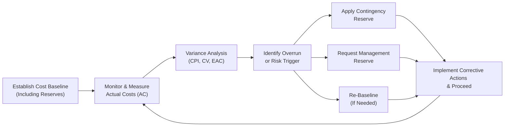

## 19.3 Controlling Costs and Managing Reserves

Controlling costs is more than simply preventing overruns. It involves vigilant monitoring of project financials, comparing planned vs. actual spending, understanding the root causes of variances, adjusting baselines when necessary, and effectively allocating reserves. Effective cost control strategies not only enhance predictability but also preserve stakeholder confidence and project viability. This section explains key methods to handle cost overruns, re-baseline budgets, and optimize contingency and management reserves.

Controlling costs and managing reserves builds upon the techniques introduced in earlier sections on cost estimation (19.1) and budgeting (19.2). In particular, Earned Value Management (EVM) provides quantifiable insights into project performance, while understanding your cost baseline is essential for re-baselining and strategic reserve usage. Whether you lead a multimillion-dollar construction project or a small-scale IT rollout, these concepts help keep financial health in check and project delivery on track.

---

### The Purpose of Cost Control

Cost control is the ongoing process of monitoring, analyzing, and moderating project costs to meet the approved budget. Its key objectives are:

• Measure current spending in relation to the planned budget.  
• Identify variances and their root causes.  
• Develop corrective or preventive actions to address overruns or inefficiencies.  
• Manage contingency and management reserves for known and unknown risks.  
• Maintain transparency with stakeholders regarding financial health.

These objectives align with the PMI principle of delivering value and ensuring financial stewardship, reflecting an organization’s ethical and fiduciary responsibilities.

---

### Continuous Monitoring and Variance Analysis

An effective cost control strategy involves continuous monitoring. By regularly collecting data on incurred expenses and remaining forecasts, project managers can identify trends early. Variance analysis—specifically the comparison of planned cost (the baseline) vs. actual cost and the earned value—unearths insights such as:

• Cost Variance (CV): The difference between the earned value of work performed and the actual costs incurred.  
• Schedule Variance (SV): Although primarily focused on schedule, it influences cost when delays cause additional expenses such as overtime or extended equipment rental.  
• Cost Performance Index (CPI): The ratio of earned value to actual cost, which indicates how well the project is using its budget. A CPI greater than 1.0 signals efficient use of funds; a CPI lower than 1.0 indicates overspending.  

```tex
\text{Cost Variance (CV)} = EV - AC
```
```tex
\text{Cost Performance Index (CPI)} = \frac{EV}{AC}
```

Where EV is Earned Value and AC is Actual Cost.

These metrics are evaluated on a recurring basis—often weekly or monthly—enabling management to detect variances quickly and act before overruns snowball. Continuous monitoring also drives data-informed decision-making, helping to determine if reallocation of resources or schedule adjustments might correct deviations without resorting to budget increases.

---

### Earned Value Management (EVM) and Forecasting

EVM provides a powerful framework for merging cost, schedule, and scope to assess project performance holistically. Through EVM metrics, project managers can foresee potential overruns early and proactively respond. When actual spending rates deviate from the plan, EVM forecasting methods help estimate costs at completion, guiding whether or not the baseline expectations remain realistic.

Key forecasting tools and formulas include:

• Estimate at Completion (EAC): Predicts the total cost of the project at completion based on performance to date and future expectations. Common formula if current variances are expected to continue:  
  ```tex
  \text{EAC} = \frac{BAC}{CPI}
  ```
  Where BAC is the Budget at Completion, representing the original total planned budget.  

• To-Complete Performance Index (TCPI): Indicates how efficiently the remaining budget must be spent to meet the original (or revised) target.  
  ```tex
  \text{TCPI} = \frac{BAC - EV}{BAC - AC}
  ```
  If the TCPI is much higher than 1.0, it indicates a need to spend more efficiently than planned for the remainder of the project.

Forecasting results highlight the likelihood of cost overruns, allowing project managers to revise resource strategies, negotiate with vendors, or request additional reserve releases where needed.

---

### Dealing with Cost Overruns

Despite best efforts, cost overruns can occur due to scope changes, estimation inaccuracies, resource shortages, and unforeseen issues. The steps to manage overruns effectively include:

• Identify and Investigate Overrun: Use variance analysis to distinguish if the issue stems from scope creep, missed procurement opportunities, or productivity shortfalls.  
• Propose Corrective Actions: Examples include scaling back lower-priority tasks, renegotiating contracts, or streamlining processes.  
• Implement Changes: Obtain approval from relevant stakeholders before performing changes to the budget or scope.  
• Re-forecast Budget and Schedule: If corrective measures alone cannot eliminate overruns, re-baseline the project to reflect new realities.  
• Gathering Lessons Learned and Reinforcing Best Practices: Document findings to prevent similar overruns on future projects.

Above all, maintaining transparent communication is paramount. Stakeholders, sponsors, and affected team members must remain informed about the financial health of the project, the causes of cost pressures, and proposed mitigation strategies.

---

### Re-Baselining the Cost Baseline

At times, incremental changes are insufficient to address significant budget or scope shifts. In such scenarios, re-baselining becomes essential. Re-baselining is the process of creating a global revision to the original baseline to reflect major scope evolution, major risk triggers, or cumulative scope changes. When you re-baseline:

• Conduct Thorough Impact Analysis: Determine how changes in scope, schedule, or resources affect the cost baseline.  
• Re-Evaluate Cost Estimates: Perform fresh estimates or refine existing ones using lessons learned from previous phases or activities.  
• Update Earned Value Metrics: Reflect the new cost baseline in EVM calculations to realign your performance indicators.  
• Obtain Formal Stakeholder Approval: Re-baselining typically requires sponsor and governance endorsement. Communicate clearly why the new budget is necessary and how it impacts benefits, timeline, and deliverables.  

Re-baselining should not become a frequent activity or an easy fallback for poor planning. Instead, it’s a tool that acknowledges strategic shifts or uncontrollable events—both of which may warrant a formal readjustment to project cost expectations.

---

### Differences Between Contingency and Management Reserves

Reserve management entails setting aside budgetary buffers to handle uncertainties and potential problems. Two primary types exist:

• Contingency Reserves: Allocated for “known unknowns”—risks identified and assessed during risk planning. Because these risks are somewhat anticipated, you can reasonably estimate the potential financial impact. Typically controlled by the project manager or risk owner.  

• Management Reserves: Allocated for “unknown unknowns”). These funds are usually controlled at a higher organizational level—like the sponsor or executive management. They cover unforeseen circumstances completely outside the project manager’s initial scope or risk plan.

The table below summarizes key differences:

| Feature                | Contingency Reserves                  | Management Reserves                      |
|------------------------|---------------------------------------|------------------------------------------|
| Purpose                | Covers identified risks (known unknowns) | Covers unforeseen issues (unknown unknowns) |
| Control Authority      | Managed by the project manager         | Managed by senior management or sponsor  |
| Allocation Basis       | Based on risk response planning        | Based on organizational policies and experience |
| Visibility in Baseline | Generally included in cost baseline    | Typically outside the baseline (but included in overall budget) |

An efficient project management approach aligns contingency reserves with specific high-impact risks (e.g., potential delays in a regulatory approval) and monitors usage meticulously. Management reserves, on the other hand, remain untouched unless highly significant or emergent events occur.

---

### Strategies for Optimizing Reserve Usage

Whether you’re managing contingency or management reserves, optimization involves thoughtful and justified usage:

• Tie Reserve Release to Trigger Events: Clearly define what triggers the use of a particular portion of the reserve. This ensures disciplined and transparent access to additional funds.  
• Conduct Frequent Risk Reviews: Revisit your risk register at regular intervals or when new risks emerge. Adjust contingency reserves accordingly.  
• Leverage Change Control Processes: Transferring funds from reserves to the project budget typically requires a formal change request (CR) within the organization’s governance structure.  
• Update Your Stakeholder Communication Plan: Reserve usage can spark concern among sponsors and executives. Plan how frequently and at what level of detail you will report on the status of reserves.

---

### Process Flow for Cost Control and Reserve Management

Below is a high-level process flow that depicts how project cost control, reserve management, and potential re-baselining interact.



1. Establish Baseline: Develop a cost baseline that incorporates contingency reserves for identified risks and allows for additional management reserves in the overall funding.  
2. Monitor and Measure: Gather actual costs, earned value, and related financial data regularly.  
3. Variance Analysis: Calculate CPI, CV, etc. and check if cost or schedule performance is within acceptable thresholds.  
4. Identify Overrun or Trigger: If costs deviate significantly or if a specific risk event occurs, corrective measures are initiated.  
5. Apply Contingency Reserve: If the risk was foreseen, draw from contingency reserves following the defined governance process.  
6. Request Management Reserve: For new or unpredictable events, request release of management reserves from senior leadership.  
7. Re-Baseline: If the shift in scope or budget is substantial, re-baseline your cost plan to reflect new conditions.  
8. Implement Corrective Actions: Update the plan, communicate changes, and continue monitoring regularly.

---

### Best Practices for Maintaining Control

• Integrate Cost and Schedule Control: When schedule delays occur, they often lead to increased labor or material costs. Use integrated project controls (e.g., Earned Value) to manage both dimensions in tandem.  
• Establish Clear Ownership: Assign accountable individuals or teams to each major cost line item. Accountability improves vigilance and fosters prompt variance responses.  
• Conduct Regular Forecast Reviews: Combining weekly or monthly cost forecasts with schedule and resource updates fosters continuous alignment.  
• Proactive Communication: Keep sponsors, executives, and relevant stakeholders informed of any risks to the budget, potential overruns, and reserve utilization. Surprises undermine trust.

---

### Common Pitfalls and Challenges

• Overreacting to Minor Variances: Not every minor variance justifies immediate plan changes or reforecasting. Distinguish between normal fluctuations and genuine systemic issues.  
• Viewing Reserves as a “Slush Fund”: Inadequate discipline around release of reserves can encourage cost inflation or poor risk management.  
• Inadequate Risk Assessment: If risk identification and analysis are weak, contingency reserves will likely be insufficient for actual exposure.  
• Neglecting Earned Value Concepts: Relying solely on actual cost vs. planned cost without measuring scope can lead to misinterpretation of performance and late detection of overruns.

---

### Real-World Case Example

Consider a large software development project at a financial institution. Originally budgeted at $2.5 million, the team’s Earned Value calculations indicated that the Cost Performance Index (CPI) had fallen to 0.85 after the second sprint. Investigation revealed that third-party licenses and specialized developer rates were higher than anticipated. 

The project manager responded by:  
• Negotiating discounts with software vendors.  
• Reallocating contingency reserves assigned to cost risks related to licensing.  
• Requesting an additional management reserve from the executive sponsor to address brand-new security compliance requirements.  
• Re-baselining the project’s budget to $2.7 million after stakeholder approval, integrating a more realistic cost model for specialized skill sets.  

This approach maintained project continuity, protected quality, and ensured aligned stakeholder expectations.

---

### References for Further Exploration

• Project Management Institute. A Guide to the Project Management Body of Knowledge (PMBOK® Guide) – Seventh Edition.  
• Project Management Institute. Practice Standard for Earned Value Management.  
• Kerzner, H. (2022). Project Management: A Systems Approach to Planning, Scheduling, and Controlling.  
• PMI’s Agile Practice Guide for insights on how Agile teams handle emergent costs and adapt quickly to change.

---

## Test Your Knowledge of Cost Control and Reserves



### Which of the following best describes the purpose of cost control in a project?

- [ ] Ensuring the project is below market budget estimates
- [x] Monitoring project costs, identifying variances, and taking corrective actions
- [ ] Maximizing profit margins by reducing the project scope
- [ ] Eliminating risk events altogether

> **Explanation:** Cost control involves tracking project expenditures against the baseline, identifying variances, and developing corrective or preventive measures to handle these variances effectively.

### What is the main difference between contingency reserve and management reserve?

- [x] Contingency reserves deal with known unknowns, whereas management reserves address unknown unknowns
- [ ] Contingency reserves are stored in a bank account, while management reserves are held in cryptocurrency
- [ ] Contingency reserves only cover scope changes, while management reserves only cover schedule slippages
- [ ] Contingency reserves are not part of the project budget

> **Explanation:** Contingency reserves are planned for risks identified during risk analysis. Management reserves are for unforeseen events outside the initial risk plan, typically controlled by senior management.

### When might re-baselining the cost baseline become necessary?

- [x] When major scope changes or significant unforeseen events alter the project cost projections substantially
- [ ] When the project team has minor cost overruns that have not been approved
- [ ] At the outset of a small cost variance of 1–2%
- [ ] Once phase one of the project is complete

> **Explanation:** Re-baselining is undertaken when significant changes occur that render the original cost baseline inaccurate, such as large scope additions or uncontrollable external factors.

### Which EVM metric compares budgeted cost of work performed with actual cost of work performed?

- [x] Cost Variance (CV)
- [ ] Schedule Variance (SV)
- [ ] Schedule Performance Index (SPI)
- [ ] Planned Value (PV)

> **Explanation:** Cost Variance (CV) indicates whether the project is on track financially by comparing the earned value to the actual cost.

### Which scenario is most appropriate for using contingency reserves?

- [x] A known hazardous condition materializes that was identified in the risk register
- [ ] A completely new regulatory compliance requirement arises without prior notice
- [x] A vendor’s contract escalates due to previously identified risk event
- [ ] A major restructuring of corporate management resets all budgets

> **Explanation:** Contingency reserves are funds set aside for known unknowns or identified risks. If a risk in the register occurs, contingency reserves can be utilized to address it.

### To-Complete Performance Index (TCPI) is used to:

- [x] Determine the required performance level to stay within budget
- [ ] Identify the number of future tasks
- [ ] Check stakeholder satisfaction levels
- [ ] Create a schedule baseline

> **Explanation:** TCPI indicates how efficiently the remaining funds must be spent to achieve the BAC (or a revised EAC) and stay within budget.

### What is the first step in handling a measured cost overrun?

- [x] Identify and investigate the possible root cause
- [ ] Immediately issue requests for more funding
- [x] Re-baseline the budget without analysis
- [ ] Request additional resources

> **Explanation:** Before making any requests or re-baselining decisions, the project manager must analyze the overrun to understand why it occurred and whether it can be resolved through immediate corrective actions.

### Which of the following represents the correct process flow logic for reserve usage?

- [x] Identify risk event or trigger → Apply contingency reserve → If insufficient, request management reserve
- [ ] Request management reserve → If denied, apply contingency reserve → If still insufficient, revise schedule
- [ ] Apply contingency reserve → Monitor schedule → Repeatedly apply management reserve
- [ ] Identify unknown risk → Draw from contingency reserve directly

> **Explanation:** Typically, the project team first uses contingency reserves for identified risk events, and only if those are exhausted or not applicable do they escalate to management reserves.

### Management reserves are generally controlled by which stakeholder role?

- [x] Senior management or sponsor
- [ ] Functional managers
- [ ] Project manager
- [ ] Risk officer

> **Explanation:** Management reserves are typically authorized and released by senior management or the project sponsor, reflecting their purpose in covering unknown unknowns.

### Earned Value Management (EVM) combines scope, schedule, and cost to:

- [x] Provide a comprehensive performance measurement system
- [ ] Automatically approve scope changes
- [ ] Eliminate all financial risks from projects
- [ ] Track contract quality metrics

> **Explanation:** EVM tracks how well the project is performing against the baseline plan by integrating scope, schedule, and cost data into key performance indicators.



---

## PMP Mastery: 1500+ Hard Mock Exams with Full Explanations 

Looking to crush the PMP exam with confidence? Dive deep into 6 rigorous mock exams totaling 1500+ advanced-level questions, each accompanied by clear, step-by-step explanations. Hone your test-taking strategies, master complex topics, and build the resilience you need on exam day. Perfect for serious PMs aiming beyond fundamentals.  

Enroll now:  
[PMP Mastery: 1500+ Hard Mock Exams with Exceptional Clarity & Full Explanations](https://www.udemy.com/course/pmp-2025/?referralCode=CF83A54BC86BE27F9AFE)

_Disclaimer: This course is not endorsed by or affiliated with the PMI examination authority. All content is provided purely for educational and preparatory purposes._
