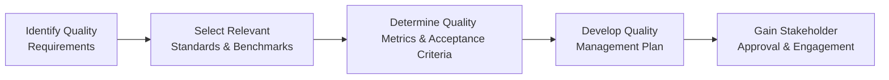

## 20.1 Planning Quality: Tools and Processes

Planning for quality lays a critical foundation for every project’s success, whether you’re delivering software releases, constructing infrastructure, or rolling out organizational change initiatives. Effective quality planning aligns your project outcomes with stakeholder expectations, industry and regulatory standards, and organizational goals. This section explains the key tools and processes involved in quality planning, highlights best practices, and provides examples to guide you through building a robust Quality Management Plan.

This topic is closely connected with Chapter 20.2 (Quality Assurance vs. Quality Control) and other chapters like [Chapter 10: Planning Performance Domain](../../10-planning-performance-domain) and [Chapter 11: Project Work Performance Domain](../../11-project-work-performance-domain). You’ll discover how quality planning integrates with scope, schedule, cost, and risk to create a comprehensive project approach.

---

### Why Quality Planning Matters

Quality planning determines the standards, specifications, and criteria by which products, services, or outputs are judged. It serves as the backbone for:

• Compliance with external standards (e.g., ISO 9001, regulatory statutes, industry norms).  
• Alignment with internal policies and procedures.  
• Meeting or exceeding the customer’s expectations.  
• Preventing defects and costly rework by integrating quality requirements into early project stages.  
• Establishing clear baselines for monitoring and controlling quality throughout the project life cycle.  

In essence, planning quality helps project teams design the path to "built-in excellence" rather than "inspecting excellence." By anticipating potential issues and setting up appropriate processes from the start, you safeguard your project from expensive surprises later.

---

### Distinguishing Quality Assurance from Quality Control

Before diving into tools and processes, it’s important to understand the difference between Quality Assurance (QA) and Quality Control (QC):

• Quality Assurance: Proactive activities that ensure the processes used to manage and create deliverables are effective and efficient. QA focuses on process adherence, continuous improvements, and preventive measures.

• Quality Control: Reactive activities that evaluate whether the final product meets the specified requirements and standards. QC identifies defects or variances, typically through inspections and testing of deliverables or intermediate outputs.

Planning quality emphasizes Quality Assurance efforts to ensure the right processes are set in motion. Effective QA reduces the need for extensive QC later.

---

### Key Inputs to Quality Planning

1. Project Charter and Requirements: Define high-level goals, constraints, and success criteria that shape quality expectations.  
2. Organizational Process Assets (OPAs): Provide templates, historical lessons learned, process guidelines, and checklists for quality.  
3. Enterprise Environmental Factors (EEFs): Include legal regulations, market standards, culture, and industry-specific compliance requirements.  
4. Stakeholder Register: Identifies those who may impact or be impacted by quality requirements, ensuring their feedback is considered early.  

Using these inputs, the Project Manager and the team craft a tailored Quality Management Plan that integrates seamlessly with the broader Project Management Plan.

---

### Core Processes for Planning Quality

Planning quality involves a systematic approach to defining objectives, selecting standards, identifying relevant metrics, and documenting how those metrics will be measured and verified. Although the precise steps can vary by project size and industry, a generalized flow includes:



1. Identify Quality Requirements  
   – Gather from the project’s scope documents, contract specifications, technical standards, or stakeholder interviews.

2. Select Relevant Standards & Benchmarks  
   – Decide which international, local, or industry-specific norms or guidelines must be followed (e.g., ISO 9001, engineering codes).

3. Determine Quality Metrics & Acceptance Criteria  
   – Establish objective, quantifiable measures that define success or compliance. Examples include defect rate thresholds, response times, dimensional tolerances, or user satisfaction scores.

4. Develop Quality Management Plan  
   – Document the strategy, processes, tools, and responsibilities for ensuring and measuring quality.

5. Gain Stakeholder Approval & Engagement  
   – Validate the plan with key stakeholders, ensuring feasibility and alignment with expectations.

---

### Quality Planning Tools and Techniques

A variety of tools and techniques aid in ensuring you plan for quality effectively. These tools facilitate brainstorming potential issues, analyzing possible remedies, and establishing relevant metrics.

#### 1. Cost-Benefit Analysis

• A method that compares the projected costs of quality efforts and potential rework to the expected benefits.  
• Helps decision-makers evaluate whether a proposed approach is worth investing in from a financial standpoint.  
• Example: In a software project, you might weigh the cost of implementing automated testing (including licenses, training, and maintenance) against the reduction in defects and post-release patching.

#### 2. Cost of Quality (COQ)

COQ takes cost-benefit analysis further by categorizing costs into four main areas:

| Category            | Description                                               |
|---------------------|-----------------------------------------------------------|
| Prevention Costs    | Incurred to avoid defects (e.g., training, documentation).|
| Appraisal Costs     | Incurred to detect defects (e.g., inspections, tests).    |
| Internal Failure    | Costs due to defects found before delivery (e.g., rework).|
| External Failure    | Costs due to defects found by the customer (e.g., warranty claims, legal issues).|

Properly planning for quality typically increases Prevention and Appraisal costs early in the project but can drastically reduce the higher-impact failure costs in later stages.

#### 3. Benchmarking

• Draws on industry best practices and historical projects to set performance, time, and cost standards.  
• Encourages learning from others’ success (or failures), allowing your project to adopt proven strategies.  
• Example: When introducing an agile framework in a large organization, a project team might benchmark their velocity metrics, defect rates, and quality outcomes against similar projects that have successfully transitioned to Scrum.

#### 4. Brainstorming

• Gathers cross-functional inputs to identify possible quality gaps, constraints, and improvement ideas.  
• Ensures that different perspectives—business analysts, developers, quality specialists, end-users—are considered.  
• Encourages innovation when mapping out potential solutions and identifying critical success factors.

#### 5. Ishikawa (Fishbone) Diagram

• Also known as a Cause-and-Effect Diagram.  
• Helps teams explore multiple causes behind a potential or actual defect.  
• Typically, causes are categorized into areas such as: Methods, Materials, Machines, and Manpower (or People).  
• Enables structured brainstorming and root cause analysis early in the planning process to mitigate risks.  

Below is a simple Mermaid diagram representing a Fishbone structure:

```mermaid
flowchart LR
    A["Effect/Problem"] <-- B["Manpower"]
    A <-- C["Methods"]
    A <-- D["Machinery"]
    A <-- E["Materials"]
    A <-- F["Measurements"]
    A <-- G["Environment"]
```

#### 6. Flowcharting

• Visualizes the steps of a process, making it easier to spot inefficiencies or areas prone to error.  
• Often used to map out how deliverables flow from one stage to another or how tasks progress in a manufacturing line or software development pipeline.  
• Example: Mapping the incident handling process in IT service management can reveal repetitive or needless steps.

#### 7. Pareto Analysis

• A technique based on the 80/20 rule, suggesting that roughly 80% of problems arise from 20% of causes.  
• Helps prioritize the most impactful issues or defect sources for targeted resolution.  
• Example: A customer service department might discover that 20% of product issues trigger 80% of returns, focusing improvement efforts on these top issues.

#### 8. Check Sheets and Checklists

• Simple yet effective documents to systematically verify that all project requirements or process steps are followed.  
• Ensure consistency and reduce the risk of overlooked tasks, especially when dealing with repetitive, high-volume activities.

---

### Integrating Quality Planning with Other Knowledge Areas

Quality planning does not happen in isolation. It interlinks with:

• Scope Management (see [Chapter 17: Scope and Requirements Management](../../17-scope-and-requirements-management))  
  – Ensuring requirements are measurable and testable.  
• Schedule Management (see [Chapter 18: Schedule Management](../../18-schedule-management))  
  – Building sufficient time for quality activities such as design reviews, testing, and audits.  
• Cost Management (see [Chapter 19: Cost Management](../../19-cost-management))  
  – Budgeting for quality-related expenditures like training, audits, or specialized tools.  
• Risk Management (see [Chapter 22: Risk and Uncertainty Management (Revisited)](../../22-risk-and-uncertainty-management))  
  – Identifying and mitigating risks that could compromise quality objectives.  

By synchronizing these areas, teams create a comprehensive plan that neither over-engineers quality nor underestimates its significance.

---

### Practical Example: Planning Quality in a Construction Project

Consider a midsize commercial building project needing to conform to stringent safety codes and local environmental regulations. Here’s how the project team might integrate quality planning:

• Identify Requirements: Review contract documents, local building codes, and LEED (Leadership in Energy and Environmental Design) standards.  
• Select Standards: Choose relevant ISO guidelines for materials testing and adhere to local labor laws for worker safety.  
• Define Metrics: Specify tolerances for structural integrity, use on-site inspections for compliance checks, and define permissible rework thresholds.  
• Develop QMP (Quality Management Plan) 
  – Use cost-benefit analysis for advanced HVAC testing to ensure energy efficiency.  
  – Implement a cause-and-effect diagram to anticipate different ways structural steel could fail or be incorrectly installed.  
• Gain Stakeholder Approval: Secure sign-off from the building’s future tenants, local inspectors, and your construction subcontractors.  

By addressing quality in the planning phase, the project reduces the likelihood of major compliance failures, expensive rework, and delayed occupancy.

---

### Common Pitfalls and How to Address Them

1. **Overlooking Stakeholder Input**  
   – Pitfall: Missing critical quality expectations due to limited stakeholder engagement.  
   – Mitigation: Conduct thorough requirements analysis, hold focus groups, and maintain a robust communication plan.

2. **Inadequate Budget for Quality**  
   – Pitfall: Management may perceive quality measures as “nice-to-have,” cutting corners when costs escalate.  
   – Mitigation: Use cost of quality and cost-benefit analyses to demonstrate the trade-offs and justify the return on investment (ROI).

3. **Failure to Tailor Quality Standards**  
   – Pitfall: Adopting a generic approach that leads to mismatched standards and unnecessary complexity.  
   – Mitigation: Assess and choose only those standards and tools that align with your project’s context, scale, and contractual obligations.

4. **Misalignment Between QA and QC Activities**  
   – Pitfall: Teams emphasize inspections (QC) but ignore improving upstream processes (QA).  
   – Mitigation: Integrate QA processes into the project schedule and promote a continuous improvement mindset from day one.

5. **Assuming Shortcuts Can Be Fixed Later**  
   – Pitfall: Believing that a minor compromise in materials or processes can be rectified without downstream impacts.  
   – Mitigation: Use risk-based approaches, incorporate quality gates, and maintain accountability through real-time metrics and transparent oversight.

---

### Best Practices for Effective Quality Planning

• Start Early: Involve quality planning at the same time as scope, schedule, and cost planning.  
• Engage a Cross-Functional Team: Include subject matter experts from different disciplines to gain a holistic perspective on what “quality” entails.  
• Use Incremental Review: Incorporate iterative feedback loops and pilot testing to confirm assumptions and refine processes.  
• Embrace Continuous Improvement: Build on lessons learned for subsequent projects or phases.  
• Measure What Matters: Focus on KPIs that directly influence the project objectives and stakeholder satisfaction.  

---

### References for Further Exploration

• Project Management Institute (PMI), A Guide to the Project Management Body of Knowledge (PMBOK® Guide) – Seventh Edition.  
• ISO 9001:2015, Quality Management Systems – Requirements.  
• Juran’s Quality Handbook by Joseph M. Juran.  
• Lean Six Sigma for Service by Michael George.  
• For deeper insights into integrating quality in an agile environment, see the Agile Practice Guide.  

---

## Test Your Knowledge: Quality Planning Tools and Processes



### How does Quality Planning primarily differ from Quality Control (QC)?

- [x] It focuses on preventing defects by building quality into processes.
- [ ] It relies solely on inspections after the deliverable is complete.
- [ ] It addresses performance management rather than deliverable quality.
- [ ] It does not consider stakeholder needs or expectations.

> **Explanation:** Quality Planning emphasizes proactive measures to embed best practices in processes and products, whereas Quality Control identifies defects after the product or service is produced.

### Which of the following is an example of Prevention Cost under Cost of Quality (COQ)?

- [ ] Cost of retesting after defects are found.
- [x] Cost of training personnel on new quality standards.
- [ ] Cost to rework a batch of defective components.
- [ ] Costs associated with a product recall due to safety issues.

> **Explanation:** Prevention Costs are expenses related to activities designed to avoid defects, such as better training, comprehensive documentation, and process improvements.

### In a Cost-Benefit Analysis, which statement best reflects its purpose?

- [ ] It focuses on listing software bugs without quantifying impact.
- [x] It compares the potential benefits gained against the costs incurred to decide on an investment.
- [ ] It verifies compliance with government regulations only.
- [ ] It replaces all other quality metrics once completed.

> **Explanation:** A Cost-Benefit Analysis helps managers weigh the financial advantages of a proposed improvement against its associated costs, ensuring strategic decisions.

### When constructing a Fishbone Diagram for a production defect, which category is commonly explored?

- [x] Methods (e.g., the way tasks are performed)
- [ ] Market conditions
- [ ] Consumer preferences
- [ ] Financial forecasting

> **Explanation:** Typical categories in a Fishbone Diagram are Methods (processes), Materials, Machines (equipment), Manpower (people), Measurements, and Environment.

### Which tool helps identify the most significant sources of defects using the 80/20 rule?

- [ ] Flowchart
- [x] Pareto Chart
- [ ] Brainstorming
- [ ] Cost-Benefit Analysis

> **Explanation:** A Pareto Chart visualizes which causes generate the most issues, enabling teams to prioritize fixes for the greatest overall improvement.

### How do Organizational Process Assets (OPAs) support Quality Planning?

- [x] They provide templates, lessons learned, and historical data for setting standards.
- [ ] They only consist of external industry guidelines and regulations.
- [ ] They are never used in clarifying lessons learned sessions.
- [ ] They are exclusively related to cost estimation activities.

> **Explanation:** OPAs are internal resources—process guidelines, standard templates, previous project data—that guide effective Quality Planning.

### In which situation would Flowcharting be most beneficial during Quality Planning?

- [x] To visualize how tasks progress and pinpoint potential bottlenecks in a production line.
- [ ] To calculate the monetary worth of implementing a new system.
- [ ] To summarize the highest categories of customer complaints.
- [ ] To analyze historical performance data from previous projects.

> **Explanation:** Flowcharting maps each step of a process, making inefficiencies or high-defect steps easier to identify and address proactively.

### What is a key benefit of involving cross-functional team members in a brainstorming session?

- [x] It ensures a variety of insights, revealing broader causes and solutions for quality issues.
- [ ] It slows down the planning process due to conflicting perspectives.
- [ ] It focuses only on the technical aspects of the product.
- [ ] It removes the need for a Quality Management Plan.

> **Explanation:** Engaging diverse stakeholders in brainstorming brings different knowledge and experiences, helping you more effectively discover risks, root causes, and improvement opportunities.

### What is the primary goal of including clear Quality Metrics in the Planning phase?

- [x] To define measurable acceptance criteria for deliverables.
- [ ] To increase project complexity and documentation requirements.
- [ ] To eliminate the need for stakeholder sign-off.
- [ ] To benchmark the project’s financial health only.

> **Explanation:** Establishing objective and quantifiable metrics during planning clarifies stakeholder expectations and sets measurable targets for QC.

### True or False: Quality Planning should be delayed until after the project’s deliverables are substantially designed.

- [x] False
- [ ] True

> **Explanation:** Starting Quality Planning early helps integrate quality objectives into the design and development processes, leading to fewer defects and less rework later.



---

## PMP Mastery: 1500+ Hard Mock Exams with Full Explanations 

Looking to crush the PMP exam with confidence? Dive deep into 6 rigorous mock exams totaling 1500+ advanced-level questions, each accompanied by clear, step-by-step explanations. Hone your test-taking strategies, master complex topics, and build the resilience you need on exam day. Perfect for serious PMs aiming beyond fundamentals.

Enroll now:  
[PMP Mastery: 1500+ Hard Mock Exams with Exceptional Clarity & Full Explanations](https://www.udemy.com/course/pmp-2025/?referralCode=CF83A54BC86BE27F9AFE)

_Disclaimer: This course is not endorsed by or affiliated with the PMI examination authority. All content is provided purely for educational and preparatory purposes._
