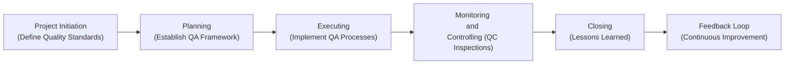

## 20.2 Quality Assurance vs. Quality Control

Quality Management in a project encompasses a range of activities and processes aimed at ensuring that the deliverables meet or exceed stakeholder expectations. Within this domain, two terms often used interchangeably yet serving distinct functions are Quality Assurance (QA) and Quality Control (QC). Despite their close association and complementary nature, QA and QC focus on different aspects of achieving quality outcomes. This section explores both concepts in depth, compares how they operate in predictive, agile, and hybrid environments, and offers practical guidance on using QA and QC effectively to deliver superior results.

---

### Understanding Quality Assurance (QA)

Quality Assurance is a proactive, process-driven methodology that focuses on establishing the frameworks and systems necessary to ensure a project’s outputs meet defined quality standards. QA activities involve creating policies, processes, standards, and guidelines so that work is done “right the first time.” In the context of the PMBOK® Guide, many QA-related tasks fall under “Manage Quality” (in earlier editions, “Perform Quality Assurance”), where the primary goal is to evaluate and enhance project processes continually.

#### Key Characteristics of QA

• Process-Oriented Approach:  
  – QA looks at the creation or improvement of standardized processes and procedures.  
  – It aims to reduce, and ultimately prevent, defects rather than merely detect them.  

• Continuous Improvement Mindset:  
  – QA encourages systematic assessments of how work is being performed.  
  – This fosters ongoing improvement of frameworks, checklists, and methodologies used across the project life cycle.  

• Preventive Activities:  
  – QA helps identify and eliminate the root causes of potential defects early on.  
  – Properly planned QA saves time and cost downstream by reducing rework.  

• Broad Scope:  
  – QA is not limited to a single phase; it is woven throughout the project life cycle.  
  – By integrating QA in initial design, planning, and ongoing execution, project teams ensure that quality is inherent in every task.  

#### Common Quality Assurance Techniques

• Process Audits:  
  – Evaluate if the team is following established project processes, guidelines, or organizational standards such as ISO 9000 or internal policies.  
  – Assess the effectiveness of these processes and explore potential areas for improvement.

• Quality Management Plan Reviews:  
  – Validate that the Quality Management Plan aligns with the organizational standards and stakeholder expectations.  
  – Confirm that roles, responsibilities, and resources for quality-related tasks are adequately defined.  

• Training and Development Programs:  
  – Focus on equipping the team with the necessary skills, tools, and techniques to maintain high-quality outputs.  
  – These can include workshops about best practices, industry standards, and emerging technologies.  

• Peer Reviews and Expert Evaluation:  
  – In many knowledge-based projects (e.g., software development), peer reviews help surface potential process inefficiencies.  
  – Expert evaluations from industry specialists can provide deeper insights into improvements.  

#### Real-World Example of QA

Consider a software development project in a financial services firm. The project leads institute coding standards and best practices for code reviews. Each code commit is validated against these standards. A multi-tiered review (peer review and automated static analysis) ensures that coding principles, security requirements, and naming conventions are consistently followed from day one. This approach (QA) reduces the chance of introducing fundamental design or security flaws, thereby saving time in subsequent testing and defect resolution.

---

### Understanding Quality Control (QC)

While QA is about preventing defects, Quality Control focuses on identifying and correcting defects in the final deliverables or outputs. QC examines the end product or service to verify conformance with requirements, collaborating closely with the broader Monitoring and Controlling processes. In PMBOK® terminology, QC activities often align with “Control Quality,” performed at regular intervals or key checkpoints in the project to assess tangible outcomes.

#### Key Characteristics of QC

• Product-Focused Approach:  
  – QC evaluates whether the final work product or service meets predefined specifications and stakeholder expectations.  
  – This can involve measurement, testing, inspection, and acceptance criteria.  

• Reactive and Correction-Oriented:  
  – QC often reacts to deviations or defects, aiming to correct them before final delivery.  
  – Issues discovered during QC usually require rework, bug-fixing, or corrective action.  

• Measurement and Statistical Tools:  
  – QC may utilize statistical sampling, control charts, or testing protocols (e.g., acceptance testing, destructive testing) to examine product quality.  
  – QC relies on quantifiable indicators (e.g., defect rates, tolerance levels).  

• Short-Term Focus on Outputs:  
  – While QA is ongoing throughout the life cycle, QC typically centers more intensely on the product verification stages.  
  – QC gleanings can inform QA by feeding back data about discovered defects, helping refine processes.  

#### Common Quality Control Techniques

• Inspections and Testing:  
  – Physical inspections, functional tests, or code testing are performed to detect errors or deviations.  
  – Focuses on verifying that deliverables match documented requirements.  

• Control Charts:  
  – A statistical tool for monitoring ongoing processes (especially in repetitive or manufacturing contexts).  
  – Identifies whether a process remains within acceptable limits (upper and lower control thresholds).  

• Histograms and Pareto Analysis:  
  – Pareto charts identify the most prevalent defect types or root causes, indicating which issues require immediate priority.  
  – Helps in guiding targeted corrective actions where they will yield the most benefit.  

• Checklists:  
  – Items or tasks that must be completed or confirmed prior to acceptance; ensure no key detail is overlooked.  
  – Very flexible: can be used at multiple stages (e.g., system integration checklist, final acceptance checklist).  

#### Real-World Example of QC

In a construction project for a new commercial building, Quality Control might involve regular site inspections by an independent inspection team. They examine completed structural elements—e.g., the foundation’s concrete strength, rebar placements, or alignment with the building plan. When deviations are found, teams correct them (such as removing substandard concrete sections) before proceeding. The QC team ensures the tangible deliverables conform to safety and building permit requirements, so that by the time the structure is complete, it passes all regulatory inspections without major rework or retrofitting.

---

### QA vs. QC: A Comparative Overview

Although both practices strive to ensure quality, their roles and timing differ distinctly.

| Aspect               | Quality Assurance (QA)                      | Quality Control (QC)                           |
|----------------------|---------------------------------------------|------------------------------------------------|
| **Primary Focus**    | Process-oriented (prevent defects)          | Product-oriented (detect and fix defects)      |
| **Nature**           | Proactive and preventive                    | Reactive and corrective                        |
| **Objective**        | Build quality into processes                | Verify and validate final outputs              |
| **Methods**          | Process audits, training, standardization   | Inspections, testing, statistical sampling     |
| **Timeframe**        | Ongoing throughout the project life cycle   | Typically near or at end of each deliverable   |
| **Key Outcome**      | Reduced rate of defects                     | Detection and resolution of defects            |

While QA helps to “do the right things the right way,” QC ensures “the things done are correct.” Ideally, a robust Quality Management strategy integrates both simultaneously and uses QC findings to improve QA, creating a virtuous loop of continuous improvement.

---

### The Role of QA and QC in Different Project Approaches

#### Predictive (Waterfall) Environment

• Documentation:  
  – QA activities focus on establishing clear guidelines and technical documentation to standardize process steps early.  
  – QC steps such as final inspections happen at the end of each major phase.  

• Stage Gate Reviews:  
  – QA ensures that project documentation and artifacts are created according to standards, facilitating easier stage gate approvals.  
  – QC uses acceptance criteria and formal signoffs to validate each deliverable at the end of the phase.  

• Emphasis on Early Detection:  
  – If QA is neglected, the project risks compounding defects through subsequent phases.  
  – QC near the final stages may reveal costly rework if early QA steps were inadequate.

#### Agile Environment

• Built-In Quality (BIQ):  
  – Agile frameworks (e.g., Scrum, XP) emphasize frequent inspection and adaptation. QA principles become integrated or “baked in” from iteration to iteration (e.g., peer programming, continuous integration).  
  – QC is performed through sprint reviews, acceptance tests, and demonstration of working increments to the Product Owner.  

• Feedback Loops:  
  – Quick feedback via daily standups, retrospectives, and sprint reviews fosters continuous improvement akin to QA.  
  – Frequent product increments are tested in real-time, aligning with QC to catch defects rapidly.  

• Collective Ownership:  
  – The entire team (developers, testers, and stakeholders) takes responsibility for both QA and QC.  
  – Collaboration reduces typical process gaps between separate QA and QC teams.

#### Hybrid Environment

• Tailored Approaches:  
  – Certain deliverables follow a predictive path (with well-defined QA checkpoints), while others leverage agile cycles for quick feedback (QC).  
  – The synergy arises in capturing the best of both worlds: stable QA processes and nimble QC checks.  

• Governance and Flexibility:  
  – An overarching governance model sets QA standards for all sub-projects.  
  – QC rubrics might vary to suit unique deliverables, using agile sprints or more formal inspection processes as needed.

---

### Process Flows: QA and QC Combined

Below is a simplified, high-level process flow illustrating how QA and QC interact throughout the project life cycle. Though stylized, it highlights where proactive QA activities feed into iterative QC checks:

- A → B: During Project Initiation and Planning, quality standards and QA frameworks are defined.  
- B → C: Execution involves rolling out QA processes, such as training teams or conducting audits.  
- C → D: Periodic QC inspections or tests ensure delivered outputs align with specifications.  
- D → E: At Closing, the QC results feed into project completion and acceptance.  
- E → F: Lessons Learned become inputs for refining QA processes in future projects.

---

### Aligning QA and QC with Continuous Improvement

Quality Assurance and Quality Control mutually reinforce the concept of continuous improvement (explored further in Section 20.3, “Continuous Improvement (Kaizen) and Prevention”). While QA ensures that processes are properly established to minimize defects at their source, QC data can reveal process weaknesses. That data fuels enhancements in QA standards, effectively enabling iterative refinements in:

• Training Protocols  
• Documentation and Methodologies  
• Tools Used for Measurement or Analysis

In a culture passionate about improvement, QA and QC cease to be isolated checks. Instead, they become cyclical, building upon each other’s insights to raise the bar for product quality and stakeholder satisfaction.

---

### Best Practices for Integrating QA and QC

• Start with a Clear Quality Management Plan  
  – Outline both QA and QC responsibilities, timelines, tools, and escalation processes.  
  – Specify who owns which tasks and how frequently certain activities (e.g., audits, inspections) occur.

• Monitor Key Indicators  
  – Use metrics such as defect escape rate (the number of defects that slip past detection) or rework costs to evaluate QA’s effectiveness.  
  – Evaluate QC’s real-time performance via defect logs, acceptance test results, or control charts.

• Encourage Cross-Functional Collaboration  
  – Everyone involved in the project shares responsibility for quality. Periodic cross-functional meetings facilitate knowledge transfer between QA and QC teams.  
  – Combine results from audits (QA) and inspections (QC) to identify root causes and possible preventive measures.

• Foster a Culture of Error Prevention Over Blame  
  – Emphasize that defects are learning opportunities to enhance processes rather than reasons to penalize individuals.  
  – Reward proactive identification of flaws in processes or systems before they cause quality issues.

• Use Automation and Tools Where Applicable  
  – Software-based defect tracking systems, continuous integration (CI) pipelines, and dynamic dashboards can accelerate the detection and resolution of issues.  
  – Automated testing or code scanning tools help integrate QC with daily agile practices, while QA teams measure the efficacy of these tools to reduce manual overhead.

---

### Common Pitfalls and Challenges

• Overreliance on QC Alone:  
  – Some organizations attempt to “inspect in” quality at the end, neglecting proper QA frameworks. This leads to excessive rework, missed deadlines, or budget overruns.

• Lack of Management Buy-In for QA  
  – When senior leaders prioritize immediate outputs over stable processes, QA can be sidelined. This results in short-term gains but frequent long-term failures.

• Inadequate Documentation  
  – Without clear process definitions, it is difficult to conduct meaningful QA audits or know precisely what “good” looks like for QC checks.  

• Resistance to Change  
  – Both QA and QC require a mindset of continuous improvement. Resistance to new procedures or investing in better QC tools can hinder progress.

• Communication Gaps  
  – QA teams undertaking audits might not share results promptly with QC or operations teams. This disconnect can lead to repeated mistakes or missed improvements.

---

### Cost of Quality (CoQ): Linking QA to QC

Organizations often weigh QA efforts against immediate resource constraints. However, neglecting QA can inflate costs in the long run due to rework, scrap, or product recalls. A helpful concept here is the total Cost of Quality (CoQ), dividing expenses into three main categories:


\text{Total COQ} = \text{Prevention Costs} + \text{Appraisal Costs} + \text{Failure Costs}


• Prevention Costs: Investments made to prevent defects (e.g., training, process documentation, standardization).  
• Appraisal Costs: Costs to monitor and control quality, such as inspections and testing (QC).  
• Failure Costs: Costs due to internal failures (rework, repairs) or external failures (warranty claims, product liability).

By emphasizing QA (prevention) and a robust QC process (appraisal), organizations often reduce failure costs significantly and increase customer satisfaction.

---

### Practical Case Study

Imagine a mid-sized manufacturer producing custom medical devices. Initially, they relied heavily on post-production testing (QC) to detect defects, often discarding incorrectly assembled parts. Over time, failure costs ballooned. Management introduced systematic QA measures, including:

1. Detailed Work Instructions and Checklists:  
   – Workers received updated SOPs (Standard Operating Procedures) for assembly.  
   – Real-time sensors monitored assembly steps to verify data compliance.

2. Worker Training and Certification Programs:  
   – Operators received formal training and repeated evaluations to ensure mastery of new procedures.  
   – These QA-driven programs empowered them to spot potential issues early.

3. Automated Testing and Feedback System (QC Enhancement):  
   – Every finished unit went through a computerized test rig.  
   – Defects were analyzed in real-time, and the QC data was fed back to QA for process reviews.

Result: Over 18 months, part rejection rates dropped by 50%, and the overall cost of failures decreased markedly. The success of QA was measured not only in fewer defects but also in significantly improved team morale, on-time customer deliveries, and compliance with stringent medical regulations.

---

### Further Reading and References

• Project Management Institute (PMI). A Guide to the Project Management Body of Knowledge (PMBOK® Guide) – Seventh Edition: Chapter on Quality Performance Domain.  
• American Society for Quality (ASQ): Online resources on Quality Assurance and Quality Control, ISO 9001 standards, and cost of quality.  
• Deming, W. Edwards. Out of the Crisis. MIT Press (for insights on process improvement).  
• Juran, Joseph M. Juran’s Quality Handbook (classic reference on quality management strategies).  

---

## Test Your Knowledge: Quality Assurance and Quality Control Essentials



### Which statement best describes Quality Assurance (QA)?
- [ ] QA detects defects in the finished product.
- [x] QA focuses on establishing processes to prevent defects.
- [ ] QA only evaluates product performance at the end of each project phase.
- [ ] QA concentrates on external customer sign-off.

> **Explanation:** QA is about proactively building and refining processes to avoid errors. It is process-oriented, whereas detecting defects is typically a QC role.

### What is the primary emphasis of Quality Control (QC)?
- [ ] Designing new workflows to reduce variation before production starts.
- [ ] Developing training programs for project teams.
- [x] Inspecting final outputs or deliverables to ensure they meet requirements.
- [ ] Ensuring project objectives align with organizational strategy.

> **Explanation:** QC is primarily concerned with verifying product conformance to requirements and finding defects in the deliverables.

### Which of the following is an example of Quality Assurance activity in a construction project?
- [x] Establishing standard operating procedures (SOPs) for concrete mixing and curing.
- [ ] Performing a compressive strength test on concrete cubes.
- [ ] Checking the alignment of steel reinforcements in the foundation.
- [ ] Documenting final acceptance test results.

> **Explanation:** Creating SOPs is a proactive measure targeting process correctness, hence QA. Testing the final product (concrete cubes) is QC.

### In Agile methodologies, why is QA often considered "built-in"?
- [ ] Because defect prevention occurs only at the retrospective stage.
- [x] Because frequent iteration cycles embed continuous feedback and process adjustments.
- [ ] Because user acceptance testing is mandatory in every sprint.
- [ ] Because QA is more relevant in predictive project management than iterative.

> **Explanation:** Agile's iterative nature integrates continuous inspection and adaptation, embedding QA by refining processes and preventing defects at every iteration.

### What best illustrates a reactive QC measure?
- [x] Fixing a bug found during system testing just before release.
- [ ] Auditing team compliance with coding standards during development.
- [x] Correcting a design flaw after receiving stakeholder feedback.
- [ ] Establishing a baseline schedule of integration tests.

> **Explanation:** QC measures usually involve reacting to detected defects or non-conformities in deliverables. Finding and fixing a bug in system testing is a classic reactive measure.

### Which statement about QA in a hybrid project is correct?
- [x] QA processes may be standardized for parts of the project that follow predictive planning, yet adaptable for iterative deliverables.
- [ ] QA and QC are not relevant in hybrid environments.
- [ ] Only QC is relevant because the deliverables are partially agile.
- [ ] QA is isolated from the organization’s policies when a hybrid approach is used.

> **Explanation:** Hybrid projects mix predictive and agile techniques. QA frameworks can be standardized but also tailored to the iterative parts of the project.

### Which best describes the link between QA and QC data for continuous improvement?
- [x] QC data about defects informs QA on how to modify processes for defect prevention.
- [ ] QA outputs typically replace QC checklists altogether.
- [x] QA tasks rely on final user acceptance testing outcomes as the only feedback loop.
- [ ] QC activities do not influence QA decisions.

> **Explanation:** One of QA’s essential roles is to analyze data from QC to refine processes and eliminate sources of defects, fostering continuous improvement.

### How do Cost of Quality (CoQ) metrics influence QA investments?
- [x] By showing how prevention costs can reduce expensive failures, thus justifying more robust QA efforts.
- [ ] By eliminating the need for QC measurements.
- [ ] By focusing only on appraisal costs associated with final product testing.
- [ ] By encouraging organizations to spend more on external testing contractors.

> **Explanation:** Prevention costs (part of CoQ) can substantially lower failure costs, creating a business case for robust QA initiatives.

### Which of the following statements is true about QA and QC alignment in a project?
- [x] QA establishes processes to prevent defects; QC methods verify if the final outputs meet standards.
- [ ] QA teams also serve as the final sign-off for user acceptance.
- [ ] QC tasks only happen if QA fails to prevent defects.
- [ ] QC is the only approach needed when the project has well-established procedures.

> **Explanation:** QA and QC are complementary. QA sets processes to prevent defects, and QC checks whether the resulting deliverables conform to the required standards.

### Defects discovered by QC should feed back into QA activities. True or False?
- [x] True
- [ ] False

> **Explanation:** Data gathered from QC is crucial for ongoing improvement, helping QA teams refine processes and avoid recurrence of similar issues.



---

## PMP Mastery: 1500+ Hard Mock Exams with Full Explanations 

Looking to crush the PMP exam with confidence? Dive deep into 6 rigorous mock exams totaling 1500+ advanced-level questions, each accompanied by clear, step-by-step explanations. Hone your test-taking strategies, master complex topics, and build the resilience you need on exam day. Perfect for serious PMs aiming beyond fundamentals.

Enroll now:  
[PMP Mastery: 1500+ Hard Mock Exams with Exceptional Clarity & Full Explanations](https://www.udemy.com/course/pmp-2025/?referralCode=CF83A54BC86BE27F9AFE)

_Disclaimer: This course is not endorsed by or affiliated with the PMI examination authority. All content is provided purely for educational and preparatory purposes._
