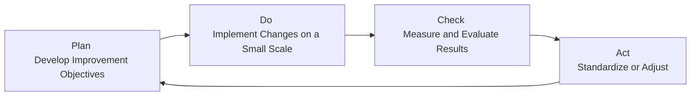

## 20.3 Continuous Improvement (Kaizen) and Prevention

In the realm of Quality Management, continuous improvement and prevention strategies play a pivotal role in achieving project success. No matter the delivery approach—predictive, agile, or hybrid—the fundamental goal remains consistent: prevent defects, minimize rework, and foster a culture of ongoing enhancement. This section provides a detailed look at how the Kaizen philosophy can be integrated into project environments, why prevention is more cost-effective than correction, and how data-driven improvements support sustainable project outcomes.

Continuous improvement and prevention both closely relate to what has been introduced in 20.1 (Planning Quality) and 20.2 (Quality Assurance vs. Quality Control). Here, we will expand on those concepts by focusing on practical measures, tools, and mindsets that keep teams aligned on delivering quality results consistently.

  
### The Kaizen Philosophy: Small Steps, Big Impact

Kaizen is a Japanese term that translates to “change for the better.” It emphasizes the idea that significant improvements to processes and quality don't always require colossal, disruptive changes. Instead, they can be the cumulative result of consistent small-scale enhancements. Kaizen cannot succeed without a cultural foundation: everyone in the organization—from the most junior team member to the senior leadership—must be involved in spotting opportunities for improvements.

• Inclusive Mindset: By encouraging every team member to propose and implement small improvements, the organization benefits from collective intelligence and a sense of shared ownership.  
• Incremental Gains: Each small improvement compounds over time, leading to substantial efficiency boosts, cost savings, and higher quality outcomes.  
• Error Prevention and Early Detection: With frequent inspection and brainstorming of better ways of working, teams identify errors at their earliest stages, preventing expensive rework.  

Kaizen is not limited to a particular industry or methodology; it can be applied in agile software development (through retrospective ceremonies), in manufacturing (through Lean practices), and in predictive project environments (through formal process audits and stakeholder reviews).

### Prevention vs. Correction

One of the core precepts of Project Quality Management is that preventing defects is generally cheaper than correcting them later. As introduced in earlier sections, processes like Quality Assurance (QA) create the foundation for prevention, while Quality Control (QC) detects issues after they occur.

• Prevention Costs: Efforts invested in training, process design, error-proofing (poka-yoke), and rigorous planning. These measures help avoid issues upfront.  
• Appraisal Costs: Resources used to test deliverables, such as inspection, product testing, and in-field verification.  
• Internal Failure Costs: Arise when a defect is discovered within the organization (e.g., rework, retesting, increased labor hours).  
• External Failure Costs: Occur when an issue reaches the customer or end user (e.g., warranty claims, liability, brand damage).  

The most effective way to manage these costs is to prioritize prevention: an ounce of prevention can truly be worth a pound of cure. Embedding continuous improvement techniques into daily operations helps leaders systematically uncover preventive actions that can eliminate or drastically reduce internal and external failures.

  
### Kaizen in Different Project Life Cycles

Projects are delivered using various life cycle approaches—predictive, agile, iterative, incremental, or hybrid. Each approach can incorporate Kaizen tailored to its characteristics:

• Predictive (Waterfall): Formal review points (stage gates, phase reviews) can become moments to examine lessons learned and implement small improvements on an ongoing basis. Quality audits and checklists can feed into design modifications and process refinements.  
• Agile (Scrum, Kanban, XP): Regular feedback loops and retrospectives at the end of each iteration or sprint represent classic Kaizen opportunities. The agile “inspect-and-adapt” cycle strongly aligns with Kaizen principles, encouraging the continuous refinement of both product and process.  
• Hybrid: In hybrid frameworks—where predictive and agile come together—teams can leverage frequent small improvements throughout the agile portions of the project, while also integrating prevention-oriented reviews during predictive phases (e.g., design freeze gates, testing phases).

In each case, the objective remains consistent: to drive continuous improvement at the team, process, and product/project levels, preserving and amplifying the benefits over time.

  
### Data-Driven Continuous Improvement

Kaizen is widely supported by the Plan-Do-Check-Act (PDCA) cycle, originally popularized by W. Edwards Deming. This framework provides a systematic approach to implementing continuous improvement:

1. **Plan**: Identify improvement areas with root cause analysis, data collection, and stakeholder feedback. Establish clear objectives and success criteria.  
2. **Do**: Implement the improvement on a controlled scale, ensuring minimal disruption.  
3. **Check**: Evaluate outcomes and compare them against the planned goals. Gather metrics such as defect rates, cycle times, or customer satisfaction scores.  
4. **Act**: If the improvement meets or exceeds expectations, standardize the new process; if not, adjust the approach and iterate the cycle.

This cyclical approach is especially powerful in complex projects, as it ensures iterative experimentation with low risk. By continuously measuring and refining, you safeguard against large-scale failures.

  
### The Role of Leadership in Sustaining Continuous Improvement

While it is possible to embed Kaizen at a tactical level, maintaining consistent improvement programs requires deliberate leadership. Some key leadership responsibilities include:

• Setting a Shared Vision: Leaders and project managers clarify the purpose and goals of Kaizen initiatives, linking them to strategic objectives.  
• Empowering Teams: Assign decision-making authority to those closest to the work. Provide the resources and training needed to experiment and analyze results.  
• Removing Organizational Barriers: Leaders address bureaucracy or departmental silos that might stifle an organization-wide culture of improvement.  
• Recognizing and Rewarding Effort: Celebrate successes, highlight measurable results, and reinforce the desired behaviors that drive continuous improvement.

When continuous improvement is seen as part of the organizational DNA, teams and individuals feel encouraged to refine processes daily. This climate of trust and shared responsibility promotes open dialogue about mistakes, root causes, and how to avoid the same pitfalls in the future.

  
### Quality Tools and Techniques That Support Kaizen

Several tools commonly discussed in Quality Management can be integrated into Kaizen activities:

• **Pareto Charts**: Help identify the 20% of root causes responsible for 80% of the issues. Once identified, teams can focus on mitigating these critical problem areas.  
• **Fishbone (Ishikawa) Diagrams**: A visual tool to break down cause-and-effect relationships, aiding teams in isolating root causes of recurring issues.  
• **Control Charts**: Useful for ongoing monitoring to detect trends or shifts in process performance, prompting timely improvement actions.  
• **Flowcharts and Value Stream Mapping (VSM)**: Reveal inefficiencies, redundancies, or error-prone steps within a process, pointing to improvement opportunities.

Combining these quality management tools with a Kaizen mindset helps teams rapidly identify, prioritize, and act on improvement initiatives.

  
### Example: Kaizen in a Software Deployment Project

Consider a software development project at a mid-sized enterprise. During sprint retrospectives, the team notices an increasing number of defects introduced during integration testing. To address this, they adopt Kaizen by:

1. **Gathering Data**: The team documents the number and types of defects in a Pareto chart, finding that 55% of reported issues are configuration errors.  
2. **Root Cause Analysis**: Using a fishbone diagram, they identify that inconsistent code review processes and environment misalignments are leading contributors.  
3. **Implementing Small Changes**: They modify their daily standup to include a short “environment check” step and add a second reviewer to any integration-related code.  
4. **Ongoing Monitoring**: Over two subsequent sprints, they track the defect rate and observe a 40% reduction in integration-related issues.  

By iterating these small Kaizen improvements each sprint, the project not only delivers higher-quality software but also nurtures a culture of shared responsibility and accountability.

  
### Preventive Measures in Traditional Projects

In a traditional or predictive environment, quality planning, design reviews, and audits provide structured avenues for prevention. During the planning phase, teams identify tools and techniques (e.g., failure mode and effects analysis, checklists, or standard operating procedures) that reduce or eliminate potential process flaws. By including these measures in the Project Management Plan from the outset, teams effectively embed a preventive mindset into daily processes. Chapter 20.1 (Planning Quality) underscores the importance of early planning—continuous improvement and Kaizen principles can flow naturally from these structured planning efforts when the team commits to ongoing learning cycles.

  
### Common Pitfalls and How to Overcome Them

Although continuous improvement (Kaizen) philosophies are highly effective, common barriers can impede success:

• **Resistance to Change**: Team members or leaders may be comfortable with existing routines. Overcome this by educating all stakeholders on Kaizen principles, celebrating early wins, and showing tangible benefits.  
• **Lack of Regular Review**: Without systematic and frequent reviews (e.g., scheduled retrospectives), improvements stall. Ensure that each iteration or milestone includes a structured improvement cycle.  
• **Overemphasis on Short-Term Results**: Kaizen thrives on cumulative gains. A myopic focus on immediate, quantifiable returns can stifle true transformation. Set both short- and long-term improvement goals.  
• **Insufficient Leadership Support**: Continuous improvement efforts require resource allocation, encouragement, and sponsorship from top management. Promote organizational alignment by regularly spotlighting success stories and key metrics.

  
### Synergy with Risk Management

Chapter 22 (Risk and Uncertainty Management) revisits how essential it is to manage unexpected events in projects. Incorporating robust continuous improvement practices inherently reduces risk, as the Kaizen approach spots potential failure points early. Moreover, a culture that values incremental learning and adaptation is inherently more adept at responding to new risks. By regularly reviewing lessons learned and adjusting processes, you capture missed risks or newly emerging threats, thus closing the loop on risk management.

  
### Sustaining a Culture of Continuous Improvement

Building a Kaizen-driven culture does not stop with a few successful initiatives. Implementation must be systematic and pervasive:

• **Reinforce Through Training**: Equip team members with basic Quality Management tools, problem-solving frameworks, and data analytics skills.  
• **Embed in Performance Reviews**: Make continuous improvement a metric in performance evaluations, underscoring its importance.  
• **Communicate Wins and Learnings**: Publicize successful changes across the organization to inspire other teams and demonstrate tangible outcomes.  
• **Invest in Ongoing Development**: Offer advanced training (e.g., Lean Six Sigma certification, advanced data analysis, or agile coaching) to sustain momentum.  

In line with the broader strategic environment discussed in later chapters (such as Chapter 28 on Aligning Projects with Organizational Strategy), a Kaizen mindset should connect with the organizational roadmaps, ensuring continuous improvement becomes a competitive advantage rather than a one-off initiative.

  
### References for Further Exploration

1. **Deming, W. Edwards. _Out of the Crisis_** – Foundational text outlining PDCA cycles and the role of quality in organizational success.  
2. **Imai, Masaaki. _Kaizen: The Key to Japan's Competitive Success_** – The definitive exploration of Kaizen culture in Japanese manufacturing, with universal lessons for project environments.  
3. **Lean Thinking by James P. Womack and Daniel T. Jones** – Explores efficiency and lean principles that form the backbone of Kaizen across various industries.  
4. **PMI, _A Guide to the Project Management Body of Knowledge (PMBOK® Guide), Seventh Edition_** – Includes principles-driven approaches that complement continuous improvement strategies.  

  
## Test Your Knowledge: Kaizen, Continuous Improvement, and Prevention



### What is a key principle of Kaizen?
- [x] Continuous and incremental improvement over time  
- [ ] Eliminating all metrics to focus on gut feeling  
- [ ] Implementing dramatic, large-scale changes at once  
- [ ] Replacing team feedback with robotic process automation  

> **Explanation:** Kaizen emphasizes ongoing, small, and incremental improvements as opposed to massive disruptive efforts.

### Which of the following best describes “prevention costs” in Quality Management?
- [ ] Expenses to fix a defect reported by a client  
- [x] Costs associated with actions taken to avoid issues before they arise  
- [ ] Costs of retesting a failure  
- [ ] Costs of marketing campaigns to justify product issues  

> **Explanation:** Prevention costs refer to the investments in processes, training, and tools intended to stop defects from occurring in the first place, rather than correcting issues after the fact.

### Which step in the PDCA (Plan-Do-Check-Act) cycle evaluates the results of an improvement initiative?
- [ ] Plan  
- [ ] Do  
- [x] Check  
- [ ] Act  

> **Explanation:** In the Plan-Do-Check-Act model, the "Check" phase is where you measure the success of your implemented changes against established objectives.

### In projects using agile approaches, which event most closely embodies Kaizen principles?
- [ ] Daily Standups  
- [ ] Sprint Planning  
- [x] Sprint Retrospective  
- [ ] Backlog Refinement  

> **Explanation:** The Sprint Retrospective is designed specifically to identify improvements for people, processes, and products, aligning directly with the continuous improvement concept.

### What is a significant advantage of focusing on defect prevention rather than defect detection?
- [x] Reduced rework and cost savings  
- [ ] Larger staff needed for continuous audits  
- [x] Higher overall productivity and customer satisfaction  
- [ ] Limited availability of feedback channels  

> **Explanation:** By investing in preventative measures, projects experience fewer issues, leading to increased customer satisfaction, lower rework costs, and more efficient use of resources.

### A Pareto Chart in Kaizen helps a Quality Management team:
- [x] Identify the most frequent causes of problems  
- [ ] Combine causes of defects to hide them  
- [ ] Eliminate the need for root cause analysis  
- [ ] Implement changes without measuring results  

> **Explanation:** A Pareto Chart visually pinpoints dominant causes of problems (often described by the 80/20 rule), enabling teams to target the most impactful areas for improvement.

### What is one main difference between Quality Assurance (QA) and Quality Control (QC)?
- [x] QA is focused on prevention, while QC is focused on detection  
- [ ] QC involves planning processes, while QA involves product inspections  
- [x] QA happens before product creation, while QC mostly happens afterwards  
- [ ] There is no difference; they are the same activities  

> **Explanation:** QA aims to set and continuously improve processes to avoid defects upfront, whereas QC detects defects after deliverables or components are created.

### Which of the following best illustrates a Kaizen approach in a hybrid project?
- [x] Holding formal gate reviews to collect lessons learned and applying continuous improvements in iterative sprints  
- [ ] Releasing the entire product at one time without any reviews  
- [ ] Ignoring predictive planning stages in favor of testing after final development  
- [ ] Conducting ad hoc performance reviews years after project completion  

> **Explanation:** In a hybrid setting, you combine structured, predictive checkpoints (or stage gates) with frequent iterative improvements, capturing the best of both worlds.

### Which technique would best help a project team visually capture and prioritize the top two or three root causes of problems?
- [x] Pareto Chart  
- [ ] Histogram  
- [ ] Scatter Diagram  
- [ ] Run Chart  

> **Explanation:** A Pareto Chart helps teams see which factors contribute the highest to defects or problems, typically highlighting the “vital few” vs. “trivial many.”

### True or False: A culture of continuous improvement typically decreases an organization’s ability to adapt to new risks.
- [ ] True  
- [x] False  

> **Explanation:** Continuous improvement inherently increases adaptability. Teams continuously reassess priorities, processes, and environments, thereby recognizing and responding to new risks more quickly.



## PMP Mastery: 1500+ Hard Mock Exams with Full Explanations 

Looking to crush the PMP exam with confidence? Dive deep into 6 rigorous mock exams totaling 1500+ advanced-level questions, each accompanied by clear, step-by-step explanations. Hone your test-taking strategies, master complex topics, and build the resilience you need on exam day. Perfect for serious PMs aiming beyond fundamentals.

Enroll now:  
[PMP Mastery: 1500+ Hard Mock Exams with Exceptional Clarity & Full Explanations](https://www.udemy.com/course/pmp-2025/?referralCode=CF83A54BC86BE27F9AFE)

_Disclaimer: This course is not endorsed by or affiliated with the PMI examination authority. All content is provided purely for educational and preparatory purposes._
