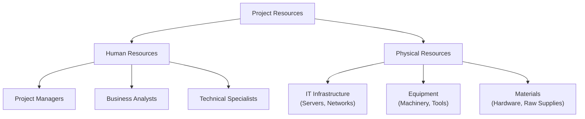

## 21.1 Estimating Human/Physical Resource Needs

Resource estimation is one of the project manager’s most critical responsibilities, ensuring the project team has the right people with the right skills—and that you can access physical necessities such as equipment, facilities, or materials at the right time. Mistakes in resource estimation can lead to schedule overruns, wasted budget, and even project failure. Building upon concepts from the PMBOK® Guide (Seventh Edition) and other chapters in this book (notably “10.1 Collaborative Planning and Rolling Wave Techniques” and “18.1 Work Breakdown Structure and Activity Sequencing”), this section presents a comprehensive approach to identifying, quantifying, and securing human and physical resource needs throughout the project life cycle.

### Why Accurate Resource Estimation Matters

1. **Project Continuity**: Ensuring resources (human and non-human) are available helps avoid costly delays or work stoppages.  
2. **Risk Reduction**: Proper estimation of staffing levels and material availability reduces uncertainty and improves risk management (see Chapter 22: Risk and Uncertainty Management).  
3. **Realistic Stakeholder Expectations**: Timely and accurate projections convey credibility and allow sponsors, stakeholders, and teams to prepare for potential constraints.  
4. **Financial Efficiency**: Overestimating can lead to resource waste (e.g., idle team members or unused equipment), while underestimating can lead to cost and schedule overruns.  

### Integrating Resource Estimation with the Project Plan

Resource estimation is more effective when integrated into the broader project planning framework. Schedules, risk analyses, stakeholder engagement plans, procurement strategies, and quality considerations each influence resource decisions. The project manager ensures alignment by mapping resource needs to the Work Breakdown Structure (WBS), project schedule, and cost baselines (see Chapter 18: Schedule Management and Chapter 19: Cost Management).   

#### The Resource Management Plan
A Resource Management Plan—a key output from the Resource Management processes—documents how to identify and quantify required resources and details the acquisition, allocation, and eventual release of these resources. It typically includes:
- Roles and responsibilities  
- Project organization charts  
- Staffing management plan (including resource calendars and training needs)  
- Identification of needed facilities, materials, equipment, and infrastructure  
- Strategies for dealing with resource conflicts  

### Techniques for Estimating Resource Needs

Project management practitioners adopt various techniques to calculate and forecast overall resource demands:

- **Analogous Estimating**: Uses historical data from similar projects. This is fast and suitable in early stages or when detailed information is unavailable.
- **Parametric Estimating**: Relies on statistical relationships, such as cost or output per resource hour, to build estimates. For instance, if it takes one experienced developer 40 hours to code a specific module, a parametric formula might then scale that estimate up or down.
- **Bottom-Up Estimating**: Breaks down work to the activity level, estimating resource needs activity by activity, then rolling them up to the project or phase level.
- **Expert Judgment**: Involves consulting Subject Matter Experts (SMEs), especially beneficial for specialized resource requirements like unique software tools or specialized skill sets.
- **Rolling Wave Planning**: Plans in detail for the near term and at a higher level for future phases, refining estimates as the project progresses and clarity improves.

### Estimating Human Resources

Human resource estimation involves determining:
- The types of skills required  
- The quantity of each skill or role (e.g., number of developers, engineers, testers, analysts)  
- The level of expertise needed (junior, mid-level, senior)  
- The availability timeframe

#### Aligning Skill Sets to Tasks

Mapping tasks to skill sets helps prevent misallocation, ensuring each activity has the right expertise. For instance:  
- Complex software architecture tasks require senior-level architects.  
- QA activities may need a mix of manual testers, automated tool specialists, or end-user acceptance testers.  
- Hybrid or Agile projects may need collaborative roles such as Scrum Masters, Agile Coaches, and Product Owners.  

When the skill sets required are unavailable in-house, the project manager must plan for alternative strategies—outsourcing, vendor partnerships, training existing staff, or reassigning from other internal teams.

#### Resource Breakdown Structure

A Resource Breakdown Structure (RBS) is a hierarchical depiction of the resource categories and subcategories. It can include roles (engineers, designers), physical materials (hardware, software licenses), and intangible resources such as knowledge, intellectual property, and consultancy support. An RBS also aligns with the WBS, facilitating a clear mapping of resources to project deliverables.

Below is a simplified RBS diagram that categorizes both human and physical resources:

In the diagram:  
- Human resource categories (Project Managers, Business Analysts, Technical Specialists) reflect the skills and expertise needed.  
- Physical resource categories (IT infrastructure, Equipment, Materials) enumerate tangible assets the project requires.

#### Accounting for Availability and Utilization

Each resource has a capacity limit. For human resources, it may be full-time equivalent (FTE) hours per week. For physical resources, it might be a certain number of units or hours of machine operation. Imbalances occur if resource demand exceeds supply for a given period, requiring **resource leveling** or **resource smoothing** (see Chapter 18 for advanced scheduling and resource leveling techniques).

### Estimating Physical Resources

Physical resources include equipment, facilities, office space, raw materials, hardware, software licenses, and even specialized tools. In certain projects, logistic considerations—like shipping times or storage needs—become equally crucial.

#### Identifying Project-Specific Requirements

1. **Equipment and Tools**: Example: A construction project needs excavators, safety gear, lifting equipment, and specialized vehicles. A software development project may tackle software tools for version control or testing automation.  
2. **Materials and Consumables**: Example: Architecture or engineering projects require raw materials (steel, concrete, building materials), while a marketing campaign might require printed collateral and promotional merchandise.  
3. **Facilities and Workspaces**: If co-located teams are necessary, a project might need to rent a temporary office space or specialized lab.  
4. **Infrastructure**: This includes data centers, networks, cloud services, virtualization resources, or high-speed internet lines required for distributed teams or computing-intensive tasks.

#### Environmental and Regulatory Considerations  
Certain resources may require compliance with specific regulations (environmental, health and safety, or data privacy laws). Always integrate these regulatory constraints into your estimated resource pool to avoid legal repercussions. For more on this topic, refer to Chapter 31: Advanced Compliance and Regulatory Considerations.

### Real-World Scenarios and Approaches

#### Predictive (Waterfall) Environment
- **Sequential Planning**: The project manager creates a detailed Resource Management Plan upfront, specifying the required labor and equipment for each phase of the project.  
- **Rigid Scope**: Scope changes can drastically affect resource distribution. Adequate contingency buffers and change control processes are vital.  
- **Detailed Forecasts**: Predictive projects often rely heavily on lessons learned from similar past projects to drive resource estimates.

#### Agile and Hybrid Environments
- **Incremental Delivery**: Agile teams often estimate resource needs “just-in-time,” focusing on immediate iteration requirements.  
- **Adaptive Allocation**: Self-organizing teams may flexibly swap roles or responsibilities based on the backlog priority. Cross-functional skill sets significantly reduce rigid resource demands.  
- **Budgeting for Continuous Improvement**: Agile environments may require ongoing funding for training or “pivoting” should new backlog items need specialized skills or advanced tooling.

### Common Pitfalls and Best Practices

1. **Overlooking Soft Skills**: Projects often fail when they don’t account for leadership, negotiation, conflict management, and communication skills. Allocate “people” resources with not only the technical but also the interpersonal capacities.  
2. **Underestimating Ramp-Up and Training**: Bringing on new hires or advanced machinery typically requires an integration period. Attach training costs and lead times to your estimate.  
3. **Ignoring Constraints**: Even if certain people or equipment could, in theory, handle multiple projects, they’re limited by scheduling conflicts and max capacity.  
4. **Insufficient Buffer Time**: Provide a contingency buffer to handle potential schedule overruns or unforeseen challenges.  
5. **Lack of Ongoing Adjustment**: Resource needs evolve as the project progresses. Continually revisit estimates and adapt as needed.

### Practical Example: Construction of a Mid-Sized Office Building

- **Human Resource Estimation**:  
  - Project Manager (1 FTE), Site Engineer (2 FTE), Skilled Laborers (20), Safety Supervisor (1), Administration (2).  
  - Additional specialized contractors for electrical, HVAC, and plumbing as the construction phases advance.  

- **Physical Resource Estimation**:  
  - Excavators, bulldozers, scaffolding sets, safety harnesses, materials (concrete, steel beams, insulation, wiring, pipes).  
  - On-site security system and temporary facilities (trailers for administrative staff).  

This example highlights how each phase—from earthworks to finishing—requires unique resource allocations. Ensuring these resources are available precisely when needed (and not too early or late) streamlines costs and protects the schedule.

### Tools and Documentation

1. **Resource Calendars**: Track availability and schedule.  
2. **Skills Inventory**: Catalog existing competencies in the organization, identifying gaps for recruiting or training.  
3. **RACI Matrix**: Clarifies roles and responsibilities for major deliverables (Responsible, Accountable, Consulted, Informed).  
4. **Resource-Leveling Software**: Many project management tools have resource-leveling features that help allocate resources across multiple tasks and identify bottlenecks.

### Emerging Trends

- **AI-Powered Resource Forecasting**: Tools that learn from historical data to predict optimal resource distribution.  
- **Geographically Distributed, Virtual Collaboration**: Cloud-based project solutions and remote teams require fresh thinking about physical resource demands and collaborative toolkits.  
- **Cross-Functional, T-Shaped Skill Sets**: Agile organizations increasingly look for individuals proficient in multiple areas to maximize flexibility.  

### Recommended References

- PMI. “A Guide to the Project Management Body of Knowledge (PMBOK® Guide) – Seventh Edition.”  
- PMI. “Project Resource Management,” part of PMIstandards+ digital content.  
- Agile Practice Guide. Develop deeper insights into adaptive resource allocation in iterative environments.  
- Books:  
  - Kerzner, Harold. “Project Management: A Systems Approach to Planning, Scheduling, and Controlling.”  
  - Meredith, Jack R., et al. “Project Management in Practice.”

Resource estimation is not a one-time task but a continuous discipline throughout the project’s life. It blends leadership, strategic planning, technical understanding, and financial acumen to ensure a project has the right mix of human talent and physical assets, right when they are needed. By employing structured methodologies, leveraging real-world lessons, and regularly revisiting assumptions, project managers can rigorously forecast resource needs to boost project success and stakeholder satisfaction.

---

## Test Your Knowledge: Resource Estimation Essentials



### Which of the following techniques relies on historical precedence to estimate resources?

- [x] Analogous Estimating
- [ ] Parametric Estimating
- [ ] Bottom-Up Estimating
- [ ] Three-Point Estimating

> **Explanation:** Analogous Estimating uses historical data from similar, past projects to inform new estimates.

### Which resource category is typically captured within a Resource Breakdown Structure (RBS)?

- [x] Both human and physical resources
- [ ] Only human resources
- [ ] Only equipment and materials
- [ ] Only intangible resources such as intellectual property

> **Explanation:** An RBS contains all potential resource types (human, physical, intangible) in a hierarchical format.

### In an Agile environment, how are resource needs most often planned?

- [x] Iteratively, focusing on the immediate sprint or iteration
- [ ] Fully upfront at project initiation
- [ ] Once the product backlog is finalized
- [ ] Only after sponsor approval

> **Explanation:** Agile projects often use iterative planning, refining resource needs as the team completes sprints and gains clarity on upcoming backlog items.

### What is a primary advantage of Bottom-Up Estimating?

- [x] Higher accuracy due to granular analysis of each activity
- [ ] Speed, since it does not require detailed data
- [ ] Immediate incorporation of historical data
- [ ] No need for Subject Matter Expert involvement

> **Explanation:** Bottom-Up Estimating looks at individual tasks to give a more accurate aggregated resource estimate, though it can be time-consuming.

### Which of the following best describes the purpose of a RACI matrix?

- [x] Clarify responsible, accountable, consulted, and informed roles for tasks
- [ ] Rank cost estimates in descending order
- [x] Identify risk categories for each work package
- [ ] Document the integrated change control process

> **Explanation:** A RACI matrix ensures clarity and accountability by categorizing each stakeholder’s involvement role in a task.

### When estimating physical resources for a distributed team, which factor becomes highly significant?

- [x] Reliable communication and collaboration tools
- [ ] Strictly local regulatory compliance
- [ ] 100% co-location of staff
- [ ] Bottom-up scheduling

> **Explanation:** For distributed teams, effective collaboration hinges on robust virtual communication tools, especially for alignment and synergy.

### What is resource smoothing primarily used for?

- [x] Adjusting start and finish dates so that resource usage does not exceed limits
- [x] Completely removing the critical path
- [ ] Mitigating scope creep
- [ ] Eliminating project risks

> **Explanation:** Resource smoothing modifies the schedule slightly to optimize resource utilization without fundamentally altering the project’s critical path.

### Which of the following is a reason to re-estimate resources mid-project?

- [x] A significant change request that adds new scope
- [ ] The project is on schedule with no issues  
- [ ] All stakeholders are satisfied
- [ ] Only cosmetic changes are introduced

> **Explanation:** When scope increases or otherwise changes substantially, resource requirements usually must be revisited and updated.

### What common pitfall occurs when human resource planning ignores interpersonal dynamics?

- [x] Project teams may lack crucial communication and leadership capabilities
- [ ] The project might run out of materials
- [ ] The project might violate procurement policies
- [ ] Regulatory compliance becomes easier

> **Explanation:** Overlooking soft skills could create conflicts, demotivation, and communication breakdowns, undermining success.

### True or False: Resource estimation is solely performed at the beginning of a project and should not be revisited.

- [x] False
- [ ] True

> **Explanation:** Resource estimation is iterative throughout the project, particularly as scope or team dynamics shift.



---

## PMP Mastery: 1500+ Hard Mock Exams with Full Explanations 

Looking to crush the PMP exam with confidence? Dive deep into 6 rigorous mock exams totaling 1500+ advanced-level questions, each accompanied by clear, step-by-step explanations. Hone your test-taking strategies, master complex topics, and build the resilience you need on exam day. Perfect for serious PMs aiming beyond fundamentals.

Enroll now:  
[PMP Mastery: 1500+ Hard Mock Exams with Exceptional Clarity & Full Explanations](https://www.udemy.com/course/pmp-2025/?referralCode=CF83A54BC86BE27F9AFE)

_Disclaimer: This course is not endorsed by or affiliated with the PMI examination authority. All content is provided purely for educational and preparatory purposes._
