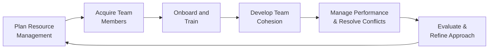

## 21.2 Building and Managing Project Teams

Building and managing effective project teams is about more than simply assembling a group of individuals with the right skill sets. It involves shaping a supportive, collaborative environment that promotes continuous learning, constructive feedback, and collective ownership toward project objectives. This section will introduce best practices for integrating both technical and interpersonal aspects of team formation, highlight methods of onboarding and training, and discuss ongoing development strategies aligned with PMI standards and broader industry approaches.

In conjunction with the concepts covered in Chapter 8 (Team Performance Domain) and Section 21.1 (Estimating Human/Physical Resource Needs), this section dives deeper into the practical steps of establishing and sustaining a cohesive project team. We will explore each stage of team development, underscore the vital leadership behaviors that foster success, and present real-world examples. By refining your techniques for nurturing talent, you ensure that your project teams not only attain organizational objectives but also flourish as individuals and as a collective.

---

## Understanding the Foundations of Team Building

A successful project team is a functional unit aligned on purpose, roles, and responsibilities, and guided by a shared set of values. When the right people are placed in an environment of trust, professionalism, and support, they can more effectively drive project outcomes—even in high-pressure conditions.

• Shared Vision and Objectives: At the foundation of every high-functioning team lies a common vision that resonates with each member’s aspirations. This ensures alignment, commitment, and heightened motivation.  
• Clear Roles and Responsibilities: Defined roles reduce ambiguity, overlap, or gaps in tasks. This clarity also mitigates potential conflicts and allows team members to concentrate on their specific contributions.  
• Mutual Trust and Collaboration: Trust lowers barriers to communication, promotes risk-taking, and encourages critical thinking. In high-trust environments, team members feel psychologically safe discussing potential problems and generating innovative ideas.

---

## Onboarding New Team Members

The onboarding process plays an integral role in setting the tone for new team members. This phase ensures that new hires and reassigned personnel are integrated smoothly into existing workflows, organizational culture, and project-specific nuances.

### Communicating Expectations and Culture

During onboarding, project managers and team leaders should communicate both the technical requirements and the cultural norms of the team:

• Project Context: Provide context about the project’s scope, objectives, and key deliverables. This helps newcomers understand their contributions in relation to the broader picture.  
• Team Charter and Values: Share foundational documents such as the team charter. Highlight the group’s guiding principles (e.g., transparency, respect, continuous improvement) so that new members quickly learn how the team operates.  
• Communication Protocols: Point out preferred communication channels, meeting cadences, and escalation paths. This clarity ensures people know where to find information and how to stay updated.

### Buddy System and Mentorship

To help new recruits acclimate faster, implement a “buddy system” or assign mentors:

• Technical Mentors: Pair these mentors with new hires to hasten learning curves regarding systems, processes, and domain-specific knowledge.  
• Cultural Mentors: Align new members with someone who can introduce them to the organization’s values, relationships, and operational norms. This fosters early acceptance and rapport-building across the team.

### Early Engagement in Project Activities

Encouraging new members to participate in initial deliverables, review sessions, or user story grooming (in agile contexts) allows them to become productive and integrated more rapidly. Early involvement:

• Reinforces a sense of ownership and responsibility.  
• Builds confidence and reduces the feeling of being an “outsider.”  
• Speeds up skill development through hands-on engagement.

---

## Training and Skill Development

Training isn’t merely about upskilling individuals on technical tasks. It should also address soft skills and team-based learning to ensure cohesive collaboration. By merging formal training (classroom, online courses) with interactive methods (workshops, simulations), project managers can create an environment that fosters continuous improvement.  

### Identifying Gaps Through Competency Assessments

Before any training endeavor, assess the current competencies within the team. Techniques such as skill matrices, performance reviews, and gap analyses help pinpoint the areas that require attention.

• Skill Matrices: A straightforward table listing each team member against the required competencies, with proficiency levels indicated.  
• Observation and Feedback: Gather feedback from supervisors, peers, or even customers to discern strengths, weaknesses, and emerging trends in performance.

### Formal and Informal Training Methods

• Formal Training: Workshops, conferences, certification programs, and specialized training can be effective for scaling knowledge across multiple domains (e.g., advanced technical tools, leadership development, negotiation skills).  
• Informal Training: Peer coaching, micro-learning sessions, and knowledge-sharing circles often yield immediate results in knowledge retention.  
• Blended Learning: Consider blending synchronous (real-time) and asynchronous (self-paced) methods for a flexible approach that respects different learning speeds.

### Continuous Learning Culture

Fostering a culture where teams self-direct their learning can yield long-term benefits:

• Lunch-and-Learn Sessions: Quick, informal sessions where one team member shares a skill or insight.  
• Self-Directed Projects: Allocate a percentage of time (like Google’s well-known “20% time”) for passion projects that contribute indirectly to the project’s innovation.  
• Knowledge Repositories: Centralize best practices, FAQs, templates, and project lessons learned. Encourage updates after major milestones.

---

## Developing Team Cohesion

Team cohesion emerges from shared experiences, mutual respect, and a deep understanding of each other’s roles and challenges. A cohesive team typically exhibits high morale, consistent performance, and an ability to adapt swiftly to changes in scope or strategy.

### Tuckman’s Stages of Team Development

The Tuckman Model provides a conceptual roadmap for understanding how teams progress:

• Forming: Members come together with excitement, but individual roles and dynamics remain unclear.  
• Storming: Conflicts may arise as members negotiate roles, power balances, and work styles.  
• Norming: Teams establish guidelines, norms, and collaborative patterns.  
• Performing: Members operate at high efficiency, self-organize effectively, and resolve issues with minimal supervision.  
• Adjourning (or Transforming): The team dissolves once the project ends, or transitions to new challenges.

Project managers should adjust leadership styles, communication methods, and conflict-resolution strategies to match the team’s developmental stage. (For instance, more directive styles during forming, more facilitative approaches during performing.)

### Facilitating Team Bonding

• Team Workshops: Interactive exercises, such as role-play scenarios or practical brainstorming, that cultivate interpersonal understanding and trust.  
• Social Events: Casual meetups, either virtual or in-person, that encourage informal interaction.  
• Retrospectives: Regularly scheduled reviews in agile contexts or “lessons learned” sessions in traditional contexts. These foster transparency and a collective growth mindset.

### Conflict Management as a Cohesion Tool

When handled constructively, conflict can propel creativity and deeper refinement of project deliverables. Chapter 8.2 explores advanced conflict-resolution frameworks, but key takeaways include:

• Address Issues Early: Avoid letting minor misunderstandings fester. Encouraging open discussion fosters trust.  
• Use Structured Techniques: Techniques like the “De Bono’s Six Thinking Hats” or “Structured Debate” can provide a respectful format for addressing conflicting viewpoints.  
• Celebrate Resolutions: Once conflicts are settled, reinforce the positive outcome by recognizing mutual understanding and highlighting the team’s collaborative spirit.

---

## Leadership and Influence

Effective leadership is essential in building and managing project teams. Leaders who demonstrate empathy, active listening, and a commitment to team welfare inspire dedication and motivate individuals to exceed expectations.

### Servant Leadership

A servant leadership model grants power to the team, enabling them to self-organize, identify solutions, and steer their professional growth:

• Removing Roadblocks: A servant leader constantly monitors for impediments and swiftly addresses them to ensure continuous progress.  
• Empowerment: Distribute decision-making to those closest to the tasks for more effective, timely solutions.  
• Psychological Safety: Team members must feel trusted to explore new ideas and admit mistakes without fear of retaliation.

### Management by Exception

In more traditional or hybrid projects, “management by exception” can balance autonomy with managerial oversight:

• Provide Guidance Only When Needed: Let the team tackle challenges with minimal supervision, but remain available for escalation when obstacles arise.  
• Align with Governance Requirements: In regulated environments or large-scale projects, keep your executive sponsors informed without micromanaging each detail.

### Coaching and Mentoring

Leaders who regularly coach and mentor their team members build stronger relationships and higher performance:

• One-on-One Sessions: Validate team members’ concerns and aspirations. Work collaboratively on professional development plans.  
• Encouraging Peer Mentoring: Recognize that mentorship isn’t just top-down. Peer mentoring can be invaluable for continuous learning and morale.

---

## Performance Management and Motivation

Managing and evaluating team performance is an ongoing process that allows for prompt adjustments and continuous feedback loops.

### Setting SMART Objectives

Use SMART (Specific, Measurable, Achievable, Relevant, Time-Bound) objectives to clarify performance targets. This approach helps:

• Eliminate Ambiguity: Each metric or milestone is actionable and verifiable.  
• Enhance Motivation: Individuals see a clear roadmap for success.  
• Simplify Evaluation: Easier tracking ensures no confusion over outcomes.

### Regular Feedback Cycles

• Daily Stand-ups or Huddles: Common in agile settings, these short meetings identify progress, roadblocks, and daily objectives.  
• Weekly or Bi-Weekly One-on-Ones: Provide an avenue to discuss professional development and address challenges before they escalate.  
• Quarterly Performance Reviews: More formal settings to discuss goal progress, new skill sets, or role evolutions.

### Rewards and Recognition

Recognition plays a crucial role in maintaining high morale and loyalty. Some approaches include:

• Financial Rewards: Spot bonuses, merit increases, or profit-sharing for outstanding performance.  
• Non-Monetary Recognition: Certificates of excellence, team-wide announcements, or special privileges (e.g., flexible hours, training opportunities).  
• Celebrations: Acknowledge milestones and achievements with small gatherings or a “virtual toast” if the team is distributed.

---

## Dealing with Distributed and Cross-Cultural Teams

Project teams often span multiple geographies, time zones, and cultures. Effective strategies are paramount to overcome communication barriers and cultural differences.

### Communication Protocols

For remote or hybrid teams, define formal and informal communication methods:

• Collaboration Tools: Platforms like Microsoft Teams, Slack, or Trello for daily updates and synchronous communication.  
• Email Etiquette: Define expectations for response times, subject line conventions, and urgency flags.  
• Virtual Watercooler: Designate channels for casual talk and relationship-building.

### Cultural Sensitivity

• Time Zone Considerations: Rotate meeting times to share the burden or record sessions for asynchronous review.  
• Cultural Awareness Training: Provide short modules or quick references on cultural nuances to avoid misunderstandings or unintentional offenses.  
• Inclusive Decision-Making: Encourage representation from diverse cultural perspectives when making significant decisions.

---

## Practical Workflow for Team Building

Below is a simplified workflow illustrating a continuous cycle of team building and management. While each project may iterate differently, the core activities remain consistent.

• Plan Resource Management: Estimate the type and number of resources needed (see Section 21.1).  
• Acquire Team Members: Align with HR or resource owners to secure the required skills.  
• Onboard and Train: Introduce new members to the project context and necessary skills.  
• Develop Team Cohesion: Apply leadership techniques, encourage trust, and facilitate collaborative culture.  
• Manage Performance & Resolve Conflicts: Continuously monitor metrics, give feedback, and address issues promptly.  
• Evaluate & Refine Approach: Conduct lessons learned to improve future cycles or pivot mid-project as needed.

---

## Case Study: Building a Distributed Software Development Team

Imagine a midsize technology company planning to launch a new software platform. The team is distributed across three continents with varying work cultures and holiday schedules. The project manager faces immediate challenges—misaligned time zones, skill gaps, and language barriers that impede collaboration.

1. Resource Planning: The project manager collaborated with departmental heads to establish a skill matrix. This matrix revealed the need for a DevOps engineer with cloud deployment experience and a user experience (UX) designer fluent in user research.  
2. Talent Acquisition: HR was engaged promptly. The team landed an experienced DevOps engineer in India and a UX designer in France.  
3. Onboarding & Training: Both new hires received an extensive project orientation, buddy mentors, and asynchronous training modules that addressed the local constraints of time zones. Mentoring sessions were scheduled in overlapping hours.  
4. Team Cohesion Strategies: The project manager organized a series of “virtual coffee chats” and a monthly rotating schedule of knowledge-sharing sessions, where each region took turns demoing accomplishments and learned techniques.  
5. Performance Management: Using agile sprints, daily stand-ups allowed the manager to detect coordination issues early (e.g., environment setup difficulties or unclear acceptance criteria). Conflicts were resolved by a structured approach that allowed each team member to express concerns before exploring solutions.  
6. Lessons Learned: In each sprint retrospective, the cross-cultural aspects of collaboration were highlighted. The user research in France excelled, but the final deployment got delayed due to bridging time zone differences. The entire process was refined further by creating a more explicit review schedule for code merges.

This case study underscores the complexity of distributed teams and highlights the importance of coordinated communication, robust onboarding, and continuous adaptation.

---

## Overcoming Common Pitfalls

Despite best efforts, project teams may encounter challenges that derail productivity:

• Insufficient Onboarding: Rushed or incomplete orientations can lead to confusion and lowered productivity.  
• Neglected Soft Skills: Overemphasis on technical prowess may ignore underlying interpersonal conflicts that undermine team efficiency.  
• Resistance to Change: Team members might be reluctant to adopt new tools, processes, or workflows, leading to collaboration breakdowns.  
• Lack of Follow-Through on Lessons Learned: Conducting retrospectives is only half the equation; implementing the improvements is crucial.

To mitigate these pitfalls, develop a resilient plan that incorporates clearly documented processes for communication, continuous training, and conflict resolution. Acknowledge every setback as an opportunity for refining the team’s structure, processes, or culture.

---

## References for Further Exploration

• Agile Practice Guide, PMI: Excellent resource for learning how agile methods impact team dynamics and performance optimization.  
• People Domain, PMP® Exam Content Outline, PMI: Recommended reading to master the exam topics related to managing, motivating, and directing people.  
• Drive by Daniel H. Pink: Insightful book on intrinsic and extrinsic motivation, helpful for team-building strategies.  
• Situated Learning by Etienne Wenger: Explores how communities of practice can enhance knowledge exchange and team learning.  
• Emotional Intelligence 2.0 by Travis Bradberry and Jean Greaves: A foundational text for understanding the role of emotional intelligence in effective leadership.

---

## Quiz: Mastering the Essentials of Team Building and Management



### Which of the following is a key benefit of implementing a formal onboarding process for new project team members?

- [x] It accelerates their integration and helps them quickly understand project context and culture.
- [ ] It eliminates the need for ongoing training later in the project.
- [ ] It guarantees no resignations within the first six months.
- [ ] It completely avoids any form of conflict on the team.

> **Explanation:** Formal onboarding helps new team members quickly assimilate the culture, context, and requirements of the project. It shortens the learning curve, leading to faster integration and productivity. However, it does not eliminate needs for additional training or conflicts entirely.

### Which technique helps to identify specific training needs across an entire project team?

- [ ] Daily stand-up meetings.
- [x] Skill matrix or competency assessment.
- [ ] Gantt chart scheduling.
- [ ] Weekly project status reports.

> **Explanation:** A skill matrix or competency assessment maps existing skills versus the required skills, pinpointing the gaps that training can address. It is a more direct and structured approach than daily meetings or project Status Reports.

### During the “storming” stage of Tuckman’s model, which type of project management style is often most appropriate?

- [x] A conflict-mediation style that helps address disputes and clarify roles.
- [ ] A highly directive, top-down style that silences any disagreements.
- [ ] A completely hands-off style that lets the team run itself.
- [ ] Delegative style that puts all decisions on the sponsor.

> **Explanation:** Tuckman’s “storming” stage involves disagreements over work styles and roles. A facilitative approach that mediates conflicts, clarifies expectations, and supports collaborative problem-solving is critical for moving to the “norming” stage.

### In a distributed project team that spans multiple time zones, which strategy best promotes effective collaboration and relationship-building?

- [ ] Require every team member to adjust to a single standard time zone.
- [ ] Limit communication to emails only.
- [x] Schedule rotating meeting times and offer asynchronous collaboration tools.
- [ ] Avoid scheduling any real-time meetings at all.

> **Explanation:** Scheduling meetings in rotating time slots is beneficial to share the inconvenience equitably. Tools that enable asynchronous collaboration (e.g., shared documents, recorded sessions) further support effective communication globally.

### What is a key advantage of establishing a blended (in-person and online) learning program for team training and development?

- [x] It addresses diverse learning preferences and schedules.
- [ ] It completely replaces any face-to-face interactions.
- [x] It promotes both technical and interpersonal growth.
- [ ] It dramatically extends the project timeline.

> **Explanation:** A blended or hybrid learning model accommodates varying schedules, makes content accessible to both in-person and remote team members, and caters to diverse learning styles. It can also integrate technical instruction with soft-skill development.

### Which of the following is NOT typically a servant leadership practice?

- [x] Focusing on personal recognition for all successes.
- [ ] Removing impediments for the team.
- [ ] Encouraging the team to self-organize and make decisions.
- [ ] Supporting each team member’s growth and well-being.

> **Explanation:** Servant leadership focuses on the team’s success over individual accolades. It places emphasis on removing obstacles, supporting growth, and empowering members rather than seeking personal recognition.

### When addressing a conflict between two team members, which approach is usually most effective?

- [x] Facilitate a private discussion to help both parties find common ground.
- [ ] Publicly reprimand both team members during a meeting.
- [x] Encourage them to utilize active listening and propose possible win-win solutions.
- [ ] Ignore the conflict unless it affects the entire team’s timeline.

> **Explanation:** Resolving conflicts typically begins privately, where the project manager or team lead fosters a safe environment for constructive discussion. Encouraging active listening and shared brainstorming often leads to a resolution that benefits everyone.

### Which of the following describes a good practice for performance reviews in a project environment?

- [x] Provide continuous feedback and align reviews with well-defined project milestones.
- [ ] Postpone reviews until the project has finished.
- [ ] Conduct overly formal, once-a-year sessions without in-between updates.
- [ ] Only review senior team members’ performance.

> **Explanation:** Frequent reviews tied to project milestones or sprints allow immediate feedback, enabling timely course corrections. Infrequent or overly formal reviews can cause delays in uncovering performance issues or skill gaps.

### What is the most important outcome of conducting retrospective meetings or lessons learned sessions?

- [x] Identifying areas of improvement and applying them to future iterations.
- [ ] Issuing punishments for mistakes made during the project.
- [ ] Filing documentation that no one reads.
- [ ] Extending project timelines arbitrarily.

> **Explanation:** The primary goal of retrospectives or lessons learned sessions is to uncover areas that need refinement and apply those insights to upcoming iterations or future projects. They ensure a cycle of continuous improvement.

### A project manager advocates for a “buddy system” in the workplace. Is this likely to help new team members integrate more quickly?

- [x] True
- [ ] False

> **Explanation:** Absolutely. A buddy system pairs an experienced team member with a newcomer, offering personalized guidance, accelerating knowledge transfer, and fostering relationships, which leads to faster integration.



---

## PMP Mastery: 1500+ Hard Mock Exams with Full Explanations

Looking to crush the PMP exam with confidence? Dive deep into 6 rigorous mock exams totaling 1500+ advanced-level questions, each accompanied by clear, step-by-step explanations. Hone your test-taking strategies, master complex topics, and build the resilience you need on exam day. Perfect for serious PMs aiming beyond fundamentals.

Enroll now:  
[PMP Mastery: 1500+ Hard Mock Exams with Exceptional Clarity & Full Explanations](https://www.udemy.com/course/pmp-2025/?referralCode=CF83A54BC86BE27F9AFE)

_Disclaimer: This course is not endorsed by or affiliated with the PMI examination authority. All content is provided purely for educational and preparatory purposes._
