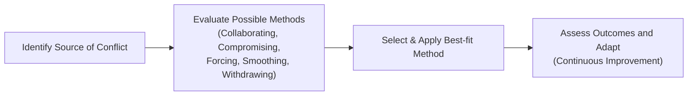
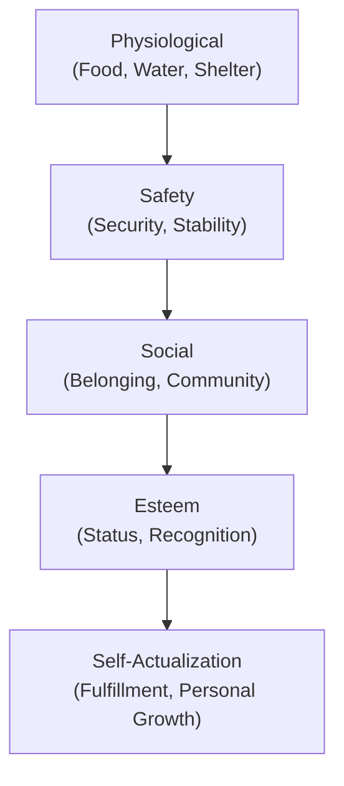

## 21.3 Conflict Resolution and Motivation Theories

Effective resource management in project settings involves not only logistic arrangements of personnel and materials but also the alignment of human factors such as conflict resolution and team motivation. Skilled project managers recognize that conflicts—though sometimes uncomfortable—often stimulate creativity, challenge assumptions, and foster innovation. When paired with a motivational environment, conflicts can unlock better decisions and drive team engagement to higher levels. Conversely, unresolved conflicts or misunderstanding of motivational needs can quickly derail a team’s morale and performance.

In this section, we explore practical conflict resolution strategies and foundational motivation theories. You will learn both the “how” and the “why” of guiding teams through difficulties, aligning interpersonal dynamics, and fostering a productive culture. These insights are essential for earning the Project Management Professional (PMP)® certification and succeeding as a leader in any project environment.

---

### Understanding Conflict in Project Management

Conflict is a natural phenomenon in teams of all sizes, particularly when diverse disciplines, personalities, and objectives converge. Proactive conflict management ensures these frictions do not escalate into destructive confrontations. In fact, well-managed conflicts can spark important debates that lead to better decisions, a stronger sense of ownership, and improved relationships.

Common sources of conflict in project teams:
- Competing priorities for time and resources.  
- Differing personal styles and cultural perspectives.  
- Unclear accountability or scope ambiguity.  
- Organizational and stakeholder pressures.  
- Rapid changes in requirements or schedules, especially in agile and hybrid contexts.  

Understanding these triggers helps anticipate brewing tensions so that they can be addressed before they become detrimental to project outcomes.

---

### Common Conflict Resolution Methods

The Project Management Institute (PMI) outlines several methods for resolving conflicts. Each method has its place and is appropriate under different circumstances. A good project manager knows how to select and apply these techniques with discretion, assessing the situation and tailoring the response.

#### Collaborating

- Also known as Problem Solving or Win-Win.  
- Focuses on finding a solution that fully satisfies all parties’ concerns.  
- Encourages open dialogue, mutual respect, and creativity to integrate different viewpoints.  
- Requires a willingness to invest time and effort to explore root causes and brainstorm solutions.  
- Builds trust and long-term positive relationships.

#### Compromising

- Also called Give-and-Take or Half-Win/Half-Lose.  
- Each side makes concessions to reach a workable solution.  
- Useful when time is limited, and both parties have strong positions.  
- Can be effective in resolving immediate issues, but may leave some dissatisfaction if not managed carefully.

#### Smoothing (Accommodating)

- Also referred to as Accommodating.  
- Emphasizes areas of agreement and downplays disagreement in order to maintain harmony.  
- May be used when preserving relationships is more critical than the issue at hand.  
- Risky if overused, as the underlying conflict might remain unresolved and resurface later.

#### Forcing (Directing)

- Implies using authority or power to impose a solution, often quickly.  
- Effective in emergency situations where swift action is needed.  
- Potential to harm relationships, trust, and team morale if used frequently or without transparency.  
- Can undermine collaboration and long-term problem-solving capacity.

#### Withdrawing (Avoiding)

- Deliberately retreating from or postponing a conflict situation.  
- May be appropriate when the conflict is trivial or when other pressing issues take precedence.  
- Risks allowing unresolved tension to escalate if used as a permanent escape strategy.

Using these conflict resolution methods is often a balancing act; each approach has merits under certain conditions. The overarching goal is to maintain project momentum while preserving team cohesion. In practice, many conflicts require a blend of strategies depending on the evolving context and the personalities involved.

Below is a simple Mermaid diagram illustrating the steps a project manager might take upon identifying a conflict, choosing a resolution method, and implementing and assessing outcomes.

---

### Cultural and Emotional Intelligence in Conflict Resolution

In today’s globalized workplaces, cultural differences can heighten miscommunication, particularly regarding conflict management. Emotional intelligence (EI) and cultural awareness both play a pivotal role. Emotional intelligence fosters empathetic discussions and minimizes escalating tensions through:

- Self-awareness of one’s triggers and stress signals.
- Empathy to interpret the deeper concerns behind another’s behavior.
- Active listening, giving full attention, paraphrasing, and validating.
- Relationship building that encourages trust and psychological safety.

---

### Connecting Conflict Resolution and Motivation

Conflict resolution often goes hand-in-hand with motivating teams. Addressing performance, morale, and workload concerns is less about imposing top-down solutions and more about understanding the motivational drivers of each individual. This is where the following motivation frameworks provide a lens to examine what truly inspires people to perform and collaborate.

---

### Major Motivation Theories

Motivation is the internal or external drive that compels individuals to take action. In project management, leveraging motivation theories enables project managers to boost engagement, reduce turnover, and facilitate conflict resolution. The following major frameworks guide our understanding of human motivation:

#### Maslow’s Hierarchy of Needs

Developed by Abraham Maslow, this theory posits that human needs are arranged in a hierarchy, starting from the most fundamental physiological requirements to higher-level psychological needs.

- Individuals must satisfy lower-level needs (physiological and safety) before they can fully focus on higher-level needs (social, esteem, and self-actualization).  
- Project managers can enhance motivation by ensuring the team’s fundamental concerns—like job security, a safe environment, and inclusion—are addressed.  
- Fostering recognition programs and challenging opportunities supports higher-level needs.

#### Herzberg’s Two-Factor Theory

Frederick Herzberg proposed that two categories of factors influence job satisfaction and dissatisfaction:

- Hygiene Factors (extrinsic): Salary, benefits, working conditions, company policy. These factors can cause dissatisfaction if inadequate but do not necessarily motivate when present.  
- Motivators (intrinsic): Achievement, recognition, the work itself, responsibility, growth. These factors truly encourage individuals to give their best.

Implication: Ensure that basic organizational policies (hygiene) are not causing discontent, and then focus on intrinsic motivators—like meaningful work and professional growth—to positively increase motivation.

#### McClelland’s Acquired Needs Theory

David McClelland suggested that motivation is driven by three key needs:

1. Achievement (drive to succeed or accomplish tasks and goals).  
2. Affiliation (desire for social relationships, belonging, and interaction).  
3. Power (desire to influence and direct others).

In a project environment, it is helpful to recognize that some team members may be strongly motivated by visible achievements (like delivering high-value features), others by cohesive group dynamics, and still others by leadership responsibilities. Tailoring tasks and roles accordingly can enhance engagement and minimize conflicts rooted in unmet motivational needs.

#### McGregor’s Theory X and Theory Y

Douglas McGregor identified two contrasting views on workforce motivation:

- Theory X: Assumes employees are inherently lazy and avoid work, requiring close supervision and strict control.  
- Theory Y: Sees employees as internally motivated, seeking responsibility, and that, given the right conditions, want to develop and contribute.

While McGregor did not recommend one view over the other categorically, he believed that Theory Y assumptions are more often self-fulfilling; teams given trust, autonomy, and resources naturally exhibit higher motivation. Project managers aligned with Theory Y typically foster collaborative cultures that encourage constructive conflict resolution rather than punitive approaches.

#### Vroom’s Expectancy Theory

Victor Vroom’s theory posits that an individual’s motivation depends on:
- Expectancy: The belief their effort will lead to desired performance.  
- Instrumentality: The perception that good performance leads to tangible or intangible rewards.  
- Valence: The value attached to those rewards.

For example, a team member who believes (1) they can successfully complete a task, (2) that completing it will lead to recognition or a monetary bonus, and (3) that such a bonus is personally meaningful, will be more motivated to excel. If any link in the chain is weak—e.g., if they suspect the reward is unfair or worthless—the motivational drive diminishes.

---

### Applying Motivation Theories to Conflict Resolution

Motivation and conflict resolution intersect in multiple ways:

- A demotivated environment often fosters resentments, misunderstandings, and blame-shifting.  
- Once conflict arises, skillful project managers assess the underlying needs—lack of recognition, perceived inequities, or the desire for greater autonomy—and address them proactively.  
- Using Maslow’s or Herzberg’s frameworks helps managers pinpoint basic issues (e.g., pay fairness, perceived disrespect) before employing conflict resolution methods.  
- McClelland’s needs (achievement, affiliation, power) provide insight into potential triggers. A high-achiever, for example, might feel frustrated if forced to constantly compromise quality for schedule.  
- A Theory Y approach can transform conflicts into collaborative problem-solving sessions that engage and empower the team.

---

### Practical Tips and Best Practices

1. Identify the Core Issue:  
   Before jumping into resolution, take a moment to diagnose the real cause. Are team members overworked, lacking clarity on tasks, or feeling undervalued?

2. Choose the Appropriate Tactic:  
   Use collaborating and compromising when it serves the project goals and fosters lasting team cohesion. Reserve forcing for emergencies, and avoid withdrawing unless it’s genuinely a trivial or temporary matter.

3. Reinforce Positive Conflict:  
   Distinguish constructive debate from personal attacks. Encourage open dialogue so that differing viewpoints emerge and get resolved productively.

4. Leverage Motivational Drivers:  
   For instance, if you see that an individual is high in “achievement” needs (McClelland), offer them challenging tasks with clear metrics of success. If an individual is strongly social, emphasize group-oriented tasks and social recognition.

5. Keep Communication Channels Open:  
   Transparency regarding project goals, roles, and constraints reduces uncertainty, a common cause of conflict. Frequent check-ins help catch tensions early.

6. Acknowledge Great Work Openly:  
   Publicly recognize achievements—this satisfies both Esteem needs (Maslow) and the need for Recognition (Herzberg’s motivators). It also defuses resentments that can bubble up when recognition seems scarce.

7. Regularly Monitor Team Climate:  
   Set up short retrospectives or one-on-ones to gauge morale. In agile settings, use daily standups and iteration reviews to spot and address conflict sources quickly.

---

### Real-World Scenario

Imagine a cross-functional project team working on a new software product. The designer (motivated by creativity and affiliation) clashes with the developer (motivated by achievement and aligned with strict deadlines) over design changes. The developer sees these iterative design tweaks as time sinks that jeopardize milestone commitments, while the designer feels unappreciated and stifled by schedule constraints.

- Conflict arises because each perceives the other’s priorities as dismissal of important needs (quality design versus timely delivery).  
- A quick fix via forcing could mean the project manager siding with the developer to stay on schedule. While it might solve short-term timeline issues, it risks demoralizing the designer, who might lose motivation or refuse to collaborate.  
- A better approach is collaboration: The manager arranges a brainstorming session where both parties discuss the necessity of refined design and the need for timely delivery. By clarifying responsibilities and timelines, they strike an agreement on how many design revisions are feasible within each sprint. This approach respects each person’s motivations and fosters an environment of trust.  
- The team emerges with a stronger sense of ownership, having discovered a middle ground that upholds visual quality and meets the iteration schedule.

---

### Common Pitfalls and How to Avoid Them

- Overemphasis on One Method: Reliance on forcing can alienate the team, while excessive smoothing can bury underlying problems.  
- Neglecting Ground-Level Needs: If the team is anxious about job security due to organizational changes, higher-level motivations like innovation may stall.  
- Treating Everyone the Same: Individuals are uniquely motivated; a heavy-handed universal approach may inadvertently lead to conflict and resentment.  
- Avoiding Conflict Completely: Hoping it “goes away on its own” usually lets pressure mount until it explodes in more damaging ways.

---

### Integrating These Concepts in the PMP® Exam Context

The PMP® exam expects you to understand not only project management processes but also how behavioral, interpersonal, and motivational factors influence teamwork and outcomes. Conflict resolution strategies and motivation theories connect directly with domains such as People (leading teams, conflict resolution) and Process (ensuring smooth project execution). Questions often present scenarios where choosing the right approach and aligning it with an understanding of what drives team members’ performance is key to identifying the best solution.

Cross-Reference:  
- For further insights into building high-performing teams, see Chapter 8: “Team Performance Domain.”  
- For leadership behaviors and stakeholder engagement, see Chapter 5: “PMI’s 12 Project Management Principles,” specifically sections on Stewardship, Collaboration, and Stakeholder Engagement.

---

### Further Exploration and References

Below are some resources to deepen your understanding of conflict resolution and motivation theories:

1. Project Management Institute (PMI). (2021). A Guide to the Project Management Body of Knowledge (PMBOK® Guide) – Seventh Edition.  
2. PMI’s Agile Practice Guide.  
3. Maslow, A. (1954). Motivation and Personality.  
4. Herzberg, F. (1966). Work and the Nature of Man.  
5. McClelland, D. (1975). Power: The Inner Experience.  
6. McGregor, D. (1960). The Human Side of Enterprise.  
7. Vroom, V. H. (1964). Work and Motivation.  
8. Harvard Business Review. (Various articles on leadership, conflict resolution, and motivation).  

Continuing to study these topics equips project managers with robust tools for leading teams through the complex interpersonal challenges that arise on every project. By applying the theories and methods described here, you can reduce friction, enhance motivation, and guide your team to consistently deliver high-value results.

---

## Test Your Knowledge: Conflict Resolution & Motivation Quiz



### When dealing with a project conflict, which approach aims for a win-win solution and emphasizes both parties’ concerns?  
- [ ] Forcing (Directing)  
- [ ] Smoothing (Accommodating)  
- [ ] Withdrawing (Avoiding)  
- [x] Collaborating (Problem Solving)  

> **Explanation:** Collaborating (or Problem Solving) is the approach designed to integrate both parties’ concerns, aiming to find a solution that satisfies everyone (win-win).

### According to Herzberg’s Two-Factor Theory, which factor below is classified as a “hygiene factor”?  
- [ ] Achievement  
- [ ] Recognition  
- [ ] Responsibility  
- [x] Company policy  

> **Explanation:** Hygiene factors include salary, work conditions, and company policy. While these factors do not necessarily motivate when present, their absence can cause dissatisfaction.

### Which motivation theory states that an individual’s performance is influenced by expectancy, instrumentality, and valence?  
- [ ] McClelland’s Acquired Needs Theory  
- [x] Vroom’s Expectancy Theory  
- [ ] McGregor’s Theory X and Theory Y  
- [ ] Maslow’s Hierarchy of Needs  

> **Explanation:** Vroom’s Expectancy Theory focuses on three components of motivation: expectancy (effort leads to performance), instrumentality (performance leads to outcomes), and valence (value of outcomes).

### In McClelland’s Acquired Needs Theory, the need for affiliation primarily concerns:  
- [ ] The desire for autonomy and freedom.  
- [x] Building and maintaining close personal relationships.  
- [ ] The drive to dominate others through authority.  
- [ ] Fulfilling baseline safety requirements.  

> **Explanation:** The need for affiliation concerns establishing and nurturing social or interpersonal relationships within a team.

### In conflict management, which method is particularly effective for urgent or critical situations that demand rapid decision-making?  
- [ ] Smoothing  
- [ ] Collaborating  
- [x] Forcing  
- [ ] Compromising  

> **Explanation:** Forcing (or Directing) can be used in high-stakes emergencies where an immediate resolution is crucial. While not ideal for long-term relationships, it provides swift action under pressure.

### Which of the following best describes McGregor’s Theory X assumption?  
- [x] Employees require strict supervision because they are inherently lazy and avoid work.  
- [ ] Employees have a natural drive to engage, be creative, and need only guidance to flourish.  
- [ ] Employees thrive under flexible hours and remote environments.  
- [ ] Employees primarily respond to open-ended tasks and performance-based incentives.  

> **Explanation:** McGregor’s Theory X posits that workers generally dislike work, avoid responsibility, and require strong supervisory controls.  

### Which approach might a project manager use initially if the conflict is deemed trivial or other issues are more immediate?  
- [ ] Compromising  
- [ ] Forcing  
- [x] Withdrawing  
- [ ] Collaborating  

> **Explanation:** Withdrawing (or Avoidance) is sometimes used if the conflict is of low importance or there are pressing priorities elsewhere. However, it carries the risk of unresolved tensions.

### What is the primary reason Maslow’s Hierarchy is depicted as a pyramid?  
- [ ] It illustrates that every level has the same priority.  
- [x] It demonstrates that lower-level needs (Physiological, Safety) must be satisfied before higher-level needs (Esteem, Self-Actualization).  
- [ ] It suggests needs can be pursued in any random sequence.  
- [ ] It indicates people usually reach all levels simultaneously.  

> **Explanation:** The ascending structure of the pyramid highlights that individuals commonly seek fulfillment of essential needs before progressing to more advanced needs.

### Which conflict resolution technique often involves each party making concessions to arrive at a mutually acceptable, partial satisfaction of objectives?  
- [x] Compromising  
- [ ] Collaborating  
- [ ] Forcing  
- [ ] Smoothing  

> **Explanation:** Compromising (Give-and-Take) is a strategy in which both parties make some concessions for a partially satisfactory solution.

### A team member on a project believes they can accomplish their tasks and that if they do well, they will be rewarded with a meaningful perk. According to Vroom’s Expectancy Theory, this describes:  
- [x] Expectancy + Instrumentality + Valence  
- [ ] Achievement + Affiliation + Power  
- [ ] Physiological + Safety + Esteem  
- [ ] Hygiene Factors + Motivators  

> **Explanation:** This scenario perfectly aligns with Vroom’s Expectancy Theory, in which the individual (1) expects to succeed, (2) trusts that success will be rewarded, and (3) values the reward.



---

## PMP Mastery: 1500+ Hard Mock Exams with Full Explanations 

Looking to crush the PMP exam with confidence? Dive deep into 6 rigorous mock exams totaling 1500+ advanced-level questions, each accompanied by clear, step-by-step explanations. Hone your test-taking strategies, master complex topics, and build the resilience you need on exam day. Perfect for serious PMs aiming beyond fundamentals.  

Enroll now:  
[PMP Mastery: 1500+ Hard Mock Exams with Exceptional Clarity & Full Explanations](https://www.udemy.com/course/pmp-2025/?referralCode=CF83A54BC86BE27F9AFE)  

_Disclaimer: This course is not endorsed by or affiliated with the PMI examination authority. All content is provided purely for educational and preparatory purposes._
