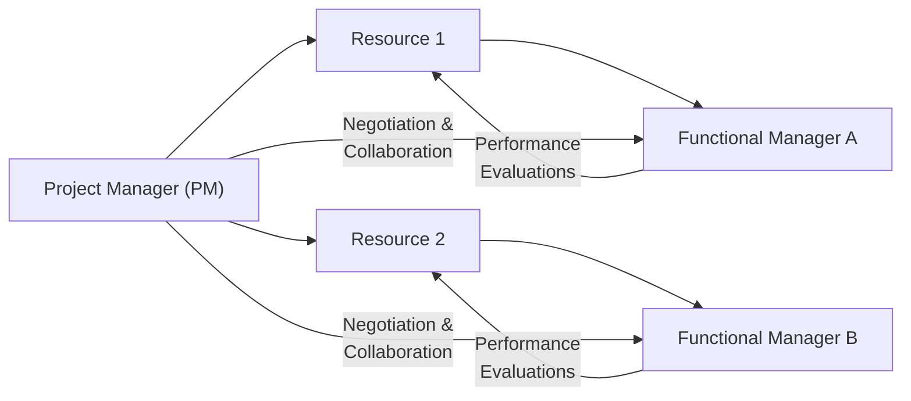

## 21.4 Influencing Matrixed or Shared Resources

In many modern organizations, a project manager’s authority over resources is often limited or shared due to matrix structures, cross-functional teams, or specialized skills distributed across different departments. Successfully executing projects within these conditions demands strong negotiation, interpersonal, and influence skills. While traditional project management pays close attention to resource planning and assignment, a matrix environment requires deeper awareness of stakeholder interests, transparent communication, and continuous collaboration.

In this section, we explore the core challenges, negotiation strategies, and leadership practices needed to effectively influence matrixed or shared resources. We also examine how to proactively engage line managers and subject matter experts (SMEs) whose support is critical to project success—especially when these resources report to multiple leaders or split their time among various projects. By mastering these concepts, you will develop the confidence and capability to ensure your project’s resource requirements are consistently met in even the most complex organizational structures.

---

### Understanding Matrix Environments

A matrix organization typically blends functional departments—such as finance, engineering, or marketing—with cross-functional project teams. In a matrix setting:

• Team members report to both a functional manager and one or more project managers.  
• Findings, decisions, and priorities may emerge from overlapping lines of authority.  
• Collaboration is essential, but conflicts or competition over shared resources can arise.

Matrix environments form for various strategic reasons (see also Chapter 4: Project Management Fundamentals and Chapter 28: Aligning Projects with Organizational Strategy). By combining expertise from disparate functions and allowing resources to be allocated more flexibly, organizations can respond dynamically to market demands. Yet for project managers, the downside is the reduced degree of direct authority. You may be accountable for meeting project objectives without the power to independently assign or prioritize resources.

---

### Common Challenges in Matrixed or Shared Resource Settings

1. Competing Priorities:  
   In dynamic environments, resources have to juggle functional tasks and multiple projects simultaneously. A marketing specialist, for example, may be called on to support two product launches at once while still meeting day-to-day departmental goals.

2. Dependency on Functional Managers:  
   Even if your project is of high priority, functional managers typically control staff evaluations, promotions, or training budgets. Without alignment at the managerial level, your resource requests can fall down the priority list.

3. Limited Visibility and Tracking:  
   Since resources may be dispersed across various departments or external partners, project managers often struggle to maintain up-to-date visibility on resource availability, scheduling, and workload. This uncertainty can lead to scheduling conflicts, delayed deliverables, and cost overruns.

4. Cultural and Behavioral Differences:  
   Teams come from different functional backgrounds, each with its own culture, work styles, or assumptions. Balancing these differences demands a keen understanding of stakeholder motivations and the ability to unify them under shared project objectives.

5. Communication Barriers:  
   Matrix organizations often span geographical locations and time zones, which complicates face-to-face communication. Virtual collaboration must be carefully structured to keep distributed teams aligned and motivated.

---

### Core Skills for Influencing Without Direct Authority

While direct authority is often limited in a matrix, effective project managers cultivate indirect leadership methods. Below are key competencies for success:

• Negotiation & Conflict Management  
• Empathy & Active Listening  
• Relationship Building  
• Credibility & Expertise  
• Transparent Communication  
• Adaptability & Flexibility  

Rather than issuing directives, matrix-savvy project managers negotiate timelines, tasks, and commitments with team members and stakeholders. They actively listen to stakeholders’ interests and constraints, seeking creative solutions that satisfy multiple parties simultaneously (see also Chapter 16: Stakeholder and Communications Management).

---

### The Role of Negotiation

Negotiation is a structured discussion aimed at reaching a mutually acceptable agreement. In the context of matrixed or shared resources, negotiation can arise in many forms:

• Requesting partial or dedicated allocation of a key SME’s time from a line manager.  
• Adjusting project timelines to accommodate functional deadlines.  
• Opening a dialogue with a peer project manager about sharing capacity or rotating specialized staff.  
• Resolving priority conflicts between your project objectives and functional targets.  

Effective negotiation preserves relationships, fosters trust, and builds goodwill for future collaboration. Key negotiation strategies include:

1. Preparation:  
   Understand your project’s resource requirements thoroughly, including tasks, durations, and critical paths. Also, research departmental workloads, strategic goals, or political dynamics that could impact your request.

2. BATNA (Best Alternative to a Negotiated Agreement):  
   Define fallback options if you cannot secure the desired resource. Examples: pulling external contractors, adjusting project scope, or extending timelines. Knowing your alternatives gives you leverage and clarity.

3. Active Listening & Questioning:  
   Explore the concerns of other parties. Are they worried about resource burnout, budget constraints, or conflicting deliverables? Identifying shared interests leads to creative compromises.

4. Principled Bargaining:  
   Instead of bargaining on positions (e.g., “I need Sarah 100% next week”), focus on underlying interests (e.g., “We must ensure the marketing content is finalized by our sponsor’s milestone, how can we align Sarah’s schedule to achieve that?”). This approach encourages problem-solving rather than confrontation.

5. Closure & Follow-Up:  
   Once you obtain agreement, confirm specifics in writing or messaging channels. Clarify who is responsible, by when, and for what tasks. Conduct regular check-ins to maintain alignment, particularly in ongoing resource-sharing scenarios.

---

### Building Collaborative Relationships

Matrix structures thrive on strong interpersonal ties and trust. Below are proven techniques to strengthen collaborative relationships:

• Proactive Socializing:  
  Take advantage of in-person events, team building workshops, or even coffee chats to nurture informal connections. This fosters goodwill and can reduce communication friction later. For virtual teams, coordinate brief shared “virtual coffee breaks” or quick videos to replicate in-person bonding.

• Shared Goals & Mutual Success:  
  Emphasize how each stakeholder’s success is intertwined with the project’s larger objectives. Show how project deliverables can positively impact their department or career. This alignment helps transform an individual’s mindset from “I’m juggling more tasks” to “I’m contributing to meaningful outcomes.”

• Consistent Recognition:  
  Celebrate and thank contributors publicly. A well-crafted thank-you email can not only motivate individuals but also signal to their functional managers that the resource’s efforts are valued. This can pay dividends when you need additional resource support.

• Win-Win Approaches to Conflict:  
  Many resource conflicts are best resolved by finding solutions that work for all parties—for instance, negotiating phased or partial usage of a resource that addresses essential tasks for each stakeholder.

---

### Case Study: Balancing Analytics Experts Across Two Projects

Scenario:  
You are overseeing a product launch with a critical analytics component. However, the analytics team lead is also committed to an enterprise-wide reporting overhaul for the CFO’s department.

Actions Taken:  
1. You schedule a meeting with the analytics team lead and the CFO’s project manager to review upcoming tasks and timelines.  
2. By mapping each project’s milestones in a shared timeline, you identify a four-week overlap where both projects require the same data experts.  
3. Through a series of negotiation workshops, you agree to “time-slice” the experts so that the CFO’s reporting tasks happen early in the morning, while your product analytics tasks happen in the afternoon.  
4. You set up weekly stand-ups (similar to agile practices in Chapter 25: Agile Frameworks) with the analytics lead to address emerging constraints and re-scope tasks as necessary.  

Outcome:  
While neither project obtained 100% dedication, the carefully structured time-slicing approach allowed each project to meet its critical deadlines. The analytics experts reported a clear schedule, reduced confusion about daily priorities, and consistently delivered on both sets of tasks.

---

### Conflict Resolution and Leadership

In a matrix, conflicts often manifest in subtle ways. A missed deadline by one resource can stall progress for the entire project. Tension can arise between the project manager, who must meet sponsor expectations, and the functional manager, who wants to preserve departmental goals. To manage such conflicts:

1. Identify Root Causes:  
   Is the conflict purely about workload distribution? Or a question of project priority? Or linked to personality clashes and power dynamics?

2. Foster Open Dialogue:  
   Apply emotional intelligence (see Chapter 33: Advanced Leadership and Team Development) when listening to concerns. Encourage respectful communication, focusing on shared objectives rather than personal blame.

3. Leverage the Chain of Command Wisely:  
   Escalation is a last resort but may be necessary if negotiation fails and critical resources remain blocked. Always maintain a professional, solution-oriented tone when involving senior management.

4. Mediate & Revisit Agreements:  
   Conflicts are seldom resolved in a single meeting. Mediation may require multiple sessions with distinct leaders until a fair compromise is reached. Topic-based conflict resolution fosters transparency, ensuring each side’s viewpoint is heard.

---

### Tools and Techniques for Managing Shared Resources

To maintain visibility, track commitments, and sustain alignment over time, project managers can rely on a variety of tools:

1. RACI Charts (Responsible, Accountable, Consulted, Informed):  
   A RACI matrix ensures clarity of responsibilities, especially in environments where multiple stakeholders share tasks. Update it regularly to handle new resource constraints or role changes.

2. Resource-Leveling and Resource-Smoothing:  
   These scheduling techniques help you identify overload or slack periods in your resource assignments. If your project uses the Critical Path Method (CPM), you can apply resource-leveling upon tasks with available float to alleviate bottlenecks.

3. Time-Phased Resource Schedules:  
   In matrix teams, clearly detailing when each resource is needed and to what extent (e.g., two hours in the morning for the project, four hours for department tasks) can reduce scheduling conflicts.

4. Collaboration Platforms and Dashboards:  
   Tools like Microsoft Teams, Slack, or Jira can boost transparency around tasks, progress, and priorities. Managers and team members can instantly see who is working on what, preventing duplication or confusion in a multi-project environment.

5. Rolling Wave Planning:  
   Since matrix environments often experience rapid changes, short-term detailed planning combined with longer-term high-level planning (see Chapter 10: Planning Performance Domain) can keep resources optimally allocated.

---

### Influence and Stakeholder Alignment Diagram

The following Mermaid diagram illustrates a simplified matrix structure, showing how various roles intersect in a matrix project environment. The project manager often negotiates with functional managers or departmental leads to secure resource time and manage priorities.

Explanation:  
• The Project Manager (A) coordinates directly with Resources 1 (B) and 2 (C).  
• However, line managers (D and E) retain formal authority over performance evaluations, thereby influencing resource engagement.  
• Productive negotiation and collaboration lines (shown as dotted lines from (A) to (D) and (E)) are critical to secure alignment and maintain positive relationships.

---

### Balancing Agile Practices in a Matrix

Agile teams typically operate with dedicated staff who remain within the team throughout sprints or iterations. In a matrix environment, such dedication might not be possible. Hybrid solutions include:

• Partial Dedication:  
  Allocating resources to certain Agile ceremonies (sprint planning, reviews, stand-ups) but allowing them flexibility to address urgent tasks in their functional department.  

• Agile Mentors or Coaches:  
  Engaging Agile coaches to facilitate short cycles of improvement in cross-functional teams. This approach helps adapt the Agile mindset in a complex organizational structure.  

• Continuous Feedback Loops:  
  Conducting frequent alignment sessions with functional managers to discuss velocity, backlog priority, and potential workload conflicts, ensuring they remain supportive of the Agile approach (see also Chapter 27: Hybrid Approaches).

---

### Best Practices and Practical Tips

• Develop Personal Credibility:  
  When you showcase deep knowledge of project requirements or relevant domain expertise, team members and sponsors are more likely to trust your guidance.

• Create an Escalation Path:  
  Document the chain of command (e.g., sponsor, portfolio manager) that you can approach if resource conflicts remain unresolved.

• Be Transparent About Constraints:  
  Avoid overcommitting resources or setting unrealistic timelines. Establish realistic expectations early and keep all parties informed about any changes.

• Maintain a “Resources-at-a-Glance” Dashboard:  
  Provide functional managers with a quick view of how project resources are allocated. This fosters shared accountability and reduces the perception that the project manager “hijacks” staff without warning.

• Celebrate Incremental Wins:  
  In matrix settings, short-term success can build the momentum needed to secure continued support. Small accomplishments help resource owners see the value the project is delivering.

---

### Two Real-World Scenarios

1. Global IT Infrastructure Upgrade  
   • Scenario: A PM is rolling out a cloud migration but must coordinate with IT security teams spread globally.  
   • Challenge: Resources hold local responsibilities and report to regional security leaders. Time zone differences hamper synchronous collaboration.  
   • Approach: The PM schedules overlapping “office hours” to unify teams daily. Bi-monthly progress reviews with all regional leads ensure alignment. Shared dashboards track resource workloads and identifies bottlenecks early.  

2. Retail Marketing Campaign in a Matrix Company  
   • Scenario: A retail chain is launching a national advertising campaign. The PM requires creative designers, data analysts, and store managers.  
   • Challenge: Designers also support the e-commerce team, and store managers report directly to local operations leads.  
   • Approach: The PM organizes a monthly resource capacity meeting, inviting store ops managers and the e-commerce lead for open discussions on design deliverables. The parties agree on rotating design sprints: one sprint for e-commerce, the next for retail marketing. Virtual scrums keep stakeholders mutually informed.  

These vignettes demonstrate tangible approaches to overcoming resource friction. In both cases, proactive communication and adaptability are fundamental.

---

### Common Pitfalls in Matrixed Resource Management

• Assuming Authority:  
  Acting as though one has the final say can alienate both resources and their functional managers. Cultivate influence, not command.

• Overlooking Cultural Nuances:  
  Large organizations often have sub-cultures across functional or geographic boundaries where shared norms or communication styles differ.

• Failure to Document Agreements:  
  Without written confirmation, stakeholders can forget or reinterpret negotiated arrangements, leading to project slippage.

• Poor Prioritization Management:  
  If everything is labeled “urgent,” resource owners won’t know which tasks truly matter most. Clarify priorities meticulously.

• Neglecting Personal Relationships:  
  Relying solely on formal channels and ignoring genuine human connection undermines trust. Matrix success often hinges on personal rapport built over time.

---

### Sustaining Your Influence Over Time

Long-term influence isn’t achieved in a single meeting or negotiation session. It is sustained through consistent actions:

1. Demonstrate Reliability:  
   Deliver on promises, respect resource constraints, and openly communicate changes. This fosters a reputation as a fair and transparent partner.

2. Engage in Mutual Development:  
   In matrix organizations, reciprocate support. If a functional lead provides specialized staff for your project, consider ways your project can benefit that lead’s strategic goals.

3. Provide Regular Feedback:  
   Recognize achievements and offer constructive feedback promptly. Loop in functional managers when praising their employees, reinforcing the value of ongoing collaboration.

4. Advocate for Resources in Return:  
   Extend influence and connections to help functional teams secure budget or approvals when feasible. Reciprocity can pay off in future resource negotiations.

---

### Connections to PMI’s 12 Principles

Influencing matrixed or shared resources is closely linked to several of PMI’s 12 Principles (discussed in Chapter 5):

• Stewardship and Ethical Conduct:  
  Transparent negotiation and respect for others’ time and workload reflect accountability and integrity.

• Collaboration and Stakeholder Engagement:  
  Matrix resource management demands consistent engagement with functional leads and other project managers to maintain a unified project vision.

• Leadership Behaviors:  
  Demonstrating empathy, guiding teams toward solutions, and mediating conflicts are hallmarks of strong project leadership in matrix contexts.

• Effective Communication and Stakeholder Alignment:  
  Aligned communication approaches (reports, dashboards, one-on-one check-ins) ensure that all participants are aware of needs, timelines, and constraints.

---

### Summary

Influencing matrixed or shared resources is a skill that demands negotiation, strategic communication, and a deep understanding of organizational dynamics. Rather than relying on direct authority, project managers must build rapport, empathy, and trust across multiple channels. This involves identifying common goals, leveraging strong stakeholder relationships, and negotiating solutions that satisfy multiple priorities simultaneously.

By proactively collaborating with functional managers, maintaining transparent resource usage data, and regularly recognizing contributions, you can foster a supportive environment for your project—even when you do not have exclusive control over resources. Such skills are essential to any project manager aiming to succeed in a world where projects span departments, time zones, and even corporate boundaries.

---

## Test Your Knowledge on Influencing Matrixed or Shared Resources



### Which of the following best describes a matrix environment in project management?

- [x] An organizational structure where resources report to both functional leaders and project managers.
- [ ] A purely hierarchical structure centralized under the project manager’s command.
- [ ] A situation where third-party contractors are the only source of labor.
- [ ] A system focused solely on remote teams dispersed across different regions.

> **Explanation:** In a matrix environment, employees often have dual reporting lines—one to their functional manager and one or more project managers. This can create complexity when negotiating for resources.

### What is a significant challenge of leading shared resources in a matrix organization?

- [x] Balancing competing priorities between functional and project demands.
- [ ] Having more authority over employees than line managers.
- [ ] Guaranteeing each resource enough free time for side projects.
- [ ] Simplifying communication through a single, uniform reporting structure.

> **Explanation:** Matrix environments create competing demands across multiple projects and functional responsibilities, making balancing priorities a key challenge.

### Which negotiation tactic focuses on understanding and addressing the underlying interests of all parties involved?

- [x] Principled bargaining
- [ ] Positional bargaining
- [ ] Zero-sum negotiation
- [ ] Escalation to higher authority

> **Explanation:** Principled bargaining seeks win-win solutions by looking beyond stated positions to uncover key interests, creating mutually beneficial agreements.

### In resource conflict situations, when should escalation to senior management typically be considered?

- [x] After attempts at direct negotiation and mediation have failed.
- [ ] Immediately upon identifying a scheduling conflict.
- [ ] Before seeking any information from resource owners.
- [ ] Never, as it is viewed as an inappropriate bypass of autonomy.

> **Explanation:** Escalation is often a last resort when negotiations are at an impasse and the project goals or critical paths are at serious risk.

### What is the main advantage of maintaining a time-phased resource schedule?

- [x] It clarifies exactly when resources are needed and helps prevent over-allocation.
- [ ] It reduces the need for standardized communication channels.
- [x] It eliminates the need for resource-leveling altogether.
- [ ] It ensures that individuals are never assigned to more than two tasks at once.

> **Explanation:** Time-phased scheduling shows the timing and duration for each resource’s contribution, making it easier to address overlaps or overloads proactively.

### Which of the following helps in quickly determining who is responsible for a specific task within a matrix environment?

- [x] A RACI Chart (Responsible, Accountable, Consulted, Informed)
- [ ] A fishbone diagram
- [ ] A risk register
- [ ] A stakeholder power grid

> **Explanation:** A RACI matrix is a proven tool for clarifying roles and responsibilities, particularly crucial in projects spanning multiple departments or teams.

### When leading a partially dedicated Agile team in a matrix setting, which strategy is most effective?

- [x] Scheduling resources to participate in essential Agile ceremonies while retaining some flexibility.
- [ ] Holding Agile ceremonies without any involvement from the functional managers.
- [x] Assigning permanent, 100% dedicated staff to the team at all times, regardless of organizational constraints.
- [ ] Avoiding Agile altogether, as it cannot coexist with matrix structures.

> **Explanation:** In a matrix, full dedication is often impractical. A workable compromise is to ensure partial dedication to Agile ceremonies and tasks, balancing commitments with functional duties.

### Which of the following is NOT a best practice in influencing matrixed or shared resources?

- [x] Assuming unquestioned authority over any shared team member.
- [ ] Fostering personal connections and trust within cross-functional teams.
- [ ] Maintaining transparent communications and capacity dashboards.
- [ ] Clarifying escalation paths and roles from the outset.

> **Explanation:** Project managers cannot effectively command authority in matrix settings; they must rely on influence, negotiation, and collaboration.

### Why is personal credibility important for influencing without direct authority?

- [x] Team members are more inclined to follow recommendations from a knowledgeable and trustworthy leader.
- [ ] It ensures official reporting structures are no longer needed.
- [ ] It guarantees quick promotions within the organization.
- [ ] It eliminates the possibility of resource conflicts altogether.

> **Explanation:** Credibility engenders trust and respect, forming the foundation for effective influence when formal authority is limited.

### True or False: Having a strong relationship with functional managers is crucial for securing and maintaining resource allocation in a matrix environment.

- [x] True
- [ ] False

> **Explanation:** Gaining and retaining access to shared resources in a matrix often depends on having a positive, trust-based relationship with the respective functional or departmental managers.



---

## PMP Mastery: 1500+ Hard Mock Exams with Full Explanations 

Looking to crush the PMP exam with confidence? Dive deep into 6 rigorous mock exams totaling 1500+ advanced-level questions, each accompanied by clear, step-by-step explanations. Hone your test-taking strategies, master complex topics, and build the resilience you need on exam day. Perfect for serious PMs aiming beyond fundamentals.

Enroll now:  
[PMP Mastery: 1500+ Hard Mock Exams with Exceptional Clarity & Full Explanations](https://www.udemy.com/course/pmp-2025/?referralCode=CF83A54BC86BE27F9AFE)

_Disclaimer: This course is not endorsed by or affiliated with the PMI examination authority. All content is provided purely for educational and preparatory purposes._
