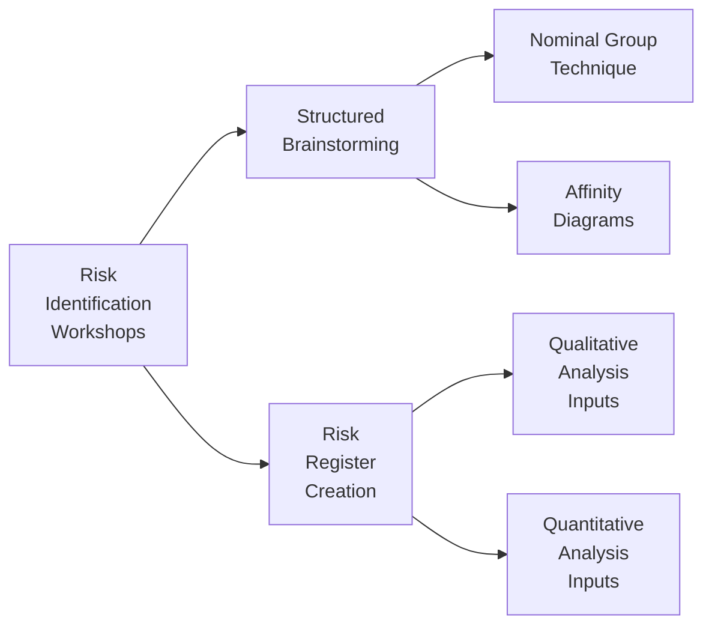

## 22.1 Risk Identification Workshops and Tools

Risk identification is the foundational step in any effective risk management process. Without a thorough, systematic approach to discovering potential threats and opportunities, the subsequent steps—qualitative analysis, quantitative analysis, planning responses, and monitoring—cannot be carried out effectively. This section builds on earlier discussions on risk in Part III, Chapter 14 (Uncertainty Performance Domain), to outline how you can organize and facilitate specialized workshops and use powerful tools for identifying risks in traditional, agile, or hybrid environments. By the end of this section, you should be able to confidently plan, conduct, and follow up on risk identification workshops while leveraging advanced methods to populate and maintain a robust risk register.

### The Critical Role of Comprehensive Risk Identification
Projects, by definition, create unique products, services, or results, leading to inherent uncertainties. Proper risk identification ensures that:
- Known unknowns are uncovered early.
- Team members and stakeholders remain proactive rather than reactive.
- Preventive strategies can be drafted, reducing negative risk impacts and maximizing positive risk opportunities.
- The project has a clearer roadmap of potential deviations, enabling more accurate schedule and budget projections.

Beyond exam preparation, comprehensive risk identification fosters a culture of continuous learning and improvement. It also contributes to more realistic stakeholder expectations, improved change management strategies, and better alignment with organizational objectives.

### Overview of Risk Identification Workshops
Risk identification workshops are collaborative sessions where project team members, functional experts, and relevant stakeholders come together to systematically explore, discuss, and document potential risks. These workshops:
- Encourage open communication and shared ownership.
- Provide a structured method to brainstorm, categorize, and evaluate risks.
- Align participants on the project’s scope, objectives, assumptions, and constraints before delving into risk discovery.
- Clarify the roles and responsibilities of each participant in addressing identified risks.

A well-planned workshop includes defining objectives, selecting participants, preparing workshop materials, and establishing ground rules. In agile or hybrid contexts, risk identification can be integrated into iteration planning or retrospectives, ensuring that risks are continuously revisited and re-evaluated.

### Tools and Techniques for Risk Identification
There are several techniques you can use to identify risks effectively. While traditional brainstorming remains a staple, the following advanced methods can enhance the discovery of both threats and opportunities:

#### Brainstorming
Brainstorming is often the first step in risk identification. Facilitators encourage an open dialogue where all ideas are recorded without judgment. This technique:
- Works best in a non-hierarchical environment where participants feel safe to propose both typical and extreme probabilities.  
- Benefits from a scribe who captures ideas in real-time on sticky notes or digital collaboration tools.
- Can be combined with additional methods (e.g., nominal group technique) to refine and prioritize risks post-session.

#### Nominal Group Technique (NGT)
The nominal group technique provides structure to brainstorming by following a set of distinct steps:
1. Silent Generation: Participants write down potential risks independently.  
2. Round-Robin Sharing: Each participant shares one idea at a time, ensuring all voices are heard equally.  
3. Group Discussion: Collective clarification and debate on each identified risk.  
4. Voting: Participants vote or rank the risks most critical to the project.

NGT prevents groupthink, fosters balanced participation, and minimizes dominance by vocal individuals. 

#### Delphi Technique
Used typically for forecasting in uncertain or complex environments, the Delphi technique involves a panel of experts who answer questionnaires in multiple rounds. After each round, a facilitator shares the summarized feedback and allows experts to refine their responses. Over time, the group converges on key risks and probable outcomes. The Delphi technique is particularly useful when:
- Consensus among domain experts is required.
- Stakeholders have conflicting opinions.
- Risks are interdependent, requiring multiple perspectives.

#### Affinity Diagrams
Affinity diagrams cluster related risks, enabling you to reveal patterns or themes. After a general brainstorming session, participants sort ideas into logical groupings or categories—like schedule-related, compliance, and technical risks. This method helps teams visualize the relationships between individual risks and identify potential interdependencies.

#### Cause-and-Effect (Ishikawa) Diagrams
A cause-and-effect (or fishbone) diagram visually maps out underlying factors contributing to a particular risk or problem. By categorizing potential causes (e.g., people, processes, technology, environment), teams gain deeper insights into how one trigger might cascade into a larger set of risks. This technique:
- Works best when investigating the root causes that lead to repeated or systemic project setbacks.
- Encourages deeper analysis beyond surface-level observations.

#### SWOT Analysis
SWOT (Strengths, Weaknesses, Opportunities, Threats) can be used during risk identification to pinpoint potential external opportunities and threats while considering internal capabilities. This big-picture approach ensures that risk identification does not solely focus on the negative but also highlights where the project might exploit advantages.

#### Mind Mapping
Mind mapping visually represents ideas and their relationships. By placing the project objective or risk category at the center of the map, teams expand outward to discover sub-risks or nested topics. This free-form approach can spark creativity and unearth risks that might otherwise remain hidden.

#### Checklists
Checklists are often based on historical data, organizational process assets, and lessons learned from similar projects. While they encourage thoroughness, checklists risk missing unique aspects of a new project. Therefore, checklists should be updated regularly to remain relevant and should be used in conjunction with other, more exploratory methods.

### Running an Effective Risk Identification Workshop
Below is a typical sequence of activities and facilitation tips to ensure a productive workshop:

- Pre-Workshop Preparation  
  - Define clear objectives and desired outcomes (e.g., complete risk register draft).  
  - Identify key participants, including subject matter experts, major stakeholders, and potential risk owners.  
  - Gather necessary documentation: project charter, stakeholder analysis, prior risk registers (if available), and relevant project documents.  
  - Decide on the techniques to be employed (brainstorming, NGT, affinity diagrams, etc.).  

- Workshop Execution  
  - Set the ground rules: emphasize open communication, respect for differing opinions, and collaborative mindset.  
  - Present the project objectives, scope, and constraints succinctly.  
  - Conduct the chosen risk identification exercises, capturing all potential risks without filtering.  
  - Encourage cross-functional and cross-cultural insights if the project spans multiple domains or geographies.  

- Post-Workshop Follow-Up  
  - Consolidate the identified risks into a master list.  
  - Remove duplicates, refine risk statements, and group similar items.  
  - Distribute the preliminary risk register to workshop attendees for validation.  
  - Schedule subsequent sessions for qualitative and quantitative risk analysis (see Chapter 14.2 for deeper dives into advanced risk analysis techniques).

### Creating and Maintaining a Risk Register
The risk register is the primary output of any risk identification effort. It captures all identified risks and is regularly updated over the project’s life cycle. A comprehensive risk register typically includes:

| Risk ID | Risk Description                                            | Probability | Impact | Risk Owner        | Potential Response                |
|---------|-------------------------------------------------------------|------------|--------|-------------------|-----------------------------------|
| 001     | Vendor fails to deliver components on time                 | Medium     | High   | Procurement Lead  | Negotiate penalty clauses; expedite shipping if delayed |
| 002     | Unexpected regulatory changes increasing scope of testing  | Low        | Medium | Compliance Officer| Monitor proposed legislations; secure specialized testing resources |
| 003     | Team skill gaps in emerging technology                     | High       | High   | Project Manager   | Provide specialized training; contract external expertise |

- Risk ID. A unique identifier or code to distinguish each risk.  
- Risk Description. A concise but thorough explanation of the risk.  
- Probability/Impact. Scales (e.g., Low/Medium/High or 1–5) used to quantify risk significance.  
- Risk Owner. The individual or group responsible for monitoring and managing the risk response.  
- Potential Response. Initial ideas for response strategies (avoid, mitigate, transfer, accept, or exploit for opportunities).

Maintaining your risk register involves updating it with new risks, updates to probability and impact ratings, changes in risk ownership, and notes on mitigation results. This living document forms the backbone of your risk analysis and response planning.

### Advanced Brainstorming and Risk Register Creation Methods
Leading organizations often go beyond traditional brainstorming to adopt specialized risk identification methods:

- Reverse Brainstorming  
  Instead of asking, “What risks might impede the project eyeing success?” you ask, “How could we ensure the project fails?” Although seemingly negative, this approach can uncover overlooked threats.  

- Role-Playing  
  Team members assume different stakeholder perspectives, such as a customer, sponsor, competitor, or regulatory body. This fosters empathy, ensuring a more comprehensive set of viewpoints.  

- “What If?” Scenarios  
  Formulate hypothetical scenarios—like a shortfall in funding, sudden technology disruption, or a key person leaving the project—and walk through the potential consequences. This can illuminate risks that were not initially apparent.

### Common Pitfalls and How to Overcome Them
- Groupthink. Mitigate by adopting structured facilitation methods (e.g., Delphi, NGT) that give each person a voice.  
- Over-Reliance on Checklists. Ensure you constantly tailor checklists to the project context, and avoid ignoring novel risks.  
- Insufficient Stakeholder Involvement. Involve a diverse range of functional areas, external experts, and end-users to capture a holistic risk perspective.  
- Superficial Risk Statements. Provide well-defined and context-rich risk descriptions, specifying potential causes, triggers, and impacts.  

### Real-World Scenario: Launching a High-Profile Mobile Application
Imagine you’re managing a multi-national team creating a new mobile payments app scheduled for a major public event. Recognizing the immovable deadline and high stakes, you organize a two-day risk identification workshop with the following participants:
- The Product Owner from marketing, focusing on user acceptance risks.  
- Senior Developers from different technical domains, highlighting performance or integration risks.  
- Security and Compliance Officers, identifying potential data privacy and regulatory risks.  
- A couple of future end-users and pilot testers, offering an outside perspective.  

On Day 1, the team performs structured brainstorming, employing the nominal group technique. Once a preliminary risk list is compiled, you group issues via affinity diagrams into technical, compliance, and user adoption categories. By Day 2, you refine the statements and produce a comprehensive risk register with assigned owners. This multi-perspective approach highlights hidden vulnerabilities—such as potential server overload on launch day due to limited dev-ops capacity—and leads to preemptive mitigation steps.

### Visualizing the Risk Identification Process

The diagram above illustrates how risk identification workshops lead to refined brainstorming approaches, culminating in the development of a risk register that serves as a core input to both qualitative and quantitative analysis.

### Simple KaTeX Formula for Risk Severity
In many organizations, a simplified formula for risk severity is expressed as:

$$
\text{Risk Severity} = P \times I
$$

Where:  
• \\( P \\) = Probability (often rated on a scale of 1–5)  
• \\( I \\) = Impact (often rated on a scale of 1–5)  

Hence, a maximum risk severity might be \\( 5 \times 5 = 25 \\) on such a scale. Although simplistic, this formula helps you quickly rank and compare individual risks.

### Additional Resources
- Project Management Institute (PMI). “Guidelines for Risk Management.”  
- “Agile Practice Guide” (PMI): Chapters on adaptive risks and rolling-wave planning.  
- “The Basics of FMEA” by the American Society for Quality (ASQ): offers a structured approach to identifying and mitigating failures in manufacturing and product development.  
- Industry case studies on risk management in technology, construction, healthcare, and finance.

## Sharpen Your Risk Identification Skills: A Comprehensive Quiz



### During a risk identification workshop, which factor is most critical for a successful brainstorming session?
- [ ] Having a larger number of participants
- [x] Ensuring a non-judgmental environment
- [ ] Setting a time limit to expedite the process
- [ ] Limiting topics to avoid scope creep

> **Explanation:** A non-judgmental atmosphere encourages open communication, making participants feel comfortable sharing any potential risk, thereby uncovering more insights.

### Which technique leverages multiple rounds of stakeholder feedback for consensus on potential risks?
- [ ] Affinity diagramming
- [ ] Mind mapping
- [x] Delphi technique
- [ ] Reverse brainstorming

> **Explanation:** The Delphi technique uses a panel of experts who provide feedback in multiple rounds, converging on key risks after each iteration.

### What is the primary purpose of creating an affinity diagram in a risk identification workshop?
- [ ] To finalize the project plan
- [x] To cluster related ideas and discover systemic patterns
- [ ] To prioritize risks by probability and impact
- [ ] To assign risk owners strategically

> **Explanation:** Affinity diagrams visually organize related risks into categories, helping participants see underlying themes and patterns.

### Which statement best describes a risk register?
- [x] It is a living document that evolves throughout the project life cycle
- [ ] It is a static repository finalized during project initiation  
- [ ] It only contains high-priority risks  
- [ ] It replaces the project management plan 

> **Explanation:** A risk register should stay updated as new risks are discovered or existing ones evolve, making it a continuous reference.

### In the nominal group technique, which step ensures that each participant’s perspective is heard equally?
- [ ] Group discussion and consensus-building
- [x] The round-robin sharing of ideas
- [ ] Immediate prioritization through voting
- [ ] Sub-teams forming to discuss topics

> **Explanation:** The round-robin approach mandates that every person shares at least one idea, preventing the loudest voices from dominating.

### Which of the following is one of the biggest pitfalls in identifying risks?
- [ ] Having too many different stakeholder perspectives
- [x] Groupthink leading to overlooked hazards
- [ ] Failing to limit discussions on potential solutions
- [ ] Overemphasis on multiple specialized tools

> **Explanation:** Groupthink can lead to critical oversights if participants conform to a prevailing viewpoint rather than voicing independent thoughts.

### What is one key reason to invite end-users or customer representatives to a risk identification workshop?
- [ ] They can provide academic frameworks for risk management
- [ ] They are required to provide technical specifications
- [x] They offer external perspectives on potential user adoption issues
- [ ] They have final oversight of the project budget

> **Explanation:** End-users contribute valuable insights related to user experience and adoption, helping uncover risks that internal teams might miss.

### Reverse brainstorming can be used to:
- [ ] Set project milestones
- [ ] Emphasize only positive risks
- [ ] Validate the project schedule
- [x] Understand how to cause project failure to spot hidden threats

> **Explanation:** In reverse brainstorming, participants consider scenarios that would intentionally lead to failure. This approach uncovers threats not readily visible through conventional methods.

### Why should a facilitator remove or combine duplicates after a risk identification workshop?
- [x] It helps prevent confusion and streamlines the risk list
- [ ] It increases the total count of identified risks
- [ ] It masks the disagreements within the group
- [ ] It helps reduce the workshop duration

> **Explanation:** Consolidating duplicates clarifies the overall set of unique risks and makes subsequent analysis more efficient.

### The simple formula: Risk Severity = P × I indicates that:
- [x] Risk severity is the product of probability and impact
- [ ] All risks will have a severity of 25
- [ ] High probability guarantees the highest severity
- [ ] Impact is only important in low-probability cases

> **Explanation:** Probability and impact multiplied yield a quick visual gauge of a risk’s potential effect. Probability alone or impact alone cannot fully define overall severity.



---

## PMP Mastery: 1500+ Hard Mock Exams with Full Explanations 

Looking to crush the PMP exam with confidence? Dive deep into 6 rigorous mock exams totaling 1500+ advanced-level questions, each accompanied by clear, step-by-step explanations. Hone your test-taking strategies, master complex topics, and build the resilience you need on exam day. Perfect for serious PMs aiming beyond fundamentals.

Enroll now:  
[PMP Mastery: 1500+ Hard Mock Exams with Exceptional Clarity & Full Explanations](https://www.udemy.com/course/pmp-2025/?referralCode=CF83A54BC86BE27F9AFE)

_Disclaimer: This course is not endorsed by or affiliated with the PMI examination authority. All content is provided purely for educational and preparatory purposes._


