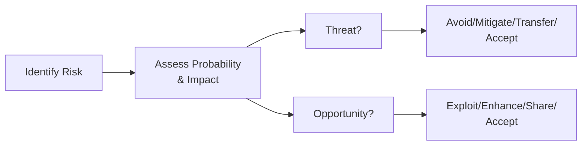

## 22.2 Threats vs. Opportunities and Proactive Mindset

A project characterized by complex workstreams, tight deadlines, and multiple stakeholders inevitably runs into numerous forms of risk. Traditionally, risk management has been synonymous with minimizing or neutralizing negative impacts (threats). However, contemporary standards and the PMBOK® Guide (Seventh Edition) spotlight a balanced view: risk can also hold potential beneficial outcomes (opportunities). This balanced approach calls for a proactive mindset—one that both averts, mitigates, or transfers threats while embracing or enhancing opportunities.

In this section, we will delve into how project managers can effectively apply a proactive mindset to not only safeguard the project from potential pitfalls but also leverage opportunities for value creation. 

### Why a Balanced Approach to Risk Matters

Organizations often focus heavily on managing threats, unintentionally overlooking potential beneficial outcomes. While threat responses prevent damages to project scope, schedule, budget, and quality, effective risk management should also capitalize on favorable uncertainties. Opportunities can enhance product features, expedite schedules, streamline costs, or even exceed the project’s original benefits. Ultimately, projects that foster a balanced approach to risk—treating threats and opportunities on equal footing—are more resilient and innovative.

From the PMP® Exam perspective, you should remember that “risk” explicitly includes both threats and opportunities. Understanding agile, hybrid, and predictive approaches with a proactive mindset is crucial to mastering domain competencies across People, Process, and the Business Environment. By applying these insights, project managers create a more dynamic and responsive risk culture that encourages the entire team to spot and exploit beneficial risks early.

### Threats vs. Opportunities: A Balanced Overview

Risk management involves identifying uncertain events that can affect project objectives. Those uncertainties manifest themselves in two ways:

- Threats: Potential events or conditions that, if they occur, can negatively impact one or more project objectives, such as scope, cost, schedule, or quality.
- Opportunities: Potential events or conditions that, if they occur, can have a positive impact on project objectives—often speeding up delivery, reducing costs, or improving stakeholder satisfaction.

In traditional frameworks, we categorize threats under the negative side of risk. For instance, an unexpected labor shortage or an increase in regulatory requirements are typical threats that project managers strive to mitigate or avoid. On the other hand, opportunities might be overlooked or swept under the rug, such as an emerging technology that could provide a faster route to market or a strategic partnership that could reduce resource costs. 

By acknowledging that risk incorporates both threats and opportunities, project managers can optimize project outcomes, not just shield them from harm.

### Developing a Proactive Mindset

A proactive mindset in risk management involves continuously scanning the horizon for both negative and positive risks. Proactivity means you do not wait for potential issues to become actual problems, and you do not passively allow beneficial situations to fade unexploited. Instead, your team actively monitors all sources of uncertainty, both internal and external, and fosters an environment that prevents negative surprises while also spotting novel benefits.

Key elements of developing a proactive mindset include:

• Early Identification of Uncertainty: During project initiation and planning, brainstorm diverse scenarios—both good and bad—that could emerge. Encourage your team to question assumptions, adapt to changing environments, and think creatively about future trends.

• Continuous Risk Review: Risk management is iterative. Establish frequent risk reviews throughout the project life cycle (predictive, agile, or a hybrid approach). Recognize that agility can be particularly beneficial in discovering new opportunities amid changing conditions.

• Empowered, Collaborative Culture: Encourage open dialogue by creating psychological safety for your team. Let them voice potential dangers or beneficial developments without fear of reprisal. Reward “positive outliers” who champion ideas that create new value.

• Ownership and Accountability: Assign owners for each risk, whether it is a threat or an opportunity. A single accountable person (or sub-team) helps ensure timely follow-up, course correction, and resource allocation.

### Case Study: Infrastructure Project

Consider an infrastructure project to build a suspension bridge. The project manager and the team identified several potential threats, such as:

• Extreme weather conditions leading to construction delays  
• Difficulty sourcing specialized steel at stable prices  
• Stricter environmental regulations mid-project  

Simultaneously, a new local supplier of composite materials that promise higher tensile strength at a reduced cost appears on the radar. The team recognizes it can be a major opportunity. By being proactive, the team invests time in a feasibility study, negotiates favorable terms, and successfully integrates the new material to improve durability while reducing expenses—turning an uncertain event into a significant advantage.

### Strategies to Address Threats

When dealing with negative risks, a project manager can apply the following primary response strategies:

• Avoidance: Eliminate the possibility of the threat entirely, often by adjusting the scope or adopting a different approach. Example: Changing a major design element to avoid reliance on scarce materials.

• Mitigation: Reduce the probability or impact of a threat to acceptable levels. Example: Deploying redundant network lines, even if it costs slightly more, reduces the likelihood and severity of communication failures.

• Transfer: Shift the negative impact to a third party (e.g., insurance, warranties, or contractual arrangements). Example: Outsourcing certain tasks to specialized vendors with guaranteed performance, effectively transferring much of the risk to them.

• Acceptance: Recognize that the threat can happen, but decide not to take active measures against it—usually done when the cost or effort to mitigate outweighs the potential impact. Passive acceptance involves no specific actions, whereas active acceptance may include creating a contingency reserve.

### Strategies to Exploit or Enhance Opportunities

Similarly, opportunities call for systematic response strategies:

• Exploit: Change the project plan to ensure the opportunity is realized. Example: Reallocating resources to an emerging technical solution that drastically reduces production time.

• Enhance: Increase the likelihood or impact of an opportunity. Example: Providing additional training or resources to a team working on an R&D initiative that has the potential to accelerate project timeline.

• Share: Collaborate with external parties who have the expertise or resources to help realize the opportunity. Example: Partnering with a technology firm that holds crucial intellectual property to scale up a beneficial product feature for a new market channel.

• Accept: Acknowledge the opportunity but take no proactive action, typically due to limited resources or a calculated decision that benefits do not justify the investment. However, the team remains open to capturing the upside if it occurs naturally.

### Tools and Techniques for Threats vs. Opportunities

Projects thrive on structured processes to manage both negative and positive risks. For thorough coverage, you can leverage:

• SWOT Analysis (Strengths, Weaknesses, Opportunities, Threats): Although typically used at the organizational or strategic level, it can be adapted for initial project risk brainstorming sessions, with separate columns for threats and opportunities.

• Probability and Impact Matrix: Use a matrix to categorize threats and opportunities across “low, medium, high” probability and “low, medium, high” impact. This helps prioritize which items demand immediate action.

• Monte Carlo Simulation: By running numerous “what-if” scenarios, Monte Carlo can highlight not only potential shortfalls but also areas where the project might surpass expectations, surfacing new opportunities.

• Decision Trees: Often used in cost-benefit analysis to compare multiple risk response actions, factoring in probabilities of success and failure. This is especially helpful if a certain opportunity has various implementation pathways with distinct payoffs.

• Brainstorming and “What If” Techniques: Encouraging open-ended dialogues among stakeholders helps capture both hidden threats and overlooked opportunities. The team can systematically evaluate each possibility for feasibility and alignment with the project’s objectives.

Often, you’ll combine these methods in a risk workshop. Participants receive an updated risk register containing both negative and positive risks, with an assigned owner. Remember to maintain transparency by displaying the register or a risk burndown chart on an information radiator (in agile contexts) or a project dashboard (in predictive or hybrid environments).

### Mermaid Diagram: Overview of Threat and Opportunity Responses

Below is a simplified diagram illustrating how threats and opportunities flow from identification to the appropriate response strategy.

In this flow, once a project team identifies a risk, they assess its probability and impact. If the risk is recognized as a threat, the team chooses from Avoid, Mitigate, Transfer, or Accept. Conversely, if they classify the risk as an opportunity, the strategies shift toward Exploit, Enhance, Share, or Accept.

### Incorporating a Proactive Mindset in the Risk Register

A key deliverable in risk management is the risk register (see Chapter 41: Reference Charts and Templates for sample registers). Many organizations only maintain negative risk entries in this record, holding a strong bias toward threat-related items. However, to keep your approach balanced:

• Reserve separate columns for threat vs. opportunity classification.  
• Define specific response actions for each risk event, detailing resource requirements, schedules for execution, and success criteria.  
• Track owners and next review dates to ensure accountability.  
• Implement triggers or thresholds for implementing opportunity responses.  

By categorizing both negative and positive risks at the same level of significance, you maintain the discipline to follow through on beneficial events as rigorously as you would attempt to neutralize negative impacts.

### Common Pitfalls in Balancing Risks

1) Neglecting Opportunities in Hybrid Environments  
   Teams working in highly regulated or waterfall-driven projects might be inclined to adopt a conservative posture. Ensure that even in structured, compliance-heavy settings, you maintain a pipeline for creative thinking. Hybrid projects that combine phases of agile development can especially benefit from retrospective insights that highlight potential new advantages.

2) Over-Focusing on Opportunities at the Expense of Threats  
   Conversely, if an organization’s culture overly prizes innovation or “disruptive thinking,” there might be a neglect of project vulnerabilities. A purely opportunistic stance can be detrimental if legitimate project threats are ignored. Balance is key.

3) Vague Response Plans  
   Sometimes, risk response strategies are too general. For instance, stating “We will monitor the market for new opportunities” is weak without metrics or ownership. Make your plan specific, measurable, actionable, and time-bound.

4) Poor Risk Ownership  
   Risk responsibilities can fall through the cracks without clear accountability—particularly if there is no dedicated risk champion or if multiple individuals are assigned to a single risk. Designate a single owner but keep the team informed and supportive.

5) Reactive vs. Proactive Culture  
   Receiving warnings from your environment or your risk tools but failing to act on them promptly undermines the essence of risk management. Set up clear thresholds for alerts (e.g., changes in market prices, regulatory changes, shifting stakeholder demands) and respond immediately.

### Real-World Example: Technology Upgrade Project

Imagine a software product company planning an upgrade to their flagship solution. The threats identified are:

• Legacy system incompatibilities leading to schedule overruns  
• Talent shortages in specialized coding languages  
• Budget shortfalls if the development cycle extends too long  

Several potential opportunities arise:

• Adopting new cloud services to reduce hardware costs  
• Leveraging open-source community support for unique modules  
• Early mover advantage if the new version is released prior to a competitor’s update  

By allocating some portion of the project budget to exploring open-source modules, the team not only mitigates cost but also accelerates testing. Furthermore, the risk owner for the “early mover advantage” remains vigilant about market trends, enabling them to push for an early release if user acceptance tests indicate readiness. Meanwhile, they proactively address legacy incompatibilities by scheduling parallel testing phases with minimal disruption.

### Organizational Engagement and Stakeholder Alignment

Chapter 16 (Stakeholder and Communications Management) and Chapter 7 (Stakeholder Performance Domain) detail strategies for ensuring adequate stakeholder buy-in. In reality, your risk response plan gains meaningful traction only if stakeholders:

• Understand the value of balancing threats and opportunities.  
• Have confidence that their concerns and ideas are heard.  
• See the tangible benefits or cost savings from exploited opportunities.

Consider also the governance requirements found in Chapter 35 (Portfolio and Program Management Intersections). Balancing negative and positive risks at the program or portfolio level ensures resources are spent optimally across multiple projects.  

### Maintaining Adaptability

The nature of risk management calls for continuous adaptation. Agility, not just in software development but as a mindset, helps teams respond quickly to evolving conditions. During a sprint review or iteration review (discussed in Chapter 26: Key Agile Events and Artifacts), the team might discover a new threat or opportunity. Through short feedback cycles, an agile project environment can pivot or adjust swiftly.

That said, even in predictive environments, regular risk reviews and integrated change control (Chapter 15: Integration Management) provide opportunities to revisit your approach, ensuring you incorporate lessons learned, updates in external conditions, and shifts in project scope.

### Moving Forward with Confidence

Balancing threats vs. opportunities fosters an environment of prudent vigilance and bold innovation. A project’s success is rarely determined by how it handles threats alone—truly exceptional outcomes come when a team also seizes hidden opportunities to deliver greater value. Adopting a proactive mindset ensures your project is protected from the worst while positioned to capture the best.

In the context of the PMP® exam, expect scenario-based questions exploring how to tailor risk strategies to different environments, the roles of the project manager in influencing stakeholder openness, and the interplay of negative/positive risks. Demonstrating balanced risk management proficiency will underscore your readiness to orchestrate successful projects, no matter how fast the landscape changes.

### References and Further Reading

• Project Management Institute. (2021). A Guide to the Project Management Body of Knowledge (PMBOK® Guide) – Seventh Edition.  
• PMI. (2017). Agile Practice Guide.  
• Hillson, D. (2019). Capturing Upside Risk: Finding and Managing Opportunities in Projects.  
• PMIstandards+™ Digital Content Platform: Articles and Practice Guides on Risk Management.  
• Chapter 6 (The PMP® Exam Domains, Tasks, and Enablers) of this volume for how these topics map to exam domains.

---

## Mastering Risk Strategies: Threats and Opportunities for PMP Success



### Which of the following best describes “threats” in project risk management?
- [ ] Positive events that have a beneficial impact on project objectives.  
- [x] Negative events that may hinder project objectives.  
- [ ] Neutral events that neither help nor harm the project.  
- [ ] Predictable events that require no response.  

> **Explanation:** Threats are negative risks that can undermine project objectives.  

### What is the primary purpose of employing a balanced approach to risk, incorporating both threats and opportunities?
- [ ] To minimize the cost spent on risk management activities.  
- [x] To prevent negative events while maximizing beneficial outcomes.  
- [ ] To guarantee that the project will be completed early.  
- [ ] To satisfy a regulatory requirement.  

> **Explanation:** A balanced approach encompasses both threat mitigation and opportunity exploitation to optimize overall project value.  

### When a project team decides to buy an insurance policy to handle a negative risk, which risk response strategy are they implementing?
- [ ] Mitigation  
- [x] Transfer  
- [ ] Avoidance  
- [ ] Exploit  

> **Explanation:** Transferring a risk means shifting its financial or operational consequences to a third party, such as an insurer.  

### Which strategy is specifically focused on ensuring an opportunity definitely occurs?
- [x] Exploit  
- [ ] Enhance  
- [ ] Accept  
- [ ] Share  

> **Explanation:** Exploit is the strategy to make certain a beneficial event takes place and maximizes its positive impact on the project.  

### Which of the following risk response techniques can be used for both threats and opportunities?
- [x] Accept  
- [ ] Mitigate  
- [ ] Avoid  
- [x] Share  

> **Explanation:** “Accept” could apply to both threats (passively or actively) and opportunities. Similarly, “share” can also work to distribute upside or downside risk.  

### Which of the following is a sign of a proactive risk culture?
- [x] Frequent risk discussions that incorporate both negative and positive events  
- [ ] Waiting until issues materialize before analyzing them  
- [ ] Ignoring low-probability vulnerabilities  
- [ ] Addressing only high-impact threats  

> **Explanation:** A proactive culture screens for risks early and often, including potential threats and opportunities.  

### Which tool is commonly used to classify and prioritize both threats and opportunities based on their likelihood and impact?
- [x] Probability and impact matrix  
- [ ] Ishikawa (fishbone) diagram  
- [x] Monte Carlo simulation  
- [ ] Product backlog chart  

> **Explanation:** The probability and impact matrix maps each risk (threat or opportunity) across two dimensions (probability and impact) to aid prioritization. Monte Carlo simulations can also model uncertainties and their cumulative effects.  

### An opportunity response strategy that aims to increase probability or impact of a positive risk is called:
- [ ] Exploit  
- [x] Enhance  
- [ ] Mitigate  
- [ ] Transfer  

> **Explanation:** “Enhance” is the strategy for increasing the likelihood or potential benefit of a positive risk.  

### Which of the following statements best characterizes adopting a “reactive culture”?  
- [x] The team primarily responds to issues after they occur.  
- [ ] All project risks are identified and controlled during the planning phase.  
- [ ] It systematically reviews threats and opportunities in daily stand-ups.  
- [ ] It sets clear accountability for both negative and positive risks.  

> **Explanation:** Reactive cultures wait until issues become problems before taking corrective action, rather than monitoring proactively.  

### By definition, a risk with potential to produce a positive or beneficial effect on one or more project objectives is classified as:
- [x] An opportunity  
- [ ] A threat  
- [ ] A hazard  
- [ ] A constraint  

> **Explanation:** A risk that offers the chance for improvement is known as an opportunity.  



---

## PMP Mastery: 1500+ Hard Mock Exams with Full Explanations 

Looking to crush the PMP exam with confidence? Dive deep into 6 rigorous mock exams totaling 1500+ advanced-level questions, each accompanied by clear, step-by-step explanations. Hone your test-taking strategies, master complex topics, and build the resilience you need on exam day. Perfect for serious PMs aiming beyond fundamentals.  

Enroll now:  
[PMP Mastery: 1500+ Hard Mock Exams with Exceptional Clarity & Full Explanations](https://www.udemy.com/course/pmp-2025/?referralCode=CF83A54BC86BE27F9AFE)

_Disclaimer: This course is not endorsed by or affiliated with the PMI examination authority. All content is provided purely for educational and preparatory purposes._
