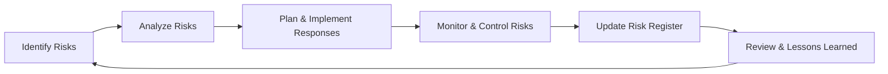

## 22.3 Monitoring Risks and Adjusting Strategies

Monitoring and controlling risks is a continuous process that ensures your risk response strategies remain appropriate throughout the project life cycle. A diligently monitored risk environment gives you the agility to react to emergent threats and opportunities, maintain alignment with organizational objectives, and keep stakeholders informed of evolving conditions. This section explores how to establish robust monitoring approaches, detect early warning signals, and make decisive adjustments to your overall risk management strategies.

Successful risk monitoring integrates both quantitative and qualitative techniques, focusing on emerging trends, triggers, and the effectiveness of chosen response plans. It helps prevent small threats from turning into catastrophic problems, and allows project teams to seize opportunities for value creation. Whether your project follows a predictive, agile, or hybrid methodology, understanding how to monitor risks in real time is critical to delivering on scope, schedule, and budget.

## Defining Risk Monitoring

Risk monitoring is the systematic tracking of identified risks and the constant scanning for new, emergent risks. It involves:  
• Reviewing known risks and verifying if their status has changed.  
• Identifying new risks and uncertainties that arise as the project progresses.  
• Checking whether the implemented risk responses are effective or need modification.  
• Monitoring triggers and key risk indicators (KRIs) that signal potential changes in a risk’s probability or impact.  
• Capturing lessons learned to refine future risk management strategies.

Through continuous observation, project managers can decide when to escalate concerns, when to reassess response plans, and how to communicate adjustments to all relevant stakeholders. This requires data-based decision-making, clear communication channels, and an updated risk register that reflects the latest status of each risk.

## Establishing a Risk Monitoring Framework

A well-designed monitoring framework formalizes the processes and tools for identifying, evaluating, and adapting your risk strategy. Key components of this framework include:

• Governance and Ownership: Define who is responsible for monitoring each risk, responding to triggers, and updating documentation. Responsibilities typically align with the nature of the risk (technical, financial, regulatory, etc.).  
• Metrics and KRIs: Determine what data points best reflect risk likelihood or impact. KRIs serve as early warning signals, capturing deviations from expected performance or market indicators.  
• Reporting and Communication: Develop a schedule for regular risk reviews, such as weekly stand-ups or monthly steering committee reports. Provide accessible dashboards or status reports for stakeholders.  
• Escalation Path: If a risk’s severity changes or if newly identified risks emerge, clarify procedures for rapid escalation and resolution.  
• Continuous Improvement: Incorporate insights from near-misses, lessons learned, or retrospective analyses to refine the risk monitoring process.

### Diagram: Risk Management Cycle

Below is a high-level overview of the iterative cycle that supports continuous risk management, including monitoring activities and strategy adjustments.

This cyclical approach highlights that risk monitoring is never a one-time step but an ongoing process, continuously informed by new data, insights, and environmental changes.

## Risk Triggers and Key Risk Indicators (KRIs)

Risk triggers are events or conditions that signal the potential materialization of a risk. KRIs are quantifiable metrics used for early detection of these triggers. Monitoring KRIs helps project managers react proactively. For instance:

• Schedule Overruns: If your weekly progress slips consistently, it may trigger a reevaluation of the project’s resource allocation or scope.  
• Product Defect Rate: If there is a sudden uptick in defects, it may indicate a risk to product quality or stakeholder acceptability.  
• Financial Variance: An increased rate of budget consumption or frequent change orders can signal future funding challenges.  
• Regulatory Changes: Shifts in industry standards or legislation can trigger compliance risks, requiring immediate adjustments to the project plan.

When setting up KRIs, it is useful to define thresholds for each risk. For instance, if the cost variance (CV) surpasses a predefined percentage, you may need to implement mitigation measures or escalate the issue. These thresholds ensure that project teams can respond quickly and effectively when triggers occur.

## Evaluating and Prioritizing Emergent Risks

A dynamic environment often reveals unforeseen risks. By proactively searching for emerging threats and opportunities, you maintain a forward-looking stance. Emergent risks might arise from:

• Shifts in market demand or stakeholder preferences.  
• Changing vendor landscapes or unforeseen capacity issues.  
• Technological breakthroughs or obsolescence events.  
• Natural disasters or political changes that alter supply chains.

Evaluating these emerging risks involves qualitative and quantitative methods, such as risk scoring or Monte Carlo simulations. For more complex, high-impact uncertainties, advanced analysis methods — including decision trees or scenario planning — can help you gauge potential outcomes and prioritize your responses accordingly.

## Adjusting Strategies Based on Performance Data

Monitoring risk responses is critical for verifying whether your chosen strategies are delivering the intended results. If a particular mitigation action proves ineffective or costlier than expected, you may need to pivot to another approach. Strategies for negative risks (threats) typically include avoid, transfer, mitigate, or accept; similarly, strategies for positive risks (opportunities) might include exploit, share, enhance, or accept. Using performance data to re-evaluate these strategies allows for real-time course corrections.

### Example  
Suppose you opted to mitigate a technical risk by hiring an external specialist to review your software architecture. If subsequent defect trends do not improve, it could indicate that the mitigation strategy is insufficient, or that an alternative approach (such as changing the technology stack) might be necessary. Monitoring relevant defect metrics and scheduling frequent code reviews help detect the continued presence of risk. This data-driven feedback loop prompts timely adjustments to your plan.

## Leveraging Tools and Techniques for Real-Time Risk Monitoring

Risk monitoring benefits immensely from tools that collect and analyze data in real time. A few typical examples include:

• Automated Dashboards: Tools such as Microsoft Project Online, JIRA, or specialized risk management software can auto-generate dashboards tracking budget, schedule, and quality metrics.  
• Burn Charts and Cumulative Flow Diagrams: In agile environments, these visualizations highlight if a team is on track or if project flow inefficiencies suggest risk.  
• Earned Value Management (EVM) Tools: EVM integrates cost and schedule performance to show variances that might point to emerging threats.  
• Collaboration Platforms: Slack, Microsoft Teams, or other collaboration tools enable rapid communication and swift reporting of risk triggers.  

With real-time data available, project teams can conduct mini risk reviews more frequently. For instance, an agile team might evaluate risk at the end of each sprint, while a predictive team might schedule weekly or bi-weekly risk review sessions.

## Practical Case Studies

Case Study A: Supply Chain Disruption in a Manufacturing Project  
A manufacturing company with a global supply chain used a combination of monthly supplier quality reports and on-time delivery metrics as KRIs. When a significant supplier’s on-time delivery rate dipped below 90% for two consecutive months, project management recognized this as a trigger. Further investigation revealed political turmoil in the supplier’s region. The project manager adjusted the risk strategy by identifying alternate certified suppliers and diverting critical orders away from the unstable region. This quick pivot helped ensure production remained uninterrupted.

Case Study B: Sudden Regulatory Shift in a Healthcare IT Project  
A healthcare IT project was nearing the implementation phase when new data privacy laws were enacted. The project manager had established legal watchlists and regularly received policy updates as part of the risk monitoring process. When the new legislation was officially passed, the project team promptly updated its compliance plan, allocated additional budget for legal consultation, and revised certain product features. This risk-based adjustment minimized legal exposure and aligned the software with new regulations, preventing any penalties or launch delays.

## Common Pitfalls and Best Practices

### Pitfalls  
• Neglecting Early Signs: Overlooking small anomalies in project metrics can allow risks to grow to crisis levels.  
• Inadequate Communication: If risk escalations are not reported to decision-makers promptly, response measures may be delayed or ineffective.  
• Static Risk Register: Failing to update your risk register or the risk response plan as circumstances change leaves your project vulnerable to outdated or irrelevant strategies.  
• Over-Reliance on Single Measures: Relying on only one or two metrics (e.g., cost variance) can create blind spots for other risks developing under the radar.

### Best Practices  
• Regularly Reassess: During each project phase or iteration, review risk statuses, potential triggers, and emerging threats.  
• Encourage Transparency: Promote a culture where stakeholders and team members comfortably discuss risk concerns without fear of blame.  
• Revisit Risk Ranking: Periodically confirm that your highest risks still require the majority of your attention.  
• Simulate Scenarios: Use advanced planning methods (e.g., scenario planning, sensitivity analysis) to prepare for multiple possible outcomes.  
• Document and Celebrate Near-Misses: A near-miss is often a risk that nearly manifested; capture relevant lessons to prevent future occurrences.

## Tailoring Risk Monitoring in Agile and Hybrid Environments

Agile environments typically encourage more frequent risk reviews and immediate adaptation. Risk discussions may happen at daily stand-ups, sprint planning, or retrospective meetings, ensuring the team quickly identifies and addresses new risks. Hybrid models merge structured predictive risk monitoring with agile’s built-in adaptability.

For instance, a hybrid project might conduct monthly risk review sessions aligned with major milestones while also holding daily scrums where interim updates are shared. This can be particularly useful in large organizations where formal risk governance processes must coexist with agile teams empowered to pivot quickly.

## References for Further Learning
• PMI. (2021). PMBOK® Guide – Seventh Edition. Project Management Institute.  
• PMI. (2022). Standard for Risk Management in Portfolios, Programs, and Projects.  
• Agile Practice Guide. (2017). Project Management Institute.  
• Hillson, D. (2016). The Risk Management Handbook: A Practical Guide to Project Risk Management.  
• Crouhy, M., Galai, D., & Mark, R. (2013). The Essentials of Risk Management.  

Keeping a balanced perspective on risk monitoring is key to mitigating threats, leveraging opportunities, and ensuring project objectives remain on track. By combining proactive detection, real-time data analysis, and flexible strategies, project managers can effectively steer their projects toward successful outcomes.

---

## Assess Your Risk Monitoring Expertise



### Which of the following best describes the purpose of monitoring risks?
- [ ] To identify all possible risks at the start of the project
- [x] To track existing risks and identify new ones continuously
- [ ] To eliminate the need for regular stakeholder reviews
- [ ] To avoid assigning ownership to risk-related tasks

> **Explanation:** Monitoring risks involves ongoing tracking of known and unidentified risks. It is iterative rather than a one-time event, facilitating continuous risk control and timely responses.

### Which statement about Key Risk Indicators (KRIs) is most accurate?
- [x] KRIs provide early warning signs that risk events may be imminent
- [ ] KRIs only measure financial deviations in a project
- [ ] KRIs replace the need for periodic project status reports
- [ ] KRIs are only relevant in agile project management frameworks

> **Explanation:** KRIs are metrics that help signal potential risk occurrences. They do not replace status reporting and are relevant in any project management approach, whether agile, predictive, or hybrid.

### A team has noticed that its defect rate has increased by 25% over the last sprint, triggering predefined risk thresholds. What should they do next?
- [x] Reevaluate the effectiveness of their current risk response and consider adjustments
- [ ] Accept the risk and take no further action
- [ ] Eliminate daily stand-up meetings until the defect rate stabilizes
- [ ] Defer action until final product testing

> **Explanation:** Once thresholds are reached, the team must reexamine current strategies to mitigate or resolve the issue, potentially adopting new responses to bring the defect rate under control.

### Which of the following is a best practice when monitoring risks?
- [x] Scheduling regular reviews to reassess risk probabilities and impacts
- [ ] Limiting communication about risks to project sponsors only
- [ ] Relying exclusively on one or two metrics or indicators
- [ ] Reducing the frequency of risk review sessions as the project progresses

> **Explanation:** Frequent, structured reviews ensure risks are continually evaluated. Keeping a small, limited set of metrics or restricting communication can overlook critical issues.

### Which activity is typically included in risk monitoring?
- [x] Updating the risk register with new threats or opportunities
- [ ] Freezing all changes to the risk management plan
- [x] Initiating escalations when trigger conditions are detected
- [ ] Restricting stakeholder visibility into mitigation strategies

> **Explanation:** Risk monitoring includes reviewing and updating the risk register, identifying new risks, and escalating as needed. Stakeholder transparency is generally encouraged.

### Which statement best characterizes triggers in risk management?
- [x] They are conditions or events signaling that a risk is about to occur
- [ ] They are opinions on why certain risks will never happen
- [ ] They are designed to conceal project issues until the final phase
- [ ] They are only relevant to external risks, not internal ones

> **Explanation:** Triggers serve as early warnings that a risk may materialize, helping the team proactively address internal or external issues.

### In agile environments, how often are risk reviews typically conducted?
- [x] Frequently, often in daily stand-ups or retrospective reviews
- [ ] Only once, at project initiation
- [x] Periodically, aligned with each sprint or iteration
- [ ] Annually, after the project goes live

> **Explanation:** Agile emphasizes short feedback loops and iterative adaptation, so risk reviews usually take place daily (in stand-ups) or at sprint retrospectives, as well as periodically throughout the project.

### How can earned value management (EVM) aid in monitoring risk?
- [x] By quantifying schedule and cost performance to detect variances early
- [ ] By replacing all qualitative assessments of project threats
- [ ] By automatically resolving scope creep issues
- [ ] By measuring only resource productivity

> **Explanation:** EVM integrates schedule and budget performance data, offering an early warning of deviations from plan. It does not replace qualitative analysis or fully solve scope issues.

### A near-miss is best defined as:
- [x] A risk that almost occurred but was prevented or avoided in time
- [ ] A minor issue with no relevance to discovered risks
- [ ] A risk that passed by unnoticed
- [ ] An erroneous measurement of performance metrics

> **Explanation:** Near-misses are risks that did not fully materialize but came close. They contain valuable lessons that can inform better risk avoidance or mitigation in the future.

### Monitoring risks in a hybrid environment typically involves which approach?
- [x] Regular, formal reviews tied to milestones combined with agile-style continuous checks
- [ ] Full reliance on predictive methods without daily stand-ups
- [ ] Mandatory daily risk review sessions with all enterprise stakeholders
- [ ] Excluding management from all risk discussions

> **Explanation:** Hybrid approaches balance structured milestone-based reviews with the frequent checks characteristic of agile methods, ensuring robust, integrated risk monitoring.



---

## PMP Mastery: 1500+ Hard Mock Exams with Full Explanations 

Looking to crush the PMP exam with confidence? Dive deep into 6 rigorous mock exams totaling 1500+ advanced-level questions, each accompanied by clear, step-by-step explanations. Hone your test-taking strategies, master complex topics, and build the resilience you need on exam day. Perfect for serious PMs aiming beyond fundamentals.  

Enroll now:  
[PMP Mastery: 1500+ Hard Mock Exams with Exceptional Clarity & Full Explanations](https://www.udemy.com/course/pmp-2025/?referralCode=CF83A54BC86BE27F9AFE)

_Disclaimer: This course is not endorsed by or affiliated with the PMI examination authority. All content is provided purely for educational and preparatory purposes._
