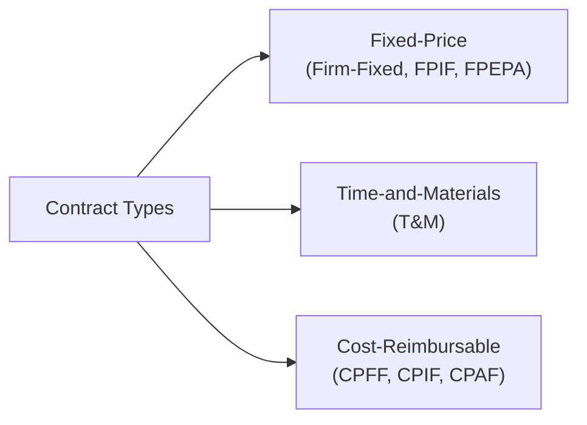

## 23.1 Contract Types and Vendor Selection

Effective contract management and vendor selection are essential elements of project success. Selecting the right contractual framework—whether fixed-price, time-and-materials, or cost-reimbursable—and understanding best practices for procuring goods or services can help project managers mitigate risks, establish fair partnerships, and deliver results that meet stakeholder expectations. This section provides an in-depth examination of the major contract types, considerations for choosing each, and strategies for drafting robust Requests for Proposals (RFPs) that align with organizational objectives.

### Overview: The Importance of Contract Types in Procurement Management
Procurement management is the systematic process by which organizations obtain services or products from external entities. Contracts act as legally binding frameworks that define responsibilities, obligations, and risk allocation between buyers (clients) and sellers (vendors or contractors). An effective contract seeks a balance where both parties share common project objectives, minimize conflicts, and ensure timely delivery.

A critical part of procurement strategy is choosing a contract type that appropriately allocates risk and incentivizes performance. The choice of contract type affects factors such as price, ambiguity, contract duration, and the complexity level of the purchased scope. Poor contract selection can lead to cost overruns, delivery delays, or disputes.

### Core Contract Types
Most contracts in project environments can be grouped into three main categories: fixed-price, cost-reimbursable, and time-and-materials. Within each category, different structures and incentive mechanisms exist to motivate vendors, mitigate risks, or prioritize scope flexibility.

#### Fixed-Price Contracts
A fixed-price contract specifies a set price for the entire scope of work or a specific deliverable. The vendor or contractor agrees to complete the work for an agreed-upon sum, transferring the majority of cost risk to the seller. These contracts are typically preferred when the scope is well-defined and stable, and the buyer wants cost certainty.

Common fixed-price variants include:
- Firm Fixed-Price (FFP): The seller completes the work for a lump sum, bearing all the cost risk. This contract type is often used for standardized products or services where the scope is clear.  
- Fixed-Price Incentive Fee (FPIF): Adds an incentive scheme to encourage meeting or exceeding defined performance criteria such as schedule, quality, or cost savings. Target cost, target profit, a sharing ratio, and a price ceiling are often specified.  
- Fixed-Price with Economic Price Adjustment (FPEPA): Addresses potential fluctuations in commodities, currencies, or other factors during a long-term contract period. The contract price is periodically adjusted based on agreed economic indicators.

Advantages of fixed-price contracts:  
• Cost Certainty: The buyer confidently knows the total contract value if the scope remains unchanged.  
• Simplified Administration: Once executed, administrative overhead may be lower, as billing follows straightforward terms.  
• Strong Performance Incentive: Vendors strive to control costs and maximize efficiency to protect or increase profit.

Potential challenges with fixed-price contracts:  
• Risk to Sellers: If the seller underestimates costs, profit margins shrink or become negative.  
• Scope Creep: Any undefined work outside the original scope typically requires pricey change orders.  
• Longer Negotiations: Both parties may devote considerable time to clarifying scope to avoid misunderstandings.

#### Time-and-Materials (T&M) Contracts
Time-and-materials contracts combine elements of fixed-price and cost-reimbursable approaches. The client pays the vendor for the time spent (e.g., hourly or daily rates for labor) and the cost of materials. T&M contracts often include an upper limit or “not-to-exceed” (NTE) clause to control costs. T&M contracts are suitable when the project scope is evolving, or exact requirements are difficult to pin down.

Advantages of T&M contracts:  
• Flexibility: Projects may begin quickly without finalizing detailed requirements.  
• Transparency: Buyers see direct costs of labor and materials, making it easier to track expenditures.  
• Simple to Set Up: T&M agreements can be put in place faster than fully elaborated fixed-price contracts.

Potential challenges with T&M contracts:  
• Buyer Cost Risk: The buyer bears a significant portion of risk if the scope unexpectedly expands.  
• Minimal Efficiency Incentive: Without additional controls, vendors have less incentive to optimize resources or time.  
• Strong Oversight Required: Regular monitoring is crucial to ensure that allocated hours and materials align with the project’s needs.

#### Cost-Reimbursable Contracts
With cost-reimbursable contracts, the buyer reimburses the seller for all legitimate costs incurred, plus a fee representing the seller’s profit. This structure is used when the scope is highly uncertain or risky, and the buyer is willing to assume more risk. Clear guidelines, welldefined cost allocation rules, and vigilant vendor oversight are critical to prevent cost overruns.

Common cost-reimbursable variants include:  
- Cost-Plus-Fixed-Fee (CPFF): The vendor is paid for all proven costs plus a fixed fee. The fee (profit) remains constant, providing limited performance incentive.  
- Cost-Plus-Incentive-Fee (CPIF): Encourages cost savings and performance improvements by sharing any cost underruns between buyer and seller according to a set ratio. Conversely, overruns may reduce the seller’s fee.  
- Cost-Plus-Award-Fee (CPAF): A portion of the seller’s fee depends on the buyer’s subjective evaluation of the seller’s performance, typically across quality, schedule, or other qualitative measures.

Advantages of cost-reimbursable contracts:  
• Enables Complex Projects: When scope or technical uncertainty is high, having flexibility in adjusting scope and costs is beneficial.  
• Encourages Vendor Participation: Sellers are more willing to undertake uncertain projects with guaranteed cost coverage.  
• Collaborative Environment: Buyer and seller often work closely, as the buyer must approve cost categories.

Potential challenges with cost-reimbursable contracts:  
• Administrative Overhead: Requires thorough auditing, reporting, and cost-tracking.  
• Cost Risk to Buyers: If costs aren’t meticulously managed, projects can overrun budgets.  
• Diminished Cost Control: Sellers face fewer direct penalties if costs exceed initial estimates.

### Choosing the Right Contract Type
No single contract type is universally superior; instead, project managers must consider factors such as scope clarity, market conditions, risk tolerance, required skill sets, and timeline constraints. Projects with stable, well-defined requirements might lean toward a fixed-price contract. Conversely, rapidly changing or innovation-focused projects might warrant T&M or cost-reimbursable arrangements to handle evolving needs.

In many procurement strategies, organizations will consider a hybrid approach—two or more contract types across different work packages. For example, a development phase might operate under T&M for agile software development, transitioning to a fixed-price contract for mass production once product specs are finalized.

### Diagram: Contract Classification Overview
Below is a Mermaid diagram illustrating the three major contract categories and examples within each type:

This visual emphasizes the broad categorization of contracts, showing the three core types and their typical variants.  

### Best Practices for Request for Proposal (RFP) Creation
A well-crafted RFP is critical for attracting qualified vendors, setting clear expectations, and establishing a basis for contract negotiations. Below are key steps and recommendations for producing effective RFPs:

• Define Scope and Requirements: Clearly articulate the project objectives, scope, deliverables, technical requirements, success criteria, and any constraints. This information helps prospective vendors propose accurate solutions.  
• Detail Evaluation Criteria: Specify how proposals will be assessed—often incorporating weighted scoring models across cost, technical competence, past performance, compliance, and risk mitigation strategies.  
• Provide Background Information: Clarify organizational context, including relevant constraints, existing infrastructure, or integration points crucial for vendor proposals.  
• Outline Submission Procedures: State the exact format for proposal submissions, deadlines, respondent responsibilities, and instructions for clarifications or bidder conferences.  
• Encourage Innovation: In some cases, allow vendors to suggest innovative solutions or alternative methods that could lower costs or add value.  
• Include Legal and Contractual Terms: Summarize key contract terms, expected service-level agreements (SLAs), insurance requirements, and intellectual property stipulations. This transparency discourages surprise negotiations.  
• Mitigate Ambiguity: Ensure that the RFP content is free from contradictory statements. Conflicting instructions lead to confusion for responding vendors.  

#### RFP Timeline and Milestones
RFP timelines often include a draft phase, an internal review, supplier Q&A sessions, final RFP publication, vendor proposal submission, evaluation, shortlisting, negotiations, and contract award. Proactive and clear communication at each step is vital for maintaining interest from qualified vendors.

### Vendor Selection Strategies
Optimizing vendor selection involves balancing cost, quality, reliability, and strategic partnership considerations. Key techniques include:

• Weighted Scoring Model: Decision criteria are assigned specific weights (for example, technical solution: 40%, cost: 30%, experience: 20%, risk management: 10%). Proposals are scored and multiplied by their weight; the highest-scoring vendor may be recommended for award.  
• Preliminary Screening: Filter out vendors that do not meet mandatory requirements or baseline thresholds.  
• Bidder Conferences: Conduct sessions (onsite or virtual) for prospective vendors to clarify complex requirements and confirm assumptions.  
• Negotiation Tactics: Consider the best alternative to a negotiated agreement (BATNA). Use objective facts from the RFP, vendor proposals, and market data to anchor negotiations.  
• Pilot and Proof of Concept (POC): For complex or innovative projects, invite short-listed vendors to demonstrate prototypes or partial solutions, testing feasibility before finalizing the contract.

### Real-World Case Study
Imagine a mid-sized technology company wanting to outsource a portion of software development. The product scope is relatively new, with some features still under fast-paced design iteration. The buyer decides to draft an RFP with the following structure:

1. A T&M contract for the initial development phase, allowing scope experiments with agile sprints.  
2. A fixed-price contract for the final testing, deployment, and ongoing maintenance.  

This combination capitalizes on T&M flexibility for uncertain features while ensuring predictable costs for the more stable production environment. Vendors evaluate the RFP’s requirements and submit proposals separated into distinct phases, clarifying which resources will be allocated for T&M efforts and how they will transition to fixed-price tasks. During evaluation, the company weighs each proposal using a 40% technical solution, 30% cost, 20% experience, 10% risk scoring model. Two finalists demonstrate prototypes, with the winning vendor showcasing exceptional ability to integrate with existing infrastructure. A final contract negotiation clarifies warranty and timeline expectations for the fixed-price portion.

This real-world illustration highlights how multi-phase or hybrid procurements leverage the strengths of each contract type. Thorough RFPs and robust evaluation criteria ensure that the winning proposal not only offers technical excellence but also aligns with strategic and financial objectives.

### Common Pitfalls to Avoid
• Inadequate Scope Definition: Overly vague requirements can lead to unnecessarily high bid prices or uncontrolled scope expansion.  
• Focusing Solely on Lowest Cost: Cheapest proposals may come at the expense of quality, leading to higher total cost of ownership (TCO).  
• Rigid or Opaque Evaluation Processes: Failure to clearly communicate or apply selection criteria risks disputes and can drive away competent bidders.  
• Neglecting Risk Allocation: Improper risk transfer through contract selection or ambiguous terms results in costly disputes or project delays.  
• Insufficient Vendor Due Diligence: Omitting thorough reference checks, financial assessments, or pilot testing can result in awarding contracts to underqualified vendors.

### Strategies for Success
• Clearly Align Scope to Contract Type: The more stable and well-defined the scope, the more likely a fixed-price arrangement will serve the project well. Conversely, use T&M or cost-reimbursable structures for uncertain or high-risk components.  
• Employ Comprehensive Evaluation Models: Weighted scorecards and multi-stage reviews (including technical proof-of-concept demos) help ensure an equitable selection process.  
• Document RFP Requirements Thoroughly: Provide the data, context, and constraints vendors need for accurate proposals—reducing the risk of inflated or unrealistic bids.  
• Negotiate Win-Win Terms: Aim for a fair balance of risk-sharing, incentives, and penalties that fosters collaboration.  
• Monitor Performance Continuously: Once a contract is awarded, consistent vendor management ensures obligations, milestones, and quality standards are met.

### Sample Table: Comparison of Major Contract Types

|                         | Fixed-Price                   | Time-and-Materials            | Cost-Reimbursable                      |
|-------------------------|--------------------------------|-------------------------------|----------------------------------------|
| Scope Clarity           | High                          | Moderate to Low               | Low to Moderate                        |
| Risk Allocation         | Mostly on Seller              | Shared                        | Mostly on Buyer                        |
| Price Certainty         | High (for Buyer)              | Low                           | Low                                    |
| Admin Complexity        | Moderate (upfront negotiation)| Moderate (ongoing tracking)   | High (cost audits, oversight)         |
| Best Use Case           | Well-defined, stable projects | Evolving, changing scope      | Highly uncertain or high-risk scopes   |

This table succinctly shows how each contract type aligns with different project environments, risk allocations, and administrative requirements.

### References for Further Exploration
• Project Management Institute (PMI). “A Guide to the Project Management Body of Knowledge (PMBOK® Guide) – 7th Edition.”  
• PMI’s “Agile Practice Guide.”  
• Federal Acquisition Regulation (FAR) for standardized approaches to government procurement in the U.S.: <https://www.acquisition.gov/browse/index/far>  
• Books and articles on strategic sourcing, such as “The Procurement and Supply Manager’s Desk Reference” by Fred Sollish and John Semanik.

Effective contract selection is central to managing procurement risk, costs, and performance. By understanding the nuances of each contract category and employing best practices in RFP creation and vendor selection, project managers can confidently structure agreements that safeguard stakeholder interests and foster strong, collaborative partnerships.

## Test Your Knowledge: Contract Types & Vendor Selection Quiz



### A project with a clearly defined scope and minimal expected changes is most likely to benefit from which contract type?

- [x] Fixed-price  
- [ ] Time-and-materials  
- [ ] Cost-plus-fixed-fee  
- [ ] Cost-plus-incentive-fee  

> **Explanation:** Fixed-price arrangements work best when scope is largely stable and well-defined, ensuring cost certainty for the buyer.

### Which of the following is considered a main risk for the buyer in a time-and-materials contract?

- [ ] Vendor not meeting scope requirements  
- [ ] Overly strict deliverable milestones  
- [x] Unforeseen increases in total costs  
- [ ] Inflexible contractual obligations  

> **Explanation:** In T&M setups, the buyer pays for labor hours and materials used, so if scope grows or productivity lags, costs can rise significantly.

### In a cost-plus-incentive-fee (CPIF) contract, how is the seller’s fee typically affected by cost overruns?

- [ ] It remains fixed regardless of overruns  
- [x] It is reduced if costs exceed a target  
- [ ] The buyer covers all cost overrun fees  
- [ ] It escalates automatically with each milestone  

> **Explanation:** Under CPIF, if costs exceed agreed targets, the seller’s incentive fee is reduced, reinforcing cost-conscious behavior.

### What is a key advantage of using a weighted scoring model in vendor selection?

- [x] It provides a structured way to evaluate multiple criteria simultaneously  
- [ ] It ensures the lowest cost vendor is automatically chosen  
- [ ] It eliminates any potential bias from reviewers  
- [ ] It benefits sellers more than buyers  

> **Explanation:** Weighted scoring models help compare different proposals on a range of factors (technical, cost, risk) based on predetermined weights and criteria.

### What can be an effective strategy to limit costs in time-and-materials contracts?

- [x] Including a not-to-exceed (NTE) clause  
- [ ] Setting no upper limit on labor hours  
- [x] Requiring detailed timesheets and supporting documents  
- [ ] Fixing the total price for all registered hours  

> **Explanation:** An NTE clause sets a maximum amount the buyer is willing to pay, and requiring detailed timesheets provides transparency, helping manage and control costs.

### Which type of contract is most beneficial when the project is experimental or highly uncertain?

- [ ] Firm Fixed-Price  
- [ ] Fixed-Price Incentive Fee  
- [x] Cost-Plus-Fixed-Fee  
- [ ] Time-and-Materials  

> **Explanation:** Cost-plus contracts are often chosen for highly uncertain projects because they provide flexibility for covering costs while encouraging vendors to participate in riskier endeavors.

### Why might a buyer opt for a pilot or proof-of-concept (POC) before signing a final agreement?

- [x] To evaluate vendor capabilities and solution feasibility  
- [ ] To bypass negotiation steps entirely  
- [x] To gather more data on scope and risks  
- [ ] To ensure the vendor has already delivered the final product  

> **Explanation:** A POC allows the buyer to assess a vendor’s approach, technical competence, and alignment with project constraints, refining scope and mitigating risk before the main contract is finalized.

### Which of the following is typically included in a well-crafted RFP?

- [x] Detailed scope, background info, and evaluation criteria  
- [ ] Implied terms for future projects with no mention of payment structure  
- [ ] Unlimited timeframe for vendor questions  
- [ ] Non-disclosure agreements for all competing vendors to sign  

> **Explanation:** Effective RFPs define project scope carefully, provide relevant background to guide proposals, and describe how offers will be evaluated.

### One major pitfall of focusing solely on the lowest-cost proposal is:

- [x] Potential compromised quality or higher long-term costs  
- [ ] The inability to attract enough bidders  
- [ ] Excessive overspecification of requirements  
- [ ] An inherently unfair selection process  

> **Explanation:** The cheapest vendor may fail to meet quality standards or lead to future rework, ultimately increasing total cost of ownership.

### In a cost-plus-award-fee (CPAF) contract, the award fee is typically determined by what factor?

- [x] The buyer’s subjective assessment of performance  
- [ ] The vendor’s proposed budget  
- [ ] A predetermined formula with no subjective elements  
- [ ] The vendor’s ability to deliver below the set ceiling  

> **Explanation:** CPAF arrangements tie a portion of the seller’s fee to the buyer’s subjective evaluation of performance, beyond purely numerical cost or schedule metrics.



---

## PMP Mastery: 1500+ Hard Mock Exams with Full Explanations 

Looking to crush the PMP exam with confidence? Dive deep into 6 rigorous mock exams totaling 1500+ advanced-level questions, each accompanied by clear, step-by-step explanations. Hone your test-taking strategies, master complex topics, and build the resilience you need on exam day. Perfect for serious PMs aiming beyond fundamentals.

Enroll now:  
[PMP Mastery: 1500+ Hard Mock Exams with Exceptional Clarity & Full Explanations](https://www.udemy.com/course/pmp-2025/?referralCode=CF83A54BC86BE27F9AFE)

_Disclaimer: This course is not endorsed by or affiliated with the PMI examination authority. All content is provided purely for educational and preparatory purposes._
