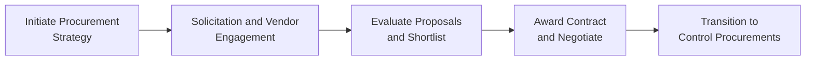

## 23.2 Conducting Procurements and Negotiation Techniques

Effective procurement and negotiation are cornerstones of successful project delivery. After crafting a solid procurement plan (discussed earlier in Chapter 23: Procurement Management), project managers must conduct procurements and hammer out contracts in ways that protect the organization’s interests, meet stakeholder needs, and ensure seamless collaboration with external vendors. This section offers a deep dive into the key processes, techniques, and best practices for engaging vendors, shortlisting proposals, awarding contracts, and negotiating mutually beneficial agreements. We’ll explore practical scenarios and share guiding principles designed to help you navigate the complexities of procurement with confidence and clarity.

Throughout this chapter, you will see references to other relevant sections of this book—for example, risk and uncertainty topics in Chapter 22, stakeholder strategies in Chapter 16, and agile or hybrid approaches introduced in Part V. Integrating insights from these chapters will strengthen your overall procurement management capabilities.

  
### The Importance of Conducting Procurements

Conducting procurements is the phase where project managers and teams put their procurement plan into action. Activities often include:  
• Distributing requests for proposals (RFPs), quotes (RFQs), or information (RFIs).  
• Evaluating vendor responses and qualifications.  
• Negotiating contract terms, including prices, delivery schedules, and performance metrics.  
• Formalizing and awarding the contract.  

By performing these steps systematically, organizations can efficiently enlist external expertise, technology, or resources, thus maximizing the likelihood of achieving project objectives on time and on budget.  

Fostering successful procurements requires skillful communication, risk awareness, stakeholder alignment, and negotiation prowess. Gathering proper documentation, maintaining transparency with bidders, and leveraging the right evaluation criteria all play key roles.  

### Key Procurement Documentation

Before issuing any formal communication to potential vendors, project managers should confirm that the relevant procurement documents are in order. Here are some common examples:

• Statement of Work (SOW) or Scope of Work: Precisely defines what the vendor must accomplish or deliver, including tasks, deliverables, quality requirements, and acceptance criteria.  
• Terms of Reference (TOR): Often used in professional service procurements, focusing on the objectives, resources, constraints, roles, and other contextual data shaping vendor engagement.  
• Request for Quote (RFQ): Typically used when scope and requirements are well-defined, and cost is the primary criterion for selection.  
• Request for Proposal (RFP): More complex than an RFQ; useful when project requirements are multifaceted and involve multiple evaluation criteria such as vendor experience, technical approach, and overall value in addition to cost.  
• Request for Information (RFI): Gathers market insights, vendor capabilities, or emerging technological trends. Useful early in the process but not intended for final selection.  

Having these documents well-prepared ensures clarity for prospective vendors, thereby reducing misunderstandings and potential disputes later in the project lifecycle.  

### Vendor Engagement and Communication Approach

Vendor engagement strategies directly affect the quality and reliability of supplied goods or services. To set up successful vendor relationships:

• Encourage Industry Feedback: If allowable by organizational policy, engage in early market research or vendor conferences. Vendors may offer valuable input regarding the feasibility or improvement of RFP/RFQ requirements.  
• Offer Transparency: Share consistent information to all prospective vendors. This levels the playing field and prevents accusations of unfairness.  
• Provide Q&A Sessions: Offer timely written clarifications to all bidders, ensuring everyone remains aligned on scope and requirements.  

A key principle (see Chapter 5: PMI’s 12 Project Management Principles) is effective communication. Maintaining consistent, ethically sound communications builds trust and helps vendors respond effectively.  

  
### Shortlisting and Evaluation Criteria

Once the RFP or RFQ responses begin rolling in, the next step is to sort through the proposals, identify the strongest candidates, and prepare to conduct more detailed negotiations. To do this systematically:

**1. Develop Evaluation Criteria**  
Common criteria include:  
• Technical: Compliance with technical requirements, creativity of solution, degree of innovation.  
• Financial: Estimated project cost, competitive pricing, total cost of ownership, and payment terms.  
• Quality and Risk: Proposed quality management approach, vendor track record, references, risk mitigation approach.  
• Culture and Values: Alignment with organizational values, corporate social responsibility, sustainability, or diversity objectives.

**2. Use Weighted Scoring Models**  
Assign weights per criterion and systematically score each vendor’s proposal, reducing bias and improving objectivity. The weighting should reflect project priorities set by stakeholders.

**3. Shortlist Vendors**  
In many cases, a shortlisting step narrows the pool of potential suppliers to two or three for deeper analysis. This ensures that the more involved negotiations are reserved for the bidders who have a high potential to deliver optimal results.  

By diligently applying evaluation criteria, you can distinguish between vendors who may simply appear cost-effective and those who genuinely meet project needs in terms of functionality, reliability, and strategic alignment.

### Awarding Contracts

After shortlisting, project managers typically conduct a final selection process. Some organizations run additional steps, like “best and final offers” (BAFO) or final technical presentations, before making the award decision. During this phase:

• Final Due Diligence: Validate vendor references, financial viability, and any legal or compliance requirements.  
• Clarify Terms: If any RFP items remain ambiguous, clarify them before finalizing.  
• Confirm Acceptance Criteria: Ensure both parties are aligned on performance indicators, quality standards, and the formal acceptance process.  

Once both parties sign the contract, you officially have a vendor relationship. However, that is really just the beginning. As highlighted in Chapter 23.3 (Managing Vendor Relationships and Contract Closure) and Chapter 11 (Project Work Performance Domain), managing ongoing performance, communication, and changes will be critical to project success.  

### Negotiation Techniques and Strategies

Negotiation is the art and science of reaching an agreeable contract that serves project objectives while also aligning with the vendor’s interests. Effective negotiations strike a balance between cost savings and building a positive, collaborative relationship.  

#### Preparation and Strategy

The first rule of negotiation success is preparation. Dissect the RFP, the vendor’s proposal, stakeholder’s priorities, and any constraints. Establish your Best Alternative to a Negotiated Agreement (BATNA), the foundation of Harvard’s negotiation framework. By knowing in advance what your fallback plan is, you prevent getting locked into suboptimal terms.  

• Define Your Negotiation Objectives: Are you aiming for the lowest price possible, or is schedule flexibility more critical? Do you want fixed milestone deliverables, or is an iterative approach acceptable?  
• Know the Vendor’s Interests: Are they primarily focused on revenue, forging a long-term partnership, or building a reference case for future business? Having insight into their objectives will help you shape compelling trade-offs.  
• Set Clear Boundaries: Determine non-negotiable items such as compliance requirements, confidentiality clauses, or mandated performance thresholds.  

  
#### Classic Negotiation Approaches

Project managers might adopt one or more of the following negotiation styles:

• Collaborative (Win-Win): The ideal scenario where both parties explore common ground and creative solutions, leading to mutually beneficial agreements and often fostering long-term trust.  
• Competitive (Win-Lose): One party pushes aggressively for maximum advantage—this might yield short-term gains but can sour relationships.  
• Compromising: Each side concedes something to achieve a workable deal. This approach can be quick but may leave unexploited value on the table.  
• Accommodating: One side voluntarily yields to maintain harmony—useful for forging goodwill but risky if your team sacrifices critical needs.  
• Avoiding: Postponing or sidestepping the negotiation entirely—occasionally used for trivial issues or to de-escalate tension, but not recommended for critical project deliverables.  

Though each style has its place, the collaborative approach tends to yield the best long-term results. By understanding the issues from the vendor's perspective, you can often find opportunities to secure more favorable terms. For instance, you might agree to flexible payment schedules in exchange for early delivery discounts or add-on services.  

#### Negotiation Tactics and Ploys

Beyond the broader approaches, effective negotiators use specific tactics—though they must be employed ethically and transparently:

• “What-If” Scenarios: Pose hypothetical changes to scope or timelines to see how vendors respond, revealing their flexibility and potential cost impacts.  
• Bundling: Offer to purchase additional products or services from the vendor at a discounted rate to encourage overall price reductions.  
• Concessions: Proactively propose minor adjustments (e.g., shifting a payment milestone back) to gain greater value in return.  
• Fact-Based Persuasion: Present data—like the vendor’s track record or alternative vendor estimates—that supports your position.  

It is crucial, however, to remain respectful and ethical. Aggressive or deceitful tactics can permanently damage relationships, leading to performance or quality risks down the line.  

  
### Dealing with Conflicts and Disputes

Despite robust preparation, conflicts may still arise. These might center on misunderstood requirements, perceived unfairness in awarding processes, or changes in contract terms. Quick resolution preserves project momentum and fosters healthier relationships.

Common conflict resolution methods include:  
• Collaborative Decision-Making: Sitting down with vendors to collaboratively find a solution that respects each party’s constraints.  
• Mediation or Facilitation: Involving a neutral third party or project stakeholders with authority to re-evaluate contested terms.  
• Contractual Remedies: Escalating to formal dispute clauses that may invoke arbitration or legal recourse if trust or informal resolution fails.  

A key element in conflict management is timely communication—be transparent about the issue and demonstrate a willingness to solve it constructively. Refer to Chapter 16: Stakeholder and Communications Management for tactics that can facilitate better collaboration.  

  
### Integrating Agile and Hybrid Approaches

In projects leveraging agile or hybrid methodologies (see Part V: Agile & Hybrid Delivery Approaches), procurements can deviate from traditional models. For instance, you may consider short sprints or iterative deliverables, with vendors providing incremental updates or prototypes. Contracts might be structured around time and materials (T&M) with fixed unit rates or incremental scope definitions to accommodate evolving requirements.  

A well-structured agile contract might specify:  
• Short iteration cycles for deliverables.  
• Rapid feedback loops and frequent product demonstrations.  
• “Not-to-exceed” cost ceilings incorporating flexible scope.  
• Options to pivot or terminate if incremental results suggest a better approach.  

Negotiating such flexible agreements requires robust collaboration and trust, ensuring that both the buyer and seller are prepared for iterative learning and continuous improvement cycles.  

  
### Tools and Techniques for Conducting Procurements

Various tools facilitate more effective procurement processes, documentation management, and negotiation outcomes:

• E-Procurement Platforms: Centralize RFP publication, vendor Q&A, proposal submission, and evaluation scoring.  
• Video Conferencing and Collaboration Tools: Enable remote or hybrid negotiation sessions, especially for global sourcing.  
• Contract Management Software: Tracks contract versions, changes, and signatories, ensuring that authorized parties securely handle all modifications.  
• Visualization and Dashboards: Summarize vendor performance metrics (quality, cost, schedule) on a single dashboard.  

Below is a simple Mermaid diagram representing a high-level overview of the procurement lifecycle:

Use this diagram as a quick reference to visualize how negotiation fits into the broader procurement lifecycle.  

  
### Real-World Example: Software Development Outsourcing

Consider a mid-sized fintech company seeking to outsource software development. They issue an RFP focusing on specialized compliance software. After receiving multiple proposals, they shortlist three vendors based on:  

1. Technical Expertise in Regulatory Compliance Tools.  
2. Demonstrable Past Performance and References.  
3. Competitive Pricing and Payment Flexibility.  

During negotiations, the project manager offers to pay a portion of the total fee upfront to manage resource allocation risks. In exchange, the chosen vendor agrees to deliver a functioning module within three weeks—a mini milestone—so the project team can validate compliance logic early. By engaging in collaborative negotiation, both parties achieve their goals: The vendor secures partial early funding, and the buyer ensures faster feedback loops for compliance validation. This synergy, documented as part of the contract, aligns with agile principles and fosters a better partnership.  

  
### Common Pitfalls and Ways to Overcome Them

• **Underestimating Scope Clarity**: Vague or incomplete scope leads to confusion and disputes. Always strive for clarity in SOW documents, or utilize flexible agile contracts if the scope is expected to evolve.  
• **Inadequate Vendor Screenings**: Failing to verify financial stability, quality certifications, or references can result in vendor default or performance issues. Do your due diligence thoroughly.  
• **Biased Evaluation**: Decision-making swayed by personal preferences or internal politics jeopardizes fair competition. Use structured scoring models to maintain objectivity.  
• **Overly Aggressive Tactics**: Aggressive cost-cutting can degrade vendor goodwill and quality commitments. Seek a win-win approach for sustainable vendor relationships.  
• **Not Defining Escalation Paths**: When conflicts occur, confusion arises if roles and responsibilities are unclear. Pre-establish escalation procedures in the contract.  

  
### Best Practices for Conducting Procurements and Negotiations

• **Plan and Document**: Prioritize clarity when drafting procurement documents—cutting corners here leads to bigger issues later.  
• **Focus on Collaborative Relationships**: Seek long-term partnerships instead of transactional gains. Mutual respect often yields better pricing and higher quality.  
• **Leverage Expertise**: Engage procurement professionals or legal advisors for contract complexities—particularly in regulated environments.  
• **Use Data-Driven Decision Making**: Rely on historical performance data, risk analysis, and cost-benefit calculations to support your negotiation positions.  
• **Continuous Improvement**: Capture lessons learned and feedback from each procurement cycle to refine future procurement strategies and negotiations.  

  
### References for Further Exploration

• Project Management Institute (PMI), “A Guide to the Project Management Body of Knowledge (PMBOK® Guide) – Seventh Edition.”  
• PMI, “Agile Practice Guide.”  
• Fisher, R., Ury, W., & Patton, B. (2011). “Getting to Yes: Negotiating Agreement Without Giving In.”  
• Benton, W.C. (2020). “Purchasing and Supply Chain Management.”  
• Cialdini, R. (2006). “Influence: The Psychology of Persuasion.”  
• Harvard Business Review Negotiation Articles and Online Courses.  

We encourage you to broaden your perspective by exploring these sources, deepening your project procurement acumen, and continuously refining your negotiation skills.  

## Test Your Knowledge: Conducting Procurements and Negotiation Techniques



### Which documentation is generally best suited to request bids for well-defined goods or services where cost is the primary decision factor?

- [ ] Statement of Work (SOW)
- [x] Request for Quote (RFQ)
- [ ] Request for Proposal (RFP)
- [ ] Request for Information (RFI)

> **Explanation:** When the scope is well-defined and cost is the main selection criterion, an RFQ is typically used. An RFP is more appropriate for scenarios where multiple evaluation factors (e.g., technical capability, approach) come into play, while an RFI often precedes an RFQ or RFP to gather basic data.

### The best alternative to a negotiated agreement (BATNA) is crucial in negotiation planning because it:

- [ ] Guarantees that both parties achieve a win-win result
- [ ] Replaces the need for detailed contract terms
- [x] Establishes the minimum terms under which you should walk away
- [ ] Ensures strict compliance with project scope

> **Explanation:** BATNA determines what you’ll do if negotiation fails. Having a strong BATNA prevents you from settling for unfavorable terms and increases your negotiating leverage.

### What is one typical advantage of adopting a collaborative (win-win) negotiation approach?

- [x] Building long-term relationships and mutual trust
- [ ] Achieving the absolute lowest possible cost
- [ ] Quickly resolving disputes by forcing concessions
- [ ] Eliminating project scope creep without further discussion

> **Explanation:** Collaborative negotiations aim to align parties’ interests for long-term, mutually beneficial relationships, fostering trust and sustainable partnership outcomes.

### Weighted scoring models in vendor selection are most useful because they:

- [x] Provide an objective, quantifiable method for evaluating and comparing vendor proposals
- [ ] Automatically guarantee the lowest total cost of ownership
- [ ] Eliminate the need for subjective judgments in procurement decisions
- [ ] Allow projects to bypass formal risk assessments

> **Explanation:** Weighted scoring models systematically combine multiple factors and weighting schemes, ensuring comprehensive and objective vendor evaluation that aligns with project priorities.

### Which of the following is NOT typically a critical component of final contract negotiation?

- [x] Identifying existing employees to fill vendor roles
- [ ] Confirming acceptance criteria
- [x] Verifying vendor financial stability
- [x] Reviewing payment schedules and milestone deliverables

> **Explanation:** While confirming acceptance criteria, verifying vendor financial viability, and finalizing payment milestones are common during final negotiation, selecting the vendor’s internal employees is usually outside the buyer’s scope. The vendor manages its own staffing.

(Note: This question has three correct answers; ensure you read carefully.)

### In an agile or hybrid project, which contract type is commonly used to accommodate evolving requirements?

- [ ] Fixed-Price (FP)
- [x] Time and Materials (T&M)
- [ ] Cost Plus Fixed Fee (CPFF)
- [ ] Lump Sum Contract (LSC)

> **Explanation:** T&M contracts often suit agile or hybrid setups, enabling flexibility for changing scope within capped or rolling budgets. Fixed-price arrangements can be restrictive if requirements evolve significantly.

### Which negotiation tactic involves making minor concessions to gain more significant benefits in return?

- [ ] Fact-based persuasion
- [ ] Bundling
- [x] Concessions
- [ ] Avoiding

> **Explanation:** Concessions refer to intentionally yielding on smaller points in order to secure greater value on higher-priority aspects of the deal.

### If a vendor disputes the award decision, claiming unfair treatment or incomplete information, the project manager should:

- [ ] Terminate the procurement and restart the process
- [x] Address the concern through transparent communication and possibly re-check evaluation criteria
- [ ] Offer immediate contract terms to the disputing vendor
- [ ] Ignore the complaint unless it reaches legal action

> **Explanation:** When a vendor raises concerns, fairness and due diligence require reevaluation or clarification of selection procedures. Effective communication and transparency help maintain trust and a fair competitive environment.

### What is a key principle for conflict resolution during procurements?

- [ ] Employ aggressive “take it or leave it” approaches
- [ ] Escalate immediately to legal proceedings
- [x] Encourage open dialogue, seeking a mutually beneficial outcome
- [ ] Abandon the disputed procurement entirely

> **Explanation:** Open dialogue and collaborative resolution quickly mitigate misunderstandings and foster mutually acceptable solutions, preserving relationships.

### To manage a negotiation ethically and respectfully, a project manager should:

- [x] Avoid deceptive tactics or coercion
- [ ] Always conceal a strong BATNA from the vendor
- [ ] Use personal bias to favor a local supplier
- [ ] Make unilateral decisions without senior leadership

> **Explanation:** Ethical behavior demands integrity and transparency—deceptive or coercive tactics risk damaging relationships and can lead to legal or reputational issues. Balancing stakeholder input and open communication is essential to an ethical negotiation process.



## PMP Mastery: 1500+ Hard Mock Exams with Full Explanations

Looking to crush the PMP exam with confidence? Dive deep into 6 rigorous mock exams totaling 1500+ advanced-level questions, each accompanied by clear, step-by-step explanations. Hone your test-taking strategies, master complex topics, and build the resilience you need on exam day. Perfect for serious PMs aiming beyond fundamentals.

Enroll now:  
[PMP Mastery: 1500+ Hard Mock Exams with Exceptional Clarity & Full Explanations](https://www.udemy.com/course/pmp-2025/?referralCode=CF83A54BC86BE27F9AFE)

_Disclaimer: This course is not endorsed by or affiliated with the PMI examination authority. All content is provided purely for educational and preparatory purposes._
