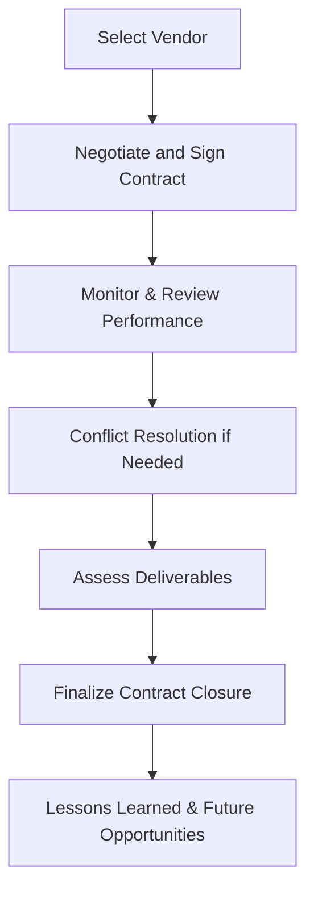

## 23.3 Managing Vendor Relationships and Contract Closure

Managing vendors effectively throughout the project lifecycle can be the deciding factor in whether procurements deliver on scope, cost, and time expectations. Negotiating a robust contract (see section 23.2 on conducting procurements and negotiation techniques) is only the starting point. Project managers must also sustain healthy working relationships, systematically review performance against contractual obligations, resolve conflicts quickly, and ensure a proper closure process once deliverables are accepted. Poor relationships and unmanaged contracts can lead to scope creep, missed deadlines, budget overruns, and strained partnerships. Conversely, skillful vendor management and timely contract closure can yield significant value and foster long-term strategic alliances.

This section explores strategies for cultivating productive vendor relationships, outlines methods to conduct performance reviews, addresses conflict resolution techniques, and provides a step-by-step guide to formal contract closure. Case studies, best practices, and a visual diagram will help clarify key concepts and empower you to manage procurements effectively, ensuring you derive maximum benefit from your vendor partnerships.

---

### Importance of Strong Vendor Relationships

Having a contract in place does not guarantee supplier cooperation or mutual success. Vendors function as critical partners in achieving the project’s objectives, and effective governance of these relationships often contributes to the overall success of the project. Strong vendor relationships:

- Build trust and foster open communication.  
- Enable quicker issue resolution and problem-solving when unforeseen challenges arise.  
- Encourage mutual commitment to project goals.  
- Reduce the risk of misunderstandings or contractual disputes.  

Building a strategic partnership rather than an adversarial relationship leads to better quality, more timely deliverables, and cost savings in the long run.

---

### Key Principles of Vendor Relationship Management

A few guiding principles can help project managers maintain cooperative, transparent, and mutually beneficial connections with vendors:

- Clarity in Expectations: Ensure the vendor knows the specific standards, quality measures, and schedule constraints from the very beginning.
- Continuous Communication: Maintain a communication plan (see Chapter 16: Stakeholder and Communications Management) that keeps vendors informed about project developments, risks, and feedback loops.
- Collaboration and Flexibility: Recognize that unforeseen changes can happen, and a flexible approach promotes resilience in the face of evolving project dynamics.
- Performance Accountability: Set clear metrics to measure vendor outputs and behaviors. Timely performance evaluations help flag issues early and keep both parties aligned.

---

### Performance Reviews and Monitoring

Once the contract is awarded, project managers need to be vigilant in monitoring contractor performance against established milestones, quality benchmarks, and cost targets:

• Establish Performance Metrics: Choose key performance indicators (KPIs) such as on-time delivery, defect rates, or cost variance. Where possible, align these KPIs with the overall project success metrics to highlight the vendor’s contribution to project goals.  

• Conduct Regular Reviews: Schedule periodic performance reviews or status meetings where the vendor presents progress reports. These meetings provide an opportunity to address any emerging risks, discuss resource needs, and confirm compliance with planned work.  

• Document Outcomes: Use dashboards, balanced scorecards, or earned value analysis to track vendor performance (see Chapter 13: Measurement Performance Domain). Documentation not only provides evidence of successes or problems but also serves as a historical record for lessons learned.  

• Continuous Feedback Loops: Set up frequent check-ins or electronic dashboards for near real-time feedback, especially on agile or hybrid engagements. Quick feedback cycles allow the vendor to address issues immediately rather than waiting until formal checkpoints.

---

### Conflict Resolution with Vendors

Even in the best partnerships, conflicts may arise over schedules, deliverables, or changing requirements. Handling these disputes efficiently is paramount for maintaining a productive relationship:

• Proactive Communication: Address warning signs or small disputes before they escalate into major contractual issues.  

• Escalation Path: Establish an escalation mechanism for resolving high-impact disputes. This might involve senior management or third-party mediators, depending on contractual arrangements.  

• Collaborative Problem-Solving: Encourage a win-win approach by focusing on the project’s long-term objectives. By exploring solutions beneficial to both sides, you build goodwill and preserve trust.  

• Formal Dispute Resolution: If internal resolution attempts fail, the contract’s dispute resolution clause (e.g., mediation, arbitration, or litigation) may be invoked. This is generally a last resort due to time, cost, and relationship impacts.

---

### Regulatory and Ethical Considerations

Vendor relationships can become entangled in regulatory, ethical, or compliance risks:

- Follow Procurement Laws: Ensure the procurement process meets all local and international legal requirements.  
- Avoid Conflicts of Interest: Maintain transparency by documenting decisions and ensuring fairness in awarding and managing contracts.  
- Treat Commercially Sensitive Information Appropriately: Protect intellectual property and confidential data to meet legal clauses, safeguarding your organizational reputation.  

Failure to comply can lead to reputational damage, legal disputes, and even project shutdowns. Maintaining ethical relationships fosters trust, cultivates reciprocity, and mitigates risks.

---

### Tools and Techniques for Vendor Management

A broad range of tools and techniques can be utilized, tailored to the project’s size, complexity, and organizational culture:

- Communication Plans: Outlined in your project management plan to specify frequency, channels, and recipients for vendor-related communications.  
- Performance and Quality Audits: Formal checks to ensure vendor-supplied goods and services match quality standards.  
- Collaboration Tools: Shared digital platforms (e.g., cloud-based file sharing, Kanban boards, or dedicated vendor portals) that help monitor tasks, share specifications, and capture issues in real time.  
- Contingency Provisions: Well-documented risk response plans (see Chapter 22: Risk and Uncertainty Management) to address vendor performance issues or supply chain disruptions.

Below is a simple flowchart illustrating the major steps in vendor management, from selecting a vendor to closing the contract. Note how performance review and conflict resolution points are embedded in the ongoing relationship.

---

### Contract Closure

While vendor management focuses on the ongoing relationship, contract closure is the formal process of verifying that all contractual elements have been fulfilled, deliverables have been accepted, and final administrative tasks are completed. Closure ensures no loose ends remain, reduces future liabilities, and prevents confusion about obligations or responsibilities after the project concludes.

#### Final Acceptance and Handover

Achieving final acceptance of deliverables from vendors involves verifying that:

- All contractual deliverables, documentation, and warranties are handed over.  
- Quality standards and acceptance criteria have been met.  
- Any open changes or outstanding tasks are completed or formally transferred to a post-project operational team.  

The project manager should also ensure that the vendor is compensated per contractual agreements, including any retention or hold-back payments tied to deliverable acceptance or performance guarantees.

#### Administrative Closure

Administrative closure refers to the internal processes and formalities needed to conclude the contract. Key elements include:

- Updating Procurement Records: Documenting final contract amount, payment schedules, revised change histories, and performance assessments.  
- Confirming Contract Completion: Officially notifying both the vendor and internal stakeholders that the contract is complete.  
- Ensuring Legal Requirements Are Satisfied: Some industries require official sign-offs, disclaimers, or final compliance checks.  
- Archiving Records: Storing all procurement documentation, including performance reports, correspondence, and lessons learned, for future reference.  

Administrative closure plays a particularly critical role in regulated environments (e.g., healthcare, finance, or government). Auditors and organizational processes often rely on accurate closure documentation to validate compliance.

---

### Knowledge Transfer and Lessons Learned

After the vendor has delivered the final product or service, it’s essential to capture and transfer knowledge to your internal teams. This might involve:

- Conducting Lessons Learned Sessions: Revisit successes and challenges during vendor interaction to identify improvements for future procurements.  
- Documenting Intellectual Property: Collect project artifacts, user manuals, and any relevant system documentation so that future teams can maintain or extend vendor deliverables.  
- Summon Subject Matter Experts: If the vendor’s work involves specialized technology, coordinate with internal SMEs for explicit handover instructions to reduce reliance on external entities after closure.  

Comprehensive knowledge transfer reduces future operational risk and enriches the overall organizational knowledge base.

---

### Common Pitfalls and Challenges

Project managers often face several hurdles when managing vendor relationships and contract closure:

- Failure to Conduct Ongoing Reviews: Sporadic performance checks can result in delayed discovery of issues, potentially jeopardizing project objectives.  
- Overlooking Conflict Prevention: Waiting until formal escalation is needed often exacerbates minor grievances, making them harder to address.  
- Ambiguous Acceptance Criteria: Vague or poorly defined acceptance processes lead to disputes about deliverable completion or quality.  
- Incomplete Closure Documentation: Poorly archived contracts or missing closure forms can create legal, financial, or compliance headaches later.  
- Lack of Knowledge Transfer: Allowing vendor resources to exit without a structured debrief can leave internal teams scrambling to operate or maintain delivered systems.

---

### Best Practices

Adhering to these best practices can significantly enhance vendor management:

- Define Clear Roles and Responsibilities: Ensure everyone understands who handles contract oversight, approval of deliverables, and conflict mediation.  
- Align Contract Management with Overall Governance: Integrate vendor reviews into your project’s governance framework (see Chapter 4: Project Management Fundamentals).  
- Encourage Joint Problem-Solving: Treat vendors as partners, seeking collaborative solutions to issues for optimal outcomes.  
- Maintain a Risk Register: Track vendor-related and contract-specific risks in a dedicated register, updating status and response strategies regularly.  
- Celebrate Mutual Wins: Recognize and appreciate the vendor’s contributions, especially for milestones achieved under challenging conditions.

---

### Real-World Case Study

A multinational retail company contracted a niche supplier to develop a custom point-of-sale (POS) system. The initial vendor evaluation (see Chapter 23.1 on contract types and vendor selection) was thorough, but the contract lacked explicit performance metrics and acceptance criteria for system upgrades. As the project progressed, discrepancies emerged between the vendor’s design approach and the retailer’s functional requirements. 

Instead of treating the vendor as a separate entity, the retailer proactively integrated key supplier personnel into joint planning sessions. Regular performance reviews were scheduled every two weeks to track software sprints. When minor conflicts arose regarding data security standards, the parties engaged a third-party mediator well-versed in fintech compliance. Ultimately, the new POS system was delivered on schedule with minimal rework. The contract closure involved a structured handover, which included final testing, security compliance certification, and user training sessions. Both organizations ended on good terms, leading to a second contract for advanced analytics software.

---

### Conclusion

Managing vendor relationships is a dynamic process that blends technical acumen, leadership, communication, and negotiation skills. Thoughtful planning, continuous performance reviews, and prompt conflict resolution can significantly reduce risks and enhance the outcome of procurement engagements. Once deliverables are verified and accepted, contract closure ensures all obligations have been met and relevant knowledge has been handed over to the organization. Together, these processes form the backbone of successful procurement management, protecting project success and fostering productive, long-lasting vendor partnerships.

---

## Test Your Knowledge: Vendor Management and Contract Closure



### Which of the following is a primary benefit of conducting regular performance reviews with vendors?

- [x] Identifies issues early and allows for timely corrective actions.  
- [ ] Eliminates the need for a formal communication plan.  
- [ ] Removes the requirement for a contract.  
- [ ] Ensures external project stakeholders have less visibility.  

> **Explanation:** Regular performance reviews help detect issues and deviations early, enabling timely corrective measures and reinforcing the importance of ongoing collaboration between your team and the vendor.

### What is the most critical element to define before issuing final acceptance of vendor deliverables?

- [x] Acceptance criteria.  
- [ ] Project Scope Statement.  
- [ ] Budget baseline.  
- [ ] Frequency of communication.  

> **Explanation:** Acceptance criteria clearly spell out how deliverables will be assessed for quality and completeness. Without well-defined acceptance criteria, disputes can arise over whether a deliverable meets contractual obligations.

### Which approach can you use to handle unresolved disagreements that escalate beyond your team’s authority?

- [x] Formal dispute resolution or escalation mechanisms.  
- [ ] Ignoring the problem until the next scheduled status meeting.  
- [ ] Cancelling the contract immediately.  
- [ ] Accepting the vendor’s position to avoid delays.  

> **Explanation:** Formal dispute resolution might involve mediation, arbitration, or additional negotiations conducted at a higher management level. It ensures that conflicts are addressed thoroughly and fairly, based on the contract’s provisions.

### What is the primary goal of administrative closure in project procurement?

- [x] To complete and archive all project documents and confirm obligations are fulfilled.  
- [ ] To shift remaining tasks to another vendor.  
- [ ] To create a completely new project scope.  
- [ ] To ensure the vendor receives additional scope.  

> **Explanation:** Administrative closure ensures all parties have met their contractual obligations, and that records are updated, stored, and documented properly for future reference.

### Which item is typically part of final contract closure activities?

- [x] Archiving all contract-related documentation and lessons learned.  
- [ ] Drafting new contract clauses for the next procurement cycle.  
- [x] Collecting final payments and settling outstanding invoices.  
- [ ] Immediately terminating the vendor relationship without any signoff.  

> **Explanation:** During contract closure, all financial obligations are settled, and relevant project documents—including lessons learned and contract artifacts—are archived. Maintaining a clear signoff on deliverables is crucial.

### Why is knowledge transfer essential after the vendor completes their deliverables?

- [x] It ensures the project team or organization can support and maintain the delivered product.  
- [ ] It expands the vendor’s scope beyond contractual agreement.  
- [ ] It eliminates the need for future communication with the vendor.  
- [ ] It allows the vendor to override project management processes.  

> **Explanation:** Knowledge transfer reduces operational risk by equipping internal teams with the information needed to maintain, update, or further develop the delivered product or service without excessive vendor dependence.

### Which tool or technique can help reveal improvements in the vendor relationship process over time?

- [x] Lessons learned documentation.  
- [ ] A Gantt chart with only high-level tasks.  
- [x] Balanced scorecard.  
- [ ] Sprint backlog updates.  

> **Explanation:** Lessons learned sessions and balanced scorecards can both track performance across multiple dimensions, providing qualitative and quantitative insights into vendor relationships.

### What is a common risk if performance reviews are not conducted regularly?

- [x] Potential quality or schedule issues remain hidden until they become critical.  
- [ ] The project timeline is shortened.  
- [ ] The vendor billing rate is reduced.  
- [ ] Team morale automatically improves.  

> **Explanation:** Infrequent reviews often lead to the late discovery of issues that could negatively impact quality, cost, and schedule, thus increasing project risks and costs.

### When is it most beneficial to involve a third-party mediator?

- [x] When communication breakdowns prevent resolution of a major dispute.  
- [ ] Immediately upon noticing minor delays.  
- [ ] Before any formal contract negotiations are held.  
- [ ] After the project is closed.  

> **Explanation:** A third-party mediator can help resolve complex or heated conflicts that cannot be resolved through regular communication paths, often used after escalating through traditional in-project channels.

### Vendor relationships are most effective when treated as collaborative partnerships rather than strictly transactional. True or False?

- [x] True  
- [ ] False  

> **Explanation:** Collaborating with vendors as partners fosters mutual respect, shared responsibility for outcomes, and often leads to better project results and innovation over time.



---

## PMP Mastery: 1500+ Hard Mock Exams with Full Explanations 

Looking to crush the PMP exam with confidence? Dive deep into 6 rigorous mock exams totaling 1500+ advanced-level questions, each accompanied by clear, step-by-step explanations. Hone your test-taking strategies, master complex topics, and build the resilience you need on exam day. Perfect for serious PMs aiming beyond fundamentals.

Enroll now:  
[PMP Mastery: 1500+ Hard Mock Exams with Exceptional Clarity & Full Explanations](https://www.udemy.com/course/pmp-2025/?referralCode=CF83A54BC86BE27F9AFE)

_Disclaimer: This course is not endorsed by or affiliated with the PMI examination authority. All content is provided purely for educational and preparatory purposes._
