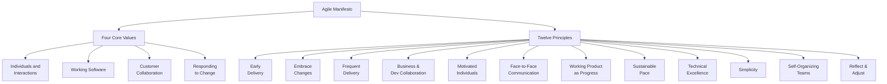

## 24.1 Agile Manifesto and Principles

Agile project management has revolutionized how organizations deliver value by emphasizing flexibility, collaboration, and short feedback cycles. Though initially popularized in software development, the foundational ideas in the Agile Manifesto and its core principles are now used across industries to address fast-changing market demands, increase customer satisfaction, and foster organizational adaptability. This section provides a deep exploration of Agile’s genesis, values, and guiding principles, explaining how you can integrate them into your project management practice. This understanding is critical not only for the PMP® exam (particularly for the People and Process domains discussed in Chapter 6) but also for real-world success in modern project environments.

### Introduction to the Agile Movement

Agile is more than just a set of practices—it's a mindset that prioritizes learning, adaptability, and continuous improvement. Projects frequently face evolving requirements and constraints, and traditional predictive approaches (see Chapter 9: Development Approach and Life Cycle Performance Domain) can falter when teams cannot anticipate all future needs upfront. Instead, Agile embraces the reality of change and leverages iterative work cycles to refine solutions over time.

In practical terms, Agile principles advocate short development cycles with frequent reviews, constant customer engagement, and empowered teams. This flexibility helps deliver valuable increments sooner, gather feedback earlier, and steer the project based on real-world conditions. When used effectively, Agile can reduce project risk, enhance innovation, and encourage greater stakeholder satisfaction.

### Origins of the Agile Manifesto

In February 2001, a group of seventeen software professionals—among them Kent Beck, Martin Fowler, Ron Jeffries, and others—gathered in Snowbird, Utah. They shared a common frustration with cumbersome development methods that demanded exhaustive upfront planning and rigid adherence to processes. From their discussions emerged the “Manifesto for Agile Software Development,” which succinctly captured the values and principles of iterative, adaptive, and collaborative work.

Though originally intended for software development, the Agile Manifesto’s core tenets have since been adapted to a wide array of industries, including healthcare, finance, education, and even manufacturing. As you read through these values and principles, keep in mind that Agile is not limited to IT or tech-driven contexts. Rather, it serves as a universal philosophy that emphasizes human-centric, value-driven ways of working.

### The Four Core Values

The Agile Manifesto is anchored by four fundamental values that guide collaborative behaviors and decision-making. These values encourage placing greater emphasis on certain areas over others, rather than discarding traditional processes entirely. That subtle difference encourages a balanced approach: processes, tools, planning, and contracts are still considered important, but they should never overshadow individuals, collaboration, and the ability to adapt.

1. **Individuals and Interactions over Processes and Tools**  
   At its heart, Agile prizes the ability of team members to work together effectively and solve problems collaboratively. While processes and tools can help streamline tasks, they should not overshadow open communication, trust, and interpersonal relationships. When teams are empowered to engage face-to-face (or voice-to-voice in virtual environments), they can resolve issues more quickly and maintain alignment (refer also to Chapter 8: Team Performance Domain).

2. **Working Software over Comprehensive Documentation**  
   While the manifesto originally says “working software,” this value can be reinterpreted in non-software contexts as “working deliverables over excessive documentation.” This does not imply that documentation is irrelevant—it still matters for knowledge transfer, compliance, and maintenance. However, the ultimate measure of success is tangible progress toward a completed product or service, rather than perfectly formatted documents.

3. **Customer Collaboration over Contract Negotiation**  
   Agile raises customer involvement to a strategic level. Instead of seeing the customer simply as a party to a contract, Agile teams encourage frequent dialogue and joint decision-making with stakeholders. Doing so fosters better alignment and allows teams to adjust scope, requirements, and priorities as new insights arise (see Chapter 7: Stakeholder Performance Domain).

4. **Responding to Change over Following a Plan**  
   Traditional project methods often try to freeze requirements and control change. Agile, on the other hand, is built on the assumption that changes—be they new insights or evolving market conditions—are inevitable and should be welcomed. Planning is still crucial, but it should be flexible. If new information emerges, teams pivot to better address the evolving circumstances.

### The Twelve Agile Principles

Accompanying these four values are twelve principles that clarify the intent behind Agile practices. These principles align closely with PMI’s principles of stewardship, adaptability, continuous improvement, and more (discussed thoroughly in Chapter 5). Understanding each principle empowers you to apply Agile effectively on real-world projects and address domain-specific challenges.

1. **Customer Satisfaction through Early and Continuous Delivery**  
   Teams continuously deliver value to customers by breaking projects into small, usable increments. Rapid feedback loops identify which features truly matter and which can be modified or removed.

2. **Welcome Changing Requirements, Even Late in Development**  
   Agile embraces the reality that change is unavoidable, especially when developing innovative products or reacting to a dynamic business environment. Rather than penalizing change requests, Agile teams assess and incorporate them as opportunities to create a better outcome.

3. **Deliver Working Products Frequently**  
   The ultimate objective is to produce tangible, functional outputs. Regular demonstrations or reviews help surface issues and validate direction, minimizing the risks inherent in long development cycles.

4. **Business and Technology Teams Must Work Together Daily**  
   Whether you are in IT, manufacturing, or marketing, tightening the feedback loop between end-users, sponsors, and the delivery team helps prevent misunderstandings. Consistent communication ensures shared objectives and quicker problem resolution.

5. **Build Projects around Motivated Individuals**  
   Successful Agile environments empower individuals who have the skills and autonomy to make decisions rapidly. Trust and support encourage ownership and accountability for outcomes.

6. **Use Face-to-Face Communication Wherever Possible**  
   Though virtual communication is prevalent, especially in global or distributed teams, face-to-face or direct voice-to-voice engagement reduces misinterpretation, builds rapport, and fosters empathy among team members.

7. **Working Product Is the Primary Measure of Progress**  
   In Agile, partial completion of tasks is less significant than actual delivery of working features or solutions. This shifts the focus from busywork to delivering meaningful results (see Chapter 13: Measurement Performance Domain for more on measuring outcomes).

8. **Maintain a Sustainable Pace**  
   Teams perform best when they’re not burned out. Frequent iterations can be intense, but burnout leads to errors and turnover that ultimately waste time and resources.

9. **Continuous Attention to Technical Excellence and Good Design**  
   Cutting corners in quality or design can hamper flexibility over time. Agile teams embed continuous improvement in their processes, ensuring that solutions remain maintainable, scalable, and adaptable.

10. **Simplicity—Maximizing the Amount of Work Not Done—is Essential**  
   Agile encourages minimizing waste in processes, features, and documentation. Focus on what is truly needed to deliver immediate value.

11. **Self-Organizing Teams**  
   Teams that manage their own work distribution, solve problems, and adapt processes build agility from within. This principle also fosters innovation, as team members can propose creative solutions without hierarchical constraints.

12. **Regular Reflection on How to Become More Effective**  
   In Agile, retrospectives at the end of each iteration or increment allow teams to learn from successes and failures. Teams continually tune and adjust their practices to improve efficacy and morale.

### Visual Overview of Values and Principles

Below is a basic Mermaid diagram representing the key components of the Agile Manifesto. This visual lays out how the four core values and twelve principles support a cohesive Agile philosophy:

Each node highlights a core idea; together, they reflect a mindset of adaptability, learning, and human-centric delivery.

### Agile Mindset and Culture

Agile is more than a framework or a set of rituals; it is a culture of respect, transparency, and collective responsibility. While frameworks like Scrum or Kanban (explored in Chapter 25) provide structure, the underlying mindset is what fosters lasting change. If teams embrace core Agile philosophies—such as customer focus, continuous feedback, and rapid decision-making—the growth in productivity and stakeholder satisfaction can persist even if they adapt or shift among frameworks.

#### Encouraging an Agile Environment

• **Leadership Buy-In**: Senior leaders must understand and champion Agile values for them to permeate the organization. When executives consistently reinforce the importance of experimentation and customer collaboration, teams feel safe to embrace iterative approaches.

• **Psychological Safety**: Creating an environment where team members can take risks, voice concerns, and fail without punitive consequences is crucial to fostering an innovative culture (see Chapter 33: Advanced Leadership and Team Development).

• **Continual Learning**: Agile calls for ongoing learning through retrospectives, knowledge sharing, and training. These activities encourage individuals and teams to refine their processes and maintain a high level of engagement.

### Applying Agile Principles in Project Management

Agile’s adaptability aligns closely with the PMP® exam domains. For instance, the “People” domain prioritizes servant leadership, motivating teams, and stakeholder engagement—concepts at the forefront of Agile’s values. Meanwhile, the “Process” domain focuses on delivering outcomes through structured planning and controlling processes; Agile recognizes these but allows for adaptive planning and incremental feedback. Lastly, the “Business Environment” domain underscores the necessity of aligning projects with organizational strategy, echoing the Agile principle of continuous collaboration with stakeholders, including executives and end-users.

In practical application:

• **Adaptive Life Cycles**: Help your team select the right approach (predictive, iterative, or hybrid) as discussed in Chapter 9. An Agile approach is particularly well-suited when requirements are dynamic and solutions are likely to evolve significantly.

• **Backlogs over Static Requirements**: Instead of formal, fixed scope documents, Agile projects use prioritized backlogs that can change based on feedback. This ensures your project remains relevant to stakeholder needs.

• **Frequent Reviews**: Agile teams perform regular reviews or Sprint Reviews to demonstrate new functionalities. This direct involvement with stakeholders helps confirm that the project is on track to provide real value.

• **Empowered Roles**: Scrum Masters or Agile Coaches ensure the process is being followed and improvements are identified continuously, while Product Owners (or business representatives) act as the voice of the customer.

### Real-World Examples and Case Studies

To illustrate the impact of Agile, consider these examples:

• **Telecommunications Company**: A global telecom firm facing rapidly evolving customer demands adapted Agile for developing new service bundles. By involving customers in regular demos, they refined offers and drastically reduced the time to market. After adopting Agile, they consistently met changing expectations, improved retention rates, and saw a reduction in rework.

• **Public Sector Healthcare**: A government healthcare agency used Agile approaches to roll out patient-care software. Instead of a two-year overhaul, they launched a minimum viable product in under six months. Subsequent iterations, guided by user feedback, fine-tuned clinical workflows and data reporting. The final system was far more aligned with the clinicians’ real needs, saving budget and garnering high user satisfaction.

• **Financial Services**: A bank wanting to launch digital-only services leveraged Agile cross-functional teams—comprising marketing, compliance, operations, and IT—to design a mobile application. By collaborating under consistent feedback loops, they addressed even late-emerging regulatory requirements and delivered a user-friendly app in short incremental releases.

### Common Pitfalls and Best Practices

Though Agile offers numerous benefits, its success hinges on disciplined execution, cultural alignment, and proper stakeholder engagement.

**Pitfalls:**

• **Cargo Cult Agile**: Merely adopting Agile ceremonies—like Daily Standups or Sprints—without embracing the underlying mindset can lead to superficial changes that fail to deliver results.  
• **Underestimating Planning**: “Responding to change over following a plan” does not mean ignoring planning. Agile uses continuous, iterative planning to align deliverables with evolving needs.  
• **Lack of Executive Support**: If upper management expects rigid deadlines and extensive documentation, teams will struggle to adopt Agile’s iterative nature successfully.

**Best Practices:**

• **Iterate Gradually**: Transition parts of a project to Agile rather than attempting an overnight transformation. This incremental approach allows the organization to build competencies and refine methods.  
• **Invest in Training**: Ensure all participants—team members, stakeholders, and sponsors—understand foundational Agile concepts.  
• **Measure Outcomes**: Use metrics like velocity, customer satisfaction, and team morale. Evaluate whether these indicators improve with each iteration.  
• **Tailor Approaches**: While the Agile Manifesto provides guiding values and principles, the actual implementation can vary. Hybrid forms, as discussed in Chapter 27, can blend the best of both predictive and iterative methods.

### References for Further Exploration

• Beck, K., et al. (2001). “Manifesto for Agile Software Development.” Available at [agilemanifesto.org](https://agilemanifesto.org).  
• PMI (2021). Agile Practice Guide. Project Management Institute.  
• Sutherland, J. (2014). “Scrum: The Art of Doing Twice the Work in Half the Time.” Currency.  
• Chapter 25 of this book: “Agile Frameworks and Methodologies”  
• Chapter 27 of this book: “Hybrid Approaches”  

---

## Agile Manifesto Mastery Quiz



### Which of the following best describes the primary objective of the Agile Manifesto?

- [ ] To eliminate documentation entirely.
- [ ] To establish rigid processes for project completion.
- [x] To guide teams in focusing on adaptability, collaboration, and value delivery.
- [ ] To ensure every requirement is fixed at the start of the project.

> **Explanation:** The Agile Manifesto highlights four core values and 12 principles that prioritize collaboration, customer value, and responsiveness to change. It does not eradicate documentation or enforce rigidity.

### Which of the following is NOT one of the four core values of the Agile Manifesto?

- [ ] Individuals and interactions over processes and tools.
- [ ] Working software over comprehensive documentation.
- [x] Strict adherence to a fixed scope over adjusting to changes.
- [ ] Responding to change over following a plan.

> **Explanation:** Agile specifically values being flexible and adaptive to change. Strict adherence to a fixed scope contradicts one of the manifesto’s primary tenets.

### According to Agile principles, what is the best indicator of progress in a project?

- [ ] Completed project charters and contracts.
- [x] Customer feedback on working deliverables.
- [ ] Percentage of tasks marked as complete in a Gantt chart.
- [ ] Amount of written documentation produced.

> **Explanation:** While documentation and planning artifacts have their place, working deliverables (and user feedback on them) serve as the primary measure of progress according to the Agile Manifesto.

### Why do Agile teams encourage frequent “face-to-face” or direct communication?

- [ ] To cut down on meeting costs.
- [ ] To ensure management can monitor every conversation.
- [x] To minimize misinterpretation and foster real-time problem-solving.
- [ ] To replace modern communication tools with outdated methods.

> **Explanation:** Engaging in direct communication, whether physically or virtually, helps Agile teams quickly resolve misunderstandings and maintain alignment.

### Which principle addresses the continuous refinement of methods and processes within an Agile team?

- [ ] Plan-Do-Check-Act (PDCA) from Lean.
- [ ] The principle of producing comprehensive documentation.
- [x] The principle of reflecting at regular intervals to become more effective.
- [ ] The principle of building self-organizing teams.

> **Explanation:** The twelfth principle states that Agile teams regularly reflect on how to improve effectiveness, which often takes place during retrospectives.

### The Agile mindset can thrive in non-software industries because:

- [x] Its values and principles focus on collaboration, adaptability, and customer satisfaction.
- [ ] It requires minimal interpersonal interaction and assumes static requirements.
- [ ] It relies solely on iterative software development frameworks.
- [ ] It prohibits the use of any predictive planning methods.

> **Explanation:** Agile’s guiding values—for instance, focusing on customer collaboration and responding to change—are universal and can benefit a wide range of project environments beyond software.

### Which of the following is a best practice for successfully implementing Agile?

- [ ] Drastically transforming all processes at once.
- [ ] Refusing to engage stakeholders until the end of development.
- [x] Gradually introducing Agile practices and tailoring them to fit organizational needs.
- [ ] Eliminating all documentation requirements to improve speed.

> **Explanation:** Incremental change helps organizations adapt more smoothly and avoid overwhelming disruptions. Customizing Agile practices aligns them with specific contexts and constraints.

### A key reason self-organizing teams are encouraged in Agile is:

- [x] They promote shared ownership, faster decision-making, and innovation.
- [ ] They eliminate the need for leadership roles.
- [ ] They enforce strict hierarchy and role boundaries.
- [ ] They must adhere to a single, unchanging approach.

> **Explanation:** Self-organizing teams can more readily adapt to evolving project requirements and client needs, leveraging the collective knowledge and creativity of the group.

### What benefit arises from “responding to change over following a plan”?

- [x] Teams can adjust to new insights or environmental shifts without derailing the entire project.
- [ ] It only helps teams avoid all forms of documentation.
- [ ] Teams can disregard stakeholder expectations.
- [ ] All planning is conducted solely at the end of the project.

> **Explanation:** Agile recognizes that plans can become outdated as new information emerges. Adjusting promptly ensures the project remains aligned with the core objectives.

### True or False: The Agile Manifesto implies that processes and tools have no value at all.

- [ ] True
- [x] False

> **Explanation:** Agile still recognizes the importance of processes and tools but places greater emphasis on individuals, interactions, and adaptability. It never states processes and tools have no value.



---

## PMP Mastery: 1500+ Hard Mock Exams with Full Explanations 

Looking to crush the PMP exam with confidence? Dive deep into 6 rigorous mock exams totaling 1500+ advanced-level questions, each accompanied by clear, step-by-step explanations. Hone your test-taking strategies, master complex topics, and build the resilience you need on exam day. Perfect for serious PMs aiming beyond fundamentals.  

Enroll now:  
[PMP Mastery: 1500+ Hard Mock Exams with Exceptional Clarity & Full Explanations](https://www.udemy.com/course/pmp-2025/?referralCode=CF83A54BC86BE27F9AFE)

_Disclaimer: This course is not endorsed by or affiliated with the PMI examination authority. All content is provided purely for educational and preparatory purposes._
