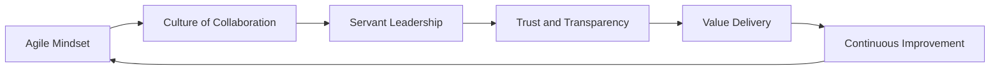

## 24.2 Agile Mindset, Culture, and Servant Leadership

Agile methodologies revolve around an ethos of collaboration, self-organization, and trust. These core tenets foster an environment where teams innovate freely, adapt to change swiftly, and ultimately deliver higher value to customers and stakeholders. In contrast to traditional project management—which often emphasizes hierarchical oversight and detailed planning—Agile approaches empower teams to make decisions and self-correct. This fundamental shift requires not only new processes but also a profound cultural and mindset transformation. 

Below, we explore the foundational elements of the Agile mindset, the guiding principles of building an Agile culture, and how servant leadership underpins these dynamics. By the end, you should understand why collaboration, self-organization, and trust are the pillars that differentiate Agile teams from their traditional counterparts.

### What is an Agile Mindset?
An Agile mindset is a way of thinking that focuses on delivering customer value, embracing change, and encouraging continuous improvement. Individuals and organizations adopt this mindset by:

• Emphasizing adaptability over rigidity.  
• Prioritizing customer feedback over following a static plan.  
• Handling change as an opportunity rather than a threat.  
• Encouraging people to experiment, learn, and pivot quickly.  

Agile is far more than just a set of methods (e.g., Scrum, Kanban). It is a cultural worldview where teams work together more transparently, innovate more frequently, and timebox their efforts to maintain focus and momentum. According to the Agile Manifesto, the highest priority is to satisfy the customer through the early and continuous delivery of valuable work. The Agile mindset underpins every decision made in the project life cycle, from conceptualization to final release.

### Elements of an Agile Culture
Culture defines the shared values, norms, and behaviors of an organization. In an Agile context, culture is fundamentally collaborative and people-centric. The key traits of an Agile culture include:

**1. Open Communication and Transparency**  
Teams freely exchange ideas, concerns, and daily progress updates. This eliminates information silos and fosters a sense of shared ownership in project outcomes.

**2. Psychological Safety**  
Team members feel safe to express divergent opinions, try new approaches—even fail—and learn without fear of blame or retribution. This leads to innovation, continuous learning, and resilient teams.

**3. Learning from Experiments**  
Rather than waiting for large, monolithic releases, Agile teams incorporate short feedback loops such as sprints or iterations. Each loop allows for learning, reflection, and adjustment. Teams test small increments, gather feedback, and refine their products continuously.

**4. Continuous Improvement (Kaizen)**  
Agile teams constantly look for ways to refine processes, improve quality, and raise performance levels. Regular retrospectives, “inspect-and-adapt” rituals, and daily stand-up meetings help maintain a cycle of perpetual improvement.

**5. Empowerment and Self-Governance**  
Team members collectively decide how best to accomplish their work. Individuals are trusted to manage their own tasks with minimal hierarchical interference. This contrasts with traditional top-down governance that dictates every detail.

The cultural transformation to Agile can be challenging. It often demands rethinking established structures of project reporting, reevaluating traditional incentive systems, and, on a personal level, letting go of command-and-control behaviors.

### Collaboration as the Lifeblood of Agile
In an Agile environment, collaboration unfolds on multiple levels: among team members, with stakeholders, and across the extended project ecosystem. Successful collaboration relies upon:

- **Frequent Communication**: Agile ceremonies—daily standups, retrospectives, sprint reviews—keep transparency high and ensure no single individual hoards critical knowledge.  
- **Collective Responsibility**: Deliverables become a shared outcome. Rather than holding just a project manager accountable, the full team engages in planning, designing, coding, testing, or other relevant tasks.  
- **Mutual Support**: Agile fosters a culture where team members rally around each other’s tasks and challenges. A tester may collaborate with a developer on a coding problem; a developer might help clarify requirements with business stakeholders.  

In a traditional, sequential (waterfall) approach, communication often happens through formal documentation handovers between siloed groups. In Agile, collaboration is continuous and fluid. This close partnership among cross-functional teams drastically reduces misinterpretation and rework.

### Self-Organization and Empowerment
A hallmark of Agile teams is self-organization—the ability to decide how work is tackled, who does what, and how internal processes unfold. Key features include:

- **Decentralized Decision-Making**: Instead of waiting for instructions from management, Agile teams make conclusive decisions about the “how” of their work.  
- **Role Fluidity**: In many Agile frameworks (e.g., Scrum), individuals have specialized skill sets but also help one another prevent bottlenecks. This cross-functional collaboration ensures that tasks are rarely ‘blocked’ by a single specialized resource.  
- **Collective Estimation**: During sprint planning, the entire team is involved in estimating the complexity or effort of upcoming tasks. This builds shared conviction in the project plan and fosters accountability.  
- **Transparent Work Allocation**: Work items are typically placed on a visible board (digital or physical), letting everyone see tasks, their status, and the people responsible.

Self-organization demands an environment infused with trust, clarity of purpose, and robust communication practices. When done right, it liberates employees from restrictive micromanagement and encourages them to adopt a growth mindset.

### Trust as a Core Differentiator
Trust in Agile teams is not merely a soft skill—it's central to effective value delivery. Without trust, collaboration and self-organization crumble under the weight of fear and uncertainty. Agile teams that cultivate trust often view mistakes as learning opportunities rather than grounds for blame. Key factors that amplify trust:

• **Transparency**: Sharing reliable information—both good and bad news—helps teams make informed decisions and fosters credibility.  
• **Respect**: Valuing and listening to all voices in the team, regardless of seniority or title.  
• **Accountability**: Team members follow through on commitments. Measures such as daily standups or sprint reviews highlight accountability without resorting to micro-managed checklists.  
• **Supportive Leadership**: Leaders encourage honest communication and respect confidentiality, especially during conflict resolution or risk management.

Traditional environments might demand compliance first, establishing trust slowly or only in pockets. Agile environments, conversely, treat trust as the bedrock, nurtured daily through mutual respect, fairness, and openness.

### Servant Leadership: The Catalyst of Agile Teams
Servant leadership is a leadership philosophy in which the primary goal is to serve the team’s needs, enabling its members to thrive. In Agile, servant leadership displaces the old model of top-down control, focusing on facilitating, mentoring, and removing impediments. 

**Characteristics of Servant Leaders**  
• **Empathy & Active Listening**: Servant leaders genuinely listen to concerns and empathize with individual team member challenges.  
• **Empowerment**: They grant autonomy, let teams discover solutions, and only intervene to remove obstacles or provide resources.  
• **Development Focus**: Servant leaders coach and mentor rather than command, focusing on growing individuals’ skills, capabilities, and confidence.  
• **Commitment to Growth**: They invest in training, tools, and environmental factors that enable the team to excel.  

In frameworks such as Scrum, the Scrum Master role exemplifies servant leadership. The Scrum Master does not “manage” the team in the traditional sense but protects the team from external disruptions, coaches Agile best practices, and encourages continuous improvement.

> **Tip:** Effective servant leadership requires leaders to set aside ego and personal agendas. By naturally allowing the team to self-organize, servant leaders can harness creativity, boost morale, and speed up business outcomes.

### Comparing Agile Teams to Traditional Teams
Below is a simplified chart contrasting typical attributes of Agile teams vs. traditional (predictive) teams:

| Attribute                  | Agile Teams                                        | Traditional Teams                     |
|----------------------------|----------------------------------------------------|---------------------------------------|
| **Structure**             | Self-organizing, cross-functional, flexible         | Often hierarchical, specialized roles |
| **Leadership Style**       | Servant leadership                                 | Command-and-control                   |
| **Decision-Making**       | Decentralized, owned by the team                    | Centralized, owned by project manager |
| **Planning Approach**      | Iterative, adaptive                               | Upfront, predictive                   |
| **Collaboration**          | High, continuous (daily standups, retrospectives)  | Moderate, mostly during planned phases|
| **Scope/Requirements**     | Evolving, open to negotiation and change           | Fixed, managed strictly via change control|
| **Trust Building**         | Rapid feedback loops and transparency              | Depends on formal progress reporting  |
| **Error Handling**         | Fail fast, learn fast                              | Errors are escalated, then corrected  |

In essence, Agile teams rely on trust, collaboration, and iterative engagement to mitigate risks and create value. This stands in contrast to traditional teams where formal project control mechanisms aim to reduce uncertainty.

### Practical Examples and Case Studies
1. **Software Development**: A Scrum team delivering an e-commerce website. Activities like daily standup meetings allow the developer, tester, and UX designer to sync tasks frequently, while sprints let the product manager adjust priorities based on market feedback. The Scrum Master, as a servant leader, removes organizational roadblocks, ensuring the team has the requisite access to customer feedback and system resources.

2. **Marketing Campaign**: In an Agile marketing campaign, cross-functional teams share tasks held in a Kanban board. Rather than a marketing manager supplying all tasks, the entire team collaborates to brainstorm content, design assets, test pilot campaigns, and pivot strategies based on real-time analytics. 

3. **Organizational Transformation**: A large traditional bank adopting Agile across multiple departments invests in servant leadership training for managers. They encourage managers to transform into coaches and mentors, shifting incentives to reward collaborative achievements and iterative experimentation.

Each scenario demonstrates the core ingredients of Agile: self-organization, continuous feedback, ownership, and, crucially, servant leadership enabling trust and transparency.

### Mermaid Diagram: Agile Mindset in Action

In this diagram:
- An **Agile Mindset** underpins the entire system.  
- A **Culture of Collaboration** is nurtured by consistent communication and collective responsibility.  
- **Servant Leadership** fosters empowerment, making sure teams remain self-directed and focused.  
- **Trust and Transparency** drive open, honest interactions that bolster psychological safety.  
- **Value Delivery** emerges as teams provide tangible outcomes iteratively.  
- **Continuous Improvement** ensures each retrospective or feedback loop feeds back into reinforcing and refining the Agile Mindset.

### Common Pitfalls and Roadblocks
Even though an Agile mindset can yield significant benefits, several pitfalls can derail the transformation:

• **Token Adoption**: Merely adopting the “ceremonies” (e.g., daily standups) while retaining a command-and-control approach or neglecting genuine team empowerment is a recipe for frustration.  
• **Fear of Losing Control**: Leaders who struggle to relinquish authority or delegate decisions can erode trust.  
• **Inadequate Training**: Teams require both skills development (technical, collaborative, leadership skills) and cultural alignment to operate effectively.  
• **Poor Stakeholder Engagement**: Agile projects need constant feedback. A lack of stakeholder involvement leads to misguided priorities and rework.  

### Strategies for Success
1. **Invest in Education and Training**: Provide comprehensive Agile training to leaders, team members, and stakeholders. Encourage certification, exposure to workshops, and cross-team knowledge sharing.
2. **Model Servant Leadership**: Leaders at all levels should demonstrate humility, collaboration, and a willingness to serve the team. 
3. **Pilot Projects**: Start small by trialing Agile teams in low-risk initiatives, gather lessons, and gradually expand. 
4. **Revisit Governance Structures**: Adapt oversight mechanisms to shorter cycles—weekly or bi-weekly rather than monthly or quarterly. 
5. **Encourage Open Dialogue**: Use retrospectives to discuss challenges openly, propose improvements, and implement them in the next iteration.

### References for Further Exploration
- “The Agile Practice Guide” published by PMI in collaboration with Agile Alliance.  
- “Scrum: The Art of Doing Twice the Work in Half the Time” by Jeff Sutherland.  
- “Servant Leadership: A Journey into the Nature of Legitimate Power and Greatness” by Robert K. Greenleaf.  
- “The 7th Edition PMBOK® Guide,” especially the sections that dwell on project guiding principles and performance domains.  

These sources dive deeper into the principles, practices, and frameworks that drive Agile success, and further illustrate the servant leadership ethos.

---

## Test Your Knowledge: Agile Mindset, Culture, and Servant Leadership



### Agile culture emphasizes open communication to:
- [ ] Micro-manage individual team tasks.
- [ ] Increase the number of status reports.
- [ ] Restrict information flow for security.
- [x] Foster transparency and rapid feedback loops.

> **Explanation:** Agile culture thrives on transparency and frequent communication. This enables continuous feedback and swift issue resolution, rather than controlling people or restricting information.

### What is one key difference between Agile and traditional teams?
- [x] Agile teams focus on continuous adaptation and change.
- [ ] Agile teams rarely communicate with stakeholders.
- [ ] Traditional teams strive to embrace uncertainty above all else.
- [ ] Traditional teams use iteration to increment deliverables.

> **Explanation:** Agile teams are inherently adaptive, welcoming changes throughout the project. Traditional teams typically rely on upfront planning with a fixed scope and have fewer open cycles for adaptation.

### Which trait best describes servant leadership?
- [ ] Emphasizing formal authority and task delegation.
- [ ] Controlling team decisions at a high level.
- [x] Prioritizing the growth, empowerment, and well-being of the team.
- [ ] Directing every action taken by the team.

> **Explanation:** Servant leaders focus on serving the team’s needs, fostering collaboration, growth, and trust, rather than using their position to command.

### In an Agile environment, how is trust typically built?
- [ ] By penalizing mistakes as a deterrent to errors.
- [ ] Through lengthy progress reports reviewed quarterly.
- [x] Through transparent communication, accountability, and shared ownership.
- [ ] By restricting all communication to formal documentation.

> **Explanation:** Agile encourages open communication in daily standups, retrospectives, and other collaborative activities. Mistakes are viewed as learning opportunities, and the team collectively owns outcomes.

### Which of the following is true about self-organizing teams?
- [x] They decide how tasks and responsibilities are allocated within the team.
- [ ] They must always follow one manager’s directives.
- [x] They dynamically shift roles to meet project needs.
- [ ] They rely on formal written approvals for all minor decisions.

> **Explanation:** Self-organizing teams own the “how” of their work, allocate roles dynamically based on context, and adapt structure as needed for effectiveness. They do not rely on strict top-down instructions for every decision.

### A major driver for continuous improvement (Kaizen) in Agile is:
- [x] Iterative feedback loops and retrospectives.
- [ ] Sticking to rigid processes.
- [ ] Minimizing communication to monthly team updates.
- [ ] Centralizing decision-making strictly at the executive level.

> **Explanation:** Agile’s mechanisms such as retrospectives spur continuous improvement. By analyzing what went well and what can be improved, teams refine their processes continuously.

### Which statement about collaboration in Agile is correct?
- [x] Collaboration is a continuous practice involving daily interactions and team ceremonies.
- [ ] Collaboration is limited to formal contract negotiations.
- [x] Sustainable collaboration relies on trust and transparency.
- [ ] Collaboration in Agile rarely involves cross-functional teams.

> **Explanation:** Agile methods emphasize dynamic collaboration among cross-functional team members. This is sustained by high trust and ongoing communication. Contract negotiations alone do not constitute collaboration.

### When transitioning from a traditional approach to Agile, one common pitfall is:
- [x] Keeping command-and-control leadership while adopting only the outward Agile rituals.
- [ ] Stopping empowerment so that teams focus only on delivering quickly.
- [ ] Eliminating feedback loops to streamline tasks.
- [ ] Adding extra hierarchical layers to enhance decision-making.

> **Explanation:** Superficially implementing Agile ceremonies without adopting a servant leadership style or empowering teams undermines the core principles of Agile, creating dysfunction rather than benefits.

### How does servant leadership support self-organizing teams?
- [x] By removing obstacles and empowering team members to solve problems.
- [ ] By assigning tasks and monitoring them closely at every stage.
- [ ] By limiting the team’s decision-making responsibilities.
- [ ] By enforcing strict escalation protocols for all decisions.

> **Explanation:** A servant leader’s role is to promote the team’s autonomy and ensure the environment and resources are available so the team can self-organize, learn, and excel without micromanagement.

### Servant leadership prioritizes:
- [x] True
- [ ] False

> **Explanation:** Servant leadership does indeed prioritize the well-being and growth of the team, focusing on removing impediments and enabling team success rather than dictating every move.



---

## PMP Mastery: 1500+ Hard Mock Exams with Full Explanations

Looking to crush the PMP exam with confidence? Dive deep into 6 rigorous mock exams totaling 1500+ advanced-level questions, each accompanied by clear, step-by-step explanations. Hone your test-taking strategies, master complex topics, and build the resilience you need on exam day. Perfect for serious PMs aiming beyond fundamentals.

Enroll now:  
[PMP Mastery: 1500+ Hard Mock Exams with Exceptional Clarity & Full Explanations](https://www.udemy.com/course/pmp-2025/?referralCode=CF83A54BC86BE27F9AFE)

_Disclaimer: This course is not endorsed by or affiliated with the PMI examination authority. All content is provided purely for educational and preparatory purposes._
