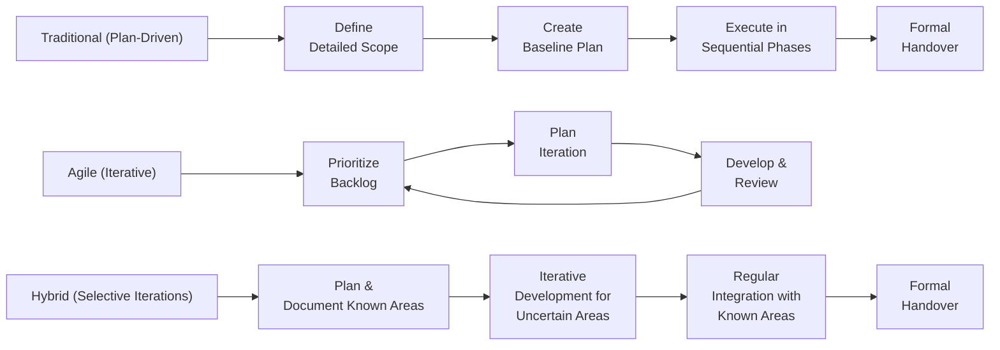

## 24.3 Agile vs. Traditional vs. Hybrid

Projects vary dramatically in complexity, uncertainty, and stakeholder requirements. Choosing the right approach—Agile, Traditional (Predictive), or Hybrid—can be the defining factor between success and frustration. While some teams excel in a structured, plan-driven setting, others benefit from the flexibility of iterative development. In many modern environments, a blend of both (Hybrid) often emerges as the preferred strategy. In this section, we will compare the three approaches, offering practical insights so you can confidently identify which method best suits your project’s needs.

This topic builds upon core concepts introduced in Chapter 4 about project life cycles (Predictive, Agile, Hybrid) and references the broader discussion in Chapter 9 regarding selecting a development approach. By examining each method’s strengths, weaknesses, and typical use scenarios, you can make informed decisions that align with both exam requirements (touching on Domains and Enablers highlighted in Chapter 6) and real-world project challenges.

---

### Understanding the Context

Project management approaches do not exist in isolation; they emerge from a combination of organizational culture, stakeholder expectations, and project complexity. The PMBOK® Guide Seventh Edition and the Agile Practice Guide emphasize the need for tailoring. Tailoring is the conscious adaptation of methodologies, processes, and practices to meet specific domain, technical, and environmental needs. This adaptation could lead you to choose a purely Predictive approach, a fully Agile framework, or a Hybrid (mix) of both.

Many factors influence your choice, such as:  
• Project scope clarity and volatility  
• Stakeholder engagement and collaboration style  
• Organizational culture and readiness  
• Regulatory environment and governance requirements  
• Expected speed of delivery and level of innovation  

Recognizing these factors will support agile thinking, robust planning, and suitable governance structures for your projects.

---

### Traditional (Predictive) Approach

A Traditional, or Predictive, approach to project management (often associated with the “Waterfall” model) relies on detailed up-front planning. Once the project scope, cost, and schedule baselines are set, the team generally follows a linear path through requirements, design, implementation, and closure.

#### Key Characteristics

• Comprehensive upfront planning: Requirements and scope are typically defined in detail early on.  
• Sequence-based execution: Each phase follows the next in a set order, limiting overlap.  
• Strong governance and control: Progress is tracked and controlled against a baseline (scope, schedule, cost).  
• Formal change management: Changes to the scope or schedule often require approval through a strict change control process.  
• Emphasis on documentation: Detailed documentation provides traceability, ensures quality, and enables knowledge transfer.

#### When to Use Traditional

• High regulatory and compliance needs: For projects such as pharmaceutical trials, nuclear plant construction, or large-scale infrastructure where significant documentation and strict approvals are mandatory.  
• Clear and stable requirements: In cases where user needs are well-defined and unlikely to change drastically.  
• High organizational maturity in structured processes: If the organization has standardized project management procedures that demand thorough documentation and rigid stage-gate approvals.  
• Low tolerance for risk and complexity: A predictable plan-driven approach may encourage stakeholder confidence in a stable environment.

#### Potential Challenges

• Handling change is costly: Major shifts in scope or requirements can disrupt baselines and scheduling.  
• Risk of late feedback: Stakeholders may only see deliverables near the end, increasing rework if the product doesn’t meet expectations.  
• Extended planning cycles: Rigid documentation requirements and approvals can slow responsiveness.  
• Limited flexibility: The rigid structure may not be ideal for rapidly changing or innovative projects.

---

### Agile Approach

Agile approaches center on iterative feedback loops, collaboration, and continuous improvement. Instead of extensive upfront plans, Agile uses short, iterative cycles—often referred to as Sprints or Iterations—where features or functionalities are designed, built, and reviewed incrementally.

#### Key Characteristics

• Iterative and incremental delivery: Work is broken down into smaller, more manageable chunks, each delivering potentially shippable outputs.  
• Continuous stakeholder feedback: Stakeholders and team members actively collaborate throughout iterations to refine and adapt.  
• Adaptive planning: The project evolves as additional information surfaces; plans can be adjusted at the end of every iteration.  
• Empowered teams: The team often self-organizes, making decisions collaboratively rather than waiting for top-down directives.  
• Minimal documentation: Documentation focuses on sufficiency rather than completeness, emphasizing conversations and shared understanding.

#### When to Use Agile

• Rapidly changing requirements: Software development, marketing campaigns, or product innovation, where needs shift frequently or are not fully known at the start.  
• High degrees of uncertainty: Research and development projects or innovative endeavors with evolving scope.  
• Co-located and collaborative teams: Situations where close team communication and frequent stakeholder interaction are viable.  
• High emphasis on speed and customer value: Organizations seeking early and frequent value delivery to users.

#### Potential Challenges

• Organizational culture: Agile requires trust, autonomy, and a willingness to embrace frequent changes and stakeholder feedback.  
• Requires active stakeholder engagement: Poor buy-in or limited availability of product owners can slow progress.  
• Team expertise: Agile teams must be cross-functional, self-managed, and capable of continuous improvement.  
• Contractual complexities: If the client or organization demands fixed-scope, fixed-cost conditions, the iterative nature of Agile may clash with these constraints.

---

### Hybrid Approach

A Hybrid approach combines elements of both Traditional and Agile methodologies. A project might adopt a Traditional structure for certain phases, such as initial feasibility and set-up, while implementing Agile methods for iterative development of specific components.

#### Key Characteristics

• Flexibility in scope: Parts of the project with unclear requirements can follow Agile cycles, while more predictable segments maintain a Traditional approach.  
• Governed experimentation: Agile is “sandboxed” within specific components; changes to overall timeline and budget are governed more conservatively.  
• Balanced planning and adaptability: Comprehensive planning might happen at high-level milestones, but teams iterate on details within each milestone.  
• Tailoring processes: The team retains the formal change control or stage gates where needed, while enabling iterative feedback for portions of the work.

#### When to Use Hybrid

• Partial predictability: The project has both well-defined aspects (e.g., compliance tasks) and innovative elements (e.g., user interface design).  
• Organizational or contractual constraints: Some elements must remain traditional (for instance, invoices or gating documentation that require formal approvals), while creative or complex tasks benefit from time-boxed iterations.  
• Multiple vendors or departments: If various departments operate differently—some prefer sprint-based development, and others must adhere to detailed schedules—a Hybrid model can unify these parties.  
• Progressive transition to Agile: Organizations new to Agile may use Hybrid to ease the shift from Traditional while retaining some familiar structures.

#### Potential Challenges

• Complexity in synchronization: Balancing Traditional milestones with iterative releases can be confusing for stakeholders.  
• Multiple management styles: Project managers may need to juggle different leadership and communication approaches simultaneously.  
• Risk of misalignment: If the Agile portion lacks integration with Traditional deliverables, the project can suffer from disconnected processes.  
• Continuous tailoring: Choosing which tasks go Agile and which remain Traditional requires ongoing refinement.

---

### Comparing the Three Approaches

A quick comparison of key dimensions helps illustrate where each method typically excels:

| Dimension                  | Traditional (Predictive)                               | Agile                                                               | Hybrid                                             |
|---------------------------|---------------------------------------------------------|----------------------------------------------------------------------|----------------------------------------------------|
| Requirements              | Fixed and well-defined                                  | Evolving and iterative                                              | Combination of fixed and evolving                  |
| Stakeholder Engagement    | Periodic reviews, mostly at milestones                 | Continuous collaboration throughout iterations                      | Varies; continuous for Agile parts, milestone-based for others |
| Change Control            | Formal, controlled procedures                           | Adaptation in every iteration based on feedback                     | Mix of formal gating and iterative updates         |
| Delivery Cycle            | Sequential phases (e.g., Waterfall)                    | Iterative cycles (e.g., Sprints)                                    | Portions of the project are sequential; others are iterative |
| Risk Approach             | Risk heavily analyzed upfront; managed through plan     | Ongoing risk assessment; frequent reprioritization                  | Combination of up-front risk analysis and iterative risk reviews |
| Documentation             | Comprehensive, detailed plans and logs                 | Lightweight; focuses on working product and collaboration           | Some components thoroughly documented, others covered within iterative approach |
| Team Organization         | Often hierarchical, top-down                           | Self-managed, cross-functional                                      | Combination of hierarchical and cross-functional   |
| Project Complexity        | Suitable for lower innovation, stable environment      | Suited for complex, rapidly changing contexts                       | Effective for projects with both stable and volatile segments |

---

### Practical Examples and Case Studies

1. **Software Implementation in a Regulated Environment**  
   • The organization must comply with strict data privacy and audit regulations.  
   • Core security modules and compliance reporting are managed using a Traditional approach for thorough documentation and gate approvals.  
   • Front-end user features that require ongoing user feedback adopt Agile sprints to quickly incorporate end-user suggestions and usability improvements.  
   • Result: The project’s critical compliance pieces remain stable and well-documented, while the user experience evolves based on iteration-by-iteration feedback, illustrating a Hybrid model.

2. **Developing a Marketing Campaign for a Product Launch**  
   • Scope is fluid, as the campaign might need to adapt to emerging market trends.  
   • A purely Agile approach is chosen to collaborate with design teams and test messaging with focus groups in short, iterative cycles.  
   • Each iteration refines the messaging, visuals, and target audience strategy based on real-time feedback from pilot campaigns.  
   • Result: Speedy pivots lead to an effective, targeted, and timely campaign released in shorter cycles.

3. **Construction Project for Public Infrastructure**  
   • Critical project constraints: budget, scope, safety regulations, and schedule.  
   • The project is large-scale, with highly predictable tasks, numerous governmental approvals, and well-known regulatory frameworks.  
   • A traditional approach is used, with detailed blueprint designs and stage-gate approvals after each major milestone (e.g., feasibility, design, procurement, construction, and handover).  
   • Result: Despite the long, sequential life cycle, stable requirements and proven processes ensure reliability and quality in the final deliverable.

---

### Diagram: High-Level Visual Comparison

Below is a simplified Mermaid diagram comparing the high-level flow of each approach. Note how Traditional moves in a linear fashion, Agile cycles through iterations, and Hybrid has a combined flow:

• Boxes “Traditional” through “Formal Handover” show a straight path.  
• The “Agile” section loops repeatedly from “Plan Iteration” back to “Prioritize Backlog.”  
• “Hybrid” merges a sequential plan for known scope with iterative loops for uncertain aspects.

---

### Key Factors in Determining the Approach

1. **Level of Requirements Stability**  
   - If end-users have clear, consistent needs, a Traditional approach can suffice.  
   - If requirements evolve or need frequent refinement, Agile or Hybrid is preferable.

2. **Risk Tolerance and Uncertainty**  
   - High risk or unknown technologies often demand iterative checks and stakeholder feedback.  
   - If risk is well-understood and stable, a Predictive approach assures governance and compliance.

3. **Stakeholder Availability**  
   - Agile depends heavily on continuous collaboration.  
   - If stakeholders can only commit to milestone reviews, a Traditional or Hybrid approach may be more practical.

4. **Team Skillset and Culture**  
   - Agile teams require autonomy, cross-functionality, and comfort with changing requirements.  
   - Organizational cultures rooted in command-and-control structures may prefer Traditional until they evolve culturally or use Hybrid as a stepping stone.

5. **Compliance and Documentation Requirements**  
   - Safety-critical environments and legal stipulations may dictate exhaustive documentation.  
   - A Hybrid approach can accommodate agile elements while still fulfilling mandatory documentation.

6. **Time-to-Market Pressures**  
   - Strict deadlines with fixed deliverables can benefit from Traditional methods.  
   - If beating competitors to market is crucial, Agile’s iterative releases can deliver incremental value sooner.

---

### Implementation Tips and Common Pitfalls

• **Pilot Before Full-Scale Adoption**  
  – When transitioning from Traditional to Agile or attempting a Hybrid model, pilot the approach on smaller initiatives first. Gain organizational acceptance, refine processes, and build a track record.  

• **Beware of Hybrid Confusion**  
  – Keep clarity on which parts are managed predictively and which run iteratively. Document roles, responsibilities, and governance rules to avoid chaos.  

• **Stakeholder Alignment**  
  – A mismatch between an Agile team and Traditional governance can lead to misunderstandings about scope changes and deliverable timing. Regular communication is essential to maintain alignment.  

• **Training and Coaching**  
  – Shifting to Agile or Hybrid can be challenging. Provide ongoing support, coaching, and role-based training to ensure teams embrace new practices effectively.  

• **Maintain Transparency**  
  – In Agile or Hybrid, transparency into progress, risks, and blockers is crucial. Use visual management tools or dashboards (Chapter 13 on Measurement Performance Domain) to give all stakeholders real-time insights.  

• **Leverage Tools Appropriately**  
  – Traditional approaches rely on tools like Gantt charts, critical path methods, and formal change logs, while Agile leverages product backlogs, Kanban boards, and burn charts. In Hybrid, you may need both sets of tools for effective oversight.  

---

### Strategies for the PMP® Exam

From the PMP® exam perspective (see Chapter 2 for exam format), expect scenario-based questions that test your ability to discern the best approach for a given project environment. Focus on:

• The interplay between risk, requirements clarity, and organizational readiness  
• Key differences in leadership styles (People Domain) and day-to-day processes (Process Domain)  
• How business strategy influences the selected methodology (Business Environment Domain)  
• Tailoring and adaptation: Be prepared to demonstrate knowledge of how to apply each approach to different real-world scenarios  

Remember, PMI® emphasizes the idea of “best-fit.” There are no rigid rules: success hinges on your project’s unique combination of culture, complexity, and objectives.

---

### References for Further Exploration

• Project Management Institute. A Guide to the Project Management Body of Knowledge (PMBOK® Guide) – Seventh Edition.  
• Project Management Institute. Agile Practice Guide.  
• Highsmith, Jim. “Agile Project Management: Creating Innovative Products.” Addison-Wesley.  
• Cohn, Mike. “Succeeding with Agile: Software Development Using Scrum.” Addison-Wesley.  

Consider studying these publications to gain deeper insights into selecting the right methodology and applying it effectively.

---

## Quiz: Exploring Agile, Predictive, and Hybrid Approaches



### Which approach typically relies on defining comprehensive requirements upfront before project execution?

- [ ] Agile
- [x] Traditional (Predictive)
- [ ] Hybrid
- [ ] None of the above

> **Explanation:** The Traditional (Predictive) approach focuses on stable and well-defined requirements set early in the project life cycle.

### In Agile, how are changing requirements typically handled?

- [ ] Through a formal change request process and sign-off
- [x] They are incorporated during iterative cycles based on stakeholder feedback
- [ ] They are never allowed once planning is complete
- [ ] They are managed solely by the project sponsor

> **Explanation:** Agile frameworks incorporate changing requirements by adjusting the product backlog and iterating quickly, ensuring continuous stakeholder collaboration.

### Which scenario would most likely use a Hybrid approach?

- [ ] A project with simple, unchanging requirements
- [x] A complex project with some tasks that are well-defined and others requiring iterative exploration
- [ ] A project that depends exclusively on short sprints
- [ ] A project with no dependencies on external vendors

> **Explanation:** Hybrid approaches are especially beneficial for projects containing both stable components and uncertain elements where iterative exploration is needed.

### What is a primary advantage of the Traditional (Predictive) approach?

- [x] High level of control through formal processes and documentation
- [ ] Quick adaptation to last-minute requirement changes
- [ ] Minimal documentation needs
- [ ] Reliance on autonomous, self-organizing teams

> **Explanation:** The Predictive approach uses baselines, change control processes, and detailed documentation, giving project managers tight oversight of scope, schedule, and cost.

### Which key characteristic sets Agile team structures apart from Traditional?

- [x] Self-organizing, cross-functional teams
- [ ] Strict adherence to top-down decisions
- [x] Frequent stakeholder engagement
- [ ] Limited iteration cycles

> **Explanation:** Agile emphasizes cross-functional, empowered teams that collaborate frequently with stakeholders. This fosters faster feedback and better innovation.

### How does Hybrid address unclear project requirements?

- [x] By balancing upfront planning for known tasks with iterative cycles for less-defined tasks
- [ ] By ignoring any emergent requirements
- [ ] By adopting a purely predictive model
- [ ] By requiring a daily face-to-face meeting with stakeholders for all tasks

> **Explanation:** Hybrid approaches let you plan and document what is predictable, while uncertain tasks are handled through iterative development loops.

### What is a common pitfall of adopting a Hybrid approach without proper planning?

- [x] Confusion among stakeholders regarding how changes are managed
- [ ] Lack of any formal documentation
- [x] Insufficient oversight of compliance requirements
- [ ] Releasing deliverables too frequently

> **Explanation:** Hybrid demands clear governance rules and communication channels so stakeholders understand how iterative work integrates with sequential tasks and approvals.

### Which factor is critical to making an Agile approach successful?

- [x] Frequent customer or stakeholder involvement
- [ ] Infrequent, milestone-only feedback cycles
- [ ] Rigid gating processes
- [ ] Pre-defined, unchanging scope

> **Explanation:** Continuous involvement of customers or key stakeholders is fundamental in Agile to refine priorities and pivot when necessary.

### For a strictly regulated industry project with well-defined requirements, which approach is generally most recommended?

- [ ] Agile
- [x] Traditional (Predictive)
- [ ] Hybrid
- [ ] None of the above

> **Explanation:** Heavily regulated projects with stable needs often take advantage of structured processes and documentation fitting the Traditional approach.

### A Hybrid approach is best described as:

- [x] A tailored mix of Agile and Predictive elements
- [ ] A brand-new methodology totally distinct from Agile and Predictive
- [ ] Waterfall executed faster
- [ ] A single methodology that excludes iterative processes

> **Explanation:** Hybrid leverages both agile flexibility and predictive control, applying them where each is most beneficial in the same project.



---

## PMP Mastery: 1500+ Hard Mock Exams with Full Explanations 

Looking to crush the PMP exam with confidence? Dive deep into 6 rigorous mock exams totaling 1500+ advanced-level questions, each accompanied by clear, step-by-step explanations. Hone your test-taking strategies, master complex topics, and build the resilience you need on exam day. Perfect for serious PMs aiming beyond fundamentals.  

Enroll now:  
[PMP Mastery: 1500+ Hard Mock Exams with Exceptional Clarity & Full Explanations](https://www.udemy.com/course/pmp-2025/?referralCode=CF83A54BC86BE27F9AFE)

_Disclaimer: This course is not endorsed by or affiliated with the PMI examination authority. All content is provided purely for educational and preparatory purposes._
