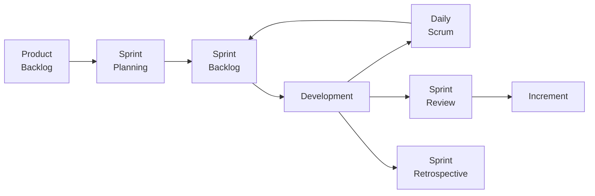

## 25.1 Scrum, Kanban, eXtreme Programming (XP)

Agile project management has evolved from simple iterative methods to more specialized, structured frameworks that help teams quickly respond to change and deliver high-value outcomes. Three of the most recognized and widely adopted Agile frameworks are Scrum, Kanban, and eXtreme Programming (XP). Each framework offers a unique set of values, roles, practices, and artifacts, yet they share the same core Agile philosophy of collaboration, continuous delivery, iterative feedback, and flexibility. This section provides an in-depth journey through these three frameworks, including their defining ceremonies, roles, artifacts, and best use cases. 

Scrum, Kanban, and XP can be implemented independently or combined into a hybrid approach tailored to a team’s needs. In PMP® exam contexts, a solid understanding of these Agile methods is invaluable, since contemporary project environments increasingly rely on adaptive and flexible processes, focusing on stakeholder engagement, iterative release cycles, and rapid learning.

---

### The Essence of Agile Frameworks

Before diving into each framework, remember that Agile frameworks share the following principles:
• Frequent inspection and adaptation of processes and products.  
• Maximized collaboration with customers and stakeholders.  
• Empowerment and self-organization of teams.  
• Emphasis on delivering value early and often.  

Whether you choose Scrum, Kanban, XP, or a hybrid, these common values provide the backbone for effective delivery within a complex, rapidly changing environment.

---

### Scrum

Scrum is among the most frequently used Agile frameworks, particularly in software development. It is characterized by fixed-length iterations (Sprints) where a cross-functional team focuses on delivering a potentially shippable product increment. Scrum emphasizes transparent communication, inspection, and adaptation throughout the development lifecycle.

#### Key Roles in Scrum

1. Product Owner  
   The Product Owner owns the product backlog, which includes prioritized items and requirements for the product. Responsibilities include maximizing product value, defining acceptance criteria, and constantly refining the backlog in collaboration with stakeholders.

2. Scrum Master  
   The Scrum Master is responsible for ensuring that the team adheres to Scrum practices and principles. Acting as a facilitator, coach, and servant leader, the Scrum Master helps remove impediments, fosters continuous improvement, and protects the team from outside distractions.

3. Development Team (Delivery Team)  
   A self-organizing, cross-functional group that works collaboratively to deliver a product increment. The Development Team estimates tasks, selects backlog items for the Sprint, and holds itself accountable for meeting the Sprint Goals.

#### Scrum Artifacts

1. Product Backlog  
   A transparent, ordered list of everything needed for the product. The Product Backlog is continually refined (groomed), ensuring that the highest-priority items are ready to be tackled in upcoming Sprints.  

2. Sprint Backlog  
   A set of focused tasks and requirements the Development Team commits to delivering during the current Sprint. It emerges from the top items in the Product Backlog and is collaboratively chosen during Sprint Planning.  

3. Increment  
   The sum of all Product Backlog items completed during a Sprint, integrated with the output of all previous Sprints. In mature Scrum implementations, an increment is fully tested and potentially shippable at the close of each Sprint.

#### Scrum Ceremonies

1. Sprint Planning  
   The team and Product Owner select items from the Product Backlog (based on priority and the team’s capacity) and define the Sprint Goal. The team then breaks these items down into tasks to populate the Sprint Backlog.

2. Daily Scrum (Daily Standup)  
   A short meeting—usually 15 minutes—where the Development Team synchronizes and plans its day. Each member typically addresses:
   • What they did yesterday.  
   • What they plan to do today.  
   • Any impediments or blockers.  

3. Sprint Review  
   Conducted at the end of the Sprint, this session showcases the working product increment to stakeholders, gathering feedback that informs the Product Backlog.  

4. Sprint Retrospective  
   Held immediately after the Sprint Review, the team inspects its processes and interactions, identifying ways to improve collaboration and delivery in the next Sprint.

#### Scrum Workflow Overview

Below is a simple Mermaid diagram illustrating the flow of events in a typical Scrum cycle:

1. Items from the Product Backlog feed into the Sprint Planning session.  
2. The team commits to items in the Sprint Backlog, delivering in short cycles (Sprints).  
3. Daily Scrums keep the team aligned.  
4. A working Increment is reviewed at the end.  
5. Lessons learned help the Dev Team improve through Retrospectives.  

#### Best Use Cases for Scrum

• Complex projects with evolving requirements that require iterative feedback.  
• Cross-functional teams needing tight collaboration.  
• Contexts where short, timeboxed increments spur rapid inspection and adaptation.  
• Environments where stakeholder involvement and continuous feedback are crucial.  

---

### Kanban

Kanban is simpler to adopt than frameworks like Scrum or XP. It does not prescribe specific roles, nor does it strictly timebox the development process. Instead, Kanban focuses on work visualization and limiting Work in Progress (WIP) to optimize flow. Its core principle is to manage and improve processes incrementally.

#### Principles and Practices of Kanban

• Visualize Your Workflow  
  Use a Kanban board (physical or digital) to visualize tasks from “To Do” to “In Progress” to “Done.” 

• Limit Work in Progress (WIP)  
  Set explicit limits to the number of items that can be worked on simultaneously. When a column reaches its WIP limit, no new tasks can start there until an item moves downstream.

• Manage Flow  
  Continuously observe and measure flow metrics (like lead time and cycle time) to identify bottlenecks and inefficiencies.

• Make Process Policies Explicit  
  Clearly define and communicate how items move through each stage.

• Implement Feedback Loops  
  Use daily standups, retrospectives, or service delivery reviews to assess progress, manage risks, and plan improvements.

• Improve Collaboratively, Evolve Experimentally  
  Foster a mindset of incremental change, using small experiments and feedback to guide improvement.

#### Kanban Artifacts and Metrics

While Kanban does not offer the same formal artifacts as Scrum, teams often adopt:

1. Kanban Board  
   The most visible element of Kanban, typically consisting of columns such as Requested, In Progress, and Done. Some teams include additional columns (e.g., Test, Review, Blocked).

2. Cumulative Flow Diagram (CFD)  
   A graphical representation showing how tasks progress over time, helping detect blockers, forecast flow, and estimate capacity.

3. Lead Time vs. Cycle Time  
   • Lead Time: The elapsed time from item request to item completion.  
   • Cycle Time: The elapsed time once work actually begins until completion.  

By regularly tracking these metrics, teams can foresee bottlenecks, measure process improvements, and optimize throughput.

#### Best Use Cases for Kanban

• When a team’s biggest focus is process and throughput over discrete timeboxed Sprints.  
• Environments with a continuous flow of incoming requests (e.g., support or maintenance teams).  
• Teams that prefer minimal prescription and more flexible, flow-based delivery.  
• Projects requiring quick adaptability without re-planning entire iterations.

---

### eXtreme Programming (XP)

eXtreme Programming (XP) is traditionally associated with software development, but many of its principles apply to various industries. XP emphasizes technical excellence and frequent, high-quality releases, seeking to address common software development pain points—like code quality issues and knowledge silos—through disciplined engineering practices.

#### Core Values and Principles of XP

1. Communication  
   Encourage face-to-face, open, and honest dialogue among all team members and stakeholders.

2. Simplicity  
   Avoid gold-plating. Start with the simplest solution that works and refine or scale only if needed.

3. Feedback  
   Gain rapid feedback from multiple sources: unit tests, continuous integration, pair-programming reviews, and short iteration cycles.

4. Courage  
   Embrace failure and difficult conversations. Pursue continuous improvement even if it demands radical course corrections.

5. Respect  
   Cultivate a positive team environment where all members feel valued and heard.

#### Common XP Practices

• Pair Programming  
  Two developers work together at one workstation. One “drives” (writes the code), while the other observes, reviews, and offers feedback.

• Test-Driven Development (TDD)  
  Write failing tests first, then create code to fulfill the test requirements, ensuring robust coverage and immediate feedback.

• Continuous Integration (CI)  
  Integrate code into a shared repository frequently, verifying changes with automated builds and tests.

• Refactoring  
  Continuously improve the code structure without changing its external behavior, reducing technical debt.

• Simple Design  
  Keep designs as straightforward as possible—only implement what's needed to meet known requirements.

• Sustainable Pace  
  Teams work at a pace that can be maintained indefinitely, avoiding burnout and ensuring consistent quality.

#### XP Roles and Activities

While XP does not define many specialized roles beyond “Coach,” “Customer,” and “Programmer,” it does recommend frequent “Iterations” (often one to two weeks) where user stories are broken down, estimated, programmed, tested, and integrated.

Key rituals include:
• Iteration Planning  
• Standup Meetings  
• Iteration Demo / Review  
• Retrospectives  

XP can integrate seamlessly with Scrum or Kanban if a team wants to adopt rigorous engineering practices without drastically altering their project tracking or flow approach.

#### Best Use Cases for XP

• Software development teams facing rapidly changing requirements, demanding high code quality.  
• Projects requiring significant technical depth, advanced engineering practices, and continuous releases.  
• Highly collaborative teams that can rapidly integrate feedback, code changes, and test results.  

---

### Combining or Tailoring These Frameworks

As organizations evolve beyond singular frameworks, many adopt hybrid approaches that combine elements of Scrum, Kanban, and XP. For example, a team might use Scrum ceremonies and roles (Product Owner, Scrum Master, Sprints) but manage their in-flight work on a Kanban board with strict WIP limits. Simultaneously, they might apply XP engineering practices such as TDD or pair programming. This synergy allows teams to leverage the unique advantages of each approach:

• Scrum focuses on timeboxed events, structured roles, and a clear product-backlog-driven approach.  
• Kanban focuses on continuous flow, limiting work in progress, and incremental process improvements.  
• XP focuses on engineering excellence and continuous, disciplined improvement of code quality.  

Regardless of which framework or combination your project adopts, ensure alignment with overarching project objectives, team competencies, and organizational culture.  

---

### Common Pitfalls and Mitigation Strategies

• Pitfall: Over-Prescription  
  Some teams may follow the mechanics of Scrum or XP without truly embracing the underlying Agile values, resulting in “checkbox” ceremonies devoid of real collaboration or continuous improvement.  
  • Mitigation: Focus on principles and outcomes, not simply adopting rituals. Facilitate meaningful retrospectives.  

• Pitfall: Ignoring Empirical Feedback  
  Ignoring backlog refinement, user feedback, or technical debt causes a once-Agile approach to degrade into hasty, unorganized execution.  
  • Mitigation: Maintain disciplined backlog winnowing, frequent demos, and robust technical practices (CI, TDD).  

• Pitfall: Excessive WIP  
  Even with a Kanban board, if WIP limits are set too high or not respected, work piles up, slowing the entire flow.  
  • Mitigation: Enforce WIP limits rigorously. Use daily standups to reprioritize or reassign tasks.  

• Pitfall: Unsustainable Pace  
  In XP, not respecting sustainable pace can undermine trust and quality, leading to frequent burnout.  
  • Mitigation: Track team velocity and watch for signs of overload. Foster open communication about capacity.  

• Pitfall: Combining Frameworks Without Thoughtful Integration  
  Randomly merging ceremonies or roles from different frameworks can create role confusion and hamper workflows.  
  • Mitigation: Align roles and responsibilities, clarify how artifacts and boards fit together, and keep ceremonies meaningful, not duplicative.

---

### Practical Example: Adopting Scrum with XP Practices

Imagine a FinTech startup developing a mobile application to provide microloans in emerging markets. The team wants customer feedback quickly but also prizes code reliability and compliance with financial regulations.

1. Framework Selection:  
   • They choose Scrum for its clear roles (Product Owner, Scrum Master, Development Team) and defined Sprints.  
   • They adopt XP practices like TDD, pair programming, and continuous integration to ensure robust, secure code.  

2. Process Outline:  
   • The Product Owner refines the Product Backlog using user stories collected from real customers.  
   • During Sprint Planning, the Development Team breaks stories into tasks, which they then estimate.  
   • The team uses TDD to write tests for each user story, verifying financial calculations and ensuring regulatory compliance.  
   • They conduct Daily Scrums to identify blockers, frequently integrating and testing code to maintain a stable environment.  
   • Pair programming fosters code quality and knowledge sharing (particularly important for ensuring compliance).  
   • A final Sprint Review with stakeholders includes a demo of loan application flows, providing feedback that modifies next Sprint’s backlog.  
   • The team’s Sprint Retrospective addresses any repeated technical issues or communication gaps, seeking continuous improvement.  

3. Outcome:  
   • Frequent, high-quality increments are delivered.  
   • External auditors easily verify compliance because code is systematically tested and documented.  
   • Rapid user feedback leads to incremental enhancements, ensuring the product better meets market demands.  

---

### References for Further Exploration

• The Scrum Guide (Ken Schwaber and Jeff Sutherland): https://scrumguides.org  
• The Kanban Guide (Kanban University resources): https://resources.kanban.university  
• Extreme Programming Explained by Kent Beck: A foundational text on XP principles.  
• Agile Practice Guide (PMI): Provides an overview of Agile methodologies and guidance on tailoring approaches.  
• PMIstandards+: A resource with expanded sets of tools, case studies, and best practices for Agile and hybrid projects.

---

## Master Your Agile Knowledge: Scrum, Kanban, XP



### Which Scrum role is primarily responsible for maintaining and prioritizing the Product Backlog?

- [ ] Scrum Master
- [x] Product Owner
- [ ] Development Team
- [ ] Stakeholder

> **Explanation:** The Product Owner holds responsibility for the Product Backlog. They ensure it is prioritized, refined, and aligned with stakeholder expectations.

### In Kanban, what is the main purpose of setting WIP (Work in Progress) limits?

- [ ] To speed up the daily standup
- [ ] To ensure quality is maintained
- [x] To avoid having too many tasks in progress, thus optimizing flow
- [ ] To eliminate the need for retrospectives

> **Explanation:** WIP limits help teams avoid overloading their workflow, ensuring quicker feedback loops and reducing context switching.

### Which XP practice involves writing tests before writing the actual code?

- [ ] Refactoring
- [x] Test-Driven Development (TDD)
- [ ] Continuous Integration
- [ ] Pair Programming

> **Explanation:** In TDD, developers write a failing test first, then produce code to pass the test, ensuring robust and well-structured code.

### A frequent pitfall in Scrum is performing the ceremonies but ignoring the underlying Agile values. Which action helps mitigate this problem?

- [x] Emphasizing continuous improvement in retrospectives
- [ ] Increasing the length of Sprints
- [ ] Restricting communication to only official Scrum events
- [ ] Eliminating the Product Backlog

> **Explanation:** Focusing on retrospectives allows the team to continually inspect and adapt everything from process to collaboration style, thereby keeping Agile values at the forefront.

### Which of the following best describes the main focus of Kanban?

- [x] Visualizing workflow and optimizing continuous flow
- [x] Limiting work in progress to reduce congestion
- [ ] Strict timeboxed iterations
- [ ] Specialized roles like Product Owner and Scrum Master

> **Explanation:** Kanban is centered on flow, limiting WIP, and visualizing tasks on a board. It does not mandate timeboxes or roles akin to Scrum.

### Which Scrum ceremony is focused on reviewing the increment and gathering feedback from stakeholders?

- [x] Sprint Review
- [ ] Daily Scrum
- [ ] Sprint Retrospective
- [ ] Backlog Refinement

> **Explanation:** The Sprint Review is where the team demonstrates the product increment and collects feedback to refine the direction of the product.

### Which XP value emphasizes avoiding over-complication and building only what is necessary?

- [x] Simplicity
- [ ] Respect
- [x] Feedback
- [ ] Courage

> **Explanation:** XP’s Simplicity principle states teams should create the simplest design and code that effectively meets the current need, minimizing unnecessary features.

### A major risk in XP is burnout due to not respecting the principle of Sustainable Pace. What is one effective mitigation strategy?

- [x] Tracking team velocity and fostering open discussion on workload
- [ ] Eliminating pair programming
- [ ] Extending iteration length to reduce reviews
- [ ] Mandating over-time if tasks are unfinished

> **Explanation:** Observing velocity and encouraging open communication about capacity helps prevent burnout and keeps the team’s morale and quality of work high.

### A key engineering practice in XP designed to ensure code integrity and reduce defects is:

- [x] Continuous Integration (CI)
- [ ] Definition of Done
- [ ] Scheduled monthly code reviews
- [ ] Strict role specialization

> **Explanation:** Continuous Integration merges code changes frequently and runs automated tests, ensuring that new additions do not break the existing system.

### Once you’ve chosen an Agile framework, you must continue using it exactly as it’s written.

- [x] True
- [ ] False

> **Explanation:** While some teams treat this as a best practice, Agile frameworks often encourage evolution and adaptation. Many organizations tailor or blend Scrum, Kanban, and XP elements to suit unique requirements.



---

## PMP Mastery: 1500+ Hard Mock Exams with Full Explanations 

Looking to crush the PMP exam with confidence? Dive deep into 6 rigorous mock exams totaling 1500+ advanced-level questions, each accompanied by clear, step-by-step explanations. Hone your test-taking strategies, master complex topics, and build the resilience you need on exam day. Perfect for serious PMs aiming beyond fundamentals.  

Enroll now:  
[PMP Mastery: 1500+ Hard Mock Exams with Exceptional Clarity & Full Explanations](https://www.udemy.com/course/pmp-2025/?referralCode=CF83A54BC86BE27F9AFE)

_Disclaimer: This course is not endorsed by or affiliated with the PMI examination authority. All content is provided purely for educational and preparatory purposes._
