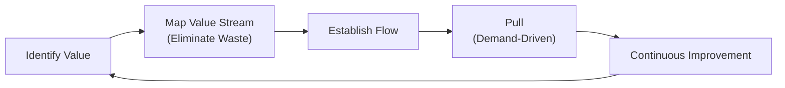

## 25.2 Lean-Agile Thinking and Principles

Lean-Agile thinking represents the fusion of two powerful approaches: the Lean methodology, rooted in waste minimization and continuous flow, and Agile practices, focused on flexibility, customer collaboration, and quick delivery of value. Though born from different industries—Lean in manufacturing and Agile in software development—the two approaches share common cultural and philosophical foundations. By aligning their principles, organizations can eliminate redundancies, respond swiftly to changing environments, enhance stakeholder satisfaction, and foster a culture of continuous improvement.

This section expands on concepts introduced in Chapter 24 (Agile Foundations and the Agile Practice Guide) and explores how Lean thinking synergizes with Agile methodologies to deliver higher-quality outcomes. Key elements of the Lean-Agile mindset will be especially relevant to PMP® candidates as they navigate an evolving project management landscape where speed, adaptability, and value generation are the new norms.

  
### Overview of Lean Thinking

Lean originated in the automotive industry through the Toyota Production System (TPS), focusing on maximizing customer value by minimizing waste. Over time, professionals across sectors—from healthcare to software development—adopted Lean principles to streamline processes and optimize efficiency. 

Although various models have been proposed to articulate Lean, they typically revolve around the following fundamental ideas:

• Identify value from the customer’s perspective.  
• Map the value stream and remove or reduce non-value-adding steps.  
• Establish and maintain continuous flow.  
• Implement pull-based systems to respond to real demand.  
• Strive for perfection and continuous improvement.

In the realm of project management, Lean thinking means continuously scanning for and removing unnecessary steps, processes, and artifacts. Teams that operate in a Lean environment aim to deliver each product increment with minimal wasted time, effort, or resources.

### Core Lean Principles

Although expressed in different frameworks, Lean principles consistently spotlight the importance of reducing non-value-added activities, empowering the workforce, and iterating toward increasingly efficient processes. A commonly cited set of Lean principles includes:

Eliminate Waste  
Waste represents any process or activity that does not add value to the end product or service. In Lean, seven classical types of waste are often cited—defects, overproduction, waiting, non-utilized talent, transportation, inventory, and motion (some frameworks extend this list to eight or nine). Identifying these sources of waste requires continuous scrutiny of project workflows, whether in software development, manufacturing, or service-oriented tasks.

Amplify Learning and Continuously Improve  
Lean culture promotes experimentation, learning from feedback, and continuous adaptation. Learning loops (similar to the Agile "inspect and adapt" cycle) allow teams to refine their processes repeatedly. This principle is tightly interwoven with retrospectives and daily standups in Agile, where incremental learning helps teams adapt quickly.

Deliver as Fast as Possible  
Emphasizing speed does not mean rushing output at the expense of quality. Instead, Lean encourages short cycle times, completed deliverables, and quick testing to ensure near-immediate feedback. This concept resonates strongly with Agile’s iterative sprints and continuous deployment pipelines.

Empower the Team  
Lean recognizes that those closest to the work are often in the best position to identify areas for improvement. By empowering teams with decision-making authority, organizations tap into frontline expertise, encourage ownership, and accelerate innovation.

Build Quality In  
Quality is not simply an inspection step at the end of a production line. Lean calls for “building quality in,” meaning that teams adopt standardized procedures and checks to prevent defects from being introduced in the first place. In project management, this can involve regular code reviews, robust design documents, stakeholder sign-offs, or any approach ensuring that deliverables meet defined standards without last-minute rework.

Optimize the Whole  
Instead of optimizing individual tasks or departments in isolation, Lean suggests looking at the big picture—your entire value stream. This systemic view prevents localized improvements from shifting bottlenecks elsewhere or creating more work for other organizational units. Project managers can see parallels here with stakeholder performance domains (see Chapter 7), ensuring communication and collaboration across the enterprise.

The following Mermaid diagram illustrates a simplified view of Lean flow with continuous feedback at each stage:

In this cycle, value identification is at the center, with each stage feeding into the next. The loop ensures organizations remain focused on minimizing distractions and constantly refining the process based on results and feedback.

### Linking Lean to Agile Frameworks

Agile, as introduced in Chapter 24, prioritizes collaboration, responsiveness, and frequent delivery. Core Agile frameworks such as Scrum, Kanban, and eXtreme Programming (XP) naturally incorporate Lean ideas. Scrum uses time-boxed sprints and retrospectives that encourage frequent reflection and adaptation. Kanban visibly manages work-in-progress to limit overload and promote steady flow. XP emphasizes pair programming and test-driven development, aligning closely with Lean’s “build quality in” principle. 

Many organizations evolve into a Lean-Agile hybrid by leveraging the strengths of each approach:

• Scrum with Lean: Time-boxed sprints encourage fast, iterative value delivery, while Lean encourages a culture of waste reduction.  
• Kanban with Lean: Kanban boards visualize workflows, allowing teams to identify bottlenecks. Lean, with its emphasis on flow, extends Kanban’s built-in capacity for incremental improvements.  
• XP with Lean: XP’s disciplined engineering practices (like test-driven development) dovetail neatly with Lean’s call for high-quality standards throughout the development life cycle.

This holistic perspective—focusing on both step-wise improvements and system-wide optimization—can dramatically enhance productivity, stakeholder satisfaction, and risk mitigation. 

### Lean-Agile Mindset in Practice

Although Lean and Agile feature distinct origins and toolkits, they converge around a shared mindset. From a project management perspective, applying Lean-Agile thinking means:

• Continuously clarifying and prioritizing “value” for stakeholders (see Chapter 5.4 on Value Focus and Outcomes).  
• Establishing small, cross-functional, and empowered teams that can quickly pivot based on customer feedback.  
• Visualizing workflows to detect inefficiencies and highlight improvement opportunities.  
• Daily synchronization to uncover heavy work-in-progress load, constraints, or changes in requirements.  
• Iterating on solutions, refining them through short cycles and direct customer feedback.  
• Balancing the need for reliable planning (Chapter 10) with the flexibility to adapt (Chapter 9).

Beyond the “soft” components, Lean-Agile thinking often relies on metrics for objective measurements. For example:


\text{Cycle Time} = \frac{\text{Work in Progress (WIP)}}{\text{Throughput}}


Cycle time measures how long a piece of work takes from start to finish, while throughput indicates how many work items a team completes over a given period. Monitoring these metrics and iterating for improvement is central to ensuring a smooth flow that aligns with prioritized, value-oriented tasks.

### Practical Examples and Case Studies

1. Software Development with Kanban and Lean  
   A software team at an e-commerce company adopts Kanban to visualize tasks on a board. They measure their cycle time for user stories—from specification all the way to deployment. By regularly reviewing their workflow (daily standups and weekly retrospectives), they identify bottlenecks: code reviews often stall because they depend on a single senior developer. Empowered by Lean principles to remove waste, the team cross-trains other members. This allows them to release features more consistently and handle defect fixes quicker.  

2. Manufacturing with Hybrid Scrum and Lean  
   A manufacturing firm producing medical devices uses Scrum for product testing iterations while applying Lean principles on the factory floor to reduce production waste. The cross-functional team runs sprints to prototype device improvements, gather feedback from healthcare professionals, and update designs rapidly. Meanwhile, Lean techniques reduce rework and packaging waste, cutting overall production costs and increasing the number of devices delivered each month.

3. Operations and Service Delivery in a Shared Services Environment  
   An operations department handling account services at a financial institution uses Lean tools to map process steps and identify excessive wait times for approvals. They adopt daily standups and sprint cycles from Agile to tackle improvements on a rolling basis. By removing redundant authorization steps and introducing parallel reviews where possible, the department significantly shortens service turnaround times, boosting customer satisfaction and reducing costly rework.

### Common Pitfalls and Strategies for Success

Lean-Agile transformations can stumble if organizations treat them as just “trendy tools” rather than cultural shifts. Common pitfalls include:

• Superficial Adoption of Tools: Merely introducing Kanban boards or scheduling daily standups without genuine commitment to eliminating waste and fostering team empowerment can yield minimal gains.  
• Resistance to Change: Lean-Agile demands transparency, continuous feedback, and iteration. Organizations with rigid hierarchies may resist the cultural shift required to see substantial results.  
• Insufficient Team Empowerment: If management retains all decision-making power, the benefits of Lean-Agile are diluted. Without empowering teams, continuous improvement initiatives stall.  
• Overemphasis on Speed Over Quality: Efficiency matters but not at the expense of fundamental quality. Failing to “build quality in” often leads to substantial rework, eroding any gains in speed.

To overcome these challenges:

• Champion Leadership Support: A supportive leadership culture signal-boasts the organization’s dedication to Lean-Agile principles.  
• Provide Training and Coaching: Continual education ensures that teams have the requisite skills to identify waste and refine processes.  
• Emphasize Continuous Improvement: Allocate time to retrospectives and experiments. Encourage small-scale pilots that can quickly demonstrate tangible benefits.  
• Foster Transparency: Open communication channels across departments and with all stakeholder groups (see Chapter 16 on Communications Management).  

By integrating Lean-Agile best practices into daily operations, organizations pave the way for sustainable improvement and a value-driven mindset. 

### Real-World Impact for Project Managers

Project managers who master Lean-Agile techniques expand their strategic repertoire for delivering solutions under rapidly changing conditions. The PMP® examination places increasing emphasis on adaptive delivery approaches, stakeholder engagement, and continuous value creation—all cornerstones of the Lean-Agile philosophy. 

Whether you manage IT solutions, consult on large-scale construction initiatives, or handle regulatory compliance projects, understanding how Lean and Agile interlock to streamline delivery is a game-changer. Combining rigorous planning (Chapter 10) with flexible, iterative cycles can reduce costly rework, accelerate value to customers, and foster a culture of learning that keeps your organization on the leading edge.

### Best Practices for Integrating Lean-Agile

• Map your value streams and set iterative (sprint) or continuous improvement goals.  
• Maintain an “empowered workforce” culture in which teams control how they plan, execute, and refine.  
• Showcase metrics (e.g., cycle time, lead time, throughput) to drive data-based discussions and decisions.  
• Regularly hold retrospectives to reflect on progress and adjust approaches based on empirical insights.  
• Celebrate small wins to reinforce the culture of proactive change.

Lean-Agile synergy delivers a powerful framework for creating sustainable, value-oriented, and responsive project environments. By championing the elimination of waste, advocating for short feedback loops, and empowering teams, organizations can ensure that each product increment is a step closer to a robust, high-quality solution. This mindset not only propels project performance but also prepares practitioners for a PMP® exam era that recognizes the importance of agility and adaptability in modern project landscapes.

### References and Further Exploration

Lean-Agile thinking continually evolves as organizations experiment with what works best for them. If you want to dive deeper into these topics and see how they apply to specific disciplines or advanced frameworks, consider the following resources:

• "Lean Software Development: An Agile Toolkit" by Mary and Tom Poppendieck  
• "The Toyota Way: 14 Management Principles" by Jeffrey K. Liker  
• "Agile Practice Guide" (Project Management Institute)  
• "Kanban: Successful Evolutionary Change for Your Technology Business" by David J. Anderson  
• Chapter 27 of this guide on Hybrid Approaches for more on merging predictive and adaptive practices.  
• Chapter 9 on choosing the right life cycle approach for your project (Predictive, Iterative, Agile, or Hybrid).  

## Test Your Lean-Agile Expertise



### Which key principle of Lean emphasizes preventing problems rather than just detecting them at the end?
- [ ] Eliminate Waste
- [x] Build Quality In
- [ ] Empower the Team
- [ ] Pull-Based Scheduling

> **Explanation:** “Build Quality In” focuses on embedding quality checks and standards into every step of the development or production process, preventing defects from being introduced in the first place.

### In Lean-Agile, what is the primary goal of mapping a value stream?
- [ ] To identify quick wins that have no impact on real value
- [x] To visualize and remove non-value-adding steps in the workflow
- [ ] To establish compliance protocols in regulated industries
- [ ] To enable top-down management control

> **Explanation:** A value stream analysis helps teams spot bottlenecks, redundancies, and activities that do not contribute directly to the customer’s desired outcome.

### What is a common metric used to measure the average time it takes for a work item to go from start to finish?
- [ ] Velocity
- [x] Cycle Time
- [ ] Backlog Health
- [ ] Utilization Rate

> **Explanation:** Cycle time is a fundamental Lean metric that quantifies how many days or hours elapse between the commencement and completion of a work item.

### Which of the following Agile frameworks is best known for its focus on limiting work-in-progress to measure and improve flow?
- [ ] Scrum
- [x] Kanban
- [ ] Extreme Programming (XP)
- [ ] Crystal

> **Explanation:** Kanban emphasizes flexibility and flow constraints through limiting WIP to prevent team overload and idle tasks.

### Which principle highlights that decisions should remain flexible until they must be fixed, a concept often associated with both Lean and Agile?
- [x] Delay Commitment
- [ ] Always Plan in Detail
- [ ] Maximize Utilization
- [ ] Inspect and Adapt

> **Explanation:** “Delay Commitment,” sometimes stated as “Decide as late as possible,” allows more time for gathering relevant data, thereby improving decision quality.

### A Lean-Agile mindset views defects or rework as:
- [ ] Acceptable if it speeds up delivery
- [ ] Slow but inevitable in any product cycle
- [x] A form of waste that should be minimized
- [ ] A sign of strong team collaboration

> **Explanation:** Rework and defects are classic forms of waste. Lean-Agile approaches seek to reduce them through continuous improvement and quality built into each step.

### Which of the following best describes a pull-based system in Lean-Agile?
- [x] Work starts only when there is actual demand, preventing overproduction
- [ ] Stakeholders push requirements to the team, creating a backlog
- [x] Teams select work dynamically when available capacity allows
- [ ] Work is assigned by the project sponsor in large batches

> **Explanation:** Pull-based systems control the inflow of tasks based on actual demand and team capacity, which helps limit WIP and reduce overproduction.

### A “Kaizen” event in a Lean context is primarily about:
- [x] Structured, focused improvement initiatives
- [ ] Fully automated testing
- [ ] Requirements gathering sessions
- [ ] Finalizing contracts with vendors

> **Explanation:** Kaizen events or “continuous improvement” activities gather a small, cross-functional group to concentrate on one problem area and produce solutions quickly.

### Which cultural element is essential for continuous improvement in Lean-Agile?
- [x] A mindset that values experimentation and learning
- [ ] Rigid, top-down management mandates
- [ ] A “no failures allowed” policy
- [ ] Extended leadership approval cycles

> **Explanation:** Lean-Agile thrives in a culture open to experimentation, feedback, and learning from short, iterative cycles—essential for adapting quickly to change.

### Lean-Agile principles suggest that local optimizations can:
- [x] Shift bottlenecks elsewhere, degrading overall system performance
- [ ] Improve individual performance without any negative effect
- [ ] Have no impact on the organization
- [ ] Always align with organizational goals

> **Explanation:** While local optimizations may appear beneficial, they can inadvertently move constraints to other parts of the workflow, thus requiring holistic—and not just local—improvement efforts.



## PMP Mastery: 1500+ Hard Mock Exams with Full Explanations 

Looking to crush the PMP exam with confidence? Dive deep into 6 rigorous mock exams totaling 1500+ advanced-level questions, each accompanied by clear, step-by-step explanations. Hone your test-taking strategies, master complex topics, and build the resilience you need on exam day. Perfect for serious PMs aiming beyond fundamentals.

Enroll now:  
[PMP Mastery: 1500+ Hard Mock Exams with Exceptional Clarity & Full Explanations](https://www.udemy.com/course/pmp-2025/?referralCode=CF83A54BC86BE27F9AFE)

_Disclaimer: This course is not endorsed by or affiliated with the PMI examination authority. All content is provided purely for educational and preparatory purposes._
