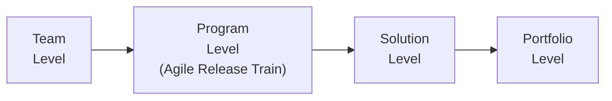
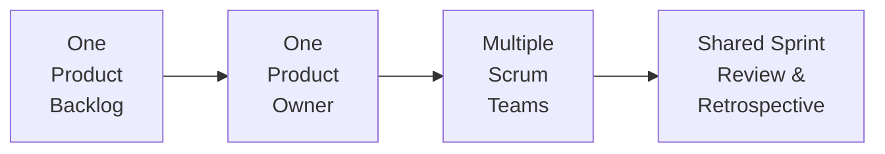
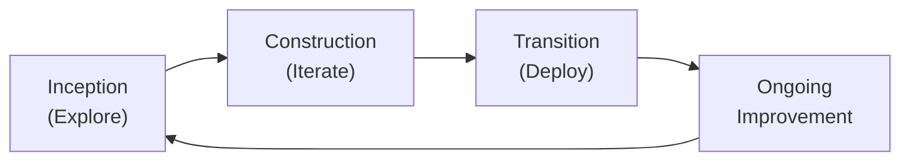

## 25.3 Scaling Agile (SAFe®, LeSS, Disciplined Agile®)

Scaling Agile is a strategic approach that extends the values and principles of Agile beyond individual teams to the enterprise or multi-team level. As Agile adoption matures in organizations, they often face challenges in coordinating multiple teams, ensuring alignment across departments, and maintaining consistent value delivery. Well-known scaling frameworks such as the Scaled Agile Framework® (SAFe®), Large-Scale Scrum (LeSS), and Disciplined Agile® (DA) have emerged to address these challenges. Each offers practices, structures, roles, and guidelines to help organizations achieve better coordination, transparency, and responsiveness at scale. In this section, we will explore how these major scaled Agile frameworks work in practice, discuss their benefits and complexities, and provide practical insights for successful implementation.

---

### Why Scale Agile?

Organizations choose to scale Agile for a variety of reasons:

• Consistency in Delivery: Multiple teams working on complex products need to integrate their outputs seamlessly. Scaling frameworks provide standardized processes and ceremonies to ensure that teams stay aligned.  
• Strategic Alignment: Scaling helps align team-level work with organizational strategy, ensuring resources are allocated to the highest-priority initiatives and that business objectives remain front and center.  
• Complexity Management: Large enterprises often oversee wide and interdependent project portfolios. Scaled Agile practices introduce techniques for managing dependencies, mitigating risk, and handling cross-functional collaboration.  
• Quality and Speed: By maintaining short feedback loops and iterative development cycles across multiple teams, organizations can improve product quality and delivery speed even in large, complex environments.

Many scaling approaches rely on core Agile concepts—like iterative delivery, servant leadership, continuous improvement, and adaptive planning—yet they tailor or extend these concepts to manage the complexities of multiple teams, products, and strategic mandates.

---

### Key Considerations When Scaling Agile

Before delving into specific frameworks, it is crucial to note a few overarching considerations:

• Organizational Readiness: Adopting a scaling framework without establishing foundational Agile maturity at the team level often leads to confusion and misalignment. A certain level of Agile fluency must be in place.  
• Culture and Mindset: Scaling Agile requires a shift from top-down command-and-control structures to more collaborative, empowered teams. Leadership support and an Agile-friendly culture significantly boost success rates.  
• Clear Vision and Roadmap: Whether using SAFe®, LeSS, or DA, scaling needs a guiding vision that ties all initiatives to strategic objectives. Ambiguous priorities or unclear roadmaps can lead to competing goals.  
• Continuous Improvement: Each scaling framework promotes retrospectives, learning cycles, and adaptation. These practices remain vital at scale, helping large programs and portfolios adjust quickly to emerging risks and stakeholder needs.

---

### The Scaled Agile Framework (SAFe®)

The Scaled Agile Framework, commonly called SAFe®, is one of the most widely adopted frameworks for large-scale Agile transformations. Created by Dean Leffingwell and further popularized through Scaled Agile, Inc., SAFe® integrates Lean thinking, systems thinking, and Agile principles to align teams, programs, and portfolios.

#### Core Values of SAFe®

SAFe® is built on four core values:

• Alignment: Ensures that the entire organization—from executives to individual teams—shares a common direction and consistent priorities.  
• Built-in Quality: Recognizes that quality is everyone’s responsibility and should be embedded throughout the development process.  
• Transparency: Encourages open communication and visibility across all levels to maintain trust and reduce risk.  
• Program Execution: Emphasizes predictable and continuous delivery of value at the program (or Agile Release Train) level.

#### Layers or Configurations

SAFe® offers multiple “configurations” to suit different organizational sizes and complexity levels. The most common configurations are:

• Essential SAFe®: Focuses on the team and program levels (collectively known as an Agile Release Train or ART).  
• Large Solution SAFe®: Adds a solution layer for very large, complex programs involving multiple Agile Release Trains.  
• Portfolio SAFe®: Adds portfolio-level processes, emphasizing strategic planning, Lean budgeting, and portfolio-level Kanban.  
• Full SAFe®: An encompassing configuration that includes team, program, solution, and portfolio layers.

Below is a simple conceptual diagram illustrating how different levels of SAFe® interrelate:

**Diagram Explanation:**  
• The Team Level forms Scrum or Kanban teams that deliver incremental value.  
• The Program Level coordinates multiple teams within an Agile Release Train, aligning them around a common roadmap.  
• The Solution Level is used in larger organizations to manage multiple Agile Release Trains developing a single large solution.  
• The Portfolio Level aligns the organization’s strategy and investment funding with its program roadmaps and solutions.

#### Roles in SAFe®

Some key roles include:

• Release Train Engineer (RTE): Acts as a servant leader at the program level, facilitating communication across teams and removing impediments.  
• Product Management: At the program level, guides vision, roadmap, and prioritization for the Agile Release Train.  
• System Architect/Engineer: Ensures technical alignment and architectural direction across teams.  
• Scrum Master/Team Coach: Serves at the individual team level, guiding the Scrum process and promoting continuous improvement.

#### Implementation Roadmap

SAFe® provides a prescriptive implementation roadmap with steps such as:

1. Reaching the tipping point (establishing a sense of urgency)  
2. Training Lean-Agile change agents and executives  
3. Identifying value streams and creating Agile Release Trains  
4. Preparing and launching the first ART  
5. Extending to the portfolio and accelerating across the enterprise  

#### Real-World Example

Consider a global financial services organization with 20 scrum teams. By implementing SAFe®, the company formed two Agile Release Trains aligned to different product lines. With common sprint lengths (synchronization), a consistent Program Increment (PI) cadence, and shared ceremonies, teams significantly reduced integration issues and gained a unified direction for their digital transformation efforts.

---

### Large-Scale Scrum (LeSS)

Developed by Craig Larman and Bas Vodde, Large-Scale Scrum (LeSS) applies Scrum principles to multiple teams working on a single product. LeSS seeks to retain the simplicity of Scrum while scaling it up. Unlike SAFe®, which offers a more prescriptive approach, LeSS emphasizes minimal additional structure and roles.

#### LeSS Principles

• Empirical Process Control: Continuous learning and adaptation through frequent inspection and transparency.  
• Systems Thinking: Encourages organizations to examine root causes rather than focus on surface-level events.  
• Whole Product Focus: All teams share the same Product Backlog and deliver a single, integrated product increment.  
• Customer-Centric Delivery: All teams remain focused on delivering working solutions for end users in each Sprint.

LeSS has two main frameworks:

• Basic LeSS: For up to eight teams (50 or so people), focusing on maintaining a single Product Backlog, a single Product Owner, and multiple development teams.  
• LeSS Huge: For more substantial product groups, with multiple Product Owners organized within an Area structure. Each Area Product Owner manages a part of the Product Backlog while the overall Product Owner retains final responsibility for product vision.

#### LeSS Framework at a Glance

**Diagram Explanation:**  
• A single Product Backlog provides a unified list of priorities.  
• One Product Owner oversees the backlog and product vision.  
• Multiple cross-functional teams pick items from this common backlog in each Sprint.  
• Teams coordinate daily, share Sprint Reviews to showcase a combined product increment, and participate in joint Retrospectives for continuous improvement.

#### Roles in LeSS

LeSS is minimalist and preserves the traditional Scrum roles:

• Product Owner: Maintains a single Product Backlog and aligns the product vision with stakeholders.  
• Scrum Master: Acts as a coach or facilitator for one or more teams and focuses on removing impediments while fostering collaboration.  
• Development Team: Autonomous, cross-functional teams responsible for delivering increments of the product.

Additional roles are introduced in LeSS Huge, such as Area Product Owners, but they remain close to the basic Scrum philosophy—keeping overhead low and removing silos.

#### Real-World Example

A mid-sized tech company with five Scrum teams working on a unified SaaS product implemented LeSS. By consolidating the Product Backlog and having a single Product Owner, they removed duplication in user stories, reduced conflicting priorities, and improved coordination. Sprint Reviews became more meaningful because every team contributed to the same product increment, offering a holistic view of progress.

---

### Disciplined Agile® (DA)

Disciplined Agile® (DA) is a toolkit introduced by Scott Ambler and Mark Lines. PMI acquired Disciplined Agile in 2019, integrating it as a flexible, context-driven approach for scaling Agile. Instead of prescribing a rigid framework, DA offers customizable principles and processes based on an organization’s context, maturity, and existing strengths.

#### Key Disciplined Agile Concepts

• Hybrid Mindset: Encourages mixing and matching elements of Scrum, Kanban, Lean, DevOps, and other approaches.  
• Guided Continuous Improvement (GCI): Suggests guidance on how to evolve your way of working, answering the question “What should we do next?”  
• Roles, Process Goals, and Decision Points: Offers a systematic approach to tailoring processes, with a focus on context-specific decisions (e.g., how to approach governance, budgeting, and team collaboration).  
• Disciplined Agile Delivery (DAD): A process decision framework within DA that covers the full lifecycle—from project initiation to deployment, including supporting continuous improvement.

#### DA Lifecycle Overview

DA supports various lifecycle options, including Agile, Lean, and a hybrid approach. One common representation is the Disciplined Agile Delivery (DAD) lifecycle:

**Diagram Explanation:**  
• Inception (Explore): Teams clarify the scope, the success metrics, and the viability of the initiative.  
• Construction (Iterate): The majority of the solution’s development takes place in iterative cycles, focusing on creating a working solution that adds stakeholder value.  
• Transition (Deploy): The solution is validated, deployed into production, and prepared for release, ensuring readiness for end users and operational teams.  
• Ongoing Improvement: Retrospective feedback is used to refine the approach continuously, delivering more value and reducing waste.

#### Disciplined Agile Roles

DA defines various roles, some of which align with standard Agile roles, and some that provide additional clarity:

• Team Lead (equivalent to Scrum Master): Facilitates team processes.  
• Product Owner: Prioritizes work and represents stakeholder interests.  
• Architecture Owner: Focuses on the architecture and design concerns at the team level.  
• Stakeholder: Represents end users and business interests.  
• Enterprise Roles (e.g., Enterprise Architect, Portfolio Manager): Support governance and alignment at the enterprise level.

By choosing from these roles and recommended techniques, organizations can adapt DA to their specific context, whether they are heavily regulated, partly distributed, or entirely co-located.

---

### Suitability and Comparison

Each scaling framework addresses different needs and organizational cultures:

• SAFe®  
  - Highly prescriptive and provides extensive guidance.  
  - Well-suited for large enterprises seeking structured portfolio governance.  
  - May feel heavy for smaller organizations or those looking for minimal overhead.  

• LeSS  
  - Retains the simplicity of Scrum, minimal roles beyond Scrum.  
  - Emphasizes a single product focus and fosters continuous improvement.  
  - May require extensive organizational change for alignment if multiple products or streams co-exist.  

• Disciplined Agile® (DA)  
  - A flexible toolkit that offers guidance without prescribing a single path.  
  - Allows the combination of various approaches (Scrum, Kanban, Lean) based on context.  
  - Critics may find the choices overwhelming if teams or leaders lack Agile maturity.

---

### Best Practices for Scaling Agile

Regardless of which framework you choose or how you blend them:

• Invest in Training and Coaching: Scaling Agile frameworks can seem complex. Providing effective training to teams, executives, and middle managers is crucial.  
• Foster an Agile Culture: Emphasize trust, openness, and servant leadership. Cultural misalignment is a leading cause of failed Agile transformations.  
• Align on Cadence and Synchronization: Common iteration lengths, synchronized planning events, and shared retrospectives ease coordination across teams.  
• Address Technical Debt Early: Larger efforts often involve multiple codebases and technologies. Ensure robust DevOps practices and continuous integration to avoid technical bottlenecks.  
• Emphasize Continuous Improvement: Even with a chosen framework, every organization has unique needs. Use retrospectives and data-driven learning to adapt.  

---

### Common Pitfalls 

• Over-Engineering the Framework: Adding unnecessary layers or roles can stifle teams. Keep it as simple as possible.  
• Neglecting Culture and Leadership: Without leadership buy-in committed to Agile values, transformations often devolve into “checkbox implementations.”  
• Insufficient Prioritization: Failing to align roadmaps and backlogs across multiple teams can lead to conflicting goals.  
• Delayed Feedback Loops: If program increments or sprints are too long, teams lose the benefits of rapid feedback.  
• Inadequate Investment in Learning: Leaders who assume team-level success instantly translates to scaled success may find the transformation stalling.

---

### Real-World Case Study: Hybrid Approach

A large telecommunications firm with nearly 1,000 developers worldwide employed a hybrid approach. They began with SAFe® in their portfolio management layer to manage budgeting and high-level strategic alignment. Individual product lines, each comprised of three to four scrum teams, operated under LeSS to keep the overhead minimal and maintain a singular product focus. Simultaneously, the organization leveraged Disciplined Agile’s flexible governance guidelines, particularly around compliance with global telecom regulations. By combining elements of these frameworks, the firm found a sweet spot that balanced rigorous portfolio governance with localized autonomy.

---

### Practical Example: Storming, Norming, and Scaling

Imagine a scenario where an organization starts with small pilot Agile teams. After initially reaping benefits from early wins—faster releases, collaborative environments—leaders make the decision to roll out Agile across the enterprise. They opt for SAFe® because it provides comprehensive guidance:

• They launch an Agile Release Train focusing on their flagship product line.  
• They identify the Release Train Engineer (<i>RTE</i>) and train Product Managers and Scrum Masters in SAFe® ceremonies.  
• They set up consistent Program Increment planning events every 10 weeks.  

Within a year, the enterprise sees improvements in predictability, quality, and stakeholder engagement. However, they realize some product streams operate more effectively in a minimalistic environment akin to LeSS. This leads them to adopt a combination of SAFe® at the portfolio/program level and a LeSS-like structure at the product level—illustrating that real-world success may stem from blending frameworks rather than strictly following one methodology.

---

### Incorporating Agile from Chapter 24 and Chapter 9

• As mentioned in [Chapter 24: Agile Foundations and the Agile Practice Guide](#), a deep understanding of Agile principles (transparency, inspection, adaptation, collaboration) is crucial before scaling.  
• From [Chapter 9: Development Approach and Life Cycle Performance Domain](#), you can see how different life cycle models (predictive, incremental, or hybrid) factor into scaling decisions. Some frameworks lean heavily on iterative and incremental cadences, while others introduce Lean concepts to handle batch sizes and flow.

---

### Additional References

• Knaster, R., & Leffingwell, D. (2020). SAFe® 5.0 Distilled: Achieving Business Agility with the Scaled Agile Framework®.  
• Larman, C., & Vodde, B. (2016). Large-Scale Scrum: More with LeSS. Addison-Wesley.  
• Ambler, S., & Lines, M. (2020). Choose Your WoW!: A Disciplined Agile Delivery Handbook for Optimizing Your Way of Working (2nd Edition). Project Management Institute.  
• Project Management Institute. (2021). A Guide to the Project Management Body of Knowledge (PMBOK® Guide)—Seventh Edition. PMI.  
• PMI (2019). The Agile Practice Guide. Project Management Institute.

---

## Quiz: Scaling Agile Frameworks Across the Enterprise



### Which of the following is a core value of SAFe®?  
- [ ] Iteration overload  
- [x] Program execution  
- [ ] Top-down control  
- [ ] Module-based design  

> **Explanation:** SAFe® emphasizes four core values: Alignment, Built-in Quality, Transparency, and Program Execution. Program execution ensures teams focus on delivering consistent value at the program (ART) level.

### What is a hallmark characteristic of LeSS?  
- [x] Maintaining one Product Backlog for all teams  
- [ ] Adopting multiple Product Owners for each product  
- [ ] Following a rigid hierarchy across team layers  
- [ ] Combining multiple frameworks into one  

> **Explanation:** In Large-Scale Scrum (LeSS), all teams share one Product Backlog, unifying priorities and ensuring a single product focus.

### In LeSS, how many Product Owners typically exist for up to eight teams working on a single product?  
- [x] One  
- [ ] One per team  
- [ ] One per sprint  
- [ ] None (the role is optional)  

> **Explanation:** Basic LeSS involves one Product Owner managing a single Product Backlog, even if multiple teams work on the same product.

### Which of the following best describes Disciplined Agile® (DA)?  
- [ ] A strictly defined single framework  
- [x] A flexible toolkit offering context-based choices  
- [ ] A method that excludes Scrum roles  
- [ ] A method focusing solely on waterfall elements  

> **Explanation:** Disciplined Agile® is an adaptable toolkit that guides organizations to combine practices from various agile, lean, and hybrid methods based on context.

### What is the main advantage of adopting a scaled Agile approach?  
- [x] It allows multiple teams to align and synchronize efforts on complex products.  
- [ ] It ensures that projects remain solely within a single department.  
- [x] It replaces all organizational structures immediately.  
- [ ] It eliminates the need for leadership involvement.  

> **Explanation:** A principal benefit of scaling Agile is achieving alignment among multi-team or enterprise-level efforts. While leadership involvement is crucial, scaled Agile frameworks also help integrate and synchronize big, complex projects.

### Which role focuses on architectural and technical alignment across teams in SAFe®?  
- [ ] Scrum Master  
- [ ] Team Lead  
- [x] System Architect/Engineer  
- [ ] Development Team  

> **Explanation:** In SAFe®, the System Architect/Engineer ensures that technical direction and standards are maintained across all teams within an Agile Release Train.

### In DA, which concept addresses how to evolve your way of working through guided continuous improvement?  
- [ ] Single Scrum of Scrums  
- [ ] Mandatory processes  
- [x] Guided Continuous Improvement (GCI)  
- [ ] Program Increment Planning  

> **Explanation:** Disciplined Agile focuses on Guided Continuous Improvement (GCI), where teams and organizations are encouraged to adapt and refine their approach incrementally.

### Which scenario would most likely benefit from a more prescriptive, top-down scaling approach like SAFe®?  
- [x] A large enterprise with multiple, complex product lines needing consistent frameworks  
- [ ] A single agile team working on a small, isolated software project  
- [ ] An organization that prefers minimal roles and processes  
- [ ] A company that makes frequent changes to the product backlog unrelated to strategy  

> **Explanation:** SAFe® excels in larger organizations that require structured governance, portfolio management, and more detailed guidance for aligning multiple product lines.

### What practice is common to all three scaling frameworks (SAFe®, LeSS, and DA)?  
- [x] Frequent retrospectives to foster continuous improvement  
- [ ] Prescriptive roles that exclude cross-functional teams  
- [ ] Exclusive reliance on linear project phases  
- [ ] Prohibition against customizing the framework  

> **Explanation:** While each framework defines roles, ceremonies, and processes differently, all emphasize iterative inspection and adaptation through frequent retrospectives.

### Scaling Agile primarily aims to:  
- [x] Coordinate multiple teams or projects efficiently while preserving Agile values  
- [ ] Centralize all decision-making at the portfolio level  
- [ ] Implement a purely waterfall approach  
- [ ] Eliminate cross-functional collaboration  

> **Explanation:** The primary objective of scaling Agile is to expand collaboration, alignment, and iterative value delivery across multiple teams or the entire organization.



---

## PMP Mastery: 1500+ Hard Mock Exams with Full Explanations 

Looking to crush the PMP exam with confidence? Dive deep into 6 rigorous mock exams totaling 1500+ advanced-level questions, each accompanied by clear, step-by-step explanations. Hone your test-taking strategies, master complex topics, and build the resilience you need on exam day. Perfect for serious PMs aiming beyond fundamentals.  

Enroll now:  
[PMP Mastery: 1500+ Hard Mock Exams with Exceptional Clarity & Full Explanations](https://www.udemy.com/course/pmp-2025/?referralCode=CF83A54BC86BE27F9AFE)

_Disclaimer: This course is not endorsed by or affiliated with the PMI examination authority. All content is provided purely for educational and preparatory purposes._
