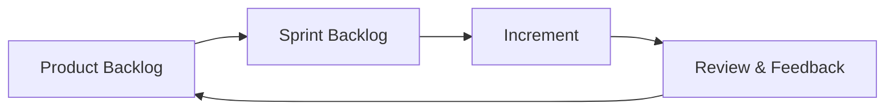

## 26.1 Product Backlog, Sprint Backlog, and Increment

Building on the concepts introduced in the Agile Foundations and Frameworks (see Chapters 24 and 25), this section provides a deep dive into three core artifacts in Scrum and other Agile approaches: the Product Backlog, the Sprint Backlog, and the Increment. These artifacts are essential for structuring and delivering value to customers iteratively. Whether you are extending your Agile expertise or preparing for the PMP® exam, understanding how to capture user requirements, break them down for sprints, and deliver workable increments is critical.

This chapter delves into the practical aspects of creating, maintaining, and executing a backlog. We will explore how the Product Backlog serves as the single source of user stories and requirements, how the Sprint Backlog translates those stories into actionable tasks within a sprint cycle, and how increments are ultimately validated and delivered.

---

### Relevance for PMP® Candidates and Practitioners

Agile and hybrid approaches are becoming increasingly vital in the business environment (see Chapter 6 on the PMP® exam domains). The Product Backlog, Sprint Backlog, and Increment concepts carry implications for how project managers (or anyone performing the role of a Scrum Master, Agile Coach, or Product Owner) facilitate:

• Rapid value delivery to stakeholders  
• Responsive changes to scope based on evolving priorities  
• Continuous learning, adaptation, and improvement  

For PMP® exam takers, these concepts support key tasks in the People, Process, and Business Environment domains. Knowledge of backlog management, incremental development, and iterative delivery distinguishes proficient test-takers and real-world practitioners.

---

### Overview of Agile Artifacts

Agile methodologies often rely on three core artifacts that ensure transparent business value creation:

1. **Product Backlog**: A prioritized list of everything that could be built to enhance or improve the product.  
2. **Sprint Backlog**: An actionable plan for each iteration (or sprint), derived from the highest-priority items in the Product Backlog.  
3. **Increment**: A functioning, tested portion of the product that represents tangible progress toward the final deliverable.

These artifacts work in unison to provide structure, clarity, and momentum in an Agile environment. Below is an example of how they relate to each other in a cyclical manner, culminating in continuous delivery of value.

In this diagram:

• The Product Backlog is continuously refined and re-prioritized.  
• The Sprint Backlog is created for the constraints of a single sprint.  
• The Increment is a functioning slice of the product reviewed at the end of each sprint.  
• Feedback from the review (and retrospective discussions) loops back to refine the Product Backlog.  

---

### The Product Backlog: Continuous Evolution of Requirements

The Product Backlog is central to Agile delivery. It ensures all stakeholders have a single reference point for what needs to be built, refined, or delivered.

#### Characteristics of a Product Backlog

1. **Emergent**: The backlog evolves over time as new information emerges.  
2. **Prioritized**: Typically, the most critical or valuable items are at the top.  
3. **Refined**: Items are constantly inspected, adapted, and improved during backlog refinement sessions.  
4. **Owned by the Product Owner**: While the entire team contributes, the Product Owner typically holds accountability for backlog priority.

#### Capturing User Requirements: Epics, Features, and User Stories

• **Epics** are large bodies of work that may span several sprints. They typically blend business needs with higher-level functionality.  
• **Features** are intermediate collections of related user stories that provide a cohesive function or service.  
• **User Stories** (see Chapter 24 on Agile Foundations): The most common format for user requirements in Agile. A typical user story follows the template:  
  “As a [user role], I want [functionality], so that [business value].”

This linguistically simple structure is powerful because it shifts the conversation from technical tasks to end-user value.  

For instance, imagine an online learning platform:

• **Epic**: Improve user engagement across all online courses.  
• **Feature**: In-course progress tracking.  
• **User Story**: “As a student, I want to see a visual progress bar for each module so that I can track my learning status.”

#### Acceptance Criteria

Each user story should have **acceptance criteria** that define what “done” and “acceptable” mean for that story. These typically appear as bullet points under the story and reflect measurable or verifiable conditions. For the example above:

• A progress bar that moves automatically as lessons are completed.  
• Automated updates if a student re-watches a lesson.  
• Visibility across all modules within the course.

This approach ensures clarity for the development team and sets a benchmark for testing.

#### Backlog Refinement (Grooming)

During **backlog refinement** sessions, the Product Backlog is:

• **Reviewed**: The current items are re-assessed for relevance and priority.  
• **Discussed**: Stakeholders, the Product Owner, and the team talk through user stories, acceptance criteria, and business value.  
• **Estimated**: Team members refine size estimates (often in points) to gauge complexity and effort.  
• **Corrected**: Older items may be removed if they no longer add value; newly discovered items may be added.

For detailed strategies on stakeholder identification and analysis that complements backlog refinement, refer to Chapter 7 on Stakeholder Performance Domain.

---

### The Sprint Backlog: Bridge Between Vision and Execution

Once the Product Backlog has been prioritized, the Sprint Backlog is created at the start of each sprint. The Sprint Backlog consists of user stories (or other product backlog items) that the team commits to delivering within the sprint timeframe, typically one to four weeks.

#### Defining the Sprint Goal

A sprint starts with a **Sprint Planning** meeting, where the team and the Product Owner discuss:

1. The **Sprint Goal** that ties the chosen backlog items to a clear business objective.  
2. Which items from the Product Backlog will be tackled in this sprint, guided by capacity and velocity considerations.  
3. How the team will transform those items into a **Done** increment, deciding tasks, who will handle them, and any immediate dependencies.

#### Tasks and Task Breakdown

Each backlog item is decomposed into specific tasks. For instance, a high-level user story “Create a personal dashboard page” may break down into tasks like:

• Designing the UI layout.  
• Coding the controller logic.  
• Integrating database queries for user-specific information.  
• Writing unit tests for the completed functionality.  
• Conducting user acceptance testing.

These tasks often carry **task-hour estimates** or relative sizing. They are tracked collaboratively on an online board or physical Kanban board. Items move through columns (e.g., To Do → In Progress → Done) during the sprint.  

This approach helps agile teams maintain focus and quickly visualize any bottlenecks. For advanced velocity tracking techniques—such as burn-down and burn-up charts—see Chapter 26.3 on Visual Management Tools.

---

### The Increment: Delivering Value Iteratively

The outcome of each sprint is an **Increment**—a potentially shippable reflection of the product that meets the **Definition of Done**. This increment must be in a state usable by end users, even if it contains only part of the full product vision.

#### Definition of Done (DoD)

The DoD establishes standard criteria for when work is considered complete. It might include:

• Code is deployed to a working environment.  
• Code passes all tests and meets the specified acceptance criteria.  
• Necessary documentation or release notes are updated.  
• Security and performance checks are performed.

When multiple teams are involved, they typically share a consistent, baseline Definition of Done to maintain uniform quality standards.  

#### Inspecting and Adapting

At the end of every sprint, two events have particular relevance to the newly created increment:

1. **Sprint Review**: The team demos or showcases the working increment to stakeholders. This session facilitates immediate feedback and re-prioritization for the next sprint.  
2. **Sprint Retrospective**: The team reflects on the process, tools, and collaboration, aiming to adapt and improve in subsequent sprints.

These incremental inspections and adaptations reinforce Agile’s principle of continuous improvement (see Chapter 5.7 on Quality and Continuous Improvement).

---

### Combining Agile Artifacts in Hybrid Environments

While Scrum is often the primary example of using Product Backlog, Sprint Backlog, and Increments, hybrid project managers frequently integrate these artifacts with predictive or plan-driven components. You might see:

• **Integrated Change Control** processes running parallel to backlog refinement if your organization demands thorough documentation. (Refer to Chapter 15.3 for more details on Integrated Change Control.)  
• **Gantt charts** used for higher-level coordination, while each Scrum team uses its own backlog for daily work.  
• **Stakeholder-level Roadmaps** that capture major epics at a portfolio level, mapped back into product increments. (See Chapter 28 for aligning projects with organizational strategy.)

A carefully tailored approach allows organizations to remain flexible and customer-focused while meeting the corporate need for reporting and compliance.

---

### Practical Examples and Case Studies

#### Example 1: Start-Up E-Commerce Platform

1. **Product Backlog**  
   - “As a shopper, I want to see product recommendations, so that I can discover items that may fit my interests.”  
   - “As a customer, I want to save products in a wishlist, so that I can purchase them later.”  

2. **Sprint Backlog**  
   - Sprint Goal: Improve user engagement and discoverability.  
   - Selected stories: Product recommendation engine, updated search functionality, wish-list feature.  
   - Tasks derived for each story: Database structure enhancement, front-end interface design, and integration tests.

3. **Increment**  
   - A recommended products module that appears on the homepage, tested with minimal data sets.  
   - A functional wishlist icon and page that saves items locally (with partial back-end integration).

After completing the sprint, the team showcases the increments to stakeholders during the Sprint Review. Feedback reveals the need for a better UI for the recommendation panel. This feedback guides upcoming backlog items and potential improvements in the next sprint.

#### Example 2: Internal ERP Implementation

An enterprise invests in a major ERP upgrade for HR, Finance, and Sales departments. The product backlog includes multiple epics: “Employee Data Management,” “Finance Dashboard,” and “Sales Pipeline Tracking.” Each epic is broken down into smaller features, then user stories.

During each sprint:

1. **Sprint Backlog** focuses on integration points between modules.  
2. **Tasks** might include database schema updates, user authentication checks, or training materials.  
3. **Increment**: A partially integrated ERP system with basic modules linked together.

Stakeholders in the Finance department test user stories specific to payroll processing, providing valuable feedback early in the implementation cycle.

---

### Common Pitfalls and Strategies for Success

1. **Insufficient Backlog Refinement**  
   - **Pitfall**: Neglecting regular refinement leads to poorly defined user stories and last-minute changes during Sprint Planning.  
   - **Strategy**: Schedule recurring refinement sessions to keep the backlog clear and prioritization accurate.

2. **Over-commitment in the Sprint Backlog**  
   - **Pitfall**: The team selects too many stories, failing to deliver a truly finished increment.  
   - **Strategy**: Use historical velocity data and the team’s capacity to determine a realistic load. Aim for a margin of safety to accommodate uncertainties.

3. **Lack of Clear Acceptance Criteria**  
   - **Pitfall**: User stories become ambiguous, resulting in missed requirements or rework.  
   - **Strategy**: Always define acceptance criteria before moving a story from the Product Backlog to the Sprint Backlog. Involve the Product Owner and relevant stakeholders to confirm alignment.

4. **Ignoring Technical Debt**  
   - **Pitfall**: Only focusing on new features without addressing underlying problems, leading to escalating complexity.  
   - **Strategy**: Include technical debt items in the Product Backlog. Prioritize them periodically to maintain a clean codebase or stable product architecture.

5. **Fluctuating Definition of Done**  
   - **Pitfall**: Continuously changing or partial definitions cause confusion about release readiness.  
   - **Strategy**: Establish a consistent Definition of Done that addresses quality, documentation, testing, and compliance; refine it collaboratively over time.

---

### Tools and Tips for Seamless Backlog Management

• **Digital Tools**: Platforms like Jira, Trello, or Azure DevOps let teams share, track, and refine backlogs in real time. This ensures transparency and easy access for distributed teams.  
• **Visualizations**: Use burn-down or cumulative flow diagrams to track progress against the Sprint Backlog (see Chapter 26.3). Display them on visible dashboards for quick daily stand-up references.  
• **Stakeholder Workshops**: Engage customers, end users, and subject matter experts to refine backlog items. Their insights greatly improve alignment.  
• **Regular Feedback Loops**: Keep the momentum of iterative improvement by scheduling demos and reviews that foster dialogue between the development team and stakeholders.

---

### Integrating Agile Artifacts with Risk Management

Just as we saw in Chapter 14 (Uncertainty Performance Domain) and Chapter 22 (Risk and Uncertainty Management Revisited), risk management is an ongoing process in Agile projects. The Product Backlog is often the first place to capture and address project risks in the form of “risk-related user stories.” For example:

• “As a company, I want to ensure data privacy compliance, so that we avoid legal penalties and maintain trust.”  

Such items may translate into tasks like implementing encryption, running security audits, or training staff on regulations. This ensures that risk management is woven directly into product development rather than treated as a separate process.

---

### Looking Ahead

Mastering the Product Backlog, Sprint Backlog, and Increment helps you deliver tangible value in short cycles, adapt to feedback, and prioritize effectively. In the next sections (26.2 onwards), we explore key Agile events such as Daily Standups, Sprint Reviews, and Retrospectives in more depth. This progression will further illustrate how an Agile team remains aligned, collaborative, and self-organizing to achieve project success—even in complex, fast-paced environments.

---

## Test Your Knowledge: Agile Artifacts in Action



### What is the primary purpose of the Product Backlog?

- [x] To maintain a prioritized list of features and requirements that evolve over time.  
- [ ] To track only completed tasks in a project.  
- [ ] To store documentation for past sprints as a historical record.  
- [ ] To create a fixed, unchanging set of project deliverables.  

> **Explanation:** The Product Backlog is a dynamic, prioritized list of features, enhancements, and fixes that evolve as more information becomes available. It reflects what the product needs to deliver the most value to the business.

### Which statement best describes the Sprint Backlog?

- [x] It is a collection of selected PBIs (Product Backlog Items) and tasks the team commits to completing in a sprint.  
- [ ] It is a global record of all features and enhancements for multiple projects.  
- [x] It can be revised to reflect newly discovered work during the sprint if agreed upon by the team.  
- [ ] It is always fixed and cannot be changed once the sprint starts.  

> **Explanation:** The Sprint Backlog includes items pulled from the Product Backlog for a specific sprint, plus a plan for delivering them. While the Sprint Backlog should remain stable, it can be updated to reflect newly discovered tasks or changes if the team agrees, ensuring that they still align with the Sprint Goal.

### Which factor most directly influences the order of items in the Product Backlog?

- [x] The business value or priority assigned by the Product Owner.  
- [ ] The personal preference of the development team members.  
- [ ] The alphabetical order of user stories.  
- [ ] The maximum number of tasks a team can complete.  

> **Explanation:** The Product Backlog is ordered primarily by business value, potential ROI, risk, and other strategic factors. The Product Owner ultimately decides the ordering but collaborates with the team and stakeholders to make informed decisions.

### In the context of an Increment, what does “potentially shippable” mean?

- [x] The work meets the agreed Definition of Done and could be released if needed.  
- [ ] The work is functional except for minor untested areas.  
- [ ] The work is ready for production but lacks documentation.  
- [ ] The work is built but cannot be shown to stakeholders yet.  

> **Explanation:** A “potentially shippable” Increment is fully functional and meets all quality criteria. It can be released to the end user without any additional development or testing.

### Which of the following best summarizes the relationship between the Product Backlog and the Sprint Backlog?

- [x] The Product Backlog is a broad list of all possible requirements; the Sprint Backlog is a subset selected for the current sprint.  
- [ ] The Sprint Backlog includes all backlog items for the entire project timeline.  
- [x] The Product Backlog encompasses refinement activities, while the Sprint Backlog remains static.  
- [ ] The Sprint Backlog and the Product Backlog are identical documents.  

> **Explanation:** The Product Backlog contains all future feature requests, enhancements, and bug fixes. The Sprint Backlog is formed by selecting the highest-priority items that the team can commit to within the sprint timeframe.

### Which element is NOT commonly part of a user story’s acceptance criteria?

- [x] Details about the code’s algorithmic complexity.  
- [ ] Specific conditions or scenarios under which the feature must work.  
- [ ] Success metrics that define when the story is considered done.  
- [ ] Validation points to ensure the user experiences the intended benefit.  

> **Explanation:** Acceptance criteria outline the functional and quality attributes a story must fulfill without necessarily dictating how code is written or its level of complexity.

### What is the primary goal of backlog refinement (grooming) sessions?

- [x] To break down complex items into more manageable user stories, clarify acceptance criteria, and reorder priorities.  
- [ ] To finalize the Sprint Backlog for the next sprint.  
- [x] To remove items from the backlog that the team finds difficult.  
- [ ] To prepare release notes for senior management.  

> **Explanation:** Backlog refinement sessions focus on revisiting the backlog, clarifying items, and ensuring priorities remain relevant. The aim is to keep the backlog “ready” for the team so they can efficiently select items in future sprint planning sessions.

### What does the Definition of Done (DoD) typically ensure?

- [x] That all necessary tasks, testing, and documentation are completed before a product increment is considered finished.  
- [ ] That only the Product Owner has the final say on code quality.  
- [ ] That each user story must be completed within an hour.  
- [ ] That performance testing is optional.  

> **Explanation:** The DoD sets a shared understanding of what it means for work to be “done.” It often includes code reviews, testing, documentation, and any other acceptance criteria that maintain the product’s quality.

### Which of the following helps guide the team toward selecting appropriate user stories for a sprint?

- [x] The team’s historical velocity and the priorities set in the Product Backlog.  
- [ ] The number of defects reported in the previous release.  
- [ ] The budget allocated for marketing efforts.  
- [ ] The alphabetical listing of user stories.  

> **Explanation:** The development team typically uses their past velocity (how many story points or items were completed in prior sprints) to gauge how many items to bring into the Sprint Backlog. The Product Owner sets priorities based on value, aligning with the team’s capacity.

### True or False: The Sprint Backlog can never be changed during the sprint once it is set.

- [x] True  
- [ ] False  

> **Explanation:** Some Agile practitioners hold a strict view that the Sprint Backlog is locked to preserve stability. However, many teams allow adjustments if the Sprint Goal remains the primary focus and the team maintains transparency about any changes. On the PMP® exam, the conventional wisdom is that once committed, the Sprint Backlog generally remains stable unless extenuating circumstances arise.



---

## PMP Mastery: 1500+ Hard Mock Exams with Full Explanations

Looking to crush the PMP exam with confidence? Dive deep into 6 rigorous mock exams totaling 1500+ advanced-level questions, each accompanied by clear, step-by-step explanations. Hone your test-taking strategies, master complex topics, and build the resilience you need on exam day. Perfect for serious PMs aiming beyond fundamentals.

Enroll now:  
[PMP Mastery: 1500+ Hard Mock Exams with Exceptional Clarity & Full Explanations](https://www.udemy.com/course/pmp-2025/?referralCode=CF83A54BC86BE27F9AFE)

_Disclaimer: This course is not endorsed by or affiliated with the PMI examination authority. All content is provided purely for educational and preparatory purposes._
