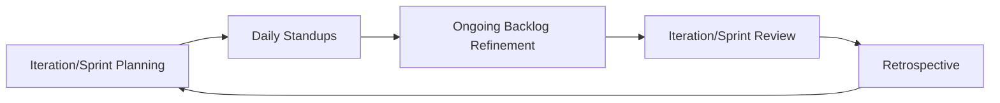

## 26.2 Daily Standups, Iteration/Sprint Planning, Reviews, Retrospectives

Agile methodologies, whether Scrum, Kanban, or other frameworks, emphasize continuous collaboration, transparency, and improvement. One of the most recognizable aspects of Agile approaches is a series of short, focused ceremonies or events designed to maintain team momentum and deliver frequent value. In this section, we take an in-depth look at four key Agile events: Daily Standups, Iteration (or Sprint) Planning, Iteration (or Sprint) Reviews, and Retrospectives. While each event serves a distinct purpose, collectively, they help maintain alignment, adapt to changes swiftly, and ensure continuous improvement throughout the project life cycle.

Below, we break down each ceremony’s purpose, typical frequency, primary participants, desired outcomes, best practices, and potential pitfalls. We will also look at how these events fit into Agile, hybrid, and sometimes even traditional (predictive) contexts—especially when organizations adopt selective Agile practices while retaining some structured project governance.

---

### Daily Standups

Daily Standups (often called Daily Scrums in the Scrum context) are short, time-bound meetings—typically 15 minutes or less—where the team synchronizes activities and identifies roadblocks. They are a cornerstone of many Agile frameworks.

#### Purpose
• Encourage regular communication among team members.  
• Provide quick updates on progress and any impediments.  
• Realign tasks with immediate project objectives.  
• Reinforce accountability within the team.  

#### Frequency
• Occurs once per day (usually at the same time and place).  
• In some distributed teams, a virtual standup might be necessary to accommodate different time zones.  

#### Typical Attendees
• The Core Delivery Team or Development Team (in Scrum contexts).  
• The Scrum Master or Team Facilitator (if using a Scrum-like framework).  
• Product Owner attendance is optional in some setups but can be beneficial.  
• Stakeholders typically do not attend, allowing the session to remain short and focused.  

#### Desired Outcomes
• Team members leave the meeting with a clear understanding of each other’s progress and any outstanding dependencies.  
• Immediate identification and escalation of blockers to the right channels for swift resolution.  
• Continual alignment against sprint or iteration goals.  

#### Best Practices
1. Keep it short and focused: If it takes longer than 15 minutes, it’s not a standup—it has turned into a discussion or problem-solving forum.  
2. Use three guiding questions:  
   1) What did you accomplish since the last standup?  
   2) What do you plan to work on today?  
   3) What (if anything) is blocking your progress?  
3. Stand up physically (if in the same location) to reinforce brevity.  
4. Parking lot approach: Defer lengthy discussions for after the standup, involving only relevant team members.  

#### Potential Pitfalls
• Turning the standup into a status update for the Product Owner or manager—daily standups are team-driven check-ins, not top-down monitoring tools.  
• Spending too much time on problem-solving instead of scheduling a separate session.  
• Allowing tangential discussions to consume time, causing disinterest among other team members.  

#### Example Scenario
Imagine a software development team creating a mobile banking application. Each morning, they gather for 15 minutes in front of a task board. They quickly share progress on tasks related to security features and user interface elements. One developer mentions that a key API endpoint is consistently failing tests; the team decides that a post-standup breakout with the DevOps engineer is needed so it does not delay the entire standup—or worse, the entire iteration.

---

### Iteration (Sprint) Planning

Iteration Planning (often referred to as Sprint Planning in Scrum) is the session at the start of each iteration where the team plans and commits to the work they will accomplish within the upcoming cycle. In Agile, these cycles typically last from one to four weeks.

#### Purpose
• Define the iteration goal and the backlog items that will achieve that goal.  
• Establish a realistic scope of work based on team capacity and velocity.  
• Clarify requirements and ensure the entire team understands the acceptance criteria.  
• Align team members on how they intend to approach the work and break down tasks.  

#### Frequency
• Occurs once at the beginning of each iteration (or sprint). If your team operates on two-week iterations, this happens every two weeks.  

#### Typical Attendees
• The entire Delivery Team: Developers, testers, designers, and other team roles involved in creating the product deliverables.  
• The Product Owner (or equivalent role) to clarify requirements, priority, and acceptance criteria.  
• Scrum Master or Agile Coach (if applicable) to facilitate the meeting.  

#### Desired Outcomes
• Clear iteration goal describing the primary outcome or focus for the timeframe.  
• A refined iteration backlog containing user stories or tasks that the team believes it can complete.  
• Agreement on work distribution and high-level task breakdown among team members.  
• Shared understanding of how success will be measured and demonstrated by the end of the iteration.  

#### Key Steps in Iteration Planning
1. **Review the Product Backlog**: The Product Owner presents the highest-priority items.  
2. **Pull Items into the Sprint Backlog**: The team selects items they can realistically achieve, relying on metrics like velocity or capacity.  
3. **Estimate and Break Down Work**: Each story is estimated (if the team uses story points or hours) and broken down as needed.  
4. **Define the Sprint Goal**: The team finalizes an overarching goal guiding the iteration.  
5. **Create Delivery Plan**: The team outlines how they will collaborate to complete all tasks within the iteration timeframe.  

#### Best Practices
1. Involve the entire team in detailed discussions on user stories to ensure clarity and consensus.  
2. Use velocity or a capacity-based approach to avoid over-committing.  
3. Keep an eye on dependencies or tasks that require external input.  
4. Integrate risk mitigation activities and testing tasks into the plan to avoid last-minute surprises or scope creeps.  

#### Potential Pitfalls
• Overcommitting or allowing external pressures to push more work into the iteration than is feasible.  
• Lack of clarity on acceptance criteria leading to misunderstandings about when a story is “done.”  
• Failing to update the backlog or leaving it unclear, which leads to a chaotic iteration.  

#### Example Scenario
A digital marketing team is planning their two-week iteration to finalize a campaign landing page. The Product Owner prioritizes tasks like content creation, layout design, A/B testing setup, and analytics instrumentation. The team leverages past iteration velocity (e.g., 20 story points) as a guide and decides they can manage the top five user stories within the new iteration. They explicitly define acceptance criteria for each story, such as “Landing page must load in under 3 seconds” and “Analytics must track at least five user interactions.”  

---

### Iteration (Sprint) Reviews

The Iteration (Sprint) Review is an opportunity for the team to demonstrate completed work and gather feedback from stakeholders. It is designed to ensure that the product evolves in alignment with stakeholder expectations and business goals.

#### Purpose
• Show stakeholders the increment of product or service functionality delivered during the iteration.  
• Solicit immediate feedback that can be incorporated into the Product Backlog or future iterations.  
• Validate that the team is on track in meeting customer or business objectives.  

#### Frequency
• Occurs once at the end of each iteration or sprint.  
• Depending on the team’s iteration length (one-week, two-week, or monthly), the review is scheduled accordingly.  

#### Typical Attendees
• The Core Delivery Team.  
• The Product Owner.  
• Key Stakeholders (managers, customers, end-users).  
• Scrum Master or Agile Coach may facilitate, but in many teams, the Product Owner leads.  

#### Desired Outcomes
• Transparency into the functionality delivered during the iteration.  
• Real-time feedback that the team can act on immediately or in future sprints.  
• Updated understanding of user requirements and business needs as the product evolves.  

#### Review Meeting Flow
1. **Introduction**: The Product Owner or Scrum Master sets the context, iteration goal, and scope.  
2. **Demonstration**: The Dev Team shows completed backlog items meeting the “Definition of Done.”  
3. **Feedback Collection**: Stakeholders discuss how well the delivered features meet expectations.  
4. **Backlog Updates**: The Product Owner revises or reprioritizes backlog items based on new insights.  
5. **Wrap-Up**: Agreement on the overall progress and next steps.  

#### Best Practices
1. Keep it interactive: Encourage stakeholders to try out the product increment themselves if possible.  
2. Focus on working functionality: Show real results, not PowerPoint slides or partial prototypes.  
3. Address feedback promptly: Ensure new ideas or changes are quickly assessed and prioritized in the backlog.  

#### Potential Pitfalls
• Treating the review as a mere formality instead of genuinely seeking feedback.  
• Demonstrating incomplete or non-functional work, blurring the line of what “finished” really means.  
• Allowing the review to become a blame session if stakeholders are frustrated rather than turning it into constructive dialogue.  

#### Example Scenario
A robotics project team completes an iteration focusing on new software enabling a robot to autonomously navigate a predefined maze. At the iteration review, they demonstrate the robot successfully traversing the maze. Stakeholders excitedly propose adding collision-avoidance sensors for future expansions. The Product Owner adds the sensor-related user stories to the backlog for prioritization, ensuring these enhancements are considered in subsequent iterations.

---

### Retrospectives

The retrospective is a "look back" meeting where the entire team inspects its processes, collaboration, and efficiency. By openly discussing what worked well and what needs improvement, teams improve their ways of working in continuous increments.

#### Purpose
• Reflect on the iteration to identify improvements in both process and people dynamics.  
• Reinforce positive behaviors and correct dysfunctional patterns.  
• Encourage a culture of continuous learning and adaptation.  

#### Frequency
• Occurs at the end of each iteration, immediately after or soon after the Sprint Review.  
• In some teams, mid-iteration retrospectives or short “health checks” are added if the iteration is long.  

#### Typical Attendees
• The Delivery Team.  
• The Scrum Master or Agile Coach as a facilitator.  
• The Product Owner is often encouraged to participate, especially if team interactions and processes involve them directly.  

#### Desired Outcomes
• A short action plan with concrete improvements—to be tested in the next iteration.  
• A shared commitment to implementing the identified process changes.  
• Stronger trust and communication within the team.  

#### Retrospective Techniques
1. **Start, Stop, Continue**: Team members note practices they want to start, stop, or continue.  
2. **Mad, Sad, Glad**: Team members share what made them mad, sad, or glad during the iteration.  
3. **5 Whys**: Dig into root causes of issues by asking “why” multiple times, leading to deeper insights.  
4. **Fishbone Diagrams**: Identify categories of potential root causes, such as methods, manpower, or materials.  

#### Best Practices
1. Maintain a safe environment for open dialogue. Avoid blaming individuals; focus on the process.  
2. Track retrospective action items. Revisit them in subsequent retrospectives to ensure follow-through.  
3. Keep it creative: Rotate facilitation styles and methods to keep retros fresh.  

#### Potential Pitfalls
• Not implementing identified improvements, rendering the meeting purely symbolic.  
• Allowing dominant voices to overshadow quieter team members.  
• Overfocusing on negative points without celebrating wins and reinforcing good practices.  

#### Example Scenario
A game development team holds a retrospective at the end of a two-week iteration. They discuss a successful release of a new level design but note that code review times were delayed. The team decides to “Start” scheduling daily code review windows, “Stop” leaving code merges until the last day of the sprint, and “Continue” their successful practice of collaborative whiteboard design sessions. These action items are then integrated into the forthcoming iteration’s working agreements.

---

### Visualizing the Flow of Core Agile Events

Below is a mermaid diagram illustrating how these events interconnect within a typical iteration (or sprint) cycle:

In this diagram:  
• "Iteration/Sprint Planning" occurs at the start of every cycle.  
• "Daily Standups" happen each day of the iteration.  
• "Ongoing Backlog Refinement" takes place continuously to ensure future iterations are prepared.  
• "Iteration/Sprint Review" and "Retrospective" both occur near the end of the iteration, providing feedback about the product and the processes, respectively.  

---

### Integrating These Ceremonies in Hybrid and Traditional Contexts

While these Agile events stem from frameworks like Scrum, many organizations that operate in a hybrid or even a more traditional (predictive) approach find value in selecting and tailoring these ceremonies to their unique contexts:

• **Hybrid Projects**: A project might be largely predictive, with a fixed scope and timeline, but includes an iterative sub-component (e.g., software customization tasks). Daily standups and short iterative planning cycles can help the software portion remain flexible while the rest of the project abides by a fixed timeline.  
• **Traditional Projects**: Even in predominantly waterfall environments, short daily check-ins can foster transparency and facilitate faster decision-making. Iteration reviews can be adapted into formal stage-gate processes to solicit feedback on interim deliverables.  
• **Scaling Up**: In larger enterprises or programs involving multiple teams, daily standups can roll up into “Scrum of Scrums,” and iteration reviews/retros may be grouped to coordinate efforts across multiple parallel teams.  

---

### Potential Challenges and Strategies for Success

• **Distributed Teams**: Time zone differences can disrupt the frequency and timeliness of daily standups. Strategy: Find a common overlapping time window or run asynchronous updates using collaboration tools (e.g., Slack, Microsoft Teams).  
• **Cultural Resistance**: Team members might resist frequent check-ins or find them intrusive. Strategy: Emphasize the purpose of synchronization and mutual support, while ensuring the meeting remains short and focused on collective success.  
• **Misalignment with Organizational Hierarchy**: Some organizations are used to top-down communication channels. Strategy: Educate stakeholders about the collaborative ethos of Agile and ensure managers attend reviews to provide feedback rather than direct daily tasks.  
• **Underutilized Feedback**: Without effectively capturing and acting on stakeholder feedback from iteration reviews, teams stagnate. Strategy: Document feedback in the Product Backlog and quickly integrate relevant changes to keep stakeholders’ trust.  

---

### Practical Tips and Case Studies

1. **Rotating Facilitators**  
   If your team has a designated Scrum Master, it’s still helpful to occasionally rotate facilitation duties among team members. This spreads ownership of the ceremonies and builds leadership skills.  

2. **Timeboxing**  
   Strictly limit the length of each event to prevent scope creep. For instance:  
   • Daily Standup: 15 minutes  
   • Iteration Planning: 2 hours per week of iteration length (for a two-week sprint, allocate around 4 hours)  
   • Sprint Review: Typically 1-2 hours for a two-week sprint  
   • Retrospective: Typically 1-1.5 hours for a two-week sprint  

3. **Case Study: Manufacturer Implementing Agile**  
   A mid-sized manufacturing firm transitioning from a traditional stage-gate process to a hybrid model discovered that daily standups drastically cut down on email back-and-forth. By addressing blocker issues openly, they improved on-time delivery by 20%. The firm also used iteration reviews to involve non-technical stakeholders (marketing, procurement) in “touch-and-feel” sessions with prototypes, resulting in earlier detection of design flaws.  

4. **Case Study: Large Financial Organization**  
   Institution-level projects at a global bank integrated retrospective findings into monthly risk reports to executives. Improvements identified during retrospectives—such as the need for better cross-department communication—became high-level action items in the organization’s risk mitigation strategy. This approach bridged top-down governance expectations with bottom-up continuous improvement.  

---

### References and Further Reading

• Schwaber, Ken, and Jeff Sutherland. “The Scrum Guide.” scrumguides.org.  
• PMI. “Agile Practice Guide.” Project Management Institute, 2017.  
• Derby, Esther, and Diana Larsen. “Agile Retrospectives: Making Good Teams Great.”  
• Part V of this book, including Chapter 27 on Hybrid Approaches, for strategies that combine Agile ceremonies with predictive planning.  

These core Agile ceremonies remain fundamental to fostering collaboration, continuous feedback, and ongoing improvement—key enablers of delivering value in dynamic project environments.

---

## Test Your Knowledge: Agile Ceremonies Quiz



### Which of the following is the main purpose of a daily standup meeting? 
- [ ] To report to upper management on progress. 
- [x] To synchronize the team’s activities and identify blockers. 
- [ ] To finalize the product roadmap. 
- [ ] To showcase completed work to stakeholders.

> **Explanation:** The daily standup—or daily scrum—exists primarily to keep the team aligned, identify immediate impediments, and plan day-to-day adjustments. It is not meant for managerial status reports or product demos.

### In an Iteration (Sprint) Planning session, what critical artifact helps the team identify what they can feasibly deliver by iteration’s end? 
- [ ] Product Roadmap 
- [x] Velocity or capacity metrics 
- [ ] Project Charter 
- [ ] Retrospective action item list 

> **Explanation:** The team relies on its known velocity (or capacity, if velocity data is limited) to forecast how many backlog items can be completed within the iteration. This approach prevents overcommitment.

### During a Sprint Review, who primarily provides feedback about the product increment? 
- [x] Key stakeholders and the Product Owner 
- [ ] The Scrum Master 
- [ ] Only the development team 
- [ ] The quality assurance team 

> **Explanation:** While the development team demonstrates what was achieved, feedback typically comes from stakeholders, end-users, and the Product Owner to ensure alignment with business needs.

### Which of the following outcomes is most desired from a Retrospective meeting? 
- [ ] A finalized Product Backlog for the next iteration 
- [x] A set of actionable improvements to the team’s processes 
- [ ] Perfect user stories for the next iteration 
- [ ] A thorough breakdown of all previously used processes for compliance auditing 

> **Explanation:** Retrospectives exist for continuous improvement. The biggest value is the action plan to enhance the team’s processes and collaboration.

### Which statement about daily standups is true?
- [x] They are timeboxed sessions typically not exceeding 15 minutes. 
- [ ] They are reserved for the Product Owner to re-prioritize tasks. 
- [x] Their purpose is to align and identify blockers. 
- [ ] They must produce a detailed status report. 

> **Explanation:** Daily standups are short, focused synchronization events. The Product Owner may attend but does not usually use this forum to re-prioritize tasks, and formal status reports are generally not the goal.

### Which of the following represents a best practice during Iteration (Sprint) Planning? 
- [x] Involving the entire team in clarifying and estimating backlog items 
- [ ] Having only a project manager decide the sprint scope 
- [ ] Postponing scope decisions until the sprint has started 
- [ ] Skipping backlog refinement altogether

> **Explanation:** Collaboration on clarifying and estimating user stories ensures that the entire team has a shared understanding of the tasks, complexities, and constraints.

### What is a typical pitfall when conducting a daily standup? 
- [x] Turning it into a problem-solving discussion that extends beyond the allotted time. 
- [ ] Discussing just three key questions: Yesterday’s accomplishments, today’s plan, and any blockers. 
- [x] Team members using it to promptly identify issues that need offline discussion. 
- [ ] Ensuring each standup does not exceed 15 minutes. 

> **Explanation:** A common mistake is to let the standup drift into deep-dive problem solving. Instead, the team should “park” such issues for discussion immediately after the standup with the relevant individuals only.

### What best describes the frequency of a Retrospective in a standard Scrum framework? 
- [x] Once per sprint 
- [ ] Daily 
- [ ] Once at the beginning of the project 
- [ ] Twice per day during the sprint

> **Explanation:** By Scrum convention, a retrospective happens once at the end of every sprint to analyze approaches and decide on improvements.

### Which of the following is true about the Sprint Review meeting?
- [x] It involves demonstrating working functionality to stakeholders. 
- [ ] It is a time for the team to plan the next sprint in detail. 
- [ ] It replaces daily standups. 
- [ ] It focuses primarily on the team’s internal process improvements.

> **Explanation:** The Sprint Review is customer-facing—stakeholders see a demonstration of completed product increments, provide feedback, and discuss next steps.

### In an Agile Retrospective, the team identifies “Start, Stop, Continue” items. Is this a recommended practice for continuous improvement?
- [x] True
- [ ] False

> **Explanation:** “Start, Stop, Continue” is a popular retrospective framework that helps teams quickly categorize actions into new processes (start), problematic ones (stop), and beneficial practices (continue).



---

## PMP Mastery: 1500+ Hard Mock Exams with Full Explanations 

Looking to crush the PMP exam with confidence? Dive deep into 6 rigorous mock exams totaling 1500+ advanced-level questions, each accompanied by clear, step-by-step explanations. Hone your test-taking strategies, master complex topics, and build the resilience you need on exam day. Perfect for serious PMs aiming beyond fundamentals.  

Enroll now:  
[PMP Mastery: 1500+ Hard Mock Exams with Exceptional Clarity & Full Explanations](https://www.udemy.com/course/pmp-2025/?referralCode=CF83A54BC86BE27F9AFE)

_Disclaimer: This course is not endorsed by or affiliated with the PMI examination authority. All content is provided purely for educational and preparatory purposes._
