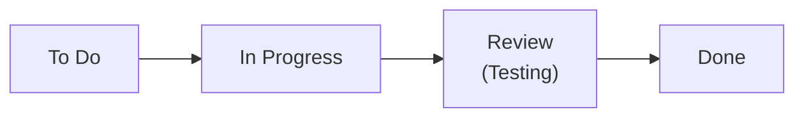

## 26.3 Visual Management Tools (Boards, Burn Charts)

Visual management is a cornerstone of Agile and Hybrid methodologies—helping teams translate complex processes into easily understandable artifacts. By immediately showing the status of work, potential bottlenecks, and progress trends, visual tools such as Boards and Burn Charts facilitate better decision-making and more cohesive team collaboration. This section explores how to leverage these tools for real-time feedback, streamlined communication, and stronger project outcomes.

  
### The Power of Visual Management

Visual management tools provide a shared, transparent view of the work. Whether your team is colocated or distributed, well-designed boards and charts draw attention to critical tasks, due dates, and dependencies. They also reduce the need for lengthy status meetings because key information is readily available at a glance, ensuring:

• Real-Time Feedback: Teams can quickly see if they are on track or behind.  
• Instant Prioritization: Members know which tasks should be addressed first.  
• Continuous Improvement: Visibility into trends reveals where processes can be refined.  
• Enhanced Collaboration: Conversations are driven by facts and real metrics rather than assumptions.  

  
### Kanban Boards

Kanban Boards were popularized by lean manufacturing and are widely used in Agile contexts. A Kanban Board is typically divided into columns that represent different stages of workflow, such as “To Do,” “In Progress,” “Review” (or “Testing”), and “Done.” Each column provides a visual snapshot of items in that particular stage. The objective is to optimize workflow efficiency by limiting the amount of work in progress (WIP) at any given column and ensuring tasks flow smoothly from start to finish.

  
#### Key Components of a Kanban Board

• Columns: Represent workflow states (e.g., To Do, In Progress, Testing, Done).  
• Cards (or Sticky Notes): Each card typically represents a user story or task, with details like owner, due date, or acceptance criteria.  
• WIP Limits: A cap on how many tasks can appear in a column at once, preventing overload.  
• Policies/Definition of Done: Agreement on conditions that must be met before a task can move to the next column.  

  
#### Example of a Simple Kanban Flow

Below is a Mermaid diagram illustrating a straightforward Kanban workflow:

In this flow, tasks progress from left to right as the team updates each card. Team members pull tasks from the “To Do” column rather than having work assigned to them, promoting a more self-organizing culture.  

  
### Scrum Task Boards

Scrum Task Boards share similarities with Kanban Boards, but they are typically used for short sprints where the scope is fixed for a 1- to 4-week iteration. These boards are commonly subdivided into columns like “Not Started,” “In Progress,” and “Completed.” The board reflects planned tasks for the sprint, tasks currently under active work, and tasks completed within the same sprint.

  
#### Comparing Scrum Boards and Kanban Boards

• Timeboxed vs. Continuous Flow: Scrum Boards are reset at each sprint, while Kanban Boards are continuous.  
• Sprint Goals vs. Flow Efficiency: Scrum Boards emphasize achieving sprint goals within a set time, whereas Kanban focuses on continuous flow and bottleneck reduction.  
• WIP Limits vs. Commitment: Scrum teams typically commit to a fixed set of items each sprint; Kanban focuses on explicit WIP limits for each workflow stage.  

  
### Burn Down Charts

Burn Down Charts measure how quickly the team is working through the backlog or sprint tasks. Along the vertical axis, you typically see the amount of work remaining (e.g., story points, effort hours, or tasks). The horizontal axis indicates time (e.g., days in a sprint). The chart usually includes two lines:

• Ideal Burn Down: A straight line from the total planned work to zero over the duration of the sprint.  
• Actual Burn Down: A day-by-day representation of how much real work is left.  

Because the chart is updated daily, teams can see whether they are behind or ahead of schedule. Large gaps between the ideal line and actual line may indicate risks or inefficiencies.  

  
#### Interpreting a Burn Down Chart

• Steep Drop: The team is completing tasks faster than expected.  
• Flat Line: Work is not being completed or updated in the tool (risk of falling behind).  
• Mid-Sprint Corrections: If tasks are added or removed during the sprint, the total scope changes, impacting lines on the chart.  

While Burn Down Charts are most often associated with Scrum, they can also be used in other methodologies to track progress over time.

  
### Burn Up Charts

Burn Up Charts are another popular alternative in Agile circles. Instead of showing how much work is left, they show how much work has been completed over time. One line represents total scope, and the other line indicates progress in completing that scope. If the scope changes (e.g., more features are added), the total scope line adjusts accordingly, making scope creep or expansion visible.  

Burn Up Charts often provide a clearer picture of changing scope levels than Burn Down Charts, which can make them especially useful for complex projects or hybrid approaches where significant scope changes are likely.

  
### Cumulative Flow Diagrams

While not strictly a “burn chart,” a Cumulative Flow Diagram (CFD) is a highly informative visual tool that helps track the overall state of work across multiple columns (or phases) in a given process. Each colored area on the chart represents tasks in a particular column. Over time, you can spot bottlenecks (where the area thickens) or unused capacity (where the area is thin).

  
#### Benefits of Cumulative Flow Diagrams

• Historical Trend Analysis: See how faster or slower the team processed tasks over time.  
• Bottleneck Identification: Pinpoint columns or workflow stages with piling tasks.  
• Predictability and Throughput: Evaluate when you can expect to deliver additional stories, features, or tasks based on average flow.  

  
### Aligning Visual Tools with Hybrid Approaches

In hybrid projects—where some aspects are managed predictively (e.g., detailed upfront planning) and others follow Agile practices—visual management tools can bridge communication gaps between different process styles. For instance, you could maintain a high-level Gantt chart for stakeholders needing a predictive timeline while also using Scrum or Kanban Boards for iterative segments of work. Burn Charts can provide a quick glimpse of how Agile tasks are progressing within each iteration while the rest of the project plan continues in a more traditional mode.

  

### Practical Examples and Case Studies

Scenario 1: Software Development Team  
• Tools Used: Scrum Board + Burn Down Chart  
• Implementation: The team’s daily standup is guided by the board, and each day the remaining task hours are updated. The Burn Down Chart is projected onto a screen so everyone sees if they’re on track to meet the sprint goal.  
• Outcome: Early identification of behind-schedule tasks, requiring the team to self-organize and redistribute workload for better flow.  

Scenario 2: Marketing Campaign Launch  
• Tools Used: Kanban Board + Cumulative Flow Diagram  
• Implementation: The marketing team creates a Kanban Board with phases like “Draft Content,” “Design Assets,” “Review,” “Publish.” The Cumulative Flow Diagram helps track the pace of content production and identifies bottlenecks in the review stage.  
• Outcome: By analyzing the CFD, managers realize a backlog forms in the design stage, motivating the addition of a second designer to reduce wait times.  

Scenario 3: Large Construction Project with Multiple Subteams  
• Tools Used: Hybrid Board + Burn Up Chart  
• Implementation: The overall project schedule is charted in a Master Gantt for city officials, while each subteam (e.g., electrical, plumbing) uses a weekly timeboxed board to track tasks. A Burn Up Chart shows how the finishing tasks accumulate completion over time.  
• Outcome: Stakeholders see the integrated predictive schedule aligns with daily updates from subteams. The Burn Up Chart reveals when a change in material supply extends the scope, prompting an updated schedule to manage stakeholder expectations.  

  
### Best Practices for Effective Visual Management

• Keep It Simple: Avoid overwhelming boards or charts with unreadable detail. Focus on essential columns, metrics, and data points.  
• Update Frequently: Visual tools lose their value if not consistently updated. Make updates a daily or routine habit among team members.  
• Encourage Collaboration: Position physical boards in a central area or adopt user-friendly digital boards so the entire team is engaged.  
• Link to Core Artifacts: Connect tasks on the board to user stories, acceptance criteria, or sprint goals so everyone understands context.  
• Reassess WIP Limits: Periodically adjust WIP limits based on historical data and team capacity.  
• Combine Tools Where Helpful: For example, a Kanban Board plus a Burn Down Chart can yield granular daily insights as well as overall completion trends.  

  
### Common Pitfalls and Challenges

• Outdated Boards: A board that is not regularly updated can cause confusion and hide risks.  
• Overcomplicating Columns: Too many columns can lead to micromanagement and hamper the flow.  
• Ignoring WIP Limits: In a Kanban system, ignoring or constantly violating WIP limits defeats the purpose of controlling flow.  
• Misinterpretation of Burn Charts: A steep slope on a Burn Down Chart may appear great, but it could mean tasks were smaller than expected or improperly estimated.  
• Lack of Executive Understanding: Leaders unfamiliar with agile dashboards might need coaching to interpret the real story behind the visual data.  

  
### When to Use Which Chart?

• Kanban Board: Ideal for continuous flow environments (software maintenance, operational tasks, marketing, etc.) with no strict timeboxes.  
• Scrum Task Board + Burn Down Chart: Perfect for sprint-based teams seeking daily transparency while measuring progress against a fixed sprint goal.  
• Burn Up Chart: Useful for tracking how scope changes over time, emphasizing both completed work and total scope.  
• Cumulative Flow Diagram: Effective for diagnosing flow issues and forecasting throughput in teams using Kanban or Scrumban.  

  
### Implementation Tips

• Start Small: Begin with a basic Kanban or Scrum task board. Gradually add burn charts as the team matures.  
• Choose the Right Metrics: Decide whether you’ll track story points, task hours, or item counts. Align these with your organization’s culture.  
• Automate Data Collection: Many Agile project management tools (e.g., Jira, Trello) automatically generate Burn Down/Up charts and CFD from board updates.  
• Train the Team: Ensure everyone understands how to interpret the board and read the charts.  
• Celebrate Milestones: Use your visual boards or burn charts to celebrate progress and keep the team motivated.  

  
### Further Reading and References

• PMI’s “Agile Practice Guide” – Provides foundational knowledge about Scrum, Kanban, and other Agile frameworks.  
• PMBOK® Guide, Seventh Edition – Emphasizes principles that can align with agile visual frameworks.  
• “Essential Kanban Condensed” by David J Anderson – A quick introduction to Kanban’s core concepts.  
• “Scrum: The Art of Doing Twice the Work in Half the Time” by Jeff Sutherland – Deep dive into Scrum, including task boards and burn charts.  

  
By embracing visual management tools—especially well-crafted boards and burn charts—you not only create a strong environment of accountability and shared ownership but also enable your team to respond, adapt, and deliver value quickly. Remember, the best board or chart is the one that is consistently maintained, accurately reflects reality, and fosters constructive dialogue within the team.

  
## Sharpen Your Visual Management Skills: Test Your Knowledge



### Which statement best describes the primary purpose of a visual management board in Agile settings?

- [ ] To generate automated resource assignments for each sprint  
- [x] To provide a real-time, transparent view of task status and progress  
- [ ] To enforce team member accountability above collaboration  
- [ ] To replace daily standup meetings entirely  

> **Explanation:** Visual management boards are designed to give an immediate snapshot of work in progress, bottlenecks, and priorities. They help the team collaborate more effectively, rather than serve as a strict enforcement mechanism or a complete replacement for communication.

### What is one key advantage of using a Burn Down Chart over other visualization tools?

- [x] It offers a straightforward, daily snapshot of how much work remains in a timebox  
- [ ] It highlights each individual’s exact productivity contributions  
- [ ] It prevents any scope additions or changes mid-sprint  
- [ ] It consolidates risk management data for external stakeholders  

> **Explanation:** Burn Down Charts plot the remaining work over time and are updated daily, making it very easy to see whether the team is on track to complete its sprint work within the timebox. They do not prevent scope changes, nor do they depict individual productivity.

### Which of the following is a best practice for maintaining a Kanban Board?

- [x] Limiting work in progress (WIP) for each column to avoid bottlenecks  
- [ ] Adding as many columns as possible to represent each micro-task  
- [ ] Allowing tasks to skip columns to reduce time in development  
- [ ] Placing completed tasks back into “To Do” for clarity  

> **Explanation:** WIP limits help avoid overburdening any single phase and keep the team focused. Excessive columns, skipping stages, or moving completed tasks into “To Do” all reduce clarity and the board’s effectiveness.

### Which visual tool helps teams both see how much work is completed and track changes in total scope over time?

- [ ] Burn Down Chart  
- [x] Burn Up Chart  
- [ ] Cumulative Flow Diagram  
- [ ] Milestone Chart  

> **Explanation:** A Burn Up Chart displays the completed work line alongside the total scope line; as scope expands or contracts, it becomes visually obvious. This visibility is especially beneficial for complex or evolving project scopes.

### In a Cumulative Flow Diagram (CFD), a thickening band in the “In Progress” area typically indicates:

- [x] A bottleneck where tasks are accumulating  
- [ ] That tasks are being completed too quickly  
- [x] More tasks entering the “In Progress” stage without leaving it  
- [ ] Additional columns are needed to track subtasks  

> **Explanation:** The thickness of a color band on a CFD represents the quantity of work in that stage. If one stage’s band widens significantly, tasks are piling up, suggesting a flow problem.  

### Which scenario demonstrates an ideal use case for a Hybrid Board?

- [x] When a portion of the project follows a predictive schedule, while another uses iterations for new feature development  
- [ ] When all project activities have rigid fixed milestones and no iterative elements  
- [ ] When the team strictly follows Scrum and has no variations  
- [ ] When the PMO disallows any changes after project initiation  

> **Explanation:** Hybrid Boards help merge traditional scheduling with agile tasks, especially when a project has segments that benefit from iterative development and others that require predictive constraints.

### A common pitfall when managing Burn Charts is:

- [x] Failing to update them daily, leading to inaccurate representations of progress  
- [ ] Using consistent units of measure for scope completion  
- [x] Giving the team real-time feedback on progress  
- [ ] Representing scope changes visually  

> **Explanation:** Burn Charts lose their value if not updated frequently. Not updating them daily can obscure real progress or roadblocks, misleading the team and stakeholders.

### What is a recommended first step for teams new to visual management tools?

- [x] Start with a simple board (e.g., a basic Scrum or Kanban Board) and add complexity later  
- [ ] Build an advanced CFD with multiple columns and layers of detail  
- [ ] Immediately track all tasks in a combined Burn Down and Burn Up Chart  
- [ ] Skip daily updates until the team is more experienced  

> **Explanation:** Launching a simple, well-maintained board sets a solid foundation. Additional complexity (e.g., integrated charts or advanced analytics) can be added once the team is comfortable with the basics.

### If a Kanban Board shows minimal tasks in “Done” but a large backlog in “Review,” the team should:

- [x] Investigate why items are stuck in “Review” and consider adjusting WIP limits or resource allocations  
- [ ] Add another “Review” column to make the board look more organized  
- [ ] Move items directly from “In Progress” to “Done” to bypass delays  
- [ ] Eliminate the backlog from the board to present a clearer visual  

> **Explanation:** A pileup in “Review” indicates a bottleneck. The team should identify the reason (e.g., lack of reviewers, unclear acceptance criteria) and adapt the process or resources accordingly.

### Burn Down Charts are most often analyzed during:

- [x] Daily Scrums or Standups  
- [ ] Monthly Steering Committee Meetings  
- [ ] End-of-year financial reviews  
- [ ] Only after sprint review sessions  

> **Explanation:** Burn Down Charts should be revisited each day so the team can quickly spot trends and adjust accordingly. Daily Standups are an ideal forum to do so.



---

## PMP Mastery: 1500+ Hard Mock Exams with Full Explanations 

Looking to crush the PMP exam with confidence? Dive deep into 6 rigorous mock exams totaling 1500+ advanced-level questions, each accompanied by clear, step-by-step explanations. Hone your test-taking strategies, master complex topics, and build the resilience you need on exam day. Perfect for serious PMs aiming beyond fundamentals.

Enroll now:  
[PMP Mastery: 1500+ Hard Mock Exams with Exceptional Clarity & Full Explanations](https://www.udemy.com/course/pmp-2025/?referralCode=CF83A54BC86BE27F9AFE)

_Disclaimer: This course is not endorsed by or affiliated with the PMI examination authority. All content is provided purely for educational and preparatory purposes._
