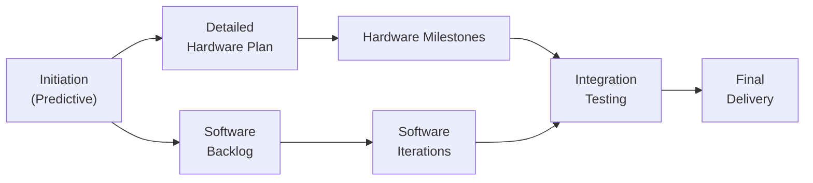

## 27.1 Combining Predictive and Agile Techniques

Hybrid project management—melding traditional predictive processes and Agile approaches—offers a powerful way to balance structure with adaptability. By combining the stability of plan-driven methods with the flexibility of short-cycle iterations, project teams can control scope, manage risk, and respond to change without sacrificing accountability or quality.

This section provides a comprehensive guide to integrating both predictive and Agile elements to achieve optimal results. You will learn the principles behind hybrid delivery, explore best practices for tailoring methods to specific project requirements, and discover techniques for streamlining governance, stakeholder communication, resource allocation, and team dynamics.

### Why Hybrid Approaches Matter
Hybrid approaches leverage the best of both worlds:

• Predictive (Traditional) aspects help ensure stable planning, disciplined budgeting, and stakeholder clarity from the outset.  
• Agile (Adaptive) aspects allow for rapid feedback, iterative improvements, and a strong collaboration culture.  

When combined thoughtfully, organizations gain multiple benefits:
- Enhanced responsiveness to market or technology changes.  
- Better stakeholder engagement through frequent deliverables.  
- Improved risk management with early detection and mitigation.  
- Greater control over costs and schedules through baseline tracking and iterative reviews.  

### Fundamental Principles of Hybrid Project Management
Several core principles guide any hybrid approach:

1. **Tailoring**: As discussed in Chapter 5 (PMI’s 12 Project Management Principles) and Chapter 9 (Development Approach and Life Cycle Performance Domain), tailoring ensures that methods align with the project’s complexity, market dynamics, and organizational culture.  

2. **Incremental Value Delivery**: While predictive teams use a formal project plan to sequence tasks, Agile teams focus on frequent increments of value, such as working prototypes or completed features. The hybrid approach preserves a master schedule while allowing iterative work cycles for high-priority deliverables.  

3. **Collaborative Planning**: Similar to the Rolling Wave Planning approach in Chapter 10 (Planning Performance Domain), hybrid teams refine the long-term master plan at regular intervals. Following each increment, they update the schedule, budget, risk register, and resource plan.  

4. **Integrated Governance**: A cohesive governance framework blends formal change control (Chapter 15, Integration Management) with the Agile notion of open backlog management. This means changes are evaluated systematically, yet the team remains flexible enough to adapt short-cycle work items.  

5. **Transparent Communication**: Frequent demos, daily standups, and iterative retrospectives align with the formal stakeholder and communications management processes (Chapter 16). The result is an environment of shared ownership and continuous improvement.  

### Choosing the Right Blend of Predictive and Agile
No single hybrid formula works for every project. The amount of flexibility versus structure depends on several factors:

- **Project Complexity**: Highly complex projects with evolving requirements may favor more Agile iterations. Straightforward projects with stable scope typically need more predictive elements.  
- **Regulatory and Compliance Needs**: In heavily regulated environments, certain milestones and documentation deliverables must follow a strict timeline (see Chapter 31 on Advanced Compliance). Embedding Agile sprints can still work, but they must be framed within the required checkpoints.  
- **Market Volatility**: Fast-changing industries benefit from iterative feedback loops, faster time to market, and the ability to pivot.  
- **Stakeholder Expectations**: Some stakeholders (e.g., public sector or large enterprise clients) may dictate formal gating processes, requiring robust predictive checks and balances.  
- **Team Maturity**: Teams familiar with Agile can experiment with looser structures. Less experienced teams may need more predictive guardrails to ensure they stay on track.  

### Best Practices for Integrating Predictive and Agile

#### Establish a Hybrid Governance Model
Predictive approaches often employ stage gate reviews, formal sign-offs, and a comprehensive project charter from the beginning (Chapter 15). Agile frameworks emphasize continuous backlog grooming, daily standups, and retrospective-based improvements. A successful hybrid governance model includes:

- **Project Charter**: Created during initiation, clarifies goals, scope, boundaries, and success criteria.  
- **Rolling Backlog**: Maintained by a product owner (or similar role) with collaborative input from stakeholders.  
- **Phase or Stage Gates**: Formal checkpoints at major milestones to assess feasibility, ROI, or compliance.  
- **Change Control Board (CCB)**: A recognized decision-making body that reviews proposals for significant scope, budget, or schedule changes.  
- **Regular Retrospectives**: Iteration or sprint retrospectives after each cycle to gather lessons learned, and feed them back into the master plan.

#### Combine Upfront Planning with Iterative Delivery
One of the core challenges is reconciling a top-heavy planning process with the fluid nature of iterative work. A practical approach:

- **Initial Predictive Baseline**: Identify high-level scope, cost, and timelines. Create a Work Breakdown Structure (WBS) at a broad level (refer to Chapter 17: Scope and Requirements Management and Chapter 18: Schedule Management).  
- **Incremental Elaboration**: Break down the highest-priority tasks into user stories or deliverable increments, scheduling them in short time-boxed sprints (e.g., two to four weeks).  
- **Forecast with Rolling Wave**: Update the schedule and budget forecasts at each iteration boundary. Keep some buffer for unexpected changes.  
- **Parallel Execution**: For example, a hardware component might be managed predictively (structural design, manufacturing stages), while software integration uses sprints.  

#### Maintain a Shared Definition of Done
While Agile teams rely on a “Definition of Done” for increments, predictive teams focus on formal acceptance criteria. Develop a unified set of completion requirements that merges Agile acceptance criteria with relevant documentation or compliance needs. This fosters clarity across the entire project team about when a deliverable truly meets the project’s requirements.

#### Clear Roles and Responsibilities
Hybrid models can introduce confusion if roles are not delineated. A single project may include:
- **Project Manager (PM)**: Owns the master schedule, budget, and formal reporting.  
- **Product Owner or Business Analyst**: Coordinates the backlog with stakeholder input, bridging agile tasks and formal requirement documents.  
- **Scrum Master or Agile Coach**: Facilitates iteration ceremonies, ensures team self-organization, and removes obstacles.  
- **Dev/Engineering Leads**: Execute tasks, provide technical expertise, manage daily progress.  

#### Foster Communication and Collaboration
Communication strategies discussed in Chapter 16 (Stakeholder and Communications Management) apply strongly in a hybrid environment:
- **Daily Standups**: Agile-style, 15-minute syncs for immediate issues.  
- **Milestone Reviews**: Predictive-style, formal check-ins at the end of major phases or stage gates.  
- **Sprint Reviews**: Demo new deliverables and gather user/stakeholder feedback.  
- **Status Reporting**: Provide a consolidated view that merges sprint metrics (e.g., velocity, burndown charts) with predictive measures (e.g., earned value, baselined schedule).  

#### Integrated Risk Management
Chapter 22 (Risk and Uncertainty Management) provides a foundation for robust risk strategies. In a hybrid context:
- **Predictive Tools**: Formal qualitative and quantitative risk analysis, risk registers, RACI charts, risk scoring.  
- **Agile Tools**: Ongoing identification of impediments, real-time risk response adjustments within each iteration.  
- **Combined Approach**: Use daily standups, iterative retrospectives, and risk registers to keep risk visibility high. Reassess risk severity before each sprint or milestone.  

### Example: Hybrid in a Software + Hardware Project
Consider a project that integrates a new sensor hardware component with a custom software application. The hardware development team uses a predictive approach with rigid milestones—requirements and design specifications, manufacturing, compliance, and installation. The software development team runs iterative sprints to incrementally develop user stories and frequently test and showcase prototypes.

The project manager maintains a master Gantt chart that outlines major hardware deliverables and key integration milestones. Meanwhile, the software team uses a backlog and sprint cadence to organically refine features. During monthly governance reviews, the entire project leadership team evaluates cost, schedule, risk, and integrated readiness. The hardware timeline is updated only if major changes occur, while software changes are updated each sprint.

Below is a simplified Mermaid diagram illustrating this flow:

In this model:
- Formal documents (like hardware specifications) anchor major predictive checkpoints.  
- The software backlog evolves iteratively, adjusting as new feedback emerges.  
- Integration testing merges both streams, ensuring alignment before final delivery.  

### Hybrid Planning and Control Mechanisms

#### Blended Scheduling
Use a high-level predictive schedule to map major phases, resource needs, and cost overviews. Within each phase, embed iterative sprints for any portion that requires adaptive delivery. Update phase deadlines if multiple sprints reveal changing priorities, scope, or technical challenges.

#### Earned Value with Agile Components
Earned Value Management (EVM) can be combined with Agile metrics. For instance:

• Planned Value (PV) is tied to each sprint’s planned story points or deliverables.  
• Earned Value (EV) can be calculated at each iteration’s completion for finished increments.  
• Actual Cost (AC) is the total labor, material, and overhead costs incurred.  

The following KaTeX formulas illustrate basic EVM relations:


EV = \text{Story Point Completion} \times \text{Budget per Point}



SV = EV - PV



SPI = \frac{EV}{PV}


By mapping story points to an agreed-upon monetary value, you can track productivity and progress while maintaining financial accountability.

#### Common Challenges and How to Overcome Them
1. **Cultural Resistance**: Team members accustomed to traditional methods may be skeptical of iterative cycles. Host training sessions and encourage early wins with small Agile experiments.  
2. **Misaligned Timelines**: Predictive tasks may lock in deadlines that conflict with iteration-based discoveries. Build extra buffer and ensure the schedule has some flexibility for scope changes.  
3. **Conflict in Governance**: Overly strict change boards can stifle agility, while purely emergent backlog changes can risk schedule overruns. Define thresholds for changes that need formal review versus those that can be absorbed in normal sprints.  
4. **Integration Risks**: Partial pilot runs or frequent integration testing can mitigate surprises late in the project.  
5. **Communication Overhead**: Hybrid teams use both standups and milestone reviews. Avoid duplication by reusing content from daily standups in the formal reports.  

### Key Success Factors
- Establish clear objectives for each portion of the work (predictive vs. iterative).  
- Develop an adaptive master plan that is regularly reviewed and updated.  
- Use open, frequent communication channels to align all stakeholders.  
- Emphasize continuous improvement through retrospectives and lessons learned.  
- Familiarize the team with both sets of methodologies so they can navigate seamlessly.  

### Further Learning and References
- PMI. (2021). PMBOK® Guide – Seventh Edition.  
- PMI. (2017). Agile Practice Guide.  
- Chapter 9 in this book for a deeper exploration of selecting and tailoring life cycles.  
- Chapter 10 for best practices in rolling wave planning.  
- Chapter 24 for a strong foundation in Agile mindset and principles.  

Combining predictive and Agile techniques can transform how you deliver projects, harnessing the best features from each approach. By tailoring methods to fit your project’s context, you can achieve stable governance, robust risk management, and the adaptability required to inspire stakeholder confidence and keep pace with change.

---

## Hybrid Project Management Knowledge Quiz



### Which principle is key in deciding how much predictive vs. Agile detail to include?
- [ ] Standardization
- [x] Tailoring
- [ ] Estimation
- [ ] Formal Approval

> **Explanation:** Hybrid approaches rely on tailoring methods, tools, and practices to fit a project's complexity, team experience, and regulatory demands.

### Which statement best describes the benefit of combining iterative cycles with a predictive baseline?
- [x] It provides strong initial planning with the flexibility to adapt incrementally.
- [ ] It replaces all formal approvals with constant change requests.
- [ ] It eliminates altogether the need for stage gates and sign-offs.
- [ ] It removes the need for a product backlog.

> **Explanation:** A hybrid approach allows for stable high-level structure (predictive) and iterative adaptation within that structure (Agile).

### What is one of the biggest challenges when integrating Agile increments within a predictive milestone framework?
- [ ] Having separate risk management plans
- [x] Synchronizing completion timelines for each phase
- [ ] Using a definition of done in the backlog
- [ ] Having a project manager and a product owner

> **Explanation:** When simultaneous increments follow different paces of progress, matching sprints to the predictive timeline can be tricky and requires careful planning.

### Which of the following techniques helps measure productivity in a hybrid environment?
- [x] Linking story points to planned value (PV) or earned value (EV)
- [ ] Using only time-tracking spreadsheets with no agile data
- [ ] Replacing all EVM metrics with daily standups
- [ ] Running unstructured retrospectives without metrics

> **Explanation:** Utilizing EVM in conjunction with Agile story points allows a hybrid team to unify financial and progress metrics.

### Which role is most responsible for regular grooming and prioritization of incremental deliverables?
- [ ] Project Sponsor
- [x] Product Owner (or Business Analyst in some models)
- [ ] Stakeholder Committee
- [ ] PMO

> **Explanation:** The product owner, or a similar role (e.g., business analyst), ensures that the backlog reflects stakeholder needs and is updated as new insights emerge.

### A strong governance model in hybrid project management typically includes:
- [x] Iteration retrospectives, stage-gate reviews, and a Change Control Board
- [ ] Sporadic check-ins and only high-level documentation
- [ ] Eliminating backlog priority updates
- [ ] Full autonomy for Agile teams with no oversight

> **Explanation:** Successful hybrid projects balance formal governance mechanisms with iterative feedback loops and retrospectives.

### During which project phase do teams most commonly begin applying iterative cycles if employing a hybrid approach?
- [x] Execution, after establishing a broad baseline scope and schedule
- [ ] Closing, as a final step to refine leftover requirements
- [x] Planning, simultaneously with initiation sign-offs
- [ ] No iterative cycles are included in hybrid

> **Explanation:** Typically, the project begins with a high-level plan (predictive), then launches iterative cycles within the scope of that plan—often in parallel with certain areas.

### How can a hybrid team avoid duplicating effort in daily standups and milestone reviews?
- [x] Reuse key insights from daily standups in formal reporting
- [ ] Eliminate milestone reviews
- [ ] Replace daily standups with monthly stakeholder meetings
- [ ] Never allow more than one meeting per week

> **Explanation:** Effective communication structures build on each other, using the concise issues uncovered in daily standups within milestone reports or dashboard updates.

### What is a common pitfall in merging Agile and predictive approaches?
- [x] Conflicting expectations on scope changes
- [ ] Too few deliverables
- [ ] Too much time spent on risk management
- [ ] Using backlog grooming

> **Explanation:** Without clearly defined thresholds and decision-making processes for scope changes, teams following strictly predictive methods can clash with those expecting dynamic backlog adjustments.

### Hybrid approaches allow for an iterative portion of the work while retaining traditional governance.
- [x] True
- [ ] False

> **Explanation:** Hybrid models blend iterative cycles for parts of the work and maintain predictive governance structures, balancing adaptability with oversight.



---

## PMP Mastery: 1500+ Hard Mock Exams with Full Explanations 

Looking to crush the PMP exam with confidence? Dive deep into 6 rigorous mock exams totaling 1500+ advanced-level questions, each accompanied by clear, step-by-step explanations. Hone your test-taking strategies, master complex topics, and build the resilience you need on exam day. Perfect for serious PMs aiming beyond fundamentals.

Enroll now:  
[PMP Mastery: 1500+ Hard Mock Exams with Exceptional Clarity & Full Explanations](https://www.udemy.com/course/pmp-2025/?referralCode=CF83A54BC86BE27F9AFE)

_Disclaimer: This course is not endorsed by or affiliated with the PMI examination authority. All content is provided purely for educational and preparatory purposes._
