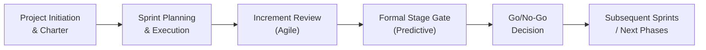

## 27.2 Governance and Approvals in Mixed Environments

Successfully blending the best of both predictive and Agile philosophies is often a balancing act between rapid iterative deliverables and formalized, structured reviews. As project management practitioners navigate hybrid settings—where elements of Agile sprints may coexist with stage gates or phase reviews—the central question becomes: “How do we maintain speed and flexibility while ensuring each decision is rigorously vetted and aligned with strategic objectives?” 

In this section, we examine the tools, processes, and cultural shifts necessary to streamline decision-making in hybrid environments while respecting organizational governance. We also look at how to coordinate formal stage gates with frequent incremental approvals, and how to adapt governance frameworks to suit different project types and complexities.

### Why Governance Matters in Hybrid Settings
Governance provides the oversight and structure required to align projects with organizational strategy and compliance requirements. While purely Agile teams may work with a lightweight approach emphasizing customer feedback loops, more traditional organizations often adhere to gate-based approvals, requiring signed-off deliverables or specific metrics. Balancing these two worlds is an art:

- Ensures strategic alignment: Governance bodies confirm that the project’s outcomes align with high-level strategy, corporate standards, regulatory requirements, and organizational culture.  
- Establishes accountability: Defined roles, escalation channels, and responsibilities clarify decision-making.  
- Manages risks: Governance frameworks guard against unchecked scope or schedule changes by reviewing risk exposures at key intervals.  
- Protects value: Consistent oversight ensures the project’s deliverables create genuine business value while preventing wasteful churn or misdirected efforts.  

### Challenges of Governance in Mixed Environments
Combining Agile’s iterative processes with a more structured gating model presents unique hurdles:

- Synchronizing Timelines: Traditional stage gates often require comprehensive documentation, while Agile teams aim for rapid increments. Aligning iteration-based outputs with formal reviews can lead to scheduling complexities.  
- Differing Definitions of “Done”: In Agile contexts, “done” might signify a functional product increment that still evolves over upcoming sprints. Predictive governance, however, may mandate a stable deliverable.  
- Stakeholder Expectations: Stakeholders accustomed to stage gates expect significant milestones, whereas Agile sponsors may accept frequent but smaller pieces of value. Bridging this gap requires education and compromise.  
- Cultural Resistance: Agile thrives on trust, transparency, and empowerment. Introducing rigorous hierarchy-based checks into an empowered team can create frustration if not handled sensitively.  

### Key Types of Approval Mechanisms
Hybrid projects typically employ multiple types of approvals:

- Phase-Based or Gate Approvals: Formal checkpoints occur at the end of project phases or major milestones. Stakeholders and governance boards review status reports, business case updates, and risk profiles.  
- Incremental (Sprint) Approvals: Frequent opportunities—such as sprint reviews—allow for decisions on incremental features, scope changes, and real-time feedback.  
- Steering Committee Approvals: A cross-functional committee, typically including senior executives, approves budgetary changes, scope expansions, and strategic pivots.  
- Emergency or Fast-Track Approvals: In high volatility contexts or high-stakes projects, an expedited process grants certain roles authority to approve changes outside normal stage gates (e.g., a sponsor or specialized “rapid response” panel).  

### Integrating Governance Approaches: A Holistic View
A key driver behind hybrid governance is approaching gates less as rigid, exhaustive reviews and more as dynamic moments for alignment. This idea is supported by the PMBOK® Guide Seventh Edition focus on principles such as adaptability, value delivery, and systems thinking. By reimagining gate approvals:

- Shift from “Inspection” to “Collaboration”: Encourage gate reviewers to engage early with the project team, contributing feedback in more iterative ways, mirroring Agile’s continuous collaboration model.  
- Use Rolling Wave Detailing: Instead of demanding every detail up-front, allow rolling wave planning to refine approvals. Approvers agree on high-level scope and budget, with more detailed governance at shorter intervals.  
- Shorten Gate Cycle Times: You can have micro-gates or “mini-checkpoints” to accelerate decision-making—particularly beneficial in complex or fast-moving project environments.  
- Embrace “Progressive Approvals”: Provide partial sign-offs (e.g., “Provisional Approval”) that let teams proceed under certain constraints, pending future validation.  

### Streamlining the Decision-Making Process
Decision-making can be streamlined through clarity, transparency, and lean processes that preserve control without piling on overhead:

#### Define Clear RACI Structures
RACI stands for Responsible, Accountable, Consulted, and Informed. By defining who initiates the decision, who must approve, who provides input, and who needs updates, you avoid confusion and duplication. In a hybrid environment, a well-designed RACI matrix can clarify:

- Which decisions require formal gate reviews.  
- Which stakeholders’ input is needed at sprint reviews versus major milestones.  
- Who can fast-track decisions in case of emergencies or to avoid bottlenecks.  

#### Combine Agile Ceremonies with Leadership Reviews
To streamline, you can merge certain gate checkpoints with existing Agile ceremonies:

- Sprint Reviews: Invite product owners, steering committee members, or compliance officers to joint sprint reviews to see progress in real time. This synergy allows governance bodies to observe actual increments and give timely feedback, rather than wait for a formal, end-of-phase presentation.  
- Demo Sessions During Stage Gates: Incorporate live demonstrations of increments at gate reviews, bridging the gap between theoretical documentation and working features.  
- Burndown or Burnup Charts in Gate Documentation: Attach agile metrics to gate deliverables so that the governance board sees real-time progress.  

#### Leverage Digital Tools & Repositories
Using shared collaboration spaces and automated approval workflows can greatly reduce manual overhead:

- Version Control Systems: Track increments of code or deliverables, enabling peer reviews and quick sign-offs.  
- Workflow Automation: Tools such as Jira, Microsoft Project, or specialized governance software can send automatic notifications when a “call for approval” is triggered, reducing the need for lengthy email threads.  
- Online Kanban Boards: Visual accountability fosters transparency, letting stakeholders see blocked tasks, progress, or impediments requiring managerial intervention.  

### Balancing Formality & Flexibility: The Stage Gate “Light” Concept
In purely predictive environments, stage gates can be formal, lengthy, and document-heavy. Agile projects resist some of that overhead, prioritizing minimal face-to-face check-ins. A “light” stage gate approach sits in the middle:

- Fewer Required Documents: Instead of a 100-page feasibility report, you might condense key data into a lean, high-level summary complemented by interactive demos.  
- Time-Boxed Reviews: Limit gate sessions to a preset duration (e.g., a maximum of one hour). Keep them targeted and outcomes-driven.  
- Cross-Functional Input: Rather than only involving top management, include representatives from the delivery team, end-users, and external specialists.  

### Example Governance Flow in a Hybrid Project

Below is a simple Mermaid diagram depicting how Agile increments and stage gates can coexist. Note the continuous iteration cycles that feed progress into formal gate reviews:

- Project Initiation & Charter: Traditional predictive planning, sponsor approval, establishment of project scope, and governance approach.  
- Sprint Planning & Execution: Agile approach to increments, immediate feedback loops, daily standups, and frequent communication.  
- Increment Review (Agile): The project team demonstrates working deliverables or partially completed features, garnering continuous stakeholder input.  
- Formal Stage Gate (Predictive): At key milestones, the organization’s governance body reviews progress, refines budgets, or modifies scope as needed.  
- Go/No-Go Decision: Formal approval is given to either continue, pivot, or stop the project.  
- Subsequent Sprints / Next Phases: The cycle repeats, with iterative development leading to eventual project closure or next-phase planning.  

### Real-World Scenarios and Case Studies

#### Case Study 1: Hybrid in a Regulated Financial Sector
A financial services company needed to update its core banking software. While the company used Agile practices internally, it was subject to rigorous audits by external regulators. To satisfy compliance:

- The team conducted fortnightly sprints, demonstrating outputs to business units.  
- Each quarter, a formal review session was held with compliance officers. Key documents like design specifications, test logs, and security checks were produced.  
- This approach shortened development while ensuring strict regulatory gates.  

#### Case Study 2: Marketing Agency and its Executive Committee
A large marketing agency required rapid digital campaign experimentation with near-daily data changes. Their executives, however, insisted on a monthly strategic checkpoint:

- Agile squads tested multiple ad campaign variations weekly.  
- The monthly governance meeting functioned like a stage gate to review ROI, campaign performance metrics, and budget allocations.  
- Approved improvements or expansions were then implemented immediately in subsequent sprints, merging fast execution with executive oversight.  

### Best Practices for Governance in Mixed Environments
- Establish a Clear Decision-Making Hierarchy: Identify who makes tactical versus strategic calls and ensure decision approvals are swiftly available.  
- Communicate the Purpose of Each Gate Clearly: Each checkpoint must deliver tangible value—cut out redundant gates.  
- Align Governance Frequency with Project Risk: Higher-risk projects may need more frequent gates; low-risk, well-understood efforts can do fewer.  
- Foster a Culture of Transparency: Incomplete or softer increments should be openly discussed rather than hidden to “pass” a gate.  
- Incorporate Risk Management Tools: As discussed in Chapters 14 and 22, risk analysis is key. Present risk registers, mitigation activities, or risk burn-down graphs at gate reviews.  

### Common Pitfalls and How to Avoid Them
- Overcrowding the Process with Excessive Approvals: More gates do not always guarantee better governance. Instead, focus on relevant, timely checkpoints.  
- Allowing Stage Gates to Delay Agility: If gates become bureaucratic or hamper momentum, allow certain low-impact decisions to be made by the team.  
- Neglecting Agile Feedback Loops: Some organizations layer stage gates on top of iterative processes but ignore the essence of Agile feedback, leading to stakeholder disengagement.  
- Failing to Adapt: Hybrid governance is not “one-size-fits-all.” Consistently tailor your approach to project size, complexity, and risk tolerance.  

### Tools & Techniques to Streamline Governance
- Collaborative Portals (Confluence, SharePoint): Store artifacts (e.g., risk registers, scope statements, velocity charts) for easy reference during gate reviews.  
- Real-Time Dashboards (EVM, Burnup Charts, Cumulative Flow): Provide instant insight into budget performance, scope stability, and schedule health.  
- Virtual Gating Sessions: Use video conferencing, screen-sharing of backlog management tools, and digital whiteboards to make gate reviews more interactive and less time-consuming.  
- Checklists & Templates: Predefined checklists for each gate reduce guesswork, ensuring compliance requirements and essential data are properly reviewed.  

### Conclusion
Hybrid governance models offer the best of both worlds: the structure and strategic alignment of stage gates alongside the responsiveness and collaboration of Agile methods. By establishing clear decision-rights, carefully timed checkpoints, and cohesive communication channels, project managers can simultaneously satisfy formal compliance requirements and optimize delivery speed and value. As organizational landscapes grow increasingly complex, leaders who master governance in mixed environments are well-positioned to deliver projects effectively—both on-time and on-strategy.

Adopting a mindset of continuous adaptation, open collaboration, and targeted oversight is the key to an efficient and value-driven governance process. By emphasizing alignment—rather than inspection—at stage gates, and blending the right ceremonies and digital solutions, teams remain flexible and productive while executives maintain the oversight they need.

---

## Quiz on Governance and Approvals in Hybrid Projects



### Which of the following best describes the main purpose of governance in hybrid environments?
- [ ] Ensuring Agile teams operate completely independently.  
- [ ] Removing all documentation to speed up deliveries.  
- [x] Providing oversight and structure to align projects with strategic objectives.  
- [ ] Prioritizing cost containment above all else.  

> **Explanation:** Governance is primarily about maintaining alignment with strategic goals, overseeing risk and compliance, and ensuring proper accountability—all while supporting both Agile and predictive methods.

### What is a key advantage of integrating stage gate reviews with Agile ceremonies such as sprint reviews?
- [ ] It allows for skipping risk management documents entirely.  
- [x] It provides real-time insights for decision-makers while reducing redundant meetings.  
- [ ] It prevents stakeholders from giving feedback until the project is finished.  
- [ ] It mandates daily escalations to the executive committee.  

> **Explanation:** Combining stage gates with Agile sprint reviews allows stakeholders to see tangible increments early and often, enabling informed decisions without unnecessary repetitive steps.

### What is one characteristic of a “stage gate light” approach?
- [x] Fewer required documents and more time-boxed gate discussions.  
- [ ] Using gate reviews only at the very end of the project.  
- [ ] Extensive paperwork for each incremental change.  
- [ ] Prohibiting stakeholder feedback until the final gate.  

> **Explanation:** A “light” stage gate approach condenses documentation, uses targeted gate meetings, and maintains agility while preserving accountability.

### In the context of a hybrid project, which statement about RACI structures is accurate?
- [ ] They should only be used in pure Agile environments.  
- [x] They help clarify who is responsible, accountable, consulted, and informed in each decision.  
- [ ] They add multiple extra layers of bureaucracy for approvals.  
- [ ] They eliminate the need for sponsor involvement.  

> **Explanation:** A RACI matrix helps avoid confusion over who initiates and approves decisions, which is critical when predictive and Agile workflows converge.

### What can happen if stage gates become too bureaucratic in a hybrid environment?
- [x] They may slow down the project, negating Agile benefits.  
- [ ] They guarantee on-time delivery regardless of complexity.  
- [x] They can discourage team autonomy.  
- [ ] They often reduce the need for stakeholder communication.  

> **Explanation:** Overly rigid gates can stifle Agile momentum and increase administrative overhead, leading to disengagement and extended timelines.

### Which of the following is a best practice for governance in mixed environments?
- [x] Tailor the cycle time of approvals to the project’s risk profile.  
- [ ] Require all decisions to go straight to executive leadership.  
- [ ] Plan all project details up-front and avoid incremental planning.  
- [ ] Restrict stakeholder access to real-time status updates.  

> **Explanation:** Projects with higher risk may require more frequent approvals and gates, whereas lower-risk projects benefit from lighter, more flexible checkpoints.

### Why might an organization opt to merge gate reviews with Agile incremental demos?
- [x] It ensures formal governance while maintaining fast feedback loops.  
- [ ] To avoid collecting formal documentation altogether.  
- [x] It promotes immediate executive involvement in daily scrums.  
- [ ] It eliminates the need for user acceptance testing.  

> **Explanation:** Integrating formal gate reviews with demos anchors governance in actual product behavior, providing immediate feedback without halting sprint rhythms.

### What should be the primary focus during a formal gate review in a hybrid environment?
- [ ] Catching team members who have failed to complete tasks.  
- [x] Verifying that the project is on track to deliver value and remains aligned with objectives.  
- [ ] Ensuring the project sponsor is present for the entire session.  
- [ ] Discussing unrelated organizational restructures.  

> **Explanation:** Gate reviews are strategic checkpoints to confirm alignment with goals, measure risk, and ensure the project is providing real value.

### Which digital tool or practice can help streamline approvals in a hybrid project?
- [ ] A locked paper-based log for each gate outcome.  
- [x] Automated notifications for gate readiness in software like Jira or MS Project.  
- [ ] Manual sign-offs for each user story with no digital records.  
- [ ] Complete reliance on verbal confirmations.  

> **Explanation:** Today, many digital tools automate approval workflows, reducing manual overhead and eliminating confusion about the approval status.

### True or False: In a hybrid project, adopting progressive approvals means the team must wait for full final acceptance before proceeding with any new features.
- [ ] True
- [x] False  

> **Explanation:** Progressive approvals allow teams to receive partial or conditional sign-offs, enabling them to move forward iteratively rather than waiting for a single complete acceptance.



---

## PMP Mastery: 1500+ Hard Mock Exams with Full Explanations 

Looking to crush the PMP exam with confidence? Dive deep into 6 rigorous mock exams totaling 1500+ advanced-level questions, each accompanied by clear, step-by-step explanations. Hone your test-taking strategies, master complex topics, and build the resilience you need on exam day. Perfect for serious PMs aiming beyond fundamentals.  

Enroll now:  
[PMP Mastery: 1500+ Hard Mock Exams with Exceptional Clarity & Full Explanations](https://www.udemy.com/course/pmp-2025/?referralCode=CF83A54BC86BE27F9AFE)

_Disclaimer: This course is not endorsed by or affiliated with the PMI examination authority. All content is provided purely for educational and preparatory purposes._
