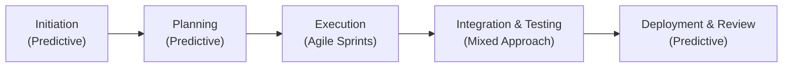

## 27.3 Real-World Examples of Hybrid Methodologies

Hybrid project management methodologies combine elements of Agile, predictive (waterfall), and other adaptive approaches, tailoring them to the context and goals of a specific project. This section explores diverse, real-world use cases of hybrid methodologies, highlighting how organizations blend structured planning with iterative development to drive quick wins, manage risk, and adapt to evolving requirements. By reviewing these examples, project managers can learn effective tailoring strategies, stakeholder engagement techniques, and practical steps to navigate common pitfalls. 

Hybrid approaches often surface when teams need the best of multiple worlds: the clarity and upfront planning of traditional predictive methods and the flexibility and accelerated feedback cycles of Agile. Whether you manage a global software development project spread across continents or a product rollout requiring stringent regulatory planning, a hybrid approach can bring structure and speed together.

---

### Why Organizations Choose Hybrid Approaches

Many organizations adopting hybrid methodologies seek:

- Faster Time to Market: Leveraging the iterative nature of Agile sprints to deliver compelling features quickly while maintaining alignment with long-term predictive boundaries like budgets, compliance milestones, or product release cycles.  
- Greater Adaptability: Rapidly exploring and fine-tuning requirements in short iterations, while preserving a high-level predictive roadmap.  
- Risk Mitigation: Balancing the security of upfront planning with the flexibility to pivot if new risks or opportunities arise mid-project.  
- Regulatory Compliance: Ensuring necessary documentation, approvals, and stage gate reviews occur, even as teams move quickly through iterative cycles of work.  

As we saw in Chapter 9 (“Development Approach and Life Cycle Performance Domain”) and Chapter 10 (“Planning Performance Domain”), tailoring the project life cycle and planning processes to the project’s needs is essential. Each example below further illustrates how that tailoring occurs in practice.

---

### Key Considerations for Crafting a Hybrid Approach

1. Governance and Control Points  
   - Decide where you need formal stage gates and constrained sign-offs.  
   - Identify which requirements must be documented thoroughly before proceeding.

2. Feedback Loops for Rapid Iteration  
   - Plan short development cycles for high-priority features or customer-driven aspects.  
   - Maintain continuous communication with stakeholders to validate assumptions quickly.

3. Resource Optimization  
   - Align resources for short sprints without sacrificing the stability of long-term predictive tasks.  
   - Avoid overallocation by coordinating schedules across both iterative and linear tasks.

4. Culture and Leadership  
   - Foster cultural readiness by training teams in Agile ceremonies while preserving traditional project management structures where needed.  
   - Encourage servant leadership (see Chapter 8, “Team Performance Domain”) to empower teams to self-organize while providing senior leadership with the transparency they need.

5. Ongoing Risk Management  
   - Reserve risk thresholds for unknowns typically handled in Agile cycles (see Chapter 14, “Uncertainty Performance Domain”).  
   - Ensure major risks with potential for significant impact undergo thorough qualitative and quantitative analysis.

---

### Case Study 1: Software-Hardware Integration at AlphaTech

#### Project Overview
AlphaTech is rolling out a new Internet of Things (IoT) solution involving firmware (hardware) and a complex cloud-based analytics platform (software). The hardware portion has a longer development cycle with fixed milestones—design, tooling, and manufacturing—while the software portion benefits from iterative releases to adjust to evolving user needs.

#### Hybrid Methodology Breakdown
- Predictive Phases for Hardware:  
  - Detailed Requirements & Planning: Electrical and mechanical designs, manufacturing supply chain, and compliance checks.  
  - Milestone-Based Stage Gates: Completion of prototypes, compliance certifications, and readiness for mass production.
- Agile Sprints for Software:  
  - Two-Week Sprints: The software development team organizes features into a backlog, prioritizes tasks via sprint planning, and delivers shippable increments every two weeks.  
  - Continuous Integration & Testing: Frequent merges, automated testing, and daily standups to uncover blockers quickly.
- Integration Points:  
  - Monthly Integration Reviews: Every month, hardware and software squads hold a joint review—hardware team presents updates, while software team demos new features.  
  - Change Control Board: Ensures that critical hardware changes impacting the software architecture (or vice versa) are approved and scheduled.

#### Results and Lessons Learned
- Better Risk Mitigation: Upfront clarity on hardware requirements and regulatory constraints prevented expensive rework.  
- Faster Time to Market: The software side iterated faster, delivering early prototypes for feedback while hardware was still in design.  
- Pitfall to Avoid: Misalignment of release cadences. The hardware team’s longer cycles sometimes clashed with the software’s shorter iterations, creating rework. Coordinating calendars and maintaining a robust Product Roadmap helped mitigate these timing issues.

---

### Case Study 2: Government IT Modernization at CityGov

#### Project Overview
CityGov, a municipal government entity, needed to modernize several public-facing portals for services like permit applications and tax payments. Stakeholders included both technical experts and legal teams ensuring compliance with public sector regulations.

#### Hybrid Methodology Breakdown
- Extensive Initiation and Requirements:  
  - Predictive Requirements Documentation: Legal compliance, privacy constraints, and multi-department user requirements were defined in detail.  
  - Agile Components Within Requirements Gathering: Workshops and user story sessions were held iteratively to capture evolving citizen feedback.
- Incremental Rollouts:  
  - Sprints for Front-End Interfaces: User experience improvements were planned in two-week sprints, with demos to gather feedback from actual users (citizens) as part of a pilot program.  
  - Predictive Back-End Upgrades: The legacy back-end system modernization required robust, step-by-step modernization to ensure data security, subject to fixed governmental approvals.
- Ongoing Stakeholder Engagement:  
  - Citizens and Department Heads: A dynamic communication plan (see Chapter 16, “Stakeholder and Communications Management”) kept cross-functional departments aligned.  
  - Regulatory Oversight: Mandatory stage gates for compliance sign-offs, security audits, and performance benchmarks.

#### Results and Lessons Learned
- Improved User Adoption: Iterative front-end updates kept citizens engaged, leading to smoother rollouts.  
- Cost and Schedule Governance: Stage gates and official audits prevented cost overruns, ensuring each module was fully vetted.  
- Pitfall to Avoid: Confusion over Roles and Responsibilities. Some teams assumed others handled security checks, creating overlap. A well-defined RACI matrix was critical for clarity.

---

### Case Study 3: Healthcare Transformation at BetaHealth

#### Project Overview
BetaHealth, a large hospital network, wanted to implement a new Patient Management System (PMS) across multiple departments. The project faced strict compliance requirements (HIPAA and privacy regulations) but also needed quick wins to adapt to evolving patient care practices.

#### Hybrid Methodology Breakdown
- Predictive Compliance Layer:  
  - Centralized Documentation: All compliance-related deliverables (system architecture diagrams, data encryption protocols, and privacy policies) were locked into a predictable timeline.  
  - Formal Sign-Offs: Stage gates for legal, security, and operational readiness ensured no unauthorized system was deployed.
- Agile Implementation for User-Facing Components:  
  - Continuous Engagement with Healthcare Professionals: Sprints included user testing sessions with nurses and administrators to refine scheduling modules, patient intake forms, and dashboards.  
  - Iterative Prototyping: Minimal Viable Product (MVP) releases allowed immediate feedback before full department-wide rollouts.
- Pilot, Then Scale:  
  - Pilot Deployment: One department tested the system first, providing a controlled environment for identifying major defects or compliance gaps.  
  - Full Rollout: Incremental expansions to additional departments once each pilot phase was deemed successful.

#### Results and Lessons Learned
- Early Issue Detection: By running an Agile pilot, the team identified crucial reliability and user-friendliness challenges early.  
- High Stakeholder Satisfaction: Staff felt their feedback mattered, significantly improving adoption rates post-implementation.  
- Pitfall to Avoid: Overlapping Sprints with High Regulatory Hurdles. Some user stories required lengthy approval, stalling sprint progress. This was resolved by better backlog grooming and prioritization of items requiring advanced lead time.

---

### Case Study 4: Start-Up Scaling at InnovateX

#### Project Overview
A small start-up, InnovateX, aimed to launch a new mobile app with real-time analytics for social engagement. The market was volatile, but they had ambitious deadlines to secure investor funding.

#### Hybrid Methodology Breakdown
- Lean Upfront Planning:  
  - Core Predictive Elements: Business cases, investor pitch decks, basic project charter, and market analysis to secure funding.  
  - Minimal Viable Plan: High-level schedule and budget, focusing on major milestones (initial prototype, beta release, final launch).
- Rapid Iterative Development:  
  - Short Sprints: Five-day sprint cycles for quick development cycles, frequent product increments, continuous user feedback via internal teams and alpha testers.  
  - Collective Decision-Making: Daily standups, weekly backlog refinement, and a flexible approach to pivot quickly in response to feedback or competitor moves.
- Hybrid Refinements:  
  - Predictive Milestones for Investor Presentations: Key demonstration deadlines were fixed, requiring certain features to be stable enough for investor review.  
  - Adaptive Post-Launch Roadmap: Once the product launched, a mix of planned marketing campaigns (predictive) and immediate feature expansions (Agile) shaped the post-launch strategy.

#### Results and Lessons Learned
- Secured Funding: On-time delivery of the alpha and beta versions impressed investors, ensuring further rounds of investment.  
- Agile Responsiveness: The team quickly fixed app performance issues discovered by initial users, improving ratings and user retention.  
- Pitfall to Avoid: Burnout Due to Fast Sprints. Developers felt pressure from continual rapid releases. The company eventually introduced a more balanced approach with rotating cooldown sprints for refactoring and strategic planning.

---

### Hybrid Project Flow – Visual Representation

Below is a generic hybrid life cycle flowchart illustrating the integration of predictive and iterative phases.

- **Initiation (Predictive)**: Charter approval, stakeholder analysis, and broad feasibility studies.  
- **Planning (Predictive)**: Creation of high-level schedule, resource planning, risk analysis (see Chapter 22, “Risk and Uncertainty Management (Revisited)”), and stage gate sign-offs.  
- **Execution (Agile Sprints)**: Iterative cycles deliver incremental features, capturing frequent feedback from end users or key stakeholders.  
- **Integration & Testing (Mixed Approach)**: Combining both a structured acceptance framework with iterative testing and continuous integration, ensuring any final hardware or external dependencies align with software increments.  
- **Deployment & Review (Predictive)**: Final release, formal approvals, final compliance checks, and transition to operations.

This structure can be adapted to contexts requiring advanced governance, such as finance, aerospace programs, or multi-phase marketing campaigns.

---

### Best Practices for Implementing Hybrid Methodologies

- **Maintain a Unified Backlog**  
  Retain a single source of truth for requirements, be they high-level predictive deliverables or dynamic user stories. This helps teams avoid conflicts in scope and ensures aligned prioritization.
  
- **Foster Strong Collaboration**  
  Conduct regular cross-functional syncs where product owners, project managers, compliance personnel, and technical leads exchange updates.  
  - Align deliverables with the overarching project roadmap.  
  - Identify dependencies early (e.g., hardware constraints or regulatory constraints).
  
- **Tailor Documentation**  
  Balance well-defined predictive documents (charters, compliance forms, and risk registers) with the lighter Agile artifacts (sprint backlogs, story boards, and burndown charts). Over-documentation can slow progress, while under-documentation can lead to confusion.
  
- **Guard Against Scope Creep**  
  Clearly articulate the scope boundaries for both the predictive and Agile components. Implement a robust integrated change control process (see Chapter 15, “Integration Management”) that ensures any scope additions get thoroughly validated.
  
- **Consider Cultural Factors**  
  Introducing hybrid methods demands a shift in mindset, particularly for teams deeply entrenched in either pure-waterfall or pure-agile. Incorporate coaching, pilot projects, and leadership support to ease transitions.

---

### Common Pitfalls and How to Avoid Them

1. **Misaligned Cadences**  
   - Predictive teams may have monthly or quarterly milestones that clash with Agile’s short iterations.  
   - Mitigation: Use a shared calendar, negotiate realistic deadlines, and plan regular integration points.

2. **Insufficient Stakeholder Involvement**  
   - In hybrid contexts, skipping stakeholder reviews can lead to untested assumptions.  
   - Mitigation: Schedule frequent reviews and demos that fit both the iterative cycle and any formal gating process.

3. **Overcomplication**  
   - Overly complex frameworks with redundant ceremonies can bog down teams.  
   - Mitigation: Start small. Scale up processes gradually, ensuring each ceremony adds value.

4. **Neglecting Risk and Compliance**  
   - Agile teams may inadvertently bypass compliance steps if not integrated into the standard sprint cycle.  
   - Mitigation: Build regulatory checks into your definition of “Done,” and keep robust risk registers updated.

5. **Role Confusion**  
   - Larger organizations can encounter confusion about who owns decisions at each stage.  
   - Mitigation: Establish a clear governance structure, with well-defined escalation paths (e.g., a PMO steering committee or integrated change control board).

---

### Practical Strategies for Success

- **Pilot the Hybrid Approach**  
  Test the new methodology on a smaller project or departmental initiative. Collect lessons learned before scaling up.
  
- **Continuous Improvement**  
  As discussed in Chapter 20 (“Quality Management”) and Chapter 5.7 (“Quality and Continuous Improvement”), adopt a Kaizen mindset: gather feedback from each sprint and stage gate, applying improvements early and often.
  
- **Data-Driven Decisions**  
  Leverage metrics from Agile boards (velocity, burndown) in tandem with Earned Value metrics or schedule performance data from the predictive side. This synergy offers more precise forecasting and performance insights.

---

### References and Further Reading

- PMI’s “Agile Practice Guide” for integrating Agile and traditional methods.  
- “Disciplined Agile” published by PMI for an extensive toolkit on scaling and tailoring Agile.  
- Industry case studies from PMIstandards+ for advanced applications of hybrid approaches.  
- “Hybrid Project Management: A Pathway to Effective Delivery” by Samir Penkar.

---

## Test Your Knowledge: Hybrid Project Management Made Practical



### Which of the following is a major benefit of a hybrid methodology?

- [ ] Eliminates the need for upfront planning entirely  
- [x] Combines the advantages of both predictive and Agile methods  
- [ ] Removes all regulatory constraints  
- [ ] Replaces stakeholder communication with automated tools  

> **Explanation:** Hybrid models allow organizations to use elements of both predictive and Agile approaches to meet compliance, stakeholder, and market requirements more effectively.  

### What is a key pitfall when mixing stage gate milestones with Agile sprints?

- [x] Misalignment of release timelines and deliverables  
- [ ] Creating smaller product increments  
- [ ] Enhanced cross-team communication  
- [ ] Selecting iterative approaches for hardware-based components  

> **Explanation:** One challenge of hybrid methods is ensuring the gated milestones and Agile sprint goals align to avoid rework or schedule conflicts.  

### Which of the following best describes the role of formal sign-offs in a hybrid project?

- [ ] They are not needed if the project team follows Agile ceremonies  
- [ ] They occur continuously within every sprint  
- [ ] They only matter during project closure  
- [x] They act as control points to ensure compliance or stakeholder approvals  

> **Explanation:** Sign-offs and stage gates are essential for maintaining compliance, especially when dealing with regulatory or contractual requirements.  

### In real-world hybrid methodologies, how are frequent feedback loops typically integrated?

- [ ] By ignoring predictive documentation and relying on sprint planning alone  
- [x] By establishing short iteration cycles within overarching predictive stages  
- [ ] By forcing daily standups for all organizational levels  
- [ ] By finalizing the plan once at the start  

> **Explanation:** Feedback loops are typically inserted into iterative cycles (sprints) while strategic governance remains predictive, ensuring continuous alignment.  

### Which statement about pilot testing in hybrid approaches is true?

- [x] Pilot testing using a hybrid method can uncover unforeseen risks before full rollout  
- [ ] Pilots usually introduce scope creep and thus should be avoided  
- [x] Pilots help in fine-tuning the approach for the wider organization  
- [ ] Pilots eliminate the need for formal risk management steps  

> **Explanation:** Conducting a pilot allows teams to see how the hybrid approach works in a smaller context, adjusting processes and solutions before scaling up.  

### What is a recommended strategy to avoid burnout in fast-paced hybrid sprints?

- [x] Introduce cooldown or buffer sprints for refactoring and planning  
- [ ] Require the team to work extra hours to avoid missing deadlines  
- [ ] Reduce the frequency of standup meetings to once a month  
- [ ] Eliminate daily collaboration events to allow more coding time  

> **Explanation:** Burnout can occur when teams push too hard, too often. Adding regular planning, refactoring, or cooldown sprints can help maintain team health and productivity.  

### In a hybrid project with a heavy compliance component, what is the best way to handle regulatory requirements?

- [x] Integrate compliance checks into the project’s definition of “Done” for each sprint, while also scheduling formal reviews  
- [ ] Postpone all compliance checks until the final release  
- [x] Add compliance tasks only for major deliverables above a certain threshold  
- [ ] Ignore compliance tasks in early sprints to speed up development  

> **Explanation:** Compliance must be integrated at every relevant stage. This ensures no last-minute surprises or non-compliant deliverables that could compromise the project.  

### How can teams best ensure iterative software development doesn’t conflict with a waterfall hardware timeline?

- [x] Keep a shared release roadmap and align sprint review dates with hardware milestone checkpoints  
- [ ] Force hardware teams to adopt two-week sprints  
- [ ] Eliminate hardware stage gates to expedite deliveries  
- [ ] Conduct all hardware activities concurrently with software sprints without coordination  

> **Explanation:** By maintaining a shared timeline and coordinating sprints with hardware milestones, both teams minimize conflict and rework.  

### Which factor most commonly causes confusion regarding roles and responsibilities in a hybrid project?

- [x] Lack of a clearly defined governance structure and escalation path  
- [ ] Daily demos and short feedback loops  
- [ ] Too many compliance requirements  
- [ ] Strict separation of the hardware and software teams  

> **Explanation:** When it’s not clear who owns which decisions, especially in a multi-method environment, teams can quickly become confused about priorities and escalation processes.  

### Hybrid projects are well-suited for which of the following statements?

- [x] True  
- [ ] False  

> **Explanation:** Hybrid projects are especially beneficial where requirements, constraints, and team dynamics vary, or when combining a stable, detailed plan with agile flexibility delivers the greatest value.  



---

## PMP Mastery: 1500+ Hard Mock Exams with Full Explanations 

Looking to crush the PMP exam with confidence? Dive deep into 6 rigorous mock exams totaling 1500+ advanced-level questions, each accompanied by clear, step-by-step explanations. Hone your test-taking strategies, master complex topics, and build the resilience you need on exam day. Perfect for serious PMs aiming beyond fundamentals.  

Enroll now:  
[PMP Mastery: 1500+ Hard Mock Exams with Exceptional Clarity & Full Explanations](https://www.udemy.com/course/pmp-2025/?referralCode=CF83A54BC86BE27F9AFE)

_Disclaimer: This course is not endorsed by or affiliated with the PMI examination authority. All content is provided purely for educational and preparatory purposes._
