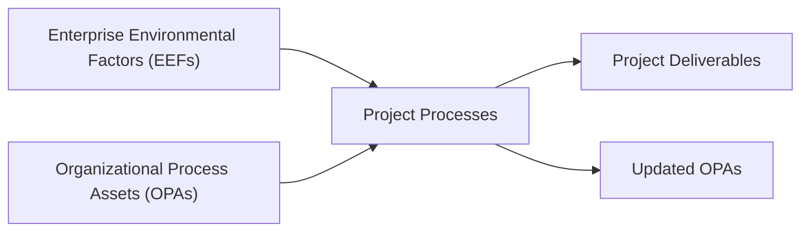

## 28.1 Enterprise Environmental Factors and OPAs

Enterprise Environmental Factors (EEFs) and Organizational Process Assets (OPAs) are pivotal resources or constraints that shape how projects are initiated, planned, executed, and closed. Alongside the project team’s expertise, these foundational elements inform decisions, influence project activities, and guide the selection of tools and methodologies.

Though these terms may first appear abstract, a solid grasp of EEFs and OPAs will enable you to tailor your project approach effectively and efficiently. This section will delve into the subtle distinctions between EEFs and OPAs, illustrate their practical implications, and help you master their use in delivering project success.

### Overview and Relevance to PMP® Exam

In both the PMBOK® Guide and the PMP® Exam Content Outline, EEFs and OPAs are pervasive, impacting nearly every domain—from scope management to stakeholder engagement. Understanding their definitions and applications is crucial to passing the exam and performing effectively in real-world project scenarios. 

EEFs generally refer to the broader environmental conditions (internal and external) that influence your project, while OPAs provide your rigor in the form of documented knowledge, processes, and procedures that exist within an organization and guide future work. PMP® candidates are frequently tested on how EEFs and OPAs serve as inputs to, or outputs from, various project management processes. Familiarity with examples of EEFs and OPAs, and knowing when and how they affect planning or change control, will prove instrumental.

### Defining Enterprise Environmental Factors (EEFs)

EEFs are conditions not under the control of the project team that influence, constrain, or direct the project. They can spur both opportunities and challenges. EEFs are commonly categorized as internal factors (arising from within the organization) and external factors (beyond the organization’s direct control).

1. **Internal EEFs**  
   - Organizational culture and structure  
   - Governance framework (e.g., project governance, hierarchical decision-making)  
   - Existing infrastructure (hardware, software tools)  
   - Resource availability (human resources, skill sets, equipment)  
   - Stakeholder risk appetite and constraints  
   - Organizational policies and procedures that are not part of OPAs (e.g., top-level strategic objectives and constraints)

2. **External EEFs**  
   - Government or industry regulations (e.g., Sarbanes-Oxley, data privacy laws)  
   - Market conditions and competitive landscape  
   - Economic climate (inflation, interest rates)  
   - Political factors (political stability, foreign policy)  
   - Social and cultural influences in local and global contexts  
   - Physical environmental conditions (geographic distribution, weather, environmental standards)  

These external or internal environments inform project choices regarding scope, scheduling, budgeting, risk management, and resource allocation. Your project survival often depends on how well you adapt to external EEFs—especially in volatile markets or heavily regulated industries.

### Defining Organizational Process Assets (OPAs)

OPAs, on the other hand, refer to the organization’s accumulated resources, methods, and knowledge bases that teams can draw upon to execute projects consistently and effectively. Unlike EEFs (which you typically cannot control), OPAs are generally within the organization’s control and can be updated or refined over time to enhance organizational maturity.

Common categories of OPAs include:

• **Processes, Procedures, and Guidelines** – Formal or informal standardized processes for initiating, planning, executing, monitoring, and closing projects. Examples:  
  – Standard forms and templates for documents such as project charters and risk registers.  
  – Pre-approved supplier lists or procurement guidelines.  
  – Governance checklists and stage-gate procedures.  
  – Change management procedures that dictate how to submit and review change requests.

• **Corporate Knowledge Base** – The repository of historical information, lessons learned, and documentation. Examples:  
  – Lessons learned databases capturing successes and pitfalls from past projects.  
  – Project files and acceptance criteria from previously completed initiatives.  
  – Contract documentation and performance reports for previous vendors and consultants.  
  – Configuration management knowledge bases, including version control logs.  

Because OPAs usually evolve within the organization, you (and your project team) have more autonomy to influence them by adding new lessons learned, refining existing processes, or introducing new best practices. This loop of continuous improvement significantly contributes to organizational growth and maturity in project management capabilities.

The table below provides a concise comparison:

| Aspect                        | EEFs                                             | OPAs                                                  |
|-------------------------------|--------------------------------------------------|-------------------------------------------------------|
| Nature                        | Mostly external or outside project control       | Internal, under organizational control               |
| Purpose                       | Pose constraints or opportunities                | Provide guidance, templates, and historical data     |
| Categories                    | Internal (culture, infrastructure) & external   | Processes & procedures, knowledge repositories       |
| Update Frequency              | Outside influences may change unpredictably      | Periodically updated based on continuous improvement |
| Example                       | Government regulations, market conditions        | Lessons learned database, project templates          |

### Relationship Between EEFs and OPAs in Project Management

In practice, EEFs and OPAs often intertwine. For instance, when a government regulation changes (an external EEF), the organization may update its compliance procedures (an OPA) to maintain alignment with the new regulation. Similarly, if a company invests in new technology, it may revise its project management methodology or training materials (OPA updates) to incorporate the capabilities or constraints introduced by that technology (an internal EEF).

Below is a Mermaid diagram visualizing their relationship in project planning and execution:

In this simplified diagram:
- **EEFs** (A) provide the constraints and guiding conditions.  
- **OPAs** (B) offer documented knowledge and standardized procedures.  
- Both flow into **Project Processes** (C), resulting in **Project Deliverables** (D).  
- Over time, experiences from (C) feed back into **Updated OPAs** (E), fueling continuous improvement.

### Influence of EEFs on Project Planning and Execution

1. **Policy and Regulations**  
   When local laws mandate certain standards (e.g., data privacy like GDPR in the EU), your planning must incorporate additional security strategies or compliance checkpoints. Failing to account for these EEFs can lead to compliance infractions, fines, and reputational damage.

2. **Organizational Culture**  
   Company culture can determine whether a project manager has easy access to stakeholders or must navigate complex hierarchical approvals. A collaborative culture might foster open communication and ad hoc feedback loops, whereas bureaucratic cultures require formal, documented sign-offs at every stage.

3. **Resource Constraints**  
   Internal EEFs like limited technical expertise or specialized equipment can affect scheduling and cost estimates. Projects requiring niche skills may need extra budget for contractual hires or training.

4. **Market Dynamics**  
   Rapid shifts in technology or consumer preferences (external EEF) might require pivoting a project toward a more agile or hybrid approach. Such changes necessitate frequent replanning and strong stakeholder communication.

5. **Economic or Political Factors**  
   Inflation and currency fluctuations can drive up costs for globally distributed teams; political instability can cause resource blocks or disrupt supply chains. Sensitivity to external signals allows the project manager to adjust risk strategies or re-evaluate scope feasibility.

By operating with heightened awareness of such EEF drivers, project managers can proactively shape their strategies, performing risk management activities that brace the project for external shocks while capitalizing on emerging opportunities.

### Influence of OPAs on Project Planning and Execution

1. **Standard Processes and Templates**  
   If your organization maintains comprehensive templates for stakeholder analysis or risk management, you can expedite initial project planning. Reliable guidelines reduce guesswork and enhance consistency across the portfolio.

2. **Brand Reputation and Historical Data**  
   Reflecting on past project performance data (e.g., actual schedules, budget forecasts vs. actual costs, lessons learned) guides realistic planning. You can set more accurate success metrics and adapt proven solutions from earlier initiatives.

3. **Knowledge Sharing**  
   OPAs often include knowledge-sharing portals or “community of practice” archives, enabling new project teams to adopt best practices swiftly. By tapping into these resources, teams spend less time on trial and error.

4. **Continuous Improvement**  
   OPAs are living documents. Each new project adds lessons that shape future updates to policies and guidelines, creating a virtuous cycle of improvement. This fosters organizational agility and resilience: each experience refines the next efforts.

5. **Alignment with Organizational Strategy**  
   Because OPAs reflect an organization’s standard practices and maturity in project management, they are deeply connected to strategic objectives. By adhering to outlined procedures and drawing from prior experiences, you ensure each project’s alignment with the overall vision and strategy.

In essence, OPAs provide you the “how,” while EEFs describe the “environment” in which that “how” must be executed.

### Practical Example: Leveraging EEFs and OPAs in a Real-World Scenario

Imagine a mid-sized software company planning to implement a new cloud-based platform for managing customer data:

• **External EEF**: The project must adhere to data privacy regulations (GDPR and CCPA). The market is also highly competitive, with customers expecting quick product rollouts.  
• **Internal EEF**: The company’s internal servers are outdated, requiring significant capital expenditure. The corporate culture places heavy emphasis on agile development, encouraging iterative releases.  
• **OPAs**: The PMO has a library of agile best practices and templates for sprint planning, daily stand-ups, and backlog prioritization. Past projects led to documented lessons regarding vendor management, especially around data security.

While planning, the project team consults these OPAs to draft sprint backlogs and decide on user story acceptance criteria. They also allocate resources by factoring internal EEF constraints—knowing that server upgrades may slow initial progress—and consider external EEF demands for robust data protection measures. The synergy of EEFs (reality constraints) and OPAs (organizational know-how) ensures the project not only remains compliant but leverages established frameworks to reduce risk and optimize results.

### Best Practices for Managing EEFs and OPAs

• **Conduct Thorough Environmental Analysis**  
  Identify relevant EEFs early—both internal and external. Look for intangible factors like organizational culture or stakeholder attitudes, which can be as influential as tangible ones like infrastructure or market forces.

• **Engage Stakeholders Proactively**  
  Engage cross-functional stakeholders to share insights into possible EEF changes (e.g., pending regulatory shifts). Their perspectives can inform risk assessments and better shape your approach.

• **Maintain a Centralized Repository for OPAs**  
  Ensure all processes, templates, lessons learned, and historical data are in a user-friendly system. Encourage teams to contribute updates regularly.

• **Review and Update Processes**  
  OPAs should be dynamic. Schedule periodic reviews to refine processes and ensure they reflect current realities. Once a project closes, revisit the OPA repository to capture new lessons learned.

• **Tailor OPAs to Project Needs**  
  While standardized templates are useful, they should be tailored to your project’s scope and complexity. Overly rigid use of OPAs can stifle creativity and risk ignoring unique EEF constraints.

• **Monitor External EEF Changes**  
  Incorporate mechanisms to monitor relevant market or regulatory shifts throughout the project life cycle. Swift adaptation to these changes can prevent project derailment or missed opportunities.

• **Communicate Changes in EEFs and OPAs**  
  If new legislation passes, or the organization updates standard processes, be sure to communicate the changes promptly to the project team. Provide training or guidance to ensure compliance and alignment with updated OPAs.

### Common Pitfalls

1. **Overlooking Cultural Nuances**  
   An organization’s stated processes may conflict with its ingrained cultural norms. Attempting to apply standard solutions without understanding the underlying culture can lead to stakeholder conflict and project resistance.

2. **Treating OPAs as Static**  
   Failing to update OPAs after gleaning lessons from new projects leads to repeated mistakes and lost opportunities for improvement.

3. **Ignoring Shifts in External Environment**  
   Over-focusing on internal factors can blind projects to external disruptions—such as new market entrants or changes in technology—and reduce a project’s competitiveness.

4. **Underestimating Regulatory Complexity**  
   Assuming that regulations or compliance issues won’t change can lead to expensive mid-project reworks or legal challenges.

5. **Over-Reliance on Templates**  
   While templates accelerate processes, using them mechanically without contextual adaptation can create mismatches between project needs and mandated procedures.

### Strategies to Overcome Challenges

• **Ongoing EEF Analysis** – Continually re-validate assumptions about the market, regulations, and internal capabilities. Use tools like stakeholder engagement assessments and risk reviews for early detection of emerging EEF changes.

• **Multidisciplinary Collaboration** – Include legal, finance, and compliance experts in planning sessions. They can offer valuable insights into regulatory EEFs.

• **Structured OPA Updates** – Implement a process for capturing lessons learned after every iteration or milestone, not just at the project’s close. This fosters real-time improvement and knowledge sharing.

• **Change Control Board (CCB) Awareness** – Ensure the project’s CCB or relevant governance body is informed about shifts in EEFs or OPAs so they can authorize or prioritize the needed changes swiftly.

• **Tailoring PM Methodologies** – Assess each project’s nature and environment to determine if a strictly predictive, agile, or hybrid approach is most suitable, factoring in both EEFs (e.g., market volatility) and OPAs (existing agile guidelines).

### Additional Considerations for Virtual and Global Teams

With the rise of distributed, global teams, EEFs increase in complexity. Time zone differences, cross-cultural communication, and varied legal frameworks must be integrated into project planning. Meanwhile, OPAs may need to expand to address remote collaboration tools, language translation considerations, and conflict resolution strategies adaptable to multicultural contexts.

In global project management, integrating EEFs and OPAs effectively is critical for consistent, high-quality deliverables across diverse regions. Detailed knowledge repositories with best practices for distributed teams can reduce friction and bolster collaboration.

### Case Study: Pharmaceutical Launch

Consider a pharmaceutical company preparing to launch a new drug in multiple countries. 

- **EEFs**:  
  • Strict regulations from the Food and Drug Administration (FDA) in the United States, the European Medicines Agency (EMA), and various government health ministries worldwide.  
  • Complex supply chain management due to cross-border shipments, climate control, and trade agreements.  

- **OPAs**:  
  • Detailed standard operating procedures (SOPs) specifically designed for clinical trials and post-market surveillance.  
  • Contract templates and established relationships with external research organizations for data collection.  
  • Historical lessons about drug launch timelines, marketing strategies, and vendor management from past launches.  

The project manager must carefully align global regulatory compliance (an external EEF) with the organization’s validated SOPs (OPAs). Each new country’s regulatory environment influences the project scope, schedule, and budget. Meanwhile, the project’s success heavily relies on the standardized procedures and historical insights that the OPAs provide. Both EEFs and OPAs must be regularly re-evaluated and updated throughout the project lifecycle, ensuring no compliance gaps exist and leveraging proven best practices in drug launch protocols.

### Looking Ahead

As organizations evolve, so do their EEFs and OPAs—shifting with new technologies, changing market conditions, and lessons from ongoing projects. An ongoing commitment to monitoring and updating these resources positions an organization to pivot effectively, remain competitive, and generate greater value from its project investments.

Project managers who effectively identify and leverage EEFs and OPAs lay a strong foundation for the rest of the project, ensuring robust performance in all domains. Additionally, a nuanced understanding of how these factors intertwine with each other differentiates adept project managers from those who merely follow a process. You will be better equipped to navigate uncertainties, engage stakeholders, and deliver successful outcomes aligned with organizational strategy.

## Test Your Knowledge of EEFs and OPAs



### Which of the following best describes Enterprise Environmental Factors (EEFs)?

- [ ] Internal resources that teams can directly control
- [x] Conditions, not under the project team’s control, that influence or constrain the project
- [ ] Organizational process documents and templates
- [ ] The final deliverables produced by the project

> **Explanation:** EEFs include any internal or external environment factors that shape how a project is planned and executed but are largely beyond direct team control.

### An organization’s documented lessons learned from past projects is an example of:

- [ ] An external EEF
- [ ] An internal EEF
- [ ] An enforceable regulation
- [x] An Organizational Process Asset (OPA)

> **Explanation:** Lessons learned reports are a prime illustration of OPAs, as they reside within organizational control and inform future project endeavors.

### Which statement accurately contrasts EEFs and OPAs?

- [x] EEFs are typically outside the project’s control, whereas OPAs are within organizational control.
- [ ] Both EEFs and OPAs are completely external to the project.
- [ ] EEFs always generate constraints, while OPAs only generate opportunities.
- [ ] OPAs and EEFs refer to the same set of guidelines.

> **Explanation:** By definition, EEFs lie outside a team’s direct influence, while OPAs can be altered or updated by the organization.

### When a government agency changes its data protection regulations, it is considered a(n):

- [ ] Internal Enterprise Environmental Factor
- [x] External Enterprise Environmental Factor
- [ ] Organizational Process Asset
- [ ] Project resource constraint

> **Explanation:** Regulatory changes come from external sources that affect the organization and project from the outside.

### Which of the following is most likely to be found in an organization’s OPA repository?

- [x] Standard project management templates
- [ ] New government regulations
- [x] Historical project performance data
- [ ] Predicted interest rate changes

> **Explanation:** OPAs include standard processes, procedures, and a repository of historical data. Government regulations and interest rate changes are EEFs.

### Why are lessons learned reports considered crucial OPAs?

- [x] They document successes and failures that inform future projects.
- [ ] They are mandated by most external regulatory statutes.
- [ ] They cannot be accessed by new project managers.
- [ ] They are rarely relevant to current projects.

> **Explanation:** Lessons learned provide insights into past project challenges and triumphs, thereby guiding continuous improvement and best practices.

### What is a recommended best practice for maintaining Organizational Process Assets?

- [x] Updating templates and guidelines after key project milestones
- [ ] Keeping them hidden from project teams
- [x] Storing them in a knowledge repository accessible to authorized users
- [ ] Discontinuing the practice of capturing lessons learned

> **Explanation:** Best practices call for regularly updating the OPA repository, including lessons learned, to reflect new knowledge and ensure easy team access.

### During the initiation phase, a project manager reviews the corporate knowledge base to shape initial schedules. This review is an example of using:

- [ ] Internal Enterprise Environmental Factors
- [ ] External Enterprise Environmental Factors
- [x] Organizational Process Assets
- [ ] Uncontrolled constraints

> **Explanation:** The corporate knowledge base is an OPA that projects can utilize to derive data and insights from past experiences.

### Which scenario best illustrates the influence of internal EEFs?

- [x] The organization’s rigid departmental hierarchy slows approval times
- [ ] Regulatory changes impose stricter emissions testing
- [ ] Natural disasters halting manufacturing
- [ ] Fluctuations in currency exchange rates

> **Explanation:** An internal EEF is a factor within the company’s environment (culture, structure, etc.), but still largely beyond direct project-level control.

### True or False: EEFs can become OPAs when the organization gains control over them.

- [x] True
- [ ] False

> **Explanation:** In rare cases, factors initially external to the project can become internal resources or get integrated into standard organizational processes over time, effectively turning certain EEF aspects (like vendor frameworks or regulatory compliance procedures) into OPAs.



## PMP Mastery: 1500+ Hard Mock Exams with Full Explanations 

Looking to crush the PMP exam with confidence? Dive deep into 6 rigorous mock exams totaling 1500+ advanced-level questions, each accompanied by clear, step-by-step explanations. Hone your test-taking strategies, master complex topics, and build the resilience you need on exam day. Perfect for serious PMs aiming beyond fundamentals.

Enroll now:  
[PMP Mastery: 1500+ Hard Mock Exams with Exceptional Clarity & Full Explanations](https://www.udemy.com/course/pmp-2025/?referralCode=CF83A54BC86BE27F9AFE)

_Disclaimer: This course is not endorsed by or affiliated with the PMI examination authority. All content is provided purely for educational and preparatory purposes._
